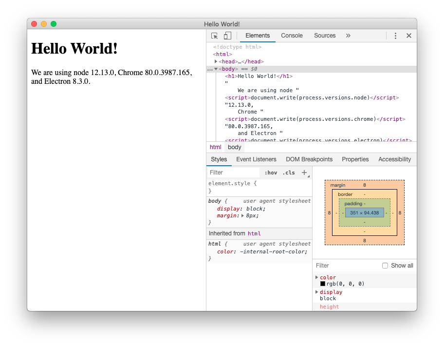

# Electron是什么？

Electron是一个使用 JavaScript、HTML 和 CSS 构建桌面应用程序的框架。 嵌入 [Chromium](https://www.chromium.org/) 和 [Node.js](https://nodejs.org/) 到 二进制的 Electron 允许您保持一个 JavaScript 代码代码库并创建 在Windows上运行的跨平台应用 macOS和Linux——不需要本地开发 经验。

## 入门指南

我们推荐您从 [教程](https://www.electronjs.org/zh/docs/latest/tutorial/tutorial-prerequisites)开始， 在开发Electron应用程序并将其分发给用户的过程中向您提供指导。 [示例](https://www.electronjs.org/zh/docs/latest/tutorial/examples) 与 [API 文档](https://www.electronjs.org/zh/docs/latest/api/app) 也是浏览并发现新事物的好地方。

## Electron Fiddle 运行实例

[Electron Fiddle](https://www.electronjs.org/fiddle) 是由 Electron 开发并由其维护者支持的沙盒程序。 我们强烈建议将其作为一个学习工具来安装，以便在开发过程中对Electron的api进行实验或对特性进行原型化。

Fiddle 已经完美的集成到我们的帮助文档之中。 当你浏览我们教程中的例子，你会发现有个「Open In Electron Fiddle」按钮在代码示例中。 如果你已经安装了 Fiddle，「Open In Electron Fiddle」按钮会打开一个 `fiddle.electronjs.org` 链接并加载示例。 `fiddle docs/latest/fiddles/quick-start`

## 文档包含哪些内容？

所有官方文档都可以在侧边栏中查阅。 以下是几个类别，以及相应的介绍：

- **教程**：如何创建并发布您的第一个 Electron 程序。
- **Electron 进程**：对 Electron 中的进程，以及如何使用它们的参考。
- **最佳实践**：在开发 Electron 程序时需要留意的一些细节。
- **示例代码**: 有了示例代码稍微改一下就可以放入 Electron 应用中.
- **开发**：有关开发的其它一些指导。
- **分发**：学习如何向终端用户分发您的程序。
- **检测和调试**: 如何调试 JavaScript, 如何编写测试代码, 还有就是如何使用其它工具快速创建 Electron 应用.
- **引用**: 版本信息相关说明
- **参与贡献**: 编译 Electron 并尝试参与贡献. 我们正在尽力让这一步骤更加简单。

## 寻求帮助

还是有疑问？ 请参考一下例子

- 开发过程中如果你需要帮助，我们的 [Discord 英文社区](https://discord.gg/electronjs) 将是绝佳讨论的地方。或前往我们的 [Discord 中文社区](https://discord.gg/eZTKXHBKpK)。
- 如果在开发过程中遇到 `electron` package里的疑难杂症，你可以去 [GitHub issue tracker](https://github.com/electron/electron/issues) 查看是否有人已经遇到相同的问题。 如果你很幸运的找到 bug，欢迎提交 issue 到 GitHub。

# 快速入门

本指南将会通过使用Electron创建一个极简的 Hello World 应用一步步的带你了解，该应用与[`electron/electron-quick-start`](https://github.com/electron/electron-quick-start)类似。

通过这个教程，你的app将会打开一个浏览器窗口，来展示包含当前正在运行的 Chromium, Node.js与 Electronweb等版本信息的web界面

## 基本要求

在使用Electron进行开发之前，您需要安装 [Node.js](https://nodejs.org/en/download/)。 我们建议您使用最新的LTS版本。

> 请使用为你平台预构建的 Node.js 安装器来进行安装， 否则，您可能会遇到与不同开发工具不兼容的问题。

要检查 Node.js 是否正确安装，请在您的终端输入以下命令：

```sh
node -v
npm -v
```


这两个命令应输出了 Node.js 和 npm 的版本信息。

**注意** 因为 Electron 将 Node.js 嵌入到其二进制文件中，你应用运行时的 Node.js 版本与你系统中运行的 Node.js 版本无关。

## 创建你的应用程序

### 使用脚手架创建

Electron 应用程序遵循与其他 Node.js 项目相同的结构。 首先创建一个文件夹并初始化 npm 包。

- npm
- Yarn

```sh
mkdir my-electron-app && cd my-electron-app
npm init
```


`init`初始化命令会提示您在项目初始化配置中设置一些值 为本教程的目的，有几条规则需要遵循：

- `entry point` 应为 `main.js`.
- `author` 与 `description` 可为任意值，但对于[应用打包](https://www.electronjs.org/zh/docs/latest/tutorial/quick-start#package-and-distribute-your-application)是必填项。

你的 `package.json` 文件应该像这样：

```json
{
  "name": "my-electron-app",
  "version": "1.0.0",
  "description": "Hello World!",
  "main": "main.js",
  "author": "Jane Doe",
  "license": "MIT"
}
```


然后，将 `electron` 包安装到应用的开发依赖中。

- npm
- Yarn

```sh
npm install --save-dev electron
```


> 注意：如果您在安装 Electron 时遇到任何问题，请 参见 [高级安装](https://www.electronjs.org/zh/docs/latest/tutorial/installation) 指南。

最后，您希望能够执行 Electron 如下所示，在您的 [`package.json`](https://docs.npmjs.com/cli/v7/using-npm/scripts)配置文件中的`scripts`字段下增加一条`start`命令：

```json
{
  "scripts": {
    "start": "electron ."
  }
}
```


`start`命令能让您在开发模式下打开您的应用

- npm
- Yarn

```sh
npm start
```


> 注意：此脚本将告诉 Electron 在您项目根目录运行 此时，您的应用将立即抛出一个错误提示您它无法找到要运行的应用

### 运行主进程

任何 Electron 应用程序的入口都是 `main` 文件。 这个文件控制了**主进程**，它运行在一个完整的Node.js环境中，负责控制您应用的生命周期，显示原生界面，执行特殊操作并管理渲染器进程(稍后详细介绍)。

执行期间，Electron 将依据应用中 `package.json`配置下[`main`](https://docs.npmjs.com/cli/v7/configuring-npm/package-json#main)字段中配置的值查找此文件，您应该已在[应用脚手架](https://www.electronjs.org/zh/docs/latest/tutorial/quick-start#scaffold-the-project)步骤中配置。

要初始化这个`main`文件，需要在您项目的根目录下创建一个名为`main.js`的空文件。

> 注意：如果您此时再次运行`start`命令，您的应用将不再抛出任何错误！ 然而，它不会做任何事因为我们还没有在`main.js`中添加任何代码。

### 创建页面

在可以为我们的应用创建窗口前，我们需要先创建加载进该窗口的内容。 在Electron中，各个窗口显示的内容可以是本地HTML文件，也可以是一个远程url。

此教程中，您将采用本地HTML的方式。 在您的项目根目录下创建一个名为`index.html`的文件：

```html
<!DOCTYPE html>
<html>
  <head>
    <meta charset="UTF-8">
    <!-- https://developer.mozilla.org/zh-CN/docs/Web/HTTP/CSP -->
    <meta http-equiv="Content-Security-Policy" content="default-src 'self'; script-src 'self'">
    <title>你好!</title>
  </head>
  <body>
    <h1>你好!</h1>
    我们正在使用 Node.js <span id="node-version"></span>,
    Chromium <span id="chrome-version"></span>,
    和 Electron <span id="electron-version"></span>.
  </body>
</html>
```


> 注意：在这个HTML文本中，您会发现主体文本中丢失了版本编号。 稍后我们将使用 JavaScript 动态插入它们。

### 在窗口中打开您的页面

现在您有了一个页面，将它加载进应用窗口中。 要做到这一点，你需要 两个Electron模块：

- [`app`](https://www.electronjs.org/zh/docs/latest/api/app) 模块，它控制应用程序的事件生命周期。
- [`BrowserWindow`](https://www.electronjs.org/zh/docs/latest/api/browser-window) 模块，它创建和管理应用程序 窗口。

因为主进程运行着 Node.js，您可以在 main.js 文件头部将它们导入作为 [CommonJS](https://nodejs.org/docs/latest/api/modules.html#modules_modules_commonjs_modules) 模块：

```js
const { app, BrowserWindow } = require('electron')
```


然后，添加一个`createWindow()`方法来将`index.html`加载进一个新的`BrowserWindow`实例。

```js
const createWindow = () => {
  const win = new BrowserWindow({
    width: 800,
    height: 600
  })

  win.loadFile('index.html')
}
```


接着，调用`createWindow()`函数来打开您的窗口。

在 Electron 中，只有在 `app` 模块的 [`ready`](https://www.electronjs.org/zh/docs/latest/api/app#event-ready) 事件被激发后才能创建浏览器窗口。 您可以通过使用 [`app.whenReady()`](https://www.electronjs.org/zh/docs/latest/api/app#appwhenready) API来监听此事件。 在`whenReady()`成功后调用`createWindow()`。

```js
app.whenReady().then(() => {
  createWindow()
})
```


> 注意：此时，您的电子应用程序应当成功 打开显示您页面的窗口！

### 管理窗口的生命周期

虽然你现在可以打开一个浏览器窗口，但你还需要一些额外的模板代码使其看起来更像是各平台原生的。 应用程序窗口在每个OS下有不同的行为，Electron将在app中实现这些约定的责任交给开发者们。

一般而言，你可以使用 `进程` 全局的 [`platform`](https://nodejs.org/api/process.html#process_process_platform) 属性来专门为某些操作系统运行代码。

#### 关闭所有窗口时退出应用 (Windows & Linux)

在Windows和Linux上，关闭所有窗口通常会完全退出一个应用程序。

为了实现这一点，你需要监听 `app` 模块的 [`'window-all-closed'`](https://www.electronjs.org/zh/docs/latest/api/app#event-window-all-closed) 事件。如果用户不是在 macOS(`darwin`) 上运行程序，则调用 [`app.quit()`](https://www.electronjs.org/zh/docs/latest/api/app#appquit)。

```js
app.on('window-all-closed', () => {
  if (process.platform !== 'darwin') app.quit()
})
```


#### 如果没有窗口打开则打开一个窗口 (macOS)

当 Linux 和 Windows 应用在没有窗口打开时退出了，macOS 应用通常即使在没有打开任何窗口的情况下也继续运行，并且在没有窗口可用的情况下激活应用时会打开新的窗口。

为了实现这一特性，监听 `app` 模块的 [`activate`](https://www.electronjs.org/zh/docs/latest/api/app#event-activate-macos) 事件。如果没有任何浏览器窗口是打开的，则调用 `createWindow()` 方法。

因为窗口无法在 `ready` 事件前创建，你应当在你的应用初始化后仅监听 `activate` 事件。 通过在您现有的 `whenReady()` 回调中附上您的事件监听器来完成这个操作。

```js
app.whenReady().then(() => {
  createWindow()

  app.on('activate', () => {
    if (BrowserWindow.getAllWindows().length === 0) createWindow()
  })
})
```


> 注意：此时，您的窗口控件应功能齐全！

### 通过预加载脚本从渲染器访问Node.js。

现在，最后要做的是输出Electron的版本号和它的依赖项到你的web页面上。

在主进程通过Node的全局 `process` 对象访问这个信息是微不足道的。 然而，你不能直接在主进程中编辑DOM，因为它无法访问渲染器 `文档` 上下文。 它们存在于完全不同的进程！

> 注意：如果您需要更深入地了解Electron进程，请参阅 [进程模型](https://www.electronjs.org/zh/docs/latest/tutorial/process-model) 文档。

这是将 **预加载** 脚本连接到渲染器时派上用场的地方。 预加载脚本在渲染器进程加载之前加载，并有权访问两个 渲染器全局 (例如 `window` 和 `document`) 和 Node.js 环境。

创建一个名为 `preload.js` 的新脚本如下：

```js
window.addEventListener('DOMContentLoaded', () => {
  const replaceText = (selector, text) => {
    const element = document.getElementById(selector)
    if (element) element.innerText = text
  }

  for (const dependency of ['chrome', 'node', 'electron']) {
    replaceText(`${dependency}-version`, process.versions[dependency])
  }
})
```


上面的代码访问 Node.js `process.versions` 对象，并运行一个基本的 `replaceText` 辅助函数将版本号插入到 HTML 文档中。

要将此脚本附加到渲染器流程，请在你现有的 `BrowserWindow` 构造器中将路径中的预加载脚本传入 `webPreferences.preload` 选项。

```js
const { app, BrowserWindow } = require('electron')
// include the Node.js 'path' module at the top of your file
const path = require('node:path')

// modify your existing createWindow() function
const createWindow = () => {
  const win = new BrowserWindow({
    width: 800,
    height: 600,
    webPreferences: {
      preload: path.join(__dirname, 'preload.js')
    }
  })

  win.loadFile('index.html')
}
// ...
```


这里使用了两个Node.js概念：

- [`__dirname`](https://nodejs.org/api/modules.html#modules_dirname) 字符串指向当前正在执行脚本的路径 (在本例中，它指向你的项目的根文件夹)。
- [`path.join`](https://nodejs.org/api/path.html#path_path_join_paths) API 将多个路径联结在一起，创建一个跨平台的路径字符串。

我们使用一个相对当前正在执行JavaScript文件的路径，这样您的相对路径将在开发模式和打包模式中都将有效。

### 额外：将功能添加到您的网页内容

此刻，您可能想知道如何为您的应用程序添加更多功能。

对于与您的网页内容的任何交互，您想要将脚本添加到您的渲染器进程中。 由于渲染器运行在正常的 Web 环境中，因此您可以在 `index.html` 文件关闭 `</body>` 标签之前添加一个 `<script>` 标签，来包括您想要的任意脚本：

```html
<script src="./renderer.js"></script>
```


`renderer.js` 中包含的代码可以在接下来使用与前端开发相同的 JavaScript API 和工具。例如使用 [`webpack`](https://webpack.js.org/) 打包并最小化您的代码，或者使用 [React](https://reactjs.org/) 来管理您的用户界面。

### 回顾

完成上述步骤后，您应该有一个功能齐全的Electron程序，如下所示：



完整代码如下：

```js
// main.js

// Modules to control application life and create native browser window
const { app, BrowserWindow } = require('electron')
const path = require('node:path')

const createWindow = () => {
  // Create the browser window.
  const mainWindow = new BrowserWindow({
    width: 800,
    height: 600,
    webPreferences: {
      preload: path.join(__dirname, 'preload.js')
    }
  })

  // 加载 index.html
  mainWindow.loadFile('index.html')

  // 打开开发工具
  // mainWindow.webContents.openDevTools()
}

// 这段程序将会在 Electron 结束初始化
// 和创建浏览器窗口的时候调用
// 部分 API 在 ready 事件触发后才能使用。
app.whenReady().then(() => {
  createWindow()

  app.on('activate', () => {
    // 在 macOS 系统内, 如果没有已开启的应用窗口
    // 点击托盘图标时通常会重新创建一个新窗口
    if (BrowserWindow.getAllWindows().length === 0) createWindow()
  })
})

// 除了 macOS 外，当所有窗口都被关闭的时候退出程序。 因此, 通常
// 对应用程序和它们的菜单栏来说应该时刻保持激活状态, 
// 直到用户使用 Cmd + Q 明确退出
app.on('window-all-closed', () => {
  if (process.platform !== 'darwin') app.quit()
})

// 在当前文件中你可以引入所有的主进程代码
// 也可以拆分成几个文件，然后用 require 导入。
```


```js
// preload.js

// 所有的 Node.js API接口 都可以在 preload 进程中被调用.
// 它拥有与Chrome扩展一样的沙盒。
window.addEventListener('DOMContentLoaded', () => {
  const replaceText = (selector, text) => {
    const element = document.getElementById(selector)
    if (element) element.innerText = text
  }

  for (const dependency of ['chrome', 'node', 'electron']) {
    replaceText(`${dependency}-version`, process.versions[dependency])
  }
})
```


```html
<!--index.html-->

<!DOCTYPE html>
<html>
  <head>
    <meta charset="UTF-8">
    <!-- https://developer.mozilla.org/en-US/docs/Web/HTTP/CSP -->
    <meta http-equiv="Content-Security-Policy" content="default-src 'self'; script-src 'self'">
    <title>你好!</title>
  </head>
  <body>
    <h1>你好!</h1>
    我们正在使用 Node.js <span id="node-version"></span>,
    Chromium <span id="chrome-version"></span>,
    和 Electron <span id="electron-version"></span>.

    <！-- 您也可以此进程中运行其他文件 -->
    <script src="./renderer.js"></script>
  </body>
</html>
```


[DOCS/FIDDLES/QUICK-START (27.0.2)](https://github.com/electron/electron/tree/v27.0.2/docs/fiddles/quick-start)[Open in Fiddle](https://fiddle.electronjs.org/launch?target=electron/v27.0.2/docs/fiddles/quick-start)

- main.js
- preload.js
- index.html

```js
const { app, BrowserWindow } = require('electron')
const path = require('node:path')

function createWindow () {
  const win = new BrowserWindow({
    width: 800,
    height: 600,
    webPreferences: {
      preload: path.join(__dirname, 'preload.js')
    }
  })

  win.loadFile('index.html')
}

app.whenReady().then(() => {
  createWindow()

  app.on('activate', () => {
    if (BrowserWindow.getAllWindows().length === 0) {
      createWindow()
    }
  })
})

app.on('window-all-closed', () => {
  if (process.platform !== 'darwin') {
    app.quit()
  }
})
```


总结我们所做的所有步骤：

- 我们启动了一个Node.js程序，并将Electron添加为依赖。
- 我们创建了一个 `main.js` 脚本来运行我们的主要进程，它控制我们的应用程序 并且在 Node.js 环境中运行。 在此脚本中， 我们使用 Electron 的 `app` 和 `BrowserWindow` 模块来创建一个浏览器窗口，在一个单独的进程(渲染器)中显示网页内容。
- 为了访问渲染器中的Node.js的某些功能，我们在 `BrowserWindow` 的构造函数上附加了一个预加载脚本。

## 打包并分发您的应用程序

最快捷的打包方式是使用 [Electron Forge](https://www.electronforge.io/)。

1. 将 Electron Forge 添加到您应用的开发依赖中，并使用其"import"命令设置 Forge 的脚手架：

   - npm
   - Yarn

   ```sh
   npm install --save-dev @electron-forge/cli
   npx electron-forge import
   
   ✔ Checking your system
   ✔ Initializing Git Repository
   ✔ Writing modified package.json file
   ✔ Installing dependencies
   ✔ Writing modified package.json file
   ✔ Fixing .gitignore
   
   We have ATTEMPTED to convert your app to be in a format that electron-forge understands.
   
   Thanks for using "electron-forge"!!!
   ```

   

2. 使用 Forge 的 `make` 命令来创建可分发的应用程序：

   - npm
   - Yarn

   ```sh
   npm run make
   
   > my-electron-app@1.0.0 make /my-electron-app
   > electron-forge make
   
   ✔ Checking your system
   ✔ Resolving Forge Config
   We need to package your application before we can make it
   ✔ Preparing to Package Application for arch: x64
   ✔ Preparing native dependencies
   ✔ Packaging Application
   Making for the following targets: zip
   ✔ Making for target: zip - On platform: darwin - For arch: x64
   ```

   

   Electron-forge 会创建 `out` 文件夹，您的软件包将在那里找到：

   ```plain
   // Example for macOS
   out/
   ├── out/make/zip/darwin/x64/my-electron-app-darwin-x64-1.0.0.zip
   ├── ...
   └── out/my-electron-app-darwin-x64/my-electron-app.app/Contents/MacOS/my-electron-app
   ```

   

# 安装指导

要安装预编译的 Electron 二进制文件，请使用 [`npm`](https://docs.npmjs.com/)。 首选方法是在你的应用程序中安装 Electron 作为开发依赖：

```sh
npm install electron --save-dev
```


查看[versioning doc](https://www.electronjs.org/zh/docs/latest/tutorial/electron-versioning)获取如何在你的应用中管理Electron的相关信息。

## 运行 Electron ad-hoc

如果你不想在本地工程上使用 `npm install` 同时又没用其它选择时，你也可以使用 `npm` 捆绑的 [`npx`](https://docs.npmjs.com/cli/v7/commands/npx) 命令来运行 Electron ad-hoc：

```sh
npx electron .
```


上面的命令会在当前工作目录下运行Electron。 需要注意的是，你的应用中的任何依赖将不会被安装。

## 自定义

如果想修改下载安装的位版本(例如, 在`x64`机器上安装`ia32`位版本), 你可以使用npm install中的`--arch`标记，或者设置`npm_config_arch` 环境变量:

```shell
npm install --arch=ia32 electron
```


此外, 您还可以使用 `--platform` 来指定开发平台 (例如, `win32`、`linux` 等):

```shell
npm install --platform=win32 electron
```


## 代理

如果您需要使用 HTTP 代理，您需要设置 `ELECTRON_GET_USE_PROXY` 变量为 任何值。 附加额外的环境变量，取决于您的主机系统Node版本：

- [Node10及以上](https://github.com/gajus/global-agent/blob/v2.1.5/README.md#environment-variables)
- [Node10前](https://github.com/np-maintain/global-tunnel/blob/v2.7.1/README.md#auto-config)

## 自定义镜像和缓存

在安装过程中，`electron` 模块会通过 [`electron-download`](https://github.com/electron/get) 为您的平台下载 Electron 的预编译二进制文件。 这将通过访问 GitHub 的发布下载页面来完成 (`https://github.com/electron/electron/releases/tag/v$VERSION`, 这里的 `$VERSION` 是 Electron 的确切版本).

如果您无法访问GitHub，或者您需要提供自定义构建，则可以通过提供镜像或现有的缓存目录来实现。

#### 镜像

您可以使用环境变量来覆盖基本 URL，查找 Electron 二进制文件的路径以及二进制文件名。 `electron/get` 使用的网址组成如下：

```javascript
url = ELECTRON_MIRROR + ELECTRON_CUSTOM_DIR + '/' + ELECTRON_CUSTOM_FILENAME
```


例如，使用一个中国的镜像：

```shell
ELECTRON_MIRROR="https://npmmirror.com/mirrors/electron/"
```


默认情况下，`ELECTRON_CUSTTOM_DIR`被设置为 `v$VERSION`。 要更改格式，请使用 `{{ version }}` 占位符。 例如，`version-{{ version }}` 被解析为 `version-5.0.0`, `{{ version }}` 被解析为 `5.0.0`， `v{{ version }}` 与默认值等价。 更具体的例子，使用中国非CDN镜像：

```shell
ELECTRON_MIRROR="https://npmmirror.com/mirrors/electron/"
ELECTRON_CUSTOM_DIR="{{ version }}"
```


上述配置将从类似于 `https://npmmirror.com/mirrors/electron/8.0.0/electron-v8.0.0-linux-x64.zip` 这样的网址下载。

如果您的镜像在官方 Electron 版本中提供不同校验和，你可能必须将 `electron_use_remote_checksums=1` 设置为 Electron 使用远程 `SHASUMS256.txt` 文件来验证校验和 而不是嵌入校验和。

#### 缓存

或者，您可以覆盖本地缓存。 `electron-download` 会将下载的二进制文件缓存在本地目录中，不会增加网络负担。 您可以使用该缓存文件夹来提供 Electron 的定制版本，或者避免进行网络连接。

- Linux: `$XDG_CACHE_HOME` or `~/.cache/electron/`
- macOS: `~/Library/Caches/electron/`
- Windows: `$LOCALAPPDATA/electron/Cache` or `~/AppData/Local/electron/Cache/`

在使用旧版本 Electron 的环境中，您也可以在`~/.electron`中找到缓存。

您也可以通过提供一个 `electron_config_cache` 环境变量来覆盖本地缓存位置。

缓存中包含了不同版本的官方 zip 文件以及校验信息，以 `[checksum]/[filename]` 格式存储。 典型的缓存可能看起来像这样：

```sh
├── a91b089b5dc5b1279966511344b805ec84869b6cd60af44f800b363bba25b915
│   └── electron-v15.3.1-darwin-x64.zip
```


## 跳过二进制包下载

在底层, Electron 的 JavaScript API 绑定了包含默认实现的二进制文件。 由于此二进制文件对于任何 Electron 应用的功能都至关重要，因此每次当你从 npm 注册表安装 `electron` 时，默认情况下都会在 `postinstall` 步骤中下载该二进制文件。

但是，如果你想要安装你的项目依赖，但不需要使用 Electron 功能。 你可以设置 `ELECTRON_SKIP_BINARY_DOWNLOAD` 环境变量来阻止二进制文件被下载。 例如，在运行模拟 `electron` 模块的单元测试时，此功能在连续集成环境中很有用。

- npm
- Yarn

```sh
ELECTRON_SKIP_BINARY_DOWNLOAD=1 npm install
```


## 故障排查

在运行 `npm install electron` 时，有些用户会偶尔遇到安装问题。

在大多数情况下，这些错误都是由网络问题导致，而不是因为 `electron` npm 包的问题。 如 `ELIFECYCLE`、`EAI_AGAIN`、`ECONNRESET` 和 `ETIMEDOUT` 等错误都是此类网络问题的标志。 最佳的解决方法是尝试切换网络，或是稍后再尝试安装。

如果通过 `npm` 安装失败，你也可以尝试通过从 [electron/electron/release](https://github.com/electron/electron/releases) 直接下载 Electron

如果安装失败并报错`EACCESS`，您可能需要[修复npm权限](https://docs.npmjs.com/getting-started/fixing-npm-permissions)。

如果上述报错持续出现，[unsafe-perm](https://docs.npmjs.com/misc/config#unsafe-perm) 标志可能需要被设置为 true:

```sh
sudo npm install electron --unsafe-perm=true
```


在较慢的网络上, 最好使用 `--verbose `标志来显示下载进度:

```sh
npm install --verbose electron
```


如果需要强制重新下载文件, 并且 SHASUM 文件将 `force_no_cache` 环境变量设置为 `true`。

# 基本要求

教程目录

这是 Electron 教程的**第 1 部分** 。

1. **[基本要求](https://www.electronjs.org/zh/docs/latest/tutorial/tutorial-prerequisites)**
2. [创建您的第一个应用程序](https://www.electronjs.org/zh/docs/latest/tutorial/tutorial-first-app)
3. [使用预加载脚本](https://www.electronjs.org/zh/docs/latest/tutorial/tutorial-preload)
4. [添加功能](https://www.electronjs.org/zh/docs/latest/tutorial/tutorial-adding-features)
5. [打包您的应用程序](https://www.electronjs.org/zh/docs/latest/tutorial/打包教程)
6. [发布和更新](https://www.electronjs.org/zh/docs/latest/tutorial/推送更新教程)

Electron是一个使用 JavaScript、HTML 和 CSS 构建桌面应用程序的框架。 Electron 将 [Chromium](https://www.chromium.org/) 和 [Node.js](https://nodejs.org/) 嵌入到了一个二进制文件中，因此它允许你仅需一个代码仓库，就可以撰写支持 Windows、macOS 和 Linux 的跨平台应用。

本教程将指导您使用 Electron 开发一个桌面应用，并将其分发给终端用户。

## 目标

本教程首先指导您完成从头开始拼凑一个最小的 Electron 应用程序的过程，然后教您如何使用 Electron Forge 打包并将其分发给用户。

如果您希望从单命令样板开始项目，我们建议您使用 Electron Forge 的 [`create-electron-app`](https://www.electronforge.io/) 命令。

## 前言

Electron 是网页应用 (web apps) 的一个原生包装层，在 Node.js 环境中运行。 因此，本教程假设您已经对 Node.js 和前端 Web 开发有一定地了解。 如果您还需要了解一些背景知识，我们推荐您阅读：

- [Web 入门 (MDN Web Docs)](https://developer.mozilla.org/en-US/docs/Learn/)
- [NodeJS官方入门指南](https://nodejs.dev/en/learn/)

## 所需工具

### 代码编辑器

您需要一个文本编辑器来编写代码。 我们建议使用 [Visual Studio Code](https://code.visualstudio.com/)， 您也可以选择自己喜欢的任何一个。

### 命令行工具

在整个教程中，我们将要求您使用各种命令行接口 (CLI) 。 您可以使用系统的默认命令行工具：

- Windows: 命令提示符 / PowerShell
- macOS: Terminal
- Linux: 视发行版决定 (如 GNOME 终端 Konsole)

大多数代码编辑器也内置了终端，您也可以使用它们。

### Git 和 GitHub

Git 是常用的版本控制系统，GitHub 是一个基于它的协作开发平台。 虽然它们对开发 Electron 应用而言不是必需的，但我们在后续教程中会使用 GitHub Releases 来实现软件的自动更新。 因此，我们建议您：

- [创建一个 GitHub 账号](https://github.com/join)
- [安装 Git](https://github.com/git-guides/install-git)

如果您对 Git 还不熟悉，我们推荐阅读 GitHub 的 [Git 指南](https://github.com/git-guides/) 。 如果您喜欢可视化界面而不是命令行，也可以使用 [GitHub Desktop](https://desktop.github.com/) 。

我们建议您创建一个本地 Git 仓库，在阅读教程之前将其推送到 GitHub，并且在完成教程各个步骤后将代码提交上去。

通过 GITHUB DESKTOP 安装 GIT

如果您的操作系统中没有安装 Git，GitHub Desktop 会自动帮您安装 Git 最新版本。

### Node.js 和 npm

要开发 Electron 应用，您需要安装 [Node.js](https://nodejs.org/en/download/) 运行环境和它的包管理器 npm。 我们推荐安装最新的长期支持 (LTS) 版本。

提示

请使用为你平台预构建的 Node.js 安装器来进行安装， 否则，您可能会遇到与不同开发工具不兼容的问题。 如果您使用 macOS，我们推荐使用如 [Homebrew](https://brew.sh/) 或 [nvm](https://github.com/nvm-sh/nvm) 这样的包管理器，来避开读写目录权限问题。

要检查 Node.js 是否已被安装，您可以在运行 `node` 和 `npm` 命令时，加上 `-v` 参数。 如果已安装，它们应当会输出对应的版本。

```sh
$ node -v
v16.14.2
$ npm -v
8.7.0
```


注意事项

虽然您需要在开发环境安装 Node.js 才能编写 Electron 项目，但是 Electron **不使用您系统的 Node.js 环境来运行它的代码**。 相反地，它使用它内置的 Node.js 运行时。 这意味着您的终端用户不需要 Node.js 环境也可以运行您的应用。

要查看您应用内置的 Node.js 版本，您可以访问主进程 (main process) 或预加载脚本 (preload script) 中的 [`process.versions`](https://nodejs.org/api/process.html#processversions) 变量。 更多信息可以参考https://releases.electronjs.org/releases.json。

# 创建您的第一个应用程序

教程目录

这是 Electron 教程的**第二部分**。

1. [基本要求](https://www.electronjs.org/zh/docs/latest/tutorial/tutorial-prerequisites)
2. **[创建您的第一个应用程序](https://www.electronjs.org/zh/docs/latest/tutorial/tutorial-first-app)**
3. [使用预加载脚本](https://www.electronjs.org/zh/docs/latest/tutorial/tutorial-preload)
4. [添加功能](https://www.electronjs.org/zh/docs/latest/tutorial/tutorial-adding-features)
5. [打包您的应用程序](https://www.electronjs.org/zh/docs/latest/tutorial/打包教程)
6. [发布和更新](https://www.electronjs.org/zh/docs/latest/tutorial/推送更新教程)

## 学习目标

在本节，您会学习如何创建您的 Electron 项目，并且编写一个简单的入门程序。 到了本节末尾，您应该能够在终端开发环境运行一个 Electron 应用。

## 创建项目

避免使用 WSL

如果您使用的是Windows系统，在本教程中请不要使用 [Windows Subsystem for Linux](https://learn.microsoft.com/en-us/windows/wsl/about#what-is-wsl-2) (WSL)，否则您在尝试运行应用时可能会遇到问题。

### 初始化 npm 项目

Electron 应用基于 npm 搭建，以 package.json 文件作为入口点。 首先创建一个文件夹，然后在其中执行 `npm init` 初始化项目。

- npm
- Yarn

```sh
mkdir my-electron-app && cd my-electron-app
npm init
```


这条命令会帮您配置 package.json 中的一些字段。 为本教程的目的，有几条规则需要遵循：

- *入口点* 应当是 `main.js` (您很快就会创建它)
- *author*、*license* 和 *description*可为任意值，但对于 [应用打包](https://www.electronjs.org/zh/docs/latest/tutorial/打包教程) 是必填项。

然后，将 Electron 安装为您项目的 **devDependencies**，即仅在开发环境需要的额外依赖。

为什么 ELECTRON 是 DEVDEPENDENCY?

您的应用需要运行 Electron API，因此这听上去可能有点反直觉。 实际上，打包后的应用本身会包含 Electron 的二进制文件，因此不需要将 Electron 作为生产环境依赖。

- npm
- Yarn

```sh
npm install electron --save-dev
```


在初始化并且安装完 Electron 之后，您的 package.json 应该长下面这样。 文件夹中会出现一个 `node_modules` 文件夹，其中包含了 Electron 可执行文件；还有一个 `package-lock.json` 文件，指定了各个依赖的确切版本。

package.json

```json
{
  "name": "my-electron-app",
  "version": "1.0.0",
  "description": "Hello World!",
  "main": "main.js",
  "scripts": {
    "test": "echo \"Error: no test specified\" && exit 1"
  },
  "author": "Jane Doe",
  "license": "MIT",
  "devDependencies": {
    "electron": "23.1.3"
  }
}
```


高级安装步骤

如果直接安装 Electron 失败，请参考我们的 [安装指导](https://www.electronjs.org/zh/docs/latest/tutorial/installation) 文档，了解有关下载镜像、代理和故障排除步骤的说明。

### 添加 .gitignore 文件

[`.gitignore`](https://git-scm.com/docs/gitignore) 文件可以指定哪些文件和目录应该在Git中不被跟踪。 建议您复制一份 [GitHub 的 Node.js gitignore 模板](https://github.com/github/gitignore/blob/main/Node.gitignore) 到您项目的根目录，以避免将 `node_modules` 文件夹提交到版本控制系统中。

## 运行 Electron 应用

:::延伸阅读

参阅 [Electron 进程模型（process model）](https://www.electronjs.org/zh/docs/latest/tutorial/process-model) 相关文档来了解 Electron 的进程之间是如何协作的。

:::

您在 package.json 中指定的 [`main`](https://docs.npmjs.com/cli/v7/configuring-npm/package-json#main) 文件是 Electron 应用的入口。 这个文件控制 **主程序 (main process)**，它运行在 Node.js 环境里，负责控制您应用的生命周期、显示原生界面、执行特殊操作并管理渲染器进程 (renderer processes)，稍后会详细介绍。

在继续编写您的 Electron 应用之前，您将使用一个小小的脚本来确保主进程入口点已经配置正确。 在根目录的 `main.js` 文件中写一行代码：

main.js

```js
console.log('Hello from Electron 👋')
```


由于 Electron 的主进程是一个 Node.js 运行时，您可以使用 `electron` 命令执行任意的 Node.js 代码 (甚至可以将其作为 [REPL](https://www.electronjs.org/zh/docs/latest/tutorial/repl) 使用)。 要执行这个脚本，需要在 package.json 的 [`scripts`](https://docs.npmjs.com/cli/v7/using-npm/scripts) 字段中添加一个 `start` 命令，内容为 `electron .` 。 这个命令会告诉 Electron 在当前目录下寻找主脚本，并以开发模式运行它。

package.json

```json
{
  "name": "my-electron-app",
  "version": "1.0.0",
  "description": "Hello World!",
  "main": "main.js",
  "scripts": {
    "start": "electron .",
    "test": "echo \"Error: no test specified\" && exit 1"
  },
  "author": "Jane Doe",
  "license": "MIT",
  "devDependencies": {
    "electron": "23.1.3"
  }
}
```

- npm
- Yarn

```sh
npm run start
```


您的终端应该会输出 `欢迎来到 Electron 👋`。 恭喜，您已经在 Electron 中执行了您的第一行代码！ 接下来，您会学习如何用 HTML 创建用户界面，并将它们装载到原生窗口中。

## 将网页装载到 BrowserWindow

在 Electron 中，每个窗口展示一个页面，后者可以来自本地的 HTML，也可以来自远程 URL。 在本例中，您将会装载本地的文件。 在您项目的根目录中创建一个 `index.html` 文件，并写入下面的内容：

index.html

```html
<!DOCTYPE html>
<html>
  <head>
    <meta charset="UTF-8" />
    <!-- https://developer.mozilla.org/en-US/docs/Web/HTTP/CSP -->
    <meta
      http-equiv="Content-Security-Policy"
      content="default-src 'self'; script-src 'self'"
    />
    <meta
      http-equiv="X-Content-Security-Policy"
      content="default-src 'self'; script-src 'self'"
    />
    <title>Hello from Electron renderer!</title>
  </head>
  <body>
    <h1>Hello from Electron renderer!</h1>
    <p>👋</p>
  </body>
</html>
```


现在您有了一个网页，您可以将其加载到一个 Electron 的 [BrowserWindow](https://www.electronjs.org/zh/docs/latest/api/browser-window) 上了。 将 `main.js` 中的内容替换成下列代码。 我们马上会逐行解释。

main.js

```js
const { app, BrowserWindow } = require('electron')

const createWindow = () => {
  const win = new BrowserWindow({
    width: 800,
    height: 600
  })

  win.loadFile('index.html')
}

app.whenReady().then(() => {
  createWindow()
})
```


### 导入模块

main.js (Line 1)

```js
const { app, BrowserWindow } = require('electron')
```


在第一行中，我们使用 CommonJS 语法导入了两个 Electron 模块：

- [app](https://www.electronjs.org/zh/docs/latest/api/app)，它着您应用程序的事件生命周期。
- [BrowserWindow](https://www.electronjs.org/zh/docs/latest/api/browser-window)，它负责创建和管理应用窗口。

<details class="details_lb9f isBrowser_bmU9 alert alert--info details_b_Ee" data-collapsed="true" style="box-sizing: border-box; color: var(--ifm-alert-foreground-color); --ifm-alert-background-color: var(--ifm-color-info-contrast-background); --ifm-alert-background-color-highlight: #54c7ec26; --ifm-alert-foreground-color: var(--ifm-color-info-contrast-foreground); --ifm-alert-border-color: var(--ifm-color-info-dark); --ifm-code-background: var(--ifm-alert-background-color-highlight); --ifm-link-color: var(--ifm-alert-foreground-color); --ifm-link-hover-color: var(--ifm-alert-foreground-color); --ifm-link-decoration: underline; --ifm-tabs-color: var(--ifm-alert-foreground-color); --ifm-tabs-color-active: var(--ifm-alert-foreground-color); --ifm-tabs-color-active-border: var(--ifm-alert-border-color); background-color: var(--ifm-alert-background-color); border: 1px solid var(--ifm-alert-border-color); border-radius: var(--ifm-alert-border-radius); box-shadow: var(--ifm-alert-shadow); padding: var(--ifm-alert-padding-vertical) var(--ifm-alert-padding-horizontal); --docusaurus-details-summary-arrow-size: 0.38rem; --docusaurus-details-transition: transform var(--ifm-transition-fast) ease; --docusaurus-details-decoration-color: var(--ifm-alert-border-color); margin: 0 0 var(--ifm-spacing-vertical); font-family: system-ui, -apple-system, &quot;Segoe UI&quot;, Roboto, Ubuntu, Cantarell, &quot;Noto Sans&quot;, sans-serif, BlinkMacSystemFont, &quot;Segoe UI&quot;, Helvetica, Arial, sans-serif, &quot;Apple Color Emoji&quot;, &quot;Segoe UI Emoji&quot;, &quot;Segoe UI Symbol&quot;; font-size: 16px; font-style: normal; font-variant-ligatures: normal; font-variant-caps: normal; font-weight: 400; letter-spacing: normal; orphans: 2; text-align: start; text-indent: 0px; text-transform: none; widows: 2; word-spacing: 0px; -webkit-text-stroke-width: 0px; white-space: normal; text-decoration-thickness: initial; text-decoration-style: initial; text-decoration-color: initial;"><summary style="box-sizing: border-box; font-weight: 700; cursor: pointer; list-style: none; padding-left: 1rem; position: relative;">Module capitalization conventions</summary></details>

<details class="details_lb9f isBrowser_bmU9 alert alert--info details_b_Ee" data-collapsed="true" style="box-sizing: border-box; color: var(--ifm-alert-foreground-color); --ifm-alert-background-color: var(--ifm-color-info-contrast-background); --ifm-alert-background-color-highlight: #54c7ec26; --ifm-alert-foreground-color: var(--ifm-color-info-contrast-foreground); --ifm-alert-border-color: var(--ifm-color-info-dark); --ifm-code-background: var(--ifm-alert-background-color-highlight); --ifm-link-color: var(--ifm-alert-foreground-color); --ifm-link-hover-color: var(--ifm-alert-foreground-color); --ifm-link-decoration: underline; --ifm-tabs-color: var(--ifm-alert-foreground-color); --ifm-tabs-color-active: var(--ifm-alert-foreground-color); --ifm-tabs-color-active-border: var(--ifm-alert-border-color); background-color: var(--ifm-alert-background-color); border: 1px solid var(--ifm-alert-border-color); border-radius: var(--ifm-alert-border-radius); box-shadow: var(--ifm-alert-shadow); padding: var(--ifm-alert-padding-vertical) var(--ifm-alert-padding-horizontal); --docusaurus-details-summary-arrow-size: 0.38rem; --docusaurus-details-transition: transform var(--ifm-transition-fast) ease; --docusaurus-details-decoration-color: var(--ifm-alert-border-color); margin: 0 0 var(--ifm-spacing-vertical); font-family: system-ui, -apple-system, &quot;Segoe UI&quot;, Roboto, Ubuntu, Cantarell, &quot;Noto Sans&quot;, sans-serif, BlinkMacSystemFont, &quot;Segoe UI&quot;, Helvetica, Arial, sans-serif, &quot;Apple Color Emoji&quot;, &quot;Segoe UI Emoji&quot;, &quot;Segoe UI Symbol&quot;; font-size: 16px; font-style: normal; font-variant-ligatures: normal; font-variant-caps: normal; font-weight: 400; letter-spacing: normal; orphans: 2; text-align: start; text-indent: 0px; text-transform: none; widows: 2; word-spacing: 0px; -webkit-text-stroke-width: 0px; white-space: normal; text-decoration-thickness: initial; text-decoration-style: initial; text-decoration-color: initial;"><summary style="box-sizing: border-box; font-weight: 700; cursor: pointer; list-style: none; padding-left: 1rem; position: relative;">Typed import aliases</summary></details>

在 ELECTRON 中使用 ES 语法

Electron 目前对 [ECMAScript 语法](https://nodejs.org/api/esm.html) (如使用 `import` 来导入模块) 的支持还不完善。 您可以在 [electron/electron#21457](https://github.com/electron/electron/issues/21457) 这个 issue 中查看 ESM 的适配进展。

### 将可复用的函数写入实例化窗口

`createWindow()` 函数将您的页面加载到新的 BrowserWindow 实例中：

main.js (Lines 3-10)

```js
const createWindow = () => {
  const win = new BrowserWindow({
    width: 800,
    height: 600
  })

  win.loadFile('index.html')
}
```


### 在应用准备就绪时调用函数

main.js (Lines 12-14)

```js
app.whenReady().then(() => {
  createWindow()
})
```


Electron 的许多核心模块都是 Node.js 的[事件触发器](https://nodejs.org/api/events.html#events)，遵循 Node.js 的异步事件驱动架构。 app 模块就是其中一个。

在 Electron 中，只有在 app 模块的 [`ready`](https://www.electronjs.org/zh/docs/latest/api/app#event-ready) 事件触发后才能创建 BrowserWindows 实例。 您可以通过使用 [`app.whenReady()`](https://www.electronjs.org/zh/docs/latest/api/app#appwhenready) API 来监听此事件，并在其成功后调用 `createWindow()` 方法。

INFO

通常我们使用触发器的 `.on` 函数来监听 Node.js 事件。

```diff
+ app.on('ready', () => {
- app.whenReady().then(() => {
  createWindow()
})
```


但是 Electron 暴露了 `app.whenReady()` 方法，作为其 `ready` 事件的专用监听器，这样可以避免直接监听 .on 事件带来的一些问题。 参见 [electron/electron#21972](https://github.com/electron/electron/pull/21972) 。

此时，运行 `start` 命令应该能成功地打开一个包含您网页内容的窗口！

您应用中的每个页面都在一个单独的进程中运行，我们称这些进程为 **渲染器 (\*renderer\*)** 。 渲染进程使用与常规Web开发相同的JavaScript API和工具，例如使用 [webpack](https://webpack.js.org/)来打包和压缩您的代码，或使用 [React](https://reactjs.org/) 构建用户界面。

## 管理应用的窗口生命周期

应用窗口在不同操作系统中的行为也不同。 Electron 允许您自行实现这些行为来遵循操作系统的规范，而不是采用默认的强制执行。 您可以通过监听 app 和 BrowserWindow 模组的事件，自行实现基础的应用窗口规范。

针对特定进程的控制流

通过检查 Node.js 的 [`process.platform`](https://nodejs.org/api/process.html#process_process_platform) 变量，您可以针对特定平台运行特定代码。 请注意，Electron 目前只支持三个平台：`win32` (Windows), `linux` (Linux) 和 `darwin` (macOS) 。

### 关闭所有窗口时退出应用 (Windows & Linux)

在 Windows 和 Linux 上，我们通常希望在关闭一个应用的所有窗口后让它退出。 要在您的Electron应用中实现这一点，您可以监听 app 模块的 [`window-all-closed`](https://www.electronjs.org/zh/docs/latest/api/app#event-window-all-closed) 事件，并调用 [`app.quit()`](https://www.electronjs.org/zh/docs/latest/api/app#appquit) 来退出您的应用程序。此方法不适用于 macOS。

```js
app.on('window-all-closed', () => {
  if (process.platform !== 'darwin') app.quit()
})
```


### 如果没有窗口打开则打开一个窗口 (macOS)

与前二者相比，即使没有打开任何窗口，macOS 应用通常也会继续运行。 在没有窗口可用时调用 app 会打开一个新窗口。

为了实现这一特性，可以监听模组的 [`activate`](https://www.electronjs.org/zh/docs/latest/api/app#event-activate-macos) 事件，如果没有任何活动的 BrowserWindow，调用 `createWindow()` 方法新建一个。

因为窗口无法在 `ready` 事件前创建，你应当在你的应用初始化后仅监听 `activate` 事件。 要实现这个，仅监听 `whenReady()` 回调即可。

```js
app.whenReady().then(() => {
  createWindow()

  app.on('activate', () => {
    if (BrowserWindow.getAllWindows().length === 0) createWindow()
  })
})
```


## 完整实现代码

[DOCS/FIDDLES/TUTORIAL-FIRST-APP (27.0.2)](https://github.com/electron/electron/tree/v27.0.2/docs/fiddles/tutorial-first-app)[Open in Fiddle](https://fiddle.electronjs.org/launch?target=electron/v27.0.2/docs/fiddles/tutorial-first-app)

- main.js
- index.html

```js
const { app, BrowserWindow } = require('electron')

const createWindow = () => {
  const win = new BrowserWindow({
    width: 800,
    height: 600
  })

  win.loadFile('index.html')
}

app.whenReady().then(() => {
  createWindow()

  app.on('activate', () => {
    if (BrowserWindow.getAllWindows().length === 0) {
      createWindow()
    }
  })
})

app.on('window-all-closed', () => {
  if (process.platform !== 'darwin') {
    app.quit()
  }
})
```


## 可选：使用 VS Code 调试

如果您希望使用 VS Code 调试您的程序，您需要让 VS Code 监听主进程 (main process) 和渲染器进程 (renderer process) 。 下面为您提供了一个简单的配置文件。 请在根目录新建一个 `.vscode` 文件夹，然后在其中新建一个 launch.json 配置文件并填写如下内容。

.vscode/launch.json

```json
{
  "version": "0.2.0",
  "compounds": [
    {
      "name": "Main + renderer",
      "configurations": ["Main", "Renderer"],
      "stopAll": true
    }
  ],
  "configurations": [
    {
      "name": "Renderer",
      "port": 9222,
      "request": "attach",
      "type": "chrome",
      "webRoot": "${workspaceFolder}"
    },
    {
      "name": "Main",
      "type": "node",
      "request": "launch",
      "cwd": "${workspaceFolder}",
      "runtimeExecutable": "${workspaceFolder}/node_modules/.bin/electron",
      "windows": {
        "runtimeExecutable": "${workspaceFolder}/node_modules/.bin/electron.cmd"
      },
      "args": [".", "--remote-debugging-port=9222"],
      "outputCapture": "std",
      "console": "integratedTerminal"
    }
  ]
}
```


保存后，当您选择侧边栏的 “运行和调试”，将会出现一个 "Main + renderer" 选项。然后您便可设置断点，并跟踪主进程和渲染器进程中的所有变量。

上文中我们在 `launch.json` 所做的其实是创建三个配置项：

- `Main` 用来运行主程序，并且暴露出 9222 端口用于远程调试 (`--remote-debugging-port=9222`) 。 我们将把调试器绑定到那个端口来调试 `renderer` 。 因为主进程是 Node.js 进程，类型被设置为 `node`。
- `Renderer` 用来调试渲染器进程。 因为后者是由主进程创建的，我们要把它 “绑定” 到主进程上 ()`"request": "attach"`，而不是创建一个新的。 渲染器是 web 进程，因此要选择 `chrome` 调试器。
- `Main + renderer` 是一个 [复合任务](https://code.visualstudio.com/Docs/editor/tasks#_compound-tasks)，可以同时执行上述任务。

注意事项

由于我们要将进程绑定到 `Renderer` 任务，您应用中的前几行代码可能会被跳过，因为调试器 (Debugger) 在执行代码之前没有足够的时间进行连接。 在开发环境中，您可以通过刷新页面或者使用 setTimeout 延迟运行代码，来避开这个问题。

延伸阅读

如果您希望深挖调试步骤，可以查看以下指南：

- [调试应用](https://www.electronjs.org/zh/docs/latest/tutorial/application-debugging)
- [DevTools 扩展](https://www.electronjs.org/zh/docs/latest/tutorial/devtools-extension)

## 摘要

Electron 程序是通过 npm 包创建的。 您应将 Electron 依赖安装到 `devDependencies` ，然后在 package.json 中设置一个脚本来运行。

执行命令后，Electron 程序会运行您在 package.json 文件的 `main` 字段设置的入口文件。 这个入口文件控制着 Electron 的**主进程**，后者运行于 Node.js 实例，负责应用的生命周期、展示原生窗口、执行特殊操作和管理渲染进程。

**渲染器进程**(简称渲染器) 负责展示图形内容。 您可以将渲染的网页指向 web 地址或本地 HTML 文件。 渲染器和常规的网页行为很相似，访问的 web API 也相同。

在教程下一节，我们将会学习如何使用 API 给渲染器提权，以及如何在进程间通信。