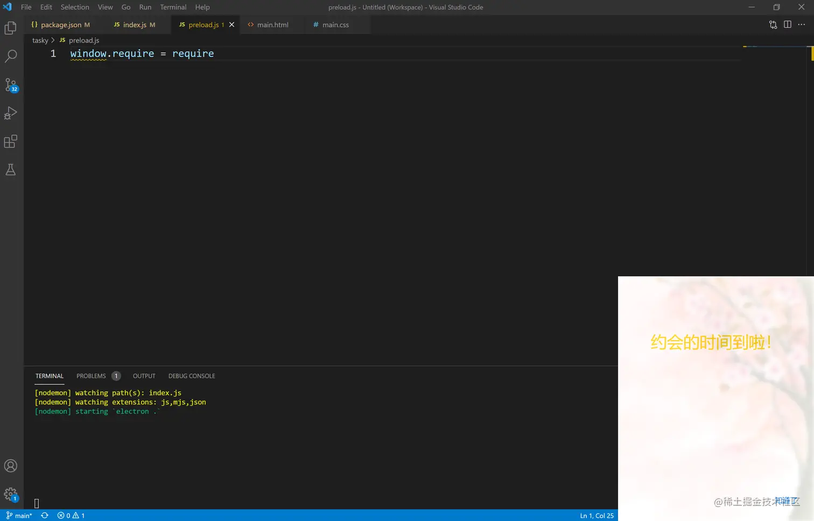

# Electron + Vue3 开发跨平台桌面应用【从项目搭建到打包完整过程】

[Alaso](https://juejin.cn/user/782508009993229/posts)

2021-07-1244,454阅读5分钟

专栏： 

Electron笔记本

本文已参与好文召集令活动，点击查看：[后端、大前端双赛道投稿，2万元奖池等你挑战！](https://juejin.cn/post/6978685539985653767)

# 引言

将Vue引入Electron项目常用的两种方案分别是Vue CLI Plugin Electron Builder和electron-vue。从周下载量来看，Vue CLI Plugin Electron Builder的下载量是electron-vue三倍左右，使用更加广泛。下面我们将基于Vue CLI Plugin Electron Builder来介绍如何把Vue引入Electron工程中。

下面要搭建的应用，UI和功能还是基于tasky原有项目（[入门Electron，手把手教你编写完整实用案例](https://juejin.cn/post/6974192432443293726)）。这里简单~~重复~~地介绍一下。

# 案例效果


**功能分析：**

1、记录待完成任务和已完成任务

2、通过新建，添加待完成任务，并设置时间

3、点击完成任务，跳转到已完成界面；点击删除，可以删除任务

4、点击右上角的 `×` 按钮，可以关闭主界面，要再次打开主界面，可以通过系统托盘

5、设定的时间到了，会在右下角弹出提醒框，如下图所示。



虽然是原有功能，但技术栈有原生js换成Vue后，基本上算是重写了整个项目，项目架构和编码逻辑都是全新的，那么让我们以全新的视角开启学习吧！

# 项目搭建

Vue CLI Plugin Electron Builder 是基于Vue Cli的，因此项目的搭建非常方便。

## 创建vue项目

首先，安装：`npm i @vue/cli -g`

接着，创建项目：`vue create tasky-vue`

运行该命令后，会有一系列选择项让我们进行选择，在我们这个项目中，选择如下：

```vbnet
vbnet复制代码? Please pick a preset: Manually select features
? Check the features needed for your project: Choose Vue version, Babel, Router, Vuex, CSS Pre-processors, Linter
? Choose a version of Vue.js that you want to start the project with: 3.x (Preview)
? Use history mode for router? (Requires proper server setup for index fallback in production) No
? Pick a CSS pre-processor (PostCSS, Autoprefixer and CSS Modules are supported by default): Sass/SCSS (with dart-sass)
? Pick a linter / formatter config: Standard
? Pick additional lint features: Lint on save
? Where do you prefer placing config for Babel, ESLint, etc.? In package.json
? Save this as a preset for future projects? (y/N) n
```

完成后，会生成`tasky-vue`文件夹。

## 安装Vue CLI Plugin Electron Builder

```bash
cd tasky-vue
vue add electron-builder
```

过程中会提示你选择Electron的版本，选择最新版本即可。

在这个过程中，由于网络的原因，Electron可能会安装失败，这时候如果`node_modules`文件夹中已经有`electron`文件夹（该文件夹是不完整的`electron`包，不能运行），那么删除这个文件夹，然后可以使用`cnpm`重新安装`electron`。

```css
css
复制代码cnpm i electron --S
```

注意，如果上面不是选择的最新版本，这里安装的时候需要指定版本安装，如`cnpm i electron@xx.x.x --S`

## 启动项目

安装完成后通过如下指令启动程序：

```arduino
npm run electron:serve
```

运行效果如下：


## 初始的项目目录

如果你有过vue开发经验，会发现整个项目目录还是熟悉的配方，业务代码放在了`src`文件夹下。

渲染进程的页面交给了vue进行渲染，开发过程和我们平时使用vue开发web页面相差无几。而electron主进程的代码是放在`background.js`中。


# Coding

项目支持热更新，修改代码后不用再手动刷新，比之前从零DIY要方便很多，我们可以更专注于业务逻辑的开发，下面就进入coding阶段~~

## Vue项目架构分析

 项目主要有两个渲染进程，对应两个页面（main和remind），因此，这里我们采用多页面打包的方式。

vue-cli构建的包默认是单页面打包，所以，我们在`vue.config.js`中进行改造：

```arduino
arduino复制代码module.exports = { //多页面打包
  pages: {
    main: {
      // 入口js
      entry: 'src/modules/main/main.js',
      // 模板来源
      template: 'public/main.html',
      // 在 dist 中生成的html文件名字
      filename: 'main.html',
      // template html 中的 title 标签需要是 <title><%= htmlWebpackPlugin.options.title %></title>
      title: 'Main Page'
    },
    remind: {
      entry: 'src/modules/remind/remind.js',
      template: 'public/remind.html',
      filename: 'remind.html',
      title: 'Remind Page'
    }
  }
}
```

这时候的项目目录：  以`main页面`为例，它的`main.js`和`Main.vue`内容如下：

- `main.js`

```javascript
javascript复制代码import { createApp } from 'vue'
import App from './Main.vue'
import router from '../../router'
import store from '../../store'

createApp(App).use(store).use(router).mount('#app')
```

- `Main.vue`

```xml
xml复制代码<template>
  <div id="nav">
    <div class="date">{{dateStr}}</div>
    <div class="nav-text">
      <router-link to="/">待办事项</router-link>
      <router-link to="/finished">已完成</router-link>
    </div>
    <router-link to="/add"><span>新建</span></router-link>
  </div>
  <div class="content">
    <span class="close enable-click" @click="closeMain">×</span>
    <div class="content-manage">
      <router-view/>
    </div>
  </div>
</template>
<script>
import { closeMain } from '../../utils/useIPC.js'
export default {
  setup () {
    const date = new Date()
    const dateStr = `${date.getFullYear()}/${date.getMonth() + 1}/${date.getDate()}`
    return {
      closeMain,
      dateStr
    }
  }
}
</script>
```

## 路由与状态管理

提醒窗口（remind）的结构和数据都很简单，这里主要分析主窗口。

### 路由

主窗口的页面架构主要是三个Tab，分别对应三个vue组件。


使用`vue-router`的代码如下：

```javascript
javascript复制代码// src/router/index.js

import { createRouter, createWebHashHistory } from 'vue-router'
import Todo from '../views/Todo.vue'

const routes = [
  {
    path: '/',
    name: 'Todo',
    component: Todo
  },
  {
    path: '/finished',
    name: 'Finished',
    component: () => import(/* webpackChunkName: "finished" */ '../views/Finished.vue')
  },
  {
    path: '/add',
    name: 'Add',
    component: () => import(/* webpackChunkName: "add" */ '../views/Add.vue')
  }
]

const router = createRouter({
  history: createWebHashHistory(),
  routes
})

export default router
```

### 状态管理

这里的主要数据就是 待完成任务（todoArray）和 已完成任务（finishedArray）。在上面三个组件中都有对这两个数据的操作，所以使用vuex进行状态管理。

本例中，任务数据需要使用localStorage来存储，我们选择vuex来管理数据，可以借助插件来完成vuex中数据的持久化，这里使用`vuex-persistedstate`。

```javascript
javascript复制代码import { createStore } from 'vuex'
import createPersistedState from 'vuex-persistedstate'

export default createStore({

  // 该插件会将vuex中数据持久化
  // 可通过配置来决定哪些数据需要持久化，保存在localStorage、sessionStorage还是cookie中
  plugins: [createPersistedState()],  
  
  state: {
    todoArray: [],      //待完成任务数组
    finishedArray: [],  //已完成任务数组
    keepTimes: 0        //已完成任务次数
  },
  mutations: {
    SET_TODO_ARRAY: (state, todoArray) => {
      state.todoArray = todoArray
    },
    SET_FINISHED_ARRAY: (state, finishedArray) => {
      state.finishedArray = finishedArray
    },
    SET_KEEP_TIMES: (state, keepTimes) => {
      state.keepTimes = keepTimes
    }
  }
})
```

## Composition Api

之前没用过Vue3，在这个项目中第一次用，最大的体验就是Composition Api，所以这里简单地写写。

使用传统的option配置方法写组件的时候问题，随着业务复杂度越来越高，代码量会不断的加大；由于相关业务的代码需要写到特定的vue实例，导致代码可复用性不高，而Composition Api就是为了解决这个问题而生。

在vue2中，我们知道写在`data`和`computed`中的数据才是响应式的，写在`methods`中的函数才能在`template`的节点中使用。

所以 响应式数据 和 页面方法 都和vue实例绑定在一起。假如，多个vue实例，每个实例都有`msg属性`，`changeMsg方法`，如果不在每个实例分别定义，比较优雅的方法是可以通过`mixin`混入。

**Composition Api把响应式数据和vue实例解耦，你可以通过调用特定方法（比如reactive、ref、computed）随便在哪里定义响应式数据，然后在vue实例的setup方法使用。**

### 案例说明

在我们这个项目中，其实主要维护的数据结构有两个：待完成数组（todoArray）和已完成数组（finishedArray）。

对数组的操作就是读取数组和更新数组。

并且在待完成（Todo.vue）、已完成（Finished.vue）、新增任务（Add.vue）这三个组件都有对数据的操作。


如果不使用Composition Api，就要在每个组件中定义获取和更新每个数据数据的方法。而使用Composition Api后，我们将所有数据操作写在一个文件中（useData.js），组件中若有需要，可以引入这个文件。

```javascript
javascript复制代码import { computed, getCurrentInstance } from 'vue'

//封装对todoArray的获取和更新
export function useTodo () {
  const { proxy } = getCurrentInstance()  //获取调用该方法的vue实例
  const todoArray = computed(() => proxy.$store.state.todoArray)  //定义计算属性todoArray
  const updateTodo = (payload) => {   //定义方法
    proxy.$store.commit('SET_TODO_ARRAY', payload)
  }
  return {
    todoArray,
    updateTodo
  }
}

//封装对finishedArray的获取和更新
export function useFinished () {
  //... 和上面todoArray类似
}

//封装对keepTimes的获取和更新
export function useKeepTimes () {
  //... 和上面todoArray类似
}
```

在组件中使用（以Finished.vue为例）：

```xml
xml复制代码<template>
  <h2>今日已完成任务</h2>
  <ul class="tasks task-finished">
    <li class="task-item" v-for="(item,index) in finishedArray" :key="index">
      <span class="task-text">{{item.name}}</span>
      <span class="flag-icon"></span>
    </li>
  </ul>
  <p>你已经对自己信守承诺<span class="keep-times">{{keepTimes}}</span>次，继续加油哦！</p>
</template>
<script>
<script>
import { useFinished, useKeepTimes } from '../utils/useData.js'
export default {
  setup () {
    const { finishedArray } = useFinished()
    const { keepTimes } = useKeepTimes()
    return {          //在setup函数中return就可以在template中直接使用
      finishedArray,
      keepTimes
    }
  }
}
</script>
```

## 主进程

主进程中的代码和之前项目基本一样。可以在 [入门篇](https://juejin.cn/post/6974192432443293726#heading-8) 看主进程功能。

之前项目中，渲染进程对应的html文件都是用`file://`协议加载，而在这里需要区分开发环境和生产环境。

在开发环境下，由于使用了webpack-dev-server，所以要访问dev server的地址（`process.env.WEBPACK_DEV_SERVER_URL`）才能得到实时更新的页面内容，而在生产环境下，使用`file://`协议。

```php
php复制代码//background.js
app.on('ready', async () => {
  mainWindow = new BrowserWindow({
    frame: false,
    resizable: false,
    width: 800,
    height: 600,
    icon: iconPath,
    webPreferences:{
      backgroundThrottling: false,
      nodeIntegration:true,
      contextIsolation: false
    }
  })
  if (process.env.WEBPACK_DEV_SERVER_URL) {
    // 开发环境下，访问dev server的地址
    await mainWindow.loadURL(process.env.WEBPACK_DEV_SERVER_URL + '/main.html')
  } else {
    createProtocol('app')
    // 生产环境下，使用`file://`协议加载main.html
    mainWindow.loadURL(`file://${__dirname}/main.html`)
  }
  mainWindow.removeMenu()
  setTray ()
})
```

# 打包

直接执行命令：

```arduino
arduino
复制代码npm run electron:build
```

打包生成的内容在 dist_electron 文件夹，直接基于默认配置打包，生成的dist_electron 文件夹内容如下：


点击`tasky-vue Setup 0.1.0`默认是直接一键安装，可以看到在桌面的应用图标也是默认的。


怎样定制打包，如制作图标、打包格式、安装行为等等，可以参考[Electron应用的打包和自动更新--案例实战，非常详细](https://juejin.cn/post/6980105328801087518) 。

由于我们这里使用的是Vue CLI Plugin Electron Builder，打包的配置需要放在`vue.config.js`中。

```java
java复制代码// vue.config.js

module.exports = {
  pages: { //多页面打包
   ...
  },
  pluginOptions: {
    electronBuilder: {
      builderOptions: {
        // options placed here will be merged with default configuration and passed to electron-builder
        "appId": "this.is.tasky",
        "productName": "Tasky",
        "copyright": "Copyright © 2021 Alaso",
        "directories": {
          "buildResources": "build"
        },
        "mac": {
          "category": "public.app-category.utilities"
        },
        "dmg": {
          "background": "build/background.jfif",
          "icon": "build/icons/icon.icns",
          "iconSize": 100,
          "contents": [
            {
              "x": 380,
              "y": 180,
              "type": "link",
              "path": "/Applications"
            },
            {
              "x": 130,
              "y": 180,
              "type": "file"
            }
          ],
          "window": {
            "width": 540,
            "height": 380
          }
        },
        "win": {
          "target": [
            "msi",
            "nsis"
          ],
          "icon": "build/icons/icon.ico"
        },
        "nsis": {
          "oneClick": false,
          "language": "2052",
          "perMachine": true,
          "allowToChangeInstallationDirectory": true
        }
      }
    }
  }
}
```