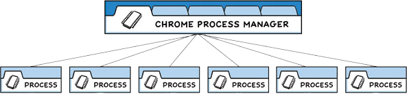

# 流程模型

Electron 继承了来自 Chromium 的多进程架构，这使得此框架在架构上非常相似于一个现代的网页浏览器。 本指南将对 [教程](https://www.electronjs.org/zh/docs/latest/tutorial/tutorial-prerequisites) 中应用的概念进行拓展。

## 为什么不是一个单一的进程？

网页浏览器是个极其复杂的应用程序。 除了显示网页内容的主要能力之外，他们还有许多次要的职责，例如：管理众多窗口 ( 或 标签页 ) 和加载第三方扩展。

在早期，浏览器通常使用单个进程来处理所有这些功能。 虽然这种模式意味着您打开每个标签页的开销较少，但也同时意味着一个网站的崩溃或无响应会影响到整个浏览器。

## 多进程模型

为了解决这个问题，Chrome 团队决定让每个标签页在自己的进程中渲染， 从而限制了一个网页上的有误或恶意代码可能导致的对整个应用程序造成的伤害。 然后用单个浏览器进程控制这些标签页进程，以及整个应用程序的生命周期。 下方来自 [Chrome 漫画](https://www.google.com/googlebooks/chrome/) 的图表可视化了此模型：



Electron 应用程序的结构非常相似。 作为应用开发者，你将控制两种类型的进程：[主进程](https://www.electronjs.org/zh/docs/latest/tutorial/process-model#the-main-process) 和 [渲染器进程](https://www.electronjs.org/zh/docs/latest/tutorial/process-model#the-renderer-process)。 这类似于上文所述的 Chrome 的浏览器和渲染器进程。

## 主进程

每个 Electron 应用都有一个单一的主进程，作为应用程序的入口点。 主进程在 Node.js 环境中运行，这意味着它具有 `require` 模块和使用所有 Node.js API 的能力。

### 窗口管理

主进程的主要目的是使用 [`BrowserWindow`](https://www.electronjs.org/zh/docs/latest/api/browser-window) 模块创建和管理应用程序窗口。

`BrowserWindow` 类的每个实例创建一个应用程序窗口，且在单独的渲染器进程中加载一个网页。 您可从主进程用 window 的 [`webContent`](https://www.electronjs.org/zh/docs/latest/api/web-contents) 对象与网页内容进行交互。

main.js

```js
const { BrowserWindow } = require('electron')

const win = new BrowserWindow({ width: 800, height: 1500 })
win.loadURL('https://github.com')

const contents = win.webContents
console.log(contents)
```

> 注意：渲染器进程也是为 [web embeds](https://www.electronjs.org/zh/docs/latest/tutorial/web-embeds) 而被创建的，例如 `BrowserView` 模块。 嵌入式网页内容也可访问 `webContents` 对象。

由于 `BrowserWindow` 模块是一个 [`EventEmitter`](https://nodejs.org/api/events.html#events_class_eventemitter)， 所以您也可以为各种用户事件 ( 例如，最小化 或 最大化您的窗口 ) 添加处理程序。

当一个 `BrowserWindow` 实例被销毁时，与其相应的渲染器进程也会被终止。

### 应用程序生命周期

主进程还能通过 Electron 的 [`app`](https://www.electronjs.org/zh/docs/latest/api/app) 模块来控制您应用程序的生命周期。 该模块提供了一整套的事件和方法，可以让您用来添加自定义的应用程序行为 (例如：以编程方式退出您的应用程序、修改应用程序坞，或显示一个关于面板) 。

这是一个实际的例子，这个app来源于[快速入门指南](https://www.electronjs.org/zh/docs/latest/tutorial/quick-start#manage-your-windows-lifecycle)，用 `app` API 创建了一个更原生的应用程序窗口体验。

main.js

```js
// quitting the app when no windows are open on non-macOS platforms
app.on('window-all-closed', () => {
  if (process.platform !== 'darwin') app.quit()
})
```


### 原生 API

为了使 Electron 的功能不仅仅限于对网页内容的封装，主进程也添加了自定义的 API 来与用户的作业系统进行交互。 Electron 有着多种控制原生桌面功能的模块，例如菜单、对话框以及托盘图标。

关于 Electron 主进程模块的完整列表，请参阅我们的 API 文档。

## 渲染器进程

每个 Electron 应用都会为每个打开的 `BrowserWindow` ( 与每个网页嵌入 ) 生成一个单独的渲染器进程。 洽如其名，渲染器负责 *渲染* 网页内容。 所以实际上，运行于渲染器进程中的代码是须遵照网页标准的 (至少就目前使用的 Chromium 而言是如此) 。

因此，一个浏览器窗口中的所有的用户界面和应用功能，都应与您在网页开发上使用相同的工具和规范来进行攥写。

虽然解释每一个网页规范超出了本指南的范围，但您最起码要知道的是：

- 以一个 HTML 文件作为渲染器进程的入口点。
- 使用层叠样式表 (Cascading Style Sheets, CSS) 对 UI 添加样式。
- 通过 `<script>` 元素可添加可执行的 JavaScript 代码。

此外，这也意味着渲染器无权直接访问 `require` 或其他 Node.js API。 为了在渲染器中直接包含 NPM 模块，您必须使用与在 web 开发时相同的打包工具 (例如 `webpack` 或 `parcel`)

:::警告

为了方便开发，可以用完整的 Node.js 环境生成渲染器进程。 在历史上，这是默认的，但由于安全原因，这一功能已被禁用。

:::

此刻，您或许会好奇：既然这些特性只能由主进程访问，那渲染器进程用户界面怎样才能与 Node.js 和 Electron 的原生桌面功能进行交互。 而事实上，确实没有直接导入 Electron 內容脚本的方法。

## Preload 脚本

预加载（preload）脚本包含了那些执行于渲染器进程中，且先于网页内容开始加载的代码 。 这些脚本虽运行于渲染器的环境中，却因能访问 Node.js API 而拥有了更多的权限。

预加载脚本可以在 `BrowserWindow` 构造方法中的 `webPreferences` 选项里被附加到主进程。

main.js

```js
const { BrowserWindow } = require('electron')
// ...
const win = new BrowserWindow({
  webPreferences: {
    preload: 'path/to/preload.js'
  }
})
// ...
```

因为预加载脚本与浏览器共享同一个全局 [`Window`](https://developer.mozilla.org/en-US/docs/Web/API/Window) 接口，并且可以访问 Node.js API，所以它通过在全局 `window` 中暴露任意 API 来增强渲染器，以便你的网页内容使用。

虽然预加载脚本与其所附着的渲染器在共享着一个全局 `window` 对象，但您并不能从中直接附加任何变动到 `window` 之上，因为 [`contextIsolation`](https://www.electronjs.org/zh/docs/latest/tutorial/context-isolation) 是默认的。

preload.js

```js
window.myAPI = {
  desktop: true
}
```

renderer.js

```js
console.log(window.myAPI)
// => undefined
```


语境隔离（Context Isolation）意味着预加载脚本与渲染器的主要运行环境是隔离开来的，以避免泄漏任何具特权的 API 到您的网页内容代码中。

取而代之，我们將使用 [`contextBridge`](https://www.electronjs.org/zh/docs/latest/api/context-bridge) 模块来安全地实现交互：

preload.js

```js
const { contextBridge } = require('electron')

contextBridge.exposeInMainWorld('myAPI', {
  desktop: true
})
```


renderer.js

```js
console.log(window.myAPI)
// => { desktop: true }
```


此功能对两个主要目的來說非常有用：

- 通过暴露 [`ipcRenderer`](https://www.electronjs.org/zh/docs/latest/api/ipc-renderer) 帮手模块于渲染器中，您可以使用 进程间通讯 ( inter-process communication, IPC ) 来从渲染器触发主进程任务 ( 反之亦然 ) 。
- 如果您正在为远程 URL 上托管的现有 web 应用开发 Electron 封裝，则您可在渲染器的 `window` 全局变量上添加自定义的属性，好在 web 客户端用上仅适用于桌面应用的设计逻辑 。

## 效率进程

每个Electron应用程序都可以使用主进程生成多个子进程[UtilityProcess](https://www.electronjs.org/zh/docs/latest/api/utility-process) API。 主进程在 Node.js 环境中运行，这意味着它具有 `require` 模块和使用所有 Node.js API 的能力。 效率进程可用于托管，例如：不受信任的服务， CPU 密集型任务或以前容易崩溃的组件 托管在主进程或使用Node.js[`child_process.fork`](https://nodejs.org/dist/latest-v16.x/docs/api/child_process.html#child_processforkmodulepath-args-options) API 生成的进程中。 效率进程和 Node 生成的进程之间的主要区别.js child_process模块是实用程序进程可以建立通信 通道与使用[`MessagePort`](https://developer.mozilla.org/en-US/docs/Web/API/MessagePort)的渲染器进程。 当需要从主进程派生一个子进程时，Electron 应用程序可以总是优先使用 [效率进程](https://www.electronjs.org/zh/docs/latest/api/utility-process) API 而不是Node.js [`child_process.fork`](https://nodejs.org/dist/latest-v16.x/docs/api/child_process.html#child_processforkmodulepath-args-options) API。

## Process-specific module aliases (TypeScript

Electron's npm package also exports subpaths that contain a subset of Electron's TypeScript type definitions.

- `electron/main` includes types for all main process modules.
- `electron/renderer` includes types for all renderer process modules.
- `electron/common` includes types for modules that can run in main and renderer processes.

These aliases have no impact on runtime, but can be used for typechecking and autocomplete.

Usage example

```js
const { app } = require('electron/main')
const { shell } = require('electron/common')
```

# 上下文隔离

## 上下文隔离是什么？

上下文隔离功能将确保您的 `预加载`脚本 和 Electron的内部逻辑 运行在所加载的 [`webcontent`](https://www.electronjs.org/zh/docs/latest/api/web-contents)网页 之外的另一个独立的上下文环境里。 这对安全性很重要，因为它有助于阻止网站访问 Electron 的内部组件 和 您的预加载脚本可访问的高等级权限的API 。

这意味着，实际上，您的预加载脚本访问的 `window` 对象**并不是**网站所能访问的对象。 例如，如果您在预加载脚本中设置 `window.hello = 'wave'` 并且启用了上下文隔离，当网站尝试访问`window.hello`对象时将返回 undefined。

自 Electron 12 以来，默认情况下已启用上下文隔离，并且它是 *所有应用程序*推荐的安全设置。

## 迁移

> 没有上下文隔离，从预加载脚本提供API时，经常会使用`window.X = apiObject` 那么现在呢？

### 之前： 上下文隔离禁用

在渲染进程中，预加载脚本暴露给已加的页面 API 是一个常见的使用方式。 当上下文隔离时，您的预加载脚本可能会暴露一个常见的全局`window`对象给渲染进程。 此后，您可以从中添加任意的属性到预加载在脚本。

preload.js

```javascript
// 上下文隔离禁用的情况下使用预加载
window.myAPI = {
  doAThing: () => {}
}
```


`doAThing()` 函数可以在渲染进程中直接使用。

renderer.js

```javascript
// 在渲染器进程使用导出的 API
window.myAPI.doAThing()
```


### 之后：启用上下文隔离

Electron 提供一种专门的模块来无阻地帮助您完成这项工作。 [`contextBridge`](https://www.electronjs.org/zh/docs/latest/api/context-bridge) 模块可以用来**安全地**从独立运行、上下文隔离的预加载脚本中暴露 API 给正在运行的渲染进程。 API 还可以像以前一样，从 `window.myAPI` 网站上访问。

preload.js

```javascript
// 在上下文隔离启用的情况下使用预加载
const { contextBridge } = require('electron')

contextBridge.exposeInMainWorld('myAPI', {
  doAThing: () => {}
})
```


renderer.js

```javascript
// 在渲染器进程使用导出的 API
window.myAPI.doAThing()
```


请阅读 `contextBridge` 的文档，以全面了解其限制。 例如，您不能在 contextBridge 中暴露原型或者 Symbol。

## 安全事项[](https://www.electronjs.org/zh/docs/latest/tutorial/context-isolation#安全事项)

单单开启和使用 `contextIsolation` 并不直接意味着您所做的一切都是安全的。 例如，此代码是 **不安全的**。

preload.js

```javascript
// ❌ 错误使用
contextBridge.exposeInMainWorld('myAPI', {
  send: ipcRenderer.send
})
```


它直接暴露了一个没有任何参数过滤的高等级权限 API 。 这将允许任何网站发送任意的 IPC 消息，这不会是你希望发生的。 相反，暴露进程间通信相关 API 的正确方法是为每一种通信消息提供一种实现方法。

preload.js

```javascript
// ✅ 正确使用
contextBridge.exposeInMainWorld('myAPI', {
  loadPreferences: () => ipcRenderer.invoke('load-prefs')
})
```


## 与Typescript一同使用[](https://www.electronjs.org/zh/docs/latest/tutorial/context-isolation#与typescript一同使用)

如果您正在使用 TypeScript 构建 Electron 应用程序，您需要给通过 context bridge 暴露的 API 添加类型。 渲染进程的 `window` 对象将不会包含正确扩展类型，除非给其添加了 [类型声明](https://www.typescriptlang.org/docs/handbook/declaration-files/introduction.html)。

例如，在这个 `preload.ts` 脚本中：

preload.ts

```typescript
contextBridge.exposeInMainWorld('electronAPI', {
  loadPreferences: () => ipcRenderer.invoke('load-prefs')
})
```


您可以创建一个 `renderer.d.ts` 类型声明文件，并且全局增强 `Window` 接口。

renderer.d.ts

```typescript
export interface IElectronAPI {
  loadPreferences: () => Promise<void>,
}

declare global {
  interface Window {
    electronAPI: IElectronAPI
  }
}
```


以上所做皆是为了确保在您编写渲染进程的脚本时， TypeScript 编译器将会知晓`electronAPI`合适地在您的全局`window`对象中

renderer.ts

```typescript
window.electronAPI.loadPreferences()
```