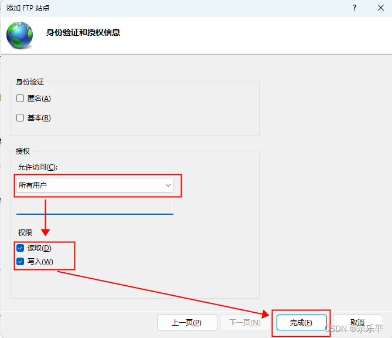

## Win11 设置FTP服务

###  设置FTP服务

操作步骤：
        1、配置FTP功能
               ①、"win+R" > 在运行窗口输入"control" 回车；

  ②、打开"控制面板" > 点击 " 程序 " > "启用或关闭Windows功能 " > 手动勾选"Internet Information Services 和 Internet Information Services可承载的Web核心 "（系统不会自动全选）> 点击"确定"按钮 > 等待安装完成重启电脑；


 ②、左侧栏"**网站** " > 点击"**添加FTP站点**"；


 ③、"***\*FTP站点名称\****" 输入名称  > "**物理路径**" 选择设置FTP存放文件的盘符地址 > 点击"**下一步**"；


④、"***\*IP地址\****" 输入本机IP  > "**SSL**" 选择无SSL > 点击"**下一步**"；


 ⑤、"**授权**" 选择可访问的用户对象  > "**权限**" 选择可操作的权限范围 > 点击"**完成**"；



  ⑥、"**本机名**"  > "**网站**" > 即可看到自建的FTP站点；


搜索计算机管理


用户是23563，密码是最初设置的那个（z1o2m3b4i5e6）

在文件夹地址中输入ftp://本机ip输入用户和密码即可访问


打开防火墙


### win11使用FTP进行文件传输

要上传文件到已经开启的FTP服务器上，可以使用FTP客户端软件或通过编程语言中的FTP库进行操作。以下是使用Windows自带的命令行FTP工具进行文件上传的步骤：

1. 打开命令提示符： 在Windows中，按下Win + R键，输入“cmd”并按Enter键打开命令提示符。

2. 连接到FTP服务器： 在命令提示符中输入以下命令，将其中的`ftp_server_address`替换为FTP服务器的地址，然后按Enter键连接到FTP服务器：

   ```
   ftp ftp_server_address
   ```

3. 输入FTP登录凭据： 输入FTP服务器的用户名和密码进行登录，按照提示进行操作。

4. 设置被动模式（可选）： 如果您的FTP服务器配置了被动模式（PASV），可以使用以下命令在上传前进行设置：

   复制

   ```
   passive
   ```

5. 切换到上传目录： 使用以下命令切换到FTP服务器上的适当目录，将其中的`remote_directory`替换为您要上传到的目录：

   ```
   cd remote_directory
   ```

6. 开启二进制模式： 使用以下命令开启FTP的二进制传输模式：

   ```
   binary
   ```

7. 执行上传： 使用以下命令将本地文件上传到FTP服务器，将其中的`local_file_path`替换为本地文件的路径，将其中的`remote_file_name`替换为您想要在FTP服务器上保存的文件名：

   复制

   ```
   put local_file_path/remote_file_name
   ```

8. 等待上传完成： 等待文件上传到FTP服务器，上传完成后，命令提示符会显示相关的状态信息。

完成以上步骤后，文件应该已经成功上传到FTP服务器上指定的目录。请注意，上传过程中可能需要考虑FTP服务器的访问权限和网络安全性。确保您具有适当的权限和正确的身份验证信息来进行文件


## gin使用FTP

加载包：

```go
import (
	"net/http"

	"github.com/gin-gonic/gin"
	"github.com/jlaffaye/ftp"
)
```

启动FTP服务器函数：

```go
func connectFTP() (*ftp.ServerConn, error) {
    ftpAddress := "your_ftp_address"
    ftpUsername := "your_ftp_username"
    ftpPassword := "your_ftp_password"

    ftpConn, err := ftp.Dial(ftpAddress)
    if err != nil {
        return nil, err
    }

    err = ftpConn.Login(ftpUsername, ftpPassword)
    if err != nil {
        return nil, err
    }

    return ftpConn, nil
}
```

主函数:

```go
func main() {
    router := gin.Default()

    router.POST("/upload", func(c *gin.Context) {
        file, err := c.FormFile("file")
        if err != nil {
            c.JSON(http.StatusBadRequest, gin.H{
                "error": err.Error(),
            })
            return
        }

        // 连接FTP服务器
        ftpConn, err := connectFTP()
        if err != nil {
            c.JSON(http.StatusInternalServerError, gin.H{
                "error": err.Error(),
            })
            return
        }
        defer ftpConn.Quit()

        // 打开文件
        fileReader, err := file.Open()
        if err != nil {
            c.JSON(http.StatusInternalServerError, gin.H{
                "error": err.Error(),
            })
            return
        }
        defer fileReader.Close()

        // 上传文件到FTP服务器
        err = ftpConn.Stor(file.Filename, fileReader) //file.Filename位置填的是文件的保存位置，fileReader 是文件的读取器（Reader），用于读取文件内容
        if err != nil {
            c.JSON(http.StatusInternalServerError, gin.H{
                "error": err.Error(),
            })
            return
        }

        c.JSON(http.StatusOK, gin.H{
            "message": "File uploaded successfully",
        })
    })

    router.Run(":8080")
}
```

FTP适合用于传输大文件，小文件可以直接使用gin自带的传输功能传输：

```go
	if err := c.SaveUploadedFile(data, saveFile); err != nil { //data为上下文传递的文件，saveFile是文件保存地址 
		c.JSON(http.StatusOK, Response{
			StatusCode: 1,
			StatusMsg:  err.Error(),
		})
		return
	}
```

