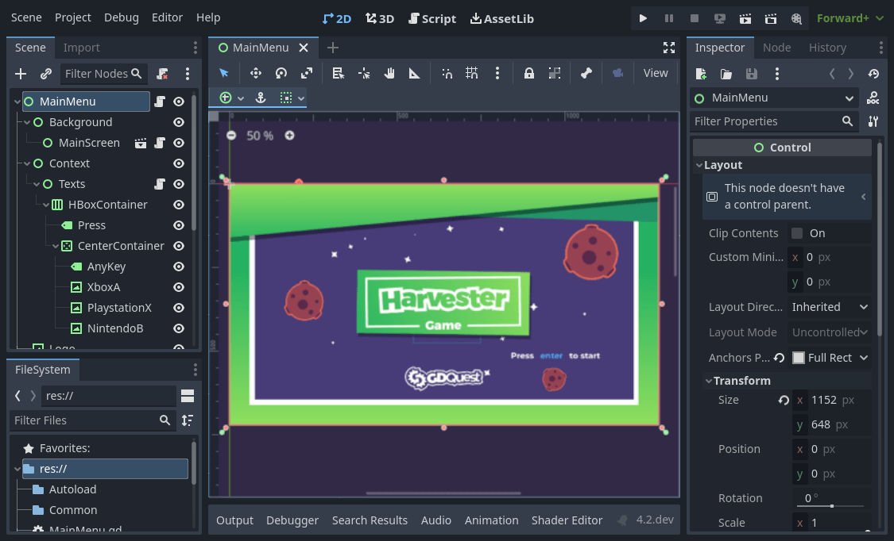
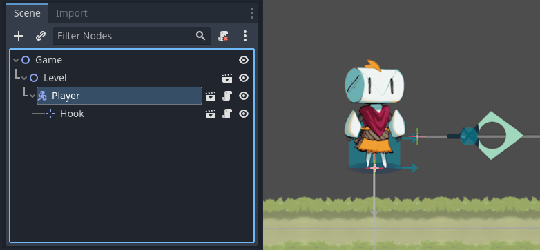
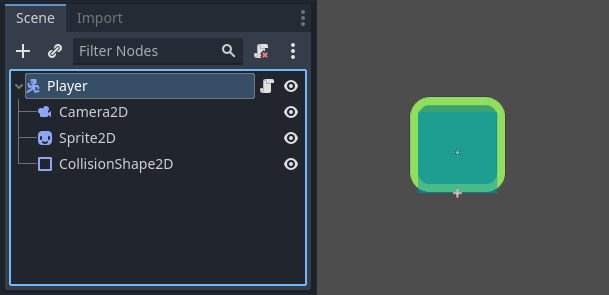
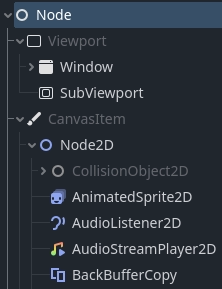
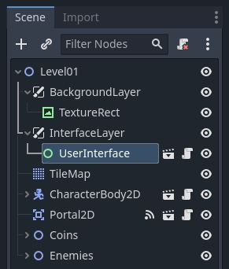
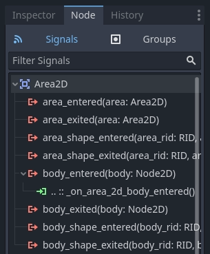

# Godot 关键概念概述[](https://docs.godotengine.org/zh-cn/4.x/getting_started/introduction/key_concepts_overview.html#overview-of-godot-s-key-concepts)

任何游戏引擎都是围绕着构建程序所用的抽象运转的。在 Godot 中，游戏就是一棵由**节点**构成的**树**，树又可以结合起来构成**场景**。然后你还可以将这些节点连起来，让它们通过**信号**进行通信。

这就是你将在这里学习的四个概念。我们将简要地看一下它们，让你对引擎的工作原理有一个了解。在入门系列中，你将在实践中使用它们。

## 场景[](https://docs.godotengine.org/zh-cn/4.x/getting_started/introduction/key_concepts_overview.html#scenes)

在 Godot 中，你把你的游戏分解成可重复使用的场景。场景可以是一个角色、一件武器、用户界面中的一个菜单、一座房子、整个关卡、或者任何你能想到的东西。Godot 的场景很灵活，既能够充当预制件（Prefab），又能够用作其他游戏引擎中的场景。

你还可以嵌套场景。例如，你可以把你的角色放在关卡中，然后拖放一个场景作为它的子级。

## 节点[](https://docs.godotengine.org/zh-cn/4.x/getting_started/introduction/key_concepts_overview.html#nodes)

场景由一个或多个**节点**组成。节点是游戏中最小的构建块，你可以将其排列成树。以下是一个角色节点的示例。

它由名为“Player”的 `CharacterBody2D` 节点、`Camera2D`、`Sprite2D`、`CollisionShape2D` 组成。

备注

节点名称以“2D”结尾，因为这是一个 2D 场景。对应 3D 节点的名称以“3D”结尾。请注意，原本的空间节点“Spatial”从 Godot 4 开始改名成了“Node3D”。

注意节点和场景在编辑器中看起来是一样的。当你把一棵节点树保存为场景时，它就显示为单个节点，其内部结构在编辑器中是隐藏的。

Godot 提供了丰富的基础节点类型库，你可以通过组合和扩展来建立更强大的节点。无论是 2D、3D 还是用户界面，你都可以用这些节点完成大多数事情。

## 场景树[](https://docs.godotengine.org/zh-cn/4.x/getting_started/introduction/key_concepts_overview.html#the-scene-tree)

游戏的所有场景都汇集在**场景树**中，字面意思是场景的树。由于场景是节点树，因此场景树也是节点树。但是，从场景的角度来考虑你的游戏更容易，因为它们可以代表角色、武器、门或你的用户界面。

## 信号[](https://docs.godotengine.org/zh-cn/4.x/getting_started/introduction/key_concepts_overview.html#signals)

节点在发生某些事件时发出信号。此功能无需在代码中硬连接节点就能让它们相互通信。它为你提供了构建场景的灵活性。

备注

信号是 Godot 版的*观察者*模式。你可以在这里查看更多相关内容：https://gameprogrammingpatterns.com/observer.html

For example, buttons emit a signal when pressed. You can connect a piece of code to this signal which will run in reaction to this event, like starting the game or opening a menu.

其他内置信号可以告诉你两个对象何时碰撞，角色或怪物何时进入给定区域等等。你还可以针对游戏量身定制新的信号。

## 总结[](https://docs.godotengine.org/zh-cn/4.x/getting_started/introduction/key_concepts_overview.html#summary)

节点、场景、场景树和信号是 Godot 中的四个核心概念，你将一直操纵它们。

节点是游戏最小的构建块。你把它们组合起来创建场景，再把它们组合起来并嵌套到场景树中。最后，你可以使用信号来使节点对其他节点或不同的场景树分支中的事件做出响应。

经过这个简短的分解，你可能有很多问题。请耐心等待，你将在整个入门系列中得到更多解答。