# Godot 界面初探

本页将向你简要介绍 Godot 的界面。我们将看看不同的主屏幕和面板，以帮助你确定自己的位置。

参见

有关编辑器界面的全面介绍及其使用方法，请参阅[编辑器手册](https://docs.godotengine.org/zh-cn/4.x/tutorials/editor/index.html#doc-editor-introduction)。

## 项目管理器

当你启动 Godot 时，首先看到的窗口是项目管理器。在默认标签**项目**中，你可以管理现有项目、导入或创建新项目等。

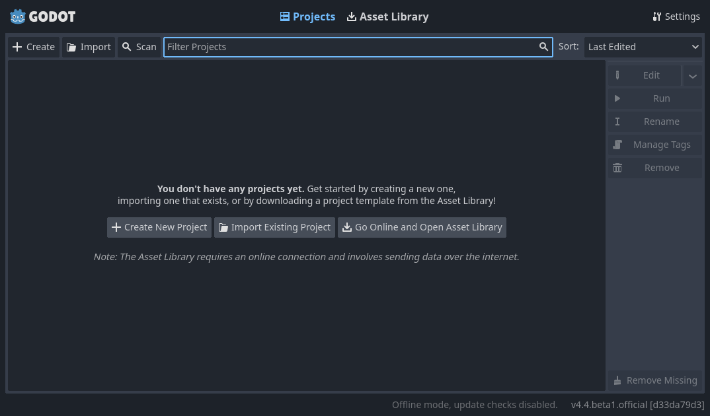

在窗口顶部，还有一个名为**资产库**的标签。第一次进入此标签时，你会看到"上线"按钮。出于隐私原因，Godot 项目管理器默认不访问互联网。要更改此设置，请点击"上线"按钮。你可以稍后在设置中更改此选项。

一旦你的网络模式设置为"在线"，你就可以在开源资产库中搜索演示项目，其中包括社区开发的许多项目：

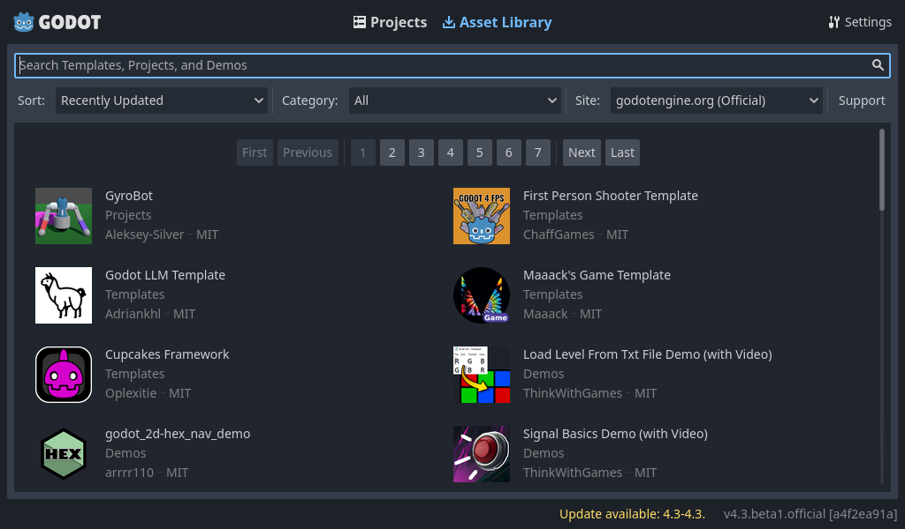

可以通过**设置**菜单打开项目管理器的设置：

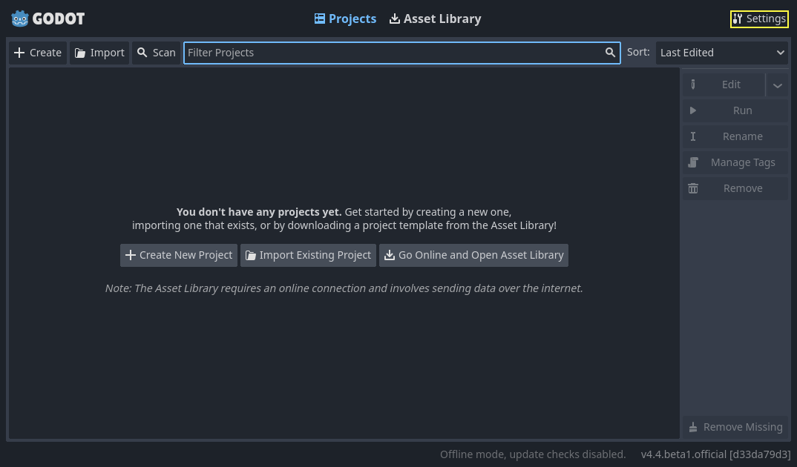

在这里，你可以更改编辑器的语言（默认为系统语言）、界面主题、显示比例、网络模式，以及目录命名约定。

参见

要进一步了解项目管理器，请阅读 [使用项目管理器](https://docs.godotengine.org/zh-cn/4.x/tutorials/editor/project_manager.html#doc-project-manager) 。

## 初识 Godot 编辑器

当你打开新项目或现有项目时，编辑器界面会出现。让我们看看它的主要区域：

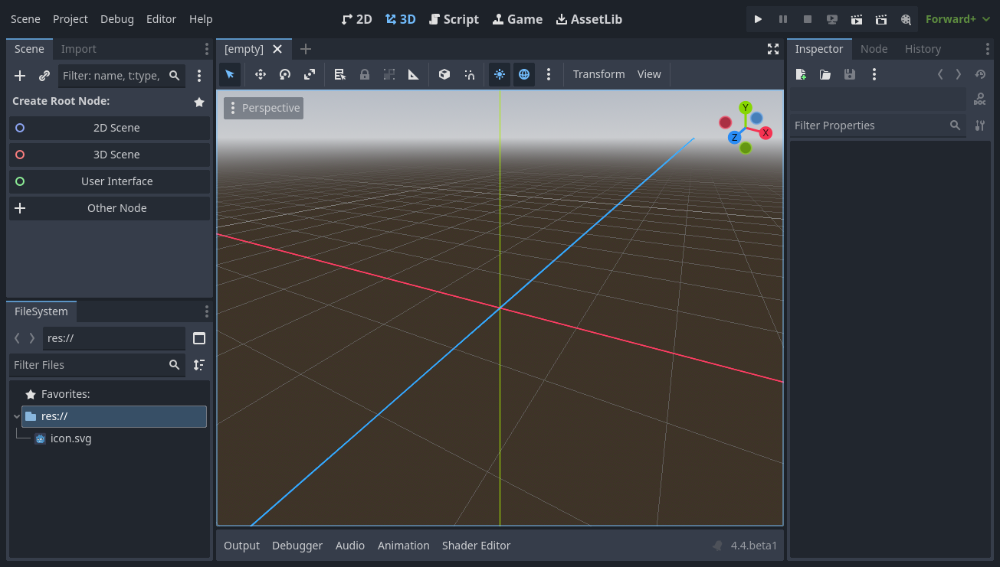

默认情况下，沿着窗口的顶部边缘，左侧是**主菜单**，中间是**工作区**切换按钮（活动工作区会高亮显示），右侧是**播放测试**按钮和**电影制作模式**切换：

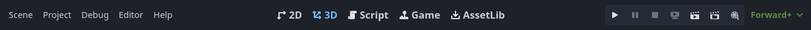

在工作区按钮下方，可以看到以标签形式打开的[场景](https://docs.godotengine.org/zh-cn/4.x/getting_started/introduction/key_concepts_overview.html#doc-key-concepts-overview-scenes)。标签旁边的加号(+)按钮将向项目添加新场景。使用最右侧的按钮，可以切换无干扰模式，通过隐藏界面中的**停靠面板**来最大化或恢复**视口**的大小：

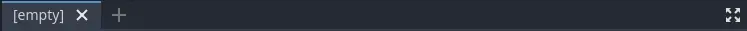

在中央，场景选择器下方是**视口**，其顶部有**工具栏**，你可以在其中找到不同的工具来移动、缩放或锁定场景的节点（当前激活的是3D工作区）：

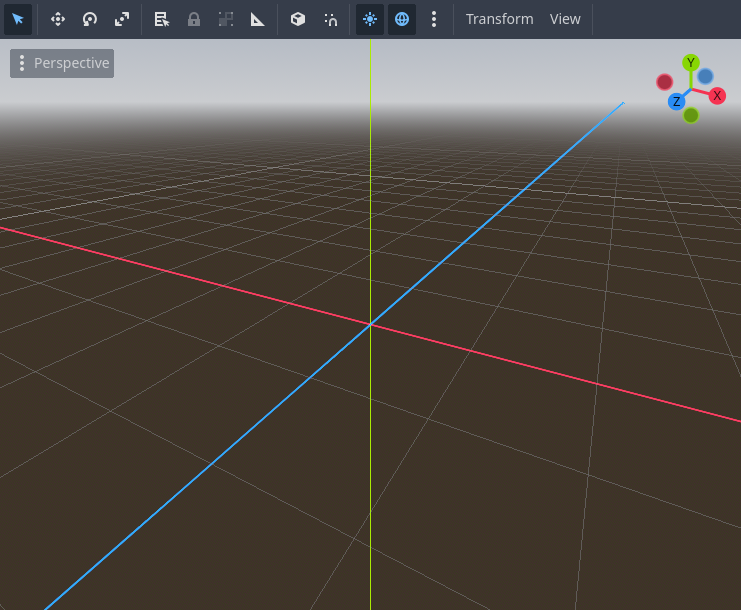

这个工具栏会根据上下文和选定的节点而变化。这是2D工具栏：

下面是3D工具栏：

参见

要了解更多关于工作区的信息，请阅读[五个主要屏幕](https://docs.godotengine.org/zh-cn/4.x/getting_started/introduction/first_look_at_the_editor.html#doc-intro-to-the-editor-interface-five-screens)。

参见

要了解更多关于3D视口和3D的一般信息，请阅读[3D 简介](https://docs.godotengine.org/zh-cn/4.x/tutorials/3d/introduction_to_3d.html#doc-introduction-to-3d)。

视口的两边是**停靠面板**。窗口底部则是**底部面板**。

让我们看看停靠面板。**文件系统**停靠面板列出了你的项目文件，包括脚本、图像、音频样本等：

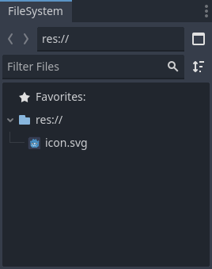

**场景**停靠面板列出了活动场景的节点：

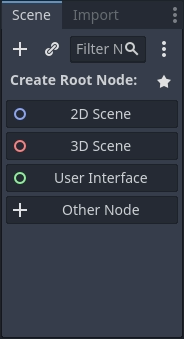

**检查器**允许你编辑所选节点的属性：

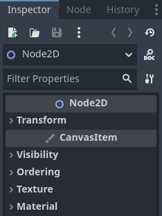

参见

要了解更多关于检查器的信息，请参阅[检查器](https://docs.godotengine.org/zh-cn/4.x/tutorials/editor/inspector_dock.html#doc-editor-inspector-dock)。

参见

停靠面板可以自定义。阅读更多关于[面板的移动和大小调整](https://docs.godotengine.org/zh-cn/4.x/tutorials/editor/customizing_editor.html#doc-customizing-editor-moving-docks)的信息。

位于视口下方的**底部面板**是调试控制台、动画编辑器、音频混合器等的宿主。它们可能占用宝贵的空间，因此默认情况下是折叠的：

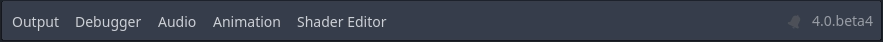

当你点击其中一个时，它会垂直展开。下面，你可以看到打开的动画编辑器：

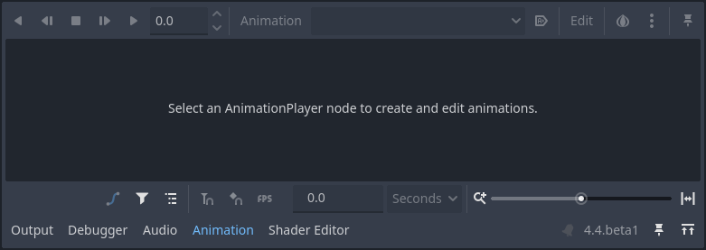

底部面板也可以使用**编辑器设置 > 快捷键**中**底部面板**类别下定义的快捷键显示或隐藏。

## 五个主要屏幕

编辑器顶部中央有五个主屏幕按钮：2D、3D、脚本、游戏和资产库。

**2D 屏幕**可以用于任何类型的游戏。除了 2D 游戏，2D 屏幕也会用于界面的构建。

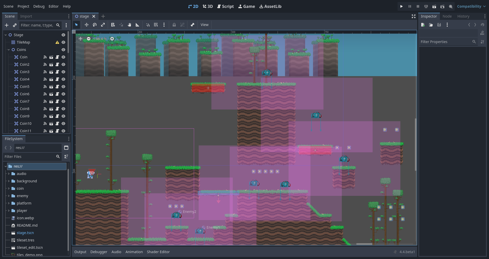

在**3D 屏幕**中，你可以操作网格、灯光、设计 3D 游戏的关卡。

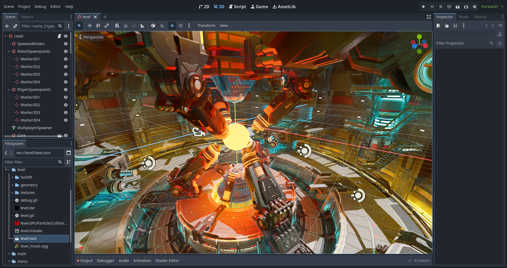

备注

更多关于 **3D 主屏幕**的细节请查看《[3D 简介](https://docs.godotengine.org/zh-cn/4.x/tutorials/3d/introduction_to_3d.html#doc-introduction-to-3d)》。

**游戏屏幕**是你从编辑器运行项目时项目将出现的地方。你可以浏览你的项目进行测试，并实时暂停和调整它。请注意，这仅用于测试调整的效果，当游戏停止运行时，在此处所做的任何更改都不会保存。

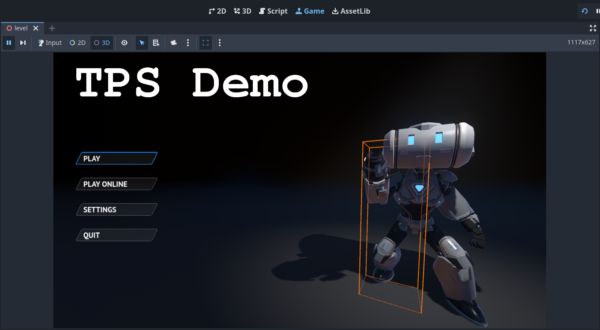

**Script 屏幕**是一个完整的代码编辑器，包含调试器、丰富的自动补全、以及内置的代码参考手册。

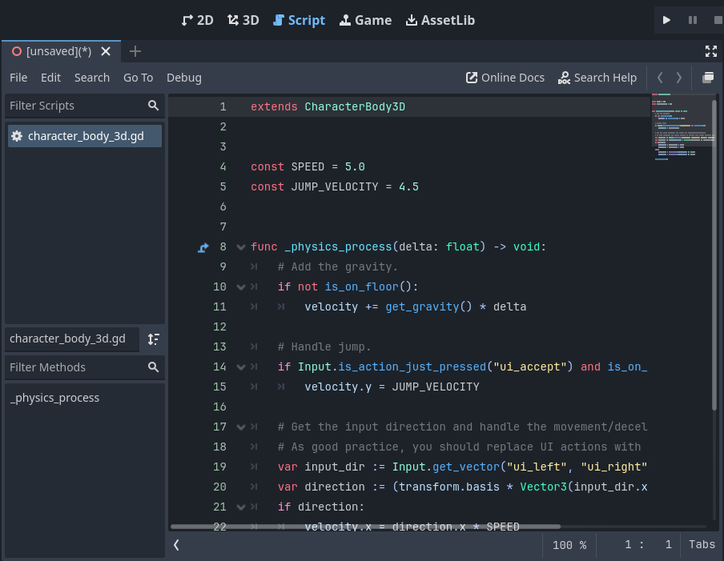

最后，**资产库**是一个免费开源的插件、脚本和资产库，可用于你的项目。

参见

你可以在《[关于资产库](https://docs.godotengine.org/zh-cn/4.x/community/asset_library/what_is_assetlib.html#doc-what-is-assetlib)》中了解更多关于资产库的内容。

## 内置类参考手册

Godot 自带内置的类参考手册。

要搜索类、方法、属性、常量、信号相关的信息，可以使用以下任意方法：

- 在编辑器的任何位置按 F1（在 macOS 上为 Opt + Space，对于带有 Fn 键的笔记本电脑为 Fn + F1）。
- 点击 Script 主屏幕右上角的"搜索帮助"按钮。
- 点击"帮助"菜单的"搜索帮助"。
- 在脚本编辑器中 Ctrl + 点击（macOS 上为 Cmd + 点击）类名、函数名、内置变量。

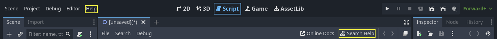

执行其中的任意操作都会弹出一个窗口。通过输入进行搜索。你也可以用它来查看所有对象和方法。

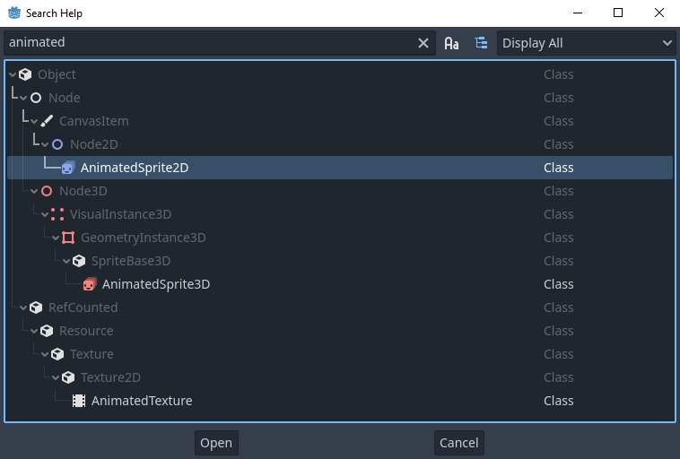

在条目上双击就会在脚本主屏幕中打开对应的页面。

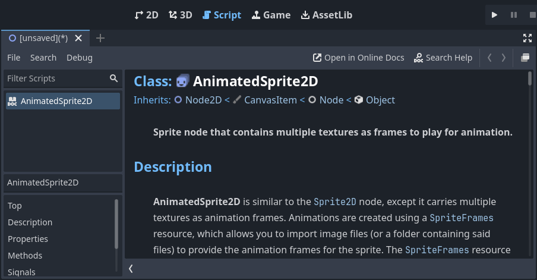

或者，

- 在脚本编辑器中按住 Ctrl 键点击类名、函数名或内置变量。
- 右键点击节点并选择**打开文档**，或在脚本编辑器中为元素选择**查找符号**，将直接打开它们的文档。

[上一页](https://docs.godotengine.org/zh-cn/4.x/getting_started/introduction/key_concepts_overview.html)[下一页](https://docs.godotengine.org/zh-cn/4.x/getting_started/introduction/learning_new_features.html)
