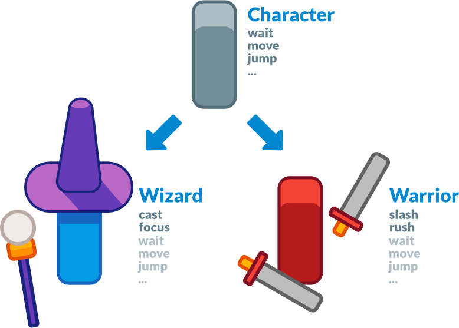
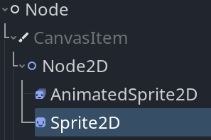
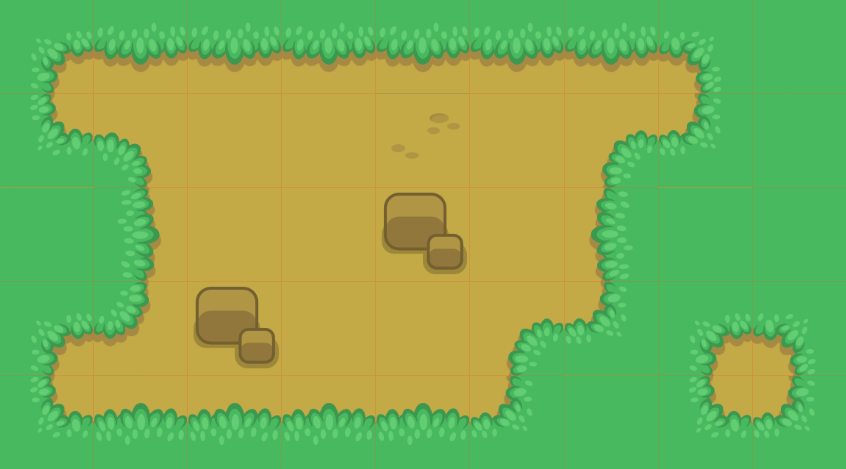
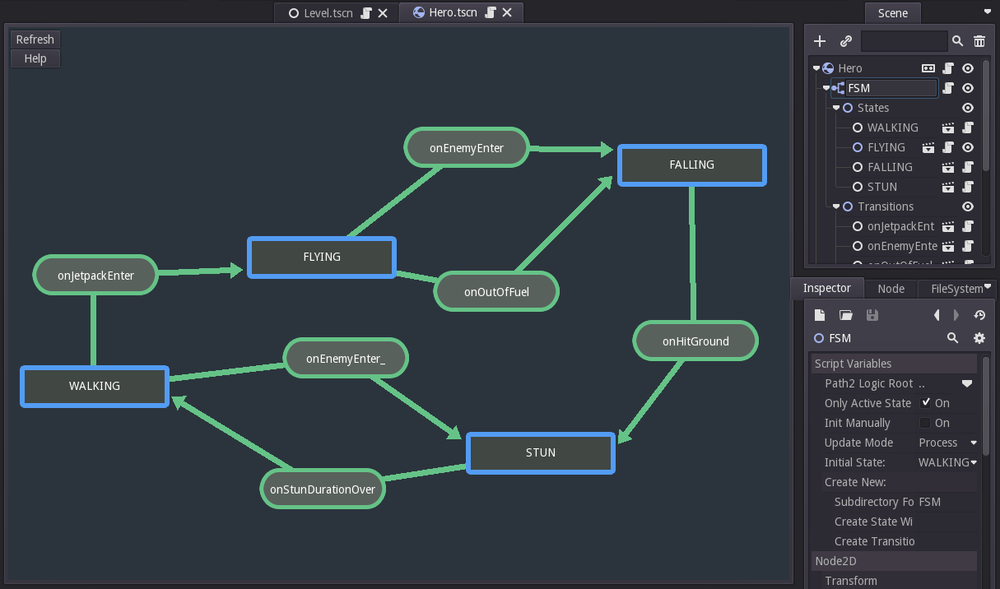
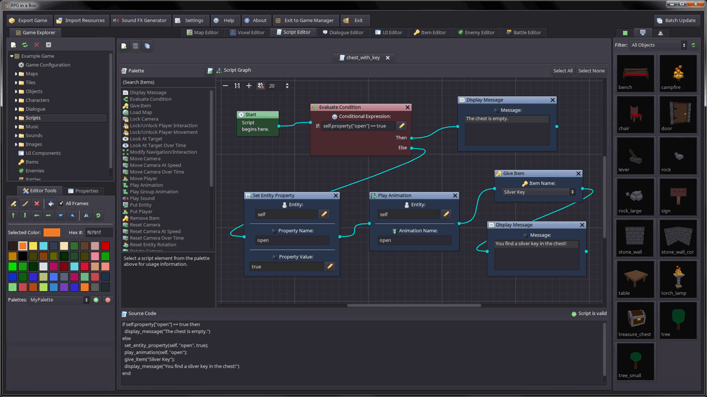

# Godot 的设计理念[](https://docs.godotengine.org/zh-cn/4.x/getting_started/introduction/godot_design_philosophy.html#godot-s-design-philosophy)

既然你已经小试身手，让我们谈谈 Godot 的设计。

**游戏引擎各不相同，以满足不同的需求。**它们不仅提供一系列功能，而且每个引擎的设计都是独一无二的。这将导致不同的工作流程和项目组织结构。这一切都源于它们各自的设计理念。

本页是为了帮助你通过 Godot 的一些核心功能来理解它的工作原理。 本页既不是可用特性的列表，也不会对各个引擎做比较。 要知道哪一种引擎更适合你的项目，你需要亲自尝试一下并了解各个引擎的设计和局限性。

Please watch [Godot explained in 7 minutes](https://www.youtube.com/watch?v=yS9cuu5o5Ug) if you're looking for an overview of the engine's features.

## 面向对象的设计与组合[](https://docs.godotengine.org/zh-cn/4.x/getting_started/introduction/godot_design_philosophy.html#object-oriented-design-and-composition)

Godot凭借其灵活的场景系统和节点层次结构，将面向对象设计作为其核心。 它试图远离严格的编程模式，以提供直观的方式来构建游戏。

首先，Godot 可以让你把场景**组合或聚合**起来。这和嵌套的预制件是类似的：你可以创建 BlinkingLight 场景，并使用 BlinkingLight 创建 BrokenLantern 场景。然后，创建一个充满 BrokenLantern 的城市。更改 BlinkingLight 的颜色、保存，城市中的所有 BrokenLantern 都会立即更新。

更重要的是，你可以从任何场景**继承**。

Godot 场景可以是武器、角色、物品、门、关卡、关卡的一部分……任何你能想象的东西。它就像纯代码中的类一样工作，但也可以使用编辑器，纯代码或同时使用两者来设计场景。

和其他几个 3D 引擎的 Prefab（预制体）不同，场景可以通过继承来扩展。你可以创建一个 Magician（魔术师）来扩展你的 Character（角色）。在编辑器中修改 Character 后 Magician 也会更新。这样的设计可以帮你保持项目结构与设计的一致性。

还要注意，Godot 提供了许多不同类型的对象，称为节点，每种节点都有特定的用途。节点是树的一部分，并且始终从其父类继承直到 Node 类。虽然引擎确实具有一些节点，例如碰撞形状将被其父物理体使用，但大多数节点彼此独立工作。

换句话说，Godot的节点并不像其他一些游戏引擎中的组件那样工作。

Sprite2D 是一种 Node2D、CanvasItem 和 Node。它具有其三个父类的所有属性和功能，例如变换或绘制自定义形状和使用自定义着色器进行渲染的能力。

## 完善的工具集[](https://docs.godotengine.org/zh-cn/4.x/getting_started/introduction/godot_design_philosophy.html#all-inclusive-package)

Godot 尝试提供自己的工具来满足最常见的需求。它具有专用的脚本工作区、动画编辑器、TileMap 编辑器、着色器编辑器、调试器、分析器、在本地和远程设备上热重载等功能。

我们的目标是提供一个完整的软件包来创建游戏以及持续的用户体验。只要 Godot 中有对应的导入插件，你就仍然可以使用外部程序进行编辑。或者你可以自己创建一个导入插件，比如 [Tiled Map 导入器](https://github.com/vnen/godot-tiled-importer)。

这也是为什么 Godot 除了提供 C# 之外还会提供自己的编程语言 GDScript 的部分原因。GDScript 是为满足游戏开发人员和游戏设计师的需求而设计的，并且被紧密集成在引擎和编辑器中。

GDScript 让你能够使用基于缩进的语法编写代码，还可以检测类型，提供质量接近静态语言的自动补全。它还针对使用 Vector、Color 等内置类型的游戏代码进行了优化。

请注意，使用 GDExtension，你可以编写出使用类似 C、C++、Rust、D、Haxe、Swift 这类的编译语言编写的高性能代码，并且无需重新编译引擎。

请注意，3D 工作区不像 2D 工作区那样有那么多工具。你将需要使用外部的程序或插件来编辑地形，给复杂的角色模型制作动画等。Godot 提供了完整的 API，可以直接使用编写游戏的代码来扩展编辑器的功能。参见下面的 [Godot 编辑器是一个 Godot 游戏](https://docs.godotengine.org/zh-cn/4.x/getting_started/introduction/godot_design_philosophy.html#the-godot-editor-is-a-godot-game)。

*Godot 2 的状态机编辑器插件，由 kubecz3k 开发。它使你可以直观地管理状态和转换。*

## 开源[](https://docs.godotengine.org/zh-cn/4.x/getting_started/introduction/godot_design_philosophy.html#open-source)

Godot 源代码采用了 **MIT 许可证**。这意味着它附带的所有技术也必须是自由的（自由使用、修改等）。大部分代码都是由贡献者从头开始开发的。

任何人都可以根据各自需求添加专有软件——当然它们是不会通过引擎一起提供。这可能包括 Google AdMob 或 FMOD。其中任何一个都可以作为第三方插件提供。

另一方面，开放的代码库意味着你可以随心所欲地**学习并扩展引擎**。你还可以轻松地调试游戏，因为 Godot 会使用堆栈跟踪打印错误，即使这些错误来自引擎本身。

备注

这**不会以任何方式影响你使用 Godot 所创作的作品** ：不会有附加条件影响 Godot 引擎和你用 Godot 制作的东西。

## 社区驱动[](https://docs.godotengine.org/zh-cn/4.x/getting_started/introduction/godot_design_philosophy.html#community-driven)

**Godot 是由其社区、为社区以及所有游戏创作者创造的。**用户的需求和公开讨论驱动了核心更新。核心开发人员的新功能通常首先关注的是哪些功能将使大多数用户受益。

即便如此，尽管只有少数核心开发人员全职开发，但截至撰写本文时，该项目已有数千名贡献者。热心的程序员会开发他们自己可能需要的功能，因此你会在每个主要版本中同时看到引擎各个方面的改进。

## Godot 编辑器是一款 Godot 游戏[](https://docs.godotengine.org/zh-cn/4.x/getting_started/introduction/godot_design_philosophy.html#the-godot-editor-is-a-godot-game)

Godot 编辑器在游戏引擎上运行。它使用引擎自己的 UI 系统，可以在你测试项目时热重载代码和场景，也可以在编辑器中运行游戏代码。这意味着你可以为游戏**使用相同的代码**和场景，又可以**构建插件并扩展编辑器。**

这带来了可靠且灵活的 UI 系统，因此它为编辑器本身提供了动力。使用 `@tool` 注解，你可以在编辑器中运行任何游戏代码。

*RPG in a Box 是一个用 Godot 2 制作的 RPG 体素编辑器。它使用 Godot 的 UI 工具制作了其基于节点的编程系统和其余界面。*

将 `@tool` 注解放在任何 GDScript 文件的顶部，文件将在编辑器中运行。这样，你就可以导入、导出插件，创建自定义关卡编辑器之类的插件，或使用与项目中所使用的相同的节点和 API 来创建脚本。

备注

编辑器完全使用 C++ 编写并且静态地编译为二进制文件。这意味着你不能像导入一个拥有 `project.godot` 文件的普通项目一样导入它。

## 独立的 2D 和 3D 引擎[](https://docs.godotengine.org/zh-cn/4.x/getting_started/introduction/godot_design_philosophy.html#separate-2d-and-3d-engines)

Godot 提供了专门的 2D 和 3D 渲染引擎。因此，**2D 场景的基础单位是像素。**尽管引擎是独立的，但你还是可以在 3D 中渲染 2D、在 2D 中渲染 3D，也可以在 3D 世界之上覆盖 2D 精灵和界面。

[ 上一页](https://docs.godotengine.org/zh-cn/4.x/getting_started/introduction/learning_new_features.html)[下一页 ](https://docs.godotengine.org/zh-cn/4.x/getting_started/step_by_step/index.html)