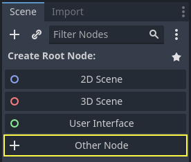
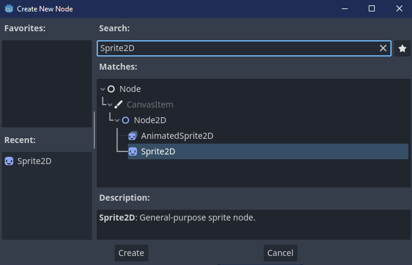
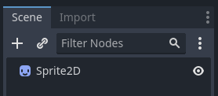
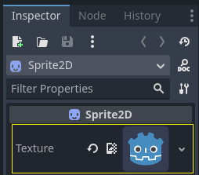
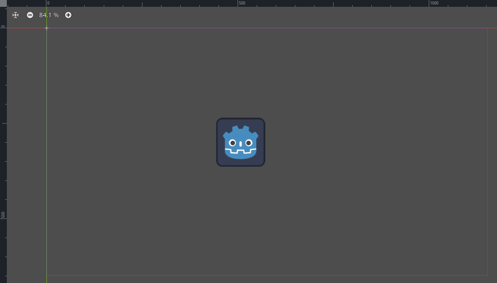
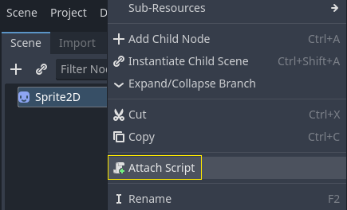
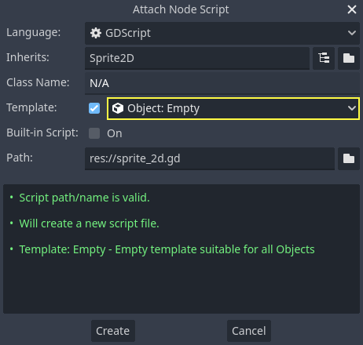
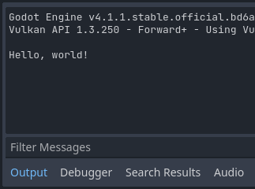
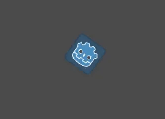

# 创建第一个脚本[](https://docs.godotengine.org/zh-cn/4.x/getting_started/step_by_step/scripting_first_script.html#creating-your-first-script)

在本课中，你将会用 GDScript 编写第一个脚本，使 Godot 图标转圈。


> 参见
>
> 要了解更多关于GDScript、其关键字以及其语法等信息，请前往 [GDScript 参考](https://docs.godotengine.org/zh-cn/4.x/tutorials/scripting/gdscript/gdscript_basics.html#doc-gdscript)。

## 项目设置[](https://docs.godotengine.org/zh-cn/4.x/getting_started/step_by_step/scripting_first_script.html#project-setup)

请从头开始[创建一个新项目](https://docs.godotengine.org/zh-cn/4.x/tutorials/editor/project_manager.html#doc-creating-and-importing-projects)。你的项目应该包含一张图片：Godot 图标，我们经常在社区中使用它来制作原型。

我们需要创建一个 Sprite2D 节点来在游戏中显示它。在“场景”面板中，点击“其他节点”按钮。



在搜索栏中输入“Sprite2D”来过滤节点，双击 Sprite2D 来创建节点。



你的“场景”选项卡现在应该只有一个 Sprite2D 节点。



Sprite2D 节点需要用于显示的纹理。在右边的“检查器”中，你可以看到 Texture（纹理）属性写着“[空]”。要显示 Godot 图标，请点击并拖拽“文件系统”面板中的 `icon.svg` 文件到 Texture 插槽上。



> **备注**
>
> 你可以通过将图像拖放到视口上来自动创建 Sprite2D 节点。

然后，点击并拖动视口中的图标，使其在游戏视图中居中。



## 新建脚本[](https://docs.godotengine.org/zh-cn/4.x/getting_started/step_by_step/scripting_first_script.html#creating-a-new-script)

在场景面板的 Sprite2D 上点击右键并选择“添加脚本”，来创建或附加一个新的脚本到我们的节点上。



弹出“附加节点脚本”窗口。你可以选择脚本的语言和文件路径，以及其他选项。

把模板字段从“Node: Default”改为“Object: Empty”从而得到一个干净的脚本文件。其他选项保持默认，然后点击“创建”按钮来创建脚本。



备注

此时 Script 工作区将自动打开并显示你新建的 `sprite_2d.gd` 文件，显示以下代码行：

```GDScript
extends Sprite2D
```

每个 GDScript 文件都是一个隐含的类。`extends` 关键字定义了这个脚本所继承或扩展的类。本例中为``Sprite2D``，意味着我们的脚本将获得 Sprite2D 节点的所有属性和方法，包括它继承的 `Node2D`、`CanvasItem`、`Node` 等类。

> **备注**
>
> 在 GDScript 中，如果你略写了带有 `extends` 关键字的一行，那么你的类将隐式扩展自 [RefCounted](https://docs.godotengine.org/zh-cn/4.x/classes/class_refcounted.html#class-refcounted)，Godot 使用这个类来管理你的应用程序的内存。

继承的属性包括你可以在“检查器”面板中看到的属性，例如节点的 `texture`。

> **备注**
>
> “检查器”默认使用“Title Case”形式展示节点的属性，将单词的首字母大写、用空格进行分隔。在 GDScript 代码中，这些属性使用的是“snake_case”，全小写、单词之间用下划线分隔开来。

你可以在检查器中悬停任何属性的名称来查看它的描述和在代码中的标识符。

## 你好，世界！[](https://docs.godotengine.org/zh-cn/4.x/getting_started/step_by_step/scripting_first_script.html#hello-world)

我们的脚本目前没有做任何事情。让我们开始打印文本“Hello, world!”到底部输出面板。

往脚本中添加以下代码：

```GDScript
func _init():
	print("Hello, world!")
```

让我们把它分解一下。`func` 关键字定义了一个名为 `_init` 的新函数。这是类构造函数的一个特殊名称。如果你定义了这个函数，引擎会在内存中创建每个对象或节点时调用 `_init()`。

> **备注**
>
> GDScript 是基于缩进的语言。行首的制表符是 `print()` 代码正常工作的必要条件。如果你省略了这个制表符，或者没有正确缩进一行，编辑器则将以红色标注高亮显示以下错误信息：“Indented block expected”（应有缩进块）。

如果你还没有保存场景为 `sprite_2d.tscn`，请保存，然后按 F6（macOS 上为 Cmd + R）来运行它。看一下底部展开的**输出**面板。它应该显示“Hello, world!”。



将 `_init()` 函数删除，这样你就只有一行 `extends Sprite2D` 了。

## 四处旋转[](https://docs.godotengine.org/zh-cn/4.x/getting_started/step_by_step/scripting_first_script.html#turning-around)

是时候让我们的节点移动和旋转了。为此，我们将向脚本中添加两个成员变量：以像素每秒为单位的移动速度，和以弧度每秒为单位的角速度。将下述内容添加到 `extends Sprite2D` 行的后面。

```GDScript
var speed = 400
var angular_speed = PI
```

成员变量位于脚本的顶部，在“extends”之后、函数之前。附加了此脚本的每个节点实例都将具有自己的 `speed` 和 `angular_speed` 属性副本。

> **备注**
>
> 与其他一些引擎一样，Godot 中的角度默认使用弧度为单位，但如果你更喜欢以度为单位计算角度，则可以使用内置函数和属性。

为了移动我们的图标，我们需要在游戏循环中每一帧更新其位置和旋转。我们可以使用 `Node` 类中的虚函数 `_process()`。如果你在任何扩展自 Node 类的类中定义它，如 Sprite2D，Godot将在每一帧调用该函数，并传递给它一个名为 `delta` 的参数，即从上一帧开始经过的时间。

> **备注**
>
> 游戏的工作方式是每秒钟渲染许多图像，每幅图像称为一帧，而且是循环进行的。我们用每秒帧数（FPS）来衡量一个游戏产生图像的速度。大多数游戏的目标是60FPS，尽管你可能会发现在较慢的移动设备上的数字是30FPS，或者是虚拟现实游戏的90至240。

引擎和游戏开发者尽最大努力以恒定的时间间隔更新游戏世界和渲染图像，但在帧的渲染时间上总是存在着微小的变化。这就是为什么引擎为我们提供了这个delta时间值，使我们的运动与我们的帧速率无关。

在脚本的底部，定义该函数：

```GDScript
func _process(delta):
	rotation += angular_speed * delta
```

`func` 关键字定义了一个新函数。在它之后，我们必须在括号里写上函数的名称和它所接受的参数。冒号结束定义，后面的缩进块是函数的内容或指令。

> **备注**
>
> 请注意 `_process()` 和 `_init()` 一样都是以下划线开头的。按照约定，这是 Godot 的虚函数，也就是你可以覆盖的与引擎通信的内置函数。
>
> 函数内部的那一行 `rotation += angular_speed * delta` 每一帧都会增加我们的精灵的旋转量。这里 `rotation` 是从 `Sprite2D` 所扩展的 `Node2D` 类继承的属性。它可以控制我们节点的旋转，以弧度为单位。

> **小技巧**
>
> 在代码编辑器中，你可以按住 ctrl（在macOS上使用Command键） 单击任何内置的属性或函数，如 `position`、`rotation`、`_process` 以在新标签页中打开相应的文档。

运行该场景，可以看到 Godot 的图标在原地转动。



> **备注**
>
> 在 C# 中，请注意 `_Process()` 所采用的 `delta` 参数类型是 `double`。 故当我们将其应用于旋转时，需要将其转换为 `float` 。

### 前进[](https://docs.godotengine.org/zh-cn/4.x/getting_started/step_by_step/scripting_first_script.html#moving-forward)

现在我们来让节点移动。在 `_process()` 函数中添加下面两行代码，确保每一行都和之前的 `rotation += angular_speed * delta` 行的缩进保持一致。

```GDScript
var velocity = Vector2.UP.rotated(rotation) * speed
position += velocity * delta
```

正如我们所看到的，`var` 关键字可以定义新变量。如果你把它放在脚本顶部，定义的就是类的属性。在函数内部，定义的则是局部变量：只在函数的作用域中存在。

我们定义一个名为 `velocity` 的局部变量，该变量是用于表示方向和速度的 2D 向量。要让节点向前移动，我们可以从 Vector2 类的常量 `Vector2.UP` 入手，这个向量指向上方，调用 `Vector2` 的 `rotated()` 方法可以将其进行旋转。表达式 `Vector2.UP.rotated(rotation)` 表示的是指向图标前方的向量。用这个方向与我们的 `speed` 属性相乘后，得到的就是用来移动节点的速度。

我们在节点的 `position` 里加上 `velocity * delta` 来实现移动。位置本身是 [Vector2](https://docs.godotengine.org/zh-cn/4.x/classes/class_vector2.html#class-vector2) 类型的，是 Godot 用于表示 2D 向量的内置类型。

运行场景就可以看到 Godot 头像在绕圈圈。


> **备注**
>
> 使用这样的方法不会考虑与墙壁和地面的碰撞。在 [你的第一个 2D 游戏](https://docs.godotengine.org/zh-cn/4.x/getting_started/first_2d_game/index.html#doc-your-first-2d-game) 中，你会学到另一种移动对象的方法，可以检测碰撞。
>
> 我们的节点目前是自行移动的。在下一部分 [监听玩家的输入](https://docs.godotengine.org/zh-cn/4.x/getting_started/step_by_step/scripting_player_input.html#doc-scripting-player-input) 中，我们会让玩家的输入来控制它。

## 完整脚本[](https://docs.godotengine.org/zh-cn/4.x/getting_started/step_by_step/scripting_first_script.html#complete-script)

这是完整的 `sprite_2d.gd` 文件，仅供参考。

```GDScript
extends Sprite2D

var speed = 400
var angular_speed = PI


func _process(delta):
	rotation += angular_speed * delta

	var velocity = Vector2.UP.rotated(rotation) * speed

	position += velocity * delta
```