# 使用信号

在本课中，我们将介绍信号。它们是节点在发生特定事件时发出的消息，例如按下按钮。其他节点可以连接到该信号，并在事件发生时调用函数。

信号是 Godot 内置的委派机制，**允许一个游戏对象对另一个游戏对象的变化做出反应**，而**无需相互引用**。使用信号可以限制[耦合](https://zh.wikipedia.org/zh-cn/耦合性_(計算機科學))，并保持代码的灵活性。

例如，你可能在屏幕上有一个代表玩家生命值的生命条。当玩家受到伤害或使用治疗药水时，你希望生命条反映变化。要做到这一点，在 Godot 中，你会使用到信号。

从 Godot 4.0 开始，信号和方法（[Callable](https://docs.godotengine.org/zh-cn/4.x/classes/class_callable.html#class-callable)）一样，都成为了一等类型。这意味着你可以直接把信号当作方法的参数使用，无需以字符串的形式传参，这样能够更好地实现自动补全、更不容易出错。使用 Signal 类型能够直接实现的功能见 [Signal](https://docs.godotengine.org/zh-cn/4.x/classes/class_signal.html#class-signal) 类参考手册。

> 参见
>
> 正如引言中提到的，信号是 Godot 版本的观察者模式。你可以在 [Game Programming Patterns](https://gameprogrammingpatterns.com/observer.html) 了解更多相关信息。
>

现在，我们将使用信号来使上一节课（[监听玩家的输入](https://docs.godotengine.org/zh-cn/4.x/getting_started/step_by_step/scripting_player_input.html#doc-scripting-player-input)）中的 Godot 图标移动，并通过按下按钮来停止。

> 备注
>
> 对于此项目，我们将遵循 Godot 的命名约定。
>
> - **GDScript**：类（节点）使用 PascalCase（大驼峰命名法），变量和函数使用 snake_case（蛇形命名法），常量使用 ALL_CAPS（全大写）（请参阅 [GDScript 编写风格指南](https://docs.godotengine.org/zh-cn/4.x/tutorials/scripting/gdscript/gdscript_styleguide.html#doc-gdscript-styleguide)）。
> - **C#**：类、导出变量和方法使用 PascalCase（大驼峰命名法），私有字段使用 _camelCase（前缀下划线的小驼峰命名法），局部变量和参数使用 camelCase（小驼峰命名法）（请参阅 [C# 风格指南](https://docs.godotengine.org/zh-cn/4.x/tutorials/scripting/c_sharp/c_sharp_style_guide.html#doc-c-sharp-styleguide)）。连接信号时，请务必准确键入方法名称。
>

## 场景设置[](https://docs.godotengine.org/zh-cn/4.x/getting_started/step_by_step/signals.html#scene-setup)

要为我们的游戏添加按钮，我们需要新建一个场景，包含一个[按钮](https://docs.godotengine.org/zh-cn/4.x/classes/class_button.html#class-button)以及之前课程 [创建第一个脚本](https://docs.godotengine.org/zh-cn/4.x/getting_started/step_by_step/scripting_first_script.html#doc-scripting-first-script) 编写的 `sprite_2d.tscn` 场景。

通过转到菜单“场景 -> 新建场景”来创建新场景。

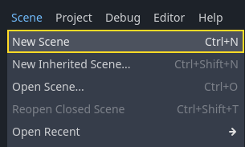

在场景面板中，单击“2D 场景”按钮。这样就会添加一个 [Node2D](https://docs.godotengine.org/zh-cn/4.x/classes/class_node2d.html#class-node2d) 作为我们的根节点。

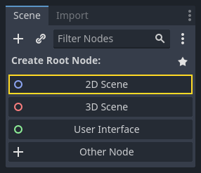

在文件系统面板中，单击之前保存的 `sprite_2d.tscn` 文件并将其拖动到 Node2D 上，对其进行实例化。

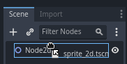

我们想要添加另一个节点作为 Sprite2D 的同级节点。为此，请右键单击 Node2D，然后选择“添加子节点”。

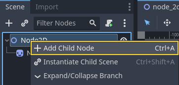

寻找并添加 [Button](https://docs.godotengine.org/zh-cn/4.x/classes/class_button.html#class-button) 节点。

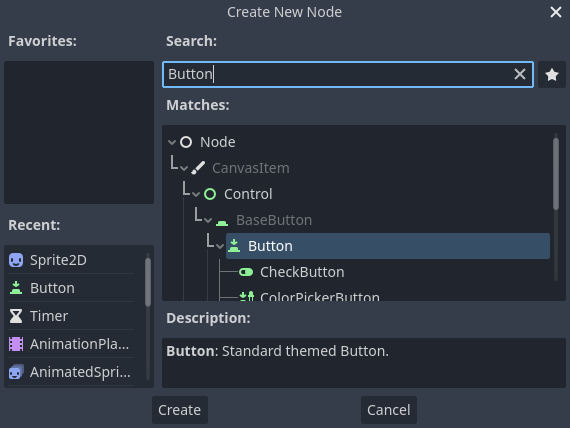

该节点默认比较小。在视口中，点击并拖拽该按钮右下角的手柄来调整大小。

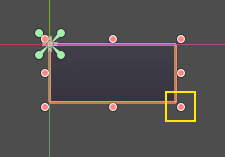

如果看不到手柄，请确保工具栏中的选择工具处于活动状态。

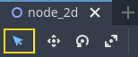

点击并拖拽按钮使其更接近精灵。

你可以通过修改检查器中的 Text 属性来给 Button 上写一个标签。请输入`Toggle motion`。

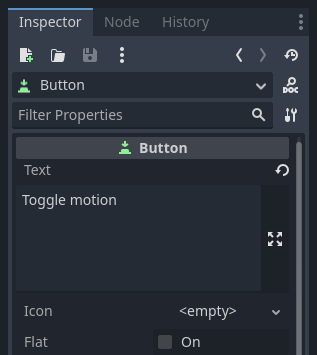

你的场景树和视口应该是类似这样的。

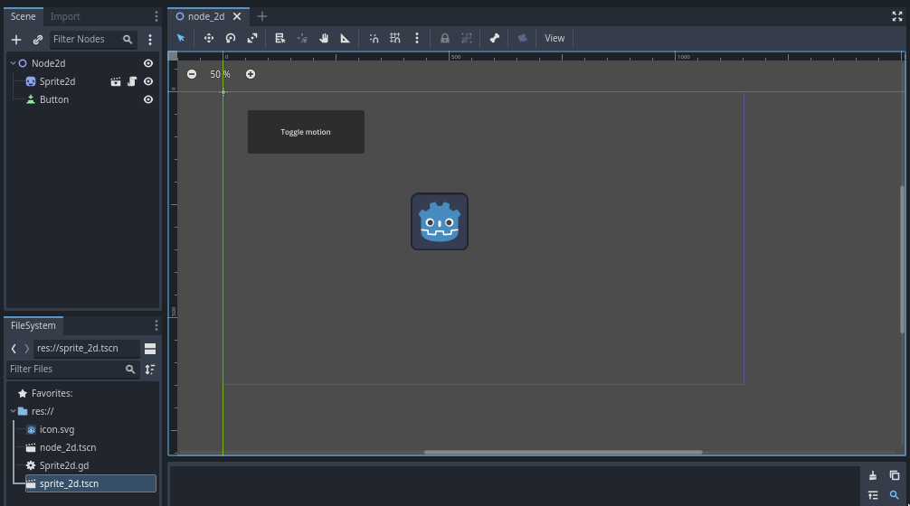

如果你还没保存场景的话，保存新建的场景为 `node_2d.tscn`。然后你就可以使用 F6`（macOS 则为 :kbd:`Cmd + R）来运行。此时，你可以看到按钮，但是按下之后不会有任何反应。

## 在编辑器中连接信号[](https://docs.godotengine.org/zh-cn/4.x/getting_started/step_by_step/signals.html#connecting-a-signal-in-the-editor)

然后，我们希望将按钮的“pressed”信号连接到我们的 Sprite2D，并且我们想要调用一个新函数来打开和关闭其运动。我们需要像我们在上一课中所做的操作一样，将一个脚本附加到 Sprite2D 节点。

你可以在“节点”面板中连接信号。选择 Button 节点，然后在编辑器的右侧，单击检查器旁边名为“节点”的选项卡。

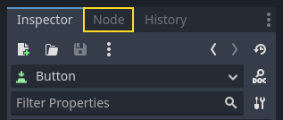

停靠栏显示所选节点上可用的信号列表。

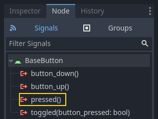

双击“pressed”信号，打开节点连接窗口。

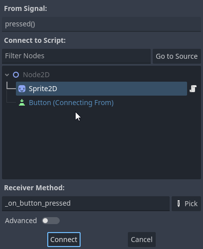

然后，你可以将信号连接到 Sprite2D 节点。该节点需要一个用于接收按钮信号的函数，当按钮发出信号时，Godot 将调用该函数。编辑器会为你生成一个。按照规范，我们将这些回调方法命名为"_on_node_name_signal_name"。在这里，它被命名为"_on_button_pressed"。

> 备注
>
> 通过编辑器的节点面板连接信号时，可以使用两种模式。简单的一个只允许你连接到附加了脚本的节点，并在它们上面创建一个新的回调函数。
>
> 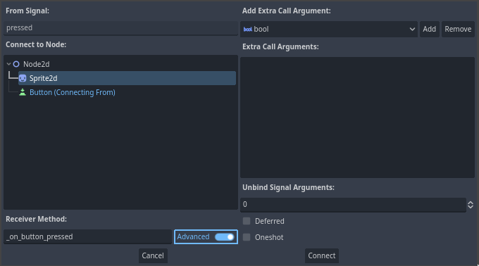
>
> 你可以在高级视图中连接到任何节点和任何内置函数、向回调添加参数、设置选项。你可以单击窗口右下角的“高级”按钮来切换模式。

> 备注
>
> 如果你使用的是外部编辑器（如 VS Code），这种自动代码生成可能无法正常工作。在这种情况下，你需要通过代码连接信号，如下一节所述。

单击“连接”按钮以完成信号连接并跳转到脚本工作区。你应该会看到新方法，并在左边距中带有连接图标。

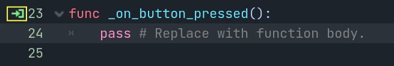

如果单击该图标，将弹出一个窗口并显示有关连接的信息。此功能仅在编辑器中连接节点时可用。

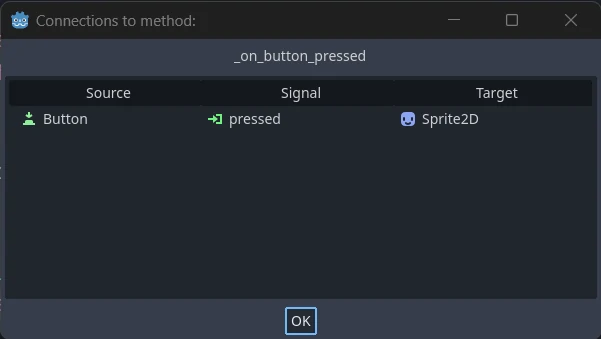

让我们用代码替换带有 `pass` 关键字的一行，以切换节点的运动。

我们的 Sprite2D 由于 `_process()` 函数中的代码而移动。Godot 提供了一种打开和关闭处理的方法：[Node.set_process()](https://docs.godotengine.org/zh-cn/4.x/classes/class_node.html#class-node-method-set-process) 。Node 的另一个方法 `is_processing()` ，如果空闲处理处于活动状态，则返回 `true`。我们可以使用 `not` 关键字来反转该值。

```GDScript
func _on_button_pressed():
	set_process(not is_processing())
```


此函数将切换处理，进而切换按下按钮时图标的移动。

在尝试游戏之前，我们需要简化 `_process()` 函数，以自动移动节点，而不是等待用户输入。将其替换为以下代码，这是我们在两课前看到的代码：

```GDScript
func _process(delta):
	# 每帧更新旋转角度：角速度 * 时间增量
	rotation += angular_speed * delta
	
	# 计算当前速度向量：将向上的向量旋转当前角度，然后乘以速度值
	var velocity = Vector2.UP.rotated(rotation) * speed
	
	# 更新位置：当前位置 + 速度 * 时间增量
	position += velocity * delta
```


你的完整的 `Sprite_2d.gd` 代码应该是类似下面这样的。


```GDScript
extends Sprite2D

# 定义移动速度
var speed = 400
# 定义旋转速度，使用PI表示180度
var angular_speed = PI

# 每帧调用的处理函数
func _process(delta):
	# 更新旋转角度：角速度 * 时间增量
	rotation += angular_speed * delta
	# 计算当前速度向量：将向上的向量旋转当前角度，然后乘以速度值
	var velocity = Vector2.UP.rotated(rotation) * speed
	# 更新位置：当前位置 + 速度 * 时间增量
	position += velocity * delta

# 按钮按下时的回调函数
func _on_button_pressed():
	set_process(not is_processing())
```


运行该场景，然后点击按钮，就可以看到精灵开始或停止运行。

## 用代码连接信号[](https://docs.godotengine.org/zh-cn/4.x/getting_started/step_by_step/signals.html#connecting-a-signal-via-code)

你可以通过代码连接信号，而不是使用编辑器。这在脚本中创建节点或实例化场景时是必需的。

让我们在这里使用一个不同的节点。Godot 有一个 [Timer](https://docs.godotengine.org/zh-cn/4.x/classes/class_timer.html#class-timer) 节点，可用于**实现技能冷却时间、武器重装**等。

回到 2D 工作区。你可以点击窗口顶部的“2D”字样，或者按 Ctrl + F1（macOS 上则是 Ctrl + Cmd + 1）。

在“场景”面板中，右键点击 Sprite2D 节点并添加新的子节点。搜索 Timer 并添加对应节点。你的场景现在应该类似这样。

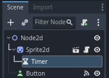

选中 Timer 节点，在“检查器”中勾选 **Autostart** 属性。

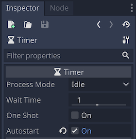

点击 Sprite2D 旁的脚本图标，返回脚本工作区。

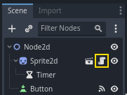

我们需要执行两个操作来通过代码连接节点：

1. 从 Sprite2D 获取 Timer 的引用。
2. 通过 Timer 的“timeout”信号调用 `connect()` 方法。

> 备注
>
> 要使用代码来连接信号，你需要调用所需监听节点信号的 `connect()` 方法。这里我们要监听的是 Timer 的“timeout”信号。
>

我们想要在场景实例化时连接信号，我们可以使用 [Node._ready()](https://docs.godotengine.org/zh-cn/4.x/classes/class_node.html#class-node-private-method-ready) 内置函数来实现这一点，当节点完全实例化时，引擎会自动调用该函数。

为了获取相对于当前节点的引用，我们使用方法 [Node.get_node()](https://docs.godotengine.org/zh-cn/4.x/classes/class_node.html#class-node-method-get-node)。我们可以将引用存储在变量中。

```GDScript
func _ready():
	var timer = get_node("Timer")
```

`get_node()` 函数会查看 Sprite2D 的子节点，并按节点的名称获取节点。例如，如果在编辑器中将 Timer 节点重命名为“BlinkingTimer”，则必须将调用更改为 `get_node("BlinkingTimer")`。

现在，我们可以在 `_ready()` 函数中将Timer连接到Sprite2D。

```GDScript
func _ready():
	var timer = get_node("Timer")
	timer.timeout.connect(_on_timer_timeout)
```

该行读起来是这样的：我们将计时器的“timeout”信号连接到脚本附加到的节点上。当计时器发出 `timeout` 时，去调用我们需要定义的函数 `_on_timer_timeout()`。让我们将其定义添加到脚本的底部，并使用它来切换精灵的可见性。

备注

按照惯例，我们将这些回调方法在 GDScript 中命名为“_on_node_name_signal_name”，在 C# 中命名为“OnNodeNameSignalName”。故此处的GDScript 为“_on_timer_timeout”，C# 为“OnTimerTimeout()”。

```GDScript
func _on_timer_timeout():
	visible = not visible
```

`visible` 属性是一个布尔值，用于控制节点的可见性。`visible = not visible` 行切换该值。如果 `visible` 是 `true`，它就会变成 `false`，反之亦然。

如果你现在运行 Node2D 场景，就会看到精灵在闪啊闪的，间隔为一秒。

## 完整脚本[](https://docs.godotengine.org/zh-cn/4.x/getting_started/step_by_step/signals.html#complete-script)

这就是我们小小的 Godot 图标移动闪烁演示了！这是完整的 `sprite_2d.gd` 文件，仅供参考。

```GDScript
extends Sprite2D

var speed = 400
var angular_speed = PI


func _ready():
	var timer = get_node("Timer")
	timer.timeout.connect(_on_timer_timeout)


func _process(delta):
	rotation += angular_speed * delta
	var velocity = Vector2.UP.rotated(rotation) * speed
	position += velocity * delta


func _on_button_pressed():
	set_process(not is_processing())


func _on_timer_timeout():
	visible = not visible
```


## 自定义信号[](https://docs.godotengine.org/zh-cn/4.x/getting_started/step_by_step/signals.html#custom-signals)

> 备注
>
> 本节介绍的是如何定义并使用你自己的信号，不依赖之前课程所创建的项目。
>

你可以在脚本中定义自定义信号。例如，假设你希望在玩家的生命值为零时通过屏幕显示游戏结束。为此，当他们的生命值达到 0 时，你可以定义一个名为“died”或“health_depleted”的信号。

```GDScript
extends Node2D

signal health_depleted

var health = 10
```


备注

由于信号表示刚刚发生的事件，我们通常在其名称中使用过去时态的动作动词。

自定义信号的工作方式与内置信号相同：它们显示在“节点”选项卡中，你可以像连接其他信号一样连接到它们。

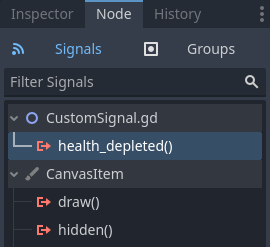

要通过代码发出信号，请调用信号的 `emit()` 方法。

```GDScript
func take_damage(amount):
	health -= amount
	if health <= 0:
		health_depleted.emit()
```


信号还可以选择声明一个或多个参数。在括号之间指定参数的名称：

```GDScript
extends Node2D

signal health_changed(old_value, new_value)

var health = 10
```


> 备注
>
> 这些信号参数显示在编辑器的节点停靠面板中，Godot 可以使用它们为你生成回调函数。但是，发出信号时仍然可以发出任意数量的参数；所以由你来决定是否发出正确的值。
>

要在发出信号的同时传值，请将它们添加为 `emit()` 函数的额外参数：

```GDScript
func take_damage(amount):
	var old_health = health
	health -= amount
	health_changed.emit(old_health, health)
```


## 总结[](https://docs.godotengine.org/zh-cn/4.x/getting_started/step_by_step/signals.html#summary)

Godot 中的任何节点都会在发生特定事件时发出信号，例如按下按钮。其他节点可以连接到单个信号并对所选事件做出反应。

信号有很多用途。有了它们，你可以对进入或退出游戏世界的节点、碰撞、角色进入或离开某个区域、界面元素的大小变化等等做出反应。

例如，代表金币的 [Area2D](https://docs.godotengine.org/zh-cn/4.x/classes/class_area2d.html#class-area2d) 会在玩家的物理实体进入其碰撞形状时发出 `body_entered` 信号，让你知道玩家收集到了金币。

在下一节 [你的第一个 2D 游戏](https://docs.godotengine.org/zh-cn/4.x/getting_started/first_2d_game/index.html#doc-your-first-2d-game) 中，你将创建一个完整的 2D 游戏，使用目前为止学到的东西进行实战。
