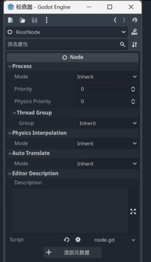
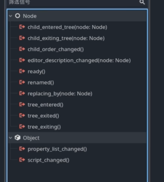
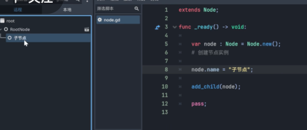
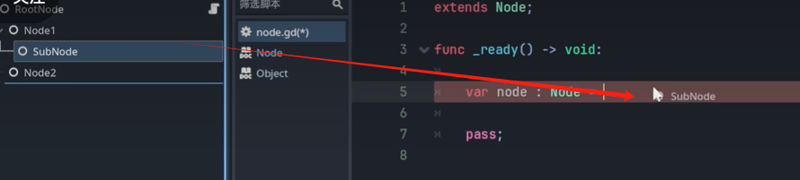
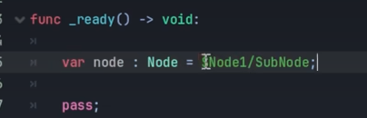

# Node节点总结

## node节点属性
node节点是所有节点的基类
实现了所以节点的通用功能

### 场景运行原理
场景从根节点开始运行节点，按照父子关系将场景树构建起来。

### MainLoop
  MainLoop是Godot项目中游戏的抽象基类，它被SceneTree(场景树)继承，SceneTree是Godot项目中使用的默认游戏循环的实现，不过**开发者也可以开发自己的MainLoop子类，来替代场景树**。

### SceneTree
  SceneTree是Godot项目中使用的默认游戏循环的实现，它继承了MainLoop。

  作为最重要的类，SecneTree管理节点的层次结构以及场景本身，节点可以被添加，获取或移除。当场景被实例化时没被调用进场景树，那么这个场景是失效的
### 节点生命周期_enter_tree() 和 _exit_tree()
  当节点被添加进场景树的时候，会触发节点脚本中的_enter_tree()方法，当节点从场景树中移除的时候，会触发节点脚本中的_exit_tree()方法。而这些方法的调用顺序是根据节点被添加进树中的顺序决定的。

  举例：
-根节点
 -子节点
根节点：
```godot
extends Node

func _enter_tree() -> void:
  print("根节点进入场景树")
```
子节点：
```godot
extends Node

func _enter_tree() -> void:
  print("子节点进入场景树")
```

运行打印顺序：
```
子节点进入场景树
根节点进入场景树
```

### 节点生命周期_ready()
  _ready()方法在所有节点都被添加至场景树之后，Godot会根据叶子节点至根节点的顺序，去调用他们的_ready()方法。
  举例：

-根节点
 -子节点
根节点：
```godot
extends Node

func _ready() -> void:
  print("根节点准备")
```
子节点：
```godot
extends Node

func _ready() -> void:
  print("子节点准备")
```

运行打印顺序：
```
子节点准备
根节点准备
```

### 节点生命周期_process()
  _process(delta)方法在场景树的每个帧被都被触发调用。delta是自上一帧以来经过的时间,这个时间跟电脑运行速度有关，不是恒定的。

  假如说电脑一秒运行60帧，那么_process()方法就会被调用60次。 delta 是时间增量，是自上一帧以来经过的时间。

  只有在启动处理的时候才会被调用，如果重写_process()方法，可以用set_process(true)和set_process(false)来启动和停止处理。
> 注意: 这个方法只有节点存在于场景树种才会被调用

Godot 默认开启垂直同步，最好要限制一下帧数。

### 节点生命周期_physics_process()
  _physics_process(delta)方法在场景树的每个物理帧被都被触发调用。delta是恒等的，不受电脑运行速度影响。

  _physics_process()方法每秒调用60次，不受性能影响


### node节点属性


一. Process分组的Mode属性
在代码访问中，名称为process_mode，这个属性控制了节点的_process()函数在不同场景暂停状态下的处理方式。它有5种模式：

1. PROCESS_MODE_INHERIT（0）：从该节点的父节点继承process_mode。这是任何新创建的节点的默认设置。

2. PROCESS_MODE_PAUSABLE（1）：当SceneTree.paused为true时停止处理。这是PROCESS_MODE_WHEN_PAUSED的逆，也是根节点的默认值。

3. PROCESS_MODE_WHEN_PAUSED（2）：仅当SceneTree.paused为true时处理。与PROCESS_MODE_PAUSABLE相反。

4. PROCESS_MODE_ALWAYS（3）：始终处理。忽略SceneTree.paused的取值，保持处理。与PROCESS_MODE_DISABLED相反。

5. PROCESS_MODE_DISABLED（4）：从不处理。完全禁用处理，忽略SceneTree.paused。与PROCESS_MODE_ALWAYS相反。

二. Process分组的Priority属性
在代码中称为process_priority，用于控制节点在场景树中的处理顺序。数值越大，处理顺序越靠后。默认值为0。

1. 影响范围：
   - 控制_process()和_physics_process()方法的调用顺序
   - 影响输入事件的处理顺序
   - 影响动画播放的顺序

2. 使用场景：
   - 当需要确保某些节点在其他节点之前处理时
   - 控制UI元素的响应顺序
   - 管理复杂场景中的更新顺序

3. 注意事项：
   - 相同优先级的节点按场景树顺序处理
   - 建议使用适度的优先级值（0-100）
   - 过高的优先级可能导致性能问题


三. Process分组的Physics Priority属性
在代码中称为physics_priority，用于控制节点在场景树中的物理处理顺序。数值越大，处理顺序越靠后。默认值为0。

1. 影响范围：
   - 控制_physics_process()方法的调用顺序
   - 影响物理模拟和碰撞检测的顺序
   - 影响刚体运动的更新顺序

2. 使用场景：
   - 当需要确保某些物理对象在其他对象之前更新时
   - 控制复杂物理场景中的模拟顺序
   - 管理物理交互的优先级

3. 注意事项：
   - 相同优先级的节点按场景树顺序处理
   - 建议使用适度的优先级值（0-100）
   - 过高的优先级可能导致物理模拟不稳定
   - 与process_priority不同，它只影响物理相关的处理

四. 线程组（Thread Group）

在Godot中，线程组用于将节点分配到特定的线程中进行处理，主要用于优化多线程性能。以下是关于线程组的详细介绍：

1. 基本概念
   - 线程组允许将节点分配到特定的处理线程
   - 主要用于优化CPU密集型操作
   - 默认情况下，所有节点都在主线程中处理

2. 主要属性
   - thread_group：指定节点所属的线程组
   - thread_group_mode：控制线程组的行为模式

3. 线程组模式
   a) THREAD_GROUP_MODE_INHERIT（0）：继承父节点的线程组设置
   b) THREAD_GROUP_MODE_MAIN_THREAD（1）：强制在主线程中处理
   c) THREAD_GROUP_MODE_SUB_THREAD（2）：强制在子线程中处理

4. 使用场景
   - 优化物理模拟性能
   - 提高AI计算效率
   - 加速粒子系统更新
   - 处理大量独立对象的逻辑

5. 注意事项
   - 线程间通信需要额外处理
   - 确保线程安全，避免数据竞争
   - 合理分配线程组，避免过度使用子线程
   - 调试多线程代码可能更复杂

五.Physics Interpolation属性

在Godot中，Physics Interpolation属性用于控制物理模拟的插值方式，主要用于优化物理模拟的平滑性和准确性。当渲染周期大于物理周期时，物理引擎进行的物理计算不能与显示器刷新率相对应时，会导致画面会出现阶梯状的抖动问题。
为了解决这个问题，Godot使用物理插值法来计算图片应该渲染的位置。通过上下帧的物理计算结果，计算出物体应该在的位置，然后进行插值计算，得到一个平滑的位置。


六. AutoTranslate分组中的auto_translate_mode

负责控制节点中包含文本的自动翻译行为。

1. AUTO_TRANSLATE_MODE_INHERIT（0）：从父节点继承自动翻译模式，这是新创建节点的默认设置
2. AUTO_TRANSLATE_MODE_ALWAYS（1）：始终自动翻译，与DISABLED模式相反，是根节点的默认值
3. AUTO_TRANSLATE_MODE_DISABLED（2）：始终不自动翻译，与ALWAYS模式相反。生成POT文件时会跳过该节点，如果子节点为INHERIT模式也会跳过子节点

七. Editor Description属性

在编辑器中显示的描述信息，在编辑器中点击节点或悬浮时，会在右侧显示该节点的描述信息。

八. script属性

脚本属性，用于存储节点的脚本文件。

## Node节点中内置的信号部分



### child_entered_tree(node) 和 child_exiting_tree(node)
1. child_entered_tree(node) 
当某个节点作为子节点进入树中时触发信号，比如通过add_child()方法添加子节点时，就会触发该信号。

2. child_exiting_tree(node) 
当子节点从场景树中移除时触发信号，比如通过remove_child()方法移除子节点时，就会触发该信号。

### child_order_changed() 监听信号
当节点在场景树中的位置发生变化(添加，移动，移除)时触发信号，比如通过move_child()方法移动子节点时，就会触发该信号。


### editor_description_changed() 监听信号
当节点在编辑器中的描述信息发生变化时触发信号，比如通过set_editor_description()方法设置描述信息时，就会触发该信号。


### ready() 
ready信号在我们节点的_ready()方法被调用时触发,可以看作一种信号的形式。

### renamed() 
renamed信号在我们节点的名称发生变化时触发，比如通过set_name()方法设置名称时，就会触发该信号。

### replacing_by()
replacing_by信号在我们节点被另一个节点替换时触发，比如通过replace_by()方法替换节点进自身在场景树的位置时。

### tree_entered()
tree_entered信号在我们自身进入场景树时触发，比如通过add_child()方法添加子节点时，就会触发该信号。

### tree_exiting()
tree_exiting信号在我们自身即将从场景树中移除时触发，比如通过remove_child()方法移除子节点时，就会触发该信号。

### tree_exited()
tree_exited信号在我们自身已经从场景树中移除时触发，比如通过remove_child()方法移除子节点时，就会触发该信号。


## 代码的方式操作节点

### 创建节点
在Godot中，我们可以通过代码来创建和操作节点。以下是一个基本示例：

```godot
extends Node

func _ready():
  # 创建一个新节点
  var new_node = Node.new()
  # 设置新节点的名称
  new_node.name = "New Node"
  # 添加到当前节点
  add_child(new_node)
```
在运行之后，我们查看文件结构，可以看到我们创建的new_node节点已经被添加到当前节点中。



### 移出场景树


#### 销毁节点并移出场景树 free() 和 queue_free()
```godot
extends Node

func _ready():
  # 创建一个新节点
  var new_node = Node.new()
  # 设置新节点的名称
  new_node.name = "New Node"
  # 添加到当前节点
  add_child(new_node)
  # 移出场景树
  new_node.queue_free()
```
在运行之后，我们查看文件结构，可以看到我们创建的new_node节点已经被移出场景树。
queue_free()方法不会立即删除节点，而是加入删除队列，等待一帧后删除。
如果要马上删除节点，可以使用free()方法。


#### 不销毁节点移出场景树 remove_child()

```godot
extends Node

func _ready():
  # 创建一个新节点
  var new_node = Node.new()
  # 设置新节点的名称
  new_node.name = "New Node"
  # 添加到当前节点
  add_child(new_node)
  # 移出场景树
  new_node.remove_child(new_node)
```

在运行之后，我们查看文件结构，可以看到我们创建的new_node节点已经被移出场景树,但节点还在内存中。要彻底删除节点，需要使用free()方法。

### 更改一个节点的父节点

场景树的引用可以通过拖动的方式实现:




```godot
extends Node

func _ready() -> void:
    var node: Node = $Node1/SubNode;
    node.reparent($Node2);
    pass;
```
在Godot中，`reparent()`方法用于将一个节点从一个父节点移动到另一个父节点。这个方法非常有用，当你需要在运行时动态地改变节点的层级关系时。


```godot
extends Node

func _ready() -> void:
    var node: Node = self.get_node("Node1"); # 获取Node1节点
    node.get_child(0); # 获取Node1的第一个子节点
    node.get_children(); # 获取Node1的所有子节点
    node.get_parent(); # 获取Node1的父节点
    pass;
```
当我们将一个节点移出场景树时，该节点的子节点也会被移出场景树，但是子父节点关系不会改变。
