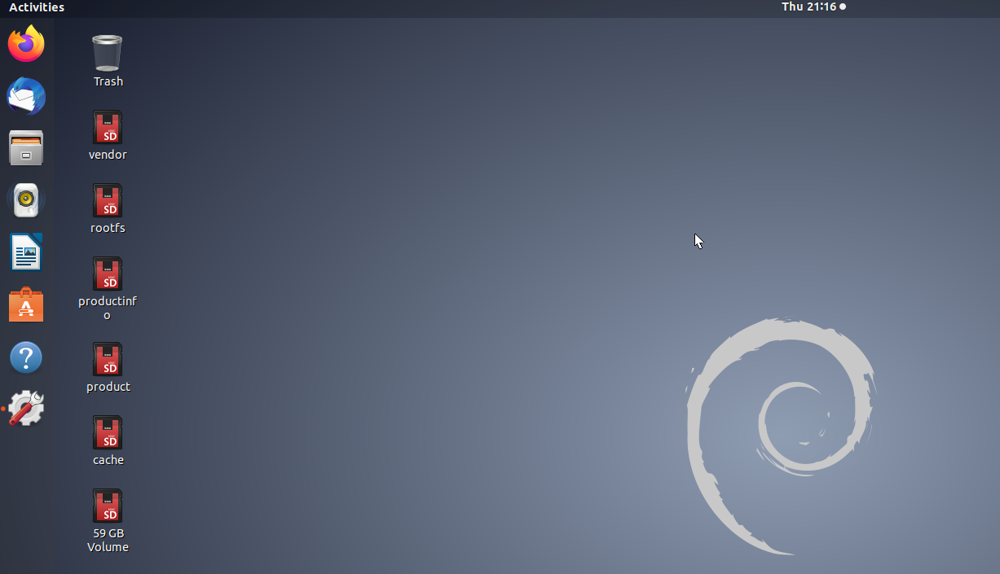

这里用到的Ubuntu和Windows的版本如下：

> Ubuntu18.04 LTS
> Windows10 Pro

## 2. Ubuntu侧的准备

### 2.1 从 [设定] 工具 开启 屏幕 共享

打开Unbuntu的 [设定] 工具，找到 [Sharing] 页面


将 [Screen Sharing] （[屏幕共享] ）设定打开（下面页面左上角的按钮设置为 [ON] ）

如果需要设置密码，在[Password]栏里设置密码


### 2.2 设置防火墙

通过以下命令可以查看防火墙的启动情况

```bash
$ sudo ufw status
```

如果是 inactive的话，可以不需要任何设置。

如果需要开启防火墙的话，那需要打开5900端口

```bash
$ sudo ufw allow 5900
$ sudo ufw reload
$ sudo ufw status
```

### 2.3 设置Gsettings

通过Windows连接的时候，需要将通信的加密处理关掉。关于Vino的说明[[1\]](https://zhuanlan.zhihu.com/p/127265014#ref_1)请看注释。

（这里是不完美之处之一，因为远程桌面之间的通信内容没有加密，在security方面是有瑕疵的。当然，如果是公司内的局域网，则没有这个问题）

```bash
$ sudo gsettings set org.gnome.Vino require-encryption false
```

### 2.4 安装 xdrp

xrdp[[2\]](https://zhuanlan.zhihu.com/p/127265014#ref_2)是Microsoft RDP服务器的免费开源实现，可以通过以下命令安装

```bash
sudo apt-get install xrdp
sudo systemctl restart xrdp
```

## 3 Windows侧的准备

### 3.1 使用自带的远程登录工具

在Windows自带的远程工具中输入要远程登录的PC的名字（或者IP）后，会出现如下的画面。


将登录模式改为[console], 并输入你在Ubuntu侧设置的密码，即可登录了。


在这一步出现了问题，显示：

```
started connecting

connecting to 192.168.x.xx 5900

tcp connected

security level is 0 (1 = none, 2 = standard)

error - problem connecting
```

需要运行以下命令：

```
 gsettings set org.gnome.Vino require-encryption false
```

运行之后需要重启电脑才会生效

登录后的画面如下。



### 3.2 使用VNC工具登录

VNC的工具有很多，我使用的TightVNC[[6\]](https://zhuanlan.zhihu.com/p/127265014#ref_6)是一个开源的软件。

下载安装以后，打开[TightVNC Viewer]，会出现如下画面


按照提示输入密码


参考文章:

[解决Ubuntu远程桌面无法正常连接的问题_vnc security level is 0-CSDN博客](https://blog.csdn.net/yiranzai_lushang/article/details/121100586)

[ubuntu 18.04远程桌面（一定好用！） - 知乎 (zhihu.com)](https://zhuanlan.zhihu.com/p/127265014)