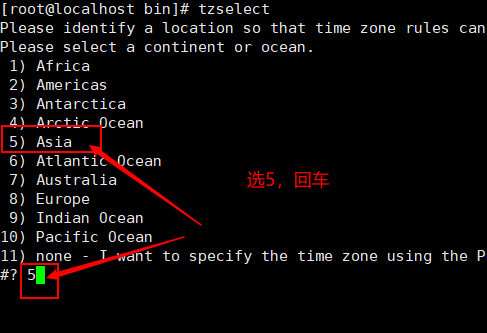
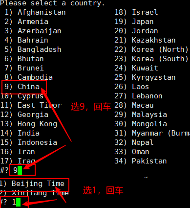
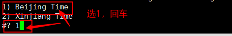
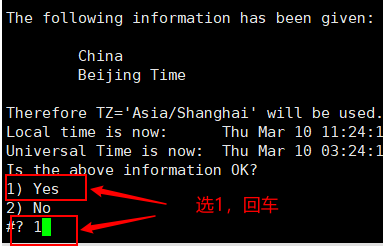

## 修改依赖源

当想要修改依赖源的时候，通过修改/etc/apt/sources.list中的源实现：

```
deb http://mirrors.aliyun.com/ubuntu-ports/ bionic main restricted universe multiverse
deb http://mirrors.aliyun.com/ubuntu-ports/ bionic-security main restricted universe multiverse
deb http://mirrors.aliyun.com/ubuntu-ports/ bionic-updates main restricted universe multiverse
deb http://mirrors.aliyun.com/ubuntu-ports/ bionic-proposed main restricted universe multiverse
deb http://mirrors.aliyun.com/ubuntu-ports/ bionic-backports main restricted universe multiverse
deb-src http://mirrors.aliyun.com/ubuntu-ports/ bionic main restricted universe multiverse
deb-src http://mirrors.aliyun.com/ubuntu-ports/ bionic-security main restricted universe multiverse
deb-src http://mirrors.aliyun.com/ubuntu-ports/ bionic-updates main restricted universe multiverse
deb-src http://mirrors.aliyun.com/ubuntu-ports/ bionic-proposed main restricted universe multiverse
deb-src http://mirrors.aliyun.com/ubuntu-ports/ bionic-backports main restricted universe multiverse  
```

地址中如果写为/ubuntu/则是在x86框架的ubuntu下，如果输入/ubuntu-ports/则要求机器是arm64平台

输入命令更新依赖:

```
apt-get update
```

依赖大全：https://blog.csdn.net/Zander0/article/details/119698368

## 更新依赖出现Updates for this repository will not be applied.错误

```
E: Release file for http://security.ubuntu.com/ubuntu/dists/bionic-security/InRelease is not valid yet (invalid for another 11d 10min 50s). Updates for this repository will not be applied
```

### 1.遇到这个问题主要是时间没有更新导致的，首先我们要查看当前时区

```bash
root@bf8fc620bea2:/ date -R
Thu, 10 Mar 2022 02:38:36 +0800
// 很显然这不是东八区的时间，下面我们就需要修改时区
```

### 2.使用tzselect命令修改时区



  
  


### 3.查看是不是更改为东八区

```bash
[root@localhost bin]# date -R
Thu, 10 Mar 2024 21:04:57 +0800
```

## 4.同步时间

要在 Ubuntu 上与时间服务器同步时间，可以按照以下步骤进行操作：

1. 打开终端，使用以下命令安装 ntpdate 工具（如果尚未安装）：
```
sudo apt update
sudo apt install ntpdate
```

2. 运行以下命令同步时间服务器：
```
sudo ntpdate time.nist.gov
```
请注意：在上面的命令中，`time.nist.gov` 是一个时间服务器的示例，你可以根据需要选择其他时间服务器。

输入之后再输入date -R 看一下时间是不是对了，如果对了说明就成功了

### 5.再次执行apt-get update命令就可以成功了

```bash
root@bf8fc620bea2:/# apt-get update
Hit:1 http://deb.debian.org/debian bullseye InRelease                             
Hit:2 http://deb.debian.org/debian bullseye-updates InRelease                     
Hit:3 http://security.debian.org/debian-security bullseye-security InRelease
Reading package lists... Done

```

 