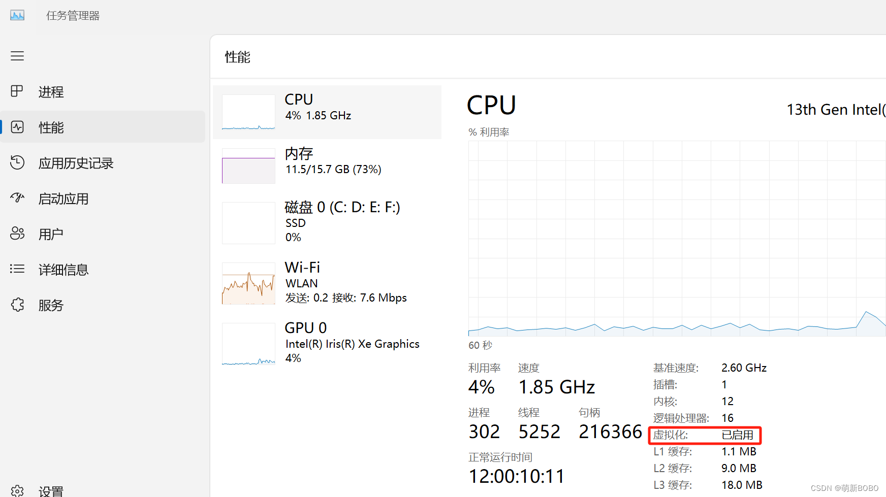
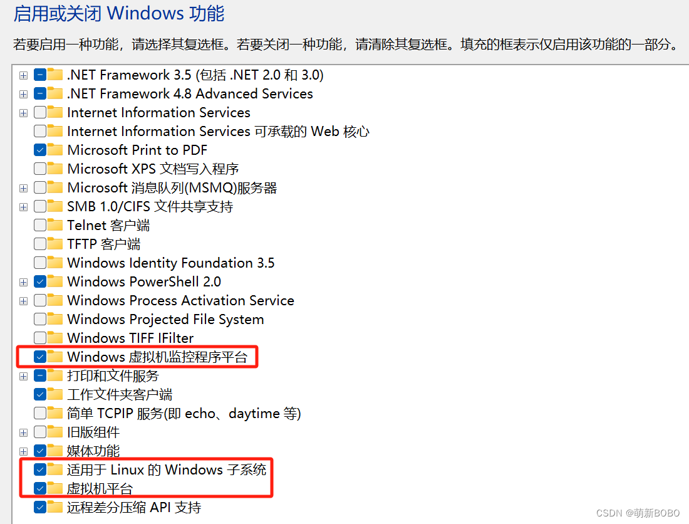
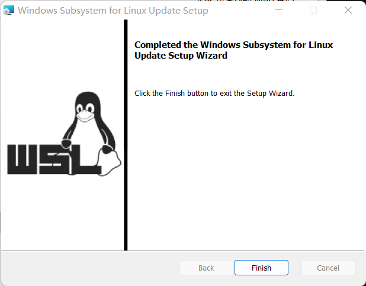
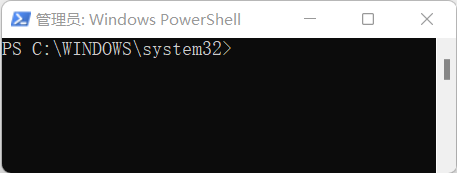
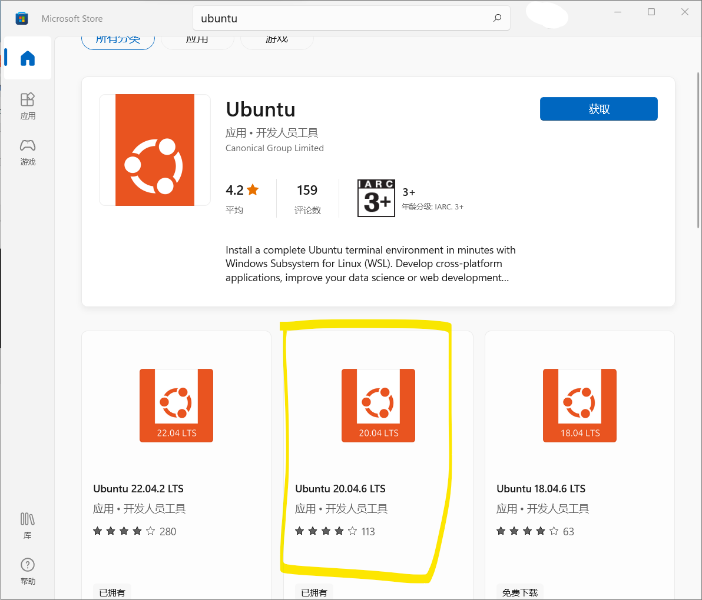
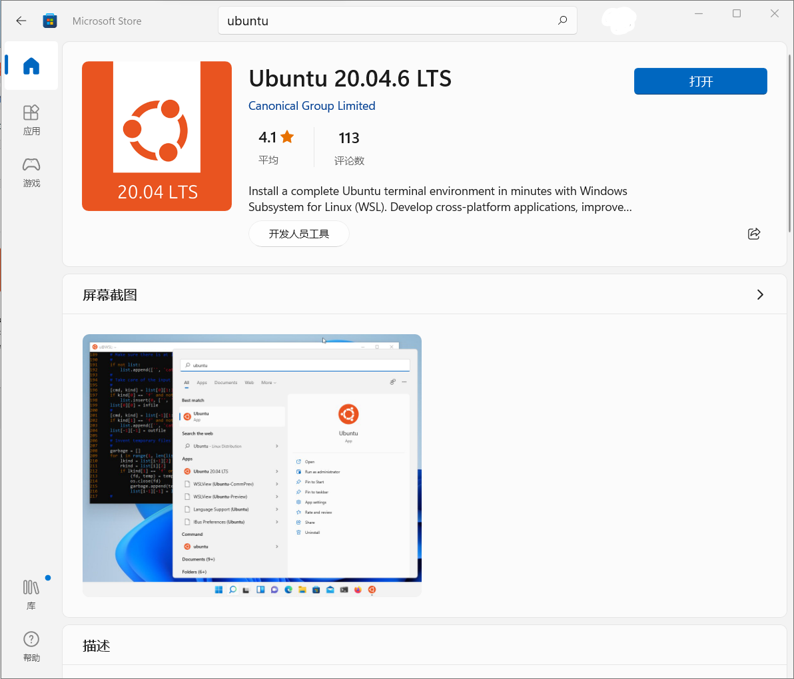
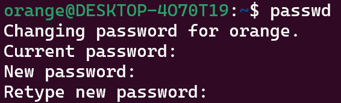
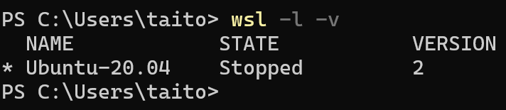

首先确认一下自己的电脑[虚拟化](https://so.csdn.net/so/search?q=虚拟化&spm=1001.2101.3001.7020)开了没有。

打开**任务管理器**，点击**性能，如下图：**

2、点击控制面板，点击程序，点击启用或关闭Windows功能，像下图一样，开启红框里的那几项。

配置功能后记得重启。

之后还可能要安装一个软件（下载速度有些慢）：

[https://wslstorestorage.blob.core.windows.net/wslblob/wsl\_update\_x64.msi](https://wslstorestorage.blob.core.windows.net/wslblob/wsl_update_x64.msi)  




**接下来的全过程只有设置用户名和密码的时候以及设置 su 的密码时候在 Ubuntu 上操作，其余都是在 Windows PowerShell 上操作的**。

首先，用管理员权限打开 Windows PowerShell  

在 Windows PowerShells 操作的时候：  
记住：一定要在Ubuntu 关闭的时候操作  
记住：一定要在Ubuntu 关闭的时候操作  
记住：一定要在Ubuntu 关闭的时候操作  



### 1\. 先将其变为 wsl1

执行：

```
wsl --set-default-version 1
```

### 2\. 从应用商店直接安装到 C盘 中





### 3\. 打开 Ubuntu 并设置用户名和密码：

这个时候如果用 `su`,输入密码时会显示错误。所以我们要设置`su`的密码。

```
$ sudo passwd
```

  
这样就能使用 `su`了。

此时运行

```
wsl -l -v 
```

就能看到安装的子系统了。

### 4\. 接下来开始打包搬迁到 D盘下

首先，用管理员权限打开 Windows PowerShell  
并运行指令：  
因为我这里 wsl -l -v 显示安装的是Ubuntu 20.04，所以这里指明的是 Ubuntu20.04。将其打包放在D:/export.tar ，这里的目录可以自定义。

```
wsl --export Ubuntu20.04 D:/export.tar
```

### 4\. 已经打包一份到D盘中，所以将C盘下的注销掉。

注销指令

```
wsl --unregister Ubuntu-20.04
```

现在再运行 wsl -l -v 就能看到原先的那个子系统已经没有了。

### 5\. 我们现在将打包好的安装到指定目录上

先将 wsl 提升到 [wsl2](https://so.csdn.net/so/search?q=wsl2&spm=1001.2101.3001.7020)

```
wsl --set-default-version 2
```

然后安装打包后的 Ubuntu20.04 :  
这里的D：、Ubuntu\_20\_04 就是我设置的安装目录。  
D:\\export.tar 就是之前的打包的位置。  
–version 2 代表这个子系统以 wsl2 的形式安装。

```
wsl --import Ubuntu-20.04 D:\Ubuntu_20_04\ D:\export.tar --version 2
```

此时如果出现了错误：  
运行：

```
bcdedit /set hypervisorlaunchtype off
```

或是

```
bcdedit /set hypervisorlaunchtype auto
```

解决后：  
设置为默认的子系统

```
wsl --setdefault Ubuntu-20.04 
```

### 6\. 打开Ubuntu 后发现此时默认的是 root 用户。

我们要恢复默认普通的用户，我们原先的用户名为 orange. 安装的是Ubuntu-20.04 所以：

```
Ubuntu2004 config --default-user orange
```

再打开就恢复默认普通用户了。

此时 wsl -l -v 查看：  
version 2 就是 wsl2 的意思。此时就已经搬家成功了。  
 

**错误情景**
--------

在win11系统中，将wsl1升级到了WSL2，在升级了WSL2以后安装ubuntu时遇到问题，安装完成后无法正常启动，报错信息如下：

```text
Installing, this may take a few minutes...
WslRegisterDistribution failed with error: 0x800701bc
Error: 0x800701bc WSL 2 ????????????? https://aka.ms/wsl2kernel
Press any key to continue...
```

### **原因**

在使用命令行把wsl1升级到wsl2后，没有安装wsl2的内核升级包，解决办法也很简单，升级wsl的内核搭配wsl2。

```text
wsl --set-default-version 2
```

#### **解决**

去微软WSL官网 [https://learn.microsoft.com/zh-cn/windows/wsl/install-manual#step-4---download-the-linux-kernel-update-package](https://link.zhihu.com/?target=https%3A//learn.microsoft.com/zh-cn/windows/wsl/install-manual%23step-4---download-the-linux-kernel-update-package) 下载安装适用于 x64 计算机的最新 WSL2 Linux 内核更新包，下载并安装wsl的内核升级包 下载地址：[https://wslstorestorage.blob.core.windows.net/wslblob/wsl\_update\_x64.msi](https://link.zhihu.com/?target=https%3A//wslstorestorage.blob.core.windows.net/wslblob/wsl_update_x64.msi) 下载后直接双击安装，之后再重亲启动ubuntu，可以正常启动。

