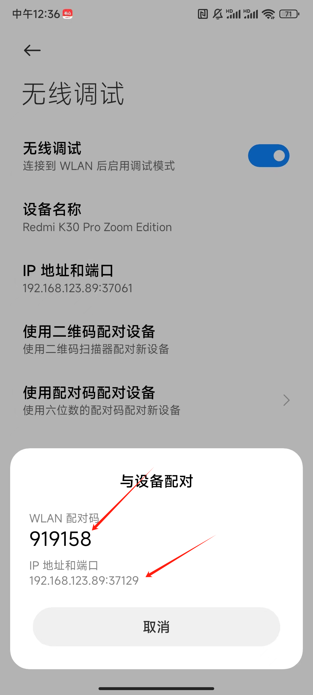
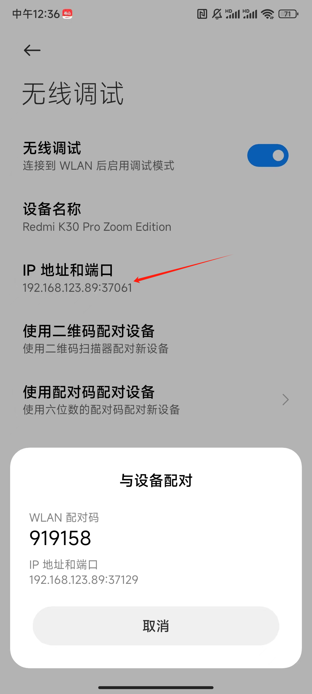

## Termux安装ubuntu

下载安装termux，然后输入

一键安装命令：

```
bash -c "$(curl -Lv gitee.com/mo2/linux/raw/master/debian.sh)"
```

### proot管理方式安装

[【termux】教程:在Android的上搭建ubuntu系统 并用VNC连接图形桌面！_哔哩哔哩_bilibili](https://www.bilibili.com/video/BV14v4y1L7r9/?spm_id_from=333.337.search-card.all.click&vd_source=a0e678f0a699f40cb533e1a6673f35fa) 推荐这个

[【※全站最细※】termux安装Ubuntu22.04教程 - 哔哩哔哩 (bilibili.com)](https://www.bilibili.com/read/cv20896519/)

### proot-distro 安装法

proot-distro，是一个Bash脚本，用于在Termux中管理与安装proot下Linux发行版。
目前，它支持安装以下发行版：

1. Alpine Linux 2. Arch Linux 3. Kali Nethunter (rootless) 4. Ubuntu (18.04 / 20.04)

   ```
   pkg install proot-distro
   ```

   以下以安装ubuntu为例：

   ```
   proot-distro install ubuntu-20.04 # 安装ubuntu20.04
   ```

   ```
   proot-distro login ubuntu-20.04 #可进入ubnut20.04
   ```

   /sdcard是内置内存的内容。

   /storage目录下有外置TF卡的内容，
   ubuntu下的vim net-tools等工具己经安装好了，不用再安装。

[termux安装ubuntu20.04的正确姿势-CSDN博客](https://blog.csdn.net/babytiger/article/details/116016329)

安装完成之后，ls根目录之后，会看到根目录下有个 容器选择菜单.sh

```
./容器选择菜单.sh
```

再选择启动相对应的服务就可以了

配置SSH
=====

*   安装ssh服务端

`apt-get install openssh-server`

*   手机安装的Linux是root用户，而且默认的22号端口不可用，因此需要修改ssh配置

```
nano /etc/ssh/sshd_config #vim也行，如果没有nano，就先apt install nano 一下
```

* 添加端口9022（其他未被占用的端口也行） 

* 其他都一样找到去掉注释

  ```
  Port 9022
  #AddressFamily any
  ListenAddress 0.0.0.0 
  ListenAddress ::
  PermitRootLogin yes  #设置允许root远程登录
  PasswordAuthentication yes
  PermitEmptyPasswords no
  ChallengeResponseAuthentication no
  ```

* 重启ssh服务器

```
service ssh restart
```

*   查找ssh进程，如下图，ssh已经成功开启

```
service ssh status
```


## Termux被杀后台

Android 12以上的设备只要Termux进后台，运行桌面环境这类占用高CPU的程序，便有可能被Android系统杀死。此时Termux会抛出一个"Process completed (signal 9) - press Enter"信息。

将Termux"上锁"(MIUI)或禁用电池优化是不管用的，Termux照样会被杀。这起因于一个新引进的系统机制，称作"Phantom Process Killing"，会限制后台程序占用。

Github上有一篇讨论Phantom Process Killing机制的文章：https://github.com/agnostic-apollo/Android-Docs/blob/master/en/docs/apps/processes/phantom-cached-and-empty-processes.md

总之，这对Temux来说是重大伤害，除了用悬浮窗让Termux挂在前台不触发Phantom Processes Killing以外，建议是用ADB命令永久停用"Phantom Process Killing"。

**以下命令可能会对设备造成损坏，或导致后台程序失控，风险自负。**  

1. Android手机打开ADB调试

2. Windows电脑至Android官网下载ADB工具: https://developer.android.com/studio/releases/platform-tools

   (如果没有电脑，可以试试Termux跑ADB远程调试：https://ivonblog.com/posts/termux-wireless-adb/)  

3. 解压，在platfrom\_tools文件夹按SHIFT+右键，打开Powershell

将手机接到Windows电脑，运行此命令配对，在手机上同意调试：

```shell
./adb devices
```

再来，按照系统版本输入命令，不需要root权限：

```shell
# Android 12L和Android 13
./adb shell "settings put global settings_enable_monitor_phantom_procs false"

# Android 12，无GMS
./adb shell "/system/bin/device_config put activity_manager max_phantom_processes 2147483647"

# Android 12，有GMS
./adb shell "/system/bin/device_config set_sync_disabled_for_tests persistent; /system/bin/device_config put activity_manager max_phantom_processes 2147483647"
```

重开机，Termux在后台运行时应该就不会被杀了。

## 小米手机不弹adb权限办法，使用远程adb

使用adb配对设备，然后输入配对码

```
adb pair 192.168.123.89:37129
```



配对成功之后，再使用adb connect就可以直接连接上设备了

```
adb connect 192.168.123.89:37129
```



termux也可以安装adb

```
pkg install android-tools
```

参考文章：

[Termux防止杀后台 解决signal 9错误 - 哔哩哔哩 (bilibili.com)](https://www.bilibili.com/read/cv20060713/)
