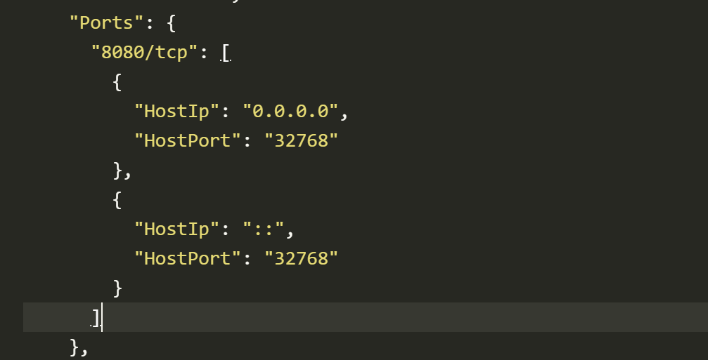

 

#### 前言

有时候导入镜像，外网却访问的不了的事故的端口开启问题


#### 修改容器配置文件，重启docker服务

今天我需要新增一个端口，就是通过这个方式处理的，亲测有效。

```bash
cd /var/lib/docker/containers
```

然后我们在ls查看一下容器，找我们想要修改的容器ID

  
修改容器中的 `hostconfig.json` 文件

```bash
vi 容器ID hostconfig.json
```

  
如上图，文件中其中有一项是PortBindings，其中8080/tcp对应的是容器内部的8080端口，HostPort对应的是映射到宿主机的端口8989。8361/tcp对应的是容器内部的8361端口，HostPort对应的是映射到宿主机的端口9999，按需修改端口。

修改容器中 `config.v2.json` 文件

```bash
vi 容器ID /config.v2.json 
```

  

这里面是容器原本的端口号，往往外网访问不到的原因就是这里端口映射的问题


要在 Docker 中使用指定的镜像（streamerzero/md）并在主机的 0.0.0.0:9900 上启动该容器，你可以使用以下命令：

```
docker run -p 9900:9900 streamerzero/md
```


这个命令将运行一个名为 streamerzero/md 的 Docker 镜像，并将容器的 9900 端口映射到主机的 9900 端口（0.0.0.0 表示所有的网络接口）上。

你可以根据实际需要调整主机的端口号和容器的端口号。例如，如果你想要将容器的 9900 端口映射到主机的 8080 端口，可以使用 `-p 8080:9900` 参数。

请确保已正确安装和配置 Docker，以便能够成功运行容器。


docker run \
  -d \
  -p 3306:3306 \
  -v /mysql8/data:/var/lib/mysql \
  -v /mysql8/my.cnf:/etc/mysql/conf.d/my.cnf \
  -e MYSQL_ROOT_PASSWORD=123456\
  --restart=always \
  --privileged=true \
  --name mysql8 \
  mysql
