# MATLAB基本语法

点乘运算

,

常与其他运算符

点乘运算,常与其他运算符联合使用(如.\)

矩阵生成 矩阵生成 向量生成或子阵提取本节将会介绍一些**MATLAB的基本语法**的使用。

> 在 MATLAB 环境下进行的操作就像是使用一个超级复杂的计算器，不要被这吓到了。在您开始使用 MATLAB 时可以在“>>”命令提示符下输入命令。

## 执行MATLAB命令

> MATLAB 是一种解释型的环境。也就是说，只要你给MATLAB一个命令，它就会马上开始执行。

## MATLAB实践

在">>" 命令提示符下键入一个有效的表达，例如：

```
5 + 5
```

然后按 ENTER 键

当点击“执行”按钮，或者按“Ctrl+ E”，MATLAB执行它并返回结果：

```
ans = 10
```

让我们使用几个例子：

```
3 ^ 2	       % 3 raised to the power of 2
```

当你点击“执行”按钮，或者按“Ctrl+ E”，MATLAB执行它并返回结果：

```
ans = 9
```

另外一个例子：

```
sin(pi /2)	  % sine of angle 90o
```

当你点击“执行”按钮，或者按“Ctrl+ E”，MATLAB执行它并返回结果：

```
ans = 1
```

另外一个例子，

```
7/0		      % Divide by zero
```

当点击“执行”按钮，或者按“Ctrl+ E”，MATLAB执行它并返回结果：

```
ans = Inf
warning: division by zero
```

另外一个例子，

```
732 * 20.3	
```

当点击“执行”按钮，或者按“Ctrl+ E”，MATLAB执行它并返回结果：

```
ans =  1.4860e+04
```

MATLAB 提供了一些特殊的一些数学符号的表达，像圆周率 π， Inf for ∞， i (and j) for √-1 etc. Nan 代表“不是一个数字”。

## MATLAB常用的运算符和特殊字符

MATLAB常用的运算符和特殊字符如下表所示：

| 运算符  |               目的               |
| :-----: | :------------------------------: |
|  **+**  |          加；加法运算符          |
|  **-**  |          减；减法运算符          |
|  *****  |       标量和矩阵乘法运算符       |
| **.\*** |          数组乘法运算符          |
|  **^**  |       标量和矩阵求幂运算符       |
| **.^**  |          数组求幂运算符          |
|  **\**  |             矩阵左除             |
|  **/**  |             矩阵右除             |
| **.\**  |             阵列左除             |
| **./**  |             阵列右除             |
|  **:**  |        向量生成；子阵提取        |
| **( )** |        下标运算；参数定义        |
| **[ ]** |             矩阵生成             |
|  **.**  | 点乘运算，常与其他运算符联合使用 |
|  **…**  |      续行标志；行连续运算符      |
|  **,**  |     分行符（该行结果不显示）     |
|  **;**  | 语句结束；分行符（该行结果显示） |
|  **%**  |             注释标志             |
|  **_**  |       引用符号和转置运算符       |
| **._**  |         非共轭转置运算符         |
|  **=**  |            赋值运算符            |

## MATLAB常用的运算符使用示例

**MATLAB分号（;）使用**

MATLAB中分号（;）表示语句结束；但是，如果想抑制和隐藏 MATLAB 输出表达，表达后添加一个分号。

例如，

```
x = 3;
y = x + 5
```

当点击“执行”按钮，或者按“Ctrl+ E”，MATLAB执行它立即返回的结果是：

```
y =  8
```

**MATLAB添加注释**

MATLAB的百分比符号（％）是用于表示一个**注释行**。例如：

```
x = 9	     % assign the value 9 to x
```

也可以写注释，使用一块块注释操作符％{％}。

MATLAB编辑器包括工具和上下文菜单项，来帮助添加，删除或更改注释的格式。

## MATLAB特殊变量和常量

MATLAB支持以下特殊变量和常量：

|  Name   |              Meaning               |
| :-----: | :--------------------------------: |
| **ans** | 默认的变量名，最近一次操作运算结果 |
| **eps** |          浮点数的相对误差          |
| **i,j** |   虚数单位，定义为 i2 = j2 = -1    |
| **Inf** |             代表无穷大             |
| **NaN** |       代表不定值（不是数字）       |
| **pi**  |               圆周率               |

## MATLAB命名变量

变量名称是由一个字母后由任意数量的字母，数字或下划线。

注意MATLAB中是区分大小写的。

变量名可以是任意长度，但是，MATLAB使用只有前N个字符，其中N是由函数namelengthmax。

## 保存你的工作进度

MATLAB使用save命令保存工作区中的所有变量，然后作为一个扩展名为.mat的文件，在当前目录中。 

如以下例子：

```
save myfile
```

该文件可以随时重新加载，然后使用load命令。

```
load myfile
```

# MATLAB变量

```
每个MATLAB变量可以是数组或者矩阵。
```

用一个简单的方法指定变量。例如：

```
x = 3	       % defining x and initializing it with a value
```

MATLAB执行上述语句，并返回以下结果：

```
x =
     3
```

上述的例子创建了一个1-1的矩阵名为x和的值存储在其元素中。我们可以看看另外的例子，

```
x = sqrt(16) 	% defining x and initializing it with an expression
```

MATLAB执行上述语句，并返回以下结果：

```
x =
     4
```

**MATLAB注意事项：**

- 在使用变量之前，必须进行赋值。
- 当系统接收到一个变量之后，这个变量可以被引用。
- 例如：

- ```
  x = 7 * 8;
  y = x * 7.89
  ```

- MATLAB将执行上面的语句，并返回以下结果：

- ```
  y =
    441.8400
  ```

- 当表达式返回一个结果，不分配给任何变量，系统分配给一个变量命名ans，以后可以继续使用。
- 例如：

- ```
  sqrt(78)
  ```

- MATLAB将执行上面的语句，并返回以下结果：

- ```
  ans =
      8.8318
  ```

- 变量 ans 可以被继续使用:

- ```
  9876/ans
  ```

- MATLAB将执行上面的语句，并返回以下结果：

- 

- ```
  ans =
     1.1182e+03
  ```

## MATLAB可以多个赋值

多个任务可以在同一行。例如，

```
a = 2; b = 7; c = a * b
```

MATLAB将执行上面的语句，并返回以下结果：

```
c =
    14
```

## MATLAB如何显示已经使用的变量名？

在MATLAB中可以使用 who 命令显示所有已经使用的变量名。

```
who
```

MATLAB将执行上面的语句，并返回以下结果：

```
Your variables are:
a    ans  b    c    x    y    
```

whos 命令则显示多一点有关变量：

- 当前内存中的变量
- 每个变量的类型
- 内存分配给每个变量
- 无论他们是复杂的变量与否

```
whos
```

MATLAB将执行上面的语句，并返回以下结果：

```
  Name      Size            Bytes  Class     Attributes

  a         1x1                 8  double              
  ans       1x1                 8  double              
  b         1x1                 8  double              
  c         1x1                 8  double              
  x         1x1                 8  double              
  y         1x1                 8  double      
```

clear命令删除所有（或指定）从内存中的变量（S）。

```
clear x     % it will delete x, won't display anything
clear	    % it will delete all variables in the workspace
            %  peacefully and unobtrusively 
```

## 长任务

长任务可以通过使用省略号（...）延伸到另一条线路。例如，

```
initial_velocity = 0;
acceleration = 9.8;
time = 20;
final_velocity = initial_velocity ...
    + acceleration * time
```

MATLAB将执行上面的语句，并返回以下结果：

```
final_velocity =
   196
```

## MATLAB格式命令

默认情况下，MATLAB 四个小数位值显示数字。这就是所谓的 short format.

如果想更精确，需要使用 format 命令。

长（long ） 命令格式显示小数点后16位。

例如：

```
format long
x = 7 + 10/3 + 5 ^ 1.2
```

MATLAB将执行上面的语句，并返回以下结果：

```
x =
  17.231981640639408
```

format short 例子：

```
format short
x = 7 + 10/3 + 5 ^ 1.2
```

MATLAB将执行上面的语句，并返回以下结果：

```
x =
   17.2320
```

空格格式命令回合到小数点后两位数字。例如：

```
format bank
daily_wage = 177.45;
weekly_wage = daily_wage * 6
```

MATLAB将执行上面的语句，并返回以下结果：

```
weekly_wage =
       1064.70
```

MATLAB 显示大量使用指数表示法。

短格式e命令允许以指数的形式显示小数点后四位，加上指数。

例如：

```
format short e
4.678 * 4.9
```

MATLAB将执行上面的语句，并返回以下结果：

```
ans =
   2.2922e+01 
```

**format long** e命令允许以指数的形式显示小数点后十六位，加上指数。例如：

```
format long e
x = pi
```

MATLAB将执行上面的语句，并返回以下结果：

```
x =
     3.141592653589793e+00
```

**format rat** 命令给出由计算得出的最接近的有理表达式，从计算所得。例如：

```
format rat
4.678 * 4.9
```

MATLAB将执行上面的语句，并返回以下结果：

```
ans =
   2063/90  
```

## MATLAB创建向量

向量是一维数组中的数字。 MATLAB允许创建两种类型的矢量：

- 行向量
- 列向量

创建行向量括在方括号中的元素的集合，用空格或逗号分隔的元素。

例如，

```
r = [7 8 9 10 11]
```

MATLAB将执行上面的语句，并返回以下结果：

```
r =
  Columns 1 through 4
       7              8              9             10       
  Column 5
      11    
```

另外一个例子，

```
r = [7 8 9 10 11];
t = [2, 3, 4, 5, 6];
res = r + t
```

MATLAB将执行上面的语句，并返回以下结果：

```
res =
  Columns 1 through 4
       9             11             13             15       
  Column 5
      17
```

创建列向量通过内附组方括号中的元素，使用分号（;)分隔的元素。

```
c = [7;  8;  9;  10; 11]
```

MATLAB将执行上面的语句，并返回以下结果：

```
c =
       7       
       8       
       9       
      10       
      11  
```

## MATLAB创建矩阵

矩阵是一个二维数字阵列。

在MATLAB中，创建一个矩阵每行输入空格或逗号分隔的元素序列，最后一排被划定一个分号。

例如，下面创建了一个3×3的矩阵：

```
m = [1 2 3; 4 5 6; 7 8 9]
```

MATLAB执行上述语句，并返回以下结果：

```
m =
       1              2              3       
       4              5              6       
       7              8              9     
```

# MATLAB命令

本节的内容将提供常用的一些**MATLAB命令**。

> 在之前的篇章中我们已经知道了MATLAB数值计算和数据可视化是一个交互式程序，在它的命令窗口中您可以在MATLAB提示符“>>”下键入命令。

## MATLAB管理会话的命令

MATLAB提供管理会话的各种命令。如下表所示：

|  命令   |        目的/作用         |
| :-----: | :----------------------: |
|   clc   |      清除命令窗口。      |
|  clear  |    从内存中删除变量。    |
|  exist  |  检查存在的文件或变量。  |
| global  |     声明变量为全局。     |
|  help   |      搜索帮助主题。      |
| lookfor |   搜索帮助关键字条目。   |
|  quit   |       停止MATLAB。       |
|   who   |      列出当前变量。      |
|  whos   | 列出当前变量（长显示）。 |

## MATLAB的系统命令

使用MATLAB的时候有一些系统命令可以方便我们的操作，如在当前的工作区中可以使用系统命令保存为一个文件、加载文件、显示日期、列出目录中的文件和显示当前目录等。

下表列举了一些MATLAB常用的系统相关的命令：

|  命令   |            目的/作用             |
| :-----: | :------------------------------: |
|   cd    |          改变当前目录。          |
|  date   |          显示当前日期。          |
| delete  |          删除一个文件。          |
|  diary  |     日记文件记录开/关切换。      |
|   dir   |    列出当前目录中的所有文件。    |
|  load   |  负载工作区从一个文件中的变量。  |
|  path   |          显示搜索路径。          |
|   pwd   |          显示当前目录。          |
|  save   |  保存在一个文件中的工作区变量。  |
|  type   |       显示一个文件的内容。       |
|  what   | 列出所有MATLAB文件在当前目录中。 |
| wklread |      读取.wk1电子表格文件。      |

## MATLAB输入和输出命令

MATLAB提供了以下输入和输出相关的命令：

|  命令   |          作用/目的           |
| :-----: | :--------------------------: |
|  disp   | 显示一个数组或字符串的内容。 |
| fscanf  |    阅读从文件格式的数据。    |
| format  |     控制屏幕显示的格式。     |
| fprintf | 执行格式化写入到屏幕或文件。 |
|  input  |     显示提示并等待输入。     |
|    ;    |       禁止显示网版印刷       |

fscanf和fprintf命令的行为像C scanf和printf函数。他们支持格式如下代码：

| 格式代码 |                 目的/作用                  |
| :------: | :----------------------------------------: |
|  **%s**  |                 输出字符串                 |
|  **%d**  |                  输出整数                  |
|  **%f**  |                 输出浮点数                 |
|  **%e**  |             显示科学计数法形式             |
|  **%g**  | %f 和%e 的结合，根据数据选择适当的显示方式 |

用于数字显示格式的函数有以下几种形式：

|   Format函数   |      最多可显示      |
| :------------: | :------------------: |
|  format short  | 四位十进制数（默认） |
|  format long   |     15位定点表示     |
| format short e |     五位浮点表示     |
| format long e  |     15位浮点表示     |
|  format bank   |    两个十进制数字    |
|    format +    |      正，负或零      |
|   format rat   |      有理数近似      |
| format compact |   变量之间没有空行   |
|  format loose  |    变量之间有空行    |

## MATLAB向量，矩阵和阵列命令

下表列出了MATLAB用于工作数组、矩阵和向量的各种命令：

|   命令   |           作用/目的            |
| :------: | :----------------------------: |
|   cat    |            连接数组            |
|   find   |       查找非零元素的索引       |
|  length  |          计算元素数量          |
| linspace |          创建间隔向量          |
| logspace |        创建对数间隔向量        |
|   max    |          返回最大元素          |
|   min    |          返回最小元素          |
|   prod   |      计算数组元素的连乘积      |
| reshape  | 重新调整矩阵的行数、列数、维数 |
|   size   |          计算数组大小          |
|   sort   |           排序每个列           |
|   sum    |            每列相加            |
|   eye    |        创建一个单位矩阵        |
|   ones   |          生成全1矩阵           |
|  zeros   |           生成零矩阵           |
|  cross   |        计算矩阵交叉乘积        |
|   dot    |          计算矩阵点积          |
|   det    |        计算数组的行列式        |
|   inv    |          计算矩阵的逆          |
|   pinv   |         计算矩阵的伪逆         |
|   rank   |          计算矩阵的秩          |
|   rref   |       将矩阵化成行最简形       |
|   cell   |          创建单元数组          |
| celldisp |          显示单元数组          |
| cellplot |     显示单元数组的图形表示     |
| num2cell |    将数值阵列转化为异质阵列    |
|   deal   |       匹配输入和输出列表       |
|  iscell  |       判断是否为元胞类型       |

## MATLAB绘图命令

MATLAB提供了大量的命令绘制图表。下表列出了一些常用的命令绘制：

|   命令    |         作用/目的          |
| :-------: | :------------------------: |
|   axis    |     人工选择坐标轴尺寸     |
|   fplot   |        智能绘图功能        |
|   grid    |         显示网格线         |
|   plot    |          生成XY图          |
|   print   |      打印或绘图到文件      |
|   title   |       把文字置于顶部       |
|  xlabel   |    将文本标签添加到x轴     |
|  ylabel   |    将文本标签添加到y轴     |
|   axes    |         创建轴对象         |
|   close   |       关闭当前的绘图       |
| close all |        关闭所有绘图        |
|  figure   |    打开一个新的图形窗口    |
|   gtext   |  通过鼠标在指定位置放注文  |
|   hold    |        保持当前图形        |
|  legend   |        鼠标放置图例        |
|  refresh  |    重新绘制当前图形窗口    |
|    set    |    指定对象的属性，如轴    |
|  subplot  |      在子窗口中创建图      |
|   text    |        在图上做标记        |
|    bar    |         创建条形图         |
|  loglog   |        创建双对数图        |
|   polar   |       创建极坐标图像       |
| semilogx  | 创建半对数图（对数横坐标） |
| semilogy  | 创建半对数图（对数纵坐标） |
|  stairs   |         创建阶梯图         |
|   stem    |         创建针状图         |

# MATLAB M-Files

我们一直强调MATLAB是一个功能强大的编程语言及交互式计算环境，之前学习的内容中，我们学会了在 MATLAB 命令提示符下输入命令，而且我们主要是把MATLAB环境作为一个计算器使用。其实，MATLAB 还允许写入到一个文件中的一系列命令和执行文件完整的单元，就好比是写一个函数，然后调用它。

在开始接下来的学习内容前，我们要先了解在 MATLAB 中的 M 文件有两种类型，详细内容请往下看：

## MATLAB的 M 文件

MATLAB允许写两个程序文件：

- 脚本 - 脚本文件 .m 扩展程序文件。在这些文件中写的一系列命令，想一起执行。脚本不接受输入和不返回任何输出。他们在工作区中的数据操作。
- 函数 - 函数文件 .m 扩展程序文件。函数可以接受输入和返回输出。内部变量是本地的函数。

.m 文件不一定要使用 MATLAB 编辑器创建，其他任何的文本编辑器也是可以的。在本节中，我们将讨论的脚本文件。MATLAB 命令和函数调用的脚本文件包含多个连续的行。可以运行一个脚本，在命令行中键入其名称。

## MATLAB创建并运行脚本文件

创建脚本文件，需要使用文本编辑器。可以打开 MATLAB 编辑器，可使用两个方法：

- 使用命令提示符
- 使用IDE

如果是在命令提示符下使用命令提示符下，键入编辑。这将打开编辑器。可以直接键入编辑，然后在文件名（ .m 扩展程序文件名）

```
edit 
Or
edit <filename>
```

上面的命令将在默认情况下，MATLAB 目录中创建文件。如果想存储在一个特定的文件夹中的所有程序文件，那么一定要提供整个路径。

让我们创建一个文件夹名为 progs。在命令提示符处键入以下命令（>>）：

```Ma
mkdir progs    % create directory progs under default directory
chdir progs    % changing the current directory to progs
edit  prog1.m  % creating an m file named prog1.m
```

如果首次创建的文件，MATLAB 会提示您进行确认。单击“Yes”。


另外，如果使用的是IDE，选择 NEW -> Script。这也打开编辑器，并创建一个文件名为命名。输入代码后可以命名并保存文件。

在编辑器中输入下面的代码：

```
NoOfStudents = 6000;
TeachingStaff = 150;
NonTeachingStaff = 20;
Total = NoOfStudents + TeachingStaff ...
    + NonTeachingStaff;
disp(Total);
```

创建和保存文件后，可以运行在两个方面：

- 编辑器窗口中单击“Run”按钮或
- 只要在命令提示符下键入文件名（不含扩展名）：>> prog1

命令窗口提示显示的结果是：

```
6170
```

## 例子

我们在MATLAB中创建一个脚本文件，然后输入下面的代码：

```
a = 5; b = 7;
c = a + b
d = c + sin(b)
e = 5 * d
f = exp(-d)
```

编译并执行上述代码，会产生以下结果：

```
c =
    12
d =
   12.6570
e =
   63.2849
f =
   3.1852e-06
```

# MATLAB数据类型

默认情况下，MATLAB ®存储所有数值变量为**双精度浮点值**。其他数据类型存储文本，整数或单精度值或单个变量中相关数据的组合。

MATLAB不需要任何类型声明或维度语句。当MATLAB遇到新的变量名称时，它将创建变量并分配适当的内存空间。

如果变量已经存在，则MATLAB将使用新内容替换原始内容，并在必要时分配新的存储空间。

例如：

```
total = 136;
```

上述语句创建一个名为`total`的`1x1`矩阵，并将值`136`存储在其中。

## MATLAB数据类型

------

MATLAB提供`15`种基本数据类型，分别是8种整型数据、单精度浮点型、双精度浮点型、逻辑型、字符串型、单元数组、结构体类型和函数句柄。每种数据类型存储矩阵或数组形式的数据。矩阵或数组的最小值是`0`到`0`，并且是可以到任何大小的矩阵或数组。

下表显示了MATLAB中最常用的数据类型：

| 数据类型   | 描述                                                         |
| :--------- | :----------------------------------------------------------- |
| `int8`     | `8`位有符号整数                                              |
| `uint8`    | `8`位无符号整数                                              |
| `int16`    | `16`位有符号整数                                             |
| `uint16`   | `16`位无符号整数                                             |
| `int32`    | `32`位有符号整数                                             |
| `uint32`   | `32`位无符号整数                                             |
| `int64`    | `64`位有符号整数                                             |
| `uint64`   | `64`位无符号整数                                             |
| `single`   | 单精度数值数据                                               |
| `double`   | 双精度数值数据                                               |
| `logical`  | 逻辑值为`1`或`0`，分别代表`true`和`false`                    |
| `char`     | 字符数据(字符串作为字符向量存储)                             |
| 单元格阵列 | 索引单元阵列，每个都能够存储不同维数和数据类型的数组         |
| 结构体     | C型结构，每个结构具有能够存储不同维数和数据类型的数组的命名字段 |
| 函数处理   | 指向一个函数的指针                                           |
| 用户类     | 用户定义的类构造的对象                                       |
| Java类     | 从Java类构造的对象                                           |

## 示例

------

使用以下代码创建脚本文件(*datatype1.m*)：

```
str = 'Hello World!'
n = 2345
d = double(n)
un = uint32(789.50)
rn = 5678.92347
c = int32(rn)
```

当上述代码被编译和执行时，它产生以下结果：

```
Trial>> datatype1

str =

    'Hello World!'


n =

        2345


d =

        2345


un =

  uint32

   790


rn =

   5.6789e+03


c =

  int32

   5679
```

## 数据类型转换

------

MATLAB提供了各种用于将一种数据类型转换为另一种数据类型的函数。 下表显示了数据类型转换函数：

| 函数             | 描述说明                                       |
| :--------------- | :--------------------------------------------- |
| `char`           | 转换为字符数组(字符串)                         |
| `int2str`        | 将整数数据转换为字符串                         |
| `mat2str`        | 将矩阵转换为字符串                             |
| `num2str`        | 将数字转换为字符串                             |
| `str2double`     | 将字符串转换为双精度值                         |
| `str2num`        | 将字符串转换为数字                             |
| `native2unicode` | 将数字字节转换为Unicode字符                    |
| `unicode2native` | 将Unicode字符转换为数字字节                    |
| `base2dec`       | 将基数N字符串转换为十进制数                    |
| `bin2dec`        | 将二进制数字串转换为十进制数                   |
| `dec2base`       | 将十进制转换为字符串中的N数字                  |
| `dec2bin`        | 将十进制转换为字符串中的二进制数               |
| `dec2hex`        | 将十进制转换为十六进制数字                     |
| `hex2dec`        | 将十六进制数字字符串转换为十进制数             |
| `hex2num`        | 将十六进制数字字符串转换为双精度数字           |
| `num2hex`        | 将单数转换为IEEE十六进制字符串                 |
| `cell2mat`       | 将单元格数组转换为数组                         |
| `cell2struct`    | 将单元格数组转换为结构数组                     |
| `cellstr`        | 从字符数组创建字符串数组                       |
| `mat2cell`       | 将数组转换为具有潜在不同大小的单元格的单元阵列 |
| `num2cell`       | 将数组转换为具有一致大小的单元格的单元阵列     |
| `struct2cell`    | 将结构转换为单元格数组                         |

## 数据类型确定

------

MATLAB提供了用于识别变量数据类型的各种函数。

下表提供了确定变量数据类型的函数：

| 函数                 | 描述说明                         |
| :------------------- | :------------------------------- |
| `is`                 | 检测状态                         |
| `isa`                | 确定输入是否是指定类的对象       |
| `iscell`             | 确定输入是单元格数组             |
| `iscellstr`          | 确定输入是字符串的单元格数组     |
| `ischar`             | 确定项目是否是字符数组           |
| `isfield`            | 确定输入是否是结构数组字段       |
| `isfloat`            | 确定输入是否为浮点数组           |
| `ishghandle`         | 确定是否用于处理图形对象句柄     |
| `isinteger`          | 确定输入是否为整数数组           |
| `isjava`             | 确定输入是否为Java对象           |
| `islogical`          | 确定输入是否为逻辑数组           |
| `isnumeric`          | 确定输入是否是数字数组           |
| `isobject`           | 确定输入是否为MATLAB对象         |
| `isreal`             | 检查输入是否为实数数组           |
| `isscalar`           | 确定输入是否为标量               |
| `isstr`              | 确定输入是否是字符数组           |
| `isstruct`           | 确定输入是否是结构数组           |
| `isvector`           | 确定输入是否为向量               |
| `class`              | 确定对象的类                     |
| `validateattributes` | 检查数组的有效性                 |
| `whos`               | 在工作区中列出变量，其大小和类型 |

## 示例

------

使用以下代码创建脚本文件：

```
x = 3
isinteger(x)
isfloat(x)
isvector(x)
isscalar(x)
isnumeric(x)

x = 23.54
isinteger(x)
isfloat(x)
isvector(x)
isscalar(x)
isnumeric(x)

x = [1 2 3]
isinteger(x)
isfloat(x)
isvector(x)
isscalar(x)

x = 'Hello'
isinteger(x)
isfloat(x)
isvector(x)
isscalar(x)
isnumeric(x)
```

运行文件后，产生以下结果：

```
x = 3
ans = 0
ans = 1
ans = 1
ans = 1
ans = 1
x = 1177/50
ans = 0
ans = 1
ans = 1
ans = 1
ans = 1
x =

          1          2          3

ans = 0
ans = 1
ans = 1
ans = 0
x = Hello
ans = 0
ans = 0
ans = 1
ans = 0
ans = 0
```

# MATLAB运算符

## MATLAB运算符

> 数组中唯一的值运算符是一个符号，它将要执行的数学或者逻辑操作传达给编译器执行。 

MATLAB 设计工作主要是对整个矩阵和阵列。因此，运算符在 MATLAB 工作标和非标量数据。 

MATLAB 的基本运算类型：

- 算术运算符
- 逻辑运算符
- 关系运算符
- 位运算
- 集合运算

## 算术运算符

MATLAB 的工作针对的是整个矩阵和阵列，它允许两种不同类型的算术运算：

- 矩阵算术运算
- 阵列算术运算

矩阵的算术运算是线性代数中的定义相同。执行数组操作，无论是在一维和多维数组元素的元素。

矩阵运算符和数组运算符是有区别的句号（.）符号。然而，由于加法和减法运算矩阵和阵列是相同的，操作者这两种情况下是相同的。下表给出了运算符的简要说明：

[详细例子](https://www.w3cschool.cn/matlab/matlab-g6v728gj.html)

| 运算符  | 描述                                                         |
| :------ | :----------------------------------------------------------- |
| **+**   | 加法或一元加号。A + B将A和B。 A和B必须具有相同的尺寸，除非一个人是一个标量。一个标量，可以被添加到任何大小的矩阵。 |
| **-**   | 减法或一元减号。A - B，减去B从A和B必须具有相同的大小，除非是一个标量。可以从任意大小的矩阵中减去一个标量。 |
| *****   | 矩阵乘法；是一个更精确的矩阵A和B的线性代数积，矩阵乘法对于非纯量A和B，列一个数必须等于B.标量可以乘以一个任意大小的矩阵的行数。 |
| **.\*** | 数组的乘法；A.*B是数组A和B的元素积，A和B必须具有相同的大小，除非A、B中有一个是标量。 |
| **/**   | 斜线或矩阵右除法；B/A与B * inv（A）大致相同。更确切地说：  B/A = (A'B')' |
| **./**  | 矩阵右除法；矩阵A与矩阵B相应元素相除（A、B为同维度的矩阵）   |
| **.\**  | 反斜杠或矩阵左除；如果A是一个方阵，AB是大致相同的INV（A）* B，除非它是以不同的方式计算。如果A是一个n*n的矩阵，B是一个n组成的列向量，或是由若干这样的列的矩阵，则X = AB 是方程 AX = B ，如果A严重缩小或者几乎为单数，则显示警告消息。 |
| **\**   | 数组左除法；A. B是元素B（i，j）/A（i，j）的矩阵。A和B必须具有相同的大小，除非其中一个是标量。 |
| **^**   | 矩阵的幂。X^P是X到幂P，如果p是标量；如果p是一个整数，则通过重复平方计算功率。如果整数为负数，X首先反转。对P值的计算，涉及到特征值和特征向量，即如果[ D ] = V，EIG（x），那么X^P = V * D.^P / V。 |
| **.^**  | A.^B：A的每个元素的B次幂（A、B为同纬度的矩阵）               |
| **'**   | 矩阵的转置；A'是复数矩阵A的线性代数转置，这是复共轭转置。    |
| **.'**  | 数组的转置；A**.'**是数组A的转置，对于复数矩阵，这不涉及共轭。 |

## 逻辑运算符

MATLAB提供了两种类型的逻辑运算符和函数：

- Element-wise -这些运算符的逻辑阵列上运行相应的元素。
- Short-circuit -这些运算上的标量，逻辑表达式。

Element-wise 的逻辑运算符操作元素元素逻辑阵列。符号＆，|和〜逻辑数组运算符AND，OR，NOT。

允许短路短路逻辑运算符，逻辑运算。符号 && 和 | | 是短路逻辑符 AND 和 OR。

[详细例子](https://www.w3cschool.cn/matlab/matlab-bgwv28gp.html)

## 关系运算符

关系运算符标和非标量数据上也能正常工作。关系运算符对数组进行元素元素元素设置为逻辑1（真）的关系是真实的和元素设置为逻辑0（假），它是两个阵列，并返回一个同样大小的逻辑阵列之间的比较。

下表显示了 MATLAB 中的关系运算符：

[详细例子](https://www.w3cschool.cn/matlab/matlab-xotn28go.html)

| 运算符 | 描述       |
| :----- | :--------- |
| **<**  | 小于       |
| **<=** | 小于或等于 |
| **>**  | 大于       |
| **>=** | 大于或等于 |
| **==** | 等于       |
| **~=** | 不等于     |

## 位运算

位运算符位和执行位位操作。 ＆，|和^的真值表如下：

| p    | q    | p & q | p \| q | p ^ q |
| :--- | :--- | :---- | :----- | :---- |
| 0    | 0    | 0     | 0      | 0     |
| 0    | 1    | 0     | 1      | 1     |
| 1    | 1    | 1     | 1      | 0     |
| 1    | 0    | 0     | 1      | 1     |

假设如果A= 60，B =13，他们现在以二进制格式将如下：

A = 0011 1100

B = 0000 1101

\-----------------

A&B = 0000 1100

A|B = 0011 1101

A^B = 0011 0001

~A = 1100 0011

MATLAB提供位运算，如'位'，'位'和'位不操作，移位操作等各种函数

以下的表格显示了常用的按位运算：

[详细例子](https://www.w3cschool.cn/matlab/matlab-6n1u28gr.html)

| 函数           | 目的/作用                                                    |
| :------------- | :----------------------------------------------------------- |
| bitand(a, b)   | 当a、b是一个或数个无符号整数或无符号整数数组，返回参数a和b位和， |
| bitcmp(a)      | a的补码                                                      |
| bitget(a,pos)  | 在指定位置pos中获取位，在整数数组a中                         |
| bitor(a, b)    | 对数a和b按位或                                               |
| bitset(a, pos) | a的集合点在一个特定的位置pos                                 |
| bitshift(a, k) | 返回一个移到左K位，相当于乘以2K。K负值对应的位权转移或除以2\|K\|向负无穷舍入到最近的整数。任何溢出位都被截断。 |
| bitxor(a, b)   | 对数a和b按位异或                                             |
| swapbytes      | 交换字节顺序                                                 |

## 集合操作符

MATLAB提供各种功能集合运算，如集，交集和测试组成员等。

下表是对一些常用的设置操作的例举与描述：

[详细例子](https://www.w3cschool.cn/matlab/matlab-ex9w28gs.html)

| 函数                  | 描述                                                         |
| :-------------------- | :----------------------------------------------------------- |
| intersect(A,B)        | 设置两个数组的交集；返回A和B所共有的值。返回的值按排序顺序排列。 |
| intersect(A,B,'rows') | 将A和B的每一行作为单个实体处理，并返回A和B的公共行。返回的矩阵的行按排序顺序排列。 |
| ismember(A,B)         | 返回与A大小相同的数组，包含1（true），其中A的元素在其他地方的B中找到，它返回0（false）。 |
| ismember(A,B,'rows')  | 将A和B的每一行作为单个实体处理，并返回一个包含1（true）的向量，其中矩阵A的行也是B的行；否则，它返回0（false）。 |
| issorted(A)           | 如果A的元素按排序顺序返回逻辑1（true），否则返回逻辑0（false）。输入A可以是向量，也可以是N-by-1或1-by-N的字符串数组。如果A和sort（A）的输出相等，则A被认为是排序的。 |
| issorted(A, 'rows')   | 如果二维矩阵A的行按排序顺序返回逻辑1（真），否则返回逻辑0（假）。 如果A和排序（A）的输出相等，则认为矩阵A被排序。 |
| setdiff(A,B)          | 设置两个数组的差值；返回不在B中的值。返回数组中的值按排序顺序排列。 |
| setdiff(A,B,'rows')   | 将每一行A和B行作为单个实体处理，并返回一个不在B中的行。返回的矩阵的行按排序顺序排列。“行”选项不支持单元格数组。 |
| setxor                | 设置两个数组的异或                                           |
| union                 | 设置两个数组的并集                                           |
| unique                | 数组中唯一的值                                               |

# MATLAB算术运算

MATLAB的算术运算有两种不同类型：1）矩阵算术运算；2）阵列算术运算。

MATLAB矩阵算术运算与线性代数中的定义相同：执行数组操作，无论是在一维和多维数组元素的元素。

矩阵运算符和数组运营商是有区别的句点（.）符号。然而，由于加法和减法运算矩阵和阵列是相同的，操作者这两种情况下是相同的。

下表给出了运算符的简要说明：

| 操作符  |                             描述                             |
| :-----: | :----------------------------------------------------------: |
|  **+**  | 加法或一元加号。A + B将A和B。 A和B必须具有相同的尺寸，除非是一个标量。一个标量，可以被添加到任何大小的矩阵。 |
|  **-**  | 减法或一元减号。A - B，减去B从A和B必须具有相同的大小，除非是一个标量。可以从任意大小的矩阵中减去一个标量。 |
|  *****  | 矩阵乘法；是一个更精确的矩阵A和B的线性代数积，矩阵乘法对于非纯量A和B，列一个数必须等于B.标量可以乘以一个任意大小的矩阵的行数。 |
| **.\*** | 数组的乘法；A.*B是数组A和B的元素积，A和B必须具有相同的大小，除非A、B中有一个是标量。 |
|  **/**  | 斜线或矩阵右除法；B/A与B * inv（A）大致相同。更确切地说： B/A = (A'B')' |
| **./**  |  矩阵右除法；矩阵A与矩阵B相应元素相除（A、B为同纬度的矩阵）  |
|  **\**  | 反斜杠或矩阵左除；如果A是一个方阵，AB是大致相同的INV（A）* B，除非它是以不同的方式计算。如果A是一个n*n的矩阵，B是一个n组成的列向量，或是由若干这样的列的矩阵，则X = AB 是方程 AX = B ，如果A严重缩小或者几乎为单数，则显示警告消息。 |
| **.\**  | 数组左除法；A. B是元素B（i，j）/A（i，j）的矩阵。A和B必须具有相同的大小，除非其中一个是标量。 |
|  **^**  | 矩阵的幂。X^P是X到幂P，如果p是标量；如果p是一个整数，则通过重复平方计算功率。如果整数为负数，X首先反转。对P值的计算，涉及到特征值和特征向量，即如果[ D ] = V，EIG（x），那么X^P = V * D.^P / V。 |
| **.^**  |        A.^B：A的每个元素的B次幂（A、B为同纬度的矩阵）        |
|  **'**  |  矩阵的转置；A'是复数矩阵A的线性代数转置，这是复共轭转置。   |
| **.'**  |  数组的转置；A'是数组A的转置，对于复数矩阵，这不涉及共轭。   |

##  举例说明

下面的例子显示使用标量数据的算术运算符。创建一个脚本文件，用下面的代码：

```
a = 10;
b = 20;
c = a + b
d = a - b
e = a * b
f = a / b
g = a \ b
x = 7;
y = 3;
z = x ^ y
```

运行该文件，产生结果如下：

```
c =
    30
d =
   -10
e =
   200
f =
    0.5000
g =
     2
z =
   343
```

## MATLAB算术运算功能

除了上述列举的一些算术运算符，MATLAB 中还拥有以下的命令/功能：

|                   函数                   |                             描述                             |
| :--------------------------------------: | :----------------------------------------------------------: |
|                 uplus(a)                 |                      一元加号；增加量a                       |
|                plus (a,b)                |                       相加；返回 a + b                       |
|                uminus(a)                 |                       一元减号；减少a                        |
|               minus(a, b)                |                       相减；返回 a - b                       |
|               times(a, b)                |                     数组相乘；返回 a.*b                      |
|               mtimes(a, b)               |                     矩阵相乘；返回 a* b                      |
|              rdivide(a, b)               |                    右阵划分；返回 a ./ b                     |
|              ldivide(a, b)               |                     左阵划分；返回 a. b                      |
|              mrdivide(A, B)              |                  求解线性方程组xA = B for x                  |
|              mldivide(A, B)              |                  求解线性方程组xA = B for x                  |
|               power(a, b)                |                     数组求幂；返回 a.^b                      |
|               mpower(a, b)               |                     矩阵求幂；返回 a ^ b                     |
|                cumprod(A)                | 累积乘积；返回与包含累积乘积的数组A相同大小的数组。如果A是向量，则cumprod（A）返回一个包含A的元素的累积乘积的向量。如果A是矩阵，则cumprod（A）返回一个矩阵，其中包含A的每一列的累积乘积。如果A是一个多维数组，那么cumprod（A）将沿着第一个非正整数维。 |
|             cumprod(A, dim)              |                沿维 *dim* 返回返回累积乘积。                 |
|                cumsum(A)                 | 累加总和；返回包含累积和的数组A如果A是向量，则cumsum（A）返回一个包含A的元素的累积和的向量。如果A是矩阵，则cumsum（A）返回一个矩阵，其中包含A的每列的累积和。如果A是一个多维数组，那么cumsum（A）将沿着第一个非整数维度起作用。 |
|              cumsum(A, dim)              |                 返回沿着dim的元素的累积和。                  |
|                 diff(X)                  | 差分和近似导数；计算x相邻元素之间的差异。如果X是向量，则diff（X）返回相邻元素之间的差异的向量，比X短一个元素：[X（2）-X（1）X（3）-X（2）... X（N）-X（N-1）]如果X是一个矩阵，则diff（X）返回行差的矩阵：[X（2：m，...）-X（1：m-1，:)] |
|                diff(X,n)                 |                 递归应用n次，导致第n个差异。                 |
|              diff(X,n,dim)               | 它是沿标量dim指定的维数计算的第n个差分函数。 如果order n等于或超过Dim的长度，diff将返回一个空数组。 |
|                 prod(A)                  | 数组元素的乘积；返回A数组元素的乘积。如果A是向量，则prod（A）返回元素的乘积。如果A是非空矩阵，则prod（A）将A的列作为向量，并返回每列乘积的行向量。如果A是一个空的0-by-0矩阵，则prod（A）返回1。如果A是一个多维数组，那么prod（A）将沿着第一个非子集维度行为并返回一个乘积数组。 该维数的尺寸减小到1，而所有其他维数的尺寸保持不变。如果输入A为单个，则prod函数计算并返回B为单个；对于所有其他数字和逻辑数据类型，prod函数计算并返回B为double。 |
|               prod(A,dim)                | 沿dim维度返回乘积。 例如，如果A是矩阵，则prod（A，2）是包含每一行的乘积的列向量。 |
|            prod(___,datatype)            |           在数据类型指定的类中乘以并返回一个数组。           |
|                  sum(A)                  | 数组元素的总和；返回数组的不同维度的和。如果A是浮动的，那么是双倍或单个，B是本地累加的，它与A相同，B与A具有相同的类。如果A不是浮动的，则B被累加为双，B具有类double。如果A是向量，则sum（A）返回元素的总和。如果A是矩阵，则sum（A）将A的列作为向量，返回每列的和的行向量。如果A是一个多维数组，sum（A）将沿着第一个非单例维度的值作为向量来处理，返回一个行向量的数组。 |
|                sum(A,dim)                |                     沿标量A的维度求和。                      |
| sum(..., 'double')sum(..., dim,'double') | 执行双精度加法，并返回double类型的答案，即使A具有数据类型单一或整型数据类型。这是整型数据类型的默认值。 |
| sum(..., 'native')sum(..., dim,'native') | 在本机数据类型A中执行添加，并返回相同数据类型的答案。 这是单和双的默认值。 |
|                 ceil(A)                  |    向正无穷方向舍入；将a元素舍入为大于或等于A的最近整数。    |
|                  fix(A)                  |                           舍入为零                           |
|                 floor(A)                 |    向负无穷方向舍入；将a元素舍入为小于或等于a的最近整数。    |
|     idivide(a, b)idivide(a, b,'fix')     | 整数除法的舍入选项；与A./B相同，只是分数的商向零舍入到最接近的整数。 |
|          idivide(a, b, 'round')          |                  分数的商舍入到最近的整数。                  |
|          idivide(A, B, 'floor')          |             分数商向负无穷大舍入到最接近的整数。             |
|          idivide(A, B, 'ceil')           |              分数商向无穷大舍入到最接近的整数。              |
|                mod (X,Y)                 | 除法后的模数；返回X - n.* Y，其中 n = floor（X./Y）。 如果Y不是整数，并且商X / Y在整数的舍入误差内，则n是整数。 输入X和Y必须是相同大小的真实数组或实数标量（提供Y〜= 0）。请注意：mod(X,0) 是 Xmod(X,X) 是 0对于 X ＝ Y 和 Y ＝ 0的 mod(X，Y)具有与Y相同的符号。 |
|                rem (X,Y)                 | 除法之后的余数；返回X - n.* Y，其中n = fix（X./Y）。 如果Y不是整数，并且商X / Y在整数的舍入误差内，则n是整数。 输入X和Y必须是相同大小的真实数组或实数标量（提供Y〜= 0）。请记住：rem(X,0) 是 NaNX〜= 0的rem（X，X）为0对于 X~=Y 和 Y~=0 的rem（X，Y）与X具有相同的符号。 |
|                 round(X)                 | 舍入到最接近的整数; 将X的元素舍入到最接近的整数。 正数元素的小数部分为0.5，最大到最接近的正整数。 负数元素的小数部分为-0.5，向下舍入到最接近的负整数。 |

# MATLAB逻辑运算

**MATLAB逻辑运算**都是针对元素的操作，运算结果是特殊的逻辑数组；在逻辑分析时，逻辑（真）用1表示，逻辑假用0表示，逻辑运算中所有的非零元素作为1处理。

### **注意：**

> 使用MATLAB逻辑运算时的语法不要与C语言、Java等编程语言混淆。

MATLAB 有两种类型的逻辑运算符和函数：

- Element-wise - 这些运算上的对应元素的逻辑阵列。
- Short-circuit - 这些运算上的标量，逻辑表达式。

MATLAB元素明智的逻辑运算符操作元素元素逻辑阵列：符号＆，|和〜逻辑数组运算符AND，OR，NOT。

MATLAB允许短路的短路逻辑运算符，逻辑运算：符号&&和| |是短路逻辑符AND和OR。

## 详细例子

------

在MATLAB中建立一个脚本文件，并输入下面的代码：

```
a = 5;
b = 20;
   if ( a && b )
        disp('Line 1 - Condition is true');
   end
   if ( a || b )
       disp('Line 2 - Condition is true');
   end
   % lets change the value of  a and b 
   a = 0;
   b = 10;
   if ( a && b )
       disp('Line 3 - Condition is true');
   else
       disp('Line 3 - Condition is not true');
   end
   if (~(a && b))
   
      disp('Line 4 - Condition is true');
   end
```

运行该文件，产生如下结果：

```
Line 1 - Condition is true
Line 2 - Condition is true
Line 3 - Condition is not true
Line 4 - Condition is true
```

## MATLAB逻辑运算功能

------

除了在上述的逻辑运算符，MATLAB 提供下面的命令或函数用于同样的目的：

|                   函数                    |                             描述                             |
| :---------------------------------------: | :----------------------------------------------------------: |
|                 and(A, B)                 | 查找数组或标量输入的逻辑和；执行所有输入数组A，B等的逻辑AND，并返回包含设置为逻辑1（真）或逻辑0（假）的元素的数组。如果所有输入数组在同一个数组位置都包含一个非零元素，那么输出数组的一个元素将被设置为1；否则，该元素设置为0。 |
|                  not(A)                   | 查找数组或标量输入的逻辑NOT；执行输入数组A的逻辑NOT，并返回包含设置为逻辑1（真）或逻辑0（假）的元素的数组。如果输入数组在同一个数组位置包含一个零值元素，那么输出数组的一个元素将被设置为1；否则，该元素设置为0。 |
|                 or(A, B)                  | 查找数组或标量输入的逻辑或； 执行所有输入数组A，B等的逻辑或，并返回包含设置为逻辑1（真）或逻辑0（假）的元素的数组。如果任何输入数组在同一个数组位置包含一个非零元素，则输出数组的一个元素设置为1；否则，该元素设置为0。 |
|                 xor(A, B)                 | 逻辑异或; 对数组A和B的相应元素执行异或运算。如果A（i，j，...）或B（i，j）...，则所得到的元素C（i，j，...） j，...），但不是两者都是非零的。 |
|                  all(A)                   | 确定数组A的所有数组元素是否为非零或真。如果A是向量，则如果所有元素都为非零，则所有（A）返回逻辑1（真），如果一个或多个元素为零，则返回逻辑0（假）。如果A是非空矩阵，则所有（A）将A的列视为向量，返回逻辑1和0的行向量。如果A是空的0x0矩阵，则全部（A）返回逻辑1（真）。如果A是一个多维数组，则所有（A）都沿着第一个非指定维度行事，并返回一个逻辑值数组。 该尺寸的尺寸减小到1，而所有其他尺寸的尺寸保持不变。这个维度的大小减少到1，而其他所有维度的尺寸保持不变。 |
|                all(A, dim)                |             通过标量dim沿着维数A的维度进行测试。             |
|                  any(A)                   | 确定数组元素是否为非零；测试数组中不同维度的元素是否为非零数字，或是逻辑1（真）。 任何函数忽略NaN（不是数字）的条目。如果A是向量，任何（A）如果A的任何元素是非零数或逻辑1（真），则返回逻辑1（真），如果所有元素为零，则返回逻辑0（假）。如果A是非空矩阵，则任何（A）将A的列视为向量，返回逻辑1和0的行向量。如果A是一个空的0x0矩阵，任何（A）返回逻辑0（假）。如果A是一个多维数组，则任何（A）都沿着第一个非整数维进行操作，并返回一个逻辑值数组。该维度的尺寸减小到1，而所有其他维度的尺寸保持不变。 |
|                any(A,dim)                 |             通过标量dim沿着维数A的维度进行测试。             |
|                   false                   |                         逻辑0（假）                          |
|                 false(n)                  |                       是逻辑0的n×n矩阵                       |
|                false(m, n)                |                    是逻辑0的一个m×n矩阵。                    |
|            false(m, n, p, ...)            |                  是由逻辑0的逐列逐列数组。                   |
|              false(size(A))               |               是与数组A大小相同的逻辑零数组。                |
|            false(...,'like',p)            |      是与逻辑阵列p相同的数据类型和稀疏性的逻辑零数组。       |
|               ind = find(X)               | 查找非零元素的索引和值；定位数组X的所有非零元素，并返回向量中这些元素的线性索引。 如果X是行向量，则返回的向量是行向量; 否则返回列向量。如果X不包含非零元素或是空数组，则返回一个空数组。 |
| ind = find(X, k)ind = find(X, k, 'first') | 最多返回与X的非零条目相对应的前k个索引。k必须是正整数，但它可以是任何数字数据类型。 |
|         ind = find(X, k, 'last')          |          最多返回与X的非零条目相对应的最后k个索引。          |
|         [row,col] = find(X, ...)          | 返回矩阵X中非零条目的行和列索引。使用稀疏矩阵时，此语法特别有用。 如果X是N>2的N维数组，col包含列的线性索引。 |
|        [row,col,v] = find(X, ...)         | 返回X中非零条目的列或行向量v，以及行和列索引。如果X是逻辑表达式，则v是逻辑数组。 输出v包含通过评估表达式X获得的逻辑数组的非零元素。 |
|               islogical(A)                | 确定输入是否为逻辑数组；如果A是逻辑数组，返回true，否则返回false。 如果A是从逻辑类派生的类的实例，它也返回true。 |
|                logical(A)                 |  将数值转换为逻辑；返回一个可用于逻辑索引或逻辑测试的数组。  |
|                   true                    |                         逻辑1（真）                          |
|                  true(n)                  |                     是一个n×n逻辑矩阵。                      |
|                true(m, n)                 |                     是一个mxn逻辑矩阵。                      |
|            true(m, n, p, ...)             |                  是由逻辑1的逐列逐列数组。                   |
|               true(size(A))               |                是与数组A大小相同的逻辑数组。                 |
|            true(...,'like', p)            |       是与逻辑阵列p相同的数据类型和稀疏性的逻辑阵列。        |

# MATLAB关系运算

**MATLAB关系运算符**对数组的元素进行设置，将元素设置为逻辑1（真）的关系是真实的和逻辑0（假），它是两个阵列，可以返回一个相同大小的逻辑阵列间的比较。

MATLAB关系运算符标和非标量数据上也能正常工作。

MATLAB关系运算符如下表：

| 操作符 |   描述   |
| :----: | :------: |
| **<**  |   小于   |
| **<=** | 小于等于 |
| **>**  |   大于   |
| **>=** | 大于等于 |
| **==** |   等于   |
| **~=** |  不等于  |

## 详细例子

在MATLAB的命令提示符下建立一个脚本文件，并输入下述代码：

```
a = 100;
b = 200;
if (a >= b)
max = a
else
max = b
end
```

运行该文件，产生的结果如下：

```
max =
   200
```

除了在上述的关系运算符，MATLAB提供下列命令/函数用于同样的目的：

|   函数   |             描述              |
| :------: | :---------------------------: |
| eq(a, b) |        测试a是否等于b         |
| ge(a, b) |      测试是否大于或等于B      |
| gt(a, b) |        测试a是否大于b         |
| le(a, b) |     测试a是否小于或等于b      |
| lt(a, b) |        测试a是否小于b         |
| ne(a, b) |       测试a是否不等于b        |
| isequal  |     测试数组以获得相等性      |
| isequaln | 测试数组相等，将NaN值视为相等 |

## 详细例子

在MATLAB的命令提示符中建立一个脚本文件，并输入下述的代码：

```
% comparing two values
a = 100;
b = 200;
if (ge(a,b))
max = a
else
max = b
end
% comparing two different values
a = 340;
b = 520;
if (le(a, b))
disp(' a is either less than or equal to b')
else
disp(' a is greater than b')
end
```

运行该文件，产生如下结果：

```
max =
   200
 a is either less than or equal to b
```

# MATLAB位运算

**MATLAB提供位运算**，如'位'，'位或'和'位不操作，移位操作等各种函数

以下的表格显示了常用的按位运算：

|      函数      |                          目的/作用                           |
| :------------: | :----------------------------------------------------------: |
|  bitand(a, b)  |                      整数a和b的逐位AND                       |
|   bitcmp(a)    |                          a的位补码                           |
| bitget(a,pos)  |             在指定位置pos中获取位，在整数数组A中             |
|  bitor(a, b)   |                       整数a和b的逐位OR                       |
| bitset(a, pos) |                      在某一位置上设置位                      |
| bitshift(a, k) | 返回向左移位k位，相当于乘以2k。k的负值对应于向右移位或除以2 \| k \| 并舍入到最接近的整数到负无穷大。任何溢出位都被截断。 |
|  bitxor(a, b)  |                      整数a和b的逐位异或                      |
|   swapbytes    |                         交换字节顺序                         |

## 详细例子

------

在MATLAB中建立一个脚本文件，并输入下面的代码：

```
a = 60; % 60 = 0011 1100   
b = 13; % 13 = 0000 1101 
c = bitand(a, b)      % 12 = 0000 1100  
c = bitor(a, b)       % 61 = 0011 1101 
c = bitxor(a, b)      % 49 = 0011 0001 
c = bitshift(a, 2)    % 240 = 1111 0000 */
c = bitshift(a,-2)    % 15 = 0000 1111 */
```

运行该文件，显示以下结果：

```
c =
    12
c =
    61
c =
    49
c =
   240
c =
    15
```

# MATLAB集合操作

**MATLAB中包含多样的函数集合运算**，如集，交集和测试组成员等。

下表显示了一些常用的设置操作：

|         函数          |                             描述                             |
| :-------------------: | :----------------------------------------------------------: |
|    intersect(A,B)     | 设置两个数组的交集；返回A和B所共有的值。返回的值按排序顺序排列。 |
| intersect(A,B,'rows') | 将A和B的每一行作为单个实体处理，并返回A和B的公共行。返回的矩阵的行按排序顺序排列。 |
|     ismember(A,B)     | 返回与A大小相同的数组，包含1（true），其中A的元素在其他地方的B中找到，它返回0（false）。 |
| ismember(A,B,'rows')  | 将A和B的每一行作为单个实体处理，并返回一个包含1（true）的向量，其中矩阵A的行也是B的行；否则，它返回0（false）。 |
|      issorted(A)      | 如果A的元素按排序顺序返回逻辑1（true），否则返回逻辑0（false）。输入A可以是向量，也可以是N-by-1或1-by-N的字符串数组。如果A和sort（A）的输出相等，则A被认为是排序的。 |
|  issorted(A, 'rows')  | 如果二维矩阵A的行按排序顺序返回逻辑1（真），否则返回逻辑0（假）。 如果A和排序（A）的输出相等，则认为矩阵A被排序。 |
|     setdiff(A,B)      | 设置两个数组的差值；返回不在B中的值。返回数组中的值按排序顺序排列。 |
|  setdiff(A,B,'rows')  | 将每一行A和B行作为单个实体处理，并返回一个不在B中的行。返回的矩阵的行按排序顺序排列。“行”选项不支持单元格数组。 |
|        setxor         |                      设置两个数组的异或                      |
|         union         |                      设置两个数组的并集                      |
|        unique         |                        数组中唯一的值                        |

## 

## 详细例子

在MATLAB中建立一个脚本文件，并键入下面的代码：

```
a = [7 23 14 15 9 12 8 24 35]
b = [ 2 5 7 8 14 16 25 35 27]
u = union(a, b)
i = intersect(a, b)
s = setdiff(a, b)
```

运行该文件，产生以下结果：

```
a =
     7    23    14    15     9    12     8    24    35
b =
     2     5     7     8    14    16    25    35    27
u =
  Columns 1 through 11
     2     5     7     8     9    12    14    15    16    23    24
  Columns 12 through 14
    25    27    35
i =
     7     8    14    35
s =
     9    12    15    23    24
```

# MATLAB决策制定

> 本节内容：了解MATLAB提供的决策类型，及使用它们进行决策制定。

决策结构用来做什么？决策结构要求程序员能够使用一个或者多个的条件来对程序进行评估或者测试，沿着一条或多条语句执行，如果该条件被确定为真，则继续执行；如果条件确定是假的（false），执行其他要执行的语句。

下图是一个典型的决策结构，是大多数编程语言的一般形式：

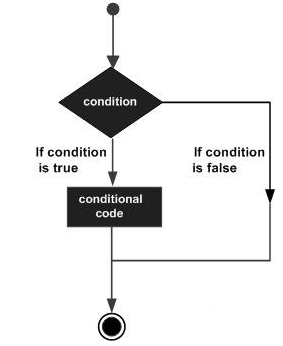

MATLAB 提供的决策类型如下表，通过点击链接，查看各决策类型的作用：

|                             语句                             |                             描述                             |
| :----------------------------------------------------------: | :----------------------------------------------------------: |
| [if ... end statement](https://www.w3cschool.cn/matlab/matlab-e1ky28gv.html) | 一个 **if ... end** 语句由一个布尔表达式组成，后跟一个或多个语句。 |
| [if...else...end statement](https://www.w3cschool.cn/matlab/matlab-nez228gw.html) | 一个 **if** 语句可以跟随一个可选的 **else** 语句，当布尔表达式为false时，该语句将执行。 |
| [If... elseif...elseif...else...end statements](https://www.w3cschool.cn/matlab/matlab-mqes28gx.html) | 一个 **if** 语句后面可以有一个（或多个）可选 **elseif ...** 和一个 **else** 语句，这对于测试各种条件非常有用。 |
| [nested if statements](https://www.w3cschool.cn/matlab/matlab-t3hx28gy.html) | 你可以在另一个 **if** 或 **elseif** 语句中使用一个 **if** 或 **elseif** 语句。 |
| [switch statement](https://www.w3cschool.cn/matlab/matlab-ner628gz.html) |   **一个 switch** 语句允许根据值列表对变量进行相等的测试。   |
| [nested switch statements](https://www.w3cschool.cn/matlab/matlab-ucwd28h0.html) |  你可以在另一个 **switch** 语句中使用一个 **swicth** 语句。  |

# MATLAB if...end 语句

> 一个 **if** 语句和一个布尔表达式后跟一个或多个语句，由 **end** 语句分隔，就是一个 **if ... end** 语句

## MATLAB if 语句语法

------

在MATLAB中 的 if 语句的语法是：

```
if <expression>
% statement(s) will execute if the boolean expression is true 
<statements>
end
```

表达式的计算结果如果是“true”，那么在代码块中，如果语句会被执行。如果表达式计算结果为“false”，那么第一套代码结束后的语句会被执行。

## MATLAB if 语句流程图：

------

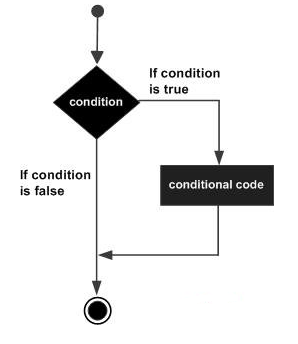

## 详细例子如下：

------

在MATLAB中建立一个脚本文件，并输入下述代码：

```
a = 10;
% check the condition using if statement 
   if a < 20 
   % if condition is true then print the following 
       fprintf('a is less than 20
' );
   end
fprintf('value of a is : %d
', a);
```

运行该文件，显示下述结果：

```
a is less than 20
value of a is : 10
```

# MATLAB if...else...end 语句

> 在MATLAB的 **if...else...end** 语句中，**if** 语句后面可以跟一个可选择的 **else** 语句，当执行的表达式为假的时候，执行 **else** 语句。

## if...else...end 语句语法：

------

MATLAB 中一个 **if ... else** 语句的语法示例：

```
if <expression>
% statement(s) will execute if the boolean expression is true 
<statement(s)>
else
<statement(s)>
% statement(s) will execute if the boolean expression is false 
end
```

如果布尔表达式的值为 “true”，那么执行 if 的代码块；如果布尔表达式的值为 “false”，else 的代码块将被执行。

## if...else...end 语句流程图：

------

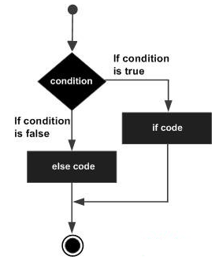

## 详细例子如下：

------

在MATLAB中建立一个脚本文件，并输入下述的代码：

```
a = 100;
% check the boolean condition 
   if a < 20 
        % if condition is true then print the following 
       fprintf('a is less than 20
' );
   else
       % if condition is false then print the following 
       fprintf('a is not less than 20
' );
   end
   fprintf('value of a is : %d
', a);
```

编译和执行上述代码，产生下述结果：

```
a is not less than 20
value of a is : 100
```

# MATLAB if...elseif...elseif...else...end 语句

> MATLAB 的 **if...elseif...elseif...else...end** 语句中 **if** 语句可以跟随一个（或多个）可选的 **elseif... else** 语句，这是非常有用的，可以用来对各种条件进行测试。

使用 **if... elseif...elseif...else** 语句，要注意以下几点：

- 一个 if 可以有零个或多个 else，但是它必须跟在 elseif 后面（即只有 elseif 存在才会有 else）。 
- 一个 if 可以有零个或多个 elseif ，必须出现else。
- 一旦 elseif 匹配成功，余下的 elseif 将不会被测试。

 **if... elseif...else...end** 语法：

```
if <expression 1>
% Executes when the expression 1 is true 
<statement(s)>
elseif <expression 2>
% Executes when the boolean expression 2 is true
<statement(s)>
Elseif <expression 3>
% Executes when the boolean expression 3 is true 
<statement(s)>
else 
%  executes when the none of the above condition is true 
<statement(s)>
end
```

## 详细例子如下：

在MATLAB中建立一个脚本文件，并输入下述代码：

```
a = 100;
%check the boolean condition 
   if a == 10 
         % if condition is true then print the following 
       fprintf('Value of a is 10
' );
    elseif( a == 20 )
       % if else if condition is true 
       fprintf('Value of a is 20
' );
    elseif a == 30 
        % if else if condition is true  
       fprintf('Value of a is 30
' );
   else
        % if none of the conditions is true '
       fprintf('None of the values are matching
');
   fprintf('Exact value of a is: %d
', a );
   end
```

编译和执行上述代码，产生如下结果：

```
None of the values are matching
Exact value of a is: 100
```

# MATLAB嵌套if语句

> 在MATLAB中嵌套if语句始终是合法的，也就是说可以使用一个嵌套的 if-else语句 if 或 elseif 语句在另一个 if 或 elseif 语句。

## MATLAB嵌套 if 语句语法:

详细语法如下：

```
if <expression 1>
% Executes when the boolean expression 1 is true 
   if <expression 2>
      % Executes when the boolean expression 2 is true    
  end
end
```

可以嵌套 **elseif** 或其他类似的方式，因为已经嵌套 **if** 语句。

## 详细例子如下：

在MATLAB中建立一个脚本文件，并输入下面的代码：

```
a = 100;
b = 200;
    % check the boolean condition 
   if( a == 100 )
   
       % if condition is true then check the following 
       if( b == 200 )
       
          % if condition is true then print the following 
          fprintf('Value of a is 100 and b is 200
' );
       end
       
   end
   fprintf('Exact value of a is : %d
', a );
   fprintf('Exact value of b is : %d
', b );
```

运行该文件，它显示的结果如下：

```
Value of a is 100 and b is 200
Exact value of a is : 100
Exact value of b is : 200
```

# MATLAB switch语句

> MATLAB中 switch 块有条件地执行一组语句，这些语句是从几个选项里选择执行的，其中每个选项涵盖了一个 case 语句。

## 请记住：

- 计算 switch_expression 是一个标量或字符串。
- 计算 case_expression 是标量，标量或字符串的字符串或单元阵列。

switch 块的功能是测试每个 case ，直到被测试的其中一个 case 是 true 。

case 是 true 的情况如下：

- 对于数字，eq(case_expression,switch_expression).
- 对于字符串，strcmp(case_expression,switch_expression).
- 对于对象，支持 eq 函数，eq(case_expression,switch_expression).
- 对于单元阵列case_expression的，在单元阵列与switch_expression相匹配的元素中的至少一个，如上文所定义的数字，字符串和对象。

当上述有一个情况是 true，MATLAB 就执行与之相应的语句，然后不再执行以后的语句，直接退出 switch 块。

otherwise 块是可选的，任何情况下，只有当真正执行。

## MATLAB switch语句语法

在MATLAB 中 switch 语句的语法如下：

```
switch <switch_expression>
   case <case_expression>
     <statements>
   case <case_expression>
     <statements>
     ...
     ...
   otherwise
       <statements>
end
```

## 详细例子

在MATLAB中建立一个脚本文件，并输入下述代码：

```
n = input('Enter a number: ');

switch n
    case -1
        disp('negative one')
    case 0
        disp('zero')
    case 1
        disp('positive one')
    otherwise
        disp('other value')
end
```

在命令提示符下，输入数字 1，输出结果为：

```
positive one
```

重复执行该代码并输入数字 3，输出结果为：

```
other value
```

# MATLAB 嵌套switch语句

> 在 MATLAB 中嵌套 switch 语句是可能的，可以在 switch 一部分外嵌套 switch 语句序列。即使 case 常量的内部和外部的 switch 含有共同的值，也不算冲突出现。

## MATLAB嵌套switch语句语法

嵌套switch语句的语法如下：

```
switch(ch1) 
   case 'A' 
   fprintf('This A is part of outer switch');
      switch(ch2) 
         case 'A'
           fprintf('This A is part of inner switch' );
          case 'B'  
          fprintf('This B is part of inner switch' );
       end   
case 'B'
fprintf('This B is part of outer switch' );
end
```

## 详细例子:

在MATLAB中建立一个脚本文件，并输入下面的代码：

```
a = 100;
b = 200;
switch(a) 
      case 100 
         fprintf('This is part of outer switch %d
', a );
         switch(b) 
            case 200
               fprintf('This is part of inner switch %d
', b );
         end
end
fprintf('Exact value of a is : %d
', a );
fprintf('Exact value of b is : %d
', b );
```

当运行该文件时，它会显示：

```
This is part of outer switch 100
This is part of inner switch 200
Exact value of a is : 100
Exact value of b is : 200
```

# MATLAB循环类型

> MATLAB循环语句允许我们多次执行一个语句或语句组。

在一般的情况下，程序中的语句都是按照顺序执行的，先从函数中的第一条语句开始执行，然后执行第二条并且依次类推。但是也会存在一种情况：需要多次执行代码块，怎么办？

其实编程语言都提供了各种控制结构，允许更复杂的执行路径。

下图是在大多数编程语言中的循环语句的一般形式：

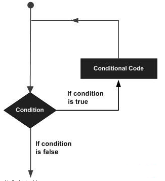

MATLAB 提供以下类型的循环处理循环的要求。点击链接，查看个循环类型的细节：

|                           循环类型                           |                             描述                             |
| :----------------------------------------------------------: | :----------------------------------------------------------: |
| [while 循环](https://www.w3cschool.cn/matlab/matlab-1uoy28hf.html) | 一个给定的条件为真时重复语句或语句组。测试条件才执行循环体。 |
| [for 循环](https://www.w3cschool.cn/matlab/matlab-sum528hg.html) |          执行的语句序列多次缩写管理循环变量的代码。          |
| [nested 循环](https://www.w3cschool.cn/matlab/matlab-8dks28hh.html) |           可以使用一个或多个环路内任何另一个循环。           |

##  MATLAB循环控制语句

循环控制语句可以更改正常的执行顺序，当执行留下了范围，在该范围内所有自动创建的对象被销毁。

MATLAB支持以下控制语句。点击相应链接，可以查看各语句应用。

|                           控制语句                           |                             描述                             |
| :----------------------------------------------------------: | :----------------------------------------------------------: |
| [break 语句](https://www.w3cschool.cn/matlab/matlab-fox428hi.html) |             终止循环语句，将执行的语句紧随循环。             |
| [continue 语句](https://www.w3cschool.cn/matlab/matlab-3xjh28hj.html) | 导致循环，跳过它的身体的其余部分，并立即重新再次测试前的状况。 |

# MATLAB while循环

> MATLAB的 **while** 循环会重复执行 **while** 与 **end** 语句间的运算式，只要表达式为 **true**。

## MATLAB while循环语法

在MATLAB 中 while循环的语法如下：

```
while <expression>
   <statements>
end
```

while 循环反复执行程序语句只要表达式为 true。

当结果不为空，并包含所有非零元素（逻辑或实际数字），表达式为 true ；否则，表达式为 false。

## 详细例子

在MATLAB中建立一个脚本文件，并输入以下代码：

```
a = 10;
% while loop execution 
while( a < 20 )
  fprintf('value of a: %d\n', a);
  a = a + 1;
end
```

运行该文件，显示结果如下：

```
value of a: 10
value of a: 11
value of a: 12
value of a: 13
value of a: 14
value of a: 15
value of a: 16
value of a: 17
value of a: 18
value of a: 19
```

# MATLAB for循环

> MATLAB中 **for** 循环是一个重复的控制结构，可以有效地写一个循环，只是执行的次数是特定的。

## MATLAB for 循环语法:

MATLAB中的 for循环的语法如下：

```
for index = values
  <program statements>
          ...
end
```

for 循环的值有下述三种形式之一：

|         格式          |                             描述                             |
| :-------------------: | :----------------------------------------------------------: |
|   *initval:endval*    | 将索引变量从初始到终值递增1，并重复执行程序语句，直到索引值大于终值。 |
| *initval:step:endval* |     按每次迭代中的值步骤递增索引, 或在步骤为负值时递减。     |
|      *valArray*       | 在每个迭代 *valArrayon* 数组的后续列中创建列向量索引。例如, 在第一次迭代中, index = valArray (:, 1)，循环执行最大 n 次, 其中 n 是 *valArray* 的列数，由 numel (valArray, 1,:) 给出。输入 *valArray* 可以是任何 MATLAB 数据类型, 包括字符串、单元格数组或结构。 |

## 详细例子如下：

### 例子 1

在MATLAB中建立一个脚本文件，并输入下述代码：

```
for a = 10:20 
  fprintf('value of a: %d
', a);
end
```

运行文件，显示下述结果：

```
value of a: 10
value of a: 11
value of a: 12
value of a: 13
value of a: 14
value of a: 15
value of a: 16
value of a: 17
value of a: 18
value of a: 19
value of a: 20
```

### 例子 2

在MATLAB中建立一个脚本文件，并输入下述代码：

```
for a = 1.0: -0.1: 0.0
   disp(a)
end
```

运行该文件，显示以下结果：

```
1

    0.9000

    0.8000

    0.7000

    0.6000

    0.5000

    0.4000

    0.3000

    0.2000

    0.1000

     0
```

### 例子3

在MATLAB中建立一个脚本文件，并输入下述代码：

```
for a = [24,18,17,23,28]
   disp(a)
end
```

运行该文件，显示下述结果：

```
    24

    18

    17

    23

    28
```

# MATLAB嵌套循环

> MATLAB嵌套循环允许使用一个循环的另一循环内。

## MATLAB嵌套循环语法:

在 MATLAB 中嵌套 for 循环语句的语法如下：

```
for m = 1:j
    for n = 1:k
        <statements>;
    end
end
```

在 MATLAB 中嵌套 while 循环语句的语法如下：

```
while <expression1>
   while <expression2>
       <statements>
   end
end
```

## 详细例子

我们将使用一个嵌套循环来把所有从1到100的素数显示出来。

现在MATLAB中建立一个脚本文件，并输入下述代码：

```
for i=2:100
       for j=2:100
        if(~mod(i,j)) 
            break; % if factor found, not prime
        end 
      end
      if(j > (i/j))
          fprintf('%d is prime
', i);
      end
end
```

然后运行该文件，显示如下结果：

```
2 is prime
3 is prime
5 is prime
7 is prime
11 is prime
13 is prime
17 is prime
19 is prime
23 is prime
29 is prime
31 is prime
37 is prime
41 is prime
43 is prime
47 is prime
53 is prime
59 is prime
61 is prime
67 is prime
71 is prime
73 is prime
79 is prime
83 is prime
89 is prime
97 is prime
```

# MATLAB break语句

> MATLAB中 break 语句用于终止 for 或 while 循环的执行，当在循环体内执行到该语句的时候，程序将会跳出循环，继续执行循环语句的下一语句。

**注意**：在嵌套循环中，break 退出只能在循环发生，后通过的声明控制循环结束。

## MATLAB break语句流程图

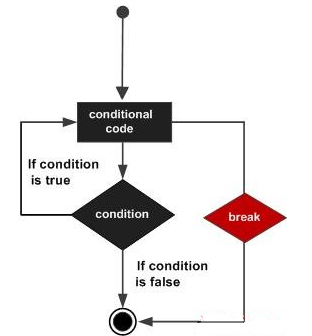

## 详细例子

在MATLAB中建立一个脚本文件，并输入下面的代码：

```
a = 10;
% while loop execution 
 while (a < 20 )
      fprintf('value of a: %d
', a);
      a = a+1;
      if( a > 15)
         % terminate the loop using break statement 
          break;
      end 
  end
```

运行该文件，显示下述结果：

```
value of a: 10
value of a: 11
value of a: 12
value of a: 13
value of a: 14
value of a: 15
```

# MATLAB continue语句

> MATLAB中 continue 语句控制跳过循环体的某些语句。当在循环体内执行到该语句时，程序将跳过循环体中所剩下的语句，继续下一次循环。

MATLAB中的 continue 语句跟 break 语句有点像，但 break 是强制终止，continue 强制下一次迭代的循环发生，跳跃中的任何代码之间。

## MATLAB continue 语句流程图：

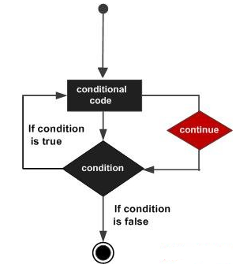

## 详细例子：

在MATLAB中建立一个脚本文件，并输入下述代码：

```
a = 10;
%while loop execution 
while a < 20
  if a == 15
      % skip the iteration 
      a = a + 1;
      continue;
  end
  fprintf('value of a: %d
', a);
  a = a + 1;     
end
```

运行该文件，显示下述结果：

```
value of a: 10
value of a: 11
value of a: 12
value of a: 13
value of a: 14
value of a: 16
value of a: 17
value of a: 18
value of a: 19
```

# MATLAB向量

我们可以创建两种 **MATLAB 向量**类型：

- 行向量
- 列向量

## MATLAB 行向量：

创建行向量括在方括号中的元素的集合，用**空格**或**逗号**分隔的元素。

```
r = [7 8 9 10 11]
```

执行上述语句，返回下述结果：

```
r =
       7              8              9             10        11
```

## MATLAB 列向量：

创建列向量括在方括号中的元素的集合，使用**分号**来分隔的元素。

```
c = [7;  8;  9;  10; 11]
```

执行上述语句，返回下述结果：

```
c =
       7       
       8       
       9       
      10       
      11  
 
```

## 引用向量元素

可以参照的向量元素的几种方式中的一种或多种。ith 一个矢量v的分量被称为v（i）。

例如：

```
v = [ 1; 2; 3; 4; 5; 6];	% creating a column vector of 6 elements
v(3)
```

执行上述语句，返回下述结果：

```
ans =
     3 
```

当引用一个冒号，一个向量，其例如为v（:)，该载体上的所有组件的被列出。

例如：

```
v = [ 1; 2; 3; 4; 5; 6];	% creating a column vector of 6 elements
v(:)
```

执行上述语句，返回下述结果：

```
ans =
     1
     2
     3
     4
     5
     6
```

MATLAB允许你选择一个范围从向量的元素。

在下面的例子中，我们创建了一个行向量rv 9个元素，我们将引用元素3至7写rv（3:7），并创建一个新的向量名为sub_rv。

```
rv = [1 2 3 4 5 6 7 8 9];
sub_rv = rv(3:7)
```

MATLAB将执行上面的语句，并返回以下结果：

```
sub_rv =
     3     4     5     6     7
```

## MATLAB 向量运算

点击下列链接，了解MATLAB向量运算：

- [向量的加减法](https://www.w3cschool.cn/matlab/matlab-lkaj28hm.html)
- [标量向量乘法](https://www.w3cschool.cn/matlab/matlab-2htf28hn.html)
- [转置向量](https://www.w3cschool.cn/matlab/matlab-nbk928hu.html)
- [追加向量](https://www.w3cschool.cn/matlab/matlab-tjmq28hw.html)
- [向量的模](https://www.w3cschool.cn/matlab/matlab-ra6i28hx.html)
- [向量点积](https://www.w3cschool.cn/matlab/matlab-86w928hy.html)
- [等差元素向量](https://www.w3cschool.cn/matlab/matlab-aseg28hz.html)

# MATLAB向量的加法和减法

> 在 MATLAB 中当进行两个向量的加法与减法的时候，这两个向量的元素必须有相同的类型和数量。

## 详细例子

MATLAB中创建一个脚本文件，代码如下：

```
A = [7, 11, 15, 23, 9];
B = [2, 5, 13, 16, 20];
C = A + B;
D = A - B;
disp(C);
disp(D);
```

运行该文件，产生下述结果：

```
9    16    28    39    29
5     6     2     7   -11
```

# MATLAB标量向量乘法

MATLAB标量乘法：让一个数字乘以一个向量。

标量乘法会产生相同类型的新的一个向量，原先的向量的每个元素乘以数量。

## 详细例子

MATLAB中建立一个脚本文件，代码如下：

```
v = [ 12 34 10 8];
m = 5 * v
```

运行该文件，产生下述结果：

```
m =
    60   170    50    40
```

您可以执行所有的标量向量操作。例如，可以相加，相减分割标量向量。

# MATLAB转置向量

MATLAB中转置操作能够将一个行向量改变成一个列向量，反之亦然。

MATLAB中转置操作使用一个单引号（**'**）来表示。

## 详细例子

在MATLAB中建立一个脚本文件，输入下述代码：

```
r = [ 1 2 3 4 ];
tr = r';
v = [1;2;3;4];
tv = v';
disp(tr); disp(tv);
```

运行该文件，显示结果如下：

```
     1
     2
     3
     4

     1     2     3     4
```

# MATLAB追加向量

MATLAB 允许在原有的向量中附加向量，共同创造新的向量。

如果有两个行向量 r1 和 r2 这两个行向量中各有 n 和 m 个元素，现在创建行向量 r 并将n和m个元素都放在行向量 r 中，通过附加这些载体，编写：

```
r = [r1,r2]
```

通过追加这两个向量，向量r2的，也可以建立一个矩阵R，矩阵的第二行编写如下：

```
r = [r1;r2]
```

要注意的是，要完成上述操作，上述两个载体中的元素的数量应该相同。

当然，可以附加两个列向量 c1 和 c2 的 n 和 m 的元素个数。要创建一个列向量 c 将 n 加 m 个元素放入其中，通过附加这些载体，编写：

```
c = [c1; c2]
```

还可以创建一个矩阵c追加这两个向量；向量c2将第二列的矩阵：

```
c = [c1, c2]
```

同样要注意，完成上述操作，上述两个载体中的元素的数量应该相同。

## 详细例子

在MATLAB中建立一个脚本文件，代码如下：

```
r1 = [ 1 2 3 4 ];
r2 = [5 6 7 8 ];
r = [r1,r2]
rMat = [r1;r2]
 
c1 = [ 1; 2; 3; 4 ];
c2 = [5; 6; 7; 8 ];
c = [c1; c2]
cMat = [c1,c2]
```

运行该文件，显示结果如下：

```
r =
     1     2     3     4     5     6     7     8
rMat =
     1     2     3     4
     5     6     7     8
c =
     1
     2
     3
     4
     5
     6
     7
     8
cMat =
     1     5
     2     6
     3     7
     4     8
```

# MATLAB向量的模

向量 v 中的元素 v1, v2, v3, …, vn，下式给出其幅度：

|v| = √(v1^2 + v2^2 + v3^2 + … + vn^2)

MATLAB中需要采按照下述步骤进行向量的模的计算：

1. 采取的矢量及自身的积，使用数组相乘（*）。这将产生一个向量sv，其元素是向量的元素的平方和V.

   sv = v.*v;

2. 使用求和函数得到 v。这也被称为矢量的点积向量的元素的平方的总和V.

   dp= sum(sv);

3. 使用sqrt函数得到的总和的平方根，这也是该矢量的大小V.

   mag = sqrt(s);

## 详细例子

在MATLAB中建立一个脚本文件，代码如下：

```
v = [1: 2: 20];
sv = v.* v;     %the vector with elements 
                % as square of v's elements
dp = sum(sv);    % sum of squares -- the dot product
mag = sqrt(dp);  % magnitude
disp('Magnitude:'); disp(mag);
```

运行该文件，显示结果如下：

```
Magnitude:
   36.4692
```

# MATLAB向量点积

MATLAB 中两个向量的点积 a = (a1, a2, …, an) and b = (b1, b2, …, bn) 由以下给定:

a.b = ∑(ai.bi)

下述函数可以计算两个向量 a 和 b 的点积：

```
dot(a, b);
```

## 详细例子

在MATLAB中建立一个脚本文件，代码如下：

```
v1 = [2 3 4];
v2 = [1 2 3];
dp = dot(v1, v2);
disp('Dot Product:'); disp(dp);
```

运行该文件，显示结果如下：

```
Dot Product:
    20
```

# MATLAB等差元素向量

> 当一个向量中的元素过多，同时向量的各元素有等差的规律，此时采用直接输入法将过于繁琐。针对该种情况 ，可以使用冒号(**:**) 来生成等差元素向量。

在 MATLAB 中如何建立一个等差元素向量？解决方法如下。

要建立一个矢量 v 带的第一个元素 f，最后一个元素 l 和元素之间的区别是任何真正的数 n，可以这样写：

```
v = [f : n : l]
```

## 详细例子

在MATLAB中建立一个脚本文件，代码如下：

```
v = [1: 2: 20];
sqv = v.^2;
disp(v);disp(sqv);
```

运行该文件，显示结果如下：

```
1     3     5     7     9    11    13    15    17    19
1     9    25    49    81   121   169   225   289   361
```

# MATLAB矩阵

在MATLAB中创建矩阵有以下规则：

- 矩阵元素必须在 “**[ ]**” 内；
- 矩阵的同行元素之间用空格（或 “**,**”）隔开；
- 矩阵的行与行之间用 “**;**”（或回车符）隔开；
- 矩阵的元素可以是数值、变量、表达式或函数；
- 矩阵的尺寸不必预先定义。

下面的例子中我们创建了一个4×5的矩阵：

```
a = [ 1 2 3 4 5; 2 3 4 5 6; 3 4 5 6 7; 4 5 6 7 8]
```

MATLAB 将执行上述语句，并返回以下结果：

```
a =
     1     2     3     4     5
     2     3     4     5     6
     3     4     5     6     7
     4     5     6     7     8
```

## MATLAB引用一个矩阵的元素

如果要引用 mth 行和 nth 列的一个元素，写法如下：

```
mx(m, n);
```

例如，参阅第2行和第5列中的元素的矩阵，所创建的最后一节中，我们输入：

```
a = [ 1 2 3 4 5; 2 3 4 5 6; 3 4 5 6 7; 4 5 6 7 8];
a(2,5)
```

MATLAB将执行上述语句，并返回结果：

```
ans =
     6
```

引用m列中的所有元素，我们A型（m）。

接下来我们要从矩阵 a 的第4列的元素开始建立一个列向量 v ：

```
a = [ 1 2 3 4 5; 2 3 4 5 6; 3 4 5 6 7; 4 5 6 7 8];
v = a(:,4)
```

MATLAB将执行上述语句，并返回结果：

```
v =
     4
     5
     6
     7
```

当然也可以选择第 n 列的 m 个元素，对于这一点，写法如下：

```
a(:,m:n)
```

我们建立一个较小的矩阵中的元素，第二和第三列：

```
a = [ 1 2 3 4 5; 2 3 4 5 6; 3 4 5 6 7; 4 5 6 7 8];
a(:, 2:3)
```

MATLAB将执行上述语句，并返回以下结果：

```
ans =
     2     3
     3     4
     4     5
     5     6
```

用相同的方式，则可以建立一个子矩阵的一个子部分的矩阵。

```
a = [ 1 2 3 4 5; 2 3 4 5 6; 3 4 5 6 7; 4 5 6 7 8];
a(:, 2:3)
```

MATLAB将执行上述语句，并返回结果：

```
ans =
     2     3
     3     4
     4     5
     5     6
```

用相同的方式，则可以创建一个子矩阵的一个子部分的矩阵。

例如，让我们创建一个子矩阵内部子部分的：

```
3     4     5     
4     5     6     
```

下述写法可以达到该目的：

```
a = [ 1 2 3 4 5; 2 3 4 5 6; 3 4 5 6 7; 4 5 6 7 8];
sa = a(2:3,2:4)
```

MATLAB将执行上述语句，并返回结果：

```
sa =
     3     4     5
     4     5     6
```

## MATLAB删除行或列矩阵

可以删除整行或整列的矩阵，只要分配一组空方括号 **[ ]** 给该行或列。

基本上，**[ ]** 表示一个空数组。

在下述例子中我们删除第四行：

```
a = [ 1 2 3 4 5; 2 3 4 5 6; 3 4 5 6 7; 4 5 6 7 8];
a( 4 , : ) = []
```

MATLAB将执行上述语句，并返回结果：

```
a =
     1     2     3     4     5
     2     3     4     5     6
     3     4     5     6     7
```

接下来，我们删除第五列：

```
a = [ 1 2 3 4 5; 2 3 4 5 6; 3 4 5 6 7; 4 5 6 7 8];
a(: , 5)=[]
```

MATLAB将执行上述语句，并返回结果：

```
a =
     1     2     3     4
     2     3     4     5
     3     4     5     6
     4     5     6     7
```

## 详细例子

在本例中，我们会建立一个3-3的矩阵 m，并把矩阵 m 中的第二行和第三行复制两次，这样就能够建立一个4×3的矩阵。

在MATLAB中建立一个脚本文件，代码如下：

```
a = [ 1 2 3 ; 4 5 6; 7 8 9];
new_mat = a([2,3,2,3],:)
```

运行该文件，显示结果：

```
new_mat =
     4     5     6
     7     8     9
     4     5     6
     7     8     9
```

## MATLAB矩阵运算

接下来，我们将讨论下述的与MATLAB矩阵有关的常用的矩阵操作：

- [矩阵的加法和减法](https://www.w3cschool.cn/matlab/matlab-whov28i1.html)
- [矩阵除法](https://www.w3cschool.cn/matlab/matlab-yv8g28i2.html)
- [矩阵的标量操作](https://www.w3cschool.cn/matlab/matlab-plw728i5.html)
- [矩阵的转置](https://www.w3cschool.cn/matlab/matlab-z8jn28i6.html)
- [串联矩阵](https://www.w3cschool.cn/matlab/matlab-6k2p28i7.html)
- [矩阵乘法](https://www.w3cschool.cn/matlab/matlab-4n2i28i8.html)
- [矩阵的行列式](https://www.w3cschool.cn/matlab/matlab-gr7p28i9.html)
- [逆矩阵](https://www.w3cschool.cn/matlab/matlab-gtys28ic.html)

# MATLAB矩阵的加法和减法

> MATLAB矩阵可以有加法和减法的操作，但是两个操作数的矩阵必须具有相同的行数和列数。

## 详细例子

在MATLAB中建立一个脚本文件，代码如下：

```
a = [ 1 2 3 ; 4 5 6; 7 8 9];
b = [ 7 5 6 ; 2 0 8; 5 7 1];
c = a + b
d = a - b
```

运行该文件，显示结果：

```
c =
     8     7     9
     6     5    14
    12    15    10
d =
    -6    -3    -3
     2     5    -2
     2     1     8
```

# MATLAB除法（左，右）矩阵

> MATLAB 中有两种矩阵除法符号：即左除“＼” 和右除 “／” 。

**注意**：这两个操作数的矩阵必须具有相同的行数和列数。

## 详细例子

在MATLAB中建立一个脚本文件，代码如下：

```
a = [ 1 2 3 ; 4 5 6; 7 8 9];
b = [ 7 5 6 ; 2 0 8; 5 7 1];
c = a / b
d = a \ b
```

运行该文件，显示结果：

```
c =

  -0.52542   0.68644   0.66102
  -0.42373   0.94068   1.01695
  -0.32203   1.19492   1.37288

d =

  -3.27778  -1.05556  -4.86111
  -0.11111   0.11111  -0.27778
   3.05556   1.27778   4.30556
```

# MATLAB矩阵标量操作

MATLAB矩阵的标量操作就是加，减，乘或者除以一个数字矩阵。

添加到具有原始矩阵的每个元素的行和列，相减，乘或除以数相同数量的标量运算会产生一个新的矩阵。

## 详细例子

在MATLAB中建立一个脚本文件，代码如下：

```
a = [ 10 12 23 ; 14 8 6; 27 8 9];
b = 2;
c = a + b
d = a - b
e = a * b
f = a / b
```

运行该文件，显示结果：

```
c =
    12    14    25
    16    10     8
    29    10    11
d =
     8    10    21
    12     6     4
    25     6     7
e =
    20    24    46
    28    16    12
    54    16    18
f =
    5.0000    6.0000   11.5000
    7.0000    4.0000    3.0000
   13.5000    4.0000    4.5000
```

# MATLAB矩阵的转置

MATLAB中矩阵的转置操作是用一个单引号（'）表示的，该操作能够切换一个矩阵的行和列。

## 详细例子

在MATLAB中建立一个脚本文件，代码如下：

```
a = [ 10 12 23 ; 14 8 6; 27 8 9]
b = a'
```

运行该文件，显示以下结果：

```
a =
    10    12    23
    14     8     6
    27     8     9
b =
    10    14    27
    12     8     8
    23     6     9
```

# MATLAB串联矩阵

MATLAB中使用一对中括号“**[ ]**”，能够将两个矩阵连接起来，创建出一个新矩阵。

MATLAB串联矩阵的两种类型：

- 水平串联：要进行连接的两个矩阵是使用逗号 “**,**” 分隔开的。
- 垂直串联：要进行连接的两个矩阵是使用分号 “**;**” 分隔开的。

## 详细例子

在MATLAB中建立一个脚本文件，代码如下：

```
a = [ 10 12 23 ; 14 8 6; 27 8 9]
b = [ 12 31 45 ; 8 0 -9; 45 2 11]
c = [a, b]
d = [a; b]
```

运行该文件，显示结果：

```
a =
    10    12    23
    14     8     6
    27     8     9
b =
    12    31    45
     8     0    -9
    45     2    11
c =
    10    12    23    12    31    45
    14     8     6     8     0    -9
    27     8     9    45     2    11
d =
    10    12    23
    14     8     6
    27     8     9
    12    31    45
     8     0    -9
    45     2    11
```

# MATLAB矩阵乘法

MATLAB中如果有两个矩阵 A 和 B ，其中 A 是 m*n 矩阵，B 是 n*p 矩阵，那么他们相乘能够产生一个 m*p 的矩阵 C。

MATLAB矩阵乘法只发生在矩阵 A 的列数的数量等于矩阵 B 的行数的矩阵乘法中，具有相应的列中的第二矩阵乘以第一矩阵中的行的元素。 

比如，第（i，j）个位置中的每个元素，在所得的矩阵 C 中，是在第 i 行的第一矩阵具有第二矩阵的第 j 列中的相应元素的产品的元素的总和。

在 MATLAB 中，矩阵乘法使用*运算符。

## 详细例子

在MATLAB中建立一个脚本文件，代码如下：

```
a = [ 1 2 3; 2 3 4; 1 2 5]
b = [ 2 1 3 ; 5 0 -2; 2 3 -1]
prod = a * b
```

运行该文件，显示以下结果：

```
a = 1     2     3    
    2     3     4
    1     2     5
b = 2     1     3
    5     0    -2
    2     3    -1
prod = 18    10    -4
       27    14    -4
       22    16    -6
```

# MATLAB矩阵的行列式

> MATLAB要计算对应矩阵行列式的值的指令为：d=det(A)，该指令返回矩阵 A 的行列式，并把所得值赋给 d。若 A 仅包含整数项，则该结果 d 也是一个整数。

## 详细例子

在MATLAB中建立一个脚本文件，代码如下：

```
a = [ 1 2 3; 2 3 4; 1 2 5]
det(a)
```

运行该文件，显示以下结果：

```
a =
     1     2     3
     2     3     4
     1     2     5
ans =
    -2
```

# MATLAB逆矩阵

MATLAB中矩阵A的逆矩阵被记为 A−1 ，下面的关系成立：

```
AA−1 = A−1A = 1
```

MATLAB中不是每个矩阵都有逆矩阵的，比如一个矩阵的行列式是零的话，则矩阵的逆就不存在，这样的矩阵是奇异的。

MATLAB中，逆矩阵的计算使用 inv 函数：逆矩阵A是inv(A).

## 详细例子

在MATLAB中建立一个脚本文件，并输入下面的代码：

```
a = [ 1 2 3; 2 3 4; 1 2 5]
inv(a)
```

运行该文件，显示以下结果：

```
a =
     1     2     3
     2     3     4
     1     2     5
ans =
   -3.5000    2.0000    0.5000
    3.0000   -1.0000   -1.0000
   -0.5000         0    0.5000
```

# MATLAB数组

之前，我们讨论了很多关于MATLAB向量和矩阵的知识，在本章中，我们将讨论多维数组。在MATLAB中所有的数据类型的变量是多维数组，向量是一个一维阵列，矩阵是一个二维数组。

首先，我们先来看一些特殊类型的数组。

## MATLAB中的特殊阵列

MATLAB中会使用一些函数来建立一些特殊的阵列，对于所有这些函数，一个参数创建一个正方形阵列，双参数创建矩形阵列。

使用 zeros() 函数建立一个元素为零的数组：

例如：

```
zeros(5)
```

MATLAB 执行上述语句，返回以下结果：

```
ans =
     0     0     0     0     0
     0     0     0     0     0
     0     0     0     0     0
     0     0     0     0     0
     0     0     0     0     0
```

使用 ones() 函数建立一个数组：

例如：

```
ones(4,3)
```

MATLAB执行上述语句，返回以下结果：

```
ans =
     1     1     1
     1     1     1
     1     1     1
     1     1     1
```

使用 eye() 函数创建一个矩阵：

例如：

```
eye(4)
```

MATLAB执行上述语句，返回以下结果：

```
ans =
     1     0     0     0
     0     1     0     0
     0     0     1     0
     0     0     0     1
```

使用 rand() 函数建立一个数组（0,1）上均匀分布的随机数：

例如：

```
rand(3, 5)
```

MATLAB执行上述语句，返回以下结果：

```
ans =
    0.8147    0.9134    0.2785    0.9649    0.9572
    0.9058    0.6324    0.5469    0.1576    0.4854
    0.1270    0.0975    0.9575    0.9706    0.8003
```

## MATLAB幻方

产生相同的总和，当它的元素加入逐行，逐列或对角线幻方是一个正方形。

使用 magic() 函数创建一个幻方阵列，它需要一个单数的参数，该参数必须是一个大于或等于3的标量。

例如：

```
magic(4)
```

MATLAB执行上述语句，返回以下结果：

```
ans =
    16     2     3    13
     5    11    10     8
     9     7     6    12
     4    14    15     1
```

## MATLAB多维数组

在MATLAB中，一个阵列如果具有两个以上的维度则被称为多维数组。

在MATLAB中的多维数组是正常的两维矩阵的延伸。

MATLAB中需要先创建一个二维数组然后对该二维数组进行扩展，这样才能生成一个多维数组。

例如，我们先建立一个二维数组a。

```
a = [7 9 5; 6 1 9; 4 3 2]
```

MATLAB执行上述语句，返回以下结果：

```
a =
     7     9     5
     6     1     9
     4     3     2
```

数组 a 是一个 3x3 阵列，通过提供的值，我们可以添加一个第三维，例如：

```
a(:, :, 2)= [ 1 2 3; 4 5 6; 7 8 9]
```

MATLAB执行上述语句，返回以下结果：

```
a(:,:,1) =
     7     9     5
     6     1     9
     4     3     2

a(:,:,2) =
     1     2     3
     4     5     6
     7     8     9
```

同样，我们也可以使用 ones()， zeros() 或 rand() 函数建立多维数组。

例如：

```
b = rand(4,3,2)
```

MATLAB执行上述语句，返回以下结果：

```
b(:,:,1) =
    0.0344    0.7952    0.6463
    0.4387    0.1869    0.7094
    0.3816    0.4898    0.7547
    0.7655    0.4456    0.2760

b(:,:,2) =
    0.6797    0.4984    0.2238
    0.6551    0.9597    0.7513
    0.1626    0.3404    0.2551
    0.1190    0.5853    0.5060
```

还能够使用 cat() 函数来建立多维数组，它结合沿着指定的维度的数组列表：

cat() 函数的语法是：

```
B = cat(dim, A1, A2...)
```

注意：

- B 是新建的数组；
- A1, A2, ... 是要连接的阵列；
- dim 是一起串联阵列的维度。

## 详细例子

在MATLAB中建立一个脚本文件，输入下述代码：

```
a = [9 8 7; 6 5 4; 3 2 1];
b = [1 2 3; 4 5 6; 7 8 9];
c = cat(3, a, b, [ 2 3 1; 4 7 8; 3 9 0])
```

运行该文件时，显示结果：

```
c(:,:,1) =
     9     8     7
     6     5     4
     3     2     1
c(:,:,2) =
     1     2     3
     4     5     6
     7     8     9
c(:,:,3) =
     2     3     1
     4     7     8
     3     9     0
```

## MATLAB数组函数

MATLAB提供以下功能进行排序，旋转，置乱，重塑或移动数组的内容。

|    函数    |              目的              |
| :--------: | :----------------------------: |
|   length   |     矢量长度或最大阵列尺寸     |
|   ndims    |            数组维数            |
|   numel    |         数组元素的数目         |
|    size    |            数组维度            |
|  iscolumn  |      确定输入是否是列向量      |
|  isempty   |        确定数组是否为空        |
|  ismatrix  |       确定输入是否为矩阵       |
|   isrow    |      确定输入是否为行向量      |
|  isscalar  |       确定输入是否为标量       |
|  isvector  |       确定输入是否为矢量       |
|  blkdiag   |    从输入参数构造块对角矩阵    |
| circshift  |            循环移位            |
| ctranspose |          复数共轭转置          |
|    diag    |     矩阵的对角矩阵和对角线     |
|  flipdim   |       沿指定维度翻转数组       |
|   fliplr   |        从左到右翻转矩阵        |
|   flipud   |         将矩阵向下翻转         |
|  ipermute  |      n-维阵列的反置换维数      |
|  permute   |    重新排列 N 维数组的维数     |
|   repmat   |         复制和平铺数组         |
|  reshape   |            重塑数组            |
|   rot90    |          旋转矩阵90度          |
|  shiftdim  |            移位维度            |
|  issorted  | 确定集合元素是否按排序顺序排列 |
|    sort    | 按升序或降序对数组元素进行排序 |
|  sortrows  |         按升序对行排序         |
|  squeeze   |           删除单维度           |
| transpose  |              转置              |
| vectorize  |          矢量化表达式          |

## 详细示例

上述的一些函数将由下列例子说明。

长度，尺寸和数量的元素：

在MATLAB中建立一个脚本文件，输入下述代码：

```
x = [7.1, 3.4, 7.2, 28/4, 3.6, 17, 9.4, 8.9];
length(x)  % length of x vector
y = rand(3, 4, 5, 2);
ndims(y)    % no of dimensions in array y
s = ['Zara', 'Nuha', 'Shamim', 'Riz', 'Shadab'];
numel(s)   % no of elements in s
```

运行该文件，显示以下结果：

```
ans =
     8
ans =
     4
ans =
    23
```

循环移位的数组元素：

在MATLAB中建立一个脚本文件，输入下述代码：

```
a = [1 2 3; 4 5 6; 7 8 9]  % the original array a
b = circshift(a,1)  %  circular shift first dimension values down by 1.
c = circshift(a,[1 -1]) % circular shift first dimension values % down by 1 
                         % and second dimension values to the left % by 1.
```

运行该文件，显示以下结果：

```
a =
     1     2     3
     4     5     6
     7     8     9

b =
     7     8     9
     1     2     3
     4     5     6

c =
     8     9     7
     2     3     1
     5     6     4
```

## MATLAB数组排序

在MATLAB中建立一个脚本文件，输入下述代码：

```
v = [ 23 45 12 9 5 0 19 17]  % horizonal vector
sort(v)   %sorting v
m = [2 6 4; 5 3 9; 2 0 1]  %  two dimensional array
sort(m, 1)   % sorting m along the row
sort(m, 2)   % sorting m along the column
```

运行该文件，显示以下结果：

```
v =
    23    45    12     9     5     0    19    17
ans =
     0     5     9    12    17    19    23    45
m =
     2     6     4
     5     3     9
     2     0     1
ans =
     2     0     1
     2     3     4
     5     6     9
ans =
     2     4     6
     3     5     9
     0     1     2
```

## MATLAB单元阵列

单元阵列的阵列中每个单元格可以存储不同的维度和数据类型的数组的索引单元格。

单元格函数用于建立一个单元阵列。

单元格函数的语法如下：

```
C = cell(dim)
C = cell(dim1,...,dimN)
D = cell(obj)
```

## 注意

- C 是单元阵列；
- dim 是一个标量整数或整数向量，指定单元格阵列C的尺寸；
- dim1, ... , dimN 是标量整数指定尺寸的C；
- obj 是以下内容之一
  - Java 数组或对象
  - .NET阵列 System.String 类型或 System.Object

## 详细例子

在MATLAB中建立一个脚本文件，输入下述代码：

```
c = cell(2, 5);
c = {'Red', 'Blue', 'Green', 'Yellow', 'White'; 1 2 3 4 5}
```

运行该文件，显示以下结果：

```
c = 
    'Red'    'Blue'    'Green'    'Yellow'    'White'
    [  1]    [   2]    [    3]    [     4]    [    5]
```

## MATLAB在单元格上阵列访问数据

使用两种方法来引用单元阵列的元素：

- 封闭的索引在第一个 bracket ()，是指一组单元格
- 封闭的在大括号{}，的索引单个单元格内的数据

括在第一支架的索引，它指的是单元格的集。

单元阵列索引平稳括号单元格集合。

例如：

```
c = {'Red', 'Blue', 'Green', 'Yellow', 'White'; 1 2 3 4 5};
c(1:2,1:2)   %要提取其中的第 1 到 2 行和第 1 到 2 列的子集
```

MATLAB执行上述语句，返回以下结果：

```
ans = 
    'Red'    'Blue'
    [  1]    [   2]
```

变量 c 是一个包含两行五列元素的集合（矩阵）。要提取其中的第 1 到 2 行和第 1 到 2 列的子集

同样可以用花括号“**{ }**”索引访问单元格的内容。

例如：

```
c = {'Red', 'Blue', 'Green', 'Yellow', 'White'; 1 2 3 4 5};
c{1, 2:4}
```

MATLAB执行上述语句，返回以下结果：

```
ans =
   Blue
ans =
   Green
ans =
   Yellow
```

根据你提供的信息，变量 c 是一个包含两行五列元素的集合（矩阵）。要提取其中第 1 行的第 2 列到第 4 列的子集，可以使用下面的语法：

```
c{1, 2:4}
```

这将返回一个包含这些元素的子集。在这个例子中，子集将包含以下内容：

```
{'Blue', 'Green', 'Yellow'}
```

这是因为我们提取了第 1 行的第 2 列到第 4 列的元素。在 c 中，‘Blue’ 位于第 2 列，‘Green’ 位于第 3 列，‘Yellow’ 位于第 4 列。通过使用花括号 `{}`，我们得到了一个包含这三个元素的集合（矩阵）

# MATLAB冒号符号

MATLAB 中可以使用 “**:**” 来建立矢量、下标数组和指定的迭代，是最有用的 MATLAB 运算符之一。

下述例子建立了一个包括 1~10 的一个行向量：

```
1:10
```

MATLAB执行该语句，结果返回一个行向量，包含了从1到10的整数：

```
ans =
     1     2     3     4     5     6     7     8     9    10
```

如果想指定以外的一个增量值，例如：

```
100: -5: 50
```

MATLAB执行该语句，返回以下结果：

```
ans =
   100    95    90    85    80    75    70    65    60    55    50
```

让我们再举一个例子：

```
0:pi/8:pi
```

MATLAB执行该语句，返回以下结果：

```
ans =
  Columns 1 through 7
         0    0.3927    0.7854    1.1781    1.5708    1.9635    2.3562
  Columns 8 through 9
    2.7489    3.1416
```

可以使用冒号 “:” 运算符建立矢量指数来选择行、列或数组中的元素。

下表描述了其用于此目的（让我们有一个矩阵A）：

|      格式      |                             目的                             |
| :------------: | :----------------------------------------------------------: |
|   **A(:,j)**   |                         是A的第 j 列                         |
|   **A(i,:)**   |                         是A的第 i 行                         |
|   **A(:,:)**   |           是等效的二维数组；对于矩阵，这与 A 相同            |
|   **A(j:k)**   |              是A（j），A（j + 1），...，A（k）               |
|  **A(:,j:k)**  |              是 A(:,j)， A(:,j+1)，...，A(:,k)               |
|  **A(:,:,k)**  |                    是三维数组 A 的第 k 页                    |
| **A(i,j,k,:)** | 是四维数组 A 中的矢量；矢量包括 A（i，j，k，1），A（i，j，k，2），A（i，j，k，3）等 |
|    **A(:)**    | 是 A 的所有要素，被视为单列；在赋值语句的左侧，A（:) 填充A，保留以前的形状；在这种情况下，右侧必须包含与A相同数量的元素。 |

## 详细例子

在 MATLAB 中建立一个脚本文件，并输入下述代码：

```
A = [1 2 3 4; 4 5 6 7; 7 8 9 10]
A(:,2)      % second column of A
A(:,2:3)    % second and third column of A
A(2:3,2:3)  % second and third rows and second and third columns
```

运行该文件，显示下述结果：

```
A =
     1     2     3     4
     4     5     6     7
     7     8     9    10

ans =
     2
     5
     8

ans =
     2     3
     5     6
     8     9

ans =
     5     6
     8     9
```

# MATLAB数字

MATLAB 支持的数字类有很多，其中包括符号和无符号的整数及单精度和双精度浮点数。

默认情况下，MATLAB 存储所有数值为双精度浮点数。

MATLAB可以选择存储任何数字或数字为整数或单精度数字阵列。

MATLAB所有的数字类型支持基本的数组运算和数学运算。

## MATLAB各种数字数据类型的转换

MATLAB提供各种数字数据类型转换为以下功能：

|  函数  |         目的         |
| :----: | :------------------: |
| double |   转换为双精度数字   |
| single |    转换为单精度数    |
|  int8  | 转换为8位有符号整数  |
| int16  | 转换为16位有符号整数 |
| int32  | 转换为32位有符号整数 |
| int64  | 转换为64位有符号整数 |
| uint8  | 转换为8位无符号整数  |
| uint16 | 转换为16位无符号整数 |
| uint32 | 转换为32位无符号整数 |
| uint64 | 转换为64位无符号整数 |

## 详细例子

在MATLAB中建立一个脚本文件，输入下述代码：

```
x = single([5.32 3.47 6.28]) .* 7.5
x = double([5.32 3.47 6.28]) .* 7.5
x = int8([5.32 3.47 6.28]) .* 7.5
x = int16([5.32 3.47 6.28]) .* 7.5
x = int32([5.32 3.47 6.28]) .* 7.5
x = int64([5.32 3.47 6.28]) .* 7.5
```

运行该文件，显示以下结果：

```
x =
   39.9000   26.0250   47.1000
x =

   39.9000   26.0250   47.1000
x =
   38   23   45
x =
     38     23     45
x =
          38          23          45
x =
                   38                   23                   45
```

## 详细例子

对前面的例子进行扩展，建立一个脚本文件，输入下述代码：

```
x = int32([5.32 3.47 6.28]) .* 7.5
x = int64([5.32 3.47 6.28]) .* 7.5
x = num2cell(x)
```

运行该文件，显示以下结果：

```
x =
          38          23          45
x =
                   38                   23                   45
x = 
    [38]    [23]    [45]
```

## 最小和最大整数

MATLAB中使用函数 intmax() 和 intmin() 返回最大和最小的值，它可以表示所有类型的整数。

这两个功能整数数据类型作为参数，例如，intmax(int8) 或 intmin(int64) 最大值和最小值值，可以表示的整数数据类型并返回。 

## 详细例子

下面的例子说明如何得到最小值和最大值的整数。

在MATLAB中建立一个脚本文件，输入下述代码：

```
% displaying the smallest and largest signed integer data
str = 'The range for int8 is:
	%d to %d ';
sprintf(str, intmin('int8'), intmax('int8'))
str = 'The range for int16 is:
	%d to %d ';
sprintf(str, intmin('int16'), intmax('int16'))
str = 'The range for int32 is:
	%d to %d ';
sprintf(str, intmin('int32'), intmax('int32'))
str = 'The range for int64 is:
	%d to %d ';
sprintf(str, intmin('int64'), intmax('int64'))
 
% displaying the smallest and largest unsigned integer data
str = 'The range for uint8 is:
	%d to %d ';
sprintf(str, intmin('uint8'), intmax('uint8'))
str = 'The range for uint16 is:
	%d to %d ';
sprintf(str, intmin('uint16'), intmax('uint16'))
str = 'The range for uint32 is:
	%d to %d ';
sprintf(str, intmin('uint32'), intmax('uint32'))
str = 'The range for uint64 is:
	%d to %d ';
sprintf(str, intmin('uint64'), intmax('uint64'))
```

运行该文件，显示以下结果：

```
ans =
The range for int8 is:
	-128 to 127 
ans =
The range for int16 is:
	-32768 to 32767 
ans =
The range for int32 is:
	-2147483648 to 2147483647 
ans =
The range for int64 is:
	-9223372036854775808 to 9223372036854775807 
ans =
The range for uint8 is:
	0 to 255 
ans =
The range for uint16 is:
	0 to 65535 
ans =
The range for uint32 is:
	0 to 4294967295 
ans =
The range for uint64 is:
	0 to 1.844674e+19
```

## MATLAB最小和最大浮点数

使用函数 realmax() 和 realmin() 返回的最大值和最小值，可以表示为浮点数。

这两个函数调用时的参数'单'，返回的最大值和最小值值，可以代表单精度数据类型以及何时被称为'双'的参数，返回的最大值和最小值值，可以表示双精度数据类型。

## 详细实例

下面的例子说明如何获得最大和最小的浮点数。

在MATLAB中建立一个脚本文件，输入下述代码：

```
% displaying the smallest and largest single-precision 
% floating w3cschool number
str = 'The range for single is:
	%g to %g and
	 %g to  %g';
sprintf(str, -realmax('single'), -realmin('single'), ...
    realmin('single'), realmax('single'))
% displaying the smallest and largest double-precision 
% floating w3cschool number
str = 'The range for double is:
	%g to %g and
	 %g to  %g';
sprintf(str, -realmax('double'), -realmin('double'), ...
    realmin('double'), realmax('double'))
```

运行该文件，显示以下结果：

```
ans =
The range for single is:
	-3.40282e+38 to -1.17549e-38 and
	 1.17549e-38 to  3.40282e+38
ans =
The range for double is:
	-1.79769e+308 to -2.22507e-308 and
	 2.22507e-308 to  1.79769e+308
```

# MATLAB字符串

本节我们学习如何在MATLAB中创建一个字符串。

例如：

```
my_string = 'w3cschool''在线教程'
```

MATLAB执行上述语句，返回以下结果：

```
my_string =
w3cschool在线教程
```

MATLAB 认为所有变量，数组和字符串被视为字符数组。

让我们使用命令检查上面创建的变量：

```
whos
```

MATLAB执行上面的语句，返回以下结果：

```
Name           Size            Bytes  Class    Attributes
my_string      1x16               32  char
```

你可以使用数字转换函数，如 uint8 或 uint16 字符串中的字符转换成数字代码。 

char 函数整数向量转换回字符： 

## 详细例子

在MATLAB中建立一个脚本文件，输入下述代码：

```
my_string = 'w3cschool''在线教程';
str_ascii = uint8(my_string)        % 8-bit ascii values
str_back_to_char= char(str_ascii)  
str_16bit = uint16(my_string)       % 16-bit ascii values
str_back_to_char = char(str_16bit)  
```

运行该文件，显示以下结果：

```
str_ascii =
  Columns 1 through 14
   84  117  116  111  114  105   97  108   39  115   32   80  111  105
  Columns 15 through 16
  110  116
str_back_to_char =
w3cschool在线教程
str_16bit =
  Columns 1 through 10
     84    117    116    111    114    105     97    108     39    115
  Columns 11 through 16
     32     80    111    105    110    116
str_back_to_char =
w3cschool在线教程
```

## MATLAB矩形字符数组

目前为止我们已经讨论过的字符串的字符数组是一维，但是我们需要更立体的文本数据存储在我们的程序中。这是通过创建的矩形的字符数组。

建立一个矩形字符数组的最简单的方法是通过连接两个或两个以上的一维字符数组，无论是垂直或水平的要求。

您可以通过以下方式之一合并垂直字符串：

- 使用 MATLAB 连接运算符 **[]** 和分离每行一个分号（;)。请注意，在该方法中的每一行必须包含相同的字符数。不同长度的字符串，应该根据需要使用空格字符。
- 使用 char 函数。如果字符串长度不同和 char 补齐较短尾随空白，使每一行都有相同数量的字符的字符串。

## 详细例子

在MATLAB中建立一个脚本文件，输入下述代码：

```
doc_profile = ['Zara Ali                             '; ...
               'Sr. Surgeon                          '; ...
               'R N Tagore Cardiology Research Center']
doc_profile = char('Zara Ali', 'Sr. Surgeon', ...
                   'RN Tagore Cardiology Research Center')
```

运行该文件，显示以下结果：

```
doc_profile =
Zara Ali                             
Sr. Surgeon                          
R N Tagore Cardiology Research Center
doc_profile =
Zara Ali                            
Sr. Surgeon                         
RN Tagore Cardiology Research Center
```

采取下述方式之一横向合并字符串：

- 使用MATLAB串连运算，**[]**，并用逗号或空格分隔输入字符串。这种方法保留任何尾随空格输入数组。
- 使用字符串连接函数 strcat。此方法删除尾随空格输入

## 详细例子

在MATLAB中建立一个脚本文件，并输入下述代码：

```
name =     'Zara Ali                             ';
position = 'Sr. Surgeon                          '; 
worksAt =  'R N Tagore Cardiology Research Center';
profile = [name ', ' position ', ' worksAt]
profile = strcat(name, ', ', position, ', ', worksAt)
```

运行该文件，显示以下结果：

```
profile =
Zara Ali                             , Sr. Surgeon                          , R N Tagore Cardiology Research Center
profile =
Zara Ali,Sr. Surgeon,R N Tagore Cardiology Research Center
```

## 将字符串组合成单元格数组

从前面的学习中，很明显，组合不同长度的字符串可能会很痛苦，因为数组中的所有字符串都必须具有相同的长度。在字符串的末尾使用了空格，使其长度相等。

然而，组合字符串的更有效的方法是将生成的数组转换为单元格数组。

MATLAB单元格数组可以在数组中保存不同大小和类型的数据。单元格数组提供了一种更灵活的方法来存储不同长度的字符串。

`cellstr`函数将字符数组转换为字符串的单元格数组。

## 详细例子

在MATLAB中建立一个脚本文件，输入下述代码：

```
name =     'Zara Ali                             ';
position = 'Sr. Surgeon                          '; 
worksAt =  'R N Tagore Cardiology Research Center';
profile = char(name, position, worksAt);
profile = cellstr(profile);
disp(profile)
```

运行该文件，显示以下结果：

```
'Zara Ali'
'Sr. Surgeon'
'R N Tagore Cardiology Research Center'
```

## MATLAB中的字符串函数

MATLAB 提供了许多创建、组合、分析、比较和处理字符串的字符串函数。

下表是对 MATLAB 中字符串函数的简要说明：

| 函数                                           |               目的/作用                |
| :--------------------------------------------- | :------------------------------------: |
| 用于存储文本字符数组的函数，结合字符数组，等等 |                                        |
| blanks                                         |          创建空白字符的字符串          |
| cellstr                                        |    从字符数组中创建字符串单元格数组    |
| char                                           |        转换为字符数组 (字符串)         |
| iscellstr                                      |    确定输入是否是字符串的单元格数组    |
| ischar                                         |          确定项是否为字符数组          |
| sprintf                                        |          将数据格式化为字符串          |
| strcat                                         |             水平串联字符串             |
| strjoin                                        | 将单元格数组中的字符串合并为单个字符串 |
| 识别字符串部分的函数，查找和替换子串           |                                        |
| ischar                                         |          确定项是否为字符数组          |
| isletter                                       |         按照字母次序的数组元素         |
| isspace                                        |           数组元素是空格字符           |
| isstrprop                                      |        确定字符串是否为指定类别        |
| sscanf                                         |         从字符串读取格式化数据         |
| strfind                                        |     在另一个字符串中找到一个字符串     |
| strrep                                         |            查找和替换字符串            |
| strsplit                                       |        在指定分隔符处拆分字符串        |
| strtok                                         |            字符串的选定部分            |
| validatestring                                 |         检查文本字符串的有效性         |
| symvar                                         |         在表达式中确定符号变量         |
| regexp                                         |      匹配正则表达式 (区分大小写)       |
| regexpi                                        |     匹配正则表达式 (不区分大小写)      |
| regexprep                                      |        使用正则表达式替换字符串        |
| regexptranslate                                |        将字符串转换为正则表达式        |
| 字符串比较函数                                 |                                        |
| strcmp                                         |        比较字符串 (区分大小写)         |
| strcmpi                                        |       比较字符串 (不区分大小写)        |
| strncmp                                        |  比较字符串的前 n 个字符 (区分大小写)  |
| strncmpi                                       | 比较字符串的前 n 个字符 (不区分大小写) |
| 改变字符串大写或小写，创建或删除空格的函数     |                                        |
| deblank                                        |        从字符串末尾分隔尾随空格        |
| strtrim                                        |    从字符串中删除前导空格和尾随空格    |
| lower                                          |           将字符串转换为小写           |
| upper                                          |           将字符串转换为大写           |
| strjust                                        |              对齐字符数组              |

## 详细例子

接下来对上述的字符串的函数进行举例说明：

### 格式化字符串

在MATLAB中建立一个脚本文件，输入下述代码：

```
A = pi*1000*ones(1,5);
sprintf(' %f 
 %.2f 
 %+.2f 
 %12.2f 
 %012.2f 
', A)
```

运行该文件，显示以下结果：

```
ans =
 3141.592654 
 3141.59 
 +3141.59 
      3141.59 
 000003141.59
```

### 加入字符串

在MATLAB中建立一个脚本文件，输入下述代码：

```
%cell array of strings
str_array = {'red','blue','green', 'yellow', 'orange'};

% Join strings in cell array into single string
str1 = strjoin(str_array, "-")
str2 = strjoin(str_array, ",")
```

运行该文件，显示以下结果：

```
str1 =
red blue green yellow orange
str2 =
red , blue , green , yellow , orange
```

### 查找和替换字符串

在MATLAB中建立一个脚本文件，并输入下述代码：

```
students = {'Zara Ali', 'Neha Bhatnagar', ...
            'Monica Malik', 'Madhu Gautam', ...
            'Madhu Sharma', 'Bhawna Sharma',...
            'Nuha Ali', 'Reva Dutta', ...
            'Sunaina Ali', 'Sofia Kabir'};
 
% The strrep function searches and replaces sub-string.
new_student = strrep(students(8), 'Reva', 'Poulomi')
% Display first names
first_names = strtok(students)
```

运行该文件，显示以下结果：

```
new_student = 
    'Poulomi Dutta'
first_names = 
  Columns 1 through 6
    'Zara'    'Neha'    'Monica'    'Madhu'    'Madhu'    'Bhawna'
  Columns 7 through 10
    'Nuha'    'Reva'    'Sunaina'    'Sofia'
```

### 比较字符串

在MATLAB中建立一个脚本文件，输入下述代码：

```
str1 = 'This is test'
str2 = 'This is text'
if (strcmp(str1, str2))
 sprintf('%s and %s are equal', str1, str2)
else
 sprintf('%s and %s are not equal', str1, str2)
end
```

运行该文件，显示以下结果：

```
str1 =
This is test
str2 =
This is text
ans =
This is test and This is text are not equal
```

# MATLAB函数

> 在MATLAB中，函数定义在单独的文件。函数和函数的文件名应该是相同的。

函数是一起执行任务的一组语句。

函数在自己的工作空间进行操作，被称为本地工作区，独立的工作区；在 MATLAB 命令提示符访问，这就是所谓的基础工作区的变量。

函数可以接受多个输入参数和可能返回多个输出参数。

函数语句的语法是：

```
function [out1,out2, ..., outN] = myfun(in1,in2,in3, ..., inN)
```

这段代码是一个函数定义的示例。在 MATLAB 中，可以使用以下语法来定义一个函数：

```
function [out1, out2, ..., outN] = myfun(in1, in2, in3, ..., inN)
    % 函数的具体实现
end
```

在这个示例中，函数名为 `myfun`，它接受 `N` 个输入参数 `in1, in2, in3, ..., inN`。函数体内部可以根据需要进行一些操作，比如计算、逻辑判断、调用其他函数等。

函数可以返回一个或多个输出值，这些输出值用方括号括起来，以逗号分隔，放在函数声明的开头。在这个示例中，函数的输出是 `out1, out2, ..., outN`。

在函数实现的部分，具体的操作依赖于函数的目标和要求。函数可以根据输入参数进行计算，并通过输出参数返回结果。

请注意，函数定义结束后，可以通过调用函数来使用它。例如，可以使用以下语法调用 `myfun` 函数：

```
[out1, out2, ..., outN] = myfun(in1, in2, in3, ..., inN);
```

这将在调点处返回输出参数的值，并将输入参数传递到函数中进行处理。

## 详细例子

下述有个 mymax 函数，它需要五个数字作为参数并返回最大的数字。

建立函数文件，命名为 mymax.m 并输入下面的代码：

```
function max = mymax(n1, n2, n3, n4, n5)
%This function calculates the maximum of the
% five numbers given as input
max =  n1;
if(n2 > max)
    max = n2;
end
if(n3 > max)
   max = n3;
end
if(n4 > max)
    max = n4;
end
if(n5 > max)
    max = n5;
end
```

每个函数的第一行要以 function 关键字开始。它给出了函数的名称和参数的顺序。

在我们的例子中，mymax 函数有5个输入参数和一个输出参数。

注释行语句的功能后提供的帮助文本。这些线条打印，当输入：

```
help mymax
```

MATLAB执行上述语句，返回以下结果：

```
This function calculates the maximum of the
 five numbers given as input
```

可以调用该函数：

```
mymax(34, 78, 89, 23, 11)
```

MATLAB执行上述语句，返回以下结果：

```
ans =
    89
```

## MATLAB匿名函数

一个匿名的函数就像是在传统的编程语言，在一个单一的 MATLAB 语句定义一个内联函数。

它由一个单一的 MATLAB 表达式和任意数量的输入和输出参数。

在MATLAB命令行或在一个函数或脚本可以定义一个匿名函数。

这种方式，可以创建简单的函数，而不必为他们创建一个文件。

建立一个匿名函数表达式的语法如下：

```
f = @(arglist)expression
```

## 详细例子

在这个例子中，我们将编写一个匿名函数 power，这将需要两个数字作为输入并返回第二个数字到第一个数字次幂。

在MATLAB中建立一个脚本文件，并输入下述代码：

```
power = @(x, n) x.^n;
result1 = power(7, 3)
result2 = power(49, 0.5)
result3 = power(10, -10)
result4 = power (4.5, 1.5)
```

运行该文件时，显示结果：

```
result1 =
   343
result2 =
     7
result3 =
   1.0000e-10
result4 =
    9.5459
```

## 主要函数和子函数

在一个文件中，必须定义一个匿名函数以外的任何函数。每个函数的文件包含一个必需的主函数和首先出现的任何数量的可选子函数，在主要函数之后使用。

主要函数可以调用的文件，它定义之外，无论是从命令行或从其他函数，但子功能不能被称为命令行或其他函数，外面的函数文件。

子功能可见函数内的文件，它定义它们的主要函数和其他函数。

## 详细例子

我们写一个 quadratic 函数来计算一元二次方程的根。

该函数将需要三个输入端，二次系数，线性合作高效的和常数项，它会返回根。 

函数文件 quadratic.m 将包含的主要 quadratic 函数和子函数 disc 来计算判别。

在MATLAB中建立一个函数文件 quadratic.m 并输入下述代码：

```
function [x1,x2] = quadratic(a,b,c)
%this function returns the roots of 
% a quadratic equation.
% It takes 3 input arguments
% which are the co-efficients of x2, x and the 
%constant term
% It returns the roots
d = disc(a,b,c); 
x1 = (-b + d) / (2*a);
x2 = (-b - d) / (2*a);
end % end of quadratic

function dis = disc(a,b,c) 
%function calculates the discriminant
dis = sqrt(b^2 - 4*a*c);
end % end of sub-function
```

可以从命令提示符调用上述函数为：

```
quadratic(2,4,-4)
```

MATLAB执行上面的语句，返回以下结果：

```
ans =
    0.7321
```

## MATLAB嵌套函数

在这个机体内另一个函数，可以定义函数。这些被称为嵌套函数。

嵌套函数包含任何其他函数的任何或所有的组件。

嵌套函数被另一个函数的范围内定义他们共享访问包含函数的工作区。

嵌套函数的语法如下：

```
function x = A(p1, p2)
...
B(p2)
   function y = B(p3)
   ...
   end
...
end
```

## 详细例子

我们重写前面例子的 quadratic 函数，但是，这一次的 disc 函数将是一个嵌套函数。 

在MATLAB中建立一个函数文件 quadratic2.m，并输入下述代码：

```
function [x1,x2] = quadratic2(a,b,c)
function disc  % nested function
d = sqrt(b^2 - 4*a*c);
end % end of function disc
disc;
x1 = (-b + d) / (2*a);
x2 = (-b - d) / (2*a);
end % end of function quadratic2
```

可以从命令提示符调用上面的函数为：

```
quadratic2(2,4,-4)
```

MATLAB执行上面的语句，返回以下结果：

```
ans =
    0.7321
```

## MATLAB私有函数

一个私有函数是一个主要的函数，是只看得见一组有限的其它函数。

如果不想公开的执行的一个函数，可以创建私有函数。

私有函数驻留特殊的名字私人的子文件夹中。

他们是可见的，只有在父文件夹的函数。

## 详细例子

重写 quadratic 函数。然而，这时计算的判别式 disc 函数，是一个私有函数。

在MATLAB中建立一个子文件夹命名为私人工作目录。它存储在以下函数文件 disc.m：

```
function dis = disc(a,b,c) 
%function calculates the discriminant
dis = sqrt(b^2 - 4*a*c);
end % end of sub-function
```

在工作目录，创建一个函数 quadratic3.m ，输入下述代码：

```
function [x1,x2] = quadratic3(a,b,c)
%this function returns the roots of 
% a quadratic equation.
% It takes 3 input arguments
% which are the co-efficients of x2, x and the 
%constant term
% It returns the roots
d = disc(a,b,c); 
x1 = (-b + d) / (2*a);
x2 = (-b - d) / (2*a);
end % end of quadratic3
```

可以从命令提示符调用上面的函数为：

```
quadratic3(2,4,-4)
```

MATLAB执行上面的语句，返回以下结果：

```
ans =
    0.7321
```

## MATLAB全局变量

全局变量可以由一个以上的函数共享。对于这一点，需要将变量声明为global ，就可以在所有的函数可使用。

如果想访问该变量。从基工作区，然后在命令行声明的变量。

全局声明必须出现在变量中。实际上是使用功能。这是一个很好的做法是使用大写字母为全局变量的名称，以区别于其他变量。

## 详细例子

创建一个函数文件名为 average.m ，输入下述代码：

```
function avg = average(nums)
global TOTAL
avg = sum(nums)/TOTAL;
end
```

在MATLAB中建立一个脚本文件，输入下面的代码：

```
global TOTAL;
TOTAL = 10;
n = [34, 45, 25, 45, 33, 19, 40, 34, 38, 42];
av = average(n)
```

运行该文件，显示以下结果：

```
av =
   35.5000
```

# MATLAB数据导入

在编写一个程序时，经常需要从外部读入数据。MATLAB使用多种格式打开数据。本章将要介绍MATLAB中数据的导入。

MATLAB中导入数据的方式有两种，分别是在命令行通过代码把数据导进去和通过MATLAB的数据导入向导导入数据。本节将为大家介绍第一种数据导入方法。

MATLAB中导入数据意味着从外部文件加载数据。importdata 函数允许加载各种数据的不同格式的文件。它具有以下五种形式：

| S.N. |                          函数&说明                           |
| :--: | :----------------------------------------------------------: |
|  1   | **A = importdata(filename)**将数据从文件名所表示的文件中加载到数组 A 中。 |
|  2   | **A = importdata('-pastespecial')** 从系统剪贴板加载数据，而不是从文件加载数据。 |
|  3   | **A = importdata(___, delimiterIn)** 将 delimiterIn 解释为 ASCII 文件、文件名或剪贴板数据中的列分隔符。可以将 delimiterIn 与上述语法中的任何输入参数一起使用。 |
|  4   | **A = importdata(___, delimiterIn, headerlinesIn)**从 ASCII 文件、文件名或剪贴板加载数据，并从 lineheaderlinesIn+1 开始读取数字数据。 |
|  5   | **[A, delimiterOut, headerlinesOut] = importdata(___)**在分隔符输出中返回检测到的分隔符字符，并使用前面语法中的任何输入参数检测headerlinesOut 中检测到的标题行数。 |

> 默认情况下，Octave 没有importdata() 函数的支持，所以要搜索并安装这个包下面的例子Octave 安装工作。

## 示例 1

该例中我们将加载和显示图像文件。

在MATLAB中建立一个脚本文件，并输入下述代码：

```
filename = 'smile.jpg';
A = importdata(filename);
image(A);
```

运行该文件，MATLAB显示出图像文件。


**注意：**该图像文件必须保存在当前目录。

如果出错的话：

根据错误消息，错误的原因可能是在尝试将一个结构体数据类型的变量转换成 uint8 类型时出现了问题。根据你之前的代码，可以确定变量 A 存储的是从 PNG 图像文件中读取的图像数据，它的数据类型是一个结构体（struct）。

因此，直接使用 `uint8(A)` 将 A 转换为 uint8 类型并不是正确的做法。实际上，应该将结构体中包含的各个字段分别转换为 uint8 类型。如果图片是灰度图像（只有一个通道），则可以直接将 `CData` 字段转换为 uint8 类型；如果是彩色图像（有多个通道），则需要将每个通道的矩阵分别转换为 uint8 类型。

以下是示范代码，它可以将从 PNG 图像文件中读取的灰度图像或 RGB 图像转换为 uint8 类型，并正确地显示图像：

```
% 读取图像文件
filename = 'hello.png';
A = imread(filename);

if ndims(A) == 2 % 灰度图像
    % 转换图像数据为 uint8 类型
    A = uint8(A);
else % 彩色图像
    % 转换 R、G、B 通道的图像数据为 uint8 类型
    A(:,:,1) = uint8(A(:,:,1));
    A(:,:,2) = uint8(A(:,:,2));
    A(:,:,3) = uint8(A(:,:,3));
end

% 在图像坐标系中显示图像
image(A);
```


## 示例 2

本例中，我们在MATLAB中导入文本文件，并指定分隔符和列标题。

我们建立以空格分隔的 ASCII 文件的列标题，文件名为 weeklydata.txt。

文本文件 weeklydata.txt 内容如下：

```
SunDay  MonDay  TuesDay  WednesDay  ThursDay  FriDay  SatureDay
95.01   76.21   61.54    40.57       55.79    70.28   81.53
73.11   45.65   79.19    93.55       75.29    69.87   74.68
60.68   41.85   92.18    91.69       81.32    90.38   74.51
48.60   82.14   73.82    41.03       0.99     67.22   93.18
89.13   44.47   57.63    89.36       13.89    19.88   46.60
```

在MATLAB中建立一个脚本文件，并输入下述代码：

```
filename = 'weeklydata.txt';
delimiterIn = ' ';
headerlinesIn = 1;
A = importdata(filename,delimiterIn,headerlinesIn);
% View data
for k = [1:7]
   disp(A.colheaders{1, k})
   disp(A.data(:, k))
   disp(' ')
end
```

运行该文件，显示以下结果：

```
SunDay
   95.0100
   73.1100
   60.6800
   48.6000
   89.1300
 
MonDay
   76.2100
   45.6500
   41.8500
   82.1400
   44.4700
 
TuesDay
   61.5400
   79.1900
   92.1800
   73.8200
   57.6300

WednesDay
   40.5700
   93.5500
   91.6900
   41.0300
   89.3600
 
ThursDay
   55.7900
   75.2900
   81.3200
    0.9900
   13.8900
 
FriDay
   70.2800
   69.8700
   90.3800
   67.2200
   19.8800

SatureDay
   81.5300
   74.6800
   74.5100
   93.1800
   46.6000
```

## 示例 3

本例讲的是如何从剪贴板导入数据到MATLAB。

复制到剪贴板中的以下几行：

Mathematics is simple

在MATLAB中建立一个脚本文件，并输入下述代码：

```
A = importdata('-pastespecial')
```

运行该文件，显示以下结果：

```
A = 
    'Mathematics is simple'
```

## MATLAB低级别的文件I / O

MATLAB 中 importdata 函数是一个高层次的函数。如果要处理低级别的文件，在MATLAB中的 I / O 功能允许读取或写入数据到一个文件中的大部分控制权。但是，使用这些功能的要求是这些文件需要具有更加详细的信息，这样能够提高工作效率。

MATLAB字节或字符的读取和写入操作提供了以下功能：

|  函数   |                 描述                 |
| :-----: | :----------------------------------: |
| fclose  |      关闭一个或全部已打开的文件      |
|  feof   |             测试文件结尾             |
| ferror  |       有关文件I / O错误的信息        |
|  fgetl  |       从文件读取行, 删除换行符       |
|  fgets  |       从文件读取行, 保留换行符       |
|  fopen  | 打开文件, 或获取有关打开的文件的信息 |
| fprintf |          将数据写入文本文件          |
|  fread  |         从二进制文件读取数据         |
| frewind | 将文件位置指示器移动到打开文件的开头 |
| fscanf  |          从文本文件读取数据          |
|  fseek  |        移动到文件中的指定位置        |
|  ftell  |          获得打开文件的位置          |
| fwrite  |         将数据写入二进制文件         |

## MATLAB导入文本数据文件与低级别的I/O

MATLAB 低层次的导入文本数据文件由以下函数实现：

- fscanf 函数读取文本或 ASCII 文件格式的数据。
- fgetl 函数和 fgets 函数读取一行的文件，换行符分隔每一行。
- fread 函数读出的数据流的字节或位的级别。

## 具体例子

我们有 myfile.txt 文本数据文件保存在我们的工作目录。该文件存储3个月的降雨量数据，分别是2012年的6月，7月和8月。

myfile.txt 包含重复的数据集的时间，一个月的雨量测量五个数据项。头数据存储数个月的中号，所以我们有M组测量。

该文件内容如下：

```
Rainfall Data
Months: June, July, August
 
M=3
12:00:00
June-2012
17.21  28.52  39.78  16.55 23.67
19.15  0.35   17.57  NaN   12.01
17.92  28.49  17.40  17.06 11.09
9.59   9.33   NaN    0.31  0.23 
10.46  13.17  NaN    14.89 19.33
20.97  19.50  17.65  14.45 14.00
18.23  10.34  17.95  16.46 19.34
09:10:02
July-2012
12.76  16.94  14.38  11.86 16.89
20.46  23.17  NaN    24.89 19.33
30.97  49.50  47.65  24.45 34.00
18.23  30.34  27.95  16.46 19.34
30.46  33.17  NaN    34.89  29.33
30.97  49.50  47.65  24.45 34.00
28.67  30.34  27.95  36.46 29.34
15:03:40
August-2012
17.09  16.55  19.59  17.25 19.22
17.54  11.45  13.48  22.55 24.01
NaN    21.19  25.85  25.05 27.21
26.79  24.98  12.23  16.99 18.67
17.54  11.45  13.48  22.55 24.01
NaN    21.19  25.85  25.05 27.21
26.79  24.98  12.23  16.99 18.67
```

我们将数据导入此文件，并显示这些数据。步骤如下：

1. 使用 fopen 函数打开文件并获得文件标识符。

2. 描述文件中的数据格式说明符，如 '％s' 为一个字符串，'％d' 为一个整数，或 '％f' 表示一个浮点数。

3. 要跳过文字字符的文件，包括他们的格式描述。要跳过一个数据字段，在符使用一个星号（“*”）。

   例如，要读取头，并返回单个的M值，我们这样写：

   ```
   M = fscanf(fid, '%*s %*s %*s %*s %*s %*s M=%d', 1);
   ```

4. 缺省情况下，fscanf读取数据，直到它可以根据我们的格式说明描述的数据不匹配，或它到达文件末尾的。在这里，我们将使用for循环阅读3组数据，每一次，它会读取7行5列。

5. 我们将创建一个名为 mydata 在工作区中，从文件中读取数据存储结构。这种结构具有三个字段：时间、月和 raindata 阵列。

在MATLAB中建立一个脚本文件，并输入下述代码：

```
filename = 'text.txt';
rows = 7;
cols = 5;
 
% open the file
fid = fopen(filename);
 
% read the file headers, find M (number of months)
M = fscanf(fid, '%*s %*s %*s %*s %*s %*s M=%d', 1);
 
% read each set of measurements
for n = 1:M
    mydata(n).time = fscanf(fid, '%s', 1);
    mydata(n).month = fscanf(fid, '%s', 1);
 
    % fscanf fills the array in column order,
    % so transpose the results
    mydata(n).raindata  = ...
      fscanf(fid, '%f', [rows, cols]);
end
for n = 1:M
    disp(mydata(n).time), disp(mydata(n).month)
    disp(mydata(n).raindata)
end
 
% close the file
fclose(fid);
```

运行该文件，显示以下结果：

```
12:00:00
June-2012
   17.2100   17.5700   11.0900   13.1700   14.4500
   28.5200       NaN    9.5900       NaN   14.0000
   39.7800   12.0100    9.3300   14.8900   18.2300
   16.5500   17.9200       NaN   19.3300   10.3400
   23.6700   28.4900    0.3100   20.9700   17.9500
   19.1500   17.4000    0.2300   19.5000   16.4600
    0.3500   17.0600   10.4600   17.6500   19.3400

09:10:02
July-2012
   12.7600       NaN   34.0000   33.1700   24.4500
   16.9400   24.8900   18.2300       NaN   34.0000
   14.3800   19.3300   30.3400   34.8900   28.6700
   11.8600   30.9700   27.9500   29.3300   30.3400
   16.8900   49.5000   16.4600   30.9700   27.9500
   20.4600   47.6500   19.3400   49.5000   36.4600
   23.1700   24.4500   30.4600   47.6500   29.3400

15:03:40
August-2012
   17.0900   13.4800   27.2100   11.4500   25.0500
   16.5500   22.5500   26.7900   13.4800   27.2100
   19.5900   24.0100   24.9800   22.5500   26.7900
   17.2500       NaN   12.2300   24.0100   24.9800
   19.2200   21.1900   16.9900       NaN   12.2300
   17.5400   25.8500   18.6700   21.1900   16.9900
   11.4500   25.0500   17.5400   25.8500   18.6700
```

# MATLAB数据导出

MATLAB 中数据导出表明可以将数据写入文件。

MATLAB 允许你使用数据在另一个应用程序读取 ASCII 文件，MATLAB提供了多种数据输出选项。

你可以建立以下类型的文件：

- 矩形，从一个数组分隔的ASCII数据文件。
- 日记或日志文件的按键和文本输出。
- 专业的ASCII文件，如 fprintf 使用低层函数。
- 使用 MEX 文件来访问你的 C/ C++ 或 Fortran 程序写入到一个特定的文本文件格式。

另外，还可以将数据导出到 Excel。

导出数字阵列作为分隔符的 ASCII 数据文件的方法有两种：

- 使用 save 函数及指定的 ASCII 限定符
- 使用 dlmwrite 函数

使用 save 函数的语法如下：

```
save my_data.out num_array -ASCII
```

其中，my_data.out 定界 ASCII 创建的数据文件，num_array是一个数字的阵列和 ASCII 符。

dlmwrite 函数的语法如下：

```
dlmwrite('my_data.out', num_array, 'dlm_char')
```

其中，my_data.out 定界 ASCII 创建的数据文件，num_array 是一个数字阵列和 dlm_char 作为分隔符。

## 详细例子

在MATLAB中建立一个脚本文件，并输入下述代码：

```
num_array = [ 1 2 3 4 ; 4 5 6 7; 7 8 9 0];
save array_data1.out num_array -ASCII;
type array_data1.out
dlmwrite('array_data2.out', num_array, ' ');
type array_data2.out
```

运行该文件，显示以下结果：

```
   1.0000000e+00   2.0000000e+00   3.0000000e+00   4.0000000e+00
   4.0000000e+00   5.0000000e+00   6.0000000e+00   7.0000000e+00
   7.0000000e+00   8.0000000e+00   9.0000000e+00   0.0000000e+00

1 2 3 4
4 5 6 7
7 8 9 0
```

请注意 save ASCII 命令和 dlmwrite 命令作为输入不起单元阵列作用。

要创建一个分隔的 ASCII 文件，你可以从一个单元数组的内容

- 要么，转换单元阵列一个矩阵使用 cell2mat 函数，
- 或者导出单元阵列，使用低级别的文件 I/O 函数。

如果使用 SAVE 功能写一个字符数组的 ASCII 文件，它等价 ASCII 码字符写入到文件中。

例如，让我们写的字'hello'的文件：

```
h = 'hello';
save textdata.out h -ascii
type textdata.out
```

MATLAB执行上述语句，显示以下结果：

```
1.0400000e+02   1.0100000e+02   1.0800000e+02   1.0800000e+02   1.1100000e+02
```

这是字符的字符串 'hello' 的8位 ASCII 格式。

## 写到日记文件

日记文件的活动日志MATLAB的会话。日记函数创建您的会话在磁盘文件的精确副本，不包括图形。

要打开的日记功能，输入：

```
diary
```

或者，您可以给日志文件的名字，说：

```
diary logdata.out
```

要关闭的日记函数：

```
diary off
```

可以在文本编辑器中打开日记文件。

## MATLAB低级别的I/O数据导出到文本数据文件

到目前为止，我们已经导出数字阵列。MATLAB提供低级别的 fprintf 函数创建其他文本文件，包括组合的数字和字符数据，非矩形输出文件，或文件中使用非ASCII编码方案。

在低级别的I/O文件活动，在导出之前需要用 fopen 函数打开或创建一个文件，得到的文件标识符。默认情况下，fopen 函数打开一个文件进行只读访问。你应该指定写入的权限或追加，如 'w' 或 'a'。

处理文件后，你需要使用 fclose(fid) 函数关闭它。

下面的例子演示了这一概念：

## 详细例子

在MATLAB中建立一个脚本文件，输入下述代码：

```
% create a matrix y, with two rows
x = 0:10:100;
y = [x; log(x)];
 
% open a file for writing
fid = fopen('logtable.txt', 'w');
 
% Table Header
fprintf(fid, 'Log     Function

');
 
% print values in column order
% two values appear on each row of the file
fprintf(fid, '%f    %f
', y);
fclose(fid);
% display the file created
type logtable.txt
```

运行该文件，显示以下结果：

```
Log     Function

0.000000    -Inf
10.000000    2.302585
20.000000    2.995732
30.000000    3.401197
40.000000    3.688879
50.000000    3.912023
60.000000    4.094345
70.000000    4.248495
80.000000    4.382027
90.000000    4.499810
100.000000    4.605170
```

# MATLAB绘图

在MATLAB中绘制函数图形的步骤如下：

1. 先定义变量 x，通过指定的变量 x 值的范围，该函数被绘制；
2. 然后定义函数， y = f(x)；
3. 最后调用 plot 命令，如 plot(x, y)。

接下来我们通过例子绘制简单的函数 y = x , x 值的范围从0到100，增量为5。

在MATLAB中建立一个脚本文件，输入下述代码：

```
x = [0:5:100];
y = x;
plot(x, y)
```

运行该文件，MATLAB会显示下述图形：

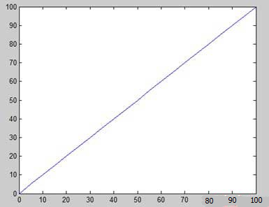

让我们举一个例子，绘制函数 y = x2。

在这个例子中，我们将绘制两个图形具有相同的函数，但在第二次，我们将减少值的增量。

请注意，因为减少了增量，图形会变得平滑。

在MATLAB中建立一个脚本文件，输入下述代码：

```
x = [1 2 3 4 5 6 7 8 9 10];
x = [-100:20:100];
y = x.^2;
plot(x, y)
```

运行该文件，MATLAB 显示如下图形：

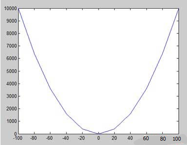

更改代码文件小，减少增量5：

```
x = [-100:5:100];
y = x.^2;
plot(x, y)
```

MATLAB绘制出一条平滑的曲线图：

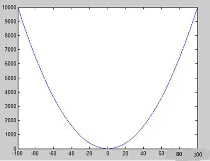

## MATLAB添加标题，标签，网格线和缩放的图形

我们可以在 MATLAB 中添加标题，调整 x 轴和 y 轴，网格线，并沿标签美化图形。

- xlabel 和 ylabel 指令产生沿 x 轴和 y 轴的标签。
- 标题命令允许你生成图表上的一个标题。
- 网格命令允许你生成图上的网格线。
- 轴等于命令允许生成与同等规模因素和空间两个坐标轴上的积点。
- 轴方形命令生成一个正方形的积点。

## 详细示例

在MATLAB中建立一个脚本文件，输入下述代码：

```
x = [0:0.01:10];
y = sin(x);
plot(x, y), xlabel('x'), ylabel('Sin(x)'), title('Sin(x) Graph'),
grid on, axis equal
```

在MATLAB中会生成下图：

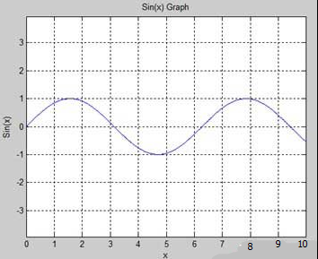

## MATLAB在同一张图上绘制多个函数

在MATLAB中可以绘制多个图形相同的积点。下面的例子演示了这一概念：

## 具体示例

在MATLAB中建立一个脚本文件，并输入下述代码：

```
x = [0 : 0.01: 10];
y = sin(x);
g = cos(x);
plot(x, y, x, g, '.-'), legend('Sin(x)', 'Cos(x)')
```

MATLAB会生成下图：

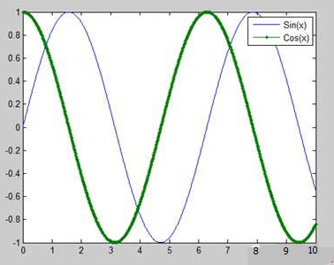

通过 `plot` 函数，在同一个图上绘制了这两个函数。在 `plot` 函数的参数列表中，首先指定了 `x` 和 `y` 的坐标，并用 `'.'` 参数指示绘制每个点的标记。然后，函数使用逗号分隔指定下一个要绘制的数据系列，即 `x` 和 `g`。`'.-'` 表示使用点线样式绘制 `cos(x)` 函数的图像。

最后，使用 `legend` 函数添加一个图例。字符串 `'Sin(x)'` 和 `'Cos(x)'` 分别表示这两个数据系列的标签名称。这将在图形中创建一个类似于“图例”的区域，用于区分各个数据系列。

## MATLAB在走势图上的颜色设置

MATLAB包含了八个绘制图形的基本颜色选项，下表提供了显示的颜色以及相应的代码：

|  Color  | Code  |
| :-----: | :---: |
|  White  | **w** |
|  Black  | **k** |
|  Blue   | **b** |
|   Red   | **r** |
|  Cyan   | **c** |
|  Green  | **g** |
| Magenta | **m** |
| Yellow  | **y** |

## 具体示例

让我们绘制两个多项式的图形：

1. f(x) = 3x4 + 2x3+ 7x2 + 2x + 9 and
2. g(x) = 5x3 + 9x + 2

在MATLAB中建立一个脚本文件，并输入下述代码：

```
x = [-10 : 0.01: 10];
y = 3*x.^4 + 2 * x.^3 + 7 * x.^2 + 2 * x + 9;
g = 5 * x.^3 + 9 * x + 2;
plot(x, y, 'r', x, g, 'g')
```

运行该文件，MATLAB会生成下图：

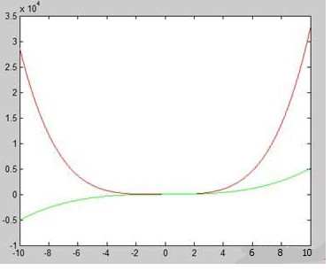

## MATLAB设置轴刻度

该轴命令允许您设置轴的刻度，您可以提供的最小值和最大值的 x 和 y 轴，使用轴命令的方式如下：

```
axis ( [xmin xmax ymin ymax] )
```

## 具体示例

在 MATLAB 中建立一个脚本文件，并输入下述代码：

```
x = [0 : 0.01: 10];
y = exp(-x).* sin(2*x + 3);
plot(x, y), axis([0 10 -1 1])
```

运行该文件，MATLAB会生成下图：

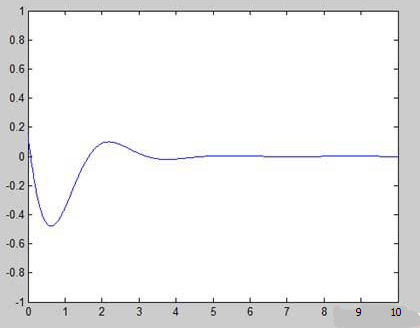

## MATLAB生成子图

当创建一个数组地块在相同的数字，这些地块被称为子图。

MATLAB 中使用 subplot 命令创建子图。

 subplot 命令的语法如下：

```
subplot(m, n, p)
```

其中，m 和 n 为积阵列的行和列的数量，p 指定把一个特定的积。

subplot 命令建立的每个绘图都可以有其自己的特点。

## 具体示例

让我们生成下述的两个图：


- y = e−1.5xsin(10x)
- y = e−2xsin(10x)


在MATLAB中建立一个脚本文件，并输入下述代码：

```
x = [0:0.01:5];
y = exp(-1.5*x).*sin(10*x);
subplot(1,2,1)
plot(x,y), xlabel('x'),ylabel('exp(–1.5x)*sin(10x)'),axis([0 5 -1 1])
y = exp(-2*x).*sin(10*x);
subplot(1,2,2)
plot(x,y),xlabel('x'),ylabel('exp(–2x)*sin(10x)'),axis([0 5 -1 1])
```

运行该文件，MATLAB会生成下图：

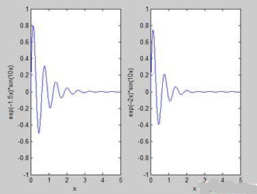

这段代码使用 MATLAB 绘制了两个图形，每个图形包含一个函数曲线。

在第一部分，代码定义了变量 `x` 和 `y`。其中 `x` 是从 `0` 到 `5` 的等间距数组，步长为 `0.01`。`y` 是函数 `exp(-1.5*x) * sin(10*x)` 的值。这个函数是一个指数衰减函数和正弦函数的乘积。使用 `subplot` 函数创建了一个 1×2 的网格，并在第一个网格中绘制了 `x` 和 `y` 的图像。通过 `xlabel` 和 `ylabel` 函数设置了横轴和纵轴的标签，分别是 `'x'` 和 `'exp(–1.5x)*sin(10x)'`。`axis` 函数用于设置坐标轴范围，以便于观察数据的变化趋势。

在第二部分，代码定义了一个新的 `y`，其函数表达式是 `exp(-2*x) * sin(10*x)`。这个函数和上面的函数非常相似，只是乘积函数中指数项的系数变成了 `–2`。使用 `subplot` 函数在第二个网格中绘制了 `x` 和新的 `y` 的图像，并将横轴和纵轴标签设为 `'x'` 和 `'exp(–2x)*sin(10x)'`。

运行该代码即可在两个子图中绘制出图像。第一个子图中的曲线随着 `x` 的增大逐渐镇定在 `y` 轴上方，而第二个子图中的曲线衰减得更快，振荡的幅度也更小，但仍然以正弦函数为形状的基线进行振动。

# MATLAB图形

在上节内容中我们大概了解了MATLAB绘图的一些基本操作命令，在本节我们将继续探索MATLAB绘图和图形功能，内容包括：

- 如何绘制二维条形图
- 如何绘制等值线
- 如何绘制三维图

## MATLAB绘制条形图

MATLAB 中使用 bar 命令绘制一个二维条形图。

## 具体示例

如果有一个包含10名学生的教室，这些学生获得的分数的百分比是75，58，90，87，50，85，92，75，60和95，使用这个数据，我们将绘制条形图。

在MATLAB中建立一个脚本文件，并输入下述代码：

```
x = [1:10];
y = [75, 58, 90, 87, 50, 85, 92, 75, 60, 95];
bar(x,y), xlabel('Student'),ylabel('Score'),
title('First Sem:')
print -deps graph.eps
```

运行该文件，MATLAB显示如下的棒形图：

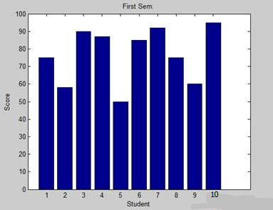

## MATLAB绘制等值线

contour 线的两个变量的函数的曲线，沿着该函数具有一个恒定值。加入等于标高点，一个给定的水平，如平均海平面以上用于创建等高线图等高线。

MATLAB 提供了一个轮廓绘制等高线图的函数。

## 具体例子

让我们生成的等高线图，显示了对于一个给定的功能的轮廓线 g = f(x, y)。这个函数有两个变量，因此，我们将生成两个独立的变量，即两个数据集 x 和 y。这是通过调用 meshgrid 命令。

meshgrid 命令是用于产生一个矩阵的元素，赋予 x 和 y 的范围内进行了在每一种情况下的增量同规格一起。

让我们绘制函数 g = f(x, y), where −5 ≤ x ≤ 5, −3 ≤ y ≤ 3，这两个值的增量为0.1。这些变量设置语法为：

```
[x,y] = meshgrid(–5:0.1:5, –3:0.1:3);
```

最后，我们需要分配功能，函数是：x2 + y2

在 MATLAB 中一个脚本文件，并输入下述代码：

```
[x,y] = meshgrid(-5:0.1:5,-3:0.1:3); %independent variables
g = x.^2 + y.^2;                     % our function
contour(x,y,g)                       % call the contour function
print -deps graph.eps
```

运行该文件，MATLAB显示的等高线图如下：

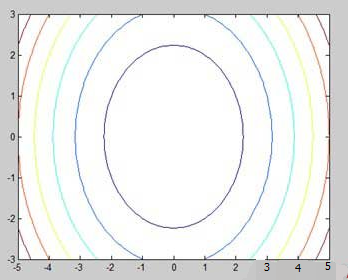


这段代码使用 meshgrid 函数生成了一个网格，并在该网格上计算了一个二元函数 `g` 的值。然后，使用 contour 函数绘制了这个函数的等值线图，并通过 print 函数将绘制的图保存为 EPS 格式的文件。

首先，通过 meshgrid 函数创建了两个矩阵 `x` 和 `y`，这些矩阵包含了一系列的 x 和 y 坐标点，这些坐标用于定义一个二维网格。其中，x 的取值范围是从 -5 到 5，步长为 0.1；y 的取值范围是从 -3 到 3，步长为 0.1。

接下来，使用这些 x 和 y 坐标，定义了一个函数 `g`，它是 x 和 y 的平方和。也就是说，`g = x.^2 + y.^2`。

然后，使用 contour 函数绘制了函数 `g` 的等值线图。contour 函数以 x、y 和 g 作为参数，它会自动计算出 g 的等值线，并将其绘制在当前的图形窗口中。

最后，使用 print 函数将绘制的图形保存为 EPS 格式的文件，文件名为 graph.eps。

运行这段代码将生成一个包含函数 `g` 的等值线图的图形，并将其保存为 graph.eps 文件。

让我们修改代码，慢慢美化该等高线图：

```
[x,y] = meshgrid(-5:0.1:5,-3:0.1:3); %independent variables
g = x.^2 + y.^2;                     % our function
[C, h] = contour(x,y,g);             % call the contour function
set(h,'ShowText','on','TextStep',get(h,'LevelStep')*2)
print -deps graph.eps
```

运行该文件，MATLAB显示的等高线图变成下述样子：

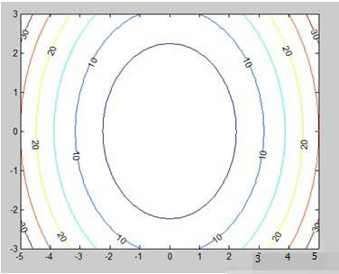

## MATLAB绘制三维图

三维图基本上显示的是由两个变量`g = f(x，y)`中的函数定义的表面。

像之前一样，要定义`g`，首先使用`meshgrid`命令在函数的域上创建一组`(x，y)`点。 接下来，分配函数本身。 最后，使用`surf`命令创建一个曲面图。

## 具体示例

为以下函数创建一个3D曲面图 g = xe-(x2 + y2)

在MATLAB中建立一个脚本文件，并输入下述代码：

```
[x,y] = meshgrid(-2:.2:2);
g = x .* exp(-x.^2 - y.^2);
surf(x, y, g)
print -deps graph.eps
```

运行该文件，MATLAB 显示下面的三维图：

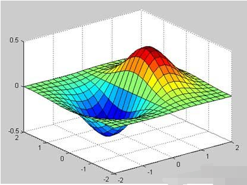

也可以使用`mesh`命令生成三维表面。 但是，`surf`命令显示连接线和表面的颜色，而`mesh`命令创建一个线框表面，带有连接定义点的彩色线。

# MATLAB代数

到本节为止，我们已经看到，所有的例子 MATLAB 方式工作以及GNU（或者称为Octave）。但是在解决基本的代数方程的问题上，MATLAB 和 Octave 有点差别，因此对于 MATLAB 和 octave 会单独分开介绍。

对于因式分解以及简化代数表达式，我们也会进行接触。

## 在MATLAB解决基本的代数方程组

MATLAB 中使用 solve 命令求解代数方程组。在其最简单的形式，solve 函数需要括在引号作为参数方程。

例如，让我们在方程求解 x， x-5 = 0

```
solve('x-5=0')
```

MATLAB执行上述语句，返回下述结果：

```
ans =
 5
```

还可以调用求解函数为：

```
y = solve('x-5 = 0')
```

MATLAB执行上述语句，返回以下结果：

```
y =
 5
```

甚至可能不包括的右边的方程：

```
solve('x-5')
```

MATLAB执行上述语句，返回以下结果：

```
ans =
 5
```

然而，如果公式涉及多个符号，那么MATLAB默认情况下，假定正在解决 x，解决命令具有另一种形式：

```
solve(equation, variable)
```

在那里，还可以提到的变量。

例如，让我们来解决方程 v – u – 3t2 = 0, 或 v 在这种情况下，我们应该这样写：

```
solve('v-u-3*t^2=0', 'v')
```

MATLAB执行上述语句，返回以下结果（有问题）：

```
ans =
 3*t^2 + u
```

您尝试使用 solve 函数解决方程 `v – u – 3t^2 = 0` 以求解变量 v。然而，solve 函数在解决多个变量的方程时需要传递一个符号表达式或方程对象，而不是直接传递一个字符串。

下面是正确使用 solve 函数求解符号方程的示例代码：

```
syms v u t;
eqn = v - u - 3*t^2 == 0;
sol = solve(eqn, v);

disp('The solution for v is: '), disp(sol);
```


在这个示例中，我们首先使用 syms 命令声明变量 `v`、`u` 和 `t` 为符号变量。然后，我们定义了方程 `eqn = v - u - 3*t^2 == 0`。接下来，我们使用 solve 函数解方程 `eqn`，并将结果赋给变量 `sol`。最后，我们使用 disp 函数输出解的结果。

请注意，solve 函数返回的解是一个符号表达式，而不是数值。如果您希望获得解的数值，可以使用 subs 函数将符号表达式中的变量替换为具体的数值：

```
u_val = 1;
t_val = 2;
numSol = subs(sol, {u, t}, {u_val, t_val});
disp('The numerical solution for v is: '), disp(numSol);
```


这样，您将得到解的数值作为输出。在这个示例中，我们将 u 替换为 1，t 替换为 2，并通过 subs 函数计算解的数值。最后，我们使用 disp 函数输出解的数值结果。

## MATLAB解决基本在Octave中代数方程组

根命令用于求解代数方程组 Octave ，可以写上面的例子如下：

例如，让我们在方程求解x ， x-5 = 0

```
roots([1, -5])
```

Octave 执行上述语句，返回以下结果：

```
ans =
 5
```

还可以调用求解函数为：

```
y = roots([1, -5])
```

Octave 执行上述语句，返回以下结果：

```
y =
 5
```

## 在MATLAB解决二次方程

solve 命令也可以解决高阶方程。它经常被用来求解二次方程，该函数返回在数组中的方程的根。

下面举例子解决二次方程 x2 -7x +12 = 0。

在MATLAB中建立一个脚本文件，并输入下述代码：

```
s = solve(x^2 -7*x + 12 == 0);
disp('The first root is: '), disp(s(1));
disp('The second root is: '), disp(s(2));
```

运行该文件，显示以下结果：

```
The first root is: 
3
The second root is: 
4
```

## Octave二次方程求解

下面的例子解决二次方程 x2 -7x +12 = 0 在 Octave 中。创建立一个脚本文件，并输入下述代码：

```
s = roots([1, -7, 12]);

disp('The first root is: '), disp(s(1));
disp('The second root is: '), disp(s(2));
```

运行该文件，显示以下结果：

```
The first root is: 
 4
The second root is: 
 3
```

## 在MATLAB解高阶方程

solve 命令还可以解决高阶方程。例如，让我们来解决一个三次方程 (x-3)2(x-7) = 0

```
solve([(x-3)^2*(x-7)=0])
```

MATLAB执行上述语句，返回以下结果：

```
ans =
  3
  3
  7
```

在高阶方程的情况下，根长含有许多术语。可以得到的数值如根，把它们转换成一倍。

下面的例子解决了四阶方程 x4 − 7x3 + 3x2 − 5x + 9 = 0.

在MATLAB中建立一个脚本文件，并输入下述代码：

```
eq = 'x^4 - 7*x^3 + 3*x^2 - 5*x + 9 = 0';
s = solve(eq);
disp('The first root is: '), disp(s(1));
disp('The second root is: '), disp(s(2));
disp('The third root is: '), disp(s(3));
disp('The fourth root is: '), disp(s(4));
% converting the roots to double type
disp('Numeric value of first root'), disp(double(s(1)));
disp('Numeric value of second root'), disp(double(s(2)));
disp('Numeric value of third root'), disp(double(s(3)));
disp('Numeric value of fourth root'), disp(double(s(4)));
```

运行该文件，返回以下结果：

```
The first root is: 
6.630396332390718431485053218985
 The second root is: 
1.0597804633025896291682772499885
 The third root is: 
- 0.34508839784665403032666523448675 - 1.0778362954630176596831109269793*i
 The fourth root is: 
- 0.34508839784665403032666523448675 + 1.0778362954630176596831109269793*i
Numeric value of first root
    6.6304
Numeric value of second root
    1.0598
Numeric value of third root
  -0.3451 - 1.0778i
Numeric value of fourth root
  -0.3451 + 1.0778i
```

请注意，在过去的两个根是复数。

## 在 Octave求解高阶方程

下面的例子解决了四阶方程 x4 − 7x3 + 3x2 − 5x + 9 = 0.

建立一个脚本文件，并输入下述代码：

```
v = [1, -7,  3, -5, 9];

s = roots(v);
% converting the roots to double type
disp('Numeric value of first root'), disp(double(s(1)));
disp('Numeric value of second root'), disp(double(s(2)));
disp('Numeric value of third root'), disp(double(s(3)));
disp('Numeric value of fourth root'), disp(double(s(4)));
```

运行该文件，返回以下结果：

```
Numeric value of first root
 6.6304
Numeric value of second root
-0.34509 + 1.07784i
Numeric value of third root
-0.34509 - 1.07784i
Numeric value of fourth root
 1.0598
```

## 在MATLAB中求解方程组

solve 命令也可以用于生成涉及一个以上的变量的方程系统的解决方案。

我们求解方程：

5x + 9y = 5

3x – 6y = 4

在MATLAB中建立一个脚本文件，并输入下述代码：

```
s = solve([5*x + 9*y == 5],[3*x - 6*y == 4]);
s.x
s.y
```

运行该文件，显示以下结果：

```
ans =
 22/19
ans =
-5/57
```

用同样的方法，可以解决大型线性系统。

请考虑以下的方程组：

x + 3y -2z = 5

3x + 5y + 6z = 7

2x + 4y + 3z = 8

## Octave方程求解系统

我们有一点点不同的方法来解决系统 'n' 的 'n' 未知数的线性方程组。

让我们求解方程：

5x + 9y = 5

3x – 6y = 4

这样的系统中的线性方程组的单一的矩阵方程可写为 Ax = b, 其中 A 是系数矩阵，b 是含有线性方程组右侧的列向量，x 是列向量，代表在下面的程序中所示

创建一个脚本文件，并键入下面的代码：

```
A = [5, 9; 3, -6];
b = [5;4];
A  b
```

运行该文件，显示以下结果：

```
ans =

   1.157895
  -0.087719
```

用同样的方法，可以解决大型线性系统给出如下：

x + 3y -2z = 5

3x + 5y + 6z = 7

2x + 4y + 3z = 8

## MATLAB扩大和收集方程

MATLAB中 expand 和 collect 命令用于扩展，并分别收集一个方程。下面的示例演示的概念：

当工作中有许多象征性的函数，你应当声明你的变量是象征意义的。

在MATLAB中建立一个脚本文件，并输入下述代码：

```
syms x %symbolic variable x
syms y %symbolic variable x
% expanding equations
expand((x-5)*(x+9))
expand((x+2)*(x-3)*(x-5)*(x+7))
expand(sin(2*x))
expand(cos(x+y))
 
% collecting equations
collect(x^3 *(x-7))
collect(x^4*(x-3)*(x-5))
```

运行该文件，显示以下结果：

```
ans =
 x^2 + 4*x - 45
 ans =
 x^4 + x^3 - 43*x^2 + 23*x + 210
 ans =
 2*cos(x)*sin(x)
 ans =
cos(x)*cos(y) - sin(x)*sin(y)
 ans =
 x^4 - 7*x^3
 ans =
 x^6 - 8*x^5 + 15*x^4 
```

## Octave扩展和收集方程 

你需要 symbolic 包，它提供了expand 和 collect 命令来扩大和收集方程。下面的示例演示的概念：

当工作中有许多象征意义的函数，应该声明变量是象征性的，但八度有不同的方法来定义符号变量。注意使用 sin 和 cos，他们还象征意义性的包中定义。

建立一个脚本文件，并输入下述代码：

```
% first of all load the package, make sure its installed.
pkg load symbolic

% make symbols module available
symbols

% define symbolic variables
x = sym ('x');
y = sym ('y');
z = sym ('z');

% expanding equations
expand((x-5)*(x+9))
expand((x+2)*(x-3)*(x-5)*(x+7))
expand(Sin(2*x))
expand(Cos(x+y))
 
% collecting equations
collect(x^3 *(x-7), z)
collect(x^4*(x-3)*(x-5), z)
```

当运行该文件，它会显示以下结果：

```
ans =

-45.0+x^2+(4.0)*x
ans =

210.0+x^4-(43.0)*x^2+x^3+(23.0)*x
ans =

sin((2.0)*x)
ans =

cos(y+x)
ans =

x^(3.0)*(-7.0+x)
ans =

(-3.0+x)*x^(4.0)*(-5.0+x)
```

## 分解和简化代数表达式

factor 命令表达式 factorizes 是一个简化命令的简化表达。

## 具体例子

建立一个脚本文件，并输入下述代码：

```
syms x
syms y
factor(x^3 - y^3)
factor([x^2-y^2,x^3+y^3])
simplify((x^4-16)/(x^2-4))
```

运行该文件，显示以下结果：

```
ans =
(x - y)*(x^2 + x*y + y^2)
 ans =
 [ (x - y)*(x + y), (x + y)*(x^2 - x*y + y^2)]
 ans =
 x^2 + 4
```

# MATLAB微积分

MATLAB 中有些问题需要使用微积分来解决，MATLAB提供微分方程求解任何极限的程度和计算方法，并且可以很容易地绘制图形复变函数，并检查最大值，最小值和图形解决原始函数，以及其衍生的其他内容。

在本章中，我们将讨论预演算概念，即计算功能的限制和验证的属性限制。

## MATLAB计算极限

在 MATLAB 中如果要极限计算就要使用 limit 命令。其最基本的形式是将表达 limit 命令作为参数，并作为独立变量变为零发现极限的表达。

例如，让我们计算一个函数的极限 f(x) = (x3 + 5)/(x4 + 7)， 当 x 趋于零。

```
syms x
limit((x^3 + 5)/(x^4 + 7))
```

MATLAB执行上述语句，返回以下结果：

```
ans =
 5/7 
```

limit 命令属于符号计算的境界中，你需要使用 SYMS 命令告诉 MATLAB 您使用的符号变量。

limit 命令也可以计算一个函数的极限，作为变量趋于零以外的一些数字。为了计算 lim x->a(f(x))，我们使用 limit 命令参数，其中，第一个是表达式，第二个是数量，x 趋向，在这里它是a。

例如，让我们计算函数极限 f(x) = (x-3)/(x-1),  x 无限接近于 1.

```
limit((x - 3)/(x-1),1)
```

MATLAB执行上述语句，并返回以下结果：

```
ans =
 NaN
```

继续执行另外的实例，

```
limit(x^2 + 5, 3)
```

MATLAB执行上述语句，返回以下结果：

```
ans =
 14 
```

## 使用Octave计算极限

以下是上面的例子中使用 symbolic 包 Octave 版本，尝试执行和比较的结果：

```
pkg load symbolic
symbols
x=sym("x");

subs((x^3+5)/(x^4+7),x,0)
```

Octave 执行上面的语句，并返回以下结果：

```
ans =
0.7142857142857142857
```

## 核查的基本性质限制

代数极限定理提供了一些基本的性能限制。

如下所示：

**limx->p （ f（x） + g（x）） = limx->p f（x） + limx->p g（x）****limx->p （f（x）- g（x）） = limx->p f(x) - limx->p g（x）****limx->p （f（x）· g（x）） =  limx->p f（x）· limx->p g（x）****limx->p （f（x）/g（x）） = limx->p f（x）/ limx->p g（x）**

我们考虑两个函数：

1. f(x) = (3x + 5)/(x - 3)
2. g(x) = x2 + 1.

让我们计算为 x 的函数的极限的倾向 5，这两个函数和验证限制使用这两个函数和MATLAB的基本属性。

## 详细例子

在MATLAB中建立一个脚本文件，并输入下述代码：

```
syms x
f = (3*x + 5)/(x-3);
g = x^2 + 1;
l1 = limit(f, 4)
l2 = limit (g, 4)
lAdd = limit(f + g, 4)
lSub = limit(f - g, 4)
lMult = limit(f*g, 4)
lDiv = limit (f/g, 4)
```

运行该文件时，显示如下结果：

```
l1 =
 17
  
l2 =
17
  
lAdd =
 34
 
lSub =
 0
  
lMult =
289
  
lDiv =
1
```

## 极限使用的基本性质的验证Octave

以下是上面的例子中使用 symbolic 包 Octave 版本，尝试执行和比较的结果： 

```
pkg load symbolic
symbols

x = sym("x");
f = (3*x + 5)/(x-3);
g = x^2 + 1;

l1=subs(f, x, 4)
l2 = subs (g, x, 4)
lAdd = subs (f+g, x, 4)
lSub = subs (f-g, x, 4)
lMult = subs (f*g, x, 4)
lDiv = subs (f/g, x, 4)
```

Octave 执行上述语句，返回以下结果：

```
l1 =

17.0
l2 =

17.0
lAdd =

34.0
lSub =

0.0
lMult =

289.0
lDiv =

1.0
```

## MATLAB 左，右侧极限

当一个函数具有某些特定变量的值的不连续性，极限在这一点上不存在。换句话说，极限具有不连续的函数f（x）在x = a ，当不相等的值的极限，当 x 趋向 x 从左侧的值极限为 x 的方法。

这导致的概念左手侧 和右手侧 极限。a限值定为左手侧 x > a 极限，从左侧，即 X 接近的值的 x<a。右手极限为x的极限 - 被定义为，从右边，即x接近值 x>a 。当是不相等的左手系的极限和右手极限，该极限不存在。

让我们考虑一个函数：

**f(x) = (x - 3)/|x - 3|**

我们将证明 limx->3 f(x) 不存在。 MATLAB帮助我们建立这个事实在两个方面：

- 通过绘制的函数的曲线图，并示出了不连续
- 通过计算的极限和显示，两者是不同的。

左手侧和右手侧极限，计算传递字符串 '左' 和 '右' limit 命令的最后一个参数。

## 具体示例

在MATLAB中建立一个脚本文件，并输入下述代码：

```
f = (x - 3)/abs(x-3);
ezplot(f,[-1,5])
l = limit(f,x,3,'left')
r = limit(f,x,3,'right')
```

表达式 `abs(x-3)` 表示取 `x-3` 的绝对值，在区间 [-1,5] 上的图像

运行该文件，MATLAB 得出如下的图型：

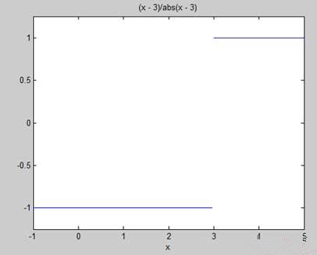

并显示下面的输出：

```
l =
 -1
  
r =
1
```

# MATLAB多项式

在 MATLAB 中，多项式用一个行向量表示，行向量的元素值为**多项式系数按幂次的降序排列**。

例如，方程 P(x) = x^4 + 7x^3 - 5x + 9 可以表示为：

p = [1 7 0 -5 9]；

## MATLAB计算多项式

MATLAB中 polyval 函数用于将指定的值 - 计算多项式。例如，要计算我们本节开始时举例的多项式 p， x = 4，输入:

```
p = [1 7 0  -5 9];
polyval(p,4)
```

MATLAB 执行上述语句，返回以下结果：

```
ans =
   693
```

MATLAB 还提供了计算矩阵多项式 polyvalm 函数。矩阵多项式一个多项式矩阵变量。

例如，我们建立一个正方形矩阵 X 并计算多项式 p:

```
p = [1 7 0  -5 9];
X = [1 2 -3 4; 2 -5 6 3; 3 1 0 2; 5 -7 3 8];
polyvalm(p, X)
```

MATLAB执行上述语句，返回以下结果：

```
ans =
        2307       -1769        -939        4499
        2314       -2376        -249        4695
        2256       -1892        -549        4310
        4570       -4532       -1062        9269
```

## 查找多项式的根

根函数可以计算多项式的根。

例如，要计算多项式 p，输入根：

```
p = [1 7 0  -5 9];
r = roots(p)
```

MATLAB执行上述语句，返回以下结果：

```
r =
  -6.8661 + 0.0000i
  -1.4247 + 0.0000i
   0.6454 + 0.7095i
   0.6454 - 0.7095i
```

 poly 函数是根函数，并返回多项式的系数的倒数。

例如：

```
p2 = poly(r)
```

MATLAB执行上述语句，返回以下结果：

```
p2 =
    1.0000    7.0000    0.0000   -5.0000    9.0000
```

## 多项式曲线拟合

polyfit 函数找到一个多项式的系数，适合采用最小二乘意义上的一组中的数据。

如果 x 和 y 是两个向量含有的 x 和 y 被拟合数据的一个 n 次多项式，那么我们得到的多项式拟合的数据通过写入

```
p = polyfit(x,y,n)
```

## 详细例子

在MATLAB中建立一个脚本文件，并输入下述代码：

```
x = [1 2 3 4 5 6]; y = [5.5 43.1 128 290.7 498.4 978.67];  %data
p = polyfit(x,y,4)   %get the polynomial
% Compute the values of the polyfit estimate over a finer range, 
% and plot the estimate over the real data values for comparison:
x2 = 1:.1:6;          
y2 = polyval(p,x2);
plot(x,y,'o',x2,y2)
grid on
```

运行该文件，MATLAB显示以下结果：

```
p =
    4.1056  -47.9607  222.2598 -362.7453  191.1250
```

并绘制下图：

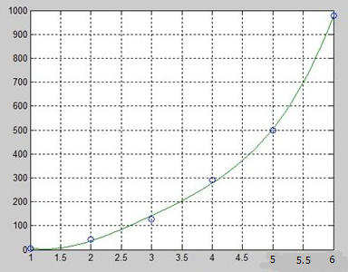

# MATLAB变换

MATLAB中提供了命令与转换，如拉普拉斯和傅里叶变换。

MATLAB中变换是一种用来从另一个角度简化数据分析科学和工程。

傅立叶变换实现了时间与频率的转换；拉普拉斯变换可以将时域函数变换复频域函数，简化微积分方程计算。

MATLAB提供的拉普拉斯，傅里叶和FFT命令拉普拉斯，傅里叶和快速傅里叶变换工作。

## MATLAB拉普拉斯变换

时间函数 f（t）的拉普拉斯变换的函数，通过下式给出下面的积分：

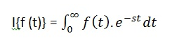

拉普拉斯变换的变换函数 f（t）也表示为，F（次）。可以看到这种变换或一体化进程的符号变量t的函数，F（T），转换成另一个函数F（s）和另一个变量s。

拉普拉斯变换将微分方程转化为代数。要计算一个函数 f（t）的拉普拉斯变换，这样写：

```
laplace(f(t))
```

## 具体示例

接下来，我们会计算一些常用函数的拉普拉斯变换。

在MATLAB中建立一个脚本文件，并输入下述代码：

```
syms s t a b w
laplace(a)
laplace(t^2)
laplace(t^9)
laplace(exp(-b*t))
laplace(sin(w*t))
laplace(cos(w*t))
```

运行该文件，显示以下结果：

```
ans =
 1/s^2

 ans =
 2/s^3

 ans =
 362880/s^10

 ans =
 1/(b + s)
  
ans =
 w/(s^2 + w^2)
  
ans =
 s/(s^2 + w^2)
```

## MATLAB逆拉普拉斯变换

MATLAB中使用命令 ilaplace 计算拉普拉斯逆变换。

例如：

```
ilaplace(1/s^3)
```

MATLAB执行上述语句，并显示结果：

```
ans =
 t^2/2
```

## 详细例子

在MATLAB中建立一个脚本文件，并输入下述代码：

```
syms s t a b w
ilaplace(1/s^7)
ilaplace(2/(w+s))
ilaplace(s/(s^2+4))
ilaplace(exp(-b*t))
ilaplace(w/(s^2 + w^2))
ilaplace(s/(s^2 + w^2))
```

运行该文件，显示以下结果：

```
ans =
t^6/720

 ans =
 2*exp(-t*w)

 ans =
 cos(2*t)

 ans =
 ilaplace(exp(-b*t), t, x)

 ans =
 sin(t*w)

 ans =
 cos(t*w)
```

## MATLAB傅立叶变换

傅立叶变换，常用的时间变换的数学函数，函数 f（t），进入一个新的功能，有时记为或F组，其参数是频率与周期/秒（赫兹）或每秒弧度的单位。新的函数，然后被称为傅里叶变换和/或函数f的频谱。

## 详细例子

在MATLAB中建立一个脚本文件，并输入下述代码：

```
syms x 
f = exp(-2*x^2);  %our function
ezplot(f,[-2,2])  % plot of our function
FT = fourier(f)	% Fourier transform
```

运行该文件，MATLAB绘制出下图：

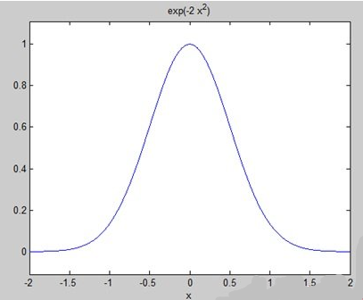

并显示以下结果：

```
FT =
 (2^(1/2)*pi^(1/2)*exp(-w^2/8))/2
```

折线图的傅里叶变换为：

```
ezplot(FT)
```

给出了如下图：

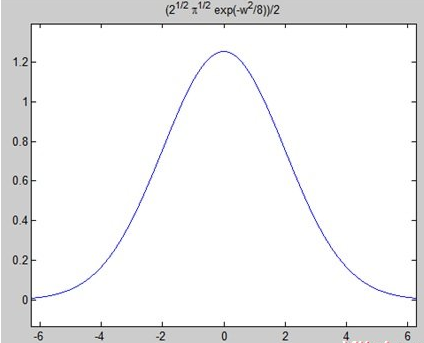

## MATLAB傅立叶逆变换

MATLAB提供的 ifourier 命令，用于计算一个函数的傅立叶逆变换。

例如：

```
f = ifourier(-2*exp(-abs(w)))
```

MATLAB执行上述语句，并显示如下结果：

```
f =
-2/(pi*(x^2 + 1))
```

# MATLAB GNU Octave教程

GNU Octave 是一种高级编程语言，像 MATLAB，它主要是用 MATLAB 兼容。

GNU Octave 也可以用来进行数值计算，还有丰富的 C++ 接口可以让用户编程时调用。

## Octave 和 MATLAB 共同的特点

- 矩阵的基本数据类型
- 它内置支持复数
- 它具有内置数学函数和库
- 它支持用户自定义功能

GNU Octave 是自由可再分发的软件，这意味着你可以在自由软件基金会发布的GNU通用公共许可证（GPL）的条款下重新分配或对它进行修改。

## MATLAB 和 Octave

极大一部分的 MATLAB 程序运行在 Octave，但是有一些 Octave 支持的语法是 MATLAB 不支持的，所以这些 Octave 程序可能无法正常运行。

就好比 MATLAB 只支持单引号，但是Octave能够支持单，双引号来定义字符串

### 兼容的示例

本教程中涉及的几乎所有的例子都是用 MATLAB 以及 Octave 兼容。

在 MATLAB 和 Octave 试试下面的例子，没有任何语法的变化并且会有相同的结果产生：

以下例子中将建立一个3D表面地图函数 g = xe-(x2 + y2) 。

在MATLAB中建立一个脚本文件，并输入下述代码：

```
[x,y] = meshgrid(-2:.2:2);
g = x .* exp(-x.^2 - y.^2);
surf(x, y, g)
print -deps graph.eps
```

运行该文件，显示出的3-D地图：

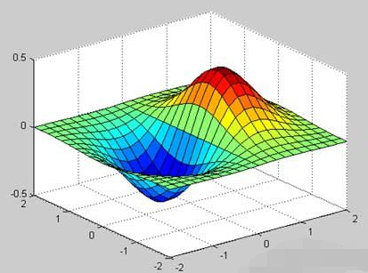

### 不兼容的例子

MATLAB 中有一部分功能是不能够在 Octave 中使用的，举几个例子：微分和积分积分，无论是从语言还是其他角度，这并不完全匹配。

下面给出两种类型的例子，以此显示他们的语法不同的地方。

在下面的例子中 MATLAB 和 Octave 使不同功能的使用面积曲线： f(x) = x2 cos(x) for −4 ≤ x ≤ 9。

我们先来看看 MATLAB 中的代码：

```
f = x^2*cos(x);
ezplot(f, [-4,9])
a = int(f, -4, 9)
disp('Area: '), disp(double(a));
```

运行该文件，MATLAB绘制如下图表：

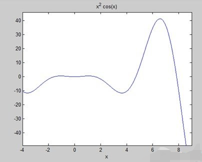

显示结果如下：

```
a =
 
8*cos(4) + 18*cos(9) + 14*sin(4) + 79*sin(9)
 
Area: 
    0.3326
```

在 Octave 中使用相同的面积曲线，必须使用符号包如下：

```
pkg load symbolic
symbols

x = sym("x");

f = inline("x^2*cos(x)");

ezplot(f, [-4,9])
print -deps graph.eps

[a, ierror, nfneval] = quad(f, -4, 9);

display('Area: '), disp(double(a));
```

# MATLAB Simulink 仿真

Simulink 是 MATLAB 最重要的组件之一，它提供一个动态系统建模、仿真和综合分析的集成环境。本节要教你建立 simulink 仿真程序。

它可以让你将 MATLAB 算法模型，以及导出到MATLAB仿真结果作进一步分析。

Simulink 支持：

- 系统级设计
- 模拟
- 自动代码生成
- 嵌入式系统的测试和验证

MathWorks 还提供了其他一些附加产品和第三方硬件和软件产品可用于 Simulink。

下列是简要说明：

- Stateflow 允许开发状态机器和流程图。
- Simulink Coder 可以自动生成C源代码系统的实时实现。
- xPC Target 可基于x86 实时系统提供了一个环境模拟和测试 Simulink 和 Stateflow 模型的实时物理系统上。
- Embedded Coder 支持特定的嵌入式目标。
- HDL Coder 允许自动生成可综合的VHDL和Verilog
- SimEvents 提供了一个库的图形积木造型排队系统

Simulink 是能够通过造型风格检查，要求可追溯性和模型覆盖分析模型系统的核查和验证。

Simulink 设计验证，让您识别设计错误，并生成测试模型检查情况。

## 使用 Simulink

要打开 Simulink，在 MATLAB 工作空间的类型：

```
simulink
```

使用库浏览打开 Simulink ，库浏览是用于建立仿真模型。

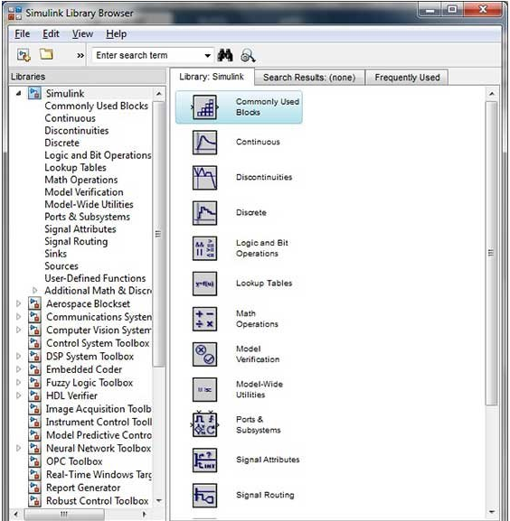

在左侧窗格中，你会发现几个库的基础上，各系统分类，点击每一个设计模块将显示在右侧的窗口窗格中。

## 建立模型

要建立一个新的模型库浏览的工具栏上，单击新建按钮，将打开一个新的未命名的示范窗口，如下图所示：

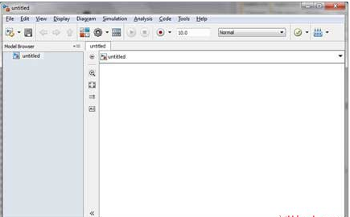

Simulink 模型的框图。

模型元素的加入，通过选择适当的元素从“库”浏览器，并将其拖动到模型窗口，或者，您可以复制模型元素，将它们粘贴到模型窗口。

## 具体例子

从 Simulink 库中的拖放到你的项目。

如果在本实施例的目的，2块将被用于模拟 - 源（信号）和一个接收器（范围）。信号发生器（源）产生模拟信号，然后将图形可视化的范围（片）。

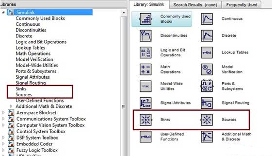

首先从库中所需的块拖动到项目窗口；然后，将块连接在一起，可以通过拖动一个街区到另一个连接点连接器。

让我们“正弦波”拖动到模型块。

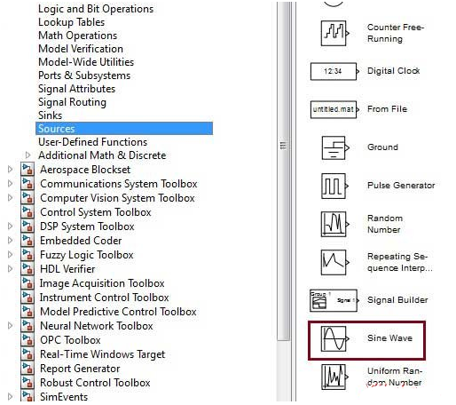

选择 'Sinks' 从库中拖出一个 “Scope” 到模型块。

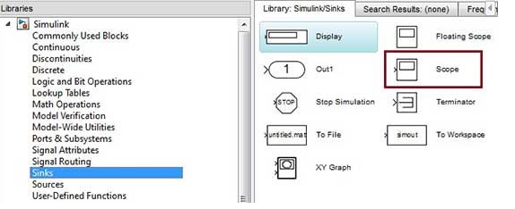

 

将信号线从的输出正弦波块，范围块的输入。

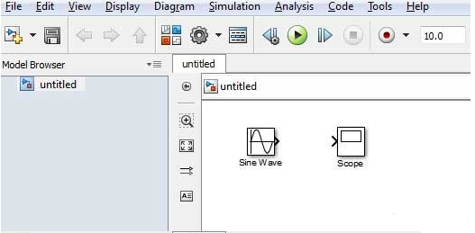

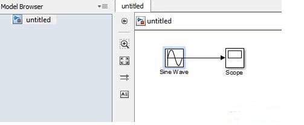

运行仿真按下 “Run” 按钮，所有参数保持默认（从模拟菜单中，您可以更改它们）。

我们可以从下图得到应该得到的范围。

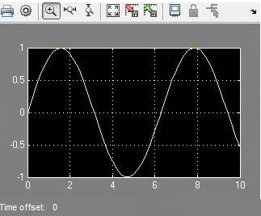