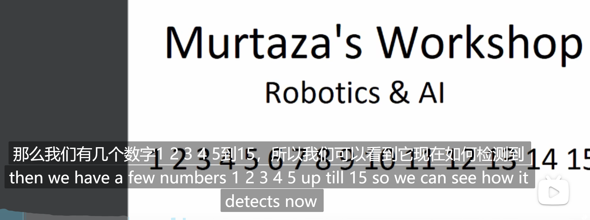
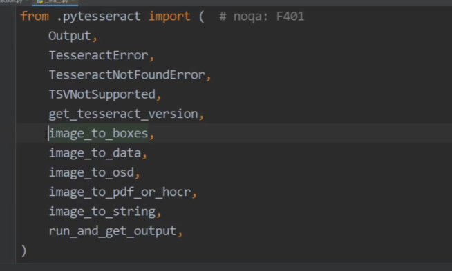
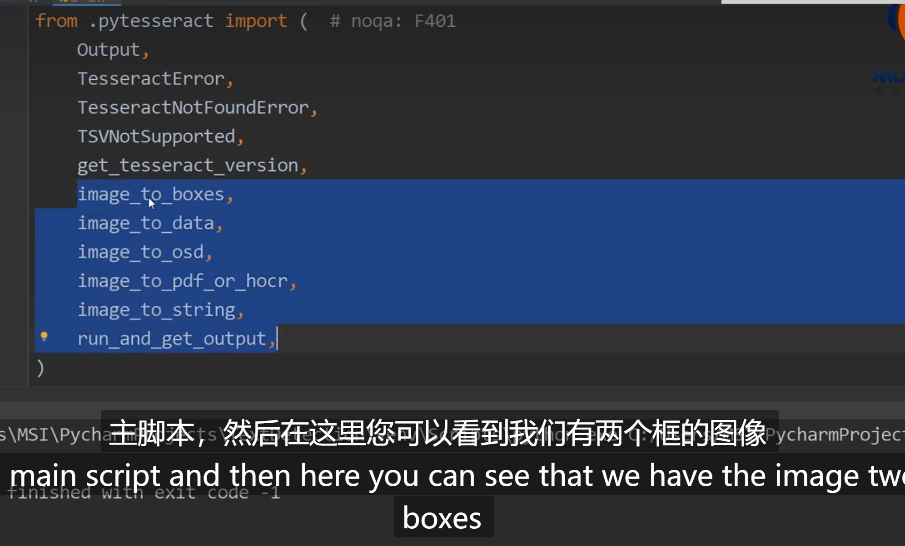
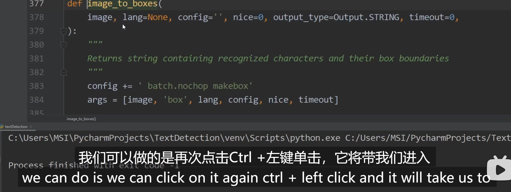
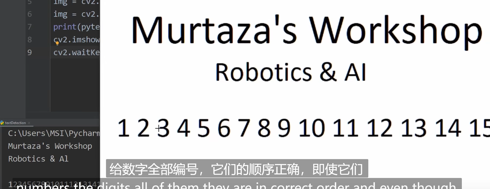
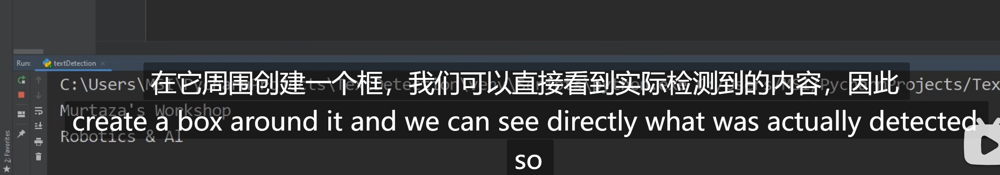
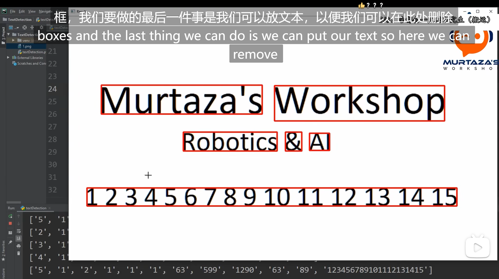
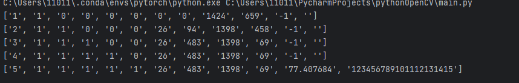
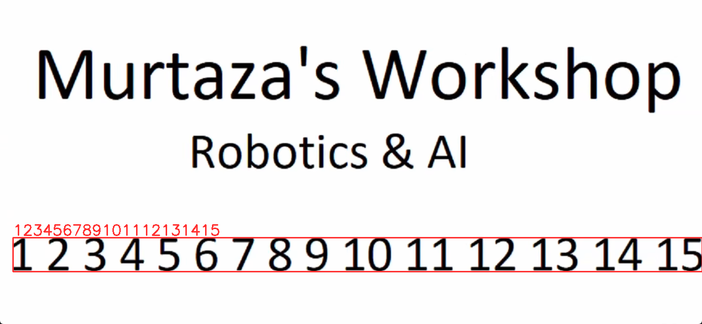

# 使用Tesseract在Python OCR中使用






这些对象是与 Tesseract OCR 库相关的，下面对它们进行简要的讲解：

- `Output`：这是一个包含 Tesseract 输出结果的类。它提供了访问识别结果的属性和方法，可以获取文本、字符盒子、置信度等信息。
- `TesseractError`：这是一个自定义的异常类，在使用 Tesseract 时出现错误时会抛出该异常。
- `TesseractNotFoundError`：这也是一个自定义的异常类，当找不到 Tesseract 安装时会抛出该异常。
- `TSVNotsupported`：这是一个自定义的异常类，在不支持的操作系统上使用 Tesseract 时会抛出该异常。
- `get tesseract_version`：这是一个函数，用于获取当前安装的 Tesseract 的版本号。
- `image_to_boxes`：这是一个函数，用于从图像中提取字符的位置信息（字符盒子）。
- `image_to_data`：这是一个函数，用于从图像中提取字符的位置信息、文本、置信度等详细信息。
- `image_to_osd`：这是一个函数，用于从图像中获取文字方向和脚本信息。
- `image_to_pdf_or_hocr`：这是一个函数，用于将图像转换为 PDF 或 HOCR（HTML + OCR）格式。
- `image_to_string`：这是一个函数，用于将图像中的文本提取为字符串。
- `run_and_get_output`：这是一个函数，用于在命令行中运行 Tesseract 并获取输出结果。

这些对象和函数是使用 Tesseract OCR 进行 OCR 文字识别时常用的工具。你可以根据需要使用它们来提取图像中的文本以及其他相关信息。

## 同时检测英文和数字

```python
# 设置 Tesseract OCR 的路径
pytesseract.pytesseract.tesseract_cmd = 'C:\\Program Files\\Tesseract-OCR\\tesseract.exe'

# 读取图像
img = cv2.imread('1.png')
img = cv2.cvtColor(img, cv2.COLOR_BGR2RGB)

#############################################
#### Detecting Characters  ######
#############################################

# 获取图像高度和宽度
hImg, wImg, _ = img.shape

# 使用 Tesseract OCR 检测字符框,并得到每个字符的位置数据（长宽高，就是四边的边界点框数据）
boxes = pytesseract.image_to_boxes(img)

# 遍历每个字符框
for b in boxes.splitlines():
    print(b)
    b = b.split(' ') #需要拆分得到数值，因为每一项数值都是空格隔开的，将数据拆分成一个数组
    print(b)
    x, y, w, h = int(b[1]), int(b[2]), int(b[3]), int(b[4]) #得到框的每个点的数据
    
    # 在原始图像上绘制字符框
    cv2.rectangle(img, (x, hImg - y), (w, hImg - h), (50, 50, 255), 2)
    
    # 在字符框上绘制字符标签
    cv2.putText(img, b[0], (x, hImg - y + 25), cv2.FONT_HERSHEY_SIMPLEX, 1, (50, 50, 255), 2)

# 显示图像
cv2.imshow('img', img)
cv2.waitKey(0)
```









```python
import cv2
import pytesseract
import numpy as np
from PIL import ImageGrab
import time

# 设置 Tesseract OCR 的路径
pytesseract.pytesseract.tesseract_cmd = 'C:\\Program Files\\Tesseract-OCR\\tesseract.exe'

# 读取图像
img = cv2.imread('1.png')
img = cv2.cvtColor(img, cv2.COLOR_BGR2RGB)

# 获取图像的高度和宽度
hImg, wImg, _ = img.shape

# 使用 Tesseract OCR 检测字符框
boxes = pytesseract.image_to_boxes(img)

# 遍历每个字符框
for b in boxes.splitlines():
    print(b)
    b = b.split(' ')
    print(b)

    # 获取字符框的坐标和宽高
    x, y, w, h = int(b[1]), int(b[2]), int(b[3]), int(b[4])

    # 在原图上绘制字符框
    cv2.rectangle(img, (x, hImg- y), (w, hImg- h), (50, 50, 255), 2)
    
    # 在字符框上添加字符标签
    cv2.putText(img,b[0],(x, hImg- y+25),cv2.FONT_HERSHEY_SIMPLEX,1,(50,50,255),2)

# 显示图像
cv2.imshow('img', img)
cv2.waitKey(0)
```

`boxes.splitlines()` 是将 `boxes` 字符串按行分割成一个列表的函数。在这里，`boxes` 是通过使用 Tesseract OCR 检测图像中字符的函数 `pytesseract.image_to_boxes()` 获得的结果字符串。

使用`splitlines()`函数可以将字符串按行分割成一个列表，每一行作为列表的一个元素。这样，你可以逐行遍历处理检测到的字符框。

例如，如果 `boxes` 的内容如下：

```
H 0 10 50 90 0
e 60 10 100 90 0
l 110 10 150 90 0
l 160 10 200 90 0
o 210 10 250 90 0
```

运行 `boxes.splitlines()` 将返回一个包含以下元素的列表：

```
['H 0 10 50 90 0', 'e 60 10 100 90 0', 'l 110 10 150 90 0', 'l 160 10 200 90 0', 'o 210 10 250 90 0']
```

通过遍历这个列表，你可以进一步对每个字符框进行处理。

todata:



可以通过判断数据的长度来判断抓取到的长度内容，直接对内容进行框选

```
# boxes = pytesseract.image_to_data(img)
# for a,b in enumerate(boxes.splitlines()):
#         print(b)
#         if a!=0:
#             b = b.split()
#             if len(b)==12:
#                 x,y,w,h = int(b[6]),int(b[7]),int(b[8]),int(b[9])
#                 cv2.putText(img,b[11],(x,y-5),cv2.FONT_HERSHEY_SIMPLEX,1,(50,50,255),2)
#                 cv2.rectangle(img, (x,y), (x+w, y+h), (50, 50, 255), 2)
```

## 只检测数字或者英文

```python
##############################################
##### 只检测数字  ######
##############################################
import cv2
import pytesseract
import numpy as np
from PIL import ImageGrab
import time

# 读取图像
img = cv2.imread('1.png')
img = cv2.cvtColor(img, cv2.COLOR_BGR2RGB)

hImg, wImg, _ = img.shape
conf = r'--oem 3 --psm 6 outputbase digits'  # 写入过滤配置
boxes = pytesseract.image_to_data(img, config=conf)
for i,b in enumerate(boxes.splitlines()):
    if i == 0:
        continue
    b = b.split('	')
    print(b)
    if len(b)==12 and b[11] != '':
        x,y,w,h = int(b[6]),int(b[7]),int(b[8]),int(b[9])
        cv2.putText(img,b[11],(x,y-5),cv2.FONT_HERSHEY_SIMPLEX,1,(50,50,255),2)
        cv2.rectangle(img, (x,y), (x+w, y+h), (50, 50, 255), 2)
# 显示图像
cv2.imshow('img', img)
cv2.waitKey(0)
```





`--oem 3 --psm 6 outputbase digits` 是用于配置 Tesseract OCR 的参数字符串。

- `--oem 3` 表示使用 OCR 引擎的模式 3。OCR 引擎模式指定了在识别文本时使用的算法和模型。模式 3 是 Tesseract OCR 中默认的 OCR 引擎模式，适用于大多数一般情况。

- `--psm 6` 表示页面分割模式 6。页面分割模式指定了在识别文本时如何将图像划分成文本行和单词。模式 6 用于识别断行的均匀垂直文本块。

- `outputbase digits` 表示输出仅包含数字字符。这个配置会告诉 Tesseract OCR 只输出数字结果。


### psm

通过将这些配置参数组合在一起，你可以控制 Tesseract OCR 的行为，以使其专门处理数字字符，并根据需要灵活地应用适当的 OCR 算法和模型。

这些是 Tesseract OCR 中的 `--psm` 参数值和对应的描述：

- `0`：仅方向和脚本检测（Orientation and script detection only）
- `1`：自动页面分割，包括方向和脚本检测（Automatic page segmentation with orientation and script detection，OSD）
- `2`：自动页面分割，不包括 OSD 和 OCR（Automatic page segmentation, but no OSD or OCR）
- `3`：完全自动页面分割，不包括 OSD（Fully automatic page segmentation, but no OSD）
- `5`：假设为可变大小的单列文本（Assume a single column of text of variable sizes）
- `6`：假设为垂直对齐的单一文本块（Assume a single uniform block of vertically aligned text）
- `7`：假设为单一文本块（Assume a single uniform block of text，Default）
- `8`：将图像视为单行文本（Treat the image as a single text line）
- `9`：将图像视为单个单词（Treat the image as a single word）
- `10`：将图像视为圆形单词（Treat the image as a single word in a circle）
- `11`：将图像视为单个字符（Treat the image as a single character）
- `12`：以任意顺序找出尽可能多的文本（Find as much text as possible in no particular order）
- `13`：稀疏文本与方向和脚本检测（Sparse text with orientation and script detection）
- `14`：将图像视为单行文本，绕过 Tesseract 特有的技巧（Treat the image as a single text line, bypassing hacks that are Tesseract-specific）

使用这些参数，你可以根据图像的特性和所需的识别结果类型，选择适当的页面分割模式来提高识别准确性和效果。

### oem

这些是 Tesseract OCR 中的 "oem" 参数值和对应的描述：

- `0`：仅使用 Tesseract 引擎 - 速度最快（OEM TESSERACT ONLY）
- `1`：仅使用 Cube 引擎 - 精度更高，但速度较慢（OEM _CUBE ONLY）
- `2`：同时运行 Tesseract 和 Cube 引擎，并合并结果 - 最佳精度（OEM TESSERACT CUBE COMBINED 2）
- `3`：默认模式，根据需要自动选择以上模式（OEM_DEFAULT）

使用这些参数，你可以指定 OCR 引擎的运行模式，以达到在速度和准确性之间获得最佳的平衡。选择适合你需求的模式，根据速度和准确性的要求作出权衡。