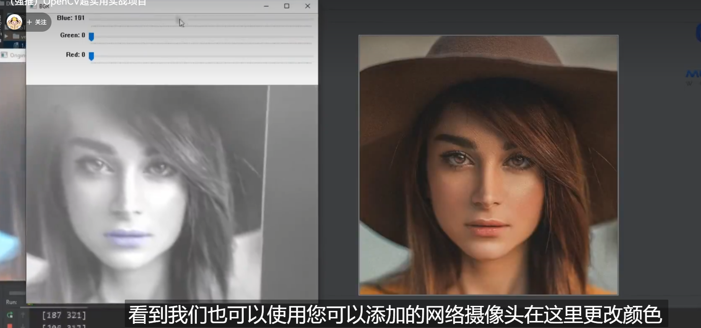

## 面部特征提取及添加滤镜



```python
# 导入需要的库
import cv2
import numpy as np
import dlib

# 设置摄像头参数
webcam = False
cap = cv2.VideoCapture(0)

# 使用人脸检测器和面部特征预测器进行人脸检测
detector = dlib.get_frontal_face_detector()
predictor = dlib.shape_predictor("shape_predictor_68_face_landmarks.dat")

# 创建一个空的回调函数，稍后用于滑动条
def empty(a):
    pass

# 创建一个名为"BGR"的窗口并添加三个滑动条，用于调节颜色
cv2.namedWindow("BGR")
cv2.resizeWindow("BGR",640,240)
cv2.createTrackbar("Blue","BGR",153,255,empty)
cv2.createTrackbar("Green","BGR",0,255,empty)
cv2.createTrackbar("Red","BGR",137,255,empty)

# 创建一个函数，用于提取面部特征并绘制感兴趣区域（ROI）
def createBox(img, points, scale=5, masked=False, cropped=True):
    if masked:
        # 创建一个和图像大小相同的空掩码并填充ROI区域
        mask = np.zeros_like(img)
        mask = cv2.fillPoly(mask,[points],(255,255,255))
        img = cv2.bitwise_and(img,mask)

    if cropped:
        # 获取ROI的边界框，裁剪感兴趣区域并调整大小
        bbox = cv2.boundingRect(points)
        x, y, w, h = bbox
        imgCrop = img[y:y+h,x:x+w]
        imgCrop = cv2.resize(imgCrop,(0,0),None,scale,scale)
        cv2.imwrite("Mask.jpg",imgCrop)
        return imgCrop
    else:
        return mask

# 主循环
while True:
    if webcam:
        # 读取视频流中的帧
        success, img = cap.read()
    else:
        # 从文件中读取图像并缩放
        img = cv2.imread('1.jpg')
    img = cv2.resize(img,(0,0),None,0.6,0.6)
    imgOriginal = img.copy()
    imgGray = cv2.cvtColor(img, cv2.COLOR_BGR2GRAY)

    # 使用人脸检测器检测人脸，并对每张人脸进行特征提取
    faces = detector(imgOriginal)
    for face in faces:
        x1,y1 = face.left(),face.top()
        x2,y2 = face.right(),face.bottom()
        landmarks = predictor(imgGray, face)
        myPoints =[]
        for n in range(68):
            x = landmarks.part(n).x
            y = landmarks.part(n).y
            myPoints.append([x,y])

        if len(myPoints) != 0:
            try:
                # 提取不同的面部特征（眉毛、眼睛、鼻子、嘴唇）并显示
                # 同时根据滑动条调节的颜色添加口红效果
                myPoints = np.array(myPoints)
                imgLips = createBox(img, myPoints[48:61])
                maskLips = createBox(img, myPoints[48:61], masked=True, cropped=False)
                imgColorLips = np.zeros_like(maskLips)
                b = cv2.getTrackbarPos("Blue", "BGR")
                g = cv2.getTrackbarPos("Green", "BGR")
                r = cv2.getTrackbarPos("Red", "BGR")

                imgColorLips[:] = b,g,r
                imgColorLips = cv2.bitwise_and(maskLips,imgColorLips)
                imgColorLips = cv2.GaussianBlur(imgColorLips,(7,7),10)

                imgOriginalGray = cv2.cvtColor(imgOriginal,cv2.COLOR_BGR2GRAY)
                imgOriginalGray = cv2.cvtColor(imgOriginalGray, cv2.COLOR_GRAY2BGR)
                imgColorLips = cv2.addWeighted(imgOriginalGray ,1,imgColorLips,0.4,0)
                cv2.imshow('BGR', imgColorLips)

            except:
                pass

    # 显示原始图像
    cv2.imshow("Originial", imgOriginal)
    cv2.waitKey(1)
```

这部分代码主要是用于提取嘴唇的区域并创建口红效果。具体来说：

1. `imgLips = createBox(img, myPoints[48:61])` 用于创建嘴唇区域的图像，`myPoints[48:61]` 包含了属于嘴唇的关键点。

2. `maskLips = createBox(img, myPoints[48:61], masked=True, cropped=False)` 用于创建嘴唇区域的掩码图像，这里的 `masked=True` 表示创建掩码，`cropped=False` 表示不需要裁剪感兴趣区域，只需要掩码。

通过这两步，代码再结合后续的代码对嘴唇区域进行颜色调整和口红效果的添加。希望以上解释对你有帮助！如果还有其他问题，欢迎继续提问。

`createBox` 函数用于提取面部特征并绘制感兴趣区域（ROI）。

函数定义如下：

```python
def createBox(img, points, scale=5, masked=False, cropped=True):
    # ...
```

该函数包含一些参数：

- `img`：输入的图像。
- `points`：包含感兴趣区域关键点的数组。
- `scale`：调整裁剪感兴趣区域大小的比例因子，默认为 5。
- `masked`：是否创建掩码图像，默认为 False。
- `cropped`：是否裁剪感兴趣区域，默认为 True。

函数主要的工作步骤如下：

1. 如果 `masked` 为 True，则创建一个与输入图像大小相同的空掩码，并将感兴趣区域填充为白色。
2. 如果 `cropped` 为 True，则获取感兴趣区域的边界框并裁剪出感兴趣区域的图像。然后按照指定的比例因子调整裁剪图像的大小，并保存为名为 "Mask.jpg" 的文件。
3. 如果 `masked` 为 True，则返回掩码图像；否则返回原始图像。

该函数的目的是根据传入的关键点数组，提取出指定的面部特征区域，并根据需要返回裁剪的图像或掩码图像。这些图像后续可以用于添加口红效果或其他图像处理操作。

`np.zeros_like()` 是一个 NumPy 函数，用于创建一个与输入数组具有相同形状的全零数组。

函数定义如下：

```python
numpy.zeros_like(a, dtype=None, order='K', subok=True, shape=None)
```

参数说明：

- `a`：输入数组，用来确定返回数组的形状。
- `dtype`：可选参数，指定返回数组的数据类型，默认为 None，表示保持输入数组的数据类型。
- `order`：可选参数，指定返回数组的内存顺序，默认为 'K'，表示与输入数组的内存顺序一致。
- `subok`：可选参数，指定是否返回与输入数组具有相同基类的子类，默认为 True。
- `shape`：可选参数，指定返回数组的形状。如果提供了 shape 参数，则忽略输入数组的形状。

`np.zeros_like()` 函数会返回一个与输入数组形状相同，并且所有元素都为零的数组。

这个函数在计算机视觉和图像处理中常用于创建一个与输入图像相同形状的全黑图像作为初始化。在口红效果的代码中使用 `np.zeros_like()` 可能是用来创建一个与嘴唇区域掩码图像相同形状的图像，以便后续进行颜色调整和添加口红效果的处理。

这段代码是在处理检测到的人脸区域。假设 `faces` 是一个列表，其中包含检测到的人脸对象。然后，使用循环遍历每个人脸对象并提取左上角和右下角的坐标。

具体来说：

- `x1, y1 = face.left(), face.top()` 获取人脸区域的左上角坐标。
- `x2, y2 = face.right(), face.bottom()` 获取人脸区域的右下角坐标。

这些坐标可以用于根据人脸区域在图像上绘制矩形边界框或执行其他操作，例如在人脸上应用滤镜、进行特征提取等。

请注意，这里假设 `face` 对象具有 `left()`、`top()`、`right()` 和 `bottom()` 方法，用于获取人脸区域的边界坐标。这些方法可能是由人脸检测库（如 OpenCV）提供的。


```python
imgOriginalGray = cv2.cvtColor(imgOriginal,cv2.COLOR_BGR2GRAY)
                imgOriginalGray = cv2.cvtColor(imgOriginalGray, cv2.COLOR_GRAY2BGR)
                imgColorLips = cv2.addWeighted(imgOriginalGray ,1,imgColorLips,0.4,0)
```

1. `imgOriginalGray = cv2.cvtColor(imgOriginal, cv2.COLOR_BGR2GRAY)`：将彩色图像 `imgOriginal` 转换为灰度图像。使用 `cv2.cvtColor()` 函数，将颜色空间从 BGR 转换为灰度，即从三通道图像转换为单通道图像，并将结果赋值给 `imgOriginalGray`。

2. `imgOriginalGray = cv2.cvtColor(imgOriginalGray, cv2.COLOR_GRAY2BGR)`：将灰度图像 `imgOriginalGray` 转换回彩色图像。使用 `cv2.cvtColor()` 函数，将灰度图像转换为三通道的伪彩色图像。此步骤是为了与后续叠加操作的多通道图像类型一致，可根据需要进行调整。

3. `imgColorLips = cv2.addWeighted(imgOriginalGray, 1, imgColorLips, 0.4, 0)`：将两个图像按权重叠加。使用 `cv2.addWeighted()` 函数，将 `imgOriginalGray` 和 `imgColorLips` 这两个图像按照给定的权重进行叠加。其中，第一个参数表示输入图像1，第二个参数表示第一个图像的权重，第三个参数表示输入图像2，第四个参数表示第二个图像的权重，第五个参数表示叠加后的亮度调整。结果赋值给了 `imgColorLips`，即更新后的图像。

这段代码的目的可能是为了将嘴唇特征图像 `imgColorLips` 叠加到原始图像 `imgOriginal` 上，并根据权重进行混合。通过将灰度图像转换为彩色图像，使其与原始图像的通道数一致，然后将两者叠加到一起，从而实现在原始图像上添加口红效果。

希望以上解释对您有所帮助！如果还有其他问题，请随时提问。