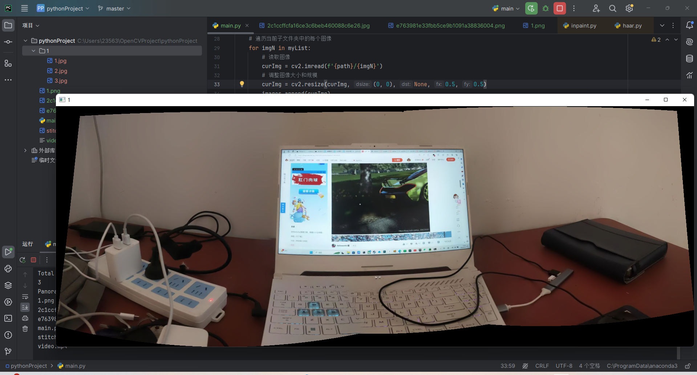
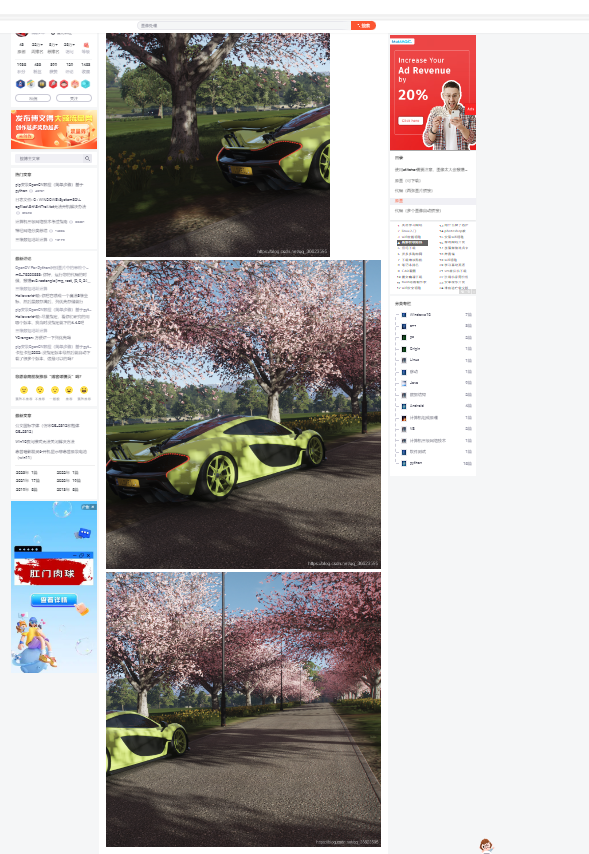

## 使用OpenCV进行全景拼接

```python
import cv2
import os


# 获取子文件夹列表
myFolders = os.listdir(None)
print(myFolders)  # 返回的是文件目录的列表

# 遍历每个子文件夹
for folder in myFolders:
    # 构造子文件夹路径
    path = ''
    print(folder)
    if os.path.isdir(folder) and not folder.endswith('.git') and not folder.endswith('.idea'):
        path = folder
        print('是文件夹')
    else:
        continue
    images = []

    # 获取当前子文件夹中的所有需要拼接的图像列表
    print(path)
    myList = os.listdir(path)
    print(myList)
    print(f'Total no of images detected {len(myList)}')

    # 遍历当前子文件夹中的每个图像
    for imgN in myList:
        # 读取图像
        curImg = cv2.imread(f'{path}/{imgN}')
        # 调整图像大小和规模
        curImg = cv2.resize(curImg, (0, 0), None, 0.5, 0.5)
        images.append(curImg)
    print(len(images))
    # 创建Stitcher对象
    stitcher = cv2.Stitcher.create()
    # 调用拼接方法
    (status, result) = stitcher.stitch(images)
    # 判断拼接状态
    if status == cv2.STITCHER_OK:
        print('Panorama Generated')
        # 显示拼接后的全景图像
        cv2.imshow(folder, result)
        cv2.waitKey(1)
    else:
        print('Panorama Generation Unsuccessful')

cv2.waitKey(0)
```

这段代码使用OpenCV库进行全景拼接。下面是一些注释解释它的功能：

1. 设置主文件夹路径 - `mainFolder`：这里指定了存放图像文件夹的主文件夹路径。
2. 获取子文件夹列表 - `myFolders`：使用`os.listdir`函数获取主文件夹中所有的子文件夹列表，并保存在`myFolders`变量中。
3. 遍历每个子文件夹 - `for folder in myFolders`：使用`for`循环遍历每个子文件夹。
4. 构造子文件夹路径 - `path`：使用当前子文件夹和主文件夹路径，构造子文件夹的完整路径。
5. 获取当前子文件夹中的图像列表 - `myList`：使用`os.listdir`函数获取当前子文件夹中所有图像文件的列表，并保存在`myList`变量中。
6. 遍历当前子文件夹中的每个图像 - `for imgN in myList`：使用`for`循环遍历当前子文件夹中的每个图像。
7. 读取图像 - `curImg = cv2.imread(f'{path}/{imgN}')`：使用`cv2.imread`函数读取当前图像的完整路径，并将其保存在`curImg`变量中。
8. 调整图像大小 - `curImg = cv2.resize(curImg, (0,0), None, 0.2, 0.2)`：使用`cv2.resize`函数将图像的大小调整为原始尺寸的 20%。
9. 创建Stitcher对象 - `stitcher = cv2.Stitcher.create()`：使用`cv2.Stitcher.create`函数创建一个`Stitcher`对象。
10. 调用拼接方法 - `(status, result) = stitcher.stitch(images)`：使用`stitcher`对象的`stitch`方法对图像列表进行拼接，并将结果保存在`result`变量中。
11. 判断拼接状态 - `if status == cv2.STITCHER_OK`：如果拼接成功，继续执行下面的代码；否则，输出拼接失败的消息。
12. 显示拼接后的全景图像 - `cv2.imshow(folder, result)`：使用`cv2.imshow`函数将拼接后的全景图像显示在一个窗口中。
13. 等待按键 - `cv2.waitKey(1)`：等待1毫秒，以允许显示窗口更新。
14. 重复以上步骤，直到所有子文件夹中的图像都被处理完毕。
15. 最后，等待按键 - `cv2.waitKey(0)`：在所有图像处理完毕后，等待按键以关闭

## Stitcher函数

`Stitcher`是OpenCV中用于图像拼接的类。它提供了一个简洁的接口，可以将多个图像拼接成一个全景图像。

`Stitcher`类主要包含以下几个方法：

1. `create()`：创建`Stitcher`对象。通过该方法可以实例化一个`Stitcher`对象，用于后续的拼接操作。

2. `stitch(images[, pano])`：拼接图像。该方法接受两个参数：
  
   - `images`：要拼接的图像列表。它是一个包含需要拼接的图像的列表。
   
   - `pano`：可选参数，用于存储拼接后的全景图像。如果提供了该参数，拼接后的全景图像将存储在该参数中。

   该方法返回一个元组 `(status, pano)`。其中，`status`表示拼接的状态，可以是以下值之一：

   - `cv2.Stitcher_OK`：拼接成功。
   - `cv2.Stitcher_ERR_NEED_MORE_IMGS`：需要更多的图像才能进行拼接。
   - `cv2.Stitcher_ERR_HOMOGRAPHY_EST_FAIL`：单应性估计失败。
   - `cv2.Stitcher_ERR_CAMERA_PARAMS_ADJUST_FAIL`：相机参数调整失败。
   
   `pano`参数用于存储拼接后的全景图像。如果拼接失败，`pano`将是一个空的`Mat`对象。

使用`Stitcher`进行图像拼接的一般步骤如下：

1. 创建`Stitcher`对象：使用 `stitcher = cv2.Stitcher.create()` 创建一个`Stitcher`对象。

2. 准备图像列表：将需要拼接的图像保存在一个列表中，例如 `images`。

3. 调用拼接方法：使用 `status, pano = stitcher.stitch(images)` 调用拼接方法，返回拼接的状态和拼接后的全景图像。

4. 处理拼接结果：根据拼接的状态进行相应的处理。如果拼接成功，可以显示或保存拼接后的全景图像；如果拼接失败，可以输出错误消息。


## 注意点

**使用stitcher需要注意，图像太大会报错而且计算慢**。

特点和适用范围：图像需有**足够重合**相同特征区域。

优点：适应部分倾斜/尺度变换和畸变情形，拼接效果好，使用简单，可以一次拼接多张图片。

缺点：需要有足够的相同特征区域进行匹配，速度较慢(和图像大小有关)。



一般需要包含边缘和主体部分的图片才能够正常拼接成功



