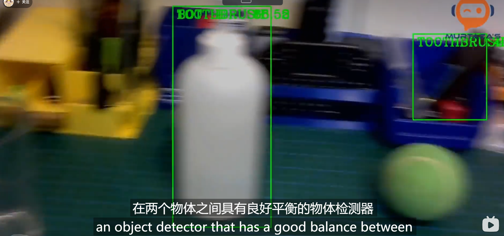

# 使用OpenCv进行对象检测



[Dataset之COCO数据集：COCO数据集的简介、下载、使用方法之详细攻略-CSDN博客](https://blog.csdn.net/qq_41185868/article/details/82939959)

[COCO数据集介绍-CSDN博客](https://blog.csdn.net/qq_44554428/article/details/122597358?utm_medium=distribute.pc_relevant.none-task-blog-2~default~baidujs_baidulandingword~default-0-122597358-blog-82939959.235^v43^pc_blog_bottom_relevance_base5&spm=1001.2101.3001.4242.1&utm_relevant_index=3)

## 初版

可以检测很多精度很高的东西，现在使用yolo，我们必须使用gpu，否则速度太慢，如果我们继续

```python
import cv2

# 设置对象检测的阈值,0.5的话是指百分之50
thres = 0.45

# 打开视频捕捉设备（摄像头）
cap = cv2.VideoCapture(1)  # 1 表示第二个摄像头（如果有多个摄像头）
cap.set(3, 1280)  # 设置宽度
cap.set(4, 720)   # 设置高度
cap.set(10, 70)   # 设置亮度

# 读取类别名称
classNames= []
classFile = 'coco.names'
with open(classFile, 'rt') as f:
    classNames = f.read().rstrip('\n').split('\n')

# 加载模型及配置
configPath = 'ssd_mobilenet_v3_large_coco_2020_01_14.pbtxt'
weightsPath = 'frozen_inference_graph.pb'
net = cv2.dnn_DetectionModel(weightsPath, configPath)
net.setInputSize(320, 320)  # 设置输入图像的尺寸
net.setInputScale(1.0/127.5)  # 设置输入图像的缩放比例
net.setInputMean((127.5, 127.5, 127.5))  # 设置输入图像的均值
net.setInputSwapRB(True)  # 交换输入图像的颜色通道（从BGR到RGB）

# 持续处理图像流
while True:
    # 从摄像头读取图像帧
    success, img = cap.read()

    # 使用模型进行对象检测
    classIds, confs, bbox = net.detect(img, confThreshold=thres) #0.5的话是指百分之50
    print(classIds, bbox)

    # 如果检测到对象
    if len(classIds) != 0:
        for classId, confidence, box in zip(classIds.flatten(), confs.flatten(), bbox):
            # 在图像上绘制矩形边界框
            cv2.rectangle(img, box, color=(0, 255, 0), thickness=2)
            
            # 在图像上绘制类别标签和置信度
            cv2.putText(img, classNames[classId-1].upper(),
                        (box[0]+10, box[1]+30), cv2.FONT_HERSHEY_COMPLEX, 1, (0, 255, 0), 2)
            cv2.putText(img, str(round(confidence*100, 2)),
                        (box[0]+200, box[1]+30), cv2.FONT_HERSHEY_COMPLEX, 1, (0, 255, 0), 2)

    # 显示结果图像
    cv2.imshow("Output", img)
    cv2.waitKey(1)
```

这段代码使用预训练的模型进行实时对象检测，将检测结果绘制在图像上并实时显示。

### dnn_DetectionModel

DNN 深度神经网络

当使用 `cv2.dnn_DetectionModel` 类创建对象检测模型时，我们可以使用该模型来进行对象检测。下面是详细的用法说明：

1. 首先，需要导入 `cv2`：
```python
import cv2
```

2. 创建对象检测模型：

```python
net = cv2.dnn_DetectionModel(weightsPath, configPath)
```
在这行代码中，`weightsPath` 是指预训练模型的权重文件的路径，`configPath` 是指模型的配置文件的路径。

3. 设置模型的输入参数：
```python
net.setInputSize(320, 320)  # 设置输入图像的尺寸
net.setInputScale(1.0/127.5)  # 设置输入图像的缩放比例
net.setInputMean((127.5, 127.5, 127.5))  # 设置输入图像的均值
net.setInputSwapRB(True)  # 交换输入图像的颜色通道（从BGR到RGB）
```
这些方法用于设置模型的输入参数。可以根据实际需求调整这些参数。例如，`setInputSize()` 设置输入图像的尺寸，`setInputScale()` 设置输入图像的缩放比例，`setInputMean()` 设置输入图像的均值，`setInputSwapRB()` 设置是否交换输入图像的颜色通道。

4. 使用模型进行对象检测：
```python
classIds, confs, bbox = net.detect(img, confThreshold=thres)
```
`detect()` 方法用于在图像上进行对象检测。它接受图像作为输入，并返回检测到的对象类别标签、置信度以及边界框坐标。

`img` 是要进行对象检测的图像。

`confThreshold` 是用于过滤掉低置信度检测结果的阈值。可以根据实际需求调整该阈值。

5. 处理检测结果：
```python
for classId, confidence, box in zip(classIds.flatten(), confs.flatten(), bbox):
    # 处理每个检测到的对象
    # 例如，可以绘制边界框、标签等
```
可以使用循环遍历每个检测到的对象。例如，可以根据需要使用 `cv2.rectangle()` 绘制边界框，使用 `cv2.putText()` 绘制标签和置信度等。

6. 显示结果：
```python
cv2.imshow("Output", img)
cv2.waitKey(1)
```
使用 `cv2.imshow()` 方法显示处理后的图像。`cv2.waitKey()` 用于等待键盘输入，从而保持图像的显示。可以根据需要调整参数。

以上是使用 `cv2.dnn_DetectionModel` 类进行对象检测的一般用法。需要根据自己的需求进行相应的调整和处理。希望以上解释能够帮助您理解对象检测的用法。如果还有其他问题，请随时提问。

### zip()

这行代码使用了 `zip()` 函数将 `classIds`、`confs` 和 `bbox` 三个数组进行打包，然后通过迭代解压缩的方式分别将每个数组中的元素赋值给 `classId`、`confidence` 和 `box`。

- `classIds` 是一个一维数组，包含了每个检测到的对象的类别标签。
- `confs` 是一个一维数组，包含了每个检测到的对象的置信度。
- `bbox` 是一个二维数组，每行包含了每个检测到的对象的边界框坐标（左上角和右下角坐标）。

通过使用 `zip()` 函数将这三个数组打包在一起，并使用 `for` 循环进行迭代，我们可以方便地对每个检测到的对象进行处理。

例如，可以将 `classId` 作为对象的类别标签，`confidence` 作为对象的置信度，`box` 作为对象的边界框坐标，来进行后续的操作，例如绘制边界框、标签等。

### flatten()

`flatten()` 是用于将多维数组（例如二维数组）转换为一维数组的方法。

在上述代码中，`classIds.flatten()` 和 `confs.flatten()` 是将 `classIds` 和 `confs` 两个数组转换为一维数组的操作。

`classIds` 和 `confs` 都是数组，其中 `classIds` 用于存储每个检测到的对象的类别标签，`confs` 用于存储每个对象的置信度。

通过调用 `flatten()` 方法，我们可以将这些数组重新构造为一维的形式，便于进行后续的操作，例如使用 `zip()` 函数进行迭代、或者进行其他一维数组操作。

希望这个解释对您有所帮助。如果还有其他问题，请随时提问。

## 改进版（使用NMS技术）

[NMS（non_max_suppression） - 知乎 (zhihu.com)](https://zhuanlan.zhihu.com/p/141719585)

去除检测物体的重叠部分以至于更好地去检测物体


好的！以下是带有中文注释的代码：

```python
import cv2
import numpy as np

# 设置检测目标的阈值
thres = 0.45
# 设置非极大值抑制(NMS)的阈值以去除重叠的检测结果
nms_threshold = 0.2

# 打开视频捕捉设备
cap = cv2.VideoCapture(0, cv2.CAP_DSHOW)

# 从coco.names文件中读取类别名称
classNames = []
classFile = './Object_Detection_Files/coco.names'
with open(classFile, 'rt') as f:
    classNames = f.read().rstrip('\n').split('\n')
    print(classNames)

# 从文件中加载预训练模型
configPath = './Object_Detection_Files/ssd_mobilenet_v3_large_coco_2020_01_14.pbtxt'
weightsPath = './Object_Detection_Files/frozen_inference_graph.pb'
net = cv2.dnn_DetectionModel(weightsPath, configPath)
net.setInputSize(320, 320)
net.setInputScale(1.0/127.5)
net.setInputMean((127.5, 127.5, 127.5))
net.setInputSwapRB(True)

while True:
    # 读取视频帧
    success, img = cap.read()

    # 对当前帧进行目标检测
    classIds, confs, bbox = net.detect(img, confThreshold=thres)

    # 将边界框和置信度数组转换为列表形式
    bbox = list(bbox)
    confs = list(np.array(confs).reshape(1,-1)[0])
    confs = list(map(float, confs))

    # 使用非极大值抑制(NMS)去除重叠的检测结果
    indices = cv2.dnn.NMSBoxes(bbox, confs, thres, nms_threshold)
    print(indices)

    for i in indices:
        # 获取边界框坐标和类别标签索引
        box = bbox[i]
        x, y, w, h = box[0], box[1], box[2], box[3]
        
        # 在检测到的物体周围画一个矩形框
        cv2.rectangle(img, (x, y), (x+w, y+h), color=(0, 255, 0), thickness=2)
        
        # 在边界框上方添加类别标签
        cv2.putText(img, classNames[classIds[i]-1].upper(), (box[0]+10, box[1]+30),
                    cv2.FONT_HERSHEY_COMPLEX, 1, (0, 255, 0), 2)

    # 显示带有检测结果的图像
    cv2.imshow("Output", img)
    cv2.waitKey(1)
```

`cv2.dnn.NMSBoxes(bbox, confs, thres, nms_threshold)` 是 OpenCV 中的一个函数，用于执行非极大值抑制（Non-Maximum Suppression，简称NMS）。NMS 主要用于去除物体检测任务中的重叠框，保留最准确的检测结果。

函数的参数如下：

- `bbox`：一个包含边界框坐标的列表或NumPy数组。每个边界框表示一个检测到的物体，并保存为 `[x, y, w, h]` 的形式，其中 `(x, y)` 是左上角的坐标，`w` 是边界框的宽度，`h` 是边界框的高度。
- `confs`：一个包含检测结果置信度的列表或NumPy数组。每个置信度对应一个边界框，可以理解为预测物体的概率。
- `thres`：一个阈值，用于过滤置信度低于阈值的检测结果。默认为0，表示不进行过滤，保留所有检测结果。
- `nms_threshold`：一个非极大值抑制的阈值。当两个边界框的重叠程度（Intersection over Union，简称IOU）高于阈值时，较低置信度的边界框将被抑制掉，只保留一个边界框。阈值越大，抑制的边界框越多。默认值是0.4。

函数的返回值是一个索引列表，表示保留下来的边界框的索引。可以使用这些索引来选择保留的检测结果，并对它们进行后续的处理和显示。

非极大值抑制是一种常用的处理方法，用于在物体检测任务中去除冗余的检测结果，提供更准确和简洁的结果。希望上述解释能帮助你理解这个函数的作用和用法。