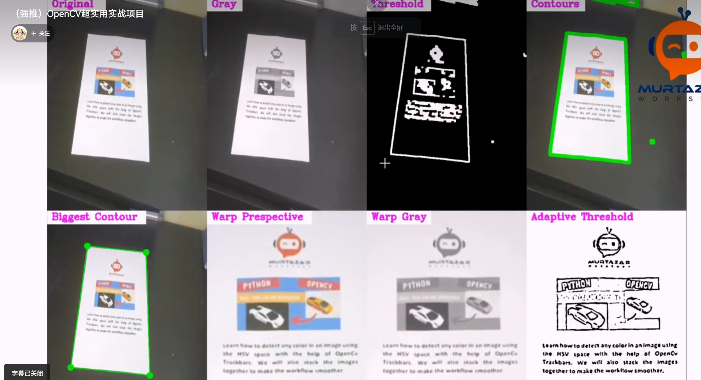
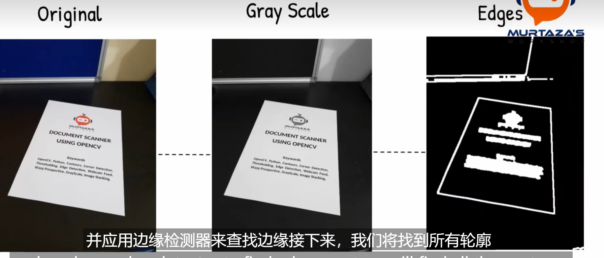
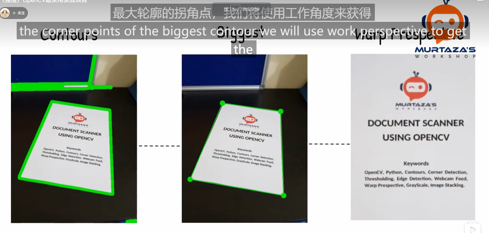
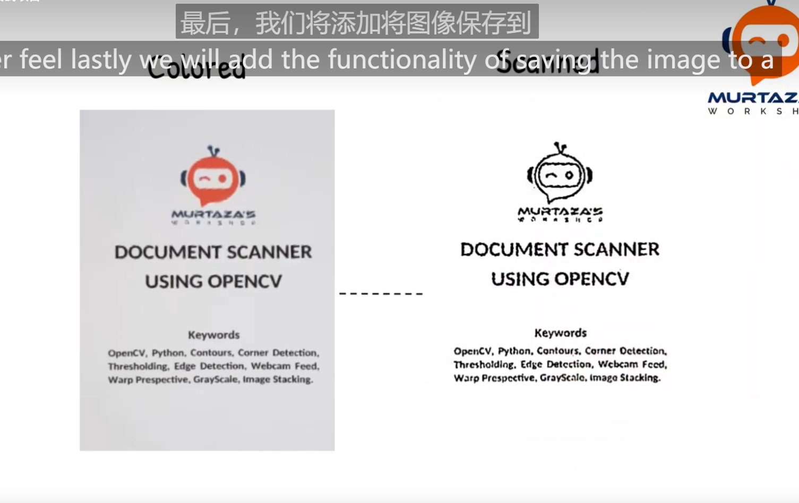
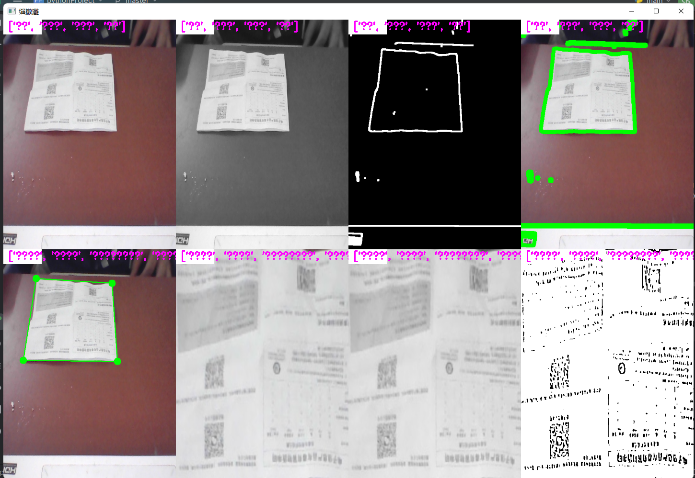

## 文件扫描









main.py

```python
# 导入必要的库
import cv2
import numpy as np
import utlis  # 请确保utlis文件已存在
 
# 设定程序参数
webCamFeed = True  # 是否使用摄像头输入
pathImage = "1.jpg"  # 图片文件的路径
cap = cv2.VideoCapture(0)  # 从摄像头捕获视频
cap.set(10, 160)  # 设置视频捕获参数
heightImg = 640  # 图片高度
widthImg = 480  # 图片宽度
 
# 进行轨迹条初始化
utlis.initializeTrackbars()
count = 0  # 初始化计数器
 
# 进入循环，处理图像
while True:
 
    # 根据webCamFeed参数决定获取图像的方式
    if webCamFeed:
        success, img = cap.read()  # 从摄像头获取图像
    else:
        img = cv2.imread(pathImage)  # 从文件读取图像
    img = cv2.resize(img, (widthImg, heightImg))  # 调整图像大小
    imgBlank = np.zeros((heightImg, widthImg, 3), np.uint8)  # 创建空白图像，用于调试
    imgGray = cv2.cvtColor(img, cv2.COLOR_BGR2GRAY)  # 将图像转换为灰度图
    imgBlur = cv2.GaussianBlur(imgGray, (5, 5), 1)  # 对灰度图应用高斯模糊
    thres = utlis.valTrackbars()  # 获取轨迹条的阈值
 
    # 对图像应用Canny边缘检测
    imgThreshold = cv2.Canny(imgBlur, thres[0], thres[1])
    kernel = np.ones((5, 5))
    imgDial = cv2.dilate(imgThreshold, kernel, iterations=2)  # 对图像进行膨胀操作
    imgThreshold = cv2.erode(imgDial, kernel, iterations=1)  # 对图像进行腐蚀操作
 
    # 寻找所有轮廓
    imgContours = img.copy()  # 复制图像用于显示轮廓
    imgBigContour = img.copy()  # 复制图像用于显示最大轮廓
    contours, hierarchy = cv2.findContours(imgThreshold, cv2.RETR_EXTERNAL, cv2.CHAIN_APPROX_SIMPLE)  # 寻找所有轮廓
    cv2.drawContours(imgContours, contours, -1, (0, 255, 0), 10)  # 绘制所有检测到的轮廓

    # 寻找最大的轮廓
    biggest, maxArea = utlis.biggestContour(contours)  # 寻找最大的轮廓
    if biggest.size != 0:
        biggest = utlis.reorder(biggest)
        cv2.drawContours(imgBigContour, biggest, -1, (0, 255, 0), 20)  # 绘制最大轮廓
        imgBigContour = utlis.drawRectangle(imgBigContour, biggest, 2)  # 绘制边界矩形
        pts1 = np.float32(biggest)  # 准备透视变换的点
        pts2 = np.float32([[0, 0], [widthImg, 0], [0, heightImg], [widthImg, heightImg]])  # 准备透视变换的目标点
        matrix = cv2.getPerspectiveTransform(pts1, pts2)  # 获取透视变换矩阵
        imgWarpColored = cv2.warpPerspective(img, matrix, (widthImg, heightImg))  # 进行透视变换

        # 从四个方向各去掉20像素
        imgWarpColored = imgWarpColored[20:imgWarpColored.shape[0] - 20, 20:imgWarpColored.shape[1] - 20]
        imgWarpColored = cv2.resize(imgWarpColored, (widthImg, heightImg))  # 调整透视变换后的图像大小

        # 应用自适应阈值处理
        imgWarpGray = cv2.cvtColor(imgWarpColored, cv2.COLOR_BGR2GRAY)
        imgAdaptiveThre = cv2.adaptiveThreshold(imgWarpGray, 255, 1, 1, 7, 2)
        imgAdaptiveThre = cv2.bitwise_not(imgAdaptiveThre)
        imgAdaptiveThre = cv2.medianBlur(imgAdaptiveThre, 3)
 
        # 用于显示的图像数组
        imageArray = ([img, imgGray, imgThreshold, imgContours],
                      [imgBigContour, imgWarpColored, imgWarpGray, imgAdaptiveThre])
 
    else:
        imageArray = ([img, imgGray, imgThreshold, imgContours],
                      [imgBlank, imgBlank, imgBlank, imgBlank])
 
    # 显示标签
    labels = [["原图", "灰度图", "阈值图", "轮廓"],
              ["最大轮廓", "透视变换", "透视变换后灰度图", "自适应阈值处理"]]
 
    # 合并图像并显示
    stackedImage = utlis.stackImages(imageArray, 0.75, labels)
    cv2.imshow("结果", stackedImage)
 
    # 当按下's'键时保存图像
    if cv2.waitKey(1) & 0xFF == ord('s'):
        cv2.imwrite("扫描结果/myImage" + str(count) + ".jpg", imgWarpColored)  # 保存透视变换后的图像
        cv2.rectangle(stackedImage, ((int(stackedImage.shape[1] / 2) - 230), int(stackedImage.shape[0] / 2) + 50),
                      (1100, 350), (0, 255, 0), cv2.FILLED)  # 在结果图像上绘制矩形框
        cv2.putText(stackedImage, "扫描已保存", (int(stackedImage.shape[1] / 2) - 200, int(stackedImage.shape[0] / 2)),
                    cv2.FONT_HERSHEY_DUPLEX, 3, (0, 0, 255), 5, cv2.LINE_AA)  # 在结果图像上添加文本标签
        cv2.imshow('结果', stackedImage)  # 显示带有保存提示的结果图像
        cv2.waitKey(300)  # 等待300毫秒
        count += 1  # 更新计数器
```

utlis.py

下面是 `utlis.py` 文件的注释：

```python
import cv2
import numpy as np

## TO STACK ALL THE IMAGES IN ONE WINDOW
def stackImages(imgArray,scale,lables=[]):
    """
    将图像堆叠在一个窗口显示
    :param imgArray: 图像列表
    :param scale: 缩放因子
    :param lables: 图像标签列表
    :return: 堆叠后的图像
    """
    rows = len(imgArray)
    cols = len(imgArray[0])
    rowsAvailable = isinstance(imgArray[0], list)
    width = imgArray[0][0].shape[1]
    height = imgArray[0][0].shape[0]
    if rowsAvailable:
        for x in range ( 0, rows):
            for y in range(0, cols):
                imgArray[x][y] = cv2.resize(imgArray[x][y], (0, 0), None, scale, scale)
                if len(imgArray[x][y].shape) == 2: imgArray[x][y]= cv2.cvtColor( imgArray[x][y], cv2.COLOR_GRAY2BGR)
        imageBlank = np.zeros((height, width, 3), np.uint8)
        hor = [imageBlank]*rows
        hor_con = [imageBlank]*rows
        for x in range(0, rows):
            hor[x] = np.hstack(imgArray[x])
            hor_con[x] = np.concatenate(imgArray[x])
        ver = np.vstack(hor)
        ver_con = np.concatenate(hor)
    else:
        for x in range(0, rows):
            imgArray[x] = cv2.resize(imgArray[x], (0, 0), None, scale, scale)
            if len(imgArray[x].shape) == 2: imgArray[x] = cv2.cvtColor(imgArray[x], cv2.COLOR_GRAY2BGR)
        hor= np.hstack(imgArray)
        hor_con= np.concatenate(imgArray)
        ver = hor
    if len(lables) != 0:
        eachImgWidth= int(ver.shape[1] / cols)
        eachImgHeight = int(ver.shape[0] / rows)
        print(eachImgHeight)
        for d in range(0, rows):
            for c in range (0,cols):
                cv2.rectangle(ver,(c*eachImgWidth,eachImgHeight*d),(c*eachImgWidth+len(lables[d])*13+27,30+eachImgHeight*d),(255,255,255),cv2.FILLED)
                cv2.putText(ver,lables[d],(eachImgWidth*c+10,eachImgHeight*d+20),cv2.FONT_HERSHEY_COMPLEX,0.7,(255,0,255),2)
    return ver

def reorder(myPoints):
    """
    对四个点的顺序重新排序
    :param myPoints: 输入的点坐标
    :return: 重新排序后的点坐标
    """
    myPoints = myPoints.reshape((4, 2))
    myPointsNew = np.zeros((4, 1, 2), dtype=np.int32)
    add = myPoints.sum(1)

    myPointsNew[0] = myPoints[np.argmin(add)]
    myPointsNew[3] =myPoints[np.argmax(add)]
    diff = np.diff(myPoints, axis=1)
    myPointsNew[1] =myPoints[np.argmin(diff)]
    myPointsNew[2] = myPoints[np.argmax(diff)]

    return myPointsNew


def biggestContour(contours):
    """
    找到最大的轮廓
    :param contours: 轮廓列表
    :return: 最大的轮廓以及其对应的面积
    """
    biggest = np.array([])
    max_area = 0
    for i in contours:
        area = cv2.contourArea(i)
        if area > 5000:
            peri = cv2.arcLength(i, True)
            approx = cv2.approxPolyDP(i, 0.02 * peri, True)
            if area > max_area and len(approx) == 4:
                biggest = approx
                max_area = area
    return biggest,max_area

def drawRectangle(img,biggest,thickness):
    """
    在图像上绘制矩形框
    :param img: 输入图像
    :param biggest: 四个点的坐标
    :param thickness: 线条粗细
    :return: 绘制了矩形框的图像
    """
    cv2.line(img, (biggest[0][0][0], biggest[0][0][1]), (biggest[1][0][0], biggest[1][0][1]), (0, 255, 0), thickness)
    cv2.line(img, (biggest[0][0][0], biggest[0][0][1]), (biggest[2][0][0], biggest[2][0][1]), (0, 255, 0), thickness)
    cv2.line(img, (biggest[3][0][0], biggest[3][0][1]), (biggest[2][0][0], biggest[2][0][1]), (0, 255, 0), thickness)
    cv2.line(img, (biggest[3][0][0], biggest[3][0][1]), (biggest[1][0][0], biggest[1][0][1]), (0, 255, 0), thickness)

    return img

def nothing(x):
    pass

def initializeTrackbars(intialTracbarVals=0):
    """
    初始化调试滑块
    :param intialTracbarVals: 初始滑块值
    """
    cv2.namedWindow("Trackbars")
    cv2.resizeWindow("Trackbars", 360, 240)
    cv2.createTrackbar("Threshold1", "Trackbars", 200,255, nothing)
    cv2.createTrackbar("Threshold2", "Trackbars", 200, 255, nothing)


def valTrackbars():
    """
    获取滑块当前值
    :return: 滑块的阈值
    """
    Threshold1 = cv2.getTrackbarPos("Threshold1", "Trackbars")
    Threshold2 = cv2.getTrackbarPos("Threshold2", "Trackbars")
    src = Threshold1,Threshold2
    return src
```

这个 `utlis.py` 文件定义了一些用于图像处理的函数，并提供了一些实用的工具函数。这些函数包括将图像堆叠在一个窗口显示、重新排序四个点的顺序、找到最大的轮廓、在图像上绘制矩形框等。

