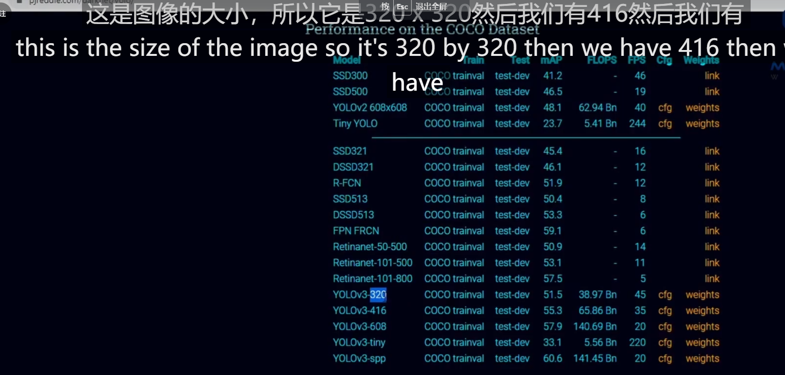
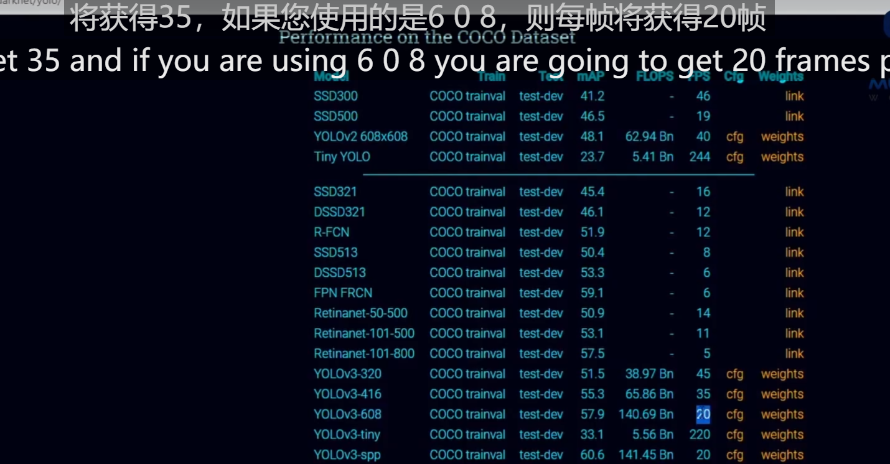

## YOLOv3

[YOLO: Real-Time Object Detection (pjreddie.com)](https://pjreddie.com/darknet/yolo/)





下载cfg，weight两个模型文件引用

```python
import cv2 as cv
import numpy as np

# 打开摄像头
cap = cv.VideoCapture(0)
# 设置输入图像的宽度和高度
whT = 320
# 设置置信度阈值
confThreshold = 0.5
# 设置非最大值抑制(NMS)的阈值
nmsThreshold= 0.2

#### 载入模型
## Coco类别名称
classesFile = "coco.names"
classNames = []
with open(classesFile, 'rt') as f:
    classNames = f.read().rstrip('\n').split('\n')
print(classNames)

## 模型文件
modelConfiguration = "yolov3.cfg"
modelWeights = "yolov3.weights"
net = cv.dnn.readNetFromDarknet(modelConfiguration, modelWeights)
net.setPreferableBackend(cv.dnn.DNN_BACKEND_OPENCV)
net.setPreferableTarget(cv.dnn.DNN_TARGET_CPU)

def findObjects(outputs,img):
    # 获取图像的高度、宽度和通道数
    hT, wT, cT = img.shape
    bbox = []
    classIds = []
    confs = []
    for output in outputs:
        for det in output:
            scores = det[5:]
            # 获取预测框内置信度最高的类别索引
            classId = np.argmax(scores)
            # 获取该类别的置信度
            confidence = scores[classId]
            if confidence > confThreshold:
                # 计算预测框的宽度和高度
                w, h = int(det[2]*wT), int(det[3]*hT)
                # 计算预测框左上角的坐标
                x, y = int((det[0]*wT)-w/2), int((det[1]*hT)-h/2)
                bbox.append([x, y, w, h])
                classIds.append(classId)
                confs.append(float(confidence))

    # 对预测框应用非最大值抑制
    indices = cv.dnn.NMSBoxes(bbox, confs, confThreshold, nmsThreshold)

    for i in indices:
        box = bbox[i]
        x, y, w, h = box[0], box[1], box[2], box[3]
        # 在图像上绘制预测框
        cv.rectangle(img, (x, y), (x+w, y+h), (255, 0 , 255), 2)
        # 在图像上标注类别和置信度
        cv.putText(img, f'{classNames[classIds[i]].upper()} {int(confs[i]*100)}%',
                  (x, y-10), cv.FONT_HERSHEY_SIMPLEX, 0.6, (255, 0, 255), 2)


while True:
    # 从摄像头中读取图像
    success, img = cap.read()

    # 将图像转换成网络对应的输入blob
    blob = cv.dnn.blobFromImage(img, 1 / 255, (whT, whT), [0, 0, 0], 1, crop=False)
    net.setInput(blob)

    # 获取网络的各层名称
    layersNames = net.getLayerNames()
    # 获取输出层的名称
    outputNames = [(layersNames[i - 1]) for i in net.getUnconnectedOutLayers()]
    # 前向传播得到输出
    outputs = net.forward(outputNames)
    # 在图像上找出目标并标注
    findObjects(outputs, img)

    # 显示图像
    cv.imshow('Image', img)
    cv.waitKey(1)
```

```python
modelConfiguration = "yolov3-320.cfg"
modelWeights = "yolov3-320.weights"
net = cv.dnn.readNetFromDarknet(modelConfiguration, modelWeights)
net.setPreferableBackend(cv.dnn.DNN_BACKEND_OPENCV)
net.setPreferableTarget(cv.dnn.DNN_TARGET_CPU)
```

这段代码是读取并配置使用Darknet模型的操作。具体来说，它使用`cv.dnn.readNetFromDarknet()`函数读取了Darknet模型的配置文件和权重文件。然后，通过`net.setPreferableBackend()`函数将后端设置为OpenCV，使用OpenCV的dnn模块进行推理。接下来，通过`net.setPreferableTarget()`函数将目标设置为CPU，在CPU上执行推理。这样配置可以在使用Darknet模型进行目标检测时使用CPU进行推理。

Darknet 是一个开源的深度学习框架，由 Joseph Redmon 开发。Darknet 是一个用 C 和 CUDA 编写的高度定制化的神经网络库，它被广泛用于目标检测、图像分类和图像生成等任务。

Darknet 框架对于目标检测而言非常著名，尤其是在YOLO（You Only Look Once）系列算法的应用上。YOLO 算法是一种实时目标检测算法，其主要特点是可以在单个前向传递中同时检测多个对象。

在Darknet中，你可以使用不同的配置文件和权重文件来加载预训练的模型。配置文件（通常是以.cfg为后缀）定义了神经网络的结构，而权重文件（通常是以.weights为后缀）存储了已经训练好的模型参数。

通过使用Darknet，你可以在计算机视觉领域进行目标检测、图像分类等任务。同时，Darknet也支持在 GPU 上进行神经网络的加速运算，以提高性能。

