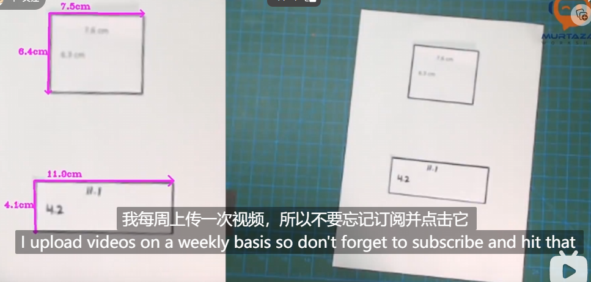

## 实时物体尺寸测量



main.py

```python
import cv2
import utlis

###################################
webcam = True  # 如果为True，则使用摄像头进行实时物体测量；如果为False，则使用静态图像进行测量
path = '1.jpg'  # 静态图像的路径
cap = cv2.VideoCapture(0)  # 使用第一个摄像头
cap.set(10, 160)  # 设置亮度为160
cap.set(3, 1920)  # 设置视频宽度为1920
cap.set(4, 1080)  # 设置视频高度为1080
scale = 3  # 缩放比例
wP = 210 * scale  # 期望输出图像宽度
hP = 297 * scale  # 期望输出图像高度
###################################

while True:
    if webcam:
        success, img = cap.read()  # 从摄像头读取一帧图像
    else:
        img = cv2.imread(path)  # 从静态图像文件加载图像

    # 获取图像中的轮廓
    imgContours, conts = utlis.getContours(img, minArea=50000, filter=4)

    if len(conts) != 0:
        biggest = conts[0][2]  # 获取最大的轮廓
        imgWarp = utlis.warpImg(img, biggest, wP, hP)  # 透视变换，将图像对齐到指定大小
        imgContours2, conts2 = utlis.getContours(imgWarp, minArea=2000, filter=4, cThr=[50, 50], draw=False)

        if len(conts2) != 0:
            for obj in conts2:
                cv2.polylines(imgContours2, [obj[2]], True, (0, 255, 0), 2)  # 绘制轮廓
                nPoints = utlis.reorder(obj[2])  # 对轮廓点进行重新排序
                nW = round((utlis.findDis(nPoints[0][0] // scale, nPoints[1][0] // scale) / 10), 1)  # 计算宽度（厘米）
                nH = round((utlis.findDis(nPoints[0][0] // scale, nPoints[2][0] // scale) / 10), 1)  # 计算高度（厘米）
                cv2.arrowedLine(imgContours2, (nPoints[0][0][0], nPoints[0][0][1]), (nPoints[1][0][0], nPoints[1][0][1]),
                                (255, 0, 255), 3, 8, 0, 0.05)  # 绘制箭头线表示宽度
                cv2.arrowedLine(imgContours2, (nPoints[0][0][0], nPoints[0][0][1]), (nPoints[2][0][0], nPoints[2][0][1]),
                                (255, 0, 255), 3, 8, 0, 0.05)  # 绘制箭头线表示高度
                x, y, w, h = obj[3]
                cv2.putText(imgContours2, '{}cm'.format(nW), (x + 30, y - 10), cv2.FONT_HERSHEY_COMPLEX_SMALL, 1.5,
                            (255, 0, 255), 2)  # 在图像上显示宽度
                cv2.putText(imgContours2, '{}cm'.format(nH), (x - 70, y + h // 2), cv2.FONT_HERSHEY_COMPLEX_SMALL, 1.5,
                            (255, 0, 255), 2)  # 在图像上显示高度

        cv2.imshow('A4', imgContours2)  # 显示处理后的图像

    img = cv2.resize(img, (0, 0), None, 0.5, 0.5)  # 缩小原始图像
    cv2.imshow('Original', img)  # 显示原始图像
    cv2.waitKey(1)  # 等待按键退出循环
```

utlis.py

```python
import cv2
import numpy as np

def getContours(img, cThr=[100,100], showCanny=False, minArea=1000, filter=0, draw=False):
    # 将图像转换为灰度图像
    imgGray = cv2.cvtColor(img, cv2.COLOR_BGR2GRAY)
    # 对图像应用高斯模糊
    imgBlur = cv2.GaussianBlur(imgGray, (5,5), 1)
    # 应用Canny边缘检测
    imgCanny = cv2.Canny(imgBlur, cThr[0], cThr[1])
    # 创建一个5x5的内核
    kernel = np.ones((5,5))
    # 膨胀图像
    imgDial = cv2.dilate(imgCanny, kernel, iterations=3)
    # 腐蚀图像
    imgThre = cv2.erode(imgDial, kernel, iterations=2)
    if showCanny:
        cv2.imshow('Canny', imgThre)
    # 寻找轮廓
    contours, hierarchy = cv2.findContours(imgThre, cv2.RETR_EXTERNAL, cv2.CHAIN_APPROX_SIMPLE)
    finalCountours = []
    for i in contours:
        area = cv2.contourArea(i)
        if area > minArea:
            peri = cv2.arcLength(i, True)
            # 近似轮廓
            approx = cv2.approxPolyDP(i, 0.02*peri, True)
            bbox = cv2.boundingRect(approx)
            if filter > 0:
                if len(approx) == filter:
                    finalCountours.append([len(approx), area, approx, bbox, i])
            else:
                finalCountours.append([len(approx), area, approx, bbox, i])
    # 根据面积对轮廓进行排序
    finalCountours = sorted(finalCountours, key=lambda x: x[1], reverse=True)
    if draw:
        for con in finalCountours:
            cv2.drawContours(img, con[4], -1, (0,0,255), 3)
    return img, finalCountours

def reorder(myPoints):
    myPointsNew = np.zeros_like(myPoints)
    myPoints = myPoints.reshape((4,2))
    add = myPoints.sum(1)
    # 找到图像的最左边和最右边的点
    myPointsNew[0] = myPoints[np.argmin(add)]
    myPointsNew[3] = myPoints[np.argmax(add)]
    diff = np.diff(myPoints, axis=1)
    # 找到图像的最上边和最下边的点
    myPointsNew[1] = myPoints[np.argmin(diff)]
    myPointsNew[2] = myPoints[np.argmax(diff)]
    return myPointsNew

def warpImg(img, points, w, h, pad=20):
    points = reorder(points)
    pts1 = np.float32(points)
    pts2 = np.float32([[0,0],[w,0],[0,h],[w,h]])
    # 获取透视变换矩阵
    matrix = cv2.getPerspectiveTransform(pts1, pts2)
    # 应用透视变换
    imgWarp = cv2.warpPerspective(img, matrix, (w, h))
    # 裁剪图像
    imgWarp = imgWarp[pad:imgWarp.shape[0]-pad, pad:imgWarp.shape[1]-pad]
    return imgWarp

def findDis(pts1, pts2):
    # 计算两点之间的距离
    return ((pts2[0] - pts1[0]) ** 2 + (pts2[1] - pts1[1]) ** 2) ** 0.5
```

`round()` 是Python内置函数，它用于将浮点数四舍五入为最接近的整数或指定的小数位数。

`round()` 函数的语法如下：
```
round(number [, ndigits])
```
其中，`number` 是要四舍五入的浮点数，`ndigits` 是可选的，表示要保留的小数位数。如果省略 `ndigits` 参数，则 `round()` 函数会返回最接近的整数。

下面是一些示例：
```python
num1 = 3.14159
num2 = 2.71828

rounded1 = round(num1)  # 四舍五入为整数
rounded2 = round(num2, 2)  # 保留两位小数

print(rounded1)  # 输出: 3
print(rounded2)  # 输出: 2.72
```

