# 图像滤波

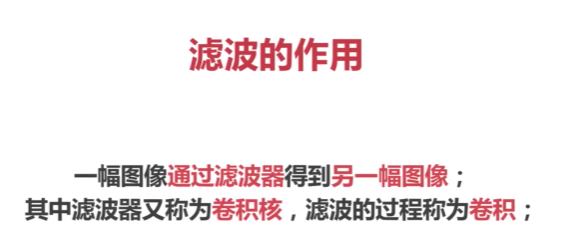

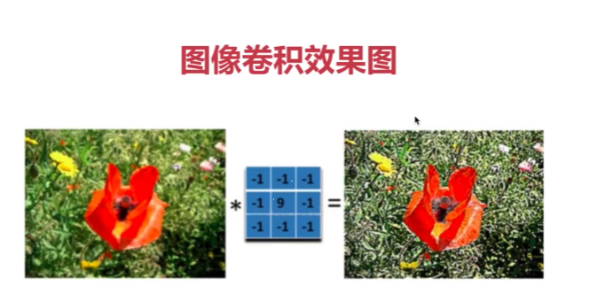

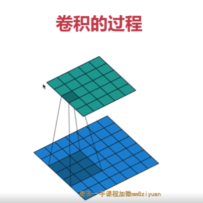

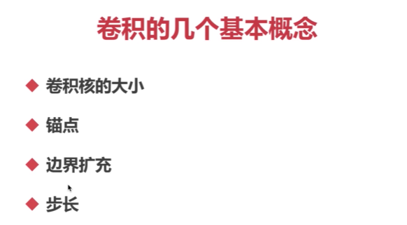

## 卷积核的大小

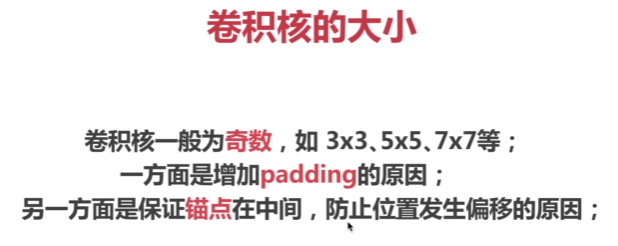

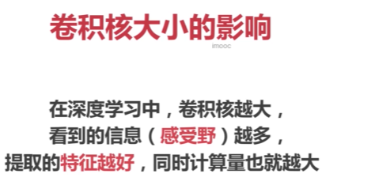

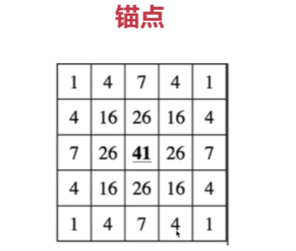


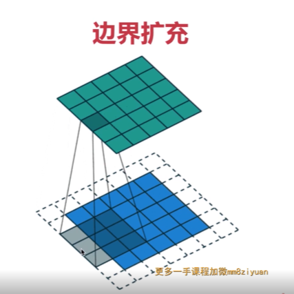

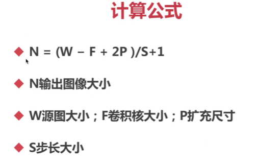

## 实战图像卷积

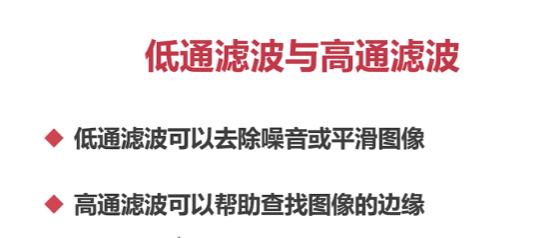

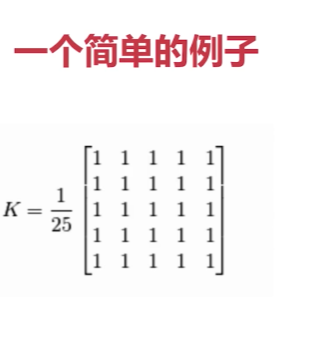

在数字图像处理中，卷积操作是一种常用的图像增强方法，可以用于平滑、锐化、边缘检测等图像处理任务。在OpenCV中，可以使用`filter2D`函数实现图像卷积操作。

函数的基本语法如下：

```python
dst = cv2.filter2D(src, ddepth, kernel[, anchor[, delta[, borderType]]])
```

参数含义如下：
- `src`：输入的图像。
- `ddepth`：输出图像的深度（即数据类型）。通常与输入图像保持一致，例如`-1`表示与输入图像类型相同。
- `kernel`：卷积核。可以使用`NumPy`数组或`cv2.getGaussianKernel`等函数生成。
- `anchor`：可选参数，指定卷积核的中心位置。默认值为`(-1, -1)`，表示将卷积核的中心设置为中心像素点。
- `delta`：可选参数，用于调整输出图像的偏移量。默认值为`0`，表示偏移量为`0`。
- `borderType`：可选参数，用于指定边界填充模式。默认值为`cv2.BORDER_DEFAULT`。

函数返回应用卷积核后的输出图像`dst`。

卷积核`kernel`是一个MxN的矩阵，其中每个元素存储了卷积操作的权重。卷积操作可以看作是将卷积核在图像上移动，并计算卷积核与图像像素值的加权和，然后将结果存储在输出图像相应位置。图像卷积操作可以用于平滑图像、锐化图像、检测边缘等任务。

下面是一个简单的示例代码，展示如何使用`filter2D`函数进行图像平滑操作：

```python
import cv2
import numpy as np

# 读取输入图像
img = cv2.imread('image.jpg')

# 创建5x5的平均值卷积核
kernel = np.ones((5, 5), np.float32) / 25

# 应用卷积操作
res = cv2.filter2D(img, -1, kernel)

# 显示原始图像和平滑处理结果
cv2.imshow("Original Image", img)
cv2.imshow("Smooth Image", res)
cv2.waitKey(0)
cv2.destroyAllWindows()
```

在这个示例中，我们读取了原始图像`img`，然后创建了一个5x5的平均值卷积核`kernel`。接着，使用`filter2D`函数对图像`img`应用卷积核`kernel`，得到平滑后的图像`res`。最后，将原始图像和平滑后的图像进行显示。

您可以根据需要选择不同的卷积核来实现不同的图像处理任务，例如使用Sobel算子进行边缘检测，或使用Laplacian算子进行图像增强。请注意，在实际应用中，我们通常会对图像进行边界填充（即使用`borderType`参数）来避免边界降采样引起的信息损失问题。

## 方盒滤波与均值滤波

### 方盒滤波卷积核

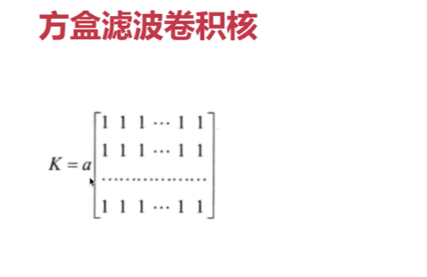

在方盒滤波卷积核中，参数 `a` 用于控制滤波卷积核是否进行归一化处理。

当 `normalize` 设置为 `true` 时，滤波卷积核进行归一化处理，参数 `a` 的取值为 `1/(W x H)`，其中 `W` 代表滤波卷积核的宽度，`H` 代表滤波卷积核的高度。这意味着滤波卷积核中的每个元素将会除以滤波卷积核的总元素数，以确保滤波卷积核的和为1。

当 `normalize` 设置为 `false` 时，滤波卷积核不进行归一化处理，参数 `a` 的取值为1。这意味着滤波卷积核的每个元素将保持原始的数值。

使用归一化的滤波卷积核可以减少输出图像上的亮度变化，使得滤波卷积核对图像进行平均化处理。而不进行归一化的滤波卷积核则可以保留原始图像的亮度特征。选择是否进行归一化处理，取决于具体的应用需求。

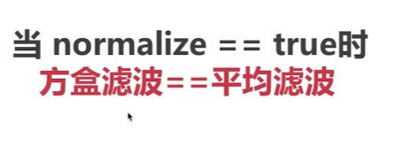

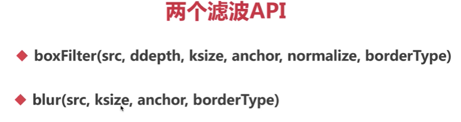

 用blur多一点

您提及了两个滤波相关的API：`boxFilter` 和 `blur`。下面是对这两个API的解释：

1. `boxFilter`：
   - 参数：
     - `src`：输入图像。
     - `ddepth`：输出图像的深度（数据类型）。
     - `ksize`：滤波卷积核的尺寸（宽度和高度）。
     - `anchor`：滤波卷积核的锚点位置。
     - `normalize`：是否进行归一化处理的标志。
     - `borderType`：边界处理类型。
   - 功能：
     `boxFilter` 函数具有对输入图像应用方盒滤波的功能。方盒滤波使用一个具有相等权重的滤波卷积核进行滤波操作。该函数可以用于实现平滑效果和去噪。
   
2. `blur`：
   - 参数：
     - `src`：输入图像。
     - `ksize`：滤波卷积核的尺寸（宽度和高度）。
     - `anchor`：滤波卷积核的锚点位置。
     - `borderType`：边界处理类型。
   - 功能：
     `blur` 函数用于对输入图像进行方框滤波。方框滤波和方盒滤波类似，都是使用相等权重的滤波卷积核进行滤波操作。这个函数也可以用于实现平滑效果和去噪。
     

这些滤波函数是通过对输入图像应用不同的滤波卷积核来实现的，具体效果可以根据传递的参数来调整。需要注意的是，这些API的具体实现可能会根据特定的图像处理库或框架而有所不同。

以下是针对OpenCV库的具体示例，演示如何使用`boxFilter`和`blur`函数来对图像应用滤波：

```python
import cv2

# 读取图像
img = cv2.imread('image.jpg')

# 使用boxFilter函数进行滤波
box_filtered = cv2.boxFilter(img, -1, (5, 5), normalize=True, borderType=cv2.BORDER_DEFAULT)

# 使用blur函数进行滤波
blur_filtered = cv2.blur(img, (5, 5), anchor=(-1, -1), borderType=cv2.BORDER_DEFAULT)

# 显示原始图像和滤波后的图像
cv2.imshow('Original Image', img)
cv2.imshow('Box Filtered Image', box_filtered)
cv2.imshow('Blur Filtered Image', blur_filtered)
cv2.waitKey(0)
cv2.destroyAllWindows()
```

上述示例中，首先读取了一个名为`image.jpg`的图像。然后使用`boxFilter`函数和`blur`函数对图像进行滤波操作。其中，`boxFilter`函数的滤波卷积核尺寸为(5, 5)，并将`normalize`参数设置为`True`来进行归一化处理；`blur`函数的滤波卷积核尺寸也为(5, 5)。最后，将原始图像和滤波后的图像显示出来。

请注意，这只是一个示例，您可以根据具体的需求和实际情况对参数进行调整。

## 高斯滤波

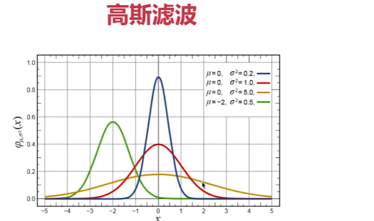

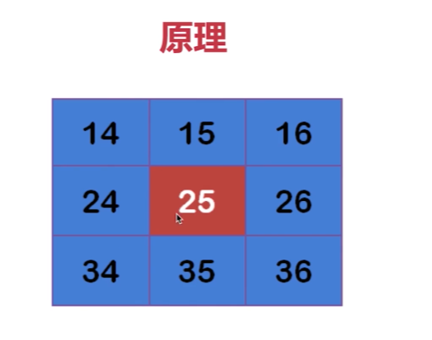

高斯滤波是一种常用的图像滤波方法，主要用于图像的平滑处理和去噪。其核心原理是基于高斯函数（Gaussian function）来生成滤波卷积核，通过对图像进行卷积操作来实现滤波效果。

高斯函数是一个连续的数学函数，定义了一个二维高斯分布。它在空间域中呈现出平滑的曲线，具有中心对称性和峰值。高斯滤波通过将高斯函数应用于图像的每个像素，来生成一个滤波卷积核，然后将该卷积核与图像进行卷积操作。

在进行高斯滤波时，滤波卷积核的尺寸和标准差（sigma）是两个重要的参数。滤波卷积核的尺寸决定了高斯滤波的范围和程度，而标准差则控制了滤波卷积核的形状。标准差越大，滤波卷积核的形状越宽，滤波效果越平滑。

实际上，高斯滤波卷积核是一个二维的高斯函数矩阵，其中每个元素表示滤波卷积核在相应位置上的权重。在对图像进行卷积操作时，将滤波卷积核的每个元素与对应位置上的像素值相乘，然后将所得乘积累加起来，作为输出图像的对应像素值。通过这种方式，可以使得输出图像的每个像素值被其周围像素的加权平均代替，从而实现图像的平滑和去噪效果。

高斯滤波常用于在图像处理领域中进行平滑处理和边缘保留滤波。它能够有效地消除图像中的噪声，同时保持图像的边缘和细节信息。不同的滤波卷积核尺寸和标准差可以产生不同程度的平滑效果，因此可以根据实际需求选择适当的参数来调整滤波效果。

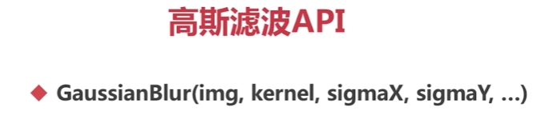

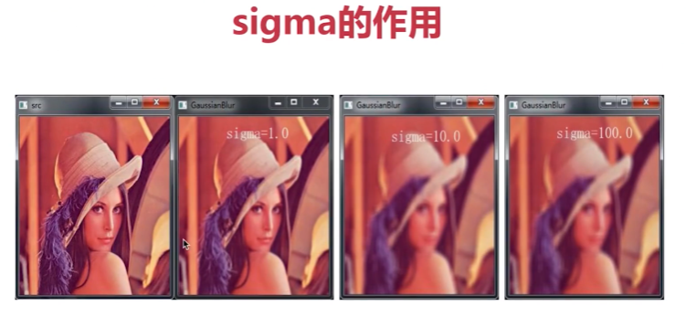

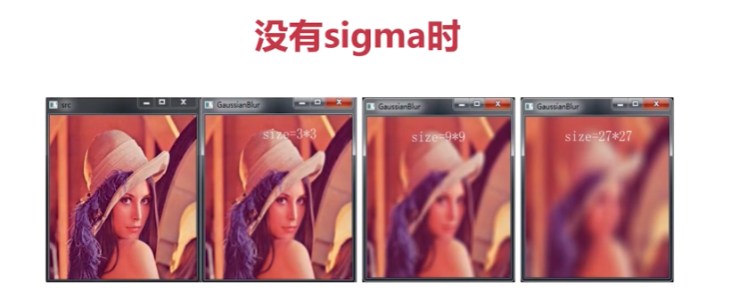

您提到的 `GaussianBlur` 是OpenCV图像处理库中提供的高斯滤波相关API。下面是对该函数的参数和功能的简要解释：

- 参数：
  - `img`：输入图像。
  - `kernel`：滤波核的大小，一般为奇数，例如 (3,3) 或 (5,5)。
  - `sigmaX`：高斯核函数在 X 方向上的标准差。
  - `sigmaY`：高斯核函数在 Y 方向上的标准差。如果未指定，则与 `sigmaX` 相同。
  - `borderType`：像素边界模式，默认为 `cv2.BORDER_DEFAULT`。
- 功能：
  `GaussianBlur` 函数主要用于对输入图像进行高斯滤波操作。通常情况下，该函数被用来降低图像噪声和平滑化图像，也可以用来提取图像的某些特征。

下面是一个使用 `GaussianBlur` 对图像进行平滑处理的示例：

```python
import cv2

# 读取图像
img = cv2.imread('image.jpg')

# 对图像进行高斯滤波
blur_img = cv2.GaussianBlur(img, (5, 5), 0)

# 显示原始图像和滤波后的图像
cv2.imshow('Original Image', img)
cv2.imshow('Gaussian Blur Image', blur_img)
cv2.waitKey(0)
cv2.destroyAllWindows()
```


在上面的示例中，`GaussianBlur` 函数被用于对读取得到的图像进行高斯滤波操作。滤波核的大小被设置为 (5, 5)，高斯核函数在 X 和 Y 方向上的标准差都被设置为 0，表示由函数自动计算。最终得到的高斯平滑结果存储在变量 `blur_img` 中，并使用 `imshow` 函数显示出来。

## 拉普拉斯算子

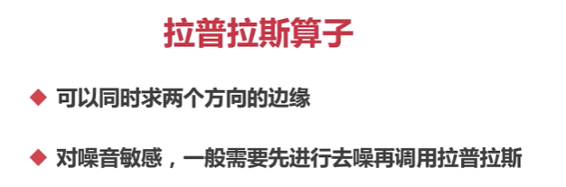

`Laplacian`是OpenCV库中的一个函数，用于应用Laplacian算子进行图像增强或边缘检测。函数的基本语法如下：

```
dst = cv2.Laplacian(img, ddepth, ksize[, scale[, borderType]])
```


参数含义如下：

- `img`：输入的图像。
- `ddepth`：输出图像的深度（即数据类型）。通常设置为负值（例如`cv2.CV_8U`），表示保持与输入图像相同的深度。
- `ksize`：算子的内核大小。可以设置为`1`、`3`、`5`或`7`。
- `scale`：可选参数，用于调整输出图像的比例因子。默认值为`1`。
- `borderType`：可选参数，用于指定边界填充模式。默认值为`cv2.BORDER_DEFAULT`。

函数返回应用Laplacian算子后的输出图像`dst`。

Laplacian算子是一种二阶微分滤波器，常用于强调图像的高频细节，例如边缘。通过计算图像在水平和垂直方向上的二阶导数，Laplacian算子可以提取出图像中的边缘信息。

下面是一个简单的示例代码，展示如何使用`Laplacian`函数进行边缘检测：

```python
import cv2

# 读取输入图像
img = cv2.imread('image.jpg', cv2.IMREAD_GRAYSCALE)

# 应用Laplacian算子
laplacian_img = cv2.Laplacian(img, cv2.CV_8U, ksize=3)

# 显示原始图像和边缘检测结果
cv2.imshow("Original Image", img)
cv2.imshow("Laplacian Image", laplacian_img)
cv2.waitKey(0)
cv2.destroyAllWindows()
```


在这个示例中，我们读取了灰度图像`img`，然后使用`Laplacian`函数应用Laplacian算子，得到边缘检测结果`laplacian_img`。最后，将原始图像和边缘检测结果进行显示。

您可以根据需要调整`ksize`、`scale`和`borderType`参数来实现不同的边缘检测效果。请注意，对于彩色图像，建议先将其转换为灰度图像再应用Laplacian算子。

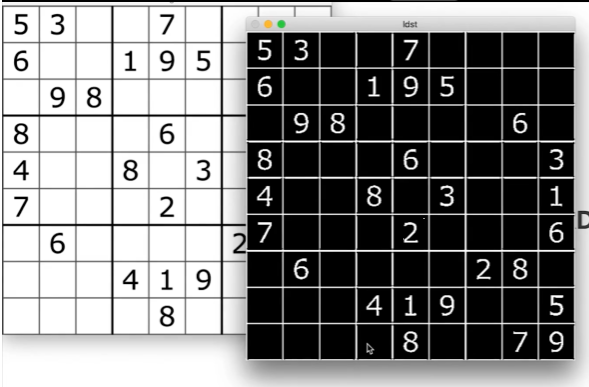