## 什么是图像轮廓 ?findContours

具有相同颜色或强度的连续点的曲线

图像轮廓是指具有相同**颜色**或**强度**的连续点形成的曲线。在图像处理中，轮廓是指表示物体边界的曲线或曲线集合。它是图像中感兴趣区域（如物体或形状）的外部边界或内部孔洞的表示。

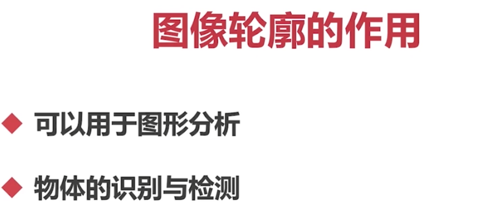


图像轮廓在计算机视觉和图像分析中被广泛应用。通过提取和分析图像的轮廓，可以实现以下目标：

1. 目标检测和识别：通过分析图像中物体的轮廓形状和特征，可以实现目标的检测和识别，如人脸识别、物体检测等。
2. 物体测量和数量分析：通过分析图像中物体的轮廓长度、面积、周长等特征，可以实现物体的测量和数量分析，如图像中细胞的计数、零件的尺寸测量等。
3. 图像分割和边缘检测：通过分析图像中物体的轮廓形状和边缘信息，可以实现图像的分割和边缘检测，如图像中目标的分割、边缘的提取等。

在实际应用中，图像轮廓通常通过阈值化、边缘检测、形态学操作等方法得到。OpenCV是一个常用的图像处理库，提供了许多用于计算和处理图像轮廓的函数和工具。

`findContours()` 是 OpenCV 中用于查找图像轮廓的函数。它的使用格式如下：

```python
contours, hierarchy = cv2.findContours(image, mode, method[, contours[, hierarchy[, offset]]])
```

参数说明：

- `image`：输入的二值化图像，通常是灰度图像，要求是 8 位单通道图像。
- `mode`：轮廓检索模式，指定轮廓的层次结构信息。常用的模式包括：
  - `cv2.RETR_EXTERNAL`：只检测最外层的轮廓。
  - `cv2.RETR_LIST`：将检测到的轮廓保存为一个列表，没有任何层次关系。
  - `cv2.RETR_CCOMP`：将轮廓分为两级，顶层为外部边界，次层为内部的空心边界。
  - `cv2.RETR_TREE`：将轮廓以树形结构表示，包含所有的层次信息。
- `method`：轮廓近似方法。常用的方法包括：
  - `cv2.CHAIN_APPROX_NONE`：存储所有的轮廓点。
  - `cv2.CHAIN_APPROX_SIMPLE`：仅存储轮廓的（角）端点。
  - `cv2.CHAIN_APPROX_TC89_L1`：使用 Teh-Chin 链码的一种变种进行轮廓近似。
  - `cv2.CHAIN_APPROX_TC89_KCOS`：使用 Teh-Chin 链码的一种变种进行轮廓近似，以及 Knight 预处理。
- `contours`：输出参数，存储检测到的轮廓，每个轮廓由一系列点表示。
- `hierarchy`：输出参数，存储轮廓的层次信息。

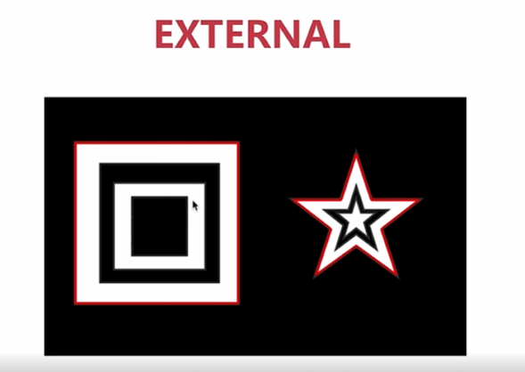


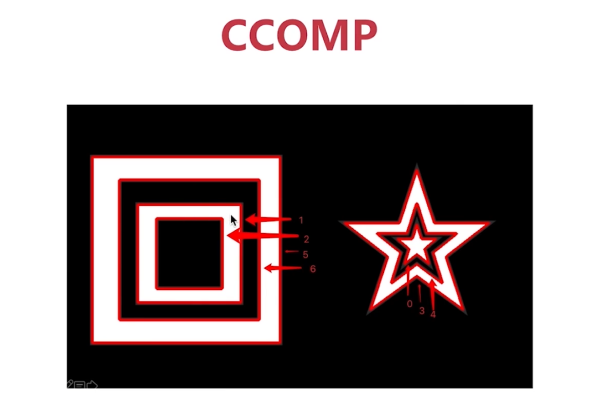

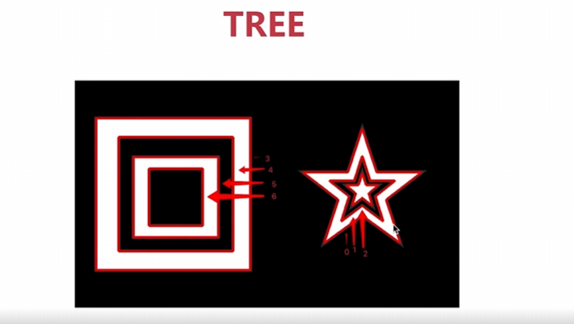

示例代码：

```python
import cv2
import numpy as np

# 读取图像并转换为灰度图像（转成单通道）
img = cv2.imread('image.png')
gray = cv2.cvtColor(img, cv2.COLOR_BGR2GRAY)

# 二值化图像
ret, binary = cv2.threshold(gray, 127, 255, cv2.THRESH_BINARY)

# 查找轮廓
contours, hierarchy = cv2.findContours(binary, cv2.RETR_EXTERNAL, cv2.CHAIN_APPROX_SIMPLE)

# 绘制轮廓
cv2.drawContours(img, contours, -1, (0, 0, 255), 2)  # -1 表示绘制所有的轮廓

# 显示结果
cv2.imshow('Contours', img)
cv2.waitKey(0)
cv2.destroyAllWindows()
```

在上述示例中，我们首先加载图像并将其转换为灰度图像。随后，对灰度图像进行二值化处理，得到二值图像以便于轮廓的查找。然后，使用 `cv2.findContours()` 函数查找轮廓，指定轮廓搜索模式为 `cv2.RETR_EXTERNAL` 和轮廓近似方法为 `cv2.CHAIN_APPROX_SIMPLE`。最后，使用 `cv2.drawContours()` 函数将轮廓绘制到原始图像上，并展示结果。

`cv2.drawContours()` 函数用于在图像上绘制轮廓。该函数的使用格式如下：

```
cv2.drawContours(image, contours, contourIdx, color[, thickness[, lineType[, hierarchy[, maxLevel[, offset]]]]])
```

参数说明：

- `image`：要绘制轮廓的图像。
- `contours`：要绘制的轮廓，可以是单个轮廓或包含多个轮廓的列表。
- `contourIdx`：要绘制的轮廓索引。当 `contourIdx` 为负数时，表示绘制所有的轮廓。
- `color`：轮廓的颜色，可以是一个表示 RGB 颜色值的元组，例如 (0, 0, 255) 表示红色。
- `thickness`（可选）：轮廓的线条粗细，默认值为 1。
- `lineType`（可选）：线条的类型，默认值为 8（8 连接线）。
- `hierarchy`（可选）：轮廓的层次信息。
- `maxLevel`（可选）：绘制轮廓的最大级别。
- `offset`（可选）：绘制轮廓的偏移量。

在提供的代码示例中，`cv2.drawContours()` 函数将图像 `img` 上的所有轮廓绘制为红色，线条粗细为 2。

希望这个解释对你有所帮助！如果还有其他问题，请随时提问。

## 轮廓的面积与周长 contourArea arcLength

可以通过这些元素的定位来剔除或更精确得到自己想要的部分内容

`contourArea()` 函数用于计算轮廓的面积。它的使用格式如下：

```python
area = cv2.contourArea(contour)
```

参数说明：
- `contour`：要计算面积的轮廓。

示例代码：

```python
import cv2

# 读取图像并转换为灰度图像
img = cv2.imread('image.png')
gray = cv2.cvtColor(img, cv2.COLOR_BGR2GRAY)

# 二值化图像
ret, binary = cv2.threshold(gray, 127, 255, cv2.THRESH_BINARY)

# 查找轮廓
contours, hierarchy = cv2.findContours(binary, cv2.RETR_EXTERNAL, cv2.CHAIN_APPROX_SIMPLE)

# 计算第一个轮廓的面积
area = cv2.contourArea(contours[0])
print("Contour area:", area)
```

在上述示例中，我们首先加载图像并将其转换为灰度图像。随后，对灰度图像进行二值化处理，得到二值图像以便于轮廓的查找。然后，使用 `cv2.findContours()` 函数查找轮廓，并将返回的轮廓存储在 `contours` 变量中。最后，使用 `cv2.contourArea()` 函数计算第一个轮廓的面积，并将结果打印出来。

`arcLength()` 函数用于计算轮廓的周长。它的使用格式如下：

```python
length = cv2.arcLength(curve, closed)
```

参数说明：
- `curve`：要计算周长的轮廓。
- `closed`：指定轮廓是否闭合，为 `True` 表示闭合，为 `False` 表示不闭合。

示例代码：

```python
import cv2

# 读取图像并转换为灰度图像
img = cv2.imread('image.png')
gray = cv2.cvtColor(img, cv2.COLOR_BGR2GRAY)

# 二值化图像
ret, binary = cv2.threshold(gray, 127, 255, cv2.THRESH_BINARY)

# 查找轮廓
contours, hierarchy = cv2.findContours(binary, cv2.RETR_EXTERNAL, cv2.CHAIN_APPROX_SIMPLE)

# 计算第一个轮廓的周长
length = cv2.arcLength(contours[0], True)
print("Contour length:", length)
```

在上述示例中，我们使用与前面相同的步骤找到轮廓。然后，使用 `cv2.arcLength()` 函数计算第一个轮廓的周长，并将结果打印出来。

## 多边形逼近与凸包 approxPolyDP convexHull

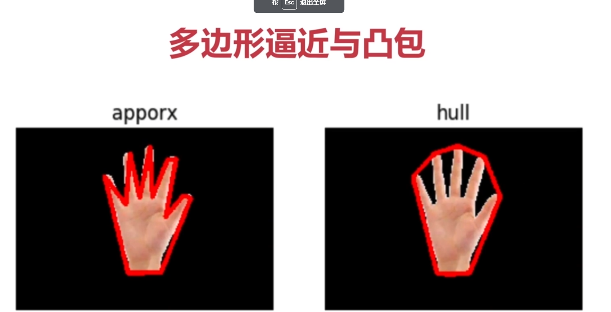

左边是多边形逼近，右边是凹包

### 多边形逼近

`approxPolyDP()` 函数用于对轮廓进行多边形逼近。它使用迭代的 Douglas-Peucker 算法，将原始轮廓逼近为一个具有更少顶点的多边形。该函数的使用格式如下：

```python
approx = cv2.approxPolyDP(curve, epsilon, closed)
```

参数说明：
- `curve`：要逼近的轮廓。
- `epsilon`：逼近精度，也即逼近与原始轮廓的最大差距。
- `closed`：指定逼近的多边形是否是闭合的，为 `True` 表示闭合，为 `False` 表示不闭合。

返回值：
- `approx`：逼近后的多边形。

示例代码：

```python
import cv2

# 读取图像并转换为灰度图像
img = cv2.imread('image.png')
gray = cv2.cvtColor(img, cv2.COLOR_BGR2GRAY)

# 二值化图像
ret, binary = cv2.threshold(gray, 127, 255, cv2.THRESH_BINARY)

# 查找轮廓
contours, hierarchy = cv2.findContours(binary, cv2.RETR_EXTERNAL, cv2.CHAIN_APPROX_SIMPLE)

# 对第一个轮廓进行多边形逼近
epsilon = 0.02 * cv2.arcLength(contours[0], True)
approx = cv2.approxPolyDP(contours[0], epsilon, True)

# 绘制逼近后的多边形
cv2.drawContours(img, [approx], -1, (0, 255, 0), 3)

# 显示结果
cv2.imshow('Approximation', img)
cv2.waitKey(0)
cv2.destroyAllWindows()
```

在上述示例中，我们首先加载图像并将其转换为灰度图像。然后，对灰度图像进行二值化处理，得到二值图像以便于轮廓的查找。接下来，使用 `cv2.findContours()` 函数查找轮廓，并将返回的轮廓存储在 `contours` 变量中。然后，计算第一个轮廓的逼近精度 `epsilon`，这里我们选择将逼近距离设定为原始轮廓周长的 2%。接下来，使用 `cv2.approxPolyDP()` 函数对轮廓进行多边形逼近。最后，我们使用 `cv2.drawContours()` 函数绘制逼近后的多边形，并显示结果。

## 凹包

`convexHull()` 函数用于计算给定点集的凸包，即能包围所有点的最小凸多边形。它根据输入点的坐标，以顺时针或逆时针的方式绘制凸多边形。该函数的使用格式如下：

```python
hull = cv2.convexHull(points, clockwise, ...)
```

参数说明：
- `points`：要计算凸包的点集或轮廓。
- `clockwise`：指定绘制凸多边形的顺序，为 `True` 表示以顺时针方向绘制，为 `False` 表示以逆时针方向绘制。

返回值：
- `hull`：表示计算得到的凸包。

示例代码：

```python
import cv2
import numpy as np

# 创建一个点集
points = np.array([[50, 50], [200, 50], [50, 200], [200, 200], [120, 120]], dtype=np.int32)

# 计算凸包
hull = cv2.convexHull(points, clockwise=True)

# 创建一个空图像并绘制凸包
img = np.zeros((250, 250, 3), dtype=np.uint8)
cv2.drawContours(img, [hull], -1, (0, 255, 0), 2) # 这里使用 [hull] 是因为 drawContours() 函数接收的是一个列表

# 在图像上绘制原始点集
for pt in points:
    cv2.circle(img, tuple(pt), 4, (0, 0, 255), -1)

# 显示结果
cv2.imshow('Convex Hull', img)
cv2.waitKey(0)
cv2.destroyAllWindows()
```

在上述示例中，我们首先创建一组点（`points`），这里我们手动指定了五个点。然后，使用 `cv2.convexHull()` 函数计算这些点的凸包，将计算得到的凸包存储在 `hull` 变量中。接下来，创建一个空图像，并使用 `cv2.drawContours()` 函数绘制凸包，这里我们将凸包传递给 `drawContours()` 函数时需要放在一个列表中。最后，在绘制的图像上用红色圆圈绘制原始的点集。最终，我们使用 `cv2.imshow()` 函数显示图像。

## 外接矩形 minAreaRect boundingRect

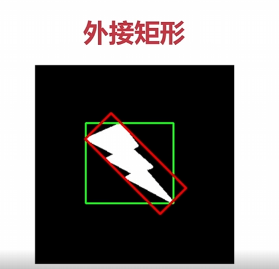

外接矩形是能完全包围给定对象或轮廓的最小面积矩形。在计算机视觉中，常用的两种外接矩形是最小外接矩形（红色部分）和最大外接矩形（绿色部分）。

1. 最小外接矩形（Minimum Bounding Rectangle）：最小外接矩形是能够包围住给定对象或轮廓的最小面积矩形，可以是旋转的。OpenCV中提供了 `cv2.minAreaRect()` 函数来计算给定对象或轮廓的最小外接矩形。
2. 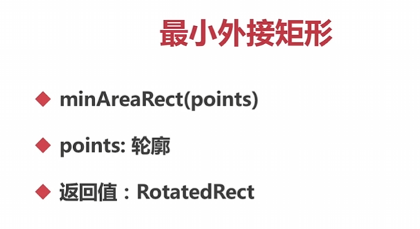
3. 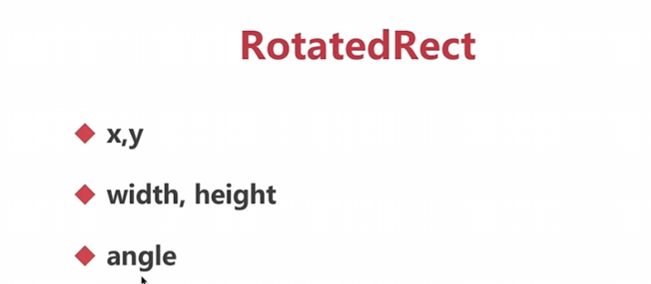
4. 示例代码如下：

```python
import cv2

# 读取图像并转换为灰度图像
img = cv2.imread('image.png')
gray = cv2.cvtColor(img, cv2.COLOR_BGR2GRAY)

# 二值化图像
ret, binary = cv2.threshold(gray, 127, 255, cv2.THRESH_BINARY)

# 查找轮廓
contours, hierarchy = cv2.findContours(binary, cv2.RETR_EXTERNAL, cv2.CHAIN_APPROX_SIMPLE)

# 计算最小外接矩形
rect = cv2.minAreaRect(contours[0])

# 绘制最小外接矩形
box = cv2.boxPoints(rect)  # 获取最小外接矩形的四个顶点坐标
box = np.int0(box)  # 转换为整数坐标
cv2.drawContours(img, [box], 0, (0, 255, 0), 2)

# 显示结果
cv2.imshow('Minimum Bounding Rectangle', img)
cv2.waitKey(0)
cv2.destroyAllWindows()
```

在上述示例中，我们首先加载图像并将其转换为灰度图像。然后，对灰度图像进行二值化处理，得到二值图像以便于轮廓的查找。接下来，使用 `cv2.findContours()` 函数查找轮廓，并将返回的轮廓存储在 `contours` 变量中。然后，使用 `cv2.minAreaRect()` 函数计算最小外接矩形，将结果存储在 `rect` 变量中。之后，通过 `cv2.boxPoints()` 函数获取最小外接矩形的四个顶点坐标，并将坐标转换为整数类型。最后，使用 `cv2.drawContours()` 函数绘制最小外接矩形，并将图像显示出来。

2. 最大外接矩形（Maximum Bounding Rectangle）：最大外接矩形是能够完全包围给定对象或轮廓的最大面积矩形，它是不可旋转的（也称为边界框）。OpenCV中提供了 `cv2.boundingRect()` 函数来计算给定对象或轮廓的最大外接矩形。
2. 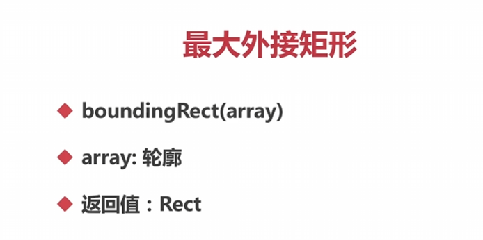
2. 示例代码如下：

```python
import cv2

# 读取图像并转换为灰度图像
img = cv2.imread('image.png')
gray = cv2.cvtColor(img, cv2.COLOR_BGR2GRAY)

# 二值化图像
ret, binary = cv2.threshold(gray, 127, 255, cv2.THRESH_BINARY)

# 查找轮廓
contours, hierarchy = cv2.findContours(binary, cv2.RETR_EXTERNAL, cv2.CHAIN_APPROX_SIMPLE)

# 计算最大外接矩形
x, y, w, h = cv2.boundingRect(contours[0])

# 绘制最大外接矩形
cv2.rectangle(img, (x, y), (x+w, y+h), (0, 255, 0), 2)

# 显示结果
cv2.imshow('Maximum Bounding Rectangle', img)
cv2.waitKey(0)
cv2.destroyAllWindows()
```

在上述示例中，我们首先加载图像并将其转换为灰度图像。然后，对灰度图像进行二值化处理，得到二值图像以便于轮廓的查找。接下来，使用 `cv2.findContours()` 函数查

## 【车辆统计项目】

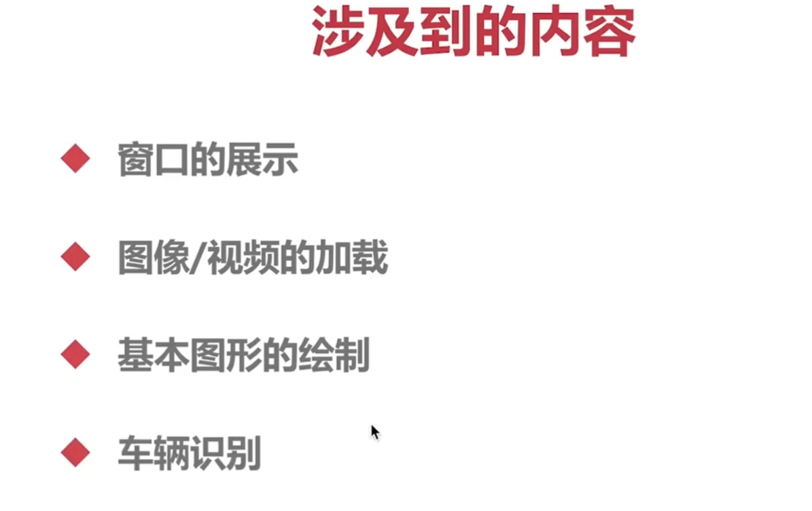

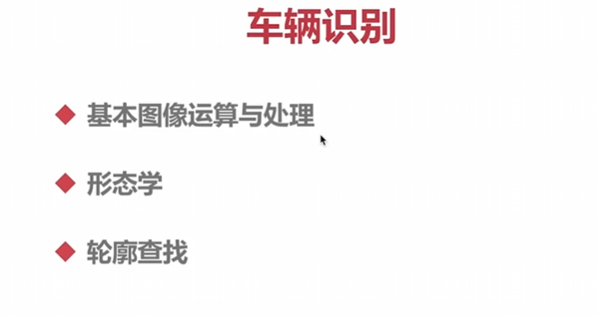

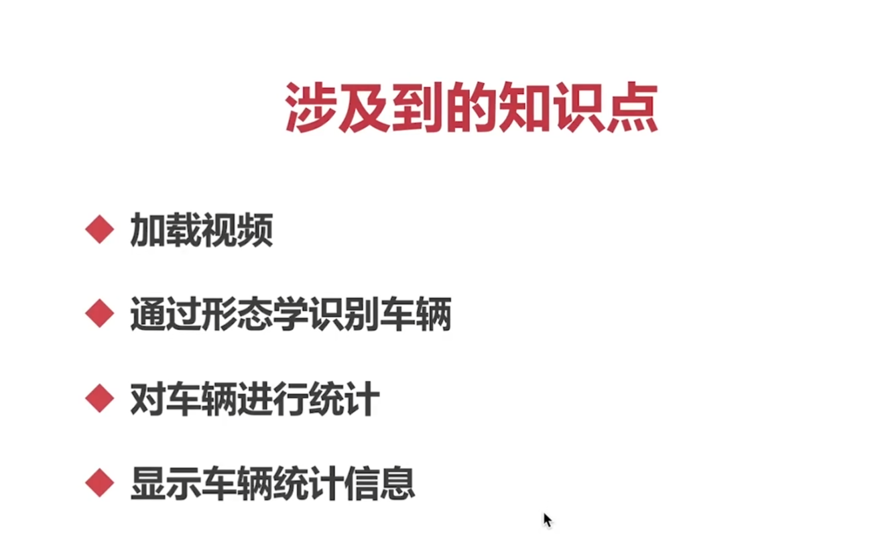

## 去背景

一种改进的自适应背景混合阴影检测实时跟踪模型

您可以使用OpenCV中的`createBackgroundSubtractorMOG2()`函数来创建一个背景减除器，该函数可以用于将图像中的前景物体从背景中分离出来。

背景减除器是一种图像处理算法，用于从输入视频或图像中移除背景，从而得到前景对象。它的工作原理是通过建立对背景的模型，将与背景差异较大的像素标记为前景，而将与背景相似的像素标记为背景。

具体来说，背景减除器的工作原理如下：

1. 初始化：背景减除器在开始运行时，首先会进行初始化，建立一个初始的背景模型。
2. 历史建模：减除器将一定数量的历史帧作为输入，逐帧更新背景模型。通过对历史帧的分析，减除器可以获得一个对背景的统计模型。
3. 前景检测：对于每一帧输入图像，背景减除器会将其与背景模型进行比较。像素级的比较会将与背景差异较大的像素标记为前景。
4. 模型更新：为了适应场景变化和噪声等因素，背景减除器需要对模型进行动态更新。在每一帧的前景检测后，减除器会根据前景掩码对背景模型进行更新，以便更好地适应背景的变化。

通过以上步骤，背景减除器可以将前景对象从图像中分离出来，得到一个前景掩码（二值图像），其中前景被标记为白色，背景被标记为黑色。这个前景掩码可以用于进一步的图像分析和处理，例如对象检测、跟踪等。

需要指出的是，背景减除器不是完美的，它对于光照变化、阴影、噪声等因素较为敏感。因此，在实际应用中，可能需要对背景减除器进行参数调整，或者结合其他图像处理技术来提高准确性和稳定性。

函数的语法如下：

```python
cv2.createBackgroundSubtractorMOG2(history, nmixtures, backgroundRatio, noiseSigma)
```

其中:
- `history` 是指定用于建模的历史帧数。它指定了在更新背景模型时考虑的最近帧的数量。
- `nmixtures` 是指定背景模型中的高斯混合成分数量。
- `backgroundRatio` 是背景模型中混合成分的相对权重。
- `noiseSigma` 是指定噪声的标准差。

下面是一个示例代码，演示如何使用`createBackgroundSubtractorMOG()`函数进行背景减除：

```python
import cv2

# 创建一个背景减除器
bg_subtractor = cv2.createBackgroundSubtractorMOG2(history=200)

# 打开视频文件
video = cv2.VideoCapture('video.mp4')

while True:
    # 读取视频帧
    ret, frame = video.read()
    if not ret:
        break

    # 应用背景减除器获取前景掩码
    # 灰度
    cv2.cvtColor(frame, cv2.COLOR_BGR2GRAY)
    # 去噪 (高斯)
    blur = cv2.GaussianBlur(frame,(3,3),5)
    # 应用背景减除器获取前景掩码
    fg_mask = bg_subtractor.apply(blur)
    # 显示前景掩码
    cv2.imshow('Foreground Mask', fg_mask)

    # 按下 'q' 键退出循环
    if cv2.waitKey(1) & 0xFF == ord('q'):
        break

# 释放视频对象和窗口
video.release()
cv2.destroyAllWindows()
```

在上述示例中，我们首先使用`cv2.createBackgroundSubtractorMOG2()`函数创建了一个背景减除器`bg_subtractor`，设置了历史帧数为200。然后，我们打开一个视频文件并循环读取每一帧，将每一帧应用于背景减除器获得前景掩码`fg_mask`。最后，我们在窗口中显示前景掩码，并在按下 'q' 键时退出循环。

这样，您就可以使用`createBackgroundSubtractorMOG2()`函数进行简单的背景去除操作。根据您的需求，您可以调整函数的参数来获得更好的效果。

## 车辆统计

图像的左上角是（0，0）

自己写的，注意点：先做完判断转化，再将线和其他内容画上去，不然自己画的线条会妨碍判断

```
cv2.bgsegm.createBackgroundSubtractorMOG() #原版使用这个
```

```python

import cv2

# 创建一个背景减除器
bg_subtractor = cv2.createBackgroundSubtractorMOG2(history=200)
# 打开视频文件
video = cv2.VideoCapture('video.mp4')
offset = 12
high = 600
cout = 0
cars = []
while True:
    # 读取视频帧
    ret, frame = video.read()
    if not ret:
        break

    # 应用背景减除器获取前景掩码
    # 灰度
    cv2.cvtColor(frame, cv2.COLOR_BGR2GRAY)
    # 去噪 (高斯)
    blur = cv2.GaussianBlur(frame,(3,3),5)
    # 应用背景减除器获取前景掩码
    fg_mask = bg_subtractor.apply(blur)
    # 查找轮廓
    contours, hierarchy = cv2.findContours(fg_mask, cv2.RETR_TREE, cv2.CHAIN_APPROX_SIMPLE)
    #获得每一辆有效车的轮廓
    for cnt in contours:
         (x, y, w, h) = cv2.boundingRect(cnt)
         if w >= 90 and h >= 90:
            cv2.rectangle(frame, (x, y), (x+w, y+h), (0, 255, 0),2)
            cars.append(int(y+(h/2)))
         else:
             continue
         # 去重复，只有到线的车才检测
         for car in cars:
           if car >= high - offset and car <= high + offset:
            cout += 1
            cars.remove(car)
            print(cout)
     #显示前景掩码
    cv2.line(frame, (0, 600), (1200, 600), (0, 255, 0), 3)
    cv2.imshow('Foreground Mask', frame)
    # 按下 'q' 键退出循环
    if cv2.waitKey(1) & 0xFF == ord('q'):
        break

# 释放视频对象和窗口
video.release()
cv2.destroyAllWindows()
```

缺点：

1. 容易重复和遗漏计数
2. 没有唯一标识

解决方案：

使用深度学习训练模型