## 特征检测的基本概念

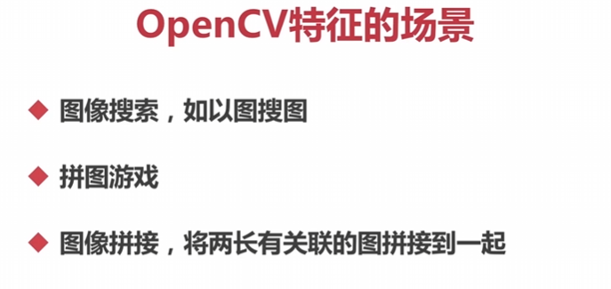

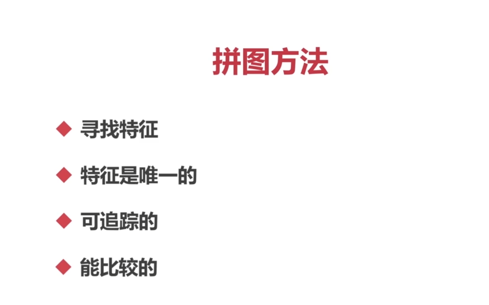

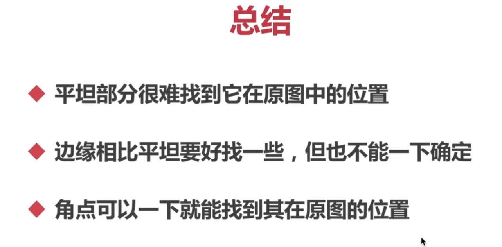

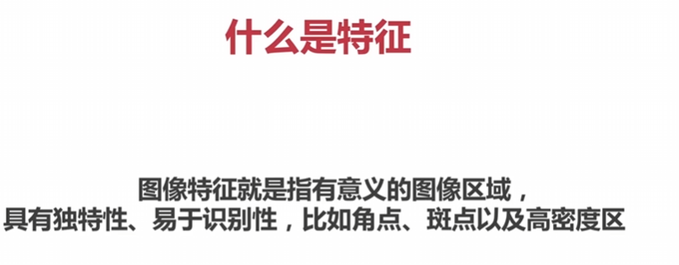

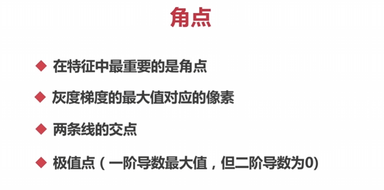

## Harris角点

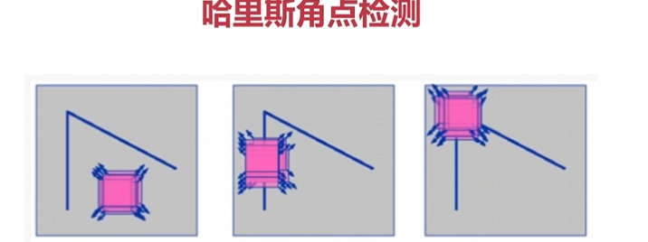

Harris角点检测是一种经典的计算机视觉算法，用于检测图像中的角点。这个算法基于图像的局部灰度变化，通过计算每个像素点的角点响应函数来确定角点。

Harris角点检测算法通过计算每个像素点的角点响应函数来确定角点。具体而言，它计算了每个像素点邻域的灰度值在不同方向上的变化，并使用这些变化来评估该像素点是否为角点。

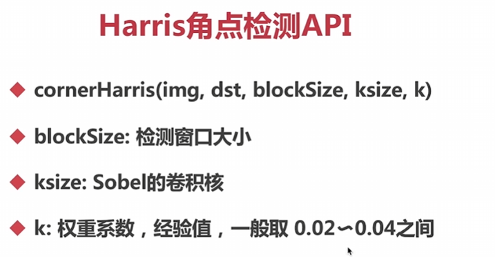

在OpenCV中，您可以使用`cv2.cornerHarris()`函数来执行Harris角点检测。以下是一个使用Harris角点检测算法的示例代码：

```python
import cv2
import numpy as np

# 读取图像并将其转换为灰度图像
image = cv2.imread('image.jpg')
gray = cv2.cvtColor(image, cv2.COLOR_BGR2GRAY)

# 执行Harris角点检测
dst = cv2.cornerHarris(gray, blockSize=2, ksize=3, k=0.04)

# 使用阈值来筛选角点，并标记它们
# harris
# img[dst > 0.01 *dst.max()] = [0,0,255]
threshold = 0.01 * dst.max()
corners = np.argwhere(dst > threshold)
for corner in corners:
    x, y = corner.ravel()
    cv2.circle(image, (x, y), 5, (0, 0, 255), -1)

# 显示图像和标记的角点
cv2.imshow('Harris Corners', image)
cv2.waitKey(0)
cv2.destroyAllWindows()
```

在上述代码中，我们首先将图像转换为灰度图像，然后使用`cv2.cornerHarris()`函数执行Harris角点检测。函数的参数中，`blockSize`是邻域大小，`ksize`是Sobel算子的大小，`k`是Harris角点响应函数的自由参数。

通过设置一个阈值，我们可以筛选出具有足够角点响应值的像素，并使用`cv2.circle()`函数来标记这些角点。

在这个上下文中，`0.01 * dst.max()`是计算Harris角点检测结果的阈值的表达式。具体来说，`dst.max()`用于获取`dst`数组中的最大值，然后乘以0.01。

`img[dst > 0.01 * dst.max()]`是一个条件表达式，它选择具有角点响应值高于阈值的像素点。如果满足条件，将这些像素点的颜色设置为红色 [0, 0, 255]。

具体而言，`dst > 0.01 * dst.max()`生成一个布尔数组，其中元素值为True表示对应位置的像素是角点，而False则表示不是角点。通过将该布尔数组作为索引，在图像`img`上选择与True对应位置的像素点，并将其颜色设置为红色。

这个计算的目的是获得一个相对较低的阈值，用于筛选那些Harris角点响应值高于阈值的像素点。乘以0.01是为了确保阈值在最大响应值的1%范围内，以便选择出相对较强的角点。

通过调整乘以0.01的倍数，您可以根据具体的应用场景和图像的特点来调整阈值的选择。较小的乘数将导致更严格的过滤，选择更高阈值的像素作为角点，而较大的乘数将宽松地过滤像素点。

更详细扩展：

这段代码用于在图像上绘制Harris角点的圆圈标记。让我逐行解释它：

1. `corners = np.argwhere(dst > threshold)`：这行代码使用了Numpy中的`argwhere`函数，用于找到满足条件`dst > threshold`的像素点的坐标。`dst`是存储Harris角点响应值的矩阵，`threshold`是用于过滤角点的阈值。`corners`将包含所有筛选出的角点的坐标。
2. `for corner in corners:`：这是一个循环，对于每个被筛选出的角点坐标，执行下面的代码。
3. `x, y = corner.ravel()`：这行代码将由`corners`数组中的一个角点坐标表示的行向量展平为两个变量`x`和`y`。这样就将每个角点的x和y坐标分别赋值给了`x`和`y`变量。
4. `cv2.circle(image, (x, y), 5, (0, 0, 255), -1)`：这行代码使用OpenCV库中的`circle`函数在图像`image`上绘制一个圆圈标记。`(x, y)`表示圆心的坐标，`5`表示圆的半径大小，`(0, 0, 255)`是用于绘制圆的颜色，它是一个BGR格式的元组，这里表示红色，`-1`表示实心圆。

通过循环遍历`corners`中的每个角点，依次将其绘制为红色的圆圈标记，从而在图像上可视化Harris角点。

希望这个解释能够帮助您理解代码的作用。如果您有更多疑问，请随时提问。

## Shi-Tomasi角点检测

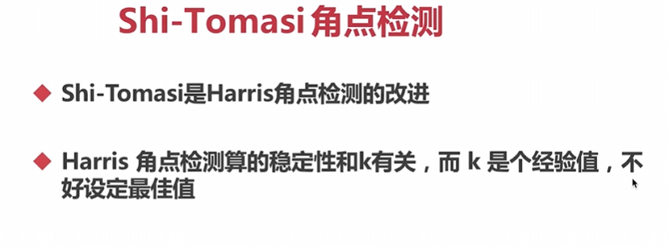

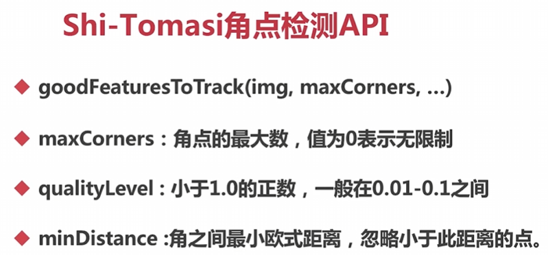

 Shi-Tomasi 角点检测函数 `goodFeaturesToTrack` 的完整参数解释：

```
corners = cv2.goodFeaturesToTrack(img, maxCorners, qualityLevel, minDistance, mask=None, blockSize=3, useHarrisDetector=False, k=0.04)
```


- `img`：需要进行角点检测的灰度图像。
- `maxCorners`：角点的最大数量。如果设为 0 ，则没有最大数量限制。
- `qualityLevel`：角点的质量阈值。这是一个小于 1.0 的正数，一般取值在 0.01 到 0.1 之间。只有大于此阈值的角点被保留作为最终的角点。
- `minDistance`：角点之间的最小欧式距离。如果两个角点之间的距离小于此值，则会忽略其中之一。这样可以保证选出的角点分布均匀。
- `mask`：一个与输入图像相同大小的掩码图像，用于指定感兴趣的区域。只有掩码图像对应位置为非零值的像素才会参与角点检测。
- `blockSize`：用于角点检测的窗口大小。默认值为 3 ，表示一个 3x3 的窗口。
- `useHarrisDetector`：一个布尔值，用于指定是否使用 Harris 角点检测算法。默认为 False ，表示使用 Shi-Tomasi 角点检测算法。
- `k`：Harris 角点检测算法的自由参数 k。默认值为 0.04 。

函数返回一个形状为 `(N,1,2)` 的 Numpy 数组，其中 N 是检测到的角点数量。每个角点通过一个有两个元素的坐标表示 `(x, y)`。

这个函数能够在输入图像中进行 Shi-Tomasi 或 Harris 角点检测，并输出检测到的角点坐标。

当您使用 `goodFeaturesToTrack` 函数时，可以按照以下示例来调用和使用它：

```python
import cv2
import numpy as np

# 读取图像
img = cv2.imread('image.jpg')
gray = cv2.cvtColor(img, cv2.COLOR_BGR2GRAY)

# 设置参数
max_corners = 100
quality_level = 0.01
min_distance = 10
block_size = 3
use_harris_detector = False
k = 0.04

# 进行角点检测
corners = cv2.goodFeaturesToTrack(gray, max_corners, quality_level, min_distance, blockSize=block_size, useHarrisDetector=use_harris_detector, k=k)

# 将检测到的角点标记在图像上
#要类型转化
corners = np.int0(corners)
for corner in corners:
    x, y = corner.ravel()
    cv2.circle(img, (x, y), 5, (0, 255, 0), -1)

# 显示结果
cv2.imshow('Corners', img)
cv2.waitKey(0)
cv2.destroyAllWindows()
```

在这个示例中，我们首先读取一张图像并将其转换为灰度图像。然后，我们设置了 `goodFeaturesToTrack` 函数所需的参数，包括最大角点数、质量阈值、最小距离等。接下来，我们调用 `goodFeaturesToTrack` 函数来进行角点检测，并将检测结果保存在 `corners` 变量中。

最后，我们通过将检测到的角点在原始图像上进行标记，并显示结果图像。

请注意，该示例是一个基本的框架，您可以根据您的具体需求和图像来调整参数和处理方式。

## SIFT关键点检测


尺度不变特征变换

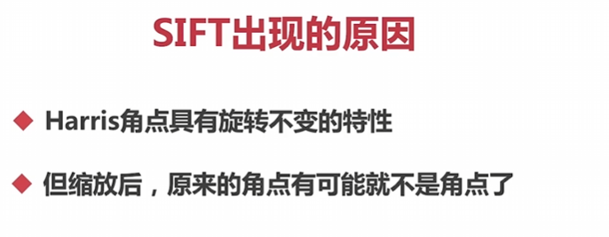

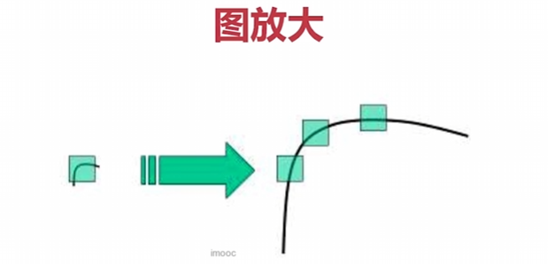

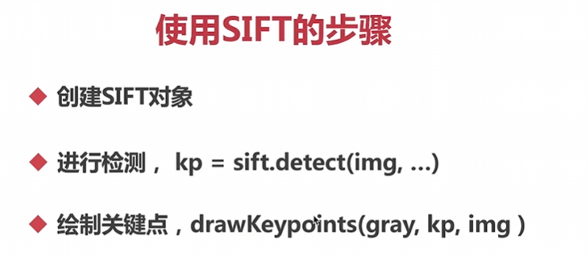

使用 SIFT (Scale-Invariant Feature Transform) 进行关键点检测的一般步骤如下：

因为有专利问题所以在新版本中需要额外下载扩展包：

```python
 pip install -i https://pypi.tuna.tsinghua.edu.cn/simple opencv-contrib-python
```


1. 导入所需的库和模块：

```python
import cv2
import numpy as np
```

2. 创建 SIFT 对象（扩展包标识开源去掉xfeatures2d）：

```python
sift = cv2.SIFT_create()
```

3. 准备图像并转换为灰度图像：

```python
img = cv2.imread('image.jpg')
gray = cv2.cvtColor(img, cv2.COLOR_BGR2GRAY)
```

4. 使用 SIFT 进行关键点检测：

```python
kp = sift.detect(gray, None)
```

5. 绘制关键点：

```python
img_with_keypoints = cv2.drawKeypoints(gray, kp, img)
```

这将在原始图像上绘制关键点。

6. 显示结果图像：

```python
cv2.imshow('SIFT Keypoints', img_with_keypoints)
cv2.waitKey(0)
cv2.destroyAllWindows()
```

完整代码示例：

```python
import cv2
import numpy as np

# 创建 SIFT 对象
sift = cv2.SIFT_create()

# 准备图像并转换为灰度图像
img = cv2.imread('image.jpg')
gray = cv2.cvtColor(img, cv2.COLOR_BGR2GRAY)

# 使用 SIFT 进行关键点检测
kp = sift.detect(gray, None)

# 绘制关键点
img_with_keypoints = cv2.drawKeypoints(gray, kp, img)

# 显示结果图像
cv2.imshow('SIFT Keypoints', img_with_keypoints)
cv2.waitKey(0)
cv2.destroyAllWindows()
```

请确保安装了 OpenCV 的 contrib 库，因为 SIFT 算法位于 OpenCV 的 contrib 模块中。如果没有安装 contrib，您可以通过 `pip install opencv-contrib-python` 命令来安装。

请注意，SIFT 是一种专利算法，需要在使用之前获得相应的许可。在某些情况下，可能需要考虑另一种不受专利保护的特征描述符算法，如 SURF、ORB 或 AKAZE。

## 计算SIFT描述子

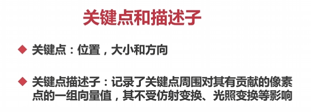

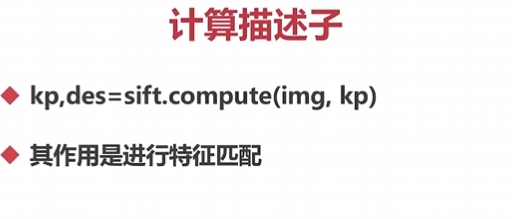

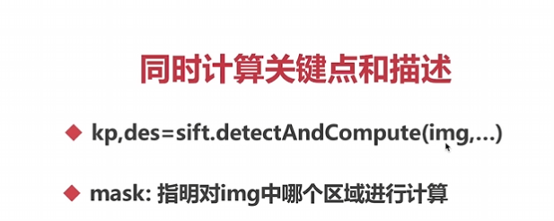

你是对的，在使用 SIFT 进行关键点检测和特征描述时，可以通过 `detectAndCompute` 方法同时计算关键点和描述符。同时，你还可以使用 `mask` 参数来指定在图像中哪个区域进行计算。

下面是一个示例代码：

```python
import cv2
import numpy as np

# 创建 SIFT 对象
sift = cv2.SIFT_create()

# 准备图像并转换为灰度图像
img = cv2.imread('image.jpg')
gray = cv2.cvtColor(img, cv2.COLOR_BGR2GRAY)

# 创建一个掩码，指定要计算的区域
mask = np.zeros_like(gray)  # 创建与灰度图像相同大小的全零矩阵,或者之间指定None也是全部
mask[100:300, 200:400] = 255  # 在掩码的指定区域内设置为白色（255）

# 使用 SIFT 进行关键点检测和特征描述
kp, des = sift.detectAndCompute(gray, mask)

# 绘制关键点
img_with_keypoints = cv2.drawKeypoints(gray, kp, img)

# 显示结果图像
cv2.imshow('SIFT Keypoints', img_with_keypoints)
cv2.waitKey(0)
cv2.destroyAllWindows()
```

在这个示例中，我们首先创建了一个与灰度图像大小相同的掩码，然后在指定区域内将掩码元素设置为白色（255）。接下来，我们使用 `detectAndCompute` 方法同时计算关键点和描述符，并将掩码作为参数传递给方法。

最后，我们绘制关键点并显示结果图像。

这样，我们就可以指定在图像中的特定区域计算关键点和描述符。请记住，掩码的大小必须与图像的大小相同，并且只有掩码区域内的像素才会被计算关键点和描述符。

## SURF特征检测

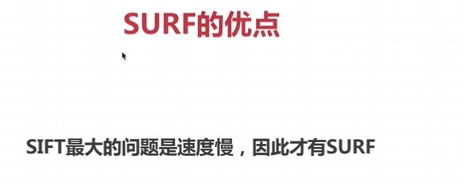

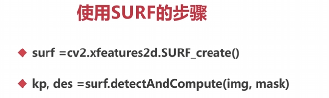

使用 SURF (Speeded-Up Robust Features) 进行特征检测和描述的一般步骤如下：

1. 导入所需的库和模块：

```python
import cv2
import numpy as np
```

2. 创建 SURF 对象：

```python
surf = cv2.xfeatures2d.SURF_create()
```

3. 准备图像并转换为灰度图像：

```python
img = cv2.imread('image.jpg')
gray = cv2.cvtColor(img, cv2.COLOR_BGR2GRAY)
```

4. 创建一个掩码，指定要计算的区域（可选）：

```python
mask = np.zeros_like(gray)  # 创建与灰度图像相同大小的全零矩阵
mask[100:300, 200:400] = 255  # 在掩码的指定区域内设置为白色（255）
```

5. 使用 SURF 进行关键点检测和特征描述：

```python
kp, des = surf.detectAndCompute(gray, mask)
```

6. 绘制关键点：

```python
img_with_keypoints = cv2.drawKeypoints(gray, kp, img)
```

这将在原始图像上绘制关键点。

7. 显示结果图像：

```python
cv2.imshow('SURF Keypoints', img_with_keypoints)
cv2.waitKey(0)
cv2.destroyAllWindows()
```

完整代码示例：

```python
import cv2
import numpy as np

# 创建 SURF 对象
surf = cv2.SURF_create()

# 准备图像并转换为灰度图像
img = cv2.imread('image.jpg')
gray = cv2.cvtColor(img, cv2.COLOR_BGR2GRAY)

# 创建一个掩码，指定要计算的区域（可选）
mask = np.zeros_like(gray)  # 创建与灰度图像相同大小的全零矩阵
mask[100:300, 200:400] = 255  # 在掩码的指定区域内设置为白色（255）

# 使用 SURF 进行关键点检测和特征描述
kp, des = surf.detectAndCompute(gray, mask)

# 绘制关键点
img_with_keypoints = cv2.drawKeypoints(gray, kp, img)

# 显示结果图像
cv2.imshow('SURF Keypoints', img_with_keypoints)
cv2.waitKey(0)
cv2.destroyAllWindows()
```

请确保安装了 OpenCV 的 contrib 库，因为 SURF 算法位于 OpenCV 的 contrib 模块中。如果没有安装 contrib，您可以通过 `pip install opencv-contrib-python` 命令来安装。

选择使用 SURF 还是 SIFT 取决于你的具体需求和应用场景。如果你对计算速度要求较高，可以选择 SURF。如果你需要更精确的描述符或在商业项目中使用，那么 SIFT 可能更合适。

## ORB特征检测


特征检测和描述子的计算的技术组合

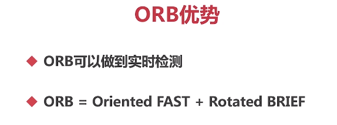

准确度比SIFT和SURF小一点，但是量多就有好处

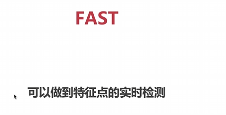

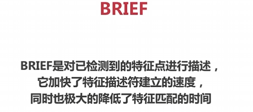

使用 ORB (Oriented FAST and Rotated BRIEF) 进行特征检测和描述的一般步骤如下：

1. 导入所需的库和模块：

```python
import cv2
import numpy as np
```

2. 创建 ORB 对象：

```python
orb = cv2.ORB_create()
```

3. 准备图像并转换为灰度图像：

```python
img = cv2.imread('image.jpg')
gray = cv2.cvtColor(img, cv2.COLOR_BGR2GRAY)
```

4. 创建一个掩码，指定要计算的区域（可选）：

```python
mask = np.zeros_like(gray)  # 创建与灰度图像相同大小的全零矩阵
mask[100:300, 200:400] = 255  # 在掩码的指定区域内设置为白色（255）
```

5. 使用 ORB 进行关键点检测和特征描述：

```python
kp, des = orb.detectAndCompute(gray, mask)
```

6. 绘制关键点：

```python
img_with_keypoints = cv2.drawKeypoints(gray, kp, img)
```

这将在原始图像上绘制关键点。

7. 显示结果图像：

```python
cv2.imshow('ORB Keypoints', img_with_keypoints)
cv2.waitKey(0)
cv2.destroyAllWindows()
```

完整代码示例：

```python
import cv2
import numpy as np

# 创建 ORB 对象
orb = cv2.ORB_create()

# 准备图像并转换为灰度图像
img = cv2.imread('image.jpg')
gray = cv2.cvtColor(img, cv2.COLOR_BGR2GRAY)

# 创建一个掩码，指定要计算的区域（可选）
mask = np.zeros_like(gray)  # 创建与灰度图像相同大小的全零矩阵
mask[100:300, 200:400] = 255  # 在掩码的指定区域内设置为白色（255）

# 使用 ORB 进行关键点检测和特征描述
kp, des = orb.detectAndCompute(gray, mask)

# 绘制关键点
img_with_keypoints = cv2.drawKeypoints(gray, kp, img)

# 显示结果图像
cv2.imshow('ORB Keypoints', img_with_keypoints)
cv2.waitKey(0)
cv2.destroyAllWindows()
```

## 暴力特征检测

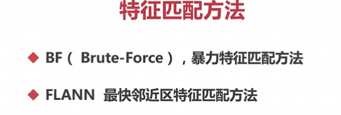

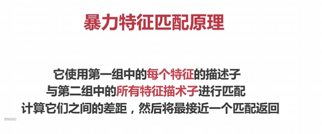

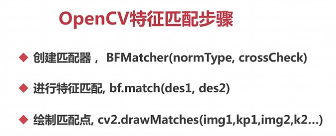

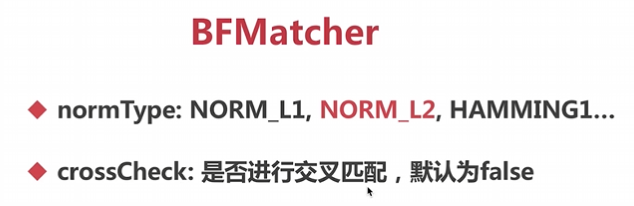

NORM_L1和NORM_L2用于SIFT和SURF

HAMMING1用于ORB

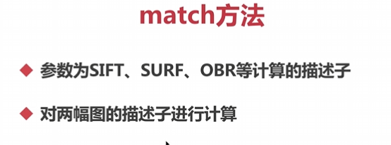

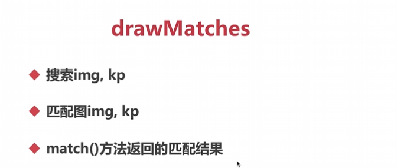

在 OpenCV 中进行特征匹配的一般步骤如下：

1. 导入所需的库和模块：

```python
import cv2
import numpy as np
```

2. 加载待匹配的两幅图像并将其转换为灰度图像：

```python
img1 = cv2.imread('image1.jpg', 0)
img2 = cv2.imread('image2.jpg', 0)
```
请注意，将图像转换为灰度图像的原因是特征描述符算法（如 SIFT、SURF、ORB 等）通常只适用于单通道的灰度图像。

3. 创建特征检测器和描述符提取器（例如 SIFT、SURF、ORB）：

```python
detector = cv2.xfeatures2d.SIFT_create()
```
你可以根据需要选择合适的特征检测器。

4. 在图像上检测关键点并计算描述符：

```python
kp1, des1 = detector.detectAndCompute(img1, None)
kp2, des2 = detector.detectAndCompute(img2, None)
```

5. 创建匹配器对象：

```python
matcher = cv2.BFMatcher(cv2.NORM_L2, crossCheck=True)
```
`cv2.NORM_L2` 是描述符之间距离的计算方法，`crossCheck=True` 表示使用互相匹配的方法来提高匹配的准确性。

6. 进行特征匹配：

```python
matches = matcher.match(des1, des2)
```

7. 对匹配结果进行排序，根据匹配距离从小到大排序：

```python
matches = sorted(matches, key=lambda x: x.distance)
```

8. 绘制匹配点：

```python
result = cv2.drawMatches(img1, kp1, img2, kp2, matches[:10], None, flags=2)
```
在上述示例中，我绘制了前 10 个匹配点，你可以根据需要更改。

9. 显示绘制结果：

```python
cv2.imshow('Matches', result)
cv2.waitKey(0)
cv2.destroyAllWindows()
```

完整代码示例：

```python
import cv2
import numpy as np

# 加载图像并转换为灰度图像
img1 = cv2.imread('image1.jpg', 0)
img2 = cv2.imread('image2.jpg', 0)

# 创建特征检测器和描述符提取器
detector = cv2.xfeatures2d.SIFT_create()

# 检测关键点并计算描述符
kp1, des1 = detector.detectAndCompute(img1, None)
kp2, des2 = detector.detectAndCompute(img2, None)

# 创建匹配器对象
matcher = cv2.BFMatcher(cv2.NORM_L2, crossCheck=True)

# 进行特征匹配
matches = matcher.match(des1, des2)

# 对匹配结果进行排序
matches = sorted(matches, key=lambda x: x.distance)

# 绘制匹配点
result = cv2.drawMatches(img1, kp1, img2, kp2, matches[:10], None, flags=2)

# 显示绘制结果
cv2.imshow('Matches', result)
cv2.waitKey(0)
cv2.destroyAllWindows()
```

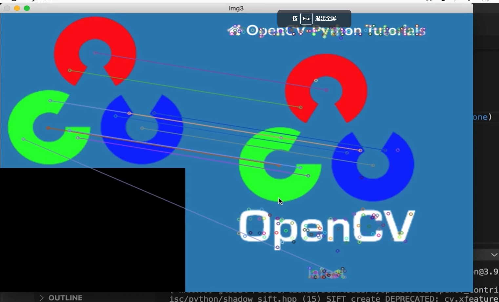

## FLANN特征匹配

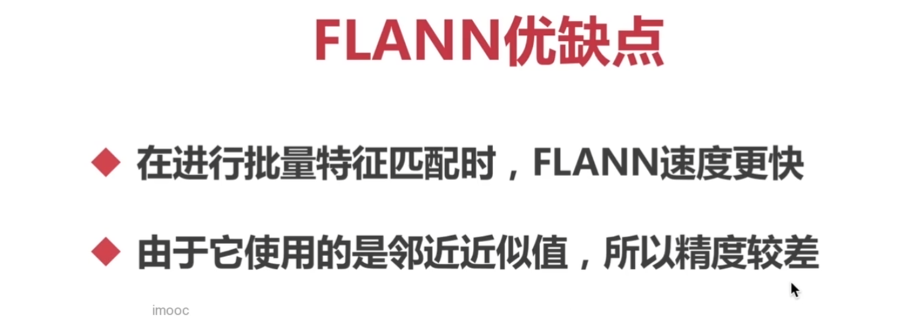

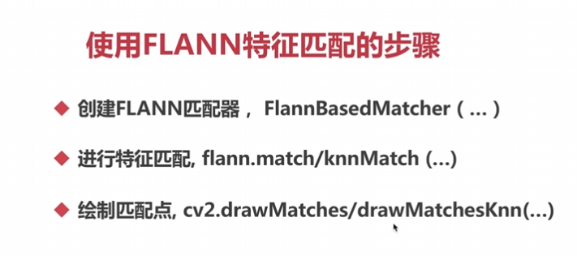

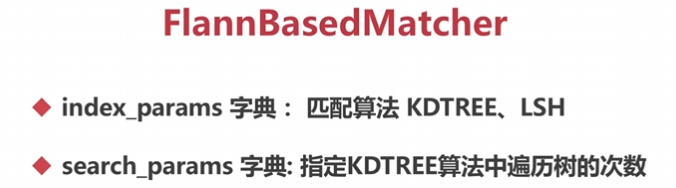

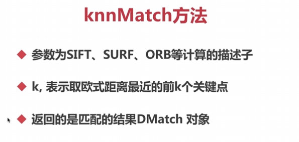

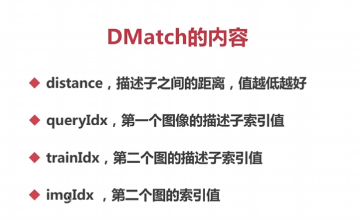

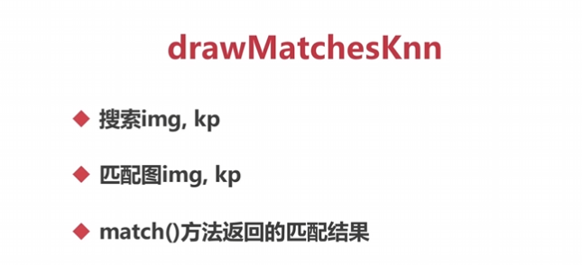

SIFT和SURF时使用KDTREE匹配算法，当使用ORB时使用LSH匹配算法

KDTREE遍历树次数一般设置为5

使用 FLANN（Fast Library for Approximate Nearest Neighbors）进行特征匹配的步骤如下：

1. 导入所需的库和模块：

```python
import cv2
import numpy as np
```

2. 加载待匹配的两幅图像并将其转换为灰度图像：

```python
img1 = cv2.imread('image1.jpg', 0)
img2 = cv2.imread('image2.jpg', 0)
```
请注意，将图像转换为灰度图像的原因是特征描述符算法（如 SIFT、SURF、ORB 等）通常只适用于单通道的灰度图像。

3. 创建特征检测器和描述符提取器（例如 SIFT、SURF、ORB）：

```python
detector = cv2.xfeatures2d.SIFT_create()
```
你可以根据需要选择特征检测器。

4. 在图像上检测关键点并计算描述符：

```python
kp1, des1 = detector.detectAndCompute(img1, None)
kp2, des2 = detector.detectAndCompute(img2, None)
```

5. 创建 FLANN 匹配器对象：

```python
index_params = dict(algorithm=FLANN_INDEX_KDTREE, trees=5)
search_params = dict(checks=50)
matcher = cv2.FlannBasedMatcher(index_params, search_params)
```
在上述示例中，我们使用 KD 树算法进行近似最近邻搜索。

6. 进行特征匹配：

```python
matches = matcher.match(des1, des2)
```
或者，你还可以使用 `knnMatch` 进行 K 近邻匹配：

```python
knn_matches = matcher.knnMatch(des1, des2, k=2)
```

7. 对匹配结果进行筛选（例如，使用 ratio test）：

```python
good_matches = []
for m, n in knn_matches:
    if m.distance < 0.7 * n.distance:
        good_matches.append(m)
```

8. 绘制匹配点：

```python
result = cv2.drawMatches(img1, kp1, img2, kp2, good_matches[:10], None, flags=2)
```
在上述示例中，我绘制了前 10 个匹配点，你可以根据需要更改。

9. 显示绘制结果：

```python
cv2.imshow('Matches', result)
cv2.waitKey(0)
cv2.destroyAllWindows()
```

完整代码示例：

```python
import cv2
import numpy as np

# 加载图像并转换为灰度图像
img1 = cv2.imread('image1.jpg', 0)
img2 = cv2.imread('image2.jpg', 0)

# 创建特征检测器和描述符提取器
detector = cv2.xfeatures2d.SIFT_create()

# 检测关键点并计算描述符
kp1, des1 = detector.detectAndCompute(img1, None)
kp2, des2 = detector.detectAndCompute(img2, None)

# 创建 FLANN 匹配器对象
index_params = dict(algorithm=FLANN_INDEX_KDTREE, trees=5)
search_params = dict(checks=50)
matcher = cv2.FlannBasedMatcher(index_params, search_params)

# 进行特征匹配
matches = matcher.match(des1, des2)

# 对匹配结果进行筛选
good_matches = []
for m in matches:
    if m.distance < 0.7 * n.distance:
        good_matches.append(m)

# 绘制匹配点
result = cv2.drawMatches(img1, kp1, img2, kp2, good_matches[:10], None, flags=2)

# 显示绘制结果
cv2.imshow('Matches', result)
cv2.waitKey(0)
cv2.destroyAllWindows()
```

## 图像查找

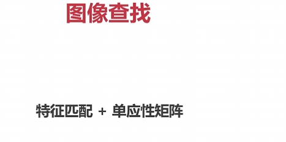

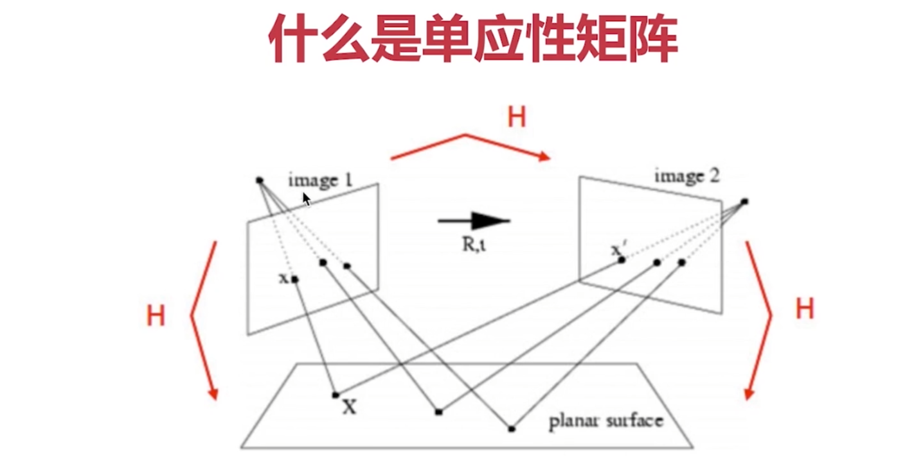
单应性矩阵（Homography Matrix）是计算机视觉中的一种数学工具，用于描述在二维平面上两个图像之间的投影关系。它是一个3x3的矩阵，可以将一个图像中的点投影到另一个图像上的对应点。

单应性矩阵表示了两个平面之间的映射关系，其中一个平面可以被看作是参考平面，另一个平面可以被看作是目标平面。当两个平面之间的投影关系可以由一个单应性矩阵表示时，可以使用该矩阵进行图像配准、图像拼接、虚拟现实等应用。

在计算机视觉中，通过对参考平面和目标平面上的对应点进行匹配，可以求解出单应性矩阵。常见的方法是通过最小二乘法进行估计，从而找到满足匹配点关系的最优单应性矩阵。

单应性矩阵可以通过相机标定、图像配准、平面检测等应用中得到，并且在许多计算机视觉任务中都是一个重要的工具。

**单应性矩阵至少要四个点才能进行计算**


在图像查找中，特征匹配和单应性矩阵是常用的技术组合。以下是一个使用特征匹配和单应性矩阵进行图像查找的代码示例：

```python
import cv2
import numpy as np

# 加载图像并转换为灰度图像
img1 = cv2.imread('image1.jpg', 0)
img2 = cv2.imread('image2.jpg', 0)

# 创建特征检测器和描述符提取器
detector = cv2.SIFT_create()

# 检测关键点并计算描述符
kp1, des1 = detector.detectAndCompute(img1, None)
kp2, des2 = detector.detectAndCompute(img2, None)

# 创建 FLANN 匹配器对象
matcher = cv2.DescriptorMatcher_create(cv2.DescriptorMatcher_FLANNBASED)

# 特征匹配
matches = matcher.knnMatch(des1, des2, k=2)

# 筛选匹配结果
good_matches = []
for m, n in matches:
    if m.distance < 0.7 * n.distance:
        good_matches.append(m)

# 绘制匹配点
result = cv2.drawMatches(img1, kp1, img2, kp2, good_matches, None, flags=2)

# 获取匹配点对应的源点
src_pts = np.float32([kp1[m.queryIdx].pt for m in good_matches]).reshape(-1, 1, 2)

# 获取匹配点对应的目标点
dst_pts = np.float32([kp2[m.trainIdx].pt for m in good_matches]).reshape(-1, 1, 2)

# 计算单应性矩阵
H, mask = cv2.findHomography(src_pts, dst_pts, cv2.RANSAC, 5.0)

# 应用单应性矩阵进行图像变换
warped_img = cv2.warpPerspective(img1, H, (img2.shape[1], img2.shape[0]))

# 显示结果
cv2.imshow('Matches', result)
cv2.imshow('Warped Image', warped_img)
cv2.waitKey(0)
cv2.destroyAllWindows()
```

在上述示例中，我们首先通过特征检测器和描述符提取器检测图像中的关键点并计算描述符。然后使用特征匹配器（FLANN 匹配器）对两幅图像的描述符进行匹配，筛选出较好的匹配点。接下来，利用获取的匹配点的源点和目标点，使用 `cv2.findHomography()` 计算单应性矩阵。最后，可以利用单应性矩阵将源图像进行变换，使其与目标图像对齐。

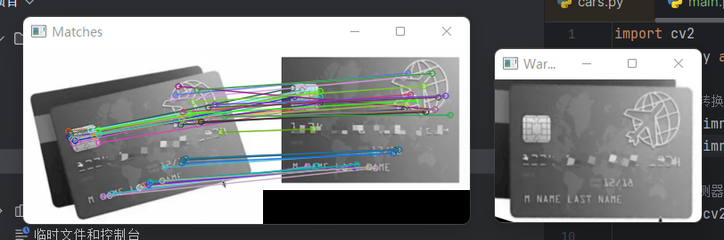

## 图像拼接

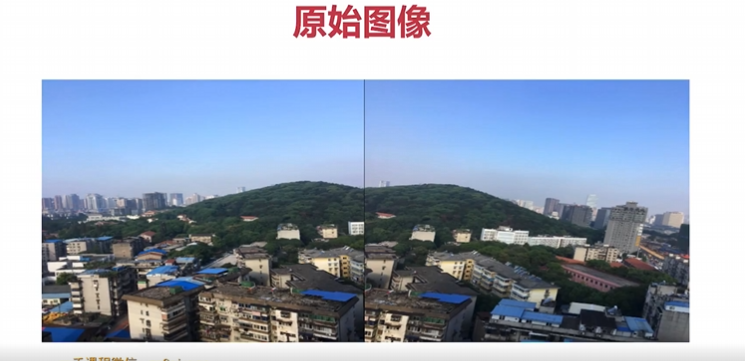

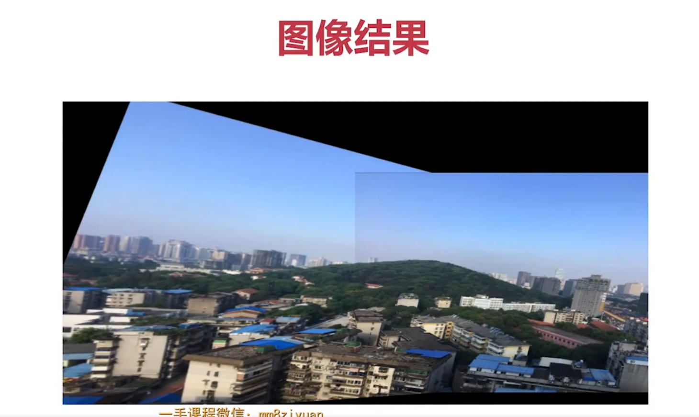

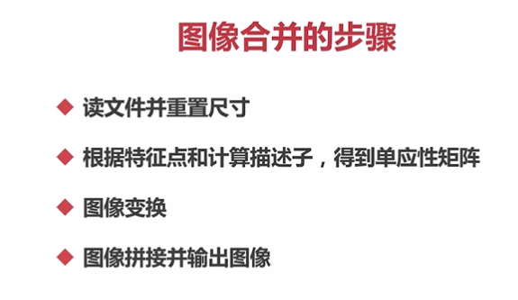

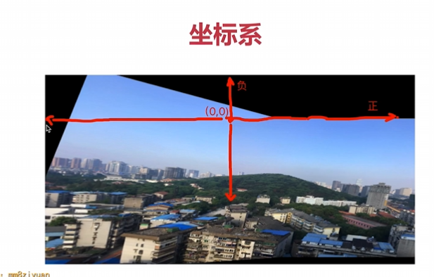

超过（0，0）点不显示

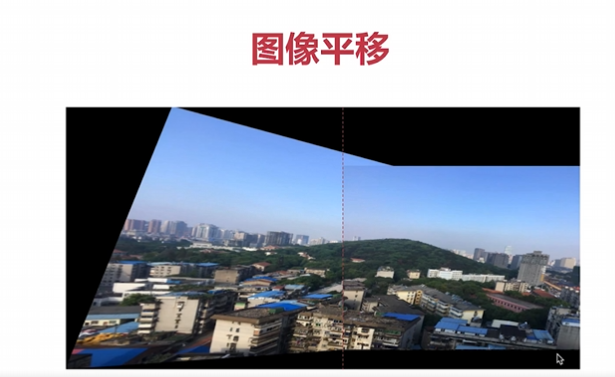

图像合并的步骤通常涉及以下几个步骤：

1. 读取文件并重置尺寸：首先，读取要合并的图像文件，并对它们进行必要的预处理。这通常包括调整图像的大小和比例，以便它们在后续的步骤中能够正确对齐。
2. 特征点检测和计算描述子：使用特征点检测算法，如SIFT、SURF、ORB等，在每个图像中找到关键的特征点，并计算每个特征点的描述子。这些特征点和描述子将用于后面的特征匹配。
3. 计算单应性矩阵：借助特征点的匹配，以及根据匹配点的坐标计算得到的对应关系，可以使用RANSAC或最小二乘法等方法计算出单应性矩阵。单应性矩阵描述了两个图像之间的几何投影关系。
4. 图像变换：根据计算得到的单应性矩阵，对其中一个图像进行透视变换。通过透视变换，可以使得两个图像在视觉上对齐。
5. 图像拼接并输出图像：将经过透视变换后的图像与另一个图像进行重叠拼接。可以通过调整像素值或者利用混合技术，将两个图像进行融合，使得拼接后的图像看起来平滑自然。最后，输出合并后的图像结果。

以下是一个基于OpenCV库的图像合并的具体示例代码：

```python
import cv2
import numpy as np


def stitch_image(img1, img2, H):
    # 1. 获得每张图片的四个角点
    # 2. 对图片进行变换（单应性矩阵使图进行旋转，平移）
    # 3. 创建一张大图，将两张图拼接到一起
    # 4. 将结果输出

    # 获得原始图的高/宽，shape有高，宽，通道数三个参数
    h1, w1 = img1.shape[:2]#获取前两个参数
    h2, w2 = img2.shape[:2]
#第一，第二张图的四个角点，同时变换成浮点型，然后用reshape（），-1代表x是（任意的行）任意值，1代表一列的y，2表示有两个元素所以是2
#最后一个值 2 是表示每个元素由两个值组成，即每个点坐标都有 x 和 y 两个值。
    img1_dims = np.float32([[0, 0], [0, h1], [w1, h1], [w1, 0]]).reshape(-1, 1, 2) 
    img2_dims = np.float32([[0, 0], [0, h2], [w2, h2], [w2, 0]]).reshape(-1, 1, 2)

    img1_transform = cv2.perspectiveTransform(img1_dims, H)

    # print(img1_dims)
    # print(img2_dims)
    # print(img1_transform)

    result_dims = np.concatenate((img2_dims, img1_transform), axis=0)
    # print(result_dims)

    [x_min, y_min] = np.int32(result_dims.min(axis=0).ravel() - 0.5)
    [x_max, y_max] = np.int32(result_dims.max(axis=0).ravel() + 0.5)

    # 平移的距离
    transform_dist = [-x_min, -y_min]

    # [1, 0, dx]
    # [0, 1, dy]
    # [0, 0, 1 ]
    transform_array = np.array([[1, 0, transform_dist[0]],
                                [0, 1, transform_dist[1]],
                                [0, 0, 1]])

    result_img = cv2.warpPerspective(img1, transform_array.dot(H), (x_max - x_min, y_max - y_min))

    result_img[transform_dist[1]:transform_dist[1] + h2,
    transform_dist[0]:transform_dist[0] + w2] = img2

    return result_img


def get_homo(img1, img2):
    # 1. 创建特征转换对象
    # 2. 通过特征转换对象获得特征点和描述子
    # 3. 创建特征匹配器
    # 4. 进行特征匹配
    # 5. 过滤特征，找出有效的特征匹配点

    sift = cv2.xfeatures2d.SIFT_create()

    k1, d1 = sift.detectAndCompute(img1, None)
    k2, d2 = sift.detectAndCompute(img2, None)

    # 创建特征匹配器
    bf = cv2.BFMatcher()
    matches = bf.knnMatch(d1, d2, k=2)

    # 过滤特征，找出有效的特征匹配点
    verify_ratio = 0.8
    verify_matches = []
    for m1, m2 in matches:
        if m1.distance < 0.8 * m2.distance:
            verify_matches.append(m1)

    min_matches = 8
    if len(verify_matches) > min_matches:

        img1_pts = []
        img2_pts = []

        for m in verify_matches:
            img1_pts.append(k1[m.queryIdx].pt)
            img2_pts.append(k2[m.trainIdx].pt)
        # [(x1, y1), (x2, y2), ...]
        # [[x1, y1], [x2, y2], ...]

        img1_pts = np.float32(img1_pts).reshape(-1, 1, 2)
        img2_pts = np.float32(img2_pts).reshape(-1, 1, 2)
        H, mask = cv2.findHomography(img1_pts, img2_pts, cv2.RANSAC, 5.0)
        return H

    else:
        print('err: Not enough matches!')
        exit()

if __name__ == '__main__':
    # 第一步，读取文件，将图片设置成一样大小640x480
    # 第二步，找特征点，描述子，计算单应性矩阵
    # 第三步，根据单应性矩阵对图像进行变换，然后平移
    # 第四步，拼接并输出最终结果

    # 读取两张图片
    img1 = cv2.imread('1.png')
    img2 = cv2.imread('2.png')

    # 将两张图片设置成同样大小
    img1 = cv2.resize(img1, (640, 480))
    img2 = cv2.resize(img2, (640, 480))

    inputs = np.hstack((img1, img2))

    # 获得单应性矩阵
    H = get_homo(img1, img2)

    # 进行图像拼接
    result_image = stitch_image(img1, img2, H)

    cv2.imshow('input img', result_image)
    cv2.waitKey()
```

请注意，上述示例中的图像尺寸和参数值是举例用的，并不适用于所有情况。具体的应用场景中还需要根据实际需求进行调整和优化。

`cv2.perspectiveTransform` 是 OpenCV 库中的一个函数，用于应用透视变换到给定的一组二维点。

在您提供的代码中，`img1_transform` 是通过将 `img1_dims` 应用透视变换 `H` 得到的结果。`img1_dims` 是一个二维数组，其中包含了一组点的坐标。

透视变换是一种将一个平面上的点映射到另一个平面上的点的变换方式。变换的结果可以用于实现图像的旋转、平移、缩放、畸变校正等操作。

`cv2.perspectiveTransform` 函数的第一个参数是需要进行透视变换的点集，它的形状应为 `(N, 1, 2)`，其中 `N` 是点的数量，每个点由两个值组成。第二个参数 `H` 是透视变换的矩阵，它是根据变换所需的参数计算得到的。

通过调用 `cv2.perspectiveTransform(img1_dims, H)`，可以将 `img1_dims` 中的点按照 `H` 定义的透视变换进行变换，得到新的坐标。这些新的坐标保存在 `img1_transform` 中，它的形状和 `img1_dims` 相同。