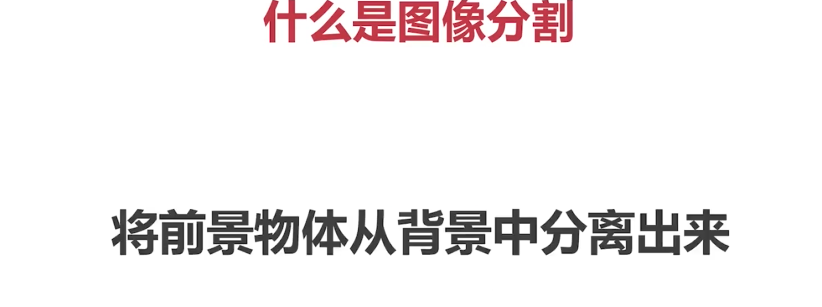

# 图像分割的基本概念




## 分水岭法


 


分水岭法是一种图像分割算法，用于将图像分割成多个不重叠的区域，这些区域代表图像中的不同物体或目标。

分水岭法的原理基于图像中的亮度和颜色信息。它将图像看作是地形图，将亮度较高的区域看作是山峰，而亮度较低的区域看作是低谷。通过向低谷注水，不同低谷之间的水流进行相互影响、合并或分割，从而得到最终的分割结果。

在分水岭算法中，首先需要为图像定义一个标记图像，其中不同的标记用来表示前景、背景等不同的目标或区域。然后，根据图像中的亮度和颜色信息，使用分水岭算法对标记图像进行处理。分水岭算法会根据像素之间的相似性和连接性，逐步进行注水、流动和分割的过程，最终形成不重叠的分割区域。

在OpenCV中，可以使用 `cv2.watershed` 函数来应用分水岭算法进行图像分割。该函数接受输入图像和标记图像作为参数，并返回一个分割后的图像。标记图像中设置不同的像素值来表示不同的目标或区域，在分水岭算法中，这些像素值将被用于区分前景和背景。

具体而言，调用 `cv2.watershed(img, marker)` 函数，其中 `img` 是输入图像，`marker` 是标记图像。标记图像中的像素值可以根据需要设置为不同的值，以区分前景、背景等。函数将根据分水岭算法对标记图像和输入图像进行处理，并返回一个分割后的图像。

当使用分水岭算法进行图像分割时，首先需要生成标记图像，标记图像用于指定前景和背景区域。通常，前景区域为白色，背景区域为黑色。可以使用不同的像素值来表示不同的目标或区域。

### 矩离变换


矩离变换（Distance Transform）是一种图像处理技术，用于计算图像中每个像素到最近目标或对象的距离。它可以用于图像分割、形状分析和边缘检测等任务。

在OpenCV中，可以使用 `cv2.distanceTransform` 函数来进行矩离变换。该函数接受输入图像、距离类型和掩膜尺寸作为参数，并返回距离变换后的图像。

```
dst = cv2.distanceTransform(img, distanceType, maskSize)
```


- `img` 是输入图像，通常为二值图像，其中非零像素表示要计算距离的目标或对象。
- `distanceType` 是距离类型，可以选择 `cv2.DIST_L1` 或 `cv2.DIST_L2`，分别表示L1范数（曼哈顿距离）和L2范数（欧几里得距离）。
- `maskSize` 是掩膜尺寸，用于指定距离变换的窗口大小。一般而言，L1范数使用3x3的窗口（`maskSize=3`），而L2范数使用5x5的窗口（`maskSize=5`）。

函数将通过计算每个像素到最近目标的距离，生成一个浮点型的距离变换图像 `dst`，其中每个像素表示该像素到最近目标的距离。距离越小，像素值越大。

### 求连通域


求连通域（Connected Components）是一种图像处理技术，用于将图像中具有相同特性的像素组合成单个连续的区域。它在图像分析、目标检测和形状识别等领域广泛应用。

在OpenCV中，可以使用 `cv2.connectedComponents` 函数来计算图像中的连通域。该函数接受输入的二值图像、连接性参数等作为参数，并返回标记图像和连通域数量。

```python
num_labels, labels = cv2.connectedComponents(img, connectivity)
```

- `img` 是输入图像，一般为二值图像，其中非零像素表示目标。
- `connectivity` 是连接性参数，用于指定像素之间的连接方式。可以选择 `4` 表示4连通，或 `8` 表示8连通。

函数返回两个值，`num_labels` 是连通域数量（包括背景），`labels` 是一个和输入图像相同大小的标记图像，其中每个像素的值表示所属连通域的标签。背景区域的标签通常为0。

通过使用连通域分析，我们可以对图像中的每个连通域进行处理和分析，例如计算连通域的面积、中心位置或者提取特定属性。


下面是一个使用OpenCV进行图像分割的具体示例：

``` python
import cv2
import numpy as np
from matplotlib import pyplot as plt

#获取背景 
# 1. 通过二值法得到黑白图片
# 2. 通过形态学获取背景

img = cv2.imread('water_coins.jpeg')
gray = cv2.cvtColor(img, cv2.COLOR_BGR2GRAY)

ret, thresh =cv2.threshold(gray, 0, 255, cv2.THRESH_BINARY_INV + cv2.THRESH_OTSU)# cv2.THRESH_OTSU加上这个表示是自适应阈值更好地去处理图像

#开运算
kernel = np.ones((3,3), np.int8)
open1 = cv2.morphologyEx(thresh, cv2.MORPH_OPEN, kernel, iterations = 2)

#膨胀
bg = cv2.dilate(open1, kernel, iterations = 1)

#获取前景物体  (矩离变换),使用open1而不是被去掉噪点的bg
dist = cv2.distanceTransform(open1, cv2.DIST_L2, 5)
#再次二值化
ret, fg = cv2.threshold(dist,0.7*dist.max(), 255, cv2.THRESH_BINARY)#最大值*0.7以上的被认为是前景

#用plt来展示前景信息，imshow只是做运算，show()才是展示
# plt.imshow(dist, cmap='gray') #gray以灰度的方式展示
# plt.show()
# exit()

#获取未知区域
#之前是浮点型的现在转成unint8型
fg = np.uint8(fg)
unknow = cv2.subtract(bg, fg)

#创建连通域
ret, marker = cv2.connectedComponents(fg)

marker = marker + 1
marker[unknow==255] = 0

#进行图像分割
result = cv2.watershed(img, marker)

img[result == -1] = [0, 0, 255]

cv2.imshow("img", img)
cv2.imshow("unknow", unknow)
cv2.imshow("fg", fg)
cv2.imshow("bg", bg)
cv2.imshow("thresh", thresh)
cv2.waitKey()
```

`cv2.subtract()` 是 OpenCV 中的函数，用于计算两个图像的差异。在给定的代码中，`bg` 和 `fg` 是两个输入图像，函数将计算它们之间的差异，并将结果保存在 `unknown` 变量中。

具体而言，`cv2.subtract()` 函数执行的操作是逐元素地计算 `bg` 和 `fg` 之间的差，并将结果保存在 `unknown` 中。该函数支持输入图像的不同数据类型（例如灰度图像、彩色图像等），并根据相应的数据类型进行减法运算。

这段代码的作用是使用图像分割的方法，对输入的图像进行前景和背景的分离。

代码首先加载图像并将其转换为灰度图像。接下来，通过二值化方法（`cv2.threshold`）将灰度图像进行阈值处理，得到背景图像。然后，使用形态学操作（`cv2.morphologyEx`）对背景图像进行开运算，以去除一些噪点。

接下来，通过距离变换（`cv2.distanceTransform`）计算得到前景图像，再次进行二值化得到前景物体。

然后，通过减法操作（`cv2.subtract`）计算得到未知区域，并对前景和背景分别进行连通域标记（`cv2.connectedComponents`），并在连通域标记中将未知区域标记为0。

最后，使用分水岭算法（`cv2.watershed`）对输入图像进行分割，将分割结果标记为-1的区域标记为红色，并显示结果图像。

代码中使用了OpenCV、NumPy和Matplotlib库，通过调用相应的函数和方法完成图像处理和结果展示的任务。

运行代码后，会弹出多个窗口显示不同的图像结果，包括原始图像、未知区域、前景、背景和阈值图像。用户可以通过按下任意键来关闭窗口。

## GrabCut（grabCut）


## GrabCut应用类的实现


根据提供的代码，看起来你正在使用 GrabCut API 来进行图像分割。GrabCut 是一种基于图像边缘和颜色信息的图像分割算法，它可以将图像分割为前景和背景。

下面是对这段代码参数的解释：

- `img`: 一个图像对象，它可能是需要进行分割的原始图像。
- `maskrect`: 一个矩形区域，用于指定要进行分割的目标区域。该矩形是一个 OpenCV 中的矩形对象，可以提供目标的大致位置。
- `bgdModel`：一个大小为 (1, 65) 的浮点数数组，用于存储背景模型的内部数据。在运行 GrabCut 算法之前，你需要创建并初始化这个数组。
- `fgdModel`：一个大小为 (1, 65) 的浮点数数组，用于存储前景模型的内部数据。在运行 GrabCut 算法之前，你需要创建并初始化这个数组。
- `5`：迭代次数。GrabCut 算法运行时会进行多次迭代，这个参数指定了迭代的次数。
- `iteratormode`：迭代模式。这个参数决定了 GrabCut 算法的迭代方式。根据 OpenCV 文档，可选的迭代模式包括 `cv2.GC_INIT_WITH_RECT`、`cv2.GC_INIT_WITH_MASK`、`cv2.GC_EVAL` 和 `cv2.GC_EVAL_FREEZE_MODEL`。
- 在 GrabCut 算法中，有两种常用的迭代模式：`GC_INIT_WITH_RECT` 和 `GC_INIT_WITH_MASK`。下面对这两种模式进行解释：
  - `GC_INIT_WITH_RECT` 模式：这种模式下，需要提供一个矩形区域（`maskrect`）作为输入，用于指定要进行分割的目标区域。通过提供矩形的左上角坐标和宽高，算法会根据该区域进行初始化，将该矩形内的像素标记为可能的前景或背景。这种模式适合用于较简单的图像分割任务，其中目标区域可以用一个矩形框大致表示。
  - `GC_INIT_WITH_MASK` 模式：这种模式下，需要提供一个掩码图像（mask）作为输入，用于精确指定前景和背景区域。掩码图像是一个与原始图像具有相同大小的二值图像，其中像素值为 0 表示背景，像素值为 1 或 3 表示前景。通过提供这样的掩码图像，算法会将标记为前景和背景的像素区域作为初始化的一部分。这种模式适合用于更复杂的图像分割任务，其中目标区域的形状比较复杂，无法用一个简单的矩形表示。
  - 第一种模式适用于截取图片的某一部分，而第二种模式是多次迭代修改的时候使用

这段代码执行的操作是，根据指定的矩形区域 `maskrect` 和初始化的背景模型 `bgdModel`、前景模型 `fgdModel`，运行 GrabCut 算法进行图像分割。迭代次数为 5，迭代模式可能是上述提到的其中一种。

```python
import cv2
import numpy as np


class App:
    flag_rect = False
    
    rect = (0, 0, 0, 0)
    startX = 0
    startY = 0

    def onmouse(self, event, x, y, flags, param):

        # 鼠标左键按下事件
        if event == cv2.EVENT_LBUTTONDOWN:
            self.flag_rect = True
            self.startX = x
            self.startY = y
            print("LBUTTIONDOWN")

        # 鼠标左键释放事件
        elif event == cv2.EVENT_LBUTTONUP:
            self.flag_rect = False
            # 绘制选择区域的矩形框
            cv2.rectangle(self.img,
                          (self.startX, self.startY),
                          (x, y),
                          (0, 0, 255),
                          3)
            # 记录选择区域的位置和大小
            self.rect = (min(self.startX, x), min(self.startY, y),
                         abs(self.startX - x),
                         abs(self.startY - y))

            print("LBUTTIONUP")

        # 鼠标移动事件
        elif event == cv2.EVENT_MOUSEMOVE:
            if self.flag_rect == True:
                self.img = self.img2.copy()
                # 根据鼠标移动的位置实时绘制选择区域的矩形框
                cv2.rectangle(self.img,
                              (self.startX, self.startY),
                              (x, y),
                              (255, 0, 0),
                              3)
            print("MOUSEMOVE")

        print("onmouse")

    def run(self):
        print("run...")

        # 创建窗口并绑定鼠标事件回调函数
        cv2.namedWindow('input')
        cv2.setMouseCallback('input', self.onmouse)

        self.img = cv2.imread('./3.png')
        self.img2 = self.img.copy()
        self.mask = np.zeros(self.img.shape[:2], dtype=np.uint8)
        self.output = np.zeros(self.img.shape, np.uint8)

        while (1):
            cv2.imshow('input', self.img)
            cv2.imshow('output', self.output)
            k = cv2.waitKey(100)
            if k == ord('q'):
                break

            if k == ord('g'):
                bgdmodel = np.zeros((1, 65), np.float64)
                fgdmodel = np.zeros((1, 65), np.float64)
                # 使用GrabCut算法将选择区域之外的像素置为背景
                cv2.grabCut(self.img2, self.mask, self.rect,
                            bgdmodel, fgdmodel,
                            1,
                            cv2.GC_INIT_WITH_RECT)
            # 根据mask提取前景并显示
            mask2 = np.where((self.mask == 1) | (self.mask == 3), 255, 0).astype('uint8') #将符合前景的全部变成黑色，不符合前景的变成白色
            self.output = cv2.bitwise_and(self.img2, self.img2, mask=mask2) #mask中黑色的覆盖原来的彩色，如果是白色则不覆盖
App().run()
```

`bitwise_and`是OpenCV库中的一个按位与运算函数。它用于对两个输入数组的对应元素进行逐位的与运算，并返回一个新的数组作为输出。

该函数的语法如下：

```
cv2.bitwise_and(src1, src2[, dst[, mask]])
```


其中，参数的含义如下：

- `src1`：第一个输入数组，可以是图像数组或标量值。
- `src2`：第二个输入数组，与`src1`具有相同的维度和类型。
- `dst`：可选参数，用于存储输出结果的目标数组，必须与`src1`和`src2`具有相同的维度和类型。
- `mask`：可选参数，作为掩码数组来指定要应用于`src1`和`src2`的区域。只有掩码中对应元素为非零时，才进行按位与运算。

下面是一个简单的例子，展示了如何使用`bitwise_and`函数对两个图像进行按位与操作：

```python
import cv2
import numpy as np

# 读取两张图像
img1 = cv2.imread('image1.jpg')
img2 = cv2.imread('image2.jpg')

# 执行按位与运算
result = cv2.bitwise_and(img1, img2)

# 显示结果
cv2.imshow('Result', result)
cv2.waitKey(0)
cv2.destroyAllWindows()
```


在上述例子中，`img1`和`img2`是两张图像，我们将它们进行按位与运算，并将结果保存在`result`变量中，然后显示结果图像。结果图像中的每个像素将等于`img1`和`img2`中对应像素的按位与结果。

## 作业

```python
import cv2
import numpy as np


class App:
    flag_rect = False

    rect = (0, 0, 0, 0)
    startX = 0
    startY = 0
    write_Do = False
    writing = False
    write_box = [] #装入绘画的点
    write_rect = (0, 0, 0, 0)
    def onmouse(self, event, x, y, flags, param):

        # 鼠标左键按下事件
        if event == cv2.EVENT_LBUTTONDOWN:
            if not self.write_Do:
                self.flag_rect = True
            self.startX = x
            self.startY = y
            print("LBUTTIONDOWN")
            print(self.write_Do,self.writing)
            print(self.flag_rect)
            if self.write_Do:
                self.writing = True
                self.img3 = self.img.copy()  # 将未绘画前的样子保留下来


        # 鼠标左键释放事件
        elif event == cv2.EVENT_LBUTTONUP:
            self.flag_rect = False
            self.writing = False
            print(self.write_Do, self.writing)
            if not self.writing and not self.write_Do:
                # 绘制选择区域的矩形框
                cv2.rectangle(self.img,
                              (self.startX, self.startY),
                              (x, y),
                              (0, 0, 255),
                              3)
                # 记录选择区域的位置和大小
                self.rect = (min(self.startX, x), min(self.startY, y),
                             abs(self.startX - x),
                             abs(self.startY - y))
            self.write_Do = True
            print("LBUTTIONUP")

        # 鼠标移动事件
        elif event == cv2.EVENT_MOUSEMOVE:
            #第一次圈选
            if self.flag_rect and not self.write_Do:
                self.img = self.img2.copy()
                # 根据鼠标移动的位置实时绘制选择区域的矩形框
                cv2.rectangle(self.img,
                              (self.startX, self.startY),
                              (x, y),
                              (255, 0, 0),
                              3)
            #修改,补充状态中
            if self.write_Do and self.writing:
                # 定义点的参数
                center = (x,y)
                self.write_box.append(center) #将所有标注的点储存起来
                radius = 3
                print(self.img2[y,x])
                for i in range(radius):
                 self.output[y,x+i] = self.img2[y,x+i] 
                 self.output[y+i, x] = self.img2[y+i, x] 
                 self.output[y, x-i] = self.img2[y, x-i] 
                 self.output[y-i, x] = self.img2[y-i, x]  
                 self.output[y+i, x+i] = self.img2[y+i, x+i]  
                 self.output[y-i, x-i] = self.img2[y-i, x-i] 
                 self.output[y+i, x-i] = self.img2[y+i, x-i]  
                 self.output[y-i, x+i] = self.img2[y-i, x+i]  
            print("MOUSEMOVE")

        print("onmouse")

    def run(self):
        print("run...")

        # 创建窗口并绑定鼠标事件回调函数
        cv2.namedWindow('input')
        cv2.namedWindow('output')
        cv2.setMouseCallback('input', self.onmouse)
        cv2.setMouseCallback('output', self.onmouse)
        self.img = cv2.imread('./3.png')
        self.img2 = self.img.copy()
        self.mask = np.zeros(self.img.shape[:2], dtype=np.uint8)
        self.output = np.zeros(self.img.shape, np.uint8)

        while (1):
            cv2.imshow('input', self.img)
            cv2.imshow('output', self.output)
            k = cv2.waitKey(100)
            if k == ord('q'):
                break

            if k == ord('g'):
                bgdmodel = np.zeros((1, 65), np.float64)
                fgdmodel = np.zeros((1, 65), np.float64)
                # 使用GrabCut算法将选择区域之外的像素置为背景
                cv2.grabCut(self.img2, self.mask, self.rect,
                            bgdmodel, fgdmodel,
                            1,
                            cv2.GC_INIT_WITH_RECT)
                # 根据mask提取前景并显示
                mask2 = np.where((self.mask == 1) | (self.mask == 3), 255, 0).astype('uint8')
                self.output = cv2.bitwise_and(self.img2, self.img2, mask=mask2)
                # 画图补充
                # 最高最低最左最右的点连线形成一个矩形该部分就被识别补充
                # 将圈出中最多的mask当作识别标志

                # 将绘画痕迹清除，并补充前景
            if k == ord('k'):
                self.img = self.img3.copy()
                # 初始化最大和最小的x和y值
                max_x = int(0)
                max_y = int(0)
                min_x = int(10000)
                min_y = int(10000)

                # 遍历所有的点坐标
                for center in self.write_box:
                    x, y = center
                    max_x = max(x, max_x)
                    max_y = max(y, max_y)
                    min_x = min(x, min_x)
                    min_y = min(y, min_y)
                # 记录选择区域的位置和大小
                self.write_rect = (int(min_x), int(min_y), int(max_x - min_x), int(max_y - min_y))
                print(int(min_x), int(min_y), int(max_x - min_x), int(max_y - min_y))
                self.write_box = []
                bgdmodel = np.zeros((1, 65), np.float64)
                fgdmodel = np.zeros((1, 65), np.float64)
                # 使用GrabCut算法将选择区域之外的像素置为背景
                self.mask = np.zeros(self.img2.shape[:2], dtype=np.uint8)
                cv2.grabCut(self.img2, self.mask, self.write_rect,
                                bgdmodel, fgdmodel,
                                1,
                                cv2.GC_INIT_WITH_RECT)
                # 根据mask提取前景并显示
                mask2 = np.where((self.mask == 1) | (self.mask == 3), 255, 0).astype('uint8')
                dst = np.where(cv2.bitwise_and(self.img2, self.img2, mask=mask2) != 0)
                #跟之前的结果和并得到结果
                self.output[dst] = self.img2[dst]
App().run()
```

## MeanShift（pyrMeanShiftFiltering）平滑处理

平滑化之后容易找到边缘


pyrMeanShiftFiltering() 是 OpenCV 提供的一个函数，用于执行均值迁移（MeanShift）图像过滤操作。该函数的参数和其含义如下：

- `img`：输入图像，通常为彩色图像。
- `sp`：空间半径，控制像素在空间上的影响范围，通常为一个正数。
- `sr`：色彩幅值，控制像素在色彩上的影响范围，通常为一个正数。
- `maxLevel`：金字塔的最大层数，用于计算平滑操作。默认值为 1。
- `termcrit`：用于设置停止条件的参数，如迭代次数、精度等。默认值为 `TermCriteria()`，即使用默认的停止条件。

`sp` 和 `sr` 这两个参数控制了均值迁移过滤器的核函数。具体来说，`sp` 决定了像素在空间上的平滑程度，而 `sr` 决定了像素在颜色上的平滑程度。较大的 `sp` 和 `sr` 值会产生更强的平滑效果。

均值迁移过滤器通过计算像素在特定空间范围内的颜色直方图，并将像素迁移到颜色密度最高的区域来实现平滑。这样，相邻的像素将具有相似的颜色，从而实现平滑的效果。

以下是一个使用 `pyrMeanShiftFiltering()` 函数进行均值迁移过滤的示例代码：

```
import cv2

# 读取输入图像
img = cv2.imread('input.jpg')

# 执行均值迁移过滤
filtered_img = cv2.pyrMeanShiftFiltering(img, 10, 50)

# 显示原始图像和过滤后的图像
cv2.imshow('Original Image', img)
cv2.imshow('Filtered Image', filtered_img)
cv2.waitKey(0)
cv2.destroyAllWindows()
```


在这个示例中，我们使用 `cv2.imread()` 函数读取名为 “input.jpg” 的输入图像。然后，我们将输入图像传递给 `pyrMeanShiftFiltering()` 函数，设置空间半径 `sp` 为 10，色彩幅值 `sr` 为 50。这将产生一个经过均值迁移过滤的图像 `filtered_img`。最后，我们使用 `cv2.imshow()` 函数显示原始图像和过滤后的图像，并使用 `cv2.waitKey()` 函数等待按下任意键来关闭窗口。

注意：请确保您在运行代码之前将示例代码中的 “input.jpg” 替换为您实际使用的图像文件路径。

这个示例演示了如何使用 `pyrMeanShiftFiltering()` 函数对图像进行均值迁移过滤。根据您的需求，您可以调整参数 `sp` 和 `sr` 的值来改变过滤效果。


```python
import cv2
import numpy as np

img = cv2.imread('key.png')

mean_img = cv2.pyrMeanShiftFiltering(img, 20, 30)

imgcanny = cv2.Canny(mean_img, 150, 300)

contours, _ = cv2.findContours(imgcanny, cv2.RETR_EXTERNAL, cv2.CHAIN_APPROX_SIMPLE)

cv2.drawContours(img, contours, -1, (0, 0, 255), 2)

cv2.imshow('img', img)
cv2.imshow('mean_img', mean_img)
cv2.imshow('canny', imgcanny)
cv2.waitKey()
```

## 背景抠除（createBackgroundSubtractorMOG2）

```
cv2.bgsegm.createBackgroundSubtractorMOG() #原版使用这个
```


`cv2.createBackgroundSubtractorMOG2()` 是一个 OpenCV 函数，用于创建一个 MOG（Mixture of Gaussians）背景建模器，以进行背景减除操作。该函数的参数和其含义如下：

- `history`：历史帧数，用于建立背景模型的帧数。较大的值意味着更长的建模时间，默认为 200。
- `nmixtures`：高斯模型数量，每个像素的背景分布会由多个高斯模型的混合表示，默认为 5。
- `backgroundRatio`：背景阈值，用于控制像素被认为是前景的最小背景模型权重。较小的值意味着更敏感的前景检测，默认为 0.7。
- `noiseSigma`：噪声标准差，用于自动降噪。较大的值意味着更大的自动降噪容忍度，默认为 0。

下面是一个示例代码，演示了如何使用 `cv2.createBackgroundSubtractorMOG()` 函数进行 MOG 背景建模和背景减除操作：

```python
import cv2
import numpy as np

cap = cv2.VideoCapture(0)
mog = cv2.bgsegm.createBackgroundSubtractorMOG()

while(True):
    ret, frame = cap.read()
    fgmask = mog.apply(frame)

    cv2.imshow('img',fgmask)

    k = cv2.waitKey(10)
    if k ==27:
        break

cap.release()
cv2.destroyAllWindows()
```

在这个示例中，我们首先使用 `cv2.createBackgroundSubtractorMOG()` 函数创建了一个 MOG 背景建模器 `bg_subtractor`。然后，我们打开一个视频流 `video`，并循环读取每一帧。对于每一帧，我们将其传递给背景建模器进行背景减除，得到一个二值的前景掩码图像 `mask`。最后，我们使用 `cv2.imshow()` 函数显示原始帧和背景减除的结果，然后通过按下 'q' 键来退出循环。

请确保在运行代码之前将示例代码中的 "input.mp4" 替换为您实际使用的视频文件路径。

希望这个示例能帮助您理解如何使用 `cv2.createBackgroundSubtractorMOG()` 函数进行 MOG 背景建模和背景减除操作。如果您有任何其他问题，请随时提问。

## MOG2


好处是可以计算出阴影部分，但多了很多噪点

`cv2.createBackgroundSubtractorMOG2()` 是一个 OpenCV 函数，用于创建一个 MOG2（Mixture of Gaussians）背景建模器，以进行背景减除操作。该函数的参数和其含义如下：

- `history`：历史帧数，用于建立背景模型的帧数。较大的值意味着更长的建模时间，默认为 500 毫秒。
- `detectShadows`：是否检测阴影。如果设置为 True，则算法将标记阴影像素，默认为 True。

下面是一个示例代码，演示了如何使用 `cv2.createBackgroundSubtractorMOG2()` 函数进行 MOG2 背景建模和背景减除操作：

```python
import cv2

# 创建 MOG2 背景建模器
bg_subtractor = cv2.createBackgroundSubtractorMOG2(history=500, detectShadows=True)

# 打开视频流
video = cv2.VideoCapture('input.mp4')

while True:
    # 从视频中读取一帧
    ret, frame = video.read()
    
    if not ret:
        break
    
    # 使用背景建模器进行背景减除
    mask = bg_subtractor.apply(frame)
    
    # 显示原始帧和背景减除结果
    cv2.imshow('Original Frame', frame)
    cv2.imshow('Background Subtraction Result', mask)
    
    # 按下 'q' 键退出循环
    if cv2.waitKey(1) & 0xFF == ord('q'):
        break

# 释放视频流和窗口
video.release()
cv2.destroyAllWindows()
```

在这个示例中，我们首先使用 `cv2.createBackgroundSubtractorMOG2()` 函数创建了一个 MOG2 背景建模器 `bg_subtractor`。然后，我们打开一个视频流 `video`，并循环读取每一帧。对于每一帧，我们将其传递给背景建模器进行背景减除，得到一个二值的前景掩码图像 `mask`。最后，我们使用 `cv2.imshow()` 函数显示原始帧和背景减除的结果，然后通过按下 'q' 键来退出循环。

请确保在运行代码之前将示例代码中的 "input.mp4" 替换为您实际使用的视频文件路径。

希望这个示例能帮助您理解如何使用 `cv2.createBackgroundSubtractorMOG2()` 函数进行 MOG2 背景建模和背景减除操作。如果您有任何其他问题，请随时提问。

## GMG


感觉可以用来做直播去除背景


`cv2.bgsegm.createBackgroundSubtractorGMG()` 是一个 OpenCV 函数，用于创建一个 GMG（Gradient-based Moving Object Detection）背景建模器，以进行背景减除操作。该函数的参数和其含义如下：

- `initializationFrames`：初始帧数，用于建立背景模型的帧数，默认为 120。

下面是一个示例代码，演示了如何使用 `cv2.createBackgroundSubtractorGMG()` 函数进行 GMG 背景建模和背景减除操作：

```python
import cv2

# 创建 GMG 背景建模器
bg_subtractor = cv2.bgsegm.createBackgroundSubtractorGMG(initializationFrames=120)

# 打开视频流
video = cv2.VideoCapture('input.mp4')

while True:
    # 从视频中读取一帧
    ret, frame = video.read()
    
    if not ret:
        break
    
    # 使用背景建模器进行背景减除
    mask = bg_subtractor.apply(frame)
    
    # 显示原始帧和背景减除结果
    cv2.imshow('Original Frame', frame)
    cv2.imshow('Background Subtraction Result', mask)
    
    # 按下 'q' 键退出循环
    if cv2.waitKey(1) & 0xFF == ord('q'):
        break

# 释放视频流和窗口
video.release()
cv2.destroyAllWindows()
```

在这个示例中，我们首先使用 `cv2.createBackgroundSubtractorGMG()` 函数创建了一个 GMG 背景建模器 `bg_subtractor`。然后，我们打开一个视频流 `video`，并循环读取每一帧。对于每一帧，我们将其传递给背景建模器进行背景减除，得到一个二值的前景掩码图像 `mask`。最后，我们使用 `cv2.imshow()` 函数显示原始帧和背景减除的结果，然后通过按下 'q' 键来退出循环。

请确保在运行代码之前将示例代码中的 "input.mp4" 替换为您实际使用的视频文件路径。

希望这个示例能帮助您理解如何使用 `cv2.createBackgroundSubtractorGMG()` 函数进行 GMG 背景建模和背景减除操作。如果您有任何其他问题，请随时提问。

## 图片修复(inpaint)


`inpaint` 是一个图像修复的函数，用于将图像中的缺失或损坏的区域恢复或填补。它的调用方式如下：

```python
output = cv2.inpaint(img, mask, inpaintRadius, flags)
```

函数的参数和其含义如下：

- `img`：输入图像，可以是灰度图像或彩色图像。

- `mask`：指示需要修复的区域的蒙版图像，与输入图像 `img` 具有相同的尺寸，其中白色区域表示需要修复的区域。

- `inpaintRadius`：每个点的圆形邻域半径，用于确定修复像素的邻域范围。

- `flags`：修复算法的标志，有两个可选值：
  - `cv2.INPAINT_NS`：使用基于Navier-Stokes方程的修复算法。
  
  - `cv2.INPAINT_TELEA`：使用基于Telea的修复算法。
  
    当我们需要修复图像中的缺失或损坏区域时，可以使用 `cv2.inpaint()` 函数。这个函数可以根据我们提供的信息，将缺失的区域填补上。
  
    `cv2.INPAINT_NS` 是一种修复算法，它使用了一组称为 Navier-Stokes 方程的数学模型来进行修复。这种算法更注重保持图像的纹理和细节。
  
    而 `cv2.INPAINT_TELEA` 是另一种修复算法，它基于 Telea 的方法。这种算法则更注重处理图像的边界和细节。
  
    要选择使用哪种算法，可以根据具体的需求和图像的特点来决定。两种算法都可以得到不错的修复效果，但可能会在某些特定图像上表现出略微不同的效果。
  
  构造掩码mask:
  
  

示例代码如下所示：

```python
import cv2
import numpy as np

# 读取图像
img = cv2.imread('input.jpg')

# 创建蒙版图像，用于指示需要修复的区域
mask = np.zeros(img.shape[:2], np.uint8)
mask[200:400, 300:500] = 255

# 调用图像修复函数
output = cv2.inpaint(img, mask, 3, cv2.INPAINT_TELEA)

# 显示结果图像
cv2.imshow('Input Image', img)
cv2.imshow('Mask', mask)
cv2.imshow('Output Image', output)
cv2.waitKey(0)
cv2.destroyAllWindows()
```

在这个示例中，我们首先读取了一个图像 `input.jpg`。然后，我们创建了一个蒙版图像 `mask`，在图像中指定了需要修复的区域。接下来，我们使用 `cv2.inpaint()` 函数将输入图像 `img` 中的指定区域进行修复，并将修复后的图像保存在 `output` 变量中。最后，我们使用 `cv2.imshow()` 函数显示输入图像、蒙版和修复后的图像。

请确保在运行代码之前将示例代码中的 "input.jpg" 替换为您实际使用的图像文件路径。

希望这个示例能帮助您理解如何使用 `cv2.inpaint()` 函数进行图像修复。如果您有任何其他问题，请随时提问。
