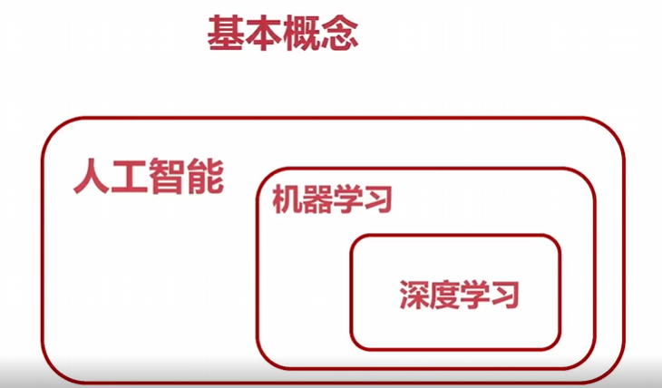
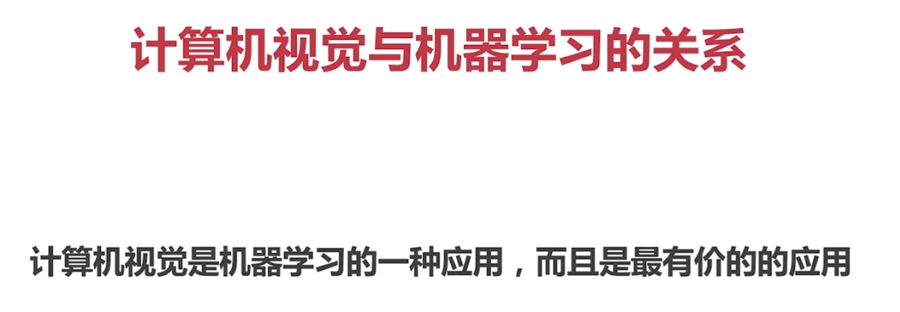
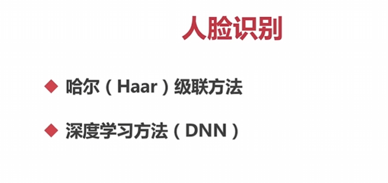
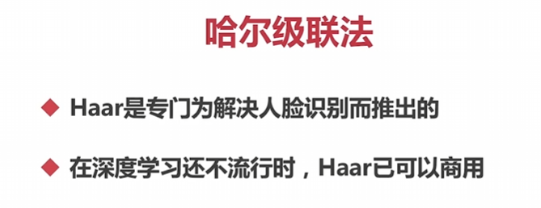
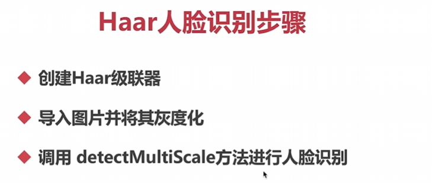
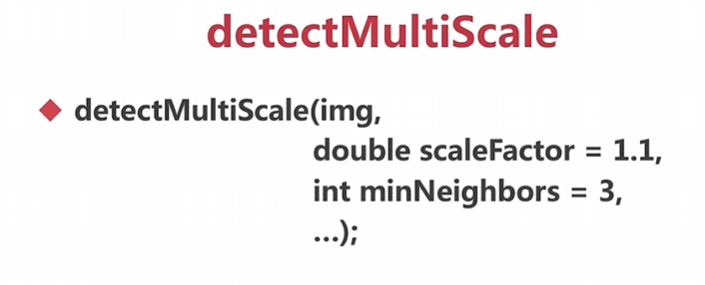
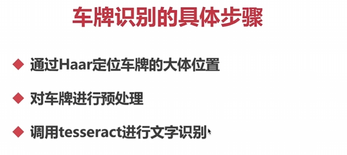
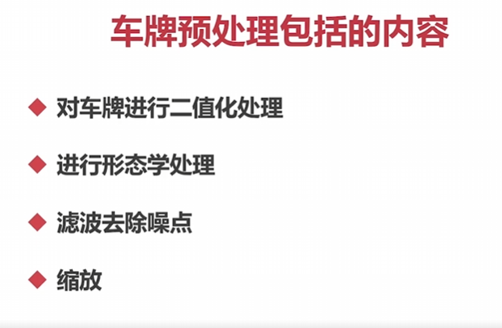
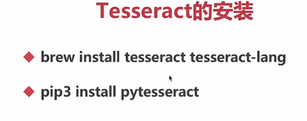

## 机器学习





## 通过Haar进行人脸识别









Haar人脸识别的步骤通常包括以下几个阶段：

1. 创建Haar级联器：首先，需要创建一个Haar级联器，它是一个训练好的分类器模型，用于识别人脸。这个级联器包含了大量的Haar特征，可以用来检测图像中的人脸。

2. 导入图片并将其灰度化：将需要进行人脸识别的图像导入，并将其转换为灰度图像。灰度化可以降低计算复杂度，并且在人脸识别中通常不需要使用彩色信息。

3. 调用 `detectMultiScale` 方法进行人脸识别：使用创建的Haar级联器调用 `detectMultiScale` 方法进行人脸识别。该方法将输入图像和其他参数传递给级联器，并返回检测到的人脸的边界框（矩形）的列表。

4. `detectMultiScale` 方法的参数：
   - `img`：灰度图像，也就是要进行人脸识别的图像。
   - `scaleFactor`：用于指定每个图像尺度的缩放比例。较小的比例可以检测到更多的细节，但也会增加计算量。一般建议使用1.1作为默认值。
   - `minNeighbors`：用于指定在输出结果中保留检测到的人脸的最小邻居数量。较大的值可以过滤掉较小的人脸区域，但也可能会忽略一些真实的人脸。一般建议使用3作为默认值。

```python
import cv2
import numpy as np

#第一步，创建Haar级联器
facer = cv2.CascadeClassifier('./haarcascades/haarcascade_frontalface_default.xml')
eye = cv2.CascadeClassifier('./haarcascades/haarcascade_eye.xml')
mouth = cv2.CascadeClassifier('./haarcascades/haarcascade_mcs_mouth.xml')
nose = cv2.CascadeClassifier('./haarcascades/haarcascade_mcs_nose.xml')

#第二步，导入人脸识别的图片并将其灰度化
img = cv2.imread('./p3.png')

#第三步，进行人脸识别
#[[x,y,w,h]]
gray = cv2.cvtColor(img, cv2.COLOR_BGR2GRAY)

#检测出的人脸上再检测眼睛
faces = facer.detectMultiScale(gray, 1.1, 3)
i = 0
j = 0
for (x,y,w,h) in faces:
    cv2.rectangle(img, (x, y), (x+w, y+h), (0, 0, 255), 2)
    roi_img = img[y:y+h, x:x+w]
    eyes = eye.detectMultiScale(roi_img, 1.1, 3)
    for (x,y,w,h) in eyes:
        cv2.rectangle(roi_img, (x, y), (x+w, y+h), (0, 255, 0), 2)
        roi_eye=roi_img[y:y+h, x:x+w]
        eyename = 'eye' + str(j)
        j = j+1 
        cv2.imshow(eyename, roi_eye)

    i = i+1
    winname = 'face' + str(i)
    cv2.imshow(winname, roi_img)


# mouths = mouth.detectMultiScale(gray, 1.1, 3)
# for (x,y,w,h) in mouths:
#     cv2.rectangle(img, (x, y), (x+w, y+h), (255, 0, 0), 2)

# noses = nose.detectMultiScale(gray, 1.1, 3)
# for (x,y,w,h) in noses:
#     cv2.rectangle(img, (x, y), (x+w, y+h), (255, 255, 0), 2)

cv2.imshow('img', img)

cv2.waitKey()
```

## 车牌识别







[[Introduction | tessdoc (tesseract-ocr.github.io)](https://tesseract-ocr.github.io/tessdoc/Installation.html)](https://tesseract-ocr.github.io/tessdoc/Installation.html)

下载地址：

[Home · UB-Mannheim/tesseract Wiki (github.com)](https://github.com/UB-Mannheim/tesseract/wiki)

也可以直接这样，一样的效果：

```
winget install UB-Mannheim.TesseractOCR
```

[Python OCR工具pytesseract详解 - 知乎 (zhihu.com)](https://zhuanlan.zhihu.com/p/448253254)

中文识别语言包：

[Tesseract-OCR5.0软件安装和语言包安装(Windows系统)_tesseract ocr语言包-CSDN博客](https://blog.csdn.net/juzicode00/article/details/121343486)

当涉及到使用 pytesseract 时，以下是一些常见任务的使用方法和技巧的综合介绍：

1. 安装 pytesseract：
   ```python
   pip install pytesseract
   ```

2. 导入 pytesseract：
   ```python
   import pytesseract
   ```

3. 识别图像中的文本：
   ```python
   from PIL import Image
   
   # 打开图像
   image = Image.open('image.png')
   
   # 使用 pytesseract 进行文本识别
   text = pytesseract.image_to_string(image)
   
   # 打印识别结果
   print(text)
   ```

4. 设置语言参数：
   ```python
   # 设置语言参数为英语
   text = pytesseract.image_to_string(image, lang='eng')
   # 设置中文
   pytesseract.image to string(roi,lang='chi_sim+eng')
   ```
   
5. 处理图像前的预处理：
   ```python
   from PIL import Image
   import cv2
   import numpy as np
   
   # 打开图像
   image = Image.open('image.png')
   
   # 转为灰度图像
   gray_image = image.convert('L')
   
   # 进行二值化处理
   threshold_image = gray_image.point(lambda x: 0 if x < 127 else 255, '1')
   
   # 使用 pytesseract 进行文本识别
   text = pytesseract.image_to_string(threshold_image)
   
   # 打印识别结果
   print(text)
   ```

6. 其他可选参数：
   - `config`：用于配置 pytesseract 的参数，例如图像处理方法、OEM（OCR Engine Mode）、PSM（Page Segmentation Mode）等。
   - `psm`：设置 PSM 参数以选择适当的 page segmentation 模式。

   可以通过以下方式传递 config 参数：
   ```python
   custom_config = r'--oem 3 --psm 6'
   text = pytesseract.image_to_string(image, config=custom_config)
   ```

这里只是一些基础的用法示例，pytesseract 功能强大且灵活，有更多高级用法可以去 pytesseract 的文档或官方网站上查阅进一步了解。希望这些信息对你有帮助！如果有任何其他问题，请随时提问。

