## 机器学习


## 通过Haar进行人脸识别


Haar人脸识别的步骤通常包括以下几个阶段：

1. 创建Haar级联器：首先，需要创建一个Haar级联器，它是一个训练好的分类器模型，用于识别人脸。这个级联器包含了大量的Haar特征，可以用来检测图像中的人脸。

2. 导入图片并将其灰度化：将需要进行人脸识别的图像导入，并将其转换为灰度图像。灰度化可以降低计算复杂度，并且在人脸识别中通常不需要使用彩色信息。

3. 调用 `detectMultiScale` 方法进行人脸识别：使用创建的Haar级联器调用 `detectMultiScale` 方法进行人脸识别。该方法将输入图像和其他参数传递给级联器，并返回检测到的人脸的边界框（矩形）的列表。

4. `detectMultiScale` 方法的参数：
   - `img`：灰度图像，也就是要进行人脸识别的图像。
   - `scaleFactor`：用于指定每个图像尺度的缩放比例。较小的比例可以检测到更多的细节，但也会增加计算量。一般建议使用1.1作为默认值。
   - `minNeighbors`：用于指定在输出结果中保留检测到的人脸的最小邻居数量。较大的值可以过滤掉较小的人脸区域，但也可能会忽略一些真实的人脸。一般建议使用3作为默认值。

```python
import cv2
import numpy as np

#第一步，创建Haar级联器
facer = cv2.CascadeClassifier('./haarcascades/haarcascade_frontalface_default.xml')
eye = cv2.CascadeClassifier('./haarcascades/haarcascade_eye.xml')
mouth = cv2.CascadeClassifier('./haarcascades/haarcascade_mcs_mouth.xml')
nose = cv2.CascadeClassifier('./haarcascades/haarcascade_mcs_nose.xml')

#第二步，导入人脸识别的图片并将其灰度化
img = cv2.imread('./p3.png')

#第三步，进行人脸识别
#[[x,y,w,h]]
gray = cv2.cvtColor(img, cv2.COLOR_BGR2GRAY)

#检测出的人脸上再检测眼睛
faces = facer.detectMultiScale(gray, 1.1, 3)
i = 0
j = 0
for (x,y,w,h) in faces:
    cv2.rectangle(img, (x, y), (x+w, y+h), (0, 0, 255), 2)
    roi_img = img[y:y+h, x:x+w]
    eyes = eye.detectMultiScale(roi_img, 1.1, 3)
    for (x,y,w,h) in eyes:
        cv2.rectangle(roi_img, (x, y), (x+w, y+h), (0, 255, 0), 2)
        roi_eye=roi_img[y:y+h, x:x+w]
        eyename = 'eye' + str(j)
        j = j+1 
        cv2.imshow(eyename, roi_eye)

    i = i+1
    winname = 'face' + str(i)
    cv2.imshow(winname, roi_img)


# mouths = mouth.detectMultiScale(gray, 1.1, 3)
# for (x,y,w,h) in mouths:
#     cv2.rectangle(img, (x, y), (x+w, y+h), (255, 0, 0), 2)

# noses = nose.detectMultiScale(gray, 1.1, 3)
# for (x,y,w,h) in noses:
#     cv2.rectangle(img, (x, y), (x+w, y+h), (255, 255, 0), 2)

cv2.imshow('img', img)

cv2.waitKey()
```

## 车牌识别


[[Introduction | tessdoc (tesseract-ocr.github.io)](https://tesseract-ocr.github.io/tessdoc/Installation.html)](https://tesseract-ocr.github.io/tessdoc/Installation.html)

下载地址：

[Home · UB-Mannheim/tesseract Wiki (github.com)](https://github.com/UB-Mannheim/tesseract/wiki)

也可以直接这样，一样的效果：

```
winget install UB-Mannheim.TesseractOCR
```

[Python OCR工具pytesseract详解 - 知乎 (zhihu.com)](https://zhuanlan.zhihu.com/p/448253254)

中文识别语言包：

[Tesseract-OCR5.0软件安装和语言包安装(Windows系统)_tesseract ocr语言包-CSDN博客](https://blog.csdn.net/juzicode00/article/details/121343486)

当涉及到使用 pytesseract 时，以下是一些常见任务的使用方法和技巧的综合介绍：

1. 安装 pytesseract：
   ```python
   pip install pytesseract
   ```

2. 导入 pytesseract：
   ```python
   import pytesseract
   ```

3. 识别图像中的文本：
   ```python
   from PIL import Image
   
   # 打开图像
   image = Image.open('image.png')
   
   # 使用 pytesseract 进行文本识别
   text = pytesseract.image_to_string(image)
   
   # 打印识别结果
   print(text)
   ```

4. 设置语言参数：
   ```python
   # 设置语言参数为英语
   text = pytesseract.image_to_string(image, lang='eng')
   # 设置中文
   pytesseract.image to string(roi,lang='chi_sim+eng')
   ```
   
5. 处理图像前的预处理：
   ```python
   from PIL import Image
   import cv2
   import numpy as np
   
   # 打开图像
   image = Image.open('image.png')
   
   # 转为灰度图像
   gray_image = image.convert('L')
   
   # 进行二值化处理
   threshold_image = gray_image.point(lambda x: 0 if x < 127 else 255, '1')
   
   # 使用 pytesseract 进行文本识别
   text = pytesseract.image_to_string(threshold_image)
   
   # 打印识别结果
   print(text)
   ```

6. 其他可选参数：
   - `config`：用于配置 pytesseract 的参数，例如图像处理方法、OEM（OCR Engine Mode）、PSM（Page Segmentation Mode）等。
   - `psm`：设置 PSM 参数以选择适当的 page segmentation 模式。

   可以通过以下方式传递 config 参数：
   ```python
   custom_config = r'--oem 3 --psm 6'
   text = pytesseract.image_to_string(image, config=custom_config)
   ```

这里只是一些基础的用法示例，pytesseract 功能强大且灵活，有更多高级用法可以去 pytesseract 的文档或官方网站上查阅进一步了解。希望这些信息对你有帮助！如果有任何其他问题，请随时提问。

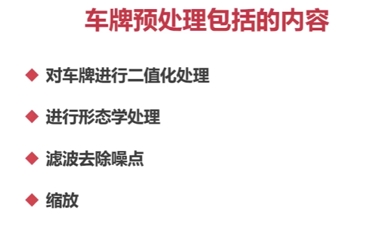

## 深度学习基础知识


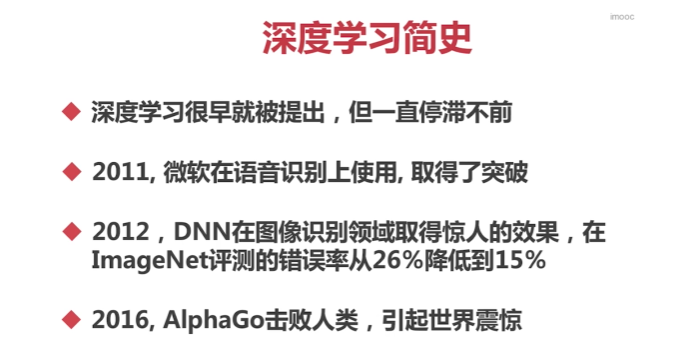

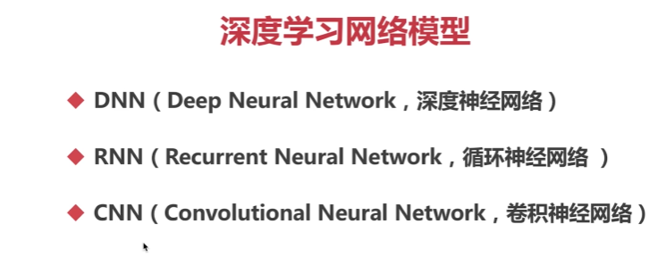

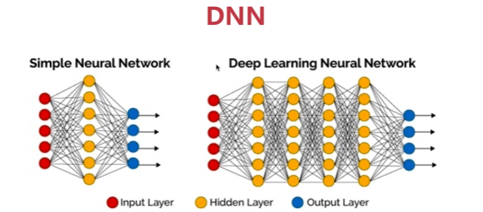

输入层，隐藏层，输出层

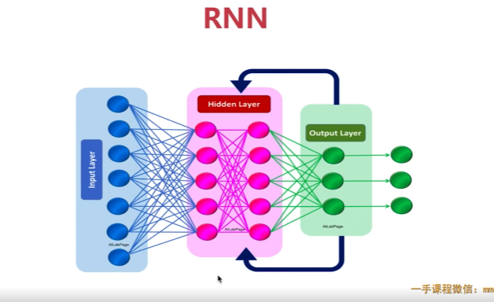

输出层会返回到隐藏层

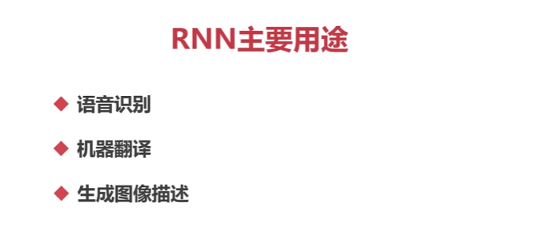

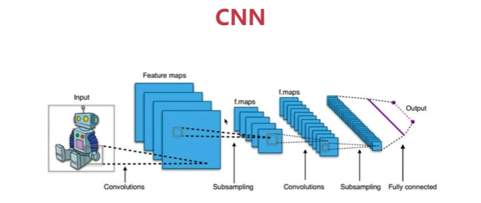

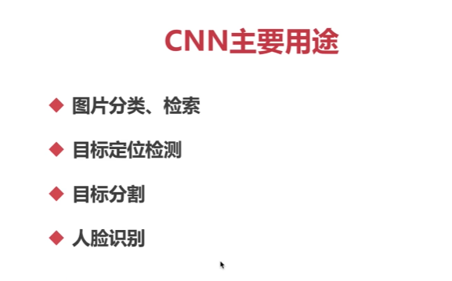

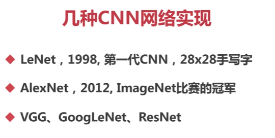

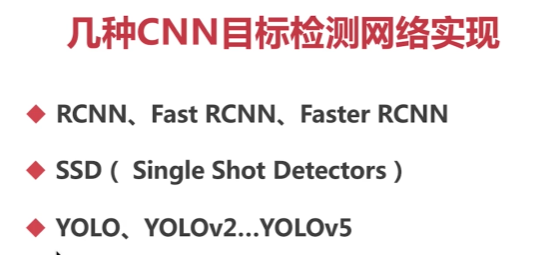

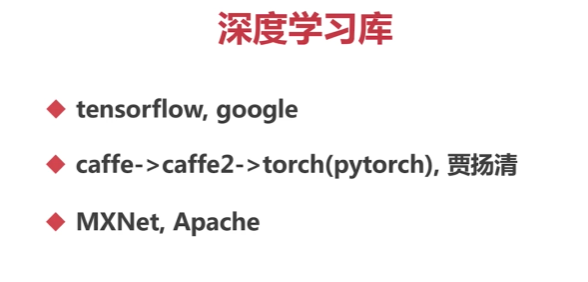

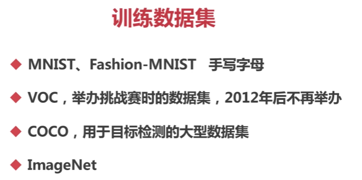

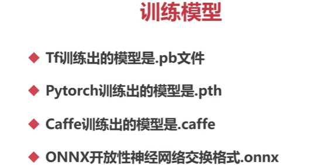

上面的训练模型格式都是可以转换成 ONNX格式的

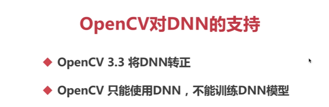

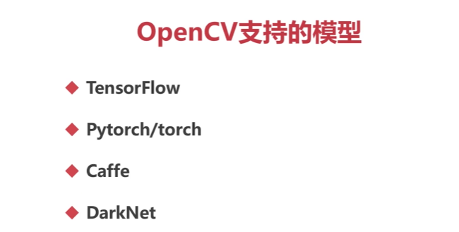

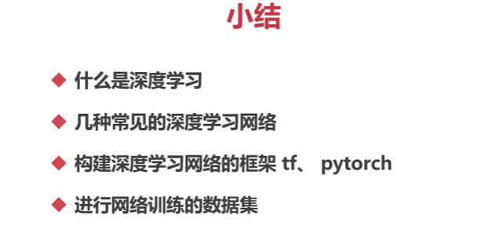

## OpenCV使用DNN

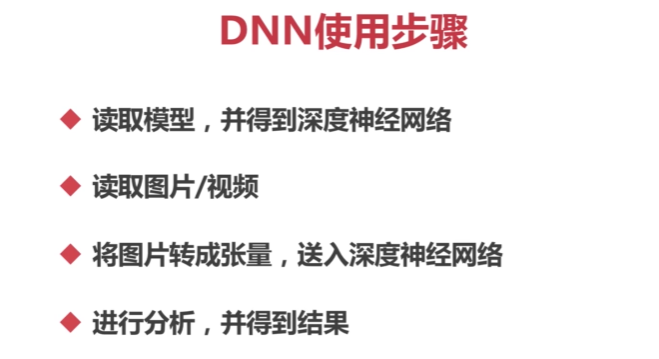

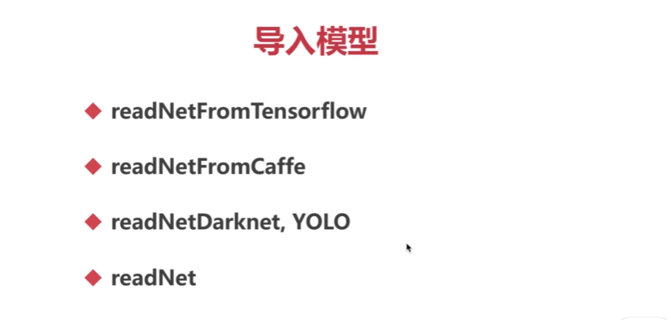

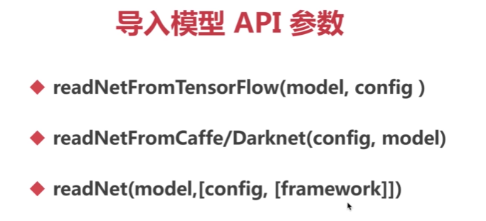

这些是 OpenCV 提供的用于导入不同类型模型的 API 参数。下面是对每个参数的解释：

1. `readNetFromTensorFlow(model, config)`：这个函数用于从 TensorFlow 模型中读取网络结构和权重。`model` 是指模型权重文件的路径，`config` 是指模型结构的配置文件路径。通常，TensorFlow 模型会将网络结构和权重保存在两个不同的文件中。
2. `readNetFromCaffe(config, model)`：这个函数用于从 Caffe 模型中读取网络结构和权重。`config` 是指模型结构的配置文件路径，`model` 是指模型权重文件的路径。Caffe 是一个流行的深度学习框架，它将网络结构和权重保存在两个不同的文件中。
3. `readNet(model, [config, [framework]])`：这个函数可以根据模型文件的扩展名自动选择合适的模型导入器。`model` 是指模型文件的路径，`config` 是指模型结构的配置文件路径（可选参数），`framework` 是指模型所用的框架（可选参数）。如果不提供 `config` 和 `framework` 参数，该函数将根据模型文件的扩展名自动选择合适的导入器。支持的模型文件扩展名包括 `.pb`（TensorFlow 模型）、`.caffemodel`（Caffe 模型）和 `.weights`（Darknet 模型）等。

这些参数是用于根据不同的模型文件类型和框架选择合适的导入方法，在 OpenCV 中导入深度学习模型以进行推理和计算。

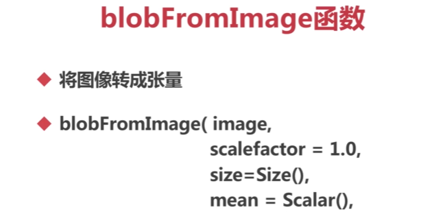

`blobFromImage` 是一个用于将图像转换为张量（blob）的函数，它主要用于深度学习中的图像处理和神经网络输入。

下面是对函数参数的解释：

- `image`：要转换的输入图像。
- `scalefactor`：可选参数，图像缩放因子。默认值为 1.0，表示不进行缩放。可以选择一个小于 1 的值来缩小图像，或选择大于 1 的值来放大图像。
- `size`：可选参数，指定输出 blob 的尺寸。默认值为 `Size(0, 0)`，表示输出 blob 的尺寸将与输入图像的尺寸保持一致。可以指定一个固定的尺寸，比如 `Size(300, 300)`，用于适应特定的网络模型。
- `mean`：可选参数，用于数据归一化的均值向量（Scalar）。默认值为空的 Scalar 对象，表示不进行均值减法。可以通过指定一个均值向量，比如 `Scalar(104, 117, 123)`，将图像像素值减去均值以进行数据预处理。
- `swapRB`：可选参数，指定是否交换红色和蓝色通道。默认值为 `false`，表示不进行通道交换。
- `crop`：可选参数，指定是否进行中心裁剪。默认值为 `false`，表示不进行裁剪。如果设置为 `true`，函数将以最大边为基准将图像裁剪成正方形。

该函数的主要作用是将输入图像转换为网络所需的张量格式，以便于输入到深度学习模型进行推理或训练。转换后的张量通常包含多个通道和固定的尺寸，符合网络的输入要求。

以下是一个使用 `blobFromImage` 函数的示例：

```python
import cv2
import numpy as np

# 读取图像
image = cv2.imread('input_image.jpg')

# 设置参数
scalefactor = 1.0
size = (300, 300)
mean = (104, 117, 123)
swapRB = False
crop = False

# 调用 blobFromImage 函数
blob = cv2.dnn.blobFromImage(image, scalefactor, size, mean, swapRB, crop)

# 输出 blob 的形状信息
print("Blob shape:", blob.shape)

# 可以继续使用 blob 进行后续操作，比如输入到神经网络进行推理或训练
# ...
```

在这个示例中，首先使用 `cv2.imread` 函数读取一个图像（这里假设图像文件名为 "input_image.jpg"）。然后，根据具体需求设置 `scalefactor`、`size`、`mean`、`swapRB` 和 `crop` 等参数。最后，调用 `cv2.dnn.blobFromImage` 函数将图像转换为张量格式的 blob。通过打印 `blob.shape` 可以查看转换后的 blob 的形状信息。

请注意，这只是一个示例，具体的参数设置需要根据具体的应用和网络模型来确定。另外，需要确保 OpenCV 已正确安装并导入。

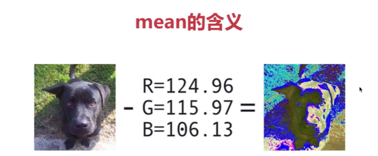

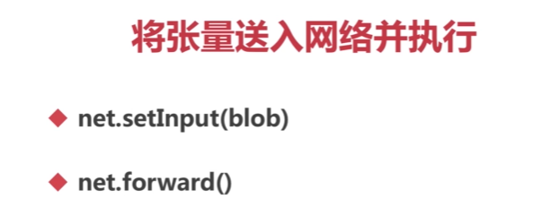

这是使用 OpenCV 中的深度学习模块进行网络推理的常见步骤。下面是对这两行代码的解释：

1. `net.setInput(blob)`：这行代码将预处理后的张量 `blob` 设置为网络的输入。`net` 是指已经加载并配置好的网络模型。通过调用 `setInput` 函数，将预处理后的张量设置为网络的输入，以便进行推理或训练。

2. `net.forward()`：这行代码执行网络的前向传播，也就是进行推理或训练。通过调用 `forward` 函数，网络会根据设置好的输入数据进行前向传播计算，得到输出结果。

需要确保在调用 `net.setInput` 和 `net.forward` 之前，已经正确加载和配置了网络模型，并且已经传入了合适的输入数据。这样，才能正确进行网络推理或训练，并获取输出结果。

以下是一个使用已加载的深度学习模型进行网络推理的示例：

```python
import cv2
import numpy as np

# 加载网络模型
net = cv2.dnn.readNetFromCaffe('model.prototxt', 'model.caffemodel')

# 读取图像
image = cv2.imread('input_image.jpg')

# 设置参数
scalefactor = 1.0
size = (300, 300)
mean = (104, 117, 123)
swapRB = False
crop = False

# 调用 blobFromImage 函数
blob = cv2.dnn.blobFromImage(image, scalefactor, size, mean, swapRB, crop)

# 设置网络输入
net.setInput(blob)

# 执行网络推理
output = net.forward()

# 处理推理结果
# ...

```
在这个示例中，首先使用 `cv2.dnn.readNetFromCaffe` 函数从文件中加载已经训练好的网络模型。`model.prototxt` 是网络的配置文件，`model.caffemodel` 是网络的权重文件。

然后，读取一张输入图像（这里假设图像文件名为 "input_image.jpg"）。

接下来，设置 `blobFromImage` 函数的参数，并将图像转换为张量 `blob`。

然后，调用 `setInput` 函数将张量 `blob` 设置为网络的输入。

最后，调用 `forward` 函数进行网络推理，并将输出结果保存在 `output` 变量中。

在处理推理结果时，根据具体的应用和网络模型，可以根据需要进行后续的处理，比如解码分类结果、边界框处理等。具体的处理方式和代码会因模型和应用的不同而有所不同。

请确保已正确加载和配置网络模型，并根据需要预处理输入图像和后处理推理结果。

### 总

```python
import cv2
from cv2 import dnn
import numpy as np
#1。导入模型，创建神经网络
#2。读图片，转成张量
#3。 将张量输入到网络中，并进行预测
#4。得到结果，显示
#导入模型，创建神经网络

#导入模型，创建神经网络
config = "./model/bvlc_googlenet.prototxt"
model = "./model/bvlc_googlenet.caffemodel"
net = dnn.readNetFromCaffe(config,model)

#读图片，转成张量
img = cv2.imread("./smallcat.jpeg")
blob = dnn.blogFromImage(img,
1.8,#缩放因子
(224,224),(104,117,123))
#将张量输入到网络中，并进行预测
net.setInput(blob)
r = net.fonward()

#读取类目
classes = []
with open(path,'rt') as f:
    classes = [x [x.find("")+1:]for x in f]

order = sorted(r, reverse = True)
z = list(range(3))

for i in range(0,3):
 z[i]=np.where(r[i]==order[i])[0][0]
 print('第',i+1,'项，匹配',classes[z[i]],end='')
 print('类所在行:',z[i]+1,'','可能性:',order[i])
```

