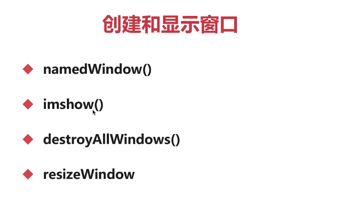
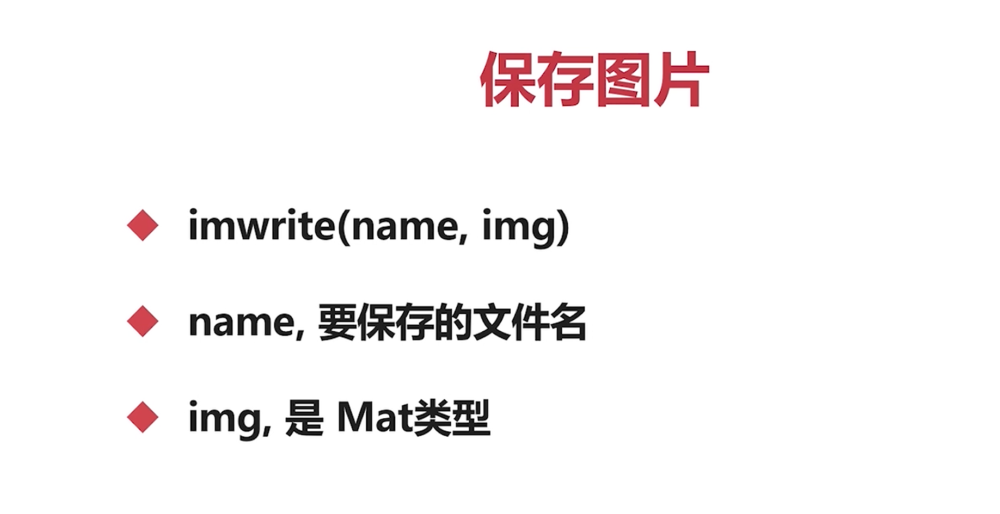
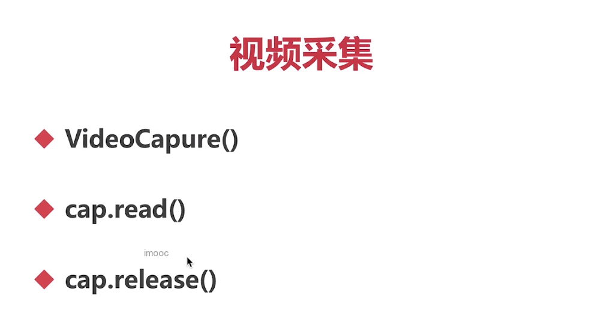

## 创建和显示窗口



在Python的OpenCV库中，以下API用于创建和显示窗口：

### 指定窗口 namedWindow

1. namedWindow(window_name, flags=None): 该函数用于创建一个以指定名称命名的窗口。参数`window_name`是窗口的名称，必须是唯一的。`flags`是可选参数，用于指定窗口的属性，比如窗口是否可以重新调整大小等。如果不提供`flags`参数，则窗口默认为可调整大小。可以使用不同的`flags`值来自定义窗口的属性，比如：

- `cv2.WINDOW_NORMAL`：窗口可以调整大小。
- `cv2.WINDOW_AUTOSIZE`：窗口根据图片大小自动调整大小。

示例用法：

```python
import cv2

# 创建名为"image"的可调整大小的窗口
cv2.namedWindow("image", cv2.WINDOW_NORMAL)
```

### 显示图像 imshow

1. imshow(window_name, image): 该函数用于在指定的窗口中显示图像。参数`window_name`是要显示图像的窗口的名称，必须事先使用`namedWindow()`函数创建。参数`image`是要显示的图像对象。

示例用法：

```python
import cv2

# 创建名为"image"的窗口
cv2.namedWindow("image", cv2.WINDOW_NORMAL)

# 读取并显示图像
image = cv2.imread("image.jpg")
cv2.imshow("image", image)
```

### 销毁窗口 destroyAllWindows

1. destroyAllWindows(): 该函数用于销毁所有已创建的窗口。在不再需要显示窗口时，可以调用该函数关闭所有窗口，释放系统资源。

示例用法：

```python
import cv2

# 创建名为"image"的窗口并显示图像
cv2.namedWindow("image", cv2.WINDOW_NORMAL)
image = cv2.imread("image.jpg")
cv2.imshow("image", image)

# 等待按下任意键，然后关闭窗口
cv2.waitKey(0)
cv2.destroyAllWindows()
```

### 调整窗口大小 resizeWindow

`resizeWindow()` 是 Python OpenCV 库中用于调整窗口大小的函数。它允许您根据需要更改窗口的尺寸。

函数的语法如下：

```python
cv2.resizeWindow(window_name, width, height)
```


参数说明：

- `window_name`：要调整大小的窗口的名称。
- `width`：调整后的窗口宽度。
- `height`：调整后的窗口高度。

示例用法：

```python
import cv2

# 创建名为"image"的窗口并显示图像
cv2.namedWindow("image", cv2.WINDOW_NORMAL)
image = cv2.imread("image.jpg")
cv2.imshow("image", image)

# 调整窗口大小为400x300
cv2.resizeWindow("image", 400, 300)

# 等待按下任意键，然后关闭窗口
cv2.waitKey(0)
cv2.destroyAllWindows()
```


在上述示例中，我们创建了一个名为"image"的窗口，并显示了一张图像。然后，使用 `resizeWindow()` 函数将该窗口的大小调整为 400x300 像素。

请注意，只有在窗口属性中设置为 `cv2.WINDOW_NORMAL`（在 `namedWindow()` 中设置）时，才能调整窗口的大小。如果窗口属性为 `cv2.WINDOW_AUTOSIZE`，则窗口将自动根据图像大小调整大小，无法手动调整。

如果您使用 `destroyAllWindows()` 函数关闭了窗口，在下次需要显示窗口时，必须重新创建窗口并再次使用 `resizeWindow()` 函数调整大小。


> 请注意，在显示图像之前，必须首先创建一个窗口以供显示，然后才能在该窗口中显示图像。

### waitKey

`waitKey()` 是 Python OpenCV 库中用于捕获键盘输入的函数。它暂停程序的执行，等待用户按下键盘上的键，然后返回按下的键的 ASCII 值。

函数的语法如下：

```python
key = cv2.waitKey(delay)
```


参数说明：

- `delay`：等待键盘输入的时间（以毫秒为单位）。如果将值设置为0，则 `waitKey()` 函数将无限期地等待用户按下键。

返回值：

- `key`：按下的键的 ASCII 值。如果没有按键输入或延迟时间耗尽，则返回-1。

示例用法：

```python
import cv2

# 读取并显示图像
image = cv2.imread("image.jpg")
cv2.imshow("image", image)

# 等待按下任意键
key = cv2.waitKey(0)

# 检查按下的键并进行相应的操作
if key == ord('q'):
    # 按下 'q' 键，退出程序
    cv2.destroyAllWindows()
elif key == ord('s'):
    # 按下 's' 键，保存当前图像
    cv2.imwrite("saved_image.jpg", image)
    cv2.destroyAllWindows()
```


在上述示例中，我们使用 `waitKey(0)` 函数来等待用户按下键盘上的键。根据按下的键的 ASCII 值，我们可以执行不同的操作。在这个示例中，如果按下 ‘q’ 键，程序将关闭窗口并退出；如果按下 ‘s’ 键，程序将保存当前图像并关闭窗口。

在等待键盘输入之前，图像必须在使用 `imshow()` 函数显示。`waitKey()` 函数通常与窗口和图像的显示、键盘事件的处理结合使用，以实现与用户交互的图像处理应用程序。

### 读取图像 imread

`imread()` 是 Python OpenCV 库中用于读取图像文件的函数。它可以读取各种图像格式的文件，并返回一个表示图像的 NumPy 数组。

函数的语法如下：

```
image = cv2.imread(filename, flags)
```


参数说明：

- `filename`：要读取的图像文件的路径。

- ```
  flags
  ```

  ：可选参数，用于指定图像的加载方式。常用的标志包括：

  - `cv2.IMREAD_COLOR`：默认值，加载图像文件的彩色图像，忽略图像的透明度。
  - `cv2.IMREAD_GRAYSCALE`：以灰度模式加载图像文件。
  - `cv2.IMREAD_UNCHANGED`：加载图像文件包括图像的 alpha 通道。

返回值：

- `image`：一个表示读取的图像的 NumPy 数组。如果无法读取图像文件，则返回 `None`。

示例用法：

```
import cv2

# 读取彩色图像文件
image = cv2.imread("image.jpg", cv2.IMREAD_COLOR)

# 读取灰度图像文件
gray_image = cv2.imread("image.jpg", cv2.IMREAD_GRAYSCALE)

# 读取带有 alpha 通道的图像文件
image_with_alpha = cv2.imread("image.png", cv2.IMREAD_UNCHANGED)
```


在上述示例中，我们使用 `imread()` 函数读取不同类型的图像文件。第一个例子中，我们读取了一个彩色图像文件并返回一个包含 BGR 通道的 NumPy 数组。第二个例子中，我们读取了一个灰度图像文件，返回一个单通道的 NumPy 数组。第三个例子中，我们读取了一个带有 alpha 通道的图像文件，返回一个包含 BGR 通道以及 alpha 通道的 NumPy 数组。

请注意，如果文件不存在或无法读取图像文件，`imread()` 函数将返回 `None`。因此，在使用返回的图像前，请始终检查返回值，以确保正确读取图像。


### 保存图像 imwrite



`imwrite()` 是 Python OpenCV 库中用于将图像保存为文件的函数。它可以保存 NumPy 数组表示的图像，以多种图像格式的形式。

函数的语法如下：

```python
success = cv2.imwrite(filename, image, params)
```


参数说明：

- `filename`：要将图像保存为的文件路径。
- `image`：要保存为文件的 NumPy 数组。
- `params`：可选参数，用于指定图像保存的方式。常用的参数包括 JPEG 图像质量（0-100），PNG 压缩级别等。在大多数情况下，不需要指定该参数。

返回值：

- `success`：一个布尔值，表示是否成功将图像保存为文件。如果成功，返回 `True`，否则返回 `False`。

示例用法：

```python
import cv2

# 读取图像文件
image = cv2.imread("image.jpg")

# 将图像保存为 JPEG 文件
success = cv2.imwrite("saved_image.jpg", image)

# 在保存前改变图像质量参数
success = cv2.imwrite("saved_image_high_quality.jpg", image, [cv2.IMWRITE_JPEG_QUALITY, 100])
success = cv2.imwrite("saved_image_low_quality.jpg", image, [cv2.IMWRITE_JPEG_QUALITY, 50])

# 将图像保存为 PNG 文件
success = cv2.imwrite("saved_image.png", image, [cv2.IMWRITE_PNG_COMPRESSION, 9])
```


在上述示例中，我们使用 `imwrite()` 函数将图像保存为 JPEG 和 PNG 格式的文件。在默认情况下，`imwrite()` 函数将使用特定的文件扩展名来确定保存为何种图像格式。我们可以通过传递一个可选的参数列表来改变保存时的参数。例如，在保存 JPEG 格式的图像时，可以通过指定 JPEG 图像质量参数（0-100），来控制保存的图像质量。在保存 PNG 格式的图像时，可以通过指定 PNG 压缩级别参数（0-9），来控制保存的图像压缩程度。

需要注意的是，如果保存的文件路径不存在，将会抛出异常。因此，应该在保存文件前确保目标文件夹存在。

## 视频采集



`VideoCapture()` 是 Python OpenCV 库中用于从视频文件中捕获帧的类。它可以打开一个视频文件，并按顺序读取每一帧。

函数的语法如下：

```python
cap = cv2.VideoCapture(filename)
```


参数说明：

- `filename`：要打开的视频文件的路径。也可以是摄像头设备的编号（例如0代表默认摄像头）。

返回值：

- `cap`：一个 `VideoCapture` 对象，表示打开的视频文件或摄像头。

`read()` 是 `VideoCapture` 类的方法，用于从视频文件中读取下一帧。

函数的语法如下：

```python
ret, frame = cap.read()
```


返回值：

- `ret`：一个布尔值，表示是否成功读取到帧。如果成功，返回 `True`，否则返回 `False`。
- `frame`：一个表示读取到的图像帧的 NumPy 数组。

`release()` 是 `VideoCapture` 类的方法，用于释放打开的视频文件或摄像头。

函数的语法如下：

```python
cap.release()
```


在使用完 `VideoCapture` 对象后，应该调用 `release()` 方法释放资源。

示例用法：

```python
import cv2

# 打开视频文件
cap = cv2.VideoCapture("video.mp4")

while True:
    # 读取下一帧
    ret, frame = cap.read()

    if not ret:
        # 无法读取到帧，退出循环
        break

    # 在这里进行图像处理，比如显示图像、保存图像等
    
    # 显示图像
    cv2.imshow("Video", frame)
    
    # 按下 q 键退出循环
    #如果是视频的话，要按帧数设定等待时间，1秒等于一千毫秒。25帧的间隔就是1000/25=40
    if cv2.waitKey(1) == ord("q"):
        break

# 释放资源
cap.release()
cv2.destroyAllWindows()
```


在上述示例中，我们使用 `VideoCapture()` 打开一个视频文件，并使用 `read()` 逐帧读取视频中的图像帧。在一个循环中，我们检查 `ret` 的值，如果为 `True` 则说明成功读取到了帧，然后可以对帧进行处理，比如显示图像、保存图像等。我们还使用了 `imshow()` 方法将帧显示到窗口中。通过按下按键 q 可以退出循环。最后，我们使用 `release()` 方法释放资源，并调用 `destroyAllWindows()` 关闭所有打开的窗口。

## 录制视频


要录制视频，你可以使用 `VideoWriter` 类、`write()` 方法和 `release()` 方法来创建一个视频文件，并将帧写入该文件中。

首先，你需要创建一个 `VideoWriter` 对象，用于指定要保存的视频文件的路径、视频编解码器、帧率和帧的大小。

使用以下语法创建 `VideoWriter` 对象：

```python
out = cv2.VideoWriter(filename, fourcc, fps, frameSize)
```


参数说明：

- `filename`：要保存的视频文件的路径和名称。
- `fourcc`：指定视频编解码器的四字符代码。例如，H.264编码可以使用`cv2.VideoWriter_fourcc(*'mp4v')`来指定。
- `fps`：视频的帧率。
- `frameSize`：保存视频的帧的大小，可以是 `(宽度, 高度)`。

接下来，你可以使用 `write()` 方法将帧写入视频文件。

使用以下语法将帧写入视频文件：

```python
out.write(frame)
```


参数说明：

- `frame`：要写入视频文件的帧。

最后，记得使用 `release()` 方法释放 `VideoWriter` 对象和关闭视频文件。

使用以下语法释放 `VideoWriter` 对象和关闭视频文件：

```python
out.release()
```


示例用法：

```python
import cv2

# 捕获视频并获取帧参数
cap = cv2.VideoCapture(0)
width = int(cap.get(cv2.CAP_PROP_FRAME_WIDTH))
height = int(cap.get(cv2.CAP_PROP_FRAME_HEIGHT))
fps = 20

# 创建 VideoWriter 对象
out = cv2.VideoWriter('output.mp4', cv2.VideoWriter_fourcc(*'mp4v'), fps, (width, height))

# 检查摄像头是否已经成功打开 isOpened()
while cap.isOpened():
    # 读取帧
    ret, frame = cap.read()
    if not ret:
        break

    # 在这里进行帧处理

    # 写入视频帧
    out.write(frame)

    # 显示帧
    cv2.imshow('Frame', frame)
    if cv2.waitKey(1) & 0xFF == ord('q'):
        break

# 释放资源
cap.release()
out.release()
cv2.destroyAllWindows()
```


在这个示例中，我们使用 `VideoCapture` 获取视频帧并 `VideoWriter` 创建一个名为 `output.mp4` 的视频文件。我们按帧循环处理视频帧，然后使用 `write()` 将帧写入视频文件。同时，我们还使用 `imshow()` 显示帧，并通过按下键盘上的 ‘q’ 键来退出循环。最后，我们使用 `release()` 释放资源并关闭视频文件。