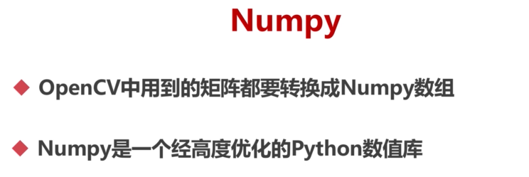

## 色彩空间


### RGB 和 BGR

RGB 和 BGR 是两种最常见的图像表示方式，它们代表了像素的颜色顺序。

RGB 表示红色（Red）、绿色（Green）、蓝色（Blue）。在 RGB 表示中，每个像素由一个三元组表示，其中每个分量值的范围通常在 0 到 255 之间，表示了红、绿、蓝三个通道的相对强度。例如，(255, 0, 0) 表示纯红色。

BGR 表示蓝色（Blue）、绿色（Green）、红色（Red）。BGR 顺序从根本上来说是由硬件和软件支持的历史原因，比如 OpenCV 默认使用 BGR 格式。因此，在 OpenCV 中读取的图像数据通常以 BGR 顺序存储。

在许多计算机视觉框架和图像处理工具中，颜色通常以 BGR 的顺序存储和处理。当我们使用这些工具时，需要注意将图像从一个表示方式（RGB）转换为另一个表示方式（BGR），或者反过来。

以下是 Python 中使用 OpenCV 进行 RGB 和 BGR 转换的示例代码：

```python
import cv2

# 读取图像
img_bgr = cv2.imread('image.jpg')

# 将 BGR 转换为 RGB
img_rgb = cv2.cvtColor(img_bgr, cv2.COLOR_BGR2RGB)

# 将 RGB 转换为 BGR
img_bgr = cv2.cvtColor(img_rgb, cv2.COLOR_RGB2BGR)
```


在这个示例中，我们首先使用 `cv2.imread()` 读取图像文件，并将其存储为 BGR 格式。然后，我们使用 `cv2.cvtColor()` 函数进行颜色空间的转换，将 BGR 图像转换为 RGB 格式，或将 RGB 图像转换为 BGR 格式。

### HSV和HSL

HSV（Hue, Saturation, Value）和 HSL（Hue, Saturation, Lightness）是两种常用的颜色模型，用于表示颜色。

HSV 模型将颜色表示为色调（Hue）、饱和度（Saturation）和明度（Value）。色调表示颜色的种类，取值范围通常为 0 到 360 度，对应了一个色盘；饱和度表示颜色的纯度，取值范围通常为 0 到 100%，表示了颜色的鲜艳程度；明度表示颜色的亮度，取值范围通常为 0 到 100%，表示了颜色的明亮程度。

HSL 模型将颜色表示为色调（Hue）、饱和度（Saturation）和亮度（Lightness）。色调表示颜色的种类，取值范围通常为 0 到 360 度，对应了一个色盘；饱和度表示颜色的纯度，取值范围通常为 0 到 100%，表示了颜色的鲜艳程度；亮度表示颜色的明亮程度，取值范围通常为 0 到 100%，表示了颜色的明亮程度。

HSV 和 HSL 在表示颜色时提供了更直观和直观的方式。这两种模型广泛应用于计算机图形学、计算机视觉、图像处理等领域。

以下是 Python 中使用 OpenCV 进行颜色空间转换的示例代码：

```python
import cv2
import numpy as np

# 读取图像
img = cv2.imread('image.jpg')

# 将 BGR 转换为 HSV
img_hsv = cv2.cvtColor(img, cv2.COLOR_BGR2HSV)

# 将 BGR 转换为 HSL
img_hsl = cv2.cvtColor(img, cv2.COLOR_BGR2HLS)
```


在这个示例中，我们首先使用 `cv2.imread()` 读取图像文件。然后，使用 `cv2.cvtColor()` 函数将 BGR 图像转换为 HSV 或 HSL 格式。

### YUV 

YUV 是一种颜色空间，通常用于数字视频、数字图像压缩和视频处理等领域。在 YUV 模型中，颜色由亮度（Y）和两个色度分量（U 和 V）组成，其中 Y 分量表示亮度，U 和 V 分量表示色度。

在 YUV 模型中，亮度分量 Y 表示图像的明亮度，范围为 0 到 255。U 和 V 分量则用于表示色度，表示图像的颜色信息。通常情况下，这些值被归一化到范围 [-0.5, 0.5]，表示相对的颜色差。这个范围可以通过乘以一个比例因子并加上一个基准值来扩展到实际值的范围。

YUV 模型在数字视频和图像处理中广泛使用，特别是在视频压缩领域中。许多常见的视频编解码器，如 MPEG、H.264 和 HEVC，都使用 YUV 形式的视频编码。在图像处理中，YUV 形式的图像通常被用于调整亮度和色度，进行图像增强和色彩校正等操作。

以下是 Python 中使用 OpenCV 进行颜色空间转换的示例代码：

```python
import cv2
import numpy as np

# 读取图像
img = cv2.imread('image.jpg')

# 将 BGR 转换为 YUV
img_yuv = cv2.cvtColor(img, cv2.COLOR_BGR2YUV)

# 将 YUV 转换回 BGR
img_bgr = cv2.cvtColor(img_yuv, cv2.COLOR_YUV2BGR)
```


在这个示例中，我们首先使用 `cv2.imread()` 函数读取图像文件，然后使用 `cv2.cvtColor()` 函数将 BGR 图像转换为 YUV 格式。我们可以对图像进行一些预处理、分析和处理，之后再用 `cv2.cvtColor()` 函数将 YUV 图像转换回 BGR 格式以供显示或保存。

## 图像操作的基石Numpy




在 NumPy 中，可以使用 `numpy.array()` 函数来创建矩阵。这个函数接受一个可迭代对象（如列表）作为输入，然后将其转换为 NumPy 的数组对象。

下面是一个创建矩阵的示例：

```python
import numpy as np

# 创建一个 3x3 的矩阵
matrix = np.array([[1, 2, 3], [4, 5, 6], [7, 8, 9]])
print(matrix)
```


输出结果：

```python
[[1 2 3]
 [4 5 6]
 [7 8 9]]
```


要检索和赋值矩阵中的元素，可以使用索引。NumPy 中的索引是基于 0 的，即第一个元素的索引为 0。

```python
import numpy as np

# 创建一个 3x3 的矩阵
matrix = np.array([[1, 2, 3], [4, 5, 6], [7, 8, 9]])

# 获取矩阵中特定位置的元素
element = matrix[1, 2]
print(element)  # 输出结果: 6

# 修改矩阵中特定位置的元素
matrix[1, 2] = 10
print(matrix)
```


输出结果：

```python
[[ 1  2  3]
 [ 4  5 10]
 [ 7  8  9]]
```


要获取矩阵的子数组，可以使用切片（slice）操作。切片允许你从数组中选择一部分元素。

```python
import numpy as np

# 创建一个 3x3 的矩阵
matrix = np.array([[1, 2, 3], [4, 5, 6], [7, 8, 9]])

# 获取矩阵的子数组
sub_array = matrix[:2, 1:3]
print(sub_array)
```


输出结果：

```python
[[2 3]
 [5 6]]
```


在这个示例中，`matrix[:2, 1:3]` 表示获取前两行、第 1 列到第 3 列（不包括第 3 列）的子数组。


在 NumPy 中，你可以使用不同的函数来创建数组：

1. 使用 `numpy.array()` 函数来创建数组。这个函数接受一个可迭代对象（如列表）作为参数，并将其转换为 NumPy 数组。例如：

```python
import numpy as np

# 创建一个数组
arr = np.array([1, 2, 3, 4, 5])
print(arr)
```


输出：

```python
[1 2 3 4 5]
```


1. 使用 `numpy.zeros()` 函数可以创建一个给定形状的全零数组。你可以指定数组的维度作为参数。例如：

```python
import numpy as np

# 创建一个 3x3 的全零数组
zeros_arr = np.zeros((3, 3))
print(zeros_arr)
```


输出：

```python
[[0. 0. 0.]
 [0. 0. 0.]
 [0. 0. 0.]]
```


类似地，你可以使用 `numpy.ones()` 来创建一个给定形状的全一数组。

1. 使用 `numpy.full()` 函数可以创建一个给定形状和值的数组。它接受两个参数，第一个是形状（如元组或整数），第二个是填充值。例如：

```python
import numpy as np

# 创建一个 2x2 的全为 7 的数组
full_arr = np.full((2, 2), 7)
print(full_arr)
```


输出：

```python
[[7 7]
 [7 7]]
```


1. `numpy.identity()` 函数创建一个方阵，并且对角线上的元素为 1，其余元素为 0。你只需指定方阵的大小作为参数。例如：

```python
import numpy as np

# 创建一个 3x3 的单位矩阵
identity_arr = np.identity(3)
print(identity_arr)
```


输出：

```python
[[1. 0. 0.]
 [0. 1. 0.]
 [0. 0. 1.]]
```


另一个创建类似单位矩阵的函数是 `numpy.eye()`。它与 `numpy.identity()` 类似，你可以指定矩阵的大小和偏移量。例如：

```python
import numpy as np

# 创建一个 3x3 的单位矩阵，偏移量为 1
eye_arr = np.eye(3, k=1)
print(eye_arr)
```


输出：

```python
[[0. 1. 0.]
 [0. 0. 1.]
 [0. 0. 0.]]
```

## Numpy基本操作之矩阵的检索与赋值 


在 NumPy 中，你可以使用索引来检索和赋值数组中的元素。索引是基于 0 的，这意味着第一个元素的索引为 0。

如果你想检索或赋值一个二维数组（矩阵）中的元素，可以使用 `[y, x]` 的方式。其中，`y` 是行的索引，`x` 是列的索引。

```python
import numpy as np

# 创建一个 3x3 的矩阵
matrix = np.array([[1, 2, 3], [4, 5, 6], [7, 8, 9]])

# 检索矩阵中的元素
element = matrix[1, 2]
print(element)  # 输出结果：6

# 修改矩阵中的元素
matrix[1, 2] = 10
print(matrix)
```


输出结果：

```python
[[ 1  2  3]
 [ 4  5 10]
 [ 7  8  9]]
```


如果你的数组是一个多维数组，例如具有 RGB 通道的图片，你可以使用 `[y, x, channel]` 的方式来检索和赋值元素。其中，`channel` 表示通道的索引，通常是 0、1 或 2，分别代表红色、绿色和蓝色通道。

```python
import numpy as np

# 创建一个 2x2 的 RGB 图像数组
image = np.array([[[255, 0, 0], [0, 255, 0]],
                  [[0, 0, 255], [255, 255, 255]]])

# 检索像素值
pixel = image[1, 1, 2]
print(pixel)  # 输出结果：255

# 修改像素值
image[1, 1, 2] = 0
print(image)
```


输出结果：

```python
[[[255   0   0]
  [  0 255   0]]

 [[  0   0 255]
  [255 255   0]]]
```

## Region of Image ( ROI )

图像的区域（ROI）是指图像中的一个特定矩形区域，你可以选择对该区域进行操作或提取感兴趣的内容。在 OpenCV 中，你可以使用图像数组的切片（slicing）来选择和提取图像的ROI。

下面是一个简单的示例，展示如何选择并提取图像的ROI：

```python
import cv2

# 读取图像
img = cv2.imread('image.jpg')

# 定义ROI的坐标和大小（矩形的左上角和右下角坐标）
x, y, width, height = 100, 100, 200, 200

# 选择ROI区域(Numpy获取子矩阵的方式)
roi = img[y:y+height, x:x+width]
# 将指定的整一个区域替换成绿色
img[y:y+height, x:x+width]=[0,255,0]
# 显示ROI区域
cv2.imshow('ROI', roi)
cv2.waitKey(0)
cv2.destroyAllWindows()
```


在此示例中，我们定义了一个ROI，其左上角坐标为 `(100, 100)`， 宽度和高度均为 `200`。然后，我们使用切片操作 `img[y:y+height, x:x+width]` 选择ROI区域，并将其存储在 `roi` 变量中。最后，我们使用 `cv2.imshow()` 显示ROI区域。

确保将代码中的 `'image.jpg'` 替换为你实际图像的路径，并确保图像存在。此外，还要注意选择合适的ROI坐标和大小以适应你的特定需求。

### Numpy获取子矩阵的方式

在NumPy中，你可以使用切片（slicing）或索引（indexing）操作来获取矩阵的子矩阵。下面是一些示例代码，演示了如何使用切片获取子矩阵。

### 获取矩阵的一部分

假设我们有一个形状为 `10*10` 的矩阵 `mat`，现在要获取其第1至第3行，第4至第6列之间的子矩阵，可以使用如下代码：

```python
import numpy as np

mat = np.random.randint(0, 10, (10, 10)) # 随机生成一个10*10的矩阵
sub_mat = mat[0:3, 3:6]  # 获取第1至第3行，第4至第6列之间的子矩阵
print(sub_mat)
```


输出：

```python
[[5 4 4]
 [8 3 7]
 [2 2 2]]
```


### 获取矩阵的行或列

我们也可以使用类似的方式，获取矩阵的任意一行或一列：

```python
import numpy as np

mat = np.random.randint(0, 10, (10, 10)) # 随机生成一个10*10的矩阵
row = mat[1,:]     # 获取第2行
col = mat[:,3]     # 获取第4列
print(row)
print(col)
```


输出:

```python
[9 4 2 8 2 4 7 5 3 6]
[8 1 5 5 7 6 3 7 6 6]
```


### 获取整个矩阵

如果你要获取整个矩阵，可以使用 `[:,:]]`：

```python
import numpy as np

mat = np.random.randint(0, 10, (10, 10)) # 随机生成一个10*10的矩阵
sub_mat = mat[:, :]  # 获取整个矩阵
print(sub_mat)
```


输出：

```python
[[5 0 3 5 8 5 0 1 4 5]
 [4 3 5 1 5 6 7 2 9 4]
 [5 3 3 6 8 2 9 3 1 2]
 [7 4 2 9 7 0 7 4 2 1]
 [0 6 3 3 3 8 7 6 8 7]
 [9 2 4 6 9 2 3 4 5 3]
 [9 1 2 1 2 0 0 8 4 5]
 [6 6 4 9 9 7 5 0 0 2]
 [0 8 1 2 4 9 0 1 3 9]
 [7 5 4 7 1 9 9 9 9 6]]
```


这是一些简单的例子，展示了如何使用NumPy来获取矩阵的子矩阵。

## 最重要的结构体Mat

在OpenCV中，最重要的结构体之一是`Mat`，它代表图像或矩阵数据。`Mat`是OpenCV中对图像和矩阵数据的中央数据结构，它包含图像的像素值（或矩阵的元素值）以及与其相关的元数据。

`Mat`结构体可以用于存储和处理图像、矩阵和其他类型的多维数据。它可以是单通道或多通道（例如，RGB图像有3个通道），并且可以存储不同数据类型（如整数、浮点数等）的元素。

`Mat`结构体在图像处理和计算机视觉的开发中有许多好处。以下是一些最显著的好处：

1. 方便的图像加载和保存：`Mat`结构体可以轻松地从各种图像文件格式中加载图像，如JPEG、PNG、BMP、GIF等等。同时，它还可以将图像保存到各种文件格式中。
2. 灵活的图像处理和操作：`Mat`结构体提供了方法用于对图像进行各种操作，包括缩放、裁剪、旋转、滤波、直方图等。这些操作可以使用相对简单的代码实现，方便实用。
3. 高效的内存管理：`Mat`对象可以动态地分配和释放内存，这使得内存管理变得更加高效。此外，可以使用多个`Mat`对象共享同一段内存区域，以实现更有效的内存管理。
4. 快速的计算：`Mat`结构体是使用C++编写的，它利用了现代硬件中的向量化、并行化等技术，因此可以高效地执行各种图像处理和计算任务。
5. 与OpenCV的无缝集成：`Mat`结构体可以与OpenCV的其他功能（如特征检测、目标识别、深度学习等）无缝集成，因此可以方便地进行更强大的图像处理和计算机视觉任务。

以下是一些常用的操作和用法，以展示`Mat`结构体的重要性：

- 创建`Mat`对象：可以从文件加载图像或使用代码创建`Mat`对象。

```python
import cv2

# 从文件加载图像
image = cv2.imread('image.jpg')

# 创建一张200x300的黑色图像
black_image = np.zeros((200, 300, 3), dtype=np.uint8)
```


- 获取和修改像素值：可以使用`Mat`对象的索引操作获取和修改像素值。

```python
# 获取图像某个像素点的值
pixel = image[100, 100]

# 修改图像某个像素点的值
image[100, 100] = [255, 255, 255]
```


- 获取图像属性：可以使用`Mat`对象的属性来获取图像的宽度、高度和通道数。

```python
height, width, channels = image.shape
```


- 显示图像：可以使用OpenCV的`imshow()`函数显示图像。

```python
cv2.imshow('Image', image)
cv2.waitKey(0)
cv2.destroyAllWindows()
```


- 其他操作：还可以对图像进行缩放、裁剪、旋转、滤波等各种常见操作。

这只是`Mat`结构体的一些常见用法示例，展示了它在图像处理和计算机视觉中的重要性。`Mat`结构体是OpenCV的核心部分之一，它提供了丰富的功能和方法来处理图像和矩阵数据。

## Mat的深拷贝与浅拷贝

在OpenCV中，`Mat`对象的深拷贝和浅拷贝都是常见的操作，用于复制图像或矩阵数据。下面是对深拷贝和浅拷贝的解释和区别：

1. 浅拷贝：当你对一个`Mat`对象进行浅拷贝时，只会复制指向图像或矩阵数据的指针，而不是复制数据本身。这意味着原始`Mat`对象和新的`Mat`对象将共享相同的数据副本。修改其中一个对象的数据也会影响另一个对象。

```python
import cv2

# 创建一个Mat对象
image = cv2.imread('image.jpg')

# 进行浅拷贝
shallow_copy = image

# 修改其中一个对象的数据
shallow_copy[100, 100] = [255, 255, 255]

# 原始对象也会被修改
print(image[100, 100])  # 输出 [255, 255, 255]
```


1. 深拷贝：当你对一个`Mat`对象进行深拷贝时，会创建一个新的`Mat`对象，并复制图像或矩阵数据的副本。这意味着原始`Mat`对象和新的`Mat`对象将拥有独立的数据副本，彼此之间的修改互不影响。

```python
import cv2

# 创建一个Mat对象
image = cv2.imread('image.jpg')

# 进行深拷贝
deep_copy = image.copy()

# 修改其中一个对象的数据
deep_copy[100, 100] = [255, 255, 255]

# 原始对象不会被修改
print(image[100, 100])  # 输出 [原始像素值]
```


使用深拷贝和浅拷贝取决于你的需求。如果你希望在更改一个`Mat`对象的数据时不影响其他对象，那么使用深拷贝是更安全的选择。但请注意，深拷贝会占用更多的内存，特别是在处理大型图像或矩阵数据时。

当需要创建一个新的`Mat`对象并对其进行独立的操作时，深拷贝是一个好的选择。而浅拷贝通常用于需要共享同一份数据副本的场景。