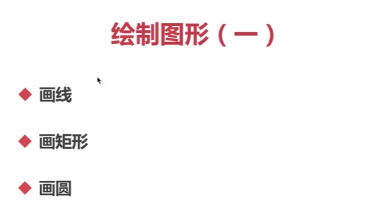
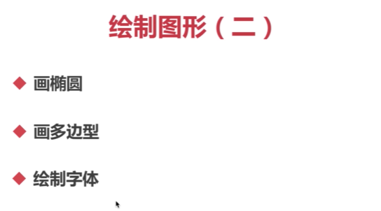

## 绘制图形

## （1）画线，画矩形，画圆



在OpenCV中，绘制图形是图像处理和计算机视觉中的重要部分。以下是如何使用OpenCV在图像上绘制线、矩形和圆形的示例：

1. 画线：可以使用OpenCV的`line()`函数在图像上绘制一条直线。该函数的参数包括原始图像、起点坐标、终点坐标、颜色和线条粗细等。

```python
import cv2

# 创建一个黑色图像
image = np.zeros((500, 500, 3), dtype=np.uint8)

# 绘制一条蓝色线
start_point = (100, 100)
end_point = (400, 400)
color = (255, 0, 0) # 蓝色
thickness = 5
image = cv2.line(image, start_point, end_point, color, thickness)

# 显示图像
cv2.imshow('Image', image)
cv2.waitKey(0)
cv2.destroyAllWindows()
```


1. 画矩形：可以使用OpenCV的`rectangle()`函数在图像上绘制一个矩形。该函数的参数包括原始图像、矩形的位置和大小、颜色和线条粗细等。

```python
import cv2

# 创建一个黑色图像
image = np.zeros((500, 500, 3), dtype=np.uint8)

# 绘制一个红色矩形轮廓
start_point = (100, 100)
end_point = (400, 400)
color = (0, 0, 255) # 红色
thickness = 5
image = cv2.rectangle(image, start_point, end_point, color, thickness)

# 显示图像
cv2.imshow('Image', image)
cv2.waitKey(0)
cv2.destroyAllWindows()
```


1. 画圆：可以使用OpenCV的`circle()`函数在图像上绘制一个圆形。该函数的参数包括原始图像、圆心、半径、颜色和线条粗细等。

```python
import cv2

# 创建一个黑色图像
image = np.zeros((500, 500, 3), dtype=np.uint8)

# 绘制一个绿色圆形
center_point = (250, 250)
radius = 100
color = (0, 255, 0) # 绿色
thickness = 5
image = cv2.circle(image, center_point, radius, color, thickness)

# 显示图像
cv2.imshow('Image', image)
cv2.waitKey(0)
cv2.destroyAllWindows()
```


以上是绘制图形的示例代码，其中`line()`、`rectangle()`和`circle()`函数都是OpenCV中常用的图形绘制函数。

## （2）画多边形，椭圆，绘制字体




在OpenCV中，除了画线、矩形和圆形，还可以使用以下函数绘制更多类型的图形：

### 画多边形

1. 画多边形：可以使用OpenCV的`polylines()`函数在图像上绘制一系列连接的线段，形成多边形。该函数的参数包括原始图像、每个点的坐标、是否闭合多边形、颜色和线条粗细等。

```python
import cv2
import numpy as np

# 创建一个黑色图像
image = np.zeros((500, 500, 3), dtype=np.uint8)

# 定义多边形顶点坐标
points = np.array([(100, 100), (250, 250), (400, 100), (250, 400)], np.int32)

# 绘制黄色多边形
color = (0, 255, 255) # 黄色
thickness = 5
image = cv2.polylines(image, [points], True, color, thickness)

# 显示图像
cv2.imshow('Image', image)
cv2.waitKey(0)
cv2.destroyAllWindows()
```

### 画圆弧

1. 画圆弧：可以使用OpenCV的`ellipse()`函数在图像上绘制一个椭圆形或圆弧。该函数的参数包括原始图像、椭圆或圆形的位置和大小、起始和结束角度、颜色和线条粗细等。

```python
import cv2
import numpy as np

# 创建一个黑色图像
image = np.zeros((500, 500, 3), dtype=np.uint8)

# 绘制一个蓝色圆弧
center = (250, 250)
axes = (100, 150)
angle = 0
start_angle = 0
end_angle = 180
color = (255, 0, 0) # 蓝色
thickness = 5
image = cv2.ellipse(image, center, axes, angle, start_angle, end_angle, color, thickness)

# 显示图像
cv2.imshow('Image', image)
cv2.waitKey(0)
cv2.destroyAllWindows()
```

### 绘制字体

1. 绘制字体：可以使用OpenCV的`putText()`函数在图像上绘制文本。该函数的参数包括原始图像、文本内容、文本位置和大小、字体类型、颜色和线条粗细等。

```python
import cv2
import numpy as np

# 创建一个黑色图像
image = np.zeros((500, 500, 3), dtype=np.uint8)

# 绘制文本
text = 'Hello, OpenCV!'
font = cv2.FONT_HERSHEY_SIMPLEX
font_scale = 1
color = (255, 255, 255) # 白色
thickness = 2
text_size, _ = cv2.getTextSize(text, font, font_scale, thickness)
text_x = (image.shape[1] - text_size[0]) // 2
text_y = (image.shape[0] + text_size[1]) // 2
image = cv2.putText(image, text, (text_x, text_y), font, font_scale, color, thickness)

# 显示图像
cv2.imshow('Image', image)
cv2.waitKey(0)
cv2.destroyAllWindows()
```

### 1.画圆

果您只想要画一个点，可以考虑使用`cv2.circle`函数，它更适合绘制圆。

`cv2.circle`函数的语法如下：

```
cv2.circle(img, center, radius, color, thickness)
```


其中，参数的含义如下：

- `img`：要绘制圆的图像。
- `center`：圆心的坐标，以(x, y)的形式表示。
- `radius`：圆的半径。
- `color`：圆的颜色，以RGB值或BGR值表示。
- `thickness`：圆边界的厚度，如果指定为负数，则表示填充圆内部。

下面是一个简单的示例，演示了如何使用`cv2.circle`函数来画一个点：

```py
import cv2
import numpy as np

# 创建一张黑色背景的图像
image = np.zeros((500, 500, 3), dtype=np.uint8)

# 定义点的参数
center = (250, 250)
radius = 3
color = (0, 255, 0)  # 用绿色表示

# 在图像上画一个点
cv2.circle(image, center, radius, color, thickness=-1)

# 显示结果图像
cv2.imshow('Image', image)
cv2.waitKey(0)
cv2.destroyAllWindows()
```

在上述示例中，我们创建了一张黑色背景的图像，然后使用`cv2.circle`函数在图像上绘制了一个点。点的中心坐标为(250, 250)，半径为3，颜色为绿色。通过将`thickness`参数设置为负数，我们填充了点的内部。

以上是绘制多边形、椭圆形和文本的示例代码，其中`polylines()`、`ellipse()`和`putText()`函数都是OpenCV中常用的图形绘制函数。

绘制中文字体

要在OpenCV中绘制中文字体，需要使用额外的库来支持中文字符集，例如`pillow`和`numpy`。下面是一个使用`pillow`和`numpy`库来绘制中文字体的示例代码：

```python
import cv2
import numpy as np
from PIL import ImageFont, ImageDraw, Image

# 创建一个黑色图像
image = np.zeros((500, 500, 3), dtype=np.uint8)

# 将图像从OpenCV格式转换为PIL格式
pil_image = Image.fromarray(image)

# 加载中文字体
font_path = '/path/to/your/font.ttf'  # 替换为你的字体文件路径
font_size = 50
font_color = (255, 255, 255)  # 白色

font = ImageFont.truetype(font_path, font_size)

# 绘制中文文本
draw = ImageDraw.Draw(pil_image)
text = '你好，OpenCV!'
text_size = draw.textsize(text, font=font)
text_x = (image.shape[1] - text_size[0]) // 2
text_y = (image.shape[0] - text_size[1]) // 2
draw.text((text_x, text_y), text, font=font, fill=font_color)

# 将图像从PIL格式转换为OpenCV格式
image = np.array(pil_image)

# 显示图像
cv2.imshow('Image', image)
cv2.waitKey(0)
cv2.destroyAllWindows()
```


在示例代码中，首先创建一个黑色图像。然后，使用`PIL`库将图像从OpenCV格式转换为PIL格式。接下来，加载中文字体文件，设置字体大小和颜色。然后，使用`Draw`对象绘制中文文本。绘制完成后，再将图像从PIL格式转换回OpenCV格式，并显示图像。

请替换代码中的`/path/to/your/font.ttf`为你自己的字体文件路径。确保字体文件能够正常加载。请注意，该代码使用`PIL`库来处理中文字体，所以请确保已经安装了`pillow`库。


平常开发难免遇到需要ttf字体格式的，比如web开发，自动化办公生成word等等。尝试从网上下载字体发现下载了一堆莫名其妙的文件，这边有一个方法，就是获取windows系统内置字体。
进入C:\Windows\Fonts目录，找到需要的字体直接复制。


## OpenCV大作业-实现鼠标绘制基本图形

要实现通过鼠标进行基本图形的绘制，你可以使用Python的`opencv`库来实现。下面是一个示例代码，演示了如何通过按键选择不同的绘制模式，并在鼠标滑动时绘制线条、矩形和圆形：

```python
import cv2
import numpy as np
# 定义全局变量
drawing = False  # 标记是否开始绘制
mode = 'none'  # 绘制模式：none, line, rectangle, circle
start_point = None  # 起始点坐标


# 鼠标回调函数
def draw_shape(event, x, y, flags, param):
    global drawing, mode, start_point

    if event == cv2.EVENT_LBUTTONDOWN:
        # 鼠标按下事件
        drawing = True
        start_point = (x, y)

    elif event == cv2.EVENT_LBUTTONUP:
        # 鼠标释放事件
        drawing = False
        if mode == 'line':
            # 绘制线条
            cv2.line(image, start_point, (x, y), (0, 255, 0), 2)
        elif mode == 'rectangle':
            # 绘制矩形
            cv2.rectangle(image, start_point, (x, y), (0, 0, 255), 2)
        elif mode == 'circle':
            # 计算圆的半径
            radius = ((x - start_point[0]) ** 2 + (y - start_point[1]) ** 2) ** 0.5
            # 绘制圆
            cv2.circle(image, start_point, int(radius), (255, 0, 0), 2)
        # 显示绘制结果
        cv2.imshow('Drawing', image)


# 创建一个空白图像
image = np.zeros((500, 500, 3), dtype=np.uint8)

cv2.namedWindow('Drawing')
cv2.setMouseCallback('Drawing', draw_shape)

while True:
    cv2.imshow('Drawing', image)
    key = cv2.waitKey(1) & 0xFF

    if key == ord('l'):
        mode = 'line'
    elif key == ord('r'):
        mode = 'rectangle'
    elif key == ord('c'):
        mode = 'circle'
    elif key == ord('q'):
        break

cv2.destroyAllWindows()
```


在示例代码中，我们首先创建一个空白图像，然后使用`cv2.namedWindow`方法创建一个窗口，并使用`cv2.setMouseCallback`方法设置鼠标回调函数`draw_shape`。在鼠标回调函数中，根据鼠标事件和绘制模式来绘制相应的图形。

在主循环中，检测按下的按键并根据按键设置绘制模式（L键：线条，R键：矩形，C键：圆形）。按下Q键会退出程序。

`global`是Python中用于声明全局变量的关键字，`drawing`、`mode`和`start_point`在这里被声明为全局变量。

在函数内部，如果要修改或者访问全局变量，需要使用`global`关键字，否则会被视作对一个局部变量的操作。

在这个函数中，`drawing`、`mode`和`start_point`这三个变量被多次使用，因此在函数一开始使用`global`关键字声明它们为全局变量，这样可以统一管理它们的值，也可以在需要的时候在全局范围内修改它们的值。

