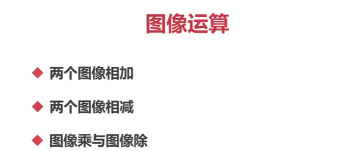
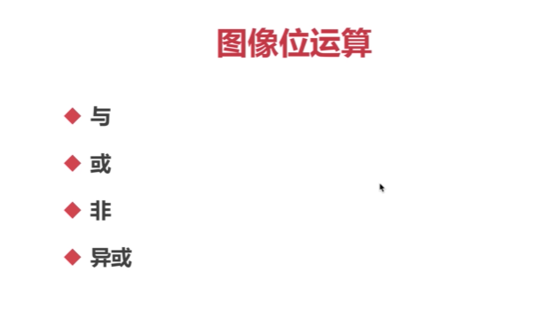

## 图像运算



图像运算是数字图像处理中常用的一种操作，涉及到对图像的像素值进行加减乘除等数学运算。下面是对两个图像进行加减乘除运算的简单示例：

1. 图像相加：
   图像相加是将两个图像的对应像素值相加，并将结果作为新的像素值。这可以用来增加图像的亮度或进行图像叠加操作。两个图像大小必须相同（矩阵相同）

   ```python
   import cv2
   
   img1 = cv2.imread('image1.jpg')
   img2 = cv2.imread('image2.jpg')
   
   result = cv2.add(img1, img2)
   
   cv2.imshow('Image Addition', result)
   cv2.waitKey(0)
   cv2.destroyAllWindows()
   ```

   

2. 图像相减：
   图像相减是将两个图像的对应像素值相减，并将结果作为新的像素值。这可用于检测图像中的差异或进行背景减除操作。

   ```python
   import cv2
   
   img1 = cv2.imread('image1.jpg')
   img2 = cv2.imread('image2.jpg')
   
   result = cv2.subtract(img1, img2)
   
   cv2.imshow('Image Subtraction', result)
   cv2.waitKey(0)
   cv2.destroyAllWindows()
   ```

   

3. 图像乘法：
   图像乘法是将两个图像的对应像素值相乘，并将结果作为新的像素值。这可用于图像增强或颜色混合操作。

   ```python
   import cv2
   import numpy as np
   
   img1 = cv2.imread('image1.jpg')
   img2 = cv2.imread('image2.jpg')
   
   result = np.multiply(img1, img2)
   
   cv2.imshow('Image Multiplication', result)
   cv2.waitKey(0)
   cv2.destroyAllWindows()
   ```

   

4. 图像除法：
   图像除法是将两个图像的对应像素值相除，并将结果作为新的像素值。这可用于图像修复或归一化操作。

   ```python
   import cv2
   import numpy as np
   
   img1 = cv2.imread('image1.jpg')
   img2 = cv2.imread('image2.jpg')
   
   result = np.divide(img1, img2)
   
   cv2.imshow('Image Division', result)
   cv2.waitKey(0)
   cv2.destroyAllWindows()
   ```

   

请注意，这只是简单的示例代码，假设图像大小和通道数相同。在实际应用中，可能需要进行适当的图像尺寸和通道数的匹配、数据类型转换、或者使用更高级的图像处理算法来实现更准确的结果。


## 图像溶合

图像溶合是将两幅图像按照一定的权重混合在一起，得到一幅新的图像。其中，每个像素值的计算方式如下：

```python
dst(x,y) = alpha × A(x,y) + beta × B(x,y) + gamma
```


其中，`A` 和 `B` 为输入的两幅图像，`alpha` 和 `beta` 为它们的权重，`gamma` 为静态权重，`dst(x,y)` 为输出图像的像素值。

在这个计算公式中，`alpha` 和 `beta` 两个权重表示了两幅图像在最终图像中的比例。在权重相等时，两幅图像被均匀地混合在一起。当它们的权重不等时，一幅图像会在最终图像中占据更大的比例，因此可以用这种方式实现图像的柔化或强化等特效。

`gamma` 是一个静态权重，用于调整最终输出图像的亮度。如果不需要调整亮度，则可以将其设置为 0。

在 OpenCV 中，可以使用 `cv2.addWeighted()` 函数来实现这个操作，其具体用法如下：

```python
import cv2

img1 = cv2.imread('image1.jpg')
img2 = cv2.imread('image2.jpg')

alpha = 0.5
beta = 0.5
gamma = 0

result = cv2.addWeighted(img1, alpha, img2, beta, gamma)

cv2.imshow('Image Blending', result)
cv2.waitKey(0)
cv2.destroyAllWindows()
```

在这个示例中，我们将两幅图像按照权重相等的比例进行混合。根据需要，可以使用不同的权重和静态权重来实现不同的图像演示效果。

## 图像位运算




图像位运算常用的有与、或、非和异或等操作。

1. 图像与运算（AND）
   图像与运算是将两幅图像的对应像素值进行按位与运算，然后输出结果图像。该操作会提取两幅图像中对应像素强度值都为**非零**的部分，并将其保留下来。

```python
import cv2

img1 = cv2.imread('image1.jpg')
img2 = cv2.imread('image2.jpg')

result = cv2.bitwise_and(img1, img2)

cv2.imshow('Image AND', result)
cv2.waitKey(0)
cv2.destroyAllWindows()
```


1. 图像或运算（OR）
   图像或运算是将两幅图像的对应像素值进行按位或运算，然后输出结果图像。该操作会将两幅图像中对应像素强度值至少有一幅为非零的部分保留下来。

```python
import cv2

img1 = cv2.imread('image1.jpg')
img2 = cv2.imread('image2.jpg')

result = cv2.bitwise_or(img1, img2)

cv2.imshow('Image OR', result)
cv2.waitKey(0)
cv2.destroyAllWindows()
```


1. 图像非运算（NOT）
   图像非运算是将一幅图像的像素进行按位取反运算，然后输出结果图像。该操作会将输入图像中非零像素的值转换为零，将零像素的值转换为非零。

```python
import cv2

image = cv2.imread('image.jpg')

result = cv2.bitwise_not(image)

cv2.imshow('Image NOT', result)
cv2.waitKey(0)
cv2.destroyAllWindows()
```


1. 图像异或运算（XOR）
   图像异或运算是将两幅图像的对应像素值进行按位异或运算，然后输出结果图像。该操作会将两幅图像中对应像素强度值不相同的部分保留下来。

```python
import cv2

img1 = cv2.imread('image1.jpg')
img2 = cv2.imread('image2.jpg')

result = cv2.bitwise_xor(img1, img2)

cv2.imshow('Image XOR', result)
cv2.waitKey(0)
cv2.destroyAllWindows()
```


这些位运算操作可以帮助我们对图像进行像素级别的处理，例如图像的融合、特效叠加、边缘提取等。请根据具体需求选择合适的位运算操作。

