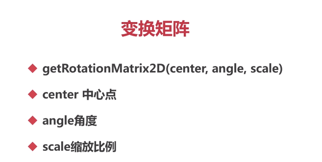
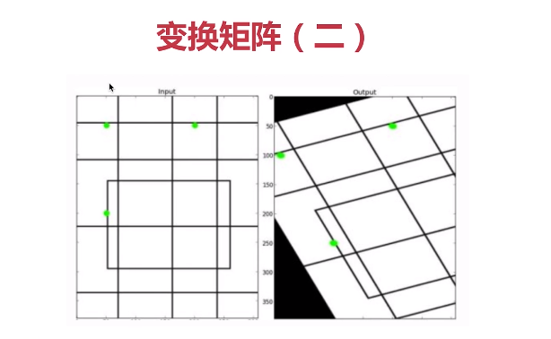
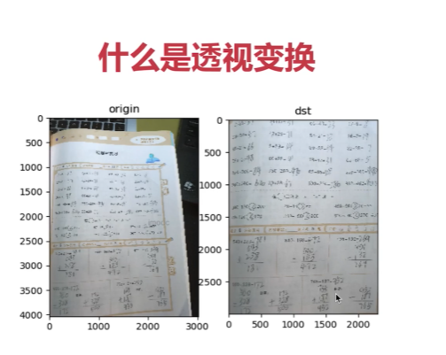

## 图像的放大与缩小 resize


### 图像缩放

对于图像缩放，可以使用OpenCV中的resize()函数来实现。该函数的参数包括：

```python
resize(src, dst, dsize, fx, fy, interpolation)
```


- src: 原始图像
- dst: 缩放后的图像
- dsize: 缩放后的图像尺寸，可以是tuple类型的 (width, height)
- fx: x轴的缩放因子，可以是浮点数
- fy: y轴的缩放因子，可以是浮点数
- interpolation: 插值算法，用于处理缩放过程中的像素插值。有以下几种选项：
  - cv2.INTER_NEAREST: 使用最近邻插值算法,速度快，效果差
  - cv2.INTER_LINEAR: 使用双线性插值算法（默认选项）效果比较好
  - cv2.INTER_AREA: 使用区域插值算法 效果最好
  - cv2.INTER_CUBIC: 使用双立方插值算法
  - cv2.INTER_LANCZOS4: 使用Lanczos插值算法

示例代码：

```python
import cv2

# 读取原始图像
img = cv2.imread('image.jpg')

# 定义缩放因子
fx = 0.5  # x轴缩放因子
fy = 0.5  # y轴缩放因子

# 缩放图像
resized_img = cv2.resize(img, None, fx=fx, fy=fy, interpolation=cv2.INTER_LINEAR)

# 显示结果
cv2.imshow("Original Image", img)
cv2.imshow("Resized Image", resized_img)
cv2.waitKey(0)
cv2.destroyAllWindows()
```


在上述示例中，将原始图像按照0.5的缩放因子在x轴和y轴方向上进行缩放，并使用双线性插值算法进行像素插值处理。最后显示原始图像和缩放后的图像。您可以根据需要调整缩放因子和插值算法，以获得符合您需求的图像缩放效果。


### 图像翻转 flip

对于图像翻转，可以使用OpenCV中的flip()函数来实现。该函数的参数包括：

```python
flip(img, flipCode)
```


- img: 原始图像
- flipCode: 翻转代码，用于指定翻转的方向。有以下几种选项：
  - 0: 沿着x轴翻转（上下翻转）
  - 正数: 沿着y轴翻转（左右翻转）
  - 负数: 沿着x轴和y轴同时翻转（上下+左右翻转）

示例代码：

```python
import cv2

# 读取原始图像
img = cv2.imread('image.jpg')

# 翻转图像
flipped_img = cv2.flip(img, flipCode=1)  # 此处flipCode=1表示沿着y轴翻转（左右翻转）

# 显示结果
cv2.imshow("Original Image", img)
cv2.imshow("Flipped Image", flipped_img)
cv2.waitKey(0)
cv2.destroyAllWindows()
```


在上述示例中，我们对原始图像进行沿着y轴的翻转（左右翻转），并显示原始图像和翻转后的图像。您可以根据需要调整翻转代码，以实现不同的图像翻转效果。例如，将flipCode设置为0则可以实现沿着x轴的翻转（上下翻转），设置为负数则可以实现上下+左右的翻转。

### 图像旋转 rotate

对于图像旋转，可以使用OpenCV中的rotate()函数来实现。该函数的参数包括：

```python
rotate(img, rotateCode)
```


- img: 原始图像
- rotateCode: 旋转代码，用于指定旋转的角度。有以下几种选项：
  - cv2.ROTATE_90_CLOCKWISE: 顺时针旋转90度
  - cv2.ROTATE_180: 旋转180度
  - cv2.ROTATE_90_COUNTERCLOCKWISE: 逆时针旋转90度

示例代码：

```python
import cv2

# 读取原始图像
img = cv2.imread('image.jpg')

# 旋转图像
rotated_img = cv2.rotate(img, cv2.ROTATE_90_CLOCKWISE)  # 顺时针旋转90度

# 显示结果
cv2.imshow("Original Image", img)
cv2.imshow("Rotated Image", rotated_img)
cv2.waitKey(0)
cv2.destroyAllWindows()
```


在上述示例中，我们对原始图像进行顺时针旋转90度，并显示原始图像和旋转后的图像。您可以根据需要调整旋转代码，以实现不同角度的图像旋转效果。例如，将rotateCode设置为cv2.ROTATE_180则可以旋转180度，设置为cv2.ROTATE_90_COUNTERCLOCKWISE则可以逆时针旋转90度。

### 仿射变换 warpAffine

仿射变换（Affine Transformation）是指在二维平面上对图像进行线性变换的过程，它可以通过矩阵运算来表示。在仿射变换中，平面上的所有点都会根据一个线性变换矩阵进行变换，包括平移、缩放、旋转、剪切等操作。

对于仿射变换，可以使用OpenCV中的warpAffine()函数来实现。该函数的参数包括：

```python
warpAffine(src, M, dsize, flags, mode, value)
```


- src: 原始图像
- M: 变换矩阵，是一个2x3的矩阵，可以通过cv2.getAffineTransform()函数获得
- dsize: 输出图像的尺寸大小，可以是tuple类型的 (width, height)
- flags: 插值算法，用于处理变换过程中的像素插值。与resize函数的插值算法参数一致，可选参数有：
  - cv2.INTER_NEAREST: 使用最近邻插值算法
  - cv2.INTER_LINEAR: 使用双线性插值算法（默认选项）
  - cv2.INTER_AREA: 使用区域插值算法
  - cv2.INTER_CUBIC: 使用双立方插值算法
  - cv2.INTER_LANCZOS4: 使用Lanczos插值算法
- mode: 边界外推法标志，用于处理变换过程中边界外的像素。可选参数有：
  - cv2.BORDER_CONSTANT: 值填充（默认选项），用value参数指定填充值
  - cv2.BORDER_REPLICATE: 复制边界像素
  - cv2.BORDER_REFLECT: 反射边界像素
  - cv2.BORDER_WRAP: 复制并翻转边界像素
- value: 填充边界的值，只有当mode参数为cv2.BORDER_CONSTANT时才会用到

示例代码：

```python
import cv2
import numpy as np

# 读取原始图像
img = cv2.imread('image.jpg')

# 定义变换矩阵
M = np.float32([[1, 0, 100], [0, 1, 50]])  # 平移变换矩阵

# 计算输出尺寸
height, width = img.shape[:2]
dsize = (width, height)

# 进行仿射变换
transformed_img = cv2.warpAffine(img, M, dsize, flags=cv2.INTER_LINEAR, borderMode=cv2.BORDER_CONSTANT, borderValue=(0, 0, 0))

# 显示结果
cv2.imshow("Original Image", img)
cv2.imshow("Transformed Image", transformed_img)
cv2.waitKey(0)
cv2.destroyAllWindows()
```


在上述示例中，我们定义了一个平移变换矩阵，将原始图像沿x轴方向平移100个像素距离，沿y轴方向平移50个像素距离，并使用双线性插值算法进行像素插值处理。同时，我们使用了值填充的边界外推法，将边界外的像素值填充为黑色。您可以根据需要调整变换矩阵、插值算法、边界外推法和填充值，以实现不同的仿射变换效果。

#### 平移矩阵

当需要对图像进行平移操作时，可以使用平移变换矩阵进行计算。具体的步骤如下：

1. 创建一个2x3的平移变换矩阵：

   ```python
   | 1  0  tx |
   | 0  1  ty |
   ```

   

   其中，tx表示平移的x方向偏移量，ty表示平移的y方向偏移量。

2. 遍历图像中的每个像素，根据平移变换矩阵计算新的像素位置：

   ```python
   x' = x + tx
   y' = y + ty
   ```

   

   其中，(x, y)表示原始像素的位置，(x’, y’)表示经过平移变换后的新像素位置。

3. 根据插值算法，计算新位置对应的像素值。可以使用最近邻插值、双线性插值等方法来处理像素值的计算。

4. 更新图像中每个像素的位置和像素值，得到平移后的图像。

需要注意的是，实际的平移操作通常会使用图像处理库（如OpenCV）提供的函数来完成，这些函数已经封装了平移变换的细节和优化算法，可以更高效地处理图像的平移操作。以下是一个使用OpenCV进行图像平移的示例代码：

```python
import cv2
import numpy as np

# 读取图像
img = cv2.imread('image.jpg')

# 定义平移矩阵
tx = 100  # x轴方向平移量
ty = 50  # y轴方向平移量
M = np.float32([[1, 0, tx], [0, 1, ty]])

# 计算输出图像的尺寸
height, width = img.shape[:2]
dsize = (width, height)

# 进行平移变换
translated_img = cv2.warpAffine(img, M, dsize)

# 显示原始图像和平移后的图像
cv2.imshow("Original Image", img)
cv2.imshow("Translated Image", translated_img)
cv2.waitKey(0)
cv2.destroyAllWindows()
```


在上述示例中，我们通过指定平移矩阵的tx和ty分量来控制图像的平移量，然后使用warpAffine函数进行平移变换，并得到平移后的图像。最后使用imshow函数将原始图像和平移后的图像显示出来。

您可以根据需要修改tx和ty的值，调整平移的方向和距离，从而得到不同的平移效果。

#### 旋转矩阵 getRotationMatrix2D



函数`getRotationMatrix2D(center, angle, scale)`是OpenCV库中用于创建仿射变换矩阵的函数。

其中参数的含义如下：

- `center`：变换的中心点，表示对图像进行旋转和缩放变换时的中心点。一般为图像的中心点坐标`(cx, cy)`。
- `angle`：旋转角度，表示需要对图像进行旋转的角度。
- `scale`：缩放比例，表示对图像进行缩放的比例因子。

返回值是一个2x3的仿射变换矩阵，用于对图像进行旋转和缩放操作。变换矩阵的形式如下：

```python
| cos(angle)  -sin(angle)  (1 - scale)*cx + scale*cy |
| sin(angle)   cos(angle)  (1 - scale)*cy - scale*cx |
```


其中，`cos(angle)`和`sin(angle)`表示旋转的角度的余弦和正弦值，确保图像按指定的角度进行旋转；`(1 - scale)*cx + scale*cy`和`(1 - scale)*cy - scale*cx`分别控制图像的缩放和旋转中心。

当使用`getRotationMatrix2D(center, angle, scale)`函数时，您可以按照以下步骤进行操作：

1. 导入必要的库：

```python
import cv2
import numpy as np
```


1. 读取图像：

```python
img = cv2.imread('image.jpg')
```


1. 定义变换中心点：

```python
center = (img.shape[1] // 2, img.shape[0] // 2)
```


这里将中心点设置为图像宽度的一半和高度的一半。可以根据需要进行调整。

1. 定义旋转角度和缩放比例：

```python
angle = 45  # 旋转角度为45度
scale = 0.8  # 缩放比例为0.8
```


这里将旋转角度设置为45度，缩放比例设置为0.8。可以根据需要进行调整。

1. 创建变换矩阵：

```python
M = cv2.getRotationMatrix2D(center, angle, scale)
```


1. 应用变换矩阵进行图像变换：

```python
rotated_img = cv2.warpAffine(img, M, (img.shape[1], img.shape[0]))
```


这里使用`warpAffine`函数将变换矩阵应用于图像，得到旋转和缩放后的图像。`img.shape[1]`表示图像的宽度，`img.shape[0]`表示图像的高度。

1. 显示原始图像和变换后的图像：

```python
cv2.imshow("Original Image", img)
cv2.imshow("Rotated and Scaled Image", rotated_img)
cv2.waitKey(0)
cv2.destroyAllWindows()
```


在这个示例中，我们演示了如何使用`getRotationMatrix2D`函数创建变换矩阵，并使用`warpAffine`函数对图像进行旋转和缩放变换。您可以根据需要修改旋转角度和缩放比例的值，以获得不同的变换效果。

#### 变换矩阵（2）getAffineTransform



`getAffineTransform(src, dst)`是OpenCV库中用于计算仿射变换矩阵的函数。

其中，`src`是原始图像中的三个点的坐标，`dst`是目标图像中对应的三个点的坐标。通过这三个点的对应关系，可以确定平移、缩放和旋转的变换矩阵。

返回值是一个2x3的仿射变换矩阵，用于对图像进行仿射变换操作。变换矩阵的形式如下：

```python
| a11  a12  b1 |
| a21  a22  b2 |
```

其中，`a11`、`a12`、`a21`和`a22`是用于缩放和旋转的元素，`b1`和`b2`是用于平移的元素。

使用该函数，可以根据三个点的对应关系来计算变换矩阵。然后，可以利用变换矩阵与`warpAffine`函数配合使用，对图像进行实际的仿射变换操作。

以下是使用`getAffineTransform(src, dst)`函数计算仿射变换矩阵的具体代码示例：

```python
import cv2
import numpy as np

# 读取原始图像
img = cv2.imread('image.jpg')

# 原始图像中的三个点的坐标
src_points = np.float32([[50, 50], [200, 50], [50, 200]])

# 目标图像中对应的三个点的坐标
dst_points = np.float32([[70, 100], [220, 50], [150, 200]])

# 计算仿射变换矩阵
M = cv2.getAffineTransform(src_points, dst_points)

# 应用仿射变换矩阵进行图像变换
transformed_img = cv2.warpAffine(img, M, (img.shape[1], img.shape[0]))

# 显示原始图像和变换后的图像
cv2.imshow("Original Image", img)
cv2.imshow("Transformed Image", transformed_img)
cv2.waitKey(0)
cv2.destroyAllWindows()
```


在这个示例中，我们指定了原始图像中的三个点的坐标`src_points`和目标图像中对应的三个点的坐标`dst_points`，利用这些对应关系计算了仿射变换矩阵`M`。然后，使用`warpAffine`函数将变换矩阵应用于原始图像，得到变换后的图像`transformed_img`。最后，显示原始图像和变换后的图像。

您可以根据需要修改`src_points`和`dst_points`中的点的坐标，以实现不同的仿射变换效果。

### 透视变换



透视变换（Perspective Transformation）是一种图像几何变换操作，用于将图像从一种透视关系映射到另一种透视关系。透视变换可以通过调整图像中的四个关键点来实现，从而实现图像的投影、旋转、倾斜和缩放等效果。

透视变换通常用于校正图像的透视畸变，例如将摄像头拍摄的倾斜或变形的图像进行校正，使其看起来更正常。

透视变换的关键是找到图像中的四个关键点，这四个点将定义变换前后的映射关系。在透视变换中，通过这四个点之间的透视关系来计算变换矩阵，然后使用变换矩阵对整个图像进行变换。

透视变换涉及到图像的投影和透视原理，在计算机视觉和计算机图形学中有广泛的应用，包括校正图像畸变、图像拼接、虚拟现实等领域。

在OpenCV中，可以使用`getPerspectiveTransform(src, dst)`函数计算透视变换矩阵，然后使用`warpPerspective`函数将变换矩阵应用于图像，实现透视变换操作。

#### warpPerspective

您提到的`warpPerspective`是OpenCV库中的函数，用于对图像进行透视变换操作。函数的基本语法如下：

```python
dst = cv2.warpPerspective(img, M, dsize[, flags[, borderMode[, borderValue]]])
```

参数含义如下：
- `img`：原始图像。
- `M`：透视变换矩阵，可以通过`getPerspectiveTransform`函数获取。
- `dsize`：目标图像的大小，可以指定为`(width, height)`。
- `flags`：可选参数，用于指定插值方法。默认值为`cv2.INTER_LINEAR`。
- `borderMode`：可选参数，用于指定边界填充模式。默认值为`cv2.BORDER_CONSTANT`。
- `borderValue`：可选参数，用于指定边界填充值。默认值为`0`。

函数返回变换后的图像`dst`。

下面是一个简单的示例代码，展示如何使用`warpPerspective`函数进行透视变换：

```python
import cv2
import numpy as np

# 读取原始图像
img = cv2.imread('image.jpg')

# 定义原始图像中的四个关键点
src_points = np.float32([[50, 50], [200, 50], [50, 200], [200, 200]])

# 定义目标图像中对应的四个关键点
dst_points = np.float32([[0, 0], [300, 0], [0, 300], [300, 300]])

# 计算透视变换矩阵
M = cv2.getPerspectiveTransform(src_points, dst_points)

# 定义目标图像的大小
dsize = (300, 300)

# 进行透视变换
transformed_img = cv2.warpPerspective(img, M, dsize)

# 显示原始图像和变换后的图像
cv2.imshow("Original Image", img)
cv2.imshow("Transformed Image", transformed_img)
cv2.waitKey(0)
cv2.destroyAllWindows()
```

在这个示例中，我们通过`getPerspectiveTransform`函数计算了透视变换矩阵`M`，然后使用`warpPerspective`函数将变换矩阵应用于原始图像`img`，得到变换后的图像`transformed_img`。最后，将原始图像和变换后的图像进行显示。

您可以根据需要修改`src_points`和`dst_points`中的关键点坐标和`dsize`来实现不同的透视变换效果。

#### getPerspectiveTransform

`getPerspectiveTransform(src, dst)`是OpenCV库中的函数之一，用于计算透视变换矩阵。该函数需传入两个参数：`src`和`dst`。

`src`是原始图像中待变换的四个点的坐标，这四个点通常是图像中感兴趣区域的四个角点，可以使用`float32`类型的Numpy数组或列表表示。

`dst`是目标图像中对应的四个点的坐标，这四个点定义了变换后的四个角点的位置关系，同样使用`float32`类型的Numpy数组或列表表示。

透视变换矩阵将基于`src`和`dst`的对应关系进行计算，并返回一个`3x3`的变换矩阵`M`。变换矩阵`M`可以用于后续的透视变换操作，例如使用`warpPerspective`函数将变换矩阵应用到图像上。

下面是一个简单的示例代码，展示如何使用`getPerspectiveTransform`函数计算透视变换矩阵：

```python
import cv2
import numpy as np

# 原始图像中的四个角点坐标
src_points = np.float32([[50, 50], [200, 50], [50, 200], [200, 200]])

# 目标图像中对应的四个角点坐标
dst_points = np.float32([[0, 0], [300, 0], [0, 300], [300, 300]])

# 计算透视变换矩阵
M = cv2.getPerspectiveTransform(src_points, dst_points)

print("透视变换矩阵:")
print(M)
```

在这个示例中，我们定义了原始图像中的四个角点坐标`src_points`和目标图像中对应的四个角点坐标`dst_points`。然后，通过调用`getPerspectiveTransform`函数，将`src_points`和`dst_points`传入，计算得到透视变换矩阵`M`。

请注意，这里的四个点的顺序在定义时要保持一致，以确保计算得到正确的透视变换矩阵。另外，这些点的顺序可以按照自己的需求进行调整，以实现不同的透视变换效果。
