# 图像滤波


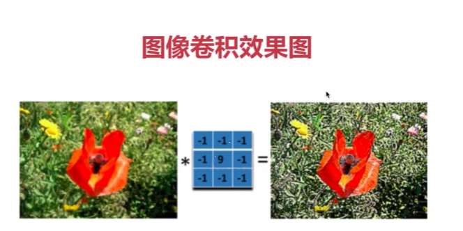


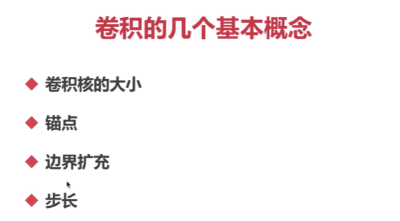

## 卷积核的大小

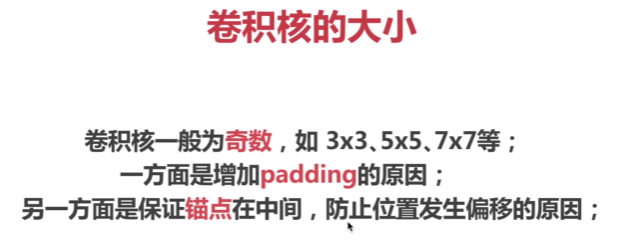

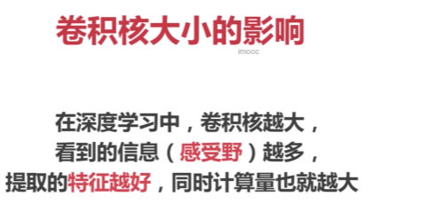


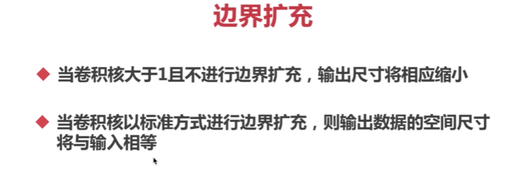

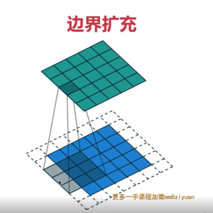

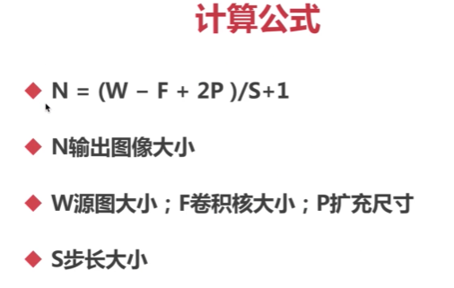

## 实战图像卷积

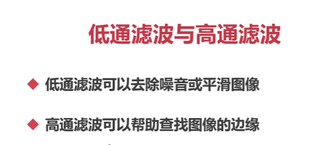


在数字图像处理中，卷积操作是一种常用的图像增强方法，可以用于平滑、锐化、边缘检测等图像处理任务。在OpenCV中，可以使用`filter2D`函数实现图像卷积操作。

函数的基本语法如下：

```python
dst = cv2.filter2D(src, ddepth, kernel[, anchor[, delta[, borderType]]])
```

参数含义如下：
- `src`：输入的图像。
- `ddepth`：输出图像的深度（即数据类型）。通常与输入图像保持一致，例如`-1`表示与输入图像类型相同。
- `kernel`：卷积核。可以使用`NumPy`数组或`cv2.getGaussianKernel`等函数生成。
- `anchor`：可选参数，指定卷积核的中心位置。默认值为`(-1, -1)`，表示将卷积核的中心设置为中心像素点。
- `delta`：可选参数，用于调整输出图像的偏移量。默认值为`0`，表示偏移量为`0`。
- `borderType`：可选参数，用于指定边界填充模式。默认值为`cv2.BORDER_DEFAULT`。

函数返回应用卷积核后的输出图像`dst`。

卷积核`kernel`是一个MxN的矩阵，其中每个元素存储了卷积操作的权重。卷积操作可以看作是将卷积核在图像上移动，并计算卷积核与图像像素值的加权和，然后将结果存储在输出图像相应位置。图像卷积操作可以用于平滑图像、锐化图像、检测边缘等任务。

下面是一个简单的示例代码，展示如何使用`filter2D`函数进行图像平滑操作：

```python
import cv2
import numpy as np

# 读取输入图像
img = cv2.imread('image.jpg')

# 创建5x5的平均值卷积核
kernel = np.ones((5, 5), np.float32) / 25

# 应用卷积操作
res = cv2.filter2D(img, -1, kernel)

# 显示原始图像和平滑处理结果
cv2.imshow("Original Image", img)
cv2.imshow("Smooth Image", res)
cv2.waitKey(0)
cv2.destroyAllWindows()
```

在这个示例中，我们读取了原始图像`img`，然后创建了一个5x5的平均值卷积核`kernel`。接着，使用`filter2D`函数对图像`img`应用卷积核`kernel`，得到平滑后的图像`res`。最后，将原始图像和平滑后的图像进行显示。

您可以根据需要选择不同的卷积核来实现不同的图像处理任务，例如使用Sobel算子进行边缘检测，或使用Laplacian算子进行图像增强。请注意，在实际应用中，我们通常会对图像进行边界填充（即使用`borderType`参数）来避免边界降采样引起的信息损失问题。

## 方盒滤波与均值滤波

### 方盒滤波卷积核

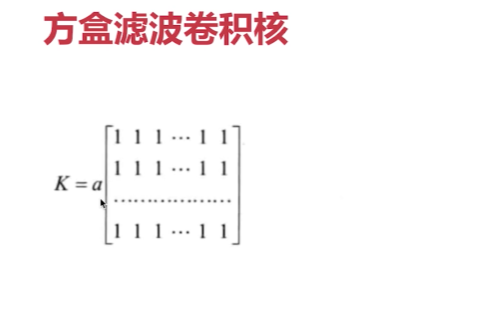

在方盒滤波卷积核中，参数 `a` 用于控制滤波卷积核是否进行归一化处理。

当 `normalize` 设置为 `true` 时，滤波卷积核进行归一化处理，参数 `a` 的取值为 `1/(W x H)`，其中 `W` 代表滤波卷积核的宽度，`H` 代表滤波卷积核的高度。这意味着滤波卷积核中的每个元素将会除以滤波卷积核的总元素数，以确保滤波卷积核的和为1。

当 `normalize` 设置为 `false` 时，滤波卷积核不进行归一化处理，参数 `a` 的取值为1。这意味着滤波卷积核的每个元素将保持原始的数值。

使用归一化的滤波卷积核可以减少输出图像上的亮度变化，使得滤波卷积核对图像进行平均化处理。而不进行归一化的滤波卷积核则可以保留原始图像的亮度特征。选择是否进行归一化处理，取决于具体的应用需求。


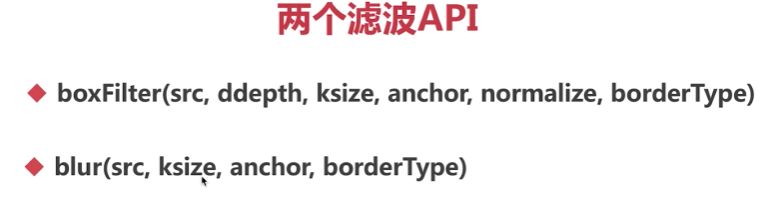

 用blur多一点

您提及了两个滤波相关的API：`boxFilter` 和 `blur`。下面是对这两个API的解释：

1. `boxFilter`：
   - 参数：
     - `src`：输入图像。
     - `ddepth`：输出图像的深度（数据类型）。
     - `ksize`：滤波卷积核的尺寸（宽度和高度）。
     - `anchor`：滤波卷积核的锚点位置。
     - `normalize`：是否进行归一化处理的标志。
     - `borderType`：边界处理类型。
   - 功能：
     `boxFilter` 函数具有对输入图像应用方盒滤波的功能。方盒滤波使用一个具有相等权重的滤波卷积核进行滤波操作。该函数可以用于实现平滑效果和去噪。
   
2. `blur`：
   - 参数：
     - `src`：输入图像。
     - `ksize`：滤波卷积核的尺寸（宽度和高度）。
     - `anchor`：滤波卷积核的锚点位置。
     - `borderType`：边界处理类型。
   - 功能：
     `blur` 函数用于对输入图像进行方框滤波。方框滤波和方盒滤波类似，都是使用相等权重的滤波卷积核进行滤波操作。这个函数也可以用于实现平滑效果和去噪。
     

这些滤波函数是通过对输入图像应用不同的滤波卷积核来实现的，具体效果可以根据传递的参数来调整。需要注意的是，这些API的具体实现可能会根据特定的图像处理库或框架而有所不同。

以下是针对OpenCV库的具体示例，演示如何使用`boxFilter`和`blur`函数来对图像应用滤波：

```python
import cv2

# 读取图像
img = cv2.imread('image.jpg')

# 使用boxFilter函数进行滤波
box_filtered = cv2.boxFilter(img, -1, (5, 5), normalize=True, borderType=cv2.BORDER_DEFAULT)

# 使用blur函数进行滤波
blur_filtered = cv2.blur(img, (5, 5), anchor=(-1, -1), borderType=cv2.BORDER_DEFAULT)

# 显示原始图像和滤波后的图像
cv2.imshow('Original Image', img)
cv2.imshow('Box Filtered Image', box_filtered)
cv2.imshow('Blur Filtered Image', blur_filtered)
cv2.waitKey(0)
cv2.destroyAllWindows()
```

上述示例中，首先读取了一个名为`image.jpg`的图像。然后使用`boxFilter`函数和`blur`函数对图像进行滤波操作。其中，`boxFilter`函数的滤波卷积核尺寸为(5, 5)，并将`normalize`参数设置为`True`来进行归一化处理；`blur`函数的滤波卷积核尺寸也为(5, 5)。最后，将原始图像和滤波后的图像显示出来。

请注意，这只是一个示例，您可以根据具体的需求和实际情况对参数进行调整。

## 高斯滤波（去噪）

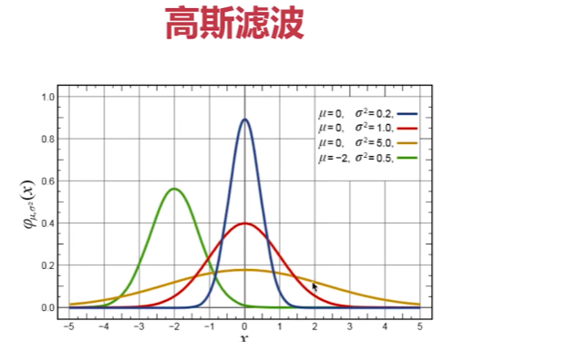

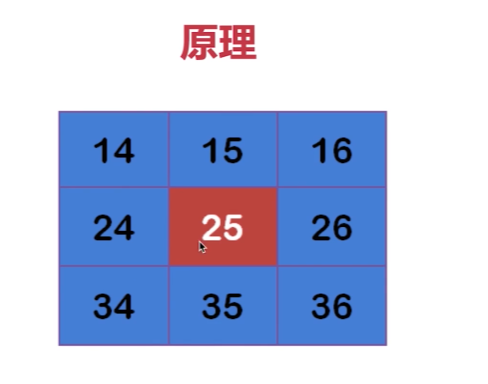

高斯滤波是一种常用的图像滤波方法，主要用于图像的平滑处理和去噪。其核心原理是基于高斯函数（Gaussian function）来生成滤波卷积核，通过对图像进行卷积操作来实现滤波效果。

高斯函数是一个连续的数学函数，定义了一个二维高斯分布。它在空间域中呈现出平滑的曲线，具有中心对称性和峰值。高斯滤波通过将高斯函数应用于图像的每个像素，来生成一个滤波卷积核，然后将该卷积核与图像进行卷积操作。

在进行高斯滤波时，滤波卷积核的尺寸和标准差（sigma）是两个重要的参数。滤波卷积核的尺寸决定了高斯滤波的范围和程度，而标准差则控制了滤波卷积核的形状。标准差越大，滤波卷积核的形状越宽，滤波效果越平滑。

实际上，高斯滤波卷积核是一个二维的高斯函数矩阵，其中每个元素表示滤波卷积核在相应位置上的权重。在对图像进行卷积操作时，将滤波卷积核的每个元素与对应位置上的像素值相乘，然后将所得乘积累加起来，作为输出图像的对应像素值。通过这种方式，可以使得输出图像的每个像素值被其周围像素的加权平均代替，从而实现图像的平滑和去噪效果。

高斯滤波常用于在图像处理领域中进行平滑处理和边缘保留滤波。它能够有效地消除图像中的噪声，同时保持图像的边缘和细节信息。不同的滤波卷积核尺寸和标准差可以产生不同程度的平滑效果，因此可以根据实际需求选择适当的参数来调整滤波效果。

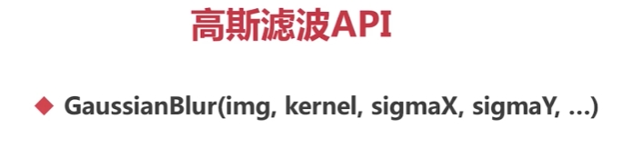

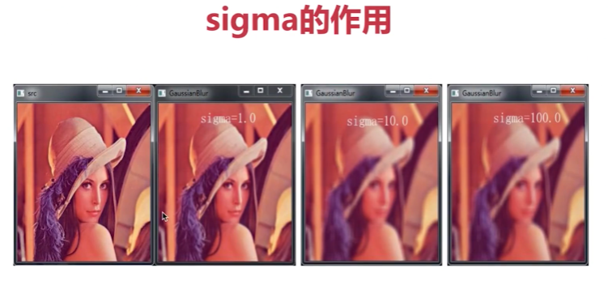


您提到的 `GaussianBlur` 是OpenCV图像处理库中提供的高斯滤波相关API。下面是对该函数的参数和功能的简要解释：

- 参数：
  - `img`：输入图像。
  - `kernel`：滤波核的大小，一般为奇数，例如 (3,3) 或 (5,5)。
  - `sigmaX`：高斯核函数在 X 方向上的标准差。
  - `sigmaY`：高斯核函数在 Y 方向上的标准差。如果未指定，则与 `sigmaX` 相同。
  - `borderType`：像素边界模式，默认为 `cv2.BORDER_DEFAULT`。
- 功能：
  `GaussianBlur` 函数主要用于对输入图像进行高斯滤波操作。通常情况下，该函数被用来降低图像噪声和平滑化图像，也可以用来提取图像的某些特征。

下面是一个使用 `GaussianBlur` 对图像进行平滑处理的示例：

```python
import cv2

# 读取图像
img = cv2.imread('image.jpg')

# 对图像进行高斯滤波
blur_img = cv2.GaussianBlur(img, (5, 5), 0)

# 显示原始图像和滤波后的图像
cv2.imshow('Original Image', img)
cv2.imshow('Gaussian Blur Image', blur_img)
cv2.waitKey(0)
cv2.destroyAllWindows()
```


在上面的示例中，`GaussianBlur` 函数被用于对读取得到的图像进行高斯滤波操作。滤波核的大小被设置为 (5, 5)，高斯核函数在 X 和 Y 方向上的标准差都被设置为 0，表示由函数自动计算。最终得到的高斯平滑结果存储在变量 `blur_img` 中，并使用 `imshow` 函数显示出来。

## 什么是中值滤波（去噪）

假设有一个数组[1556789]，取其中的中间值作为卷积后的结果值


中值滤波（Median Filtering)是一种常用的图像处理滤波器，用于去除图像中的噪声。它是一种非线性滤波器，通过用像素周围邻域的中值代替该像素的值来实现滤波。

中值滤波的工作原理如下：

1. 选择一个固定大小的滑动窗口，在图像上逐个移动。
2. 对于滑动窗口中的每个像素，将像素的灰度值按照从小到大的顺序排列。
3. 将中值（中间值）作为当前像素的新值。
4. 重复上述步骤，直到整个图像都被处理完。

中值滤波在去除图像中的椒盐噪声或斑点噪声方面效果较好，因为它能够保留图像的边缘信息。与其他线性滤波方法（如均值滤波）相比，中值滤波能够更好地消除离群值或异常像素。

需要注意的是，中值滤波会消除图像中的噪声，但同时也会损失一些细节信息。在选择滤波器大小时，需要权衡去噪效果和细节保留之间的平衡。

在OpenCV中，你可以使用`cv2.medianBlur()`函数来实现中值滤波。以下是一个使用中值滤波的简单示例：

```python
import cv2

# 读取图像文件
image = cv2.imread('image.jpg')

# 中值滤波
filtered_image = cv2.medianBlur(image, 5)  # 使用5x5的滑动窗口

# 显示原始图像和滤波后的图像
cv2.imshow('Original Image', image)
cv2.imshow('Filtered Image', filtered_image)
cv2.waitKey(0)
cv2.destroyAllWindows()
```


在这个示例中，我们使用`cv2.medianBlur()`函数对图像进行中值滤波，滑动窗口的大小为5x5。滤波后的图像保存在`filtered_image`变量中，然后使用`imshow()`函数显示原始图像和滤波后的图像。

运行这段代码后，你应该能够看到原始图像和经过中值滤波后的图像。滤波后的图像将不再受噪声的影响，并且噪声点将被平均为周围像素的中值。

## 双边滤波


边缘不模糊能够保留脸部细节


双边滤波（Bilateral filtering）是一种常用的图像滤波技术，用于去除图像中的噪声，同时保留图像的边缘信息。它基于像素之间的空间距离和像素值相似度来进行加权计算，从而实现滤波的效果。

与其他滤波方法（如线性平滑滤波）不同，双边滤波在滤波过程中考虑了像素的空间关系和像素值的相似度。这是由于在某些情况下，仅考虑像素值相似性可能导致模糊边缘或细节丢失。

双边滤波的原理如下：

1. 空间距离加权：双边滤波通过定义一个滤波窗口来计算像素的空间距离。离当前像素越近的像素会被赋予更高的权重，离得更远的像素则具有较低的权重。这个权重是通过一个空间高斯核函数来计算的，通常是基于滑动窗口内像素与中心像素的欧氏距离。

2. 像素值相似度加权：在滤波窗口内，像素之间的值相似性也需要考虑。滤波窗口内的像素值越相似，它们对中心像素的影响权重就更大。这个权重是通过一个像素值的相似性高斯核函数来计算的，通常基于滑动窗口内像素值之间的欧氏距离。

3. 加权求和：最后，滤波窗口内的像素根据它们的空间距离和像素值相似度加权进行求和。权重较大的像素对最终滤波结果的贡献更大，而权重较小的像素则贡献较小。

这种综合考虑空间距离和像素值相似性的双边滤波方法，使得它能够有效地去除噪声，同时保留图像的边缘和细节信息。

需要注意的是，双边滤波算法中的两个高斯核函数的标准差参数需要根据实际应用场景和需求进行调整。较小的标准差将导致保留更多的细节信息，但可能对噪声去除效果较差；较大的标准差将导致更强的平滑效果，但可能模糊细节信息。

在实际应用中，OpenCV等图像处理库提供了双边滤波的函数实现，使用起来十分方便。通过调整参数，你可以根据具体需求来平衡去噪和保护细节之间的权衡。

当使用OpenCV实现双边滤波时，你可以使用`cv2.bilateralFilter()`函数，以下是一个具体示例：

```python
import cv2

# 读取图像文件
image = cv2.imread('image.jpg')

# 双边滤波
filtered_image = cv2.bilateralFilter(image, 9, 75, 75)

# 显示原始图像和滤波后的图像
cv2.imshow('Original Image', image)
cv2.imshow('Filtered Image', filtered_image)
cv2.waitKey(0)
cv2.destroyAllWindows()
```

在这个示例中，我们使用`cv2.bilateralFilter()`函数对图像进行双边滤波。函数的参数解释如下：

- `image`：要滤波的输入图像。
- `d`：滤波窗口的直径。较大的值会考虑更多的像素邻域。
- `sigmaColor`：像素值的颜色空间标准差。较大的值会使颜色相似的像素具有更大的权重。
- `sigmaSpace`：空间距离的标准差。较大的值会使空间邻域内的像素具有更大的权重。

上述代码会对输入的图像进行双边滤波处理，并在窗口中显示原始图像和滤波后的图像。你可以尝试调整函数的参数，观察滤波效果的变化。

值得注意的是，双边滤波是一种计算密集型操作，特别是对于较大的图像可能会比较耗时。因此，在实际应用中需要根据需求权衡滤波效果和计算性能。

## 高通滤波

高通滤波（High-pass filtering）是一种图像处理技术，用于增强图像中的高频细节，并减少低频成分。它可以用来检测图像中的边缘、纹理等高频信息。

高通滤波的原理是通过滤波器去除低频成分，并保留高频成分。常见的高通滤波器有以下几种：

1. Laplacian滤波器：Laplacian滤波器对图像中的边缘和纹理具有强烈的响应。它通过计算像素周围的二阶导数来增强图像的高频信息。
2. Sobel滤波器：Sobel滤波器用于检测图像的边缘。它以一个小的掩模（模板）对图像进行卷积操作，分别计算图像在水平和垂直方向上的一阶导数，然后根据这两个方向上的梯度来确定边缘。
3. Scharr滤波器：Scharr滤波器是Sobel滤波器的改进版，具有更好的旋转不变性和更高的灵敏度。它用于增强图像的边缘。
4. 高斯拉普拉斯（Gaussian-Laplacian）滤波器：高斯拉普拉斯滤波器是一种结合了高斯平滑和Laplacian滤波的方法。它首先对图像进行高斯平滑处理，然后通过计算像素的二阶导数来检测图像中的边缘。

以上是常见的高通滤波器，它们可以通过卷积操作应用于图像。在应用高通滤波器之前，通常需要将图像转换为灰度图像，因为大多数高通滤波器只能处理单通道图像。

这些滤波器的实现可以使用图片处理库（如OpenCV）中的函数来实现。例如，你可以使用`cv2.filter2D()`函数来应用自定义滤波器（如Laplacian、Sobel），或使用`cv2.Laplacian()`、`cv2.Sobel()`等函数来直接应用这些滤波器。通过调整滤波器的参数和阈值，你可以控制高通滤波的效果和灵敏度。

## Sobel算子


`cv2.Sobel()`函数是OpenCV中用于计算Sobel滤波器的函数。下面是该函数的参数解释：

- `src`：输入图像，通常是一个灰度图像（单通道）。
- `ddepth`：输出图像的深度，通常使用 `-1` 来表示与输入图像相同的深度。
- `dx`：在x方向上的倒数阶数。
- `dy`：在y方向上的倒数阶数。
- `ksize`：Sobel滤波器的大小，必须为1、3、5或7。如果ksize为1，则使用3x3的Scharr滤波器。
- `scale`：可选参数，表示对计算结果的缩放因子，默认值为1。
- `delta`：可选参数，表示计算结果添加到输出图像之前的偏移值，默认为0。
- `borderType`：可选参数，用于指定图像边界的填充方式，默认为`BORDER_DEFAULT`。

使用Sobel滤波器时，通常要指定 `dx` 和 `dy` 参数来指定想要计算的导数阶数。例如，`dx=1`和`dy=0`表示计算图像的x方向一阶导数，`dx=0`和`dy=1`表示计算图像的y方向一阶导数。

下面是一个示例代码，演示如何使用`cv2.Sobel()`函数计算图像的x和y方向的Sobel导数：

```python
import cv2
import numpy as np

# 读取图像文件
image = cv2.imread('316-1FG4163559.jpg', cv2.IMREAD_GRAYSCALE)

# 计算x方向的一阶导数
sobelx = cv2.Sobel(image, cv2.CV_64F, 1, 0, ksize=3)

# 计算y方向的一阶导数
sobely = cv2.Sobel(image, cv2.CV_64F, 0, 1, ksize=3)

# 将结果转换为8位无符号整数类型
sobelx = np.uint8(np.abs(sobelx))
sobely = np.uint8(np.abs(sobely))

#两个方向相加则为完整的结果
dst = sobelx + sobely
# 显示原始图像和计算得到的Sobel导数图像
cv2.imshow('Original Image', image)
cv2.imshow('Sobel X', sobelx)
cv2.imshow('Sobel Y', sobely)
cv2.imshow('dst',dst)
cv2.waitKey(0)
cv2.destroyAllWindows()
```

注意，为了在显示结果之前，将导数图像转换为8位无符号整数类型。这是因为Sobel滤波器返回的结果是浮点数，通常需要进行类型转换以便进行显示。

在上述示例中，我们使用`cv2.Sobel()`函数计算了图像的x和y方向的Sobel导数，并将结果显示在窗口中。你可以调整`dx`、`dy`和`ksize`参数来观察Sobel滤波的效果。

## Scharr算子


`cv2.Scharr()`函数是OpenCV中用于计算Scharr滤波器的函数。Scharr滤波器是一种高斯导数滤波器，用于在图像中计算一阶和二阶导数。

下面是该函数的参数解释：

- `src`：输入图像，通常是一个灰度图像（单通道）。
- `ddepth`：输出图像的深度，通常使用 `-1` 来表示与输入图像相同的深度。
- `dx`：在x方向上的导数阶数。
- `dy`：在y方向上的导数阶数。
- `scale`：可选参数，表示对计算结果的缩放因子，默认值为1。
- `delta`：可选参数，表示计算结果添加到输出图像之前的偏移值，默认为0。
- `borderType`：可选参数，用于指定图像边界的填充方式，默认为`BORDER_DEFAULT`。

使用Scharr滤波器时，通过指定`dx`和`dy`参数来选择要计算的导数阶数。例如，`dx=1`和`dy=0`表示计算图像的x方向一阶导数，`dx=0`和`dy=2`表示计算图像的y方向二阶导数。

下面是一个示例代码，演示如何使用`cv2.Scharr()`函数计算图像的x和y方向的Scharr导数：

```python
import cv2
import numpy as np

# 读取图像文件
image = cv2.imread('image.jpg', cv2.IMREAD_GRAYSCALE)

# 计算x方向的一阶导数
scharrx = cv2.Scharr(image, cv2.CV_64F, 1, 0)

# 计算y方向的二阶导数
scharry = cv2.Scharr(image, cv2.CV_64F, 0, 2)

# 将结果转换为8位无符号整数类型
scharrx = np.uint8(np.abs(scharrx))
scharry = np.uint8(np.abs(scharry))

# 显示原始图像和计算得到的Scharr导数图像
cv2.imshow('Original Image', image)
cv2.imshow('Scharr X', scharrx)
cv2.imshow('Scharr Y', scharry)
cv2.waitKey(0)
cv2.destroyAllWindows()
```

在上述示例中，我们使用`cv2.Scharr()`函数计算了图像的x和y方向的Scharr导数，并将结果显示在窗口中。你可以调整`dx`、`dy`参数来观察Scharr滤波的效果。同样需要注意的是，为了在显示结果之前将导数图像转换为8位无符号整数类型。

## 拉普拉斯算子


`Laplacian`是OpenCV库中的一个函数，用于应用Laplacian算子进行图像增强或边缘检测。函数的基本语法如下：

```
dst = cv2.Laplacian(img, ddepth, ksize, scale, borderType)
```


参数含义如下：

- `img`：输入的图像。
- `ddepth`：输出图像的深度（即数据类型）。通常设置为负值（例如`cv2.CV_8U`），表示保持与输入图像相同的深度。
- `ksize`：算子的内核大小。可以设置为`1`、`3`、`5`或`7`(3就是3x3，5就是5x5以此类推)。
- `scale`：可选参数，用于调整输出图像的比例因子。默认值为`1`。
- `borderType`：可选参数，用于指定边界填充模式。默认值为`cv2.BORDER_DEFAULT`。

函数返回应用Laplacian算子后的输出图像`dst`。

Laplacian算子是一种二阶微分滤波器，常用于强调图像的高频细节，例如边缘。通过计算图像在水平和垂直方向上的二阶导数，Laplacian算子可以提取出图像中的边缘信息。

下面是一个简单的示例代码，展示如何使用`Laplacian`函数进行边缘检测：

```python
import cv2

# 读取输入图像
img = cv2.imread('image.jpg', cv2.IMREAD_GRAYSCALE) #cv2.IMREAD_GRAYSCALE是OpenCV中用于读取图像的一个参数。它指定读取图像时将其转换为灰度图像。

# 应用Laplacian算子
laplacian_img = cv2.Laplacian(img, cv2.CV_8U, ksize=3)

# 显示原始图像和边缘检测结果
cv2.imshow("Original Image", img)
cv2.imshow("Laplacian Image", laplacian_img)
cv2.waitKey(0)
cv2.destroyAllWindows()
```

在这个示例中，我们读取了灰度图像`img`，然后使用`Laplacian`函数应用Laplacian算子，得到边缘检测结果`laplacian_img`。最后，将原始图像和边缘检测结果进行显示。

您可以根据需要调整`ksize`、`scale`和`borderType`参数来实现不同的边缘检测效果。请注意，对于彩色图像，建议先将其转换为灰度图像再应用Laplacian算子。

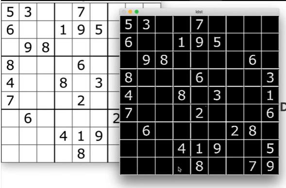

## Canny（边缘检测终极大法）


`cv2.Canny()`是OpenCV中用于实施Canny边缘检测算法的函数。Canny边缘检测是一种经典的边缘检测算法，通过定义一系列的图像处理步骤来检测图像中的边缘。

下面是`cv2.Canny()`函数的参数解释：

- `img`：输入图像，通常是一个灰度图像（单通道）。
- `minVal`：边缘检测的低阈值，用于标记弱边缘。
- `maxVal`：边缘检测的高阈值，用于标记强边缘。
- `...`：可选参数，用于指定Canny边缘检测的其他参数，例如apertureSize（Sobel算子的孔径大小）、L2gradient（是否使用L2范数代替L1范数计算梯度的标志）等。

`cv2.Canny()`函数会返回一个二进制图像，其中边缘被标记为白色（255），非边缘像素被标记为黑色（0）。

以下是使用`cv2.Canny()`函数进行Canny边缘检测的示例代码：

```python
import cv2

# 读取图像文件
image = cv2.imread('image.jpg', cv2.IMREAD_GRAYSCALE)

# 应用Canny边缘检测算法
edges = cv2.Canny(image, 50, 150)

# 显示原始图像和边缘检测结果
cv2.imshow('Original Image', image)
cv2.imshow('Canny Edges', edges)
cv2.waitKey(0)
cv2.destroyAllWindows()
```

在上述示例中，我们使用`cv2.Canny()`函数对图像进行了Canny边缘检测，并将结果显示在窗口中。你可以调整`minVal`和`maxVal`参数来控制阈值，以达到更好的边缘检测效果。

需要注意的是，Canny边缘检测算法对于不同的图像可能需要调整不同的阈值来得到最佳的结果。因此，在实际应用中，你可能需要根据具体情况进行调试和参数优化。