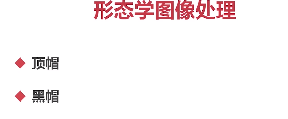
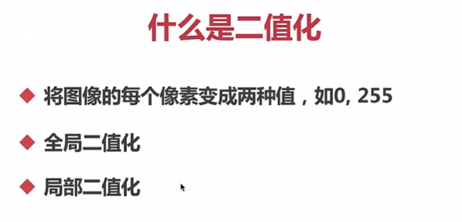
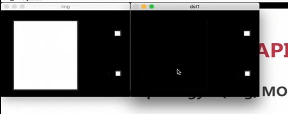

## 形态学概述


腐蚀相当于缩小，膨胀相当于放大

开运算（先腐蚀后膨胀）

闭运算（先膨胀后腐蚀）



做减法

## 图像全局二值化



图像的二值化是将一幅图像转换为只有两个像素值的图像。通常，这两个像素值分别代表图像中的目标物体和背景。

在二值化过程中，会根据像素的灰度值或者其他特征将其分为两个类别。一般情况下，我们使用一个特定的阈值将图像中的像素分为两个类别：低于阈值的像素被认为是背景，高于阈值的像素被认为是目标物体。

图像的二值化通常有两种主要的方法：

1. **固定阈值二值化**：根据一个固定的阈值将图像中的像素分为目标物体和背景。所有的像素值低于阈值的像素被设置为0（黑色），所有高于等于阈值的像素被设置为255（白色）。

2. **自适应阈值二值化**：根据图像的局部信息来确定每个像素的阈值。自适应阈值二值化可以处理图像中光照变化、对比度变化等因素造成的影响。

**全局二值化**是使用一个全局的固定阈值将整个图像的像素值进行分割。所有的像素值低于阈值的像素被设置为最小值，所有高于等于阈值的像素被设置为最大值。全局二值化方法简单直接，但对于**光照变化较大**或者对比度低的图像可能效果不理想。

**局部二值化**是根据图像的局部信息来确定每个像素的阈值。这种方法会考虑每个像素及其周围像素的特征，根据这些特征来**自动确定**阈值。常用的局部二值化方法包括基于均值、基于中值或基于自适应方法（如Otsu算法），每个方法都有不同的计算方式。

**全局二值化**适用于图像整体光照均匀，或者要求精确而一致的二值化结果的情况。而局部二值化更适合处理光照不均匀、对比度较低、背景噪声存在或者不同目标物体具有不同亮度的图像。

在进行二值化之前，通常会先将图像转换为灰度图像，以便更好地提取像素的亮度信息。二值化在很多计算机视觉应用中都是一种重要的预处理技术，例如目标检测、图像分割、字符识别等。

图像的二值化在许多计算机视觉任务中都是非常有用的，比如目标检测、图像分割等。通过将图像转换为二值图像，可以突出显示目标物体并且减少噪声的干扰，从而方便进行后续的图像处理和分析

## 全局二值化 threshold

`cv2.threshold()`是OpenCV中用于实施图像阈值化的函数。它将输入的图像进行阈值处理，并将图像中像素值与指定的阈值进行比较和修改。

下面是`cv2.threshold()`函数的参数解释：

- `img`：输入图像，最好是灰度图像（单通道）。
- `thresh`：阈值，用于将图像中的像素与之进行比较。
- `maxVal`：超过阈值的像素所替换的新值，如果设置为0，则为黑色（0），如果设置为255，则为白色（255）。
- `type`：阈值化的类型，指定了如何比较像素值与阈值的标准。常用的类型包括：`cv2.THRESH_BINARY`（大于阈值时替换为maxVal，否则为0）、`cv2.THRESH_BINARY_INV`（大于阈值时为0，否则为maxVal）、`cv2.THRESH_TRUNC`（大于阈值时保持原值，否则为阈值）、`cv2.THRESH_TOZERO`（大于阈值时保持原值，否则为0）等。

`cv2.threshold()`函数会返回两个值：一个是阈值化的阈值，另一个是阈值化后的图像。

以下是使用`cv2.threshold()`函数进行图像阈值化的示例代码：

```python
import cv2

# 读取图像文件
image = cv2.imread('image.jpg', cv2.IMREAD_GRAYSCALE)

# 应用阈值化处理，两个返回值，一个是执行结果ret，一个是输出图像thresholded
ret, thresholded = cv2.threshold(image, 127, 255, cv2.THRESH_BINARY)

# 显示原始图像和阈值化结果
cv2.imshow('Original Image', image)
cv2.imshow('Thresholded Image', thresholded)
cv2.waitKey(0)
cv2.destroyAllWindows()
```

在上述示例中，我们使用`cv2.threshold()`函数对灰度图像进行了阈值化处理，并将结果显示在窗口中。你可以根据具体需求和图像特性调整阈值和阈值化类型，以达到所需的效果。


需要注意的是，阈值的选择对于阈值化的结果至关重要。不同的图像和应用场景可能需要不同的阈值选择，因此你可能需要进行实验和调整以找到最佳阈值。此外，图像的预处理也可能对阈值化的效果产生影响，所以在应用中要考虑综合处理的步骤。

## 自适应闽值二值化 adaptiveThreshold


`cv2.adaptiveThreshold()`是OpenCV中用于实施自适应阈值化的函数。与固定阈值化不同，自适应阈值化方法可以根据图像的局部区域自动确定阈值，以适应不同部分的光照变化和对比度。

下面是`cv2.adaptiveThreshold()`函数的参数解释：

- `img`：输入图像，最好是灰度图像（单通道）。
- `maxVal`：超过阈值的像素所替换的新值，如果设置为0，则为黑色（0），如果设置为255，则为白色（255）。
- `adaptiveMethod`：自适应阈值化的方法，指定了如何根据图像的局部区域确定阈值。常用的方法包括：`cv2.ADAPTIVE_THRESH_MEAN_C`（使用邻域的平均值作为阈值）和`cv2.ADAPTIVE_THRESH_GAUSSIAN_C`（使用邻域的加权平均值作为阈值）。

- `thresholdType`：阈值化的类型，指定了如何比较像素值与阈值的标准，与固定阈值化的参数相同。
- `blockSize`：邻域大小，用于计算每个像素的局部阈值。
- `C`：阈值修正值，通过对计算得到的局部阈值添加或减去一个常数来进行修正。

`cv2.adaptiveThreshold()`函数会返回自适应阈值化后的图像。

以下是使用`cv2.adaptiveThreshold()`函数进行自适应阈值化的示例代码：

```python
import cv2

# 读取图像文件
image = cv2.imread('image.jpg', cv2.IMREAD_GRAYSCALE)

# 应用自适应阈值化处理
adaptive_thresholded = cv2.adaptiveThreshold(image, 255, cv2.ADAPTIVE_THRESH_MEAN_C, cv2.THRESH_BINARY, 11, 2)

# 显示原始图像和自适应阈值化结果
cv2.imshow('Original Image', image)
cv2.imshow('Adaptive Thresholded Image', adaptive_thresholded)
cv2.waitKey(0)
cv2.destroyAllWindows()
```

在上述示例中，我们使用`cv2.adaptiveThreshold()`函数对灰度图像进行自适应阈值化处理，并将结果显示在窗口中。你可以根据具体需求和图像特性调整阈值化方法、邻域大小和阈值修正值，以达到所需的效果。

需要注意的是，自适应阈值化方法可以更好地处理图像中的局部光照变化和对比度问题，但仍然可能需要根据具体情况进行实验和调整以找到最佳参数。同样，图像的预处理也可能对阈值化的结果产生影响，因此要综合考虑整个处理流程。

## OpenCV腐蚀 erode


**腐蚀**（Erosion）是图像处理中的一种基本操作，用于缩小或者消除图像中物体的边界。它的原理是在图像中滑动一个结构元素（也称为卷积核或者内核），并将该结构元素覆盖的区域内的像素与结构元素进行比较。

在腐蚀的过程中，如果结构元素完全覆盖的区域内的所有像素都与结构元素相匹配（满足某种条件），则将中心像素设置为与结构元素相同的值。否则，将中心像素设置为另外一个值（通常是背景值）。

腐蚀的效果是使图像中的物体边界变得更加平滑和细化，且物体的整体尺寸会被缩小。它可以用于去除图像中的小的噪点、分离相连的物体或者区域等。

`erode()`函数是OpenCV中用于进行腐蚀操作的函数。它用于缩小或者消除图像中物体的边界。

下面是`erode()`函数的参数解释：

- `img`：输入图像，可以是灰度图像或者彩色图像。
- `kernel`：腐蚀操作的结构元素，用于定义腐蚀操作的形状和大小。可以是矩形、圆形、十字形等各种形状。你可以使用`cv2.getStructuringElement()`函数创建结构元素。
- `iterations`：腐蚀操作的迭代次数（执行次数），用于控制腐蚀的程度。较大的迭代次数会使物体的边界更加平滑和细化，但也可能导致物体形状的改变。

`erode()`函数会返回腐蚀操作后的图像。

以下是使用`erode()`函数进行腐蚀操作的示例代码：

```python
import cv2
import numpy as np

# 读取图像文件
image = cv2.imread('image.jpg')

# 将图像转换为灰度图像
# gray = cv2.cvtColor(image, cv2.COLOR_BGR2GRAY)

# 创建结构元素
kernel = np.ones((5,5), np.uint8)

# 应用腐蚀操作
eroded = cv2.erode(image, kernel, iterations=1)

# 显示原始图像和腐蚀结果
cv2.imshow('Original Image', image)
cv2.imshow('Eroded Image', eroded)
cv2.waitKey(0)
cv2.destroyAllWindows()
```

在上述示例中，我们使用`cv2.erode()`函数对彩色图像进行腐蚀操作，并将结果显示在窗口中。你可以根据具体需求和图像特性调整结构元素的形状、大小和腐蚀的迭代次数，以达到所需的效果。

需要注意的是，腐蚀操作会使物体边界变得更加细化，但也可能导致物体形状的改变。因此，在应用中要根据实际情况进行调整和处理。同时，腐蚀操作通常需要与其他操作（如膨胀）结合使用，以实现更复杂的图像处理任务。

## 卷积核的类型 getStructuringElement

`getStructuringElement()`函数是OpenCV中用于创建腐蚀操作的结构元素的函数。它可以生成不同形状和大小的结构元素，用于定义腐蚀操作的具体形状。

下面是`getStructuringElement()`函数的参数解释：

- `type`：结构元素的形状类型，可以是`cv2.MORPH_RECT`（矩形）、`cv2.MORPH_ELLIPSE`（椭圆）、`cv2.MORPH_CROSS`（十字形）。
- `size`：结构元素的大小，以元组 `(width, height)` 的形式指定。

`getStructuringElement()`函数会返回指定形状和大小的结构元素。

以下是使用`getStructuringElement()`函数创建结构元素的示例代码：

```python
import cv2
import numpy as np

# 创建矩形结构元素
rect_kernel = cv2.getStructuringElement(cv2.MORPH_RECT, (5, 5))

# 创建椭圆形结构元素
ellipse_kernel = cv2.getStructuringElement(cv2.MORPH_ELLIPSE, (3, 3))

# 创建十字形结构元素
cross_kernel = cv2.getStructuringElement(cv2.MORPH_CROSS, (7, 7))
```

在上述示例中，我们使用`getStructuringElement()`函数创建了三种不同形状和大小的结构元素：矩形、椭圆和十字形。你可以根据实际需要选择合适的结构元素类型和大小。

需要注意的是，结构元素的形状和大小会影响腐蚀操作的效果。通常情况下，矩形结构元素用于物体边界平滑和细化，椭圆形结构元素用于保持物体的原始形状，十字形结构元素用于分离相连的物体或者区域。

在进行腐蚀操作时，你可以将创建的结构元素作为参数传递给`erode()`函数，以实现具体的图像处理任务。

## 膨胀 dilate


`dilate()`函数是OpenCV中用于进行膨胀操作的函数。它用于扩大或者填充图像中物体的边界。

下面是`dilate()`函数的参数解释：

- `img`：输入图像，可以是灰度图像或者彩色图像。
- `kernel`：膨胀操作的结构元素，用于定义膨胀操作的形状和大小。可以是矩形、圆形、十字形等各种形状。你可以使用`cv2.getStructuringElement()`函数创建结构元素。
- `iterations`：膨胀操作的迭代次数，用于控制膨胀的程度。较大的迭代次数会使物体的边界更加粗化和填充，但也可能导致物体形状的改变。

`dilate()`函数会返回膨胀操作后的图像。

以下是使用`dilate()`函数进行膨胀操作的示例代码：

```python
import cv2
import numpy as np

# 读取图像文件
image = cv2.imread('image.jpg')

# 创建结构元素
kernel = np.ones((5,5), np.uint8)

# 应用膨胀操作
dilated = cv2.dilate(image, kernel, iterations=1)

# 显示原始图像和膨胀结果
cv2.imshow('Original Image', image)
cv2.imshow('Dilated Image', dilated)
cv2.waitKey(0)
cv2.destroyAllWindows()
```

在上述示例中，我们使用`cv2.dilate()`函数对彩色图像进行膨胀操作，并将结果显示在窗口中。你可以根据具体需求和图像特性调整结构元素的形状、大小和膨胀的迭代次数，以达到所需的效果。

需要注意的是，膨胀操作会使物体边界变得更加粗化和填充，但也可能导致物体形状的改变。因此，在应用中要根据实际情况进行调整和处理。同时，膨胀操作通常需要与其他操作（如腐蚀）结合使用，以实现更复杂的图像处理任务。


## 开运算

开运算 = 腐蚀 + 膨胀

开运算是图像处理中的一种形态学操作，它由腐蚀和膨胀操作组成。


开运算的步骤如下：

1. 先对图像进行腐蚀操作，将图像中的小细节或噪点去除，同时缩小物体的边界。
2. 然后对腐蚀后的图像进行膨胀操作，使得物体的边界重新扩展，但是噪点已经被去除，所以只会扩展真正的物体边界。

开运算通常用于去除图像中的小细节、噪点或者闭合小空洞，同时保持物体的整体形状。它能够平滑物体边界，保持物体的整体结构。

`cv2.morphologyEx()`是OpenCV中用于进行形态学操作的函数之一。它可以实现包括开运算在内的多种形态学操作。

下面是`cv2.morphologyEx()`函数的参数解释：

- `img`：输入图像，可以是灰度图像或者彩色图像。
- `op`：形态学操作类型，可以是以下之一：
  - `MORPH_OPEN`：开运算，先进行腐蚀操作，再进行膨胀操作。
  - `MORPH_CLOSE`：闭运算，先进行膨胀操作，再进行腐蚀操作。
  - 其他形态学操作类型如膨胀、腐蚀、顶帽、黑帽等。
- `kernel`：形态学操作的结构元素，用于定义形态学操作的形状和大小。可以是矩形、圆形、十字形等各种形状。你可以使用`cv2.getStructuringElement()`函数创建结构元素。

`cv2.morphologyEx()`函数会返回进行形态学操作后的图像。

以下是使用`cv2.morphologyEx()`函数进行开运算的示例代码：

```python
import cv2
import numpy as np

# 读取图像文件
image = cv2.imread('image.jpg')

# 创建结构元素
kernel = np.ones((5,5), np.uint8)

# 进行开运算
opened = cv2.morphologyEx(image, cv2.MORPH_OPEN, kernel)

# 显示原始图像和开运算结果
cv2.imshow('Original Image', image)
cv2.imshow('Opened Image', opened)
cv2.waitKey(0)
cv2.destroyAllWindows()
```

在上述示例中，我们使用`cv2.morphologyEx()`函数对彩色图像进行开运算，并将结果显示在窗口中。你可以根据具体需求和图像特性调整结构元素的形状、大小，以及选择不同的形态学操作类型，如开运算、闭运算等。

需要注意的是，形态学操作通常需要根据实际情况进行参数的调整，以适应不同的图像和处理任务。另外，自定义的结构元素形状和大小也会对操作的效果产生影响。因此，根据实际情况进行调整和处理是很重要的。

## 闭运算

闭运算 = 膨胀 + 腐蚀


## 形态学梯度 morphologyEx

梯度= 原图 - 腐蚀


`cv2.morphologyEx()`函数中的`MORPH_GRADIENT`参数表示梯度操作，用于计算图像的梯度。梯度操作可以帮助我们检测图像的边缘或者轮廓。

下面是`cv2.morphologyEx()`函数的参数解释：

- `img`：输入图像，可以是灰度图像或者彩色图像。
- `op`：形态学操作类型，可以是以下之一：
  - `MORPH_GRADIENT`：梯度操作，计算图像的梯度。
  - 其他形态学操作类型如膨胀、腐蚀、开运算、闭运算等。
- `kernel`：形态学操作的结构元素，用于定义形态学操作的形状和大小。可以是矩形、圆形、十字形等各种形状。

`cv2.morphologyEx()`函数会返回进行形态学操作后的图像。

以下是使用`cv2.morphologyEx()`函数进行梯度操作的示例代码：

```python
import cv2
import numpy as np

# 读取图像文件
image = cv2.imread('image.jpg')

# 创建结构元素
kernel = np.ones((5,5), np.uint8)

# 进行梯度操作
gradient = cv2.morphologyEx(image, cv2.MORPH_GRADIENT, kernel)

# 显示原始图像和梯度操作结果
cv2.imshow('Original Image', image)
cv2.imshow('Gradient Image', gradient)
cv2.waitKey(0)
cv2.destroyAllWindows()
```

在上述示例中，我们使用`cv2.morphologyEx()`函数对彩色图像进行梯度操作，并将结果显示在窗口中。你可以调整结构元素的形状、大小，以及选择不同的形态学操作类型，如梯度、膨胀、腐蚀、开运算、闭运算等。


需要注意的是，梯度操作可以帮助我们检测图像的边缘或者轮廓，但具体效果取决于图像的特性、结构元素的形状和大小，以及形态学操作类型的选择。因此，根据实际情况进行调整和处理是很重要的。


## 顶帽运算 morphologyEx

顶帽= 原图 - 开运算




顶帽运算（Top Hat）是一种形态学操作，用于突出图像中的亮物体（白色区域）或者将亮物体从背景中分离出来。它通常用于增强细节或者检测微小的特征。

顶帽运算可以通过以下两个步骤来实现：

1. 先进行开运算（Opening），通过腐蚀操作去除亮物体的局部细节。
2. 然后进行图像减法，将原始图像减去开运算的结果，得到顶帽运算的结果。

对于顶帽运算，你可以使用`cv2.morphologyEx()`函数中的`MORPH_TOPHAT`参数来实现。以下是正确的代码示例：

```python
import cv2
import numpy as np

# 读取图像文件
image = cv2.imread('image.jpg')

# 创建结构元素
kernel = np.ones((5,5), np.uint8)

# 进行顶帽运算
tophat = cv2.morphologyEx(image, cv2.MORPH_TOPHAT, kernel)

# 显示原始图像和顶帽运算结果
cv2.imshow('Original Image', image)
cv2.imshow('Top Hat Image', tophat)
cv2.waitKey(0)
cv2.destroyAllWindows()
```

在上述示例中，我们使用`cv2.morphologyEx()`函数对彩色图像进行顶帽运算，并将结果显示在窗口中。`cv2.MORPH_TOPHAT`参数表示顶帽运算。

顶帽运算通过先进行开运算，然后进行图像减法来突出图像中的亮物体或者将亮物体从背景中分离出来。你可以调整结构元素的形状和大小以及其他参数来获得满足你需求的结果。


## 黑帽运算 morphologyEx

黑帽= 原图 - 闭运算


取出噪点

黑帽运算（Black Hat）是一种形态学操作，常用于突出图像中的暗物体（黑色区域）或者将暗物体从背景中分离出来。它通过先进行闭运算，然后进行图像减法来实现。

黑帽运算的步骤如下：

1. 首先进行闭运算（Closing），使用膨胀操作将图像中的暗物体进行膨胀，然后再用腐蚀操作进行收缩，以平滑边界。
2. 然后将原始图像减去闭运算的结果，得到黑帽运算的结果。

使用 OpenCV 中的 `cv2.morphologyEx()` 函数，你可以通过设置参数 `MORPH_BLACKHAT` 实现黑帽运算。下面是一个示例代码：

```python
import cv2
import numpy as np

# 读取图像文件
image = cv2.imread('image.jpg')

# 创建结构元素
kernel = np.ones((5,5), np.uint8)

# 进行黑帽运算
blackhat = cv2.morphologyEx(image, cv2.MORPH_BLACKHAT, kernel)

# 显示原始图像和黑帽运算结果
cv2.imshow('Original Image', image)
cv2.imshow('Black Hat Image', blackhat)
cv2.waitKey(0)
cv2.destroyAllWindows()
```

在上述示例中，我们使用 `cv2.morphologyEx()` 函数对彩色图像应用黑帽运算，并将结果显示在窗口中。`cv2.MORPH_BLACKHAT` 参数指定了黑帽运算。

黑帽运算通过先进行闭运算，然后进行图像减法来突出图像中的暗物体或者将暗物体与背景分离开。你可以根据实际需求调整结构元素的形状和大小，以及其他参数，来获得所需的结果。


