## 数学定义

**质数**: 指在大于1的自然数中，除了1和它本身以外没有其他正因数的数，即只能被1和自身整除的数。

```c++
// 函数：判断质数
bool isprime(int x){ // 判断质数的函数
    // 如果输入的数小于2，直接返回false，因为质数必须大于1。
    if(x<2) return false;
    // 如果输入的数等于2，直接返回true，因为2是质数。
    if(x==2) return true;
    // 循环从2开始，每次增加1，直到i的平方大于等于x时结束循环。
    // 因为一个数的因子最大也只可能是它的平方根，所以只需要检查到平方根即可。
    for(int i=2; i*i<=x; i++) {
        // 在循环中，检查当前数能否被i整除，如果能，则返回false，因为它不是质数。
        if(x%i==0) return false;
    }
    // 如果循环都没有找到能整除输入数的因子，那么这个数就是质数，返回true。
    return true;
}
```

**回文数**: 指从前往后读和从后往前读都相同的数，例如121、12321、1221等。

```c++
// 函数：检查是否为回文数
bool isPalindrome(int num) {
    // 将整数转换为字符串，以便于比较每一位
    string str = to_string(num);
    int len = str.length();
    // 逐位比较首尾是否相同，直到中间位置
    for(int i = 0; i < len / 2; i++) {
        if(str[i] != str[len - i - 1])
            return false;
    }
    // 如果全部位数相同，则是回文数
    return true;
}
```

**十进制转二进制方法**

十进制转换为二进制
一、正整数的十进制转换二进制
将一个十进制数除以二，得到的商再除以二，依此类推直到商等于一或零时为止，倒取除得的余数，即换算为二进制数的结果。计算机内部表示数的字节单位是定长的，如8位，16位，或32位。所以，位数不够时，高位补零。只需记住要点：除二取余，倒序排列，高位补零。

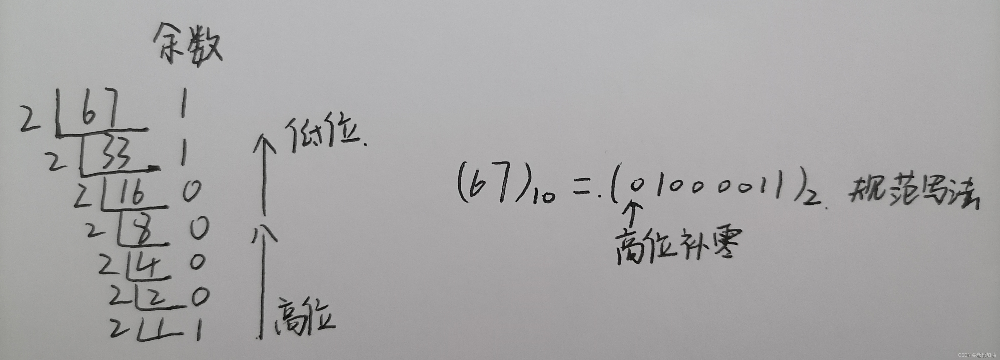

  二、负整数转换成二进制

先将对应的正整数转换成二进制后，然后对正整数的二进制取反，然后对结果再加1。

例如，以32为例，负整数32即-32。

那么十进制数值32转为二进制数值，步骤如下：

32除以2结果为16，余数为0。

16除以2结果为8，余数为0。

8除以2结果为4，余数为0。

4除以2结果为2，余数为0。

2除以2结果为1，余数为0。

1除以2结果为0，余数为1。

余数按相反的顺序排列，整数32的二进制数值结果为100000。

十进制32转换为二进制的结果为100000。

－32十进制转换为二进制，先取反，

那么10000取反后结果是011111，(0的反即是1)。

再加1，结果为100000。

那么十进制－32转为二进制的结果是100000。

> 1. 将32的二进制表示为32位的补码形式，即00000000000000000000000000100000。
> 2. 取反操作，即将所有0变为1，将所有1变为0，得到11111111111111111111111111011111。
> 3. 加1操作，将上一步得到的结果加1，得到11111111111111111111111111011111 + 1 = 11111111111111111111111111100000。
> 4. 得到最终的结果为-32的二进制表示：11111111111111111111111111100000。
> 5. 32和-32的二进制表示确实在计算机中是一样的，这是因为在补码表示中，最高位（符号位）用来表示正负号，0表示正数，1表示负数。所以32的补码表示是00000000000000000000000000100000，而-32的补码表示是11111111111111111111111111100000，它们在二进制中看起来是一样的，但根据最高位的符号位可以区分出正负数。

​             

三、小数转换为二进制的方法
       对小数点以后的数乘以2，然后取其结果的整数部分（不是1就是0），然后再用小数部分再乘以2，再取结果的整数部分……以此类推，直到小数部分为0或者位数已经够了就OK了。然后把取的整数部分按先后次序排列，就构成了二进制小数部分的序列，举个例子，比如0.125。

​        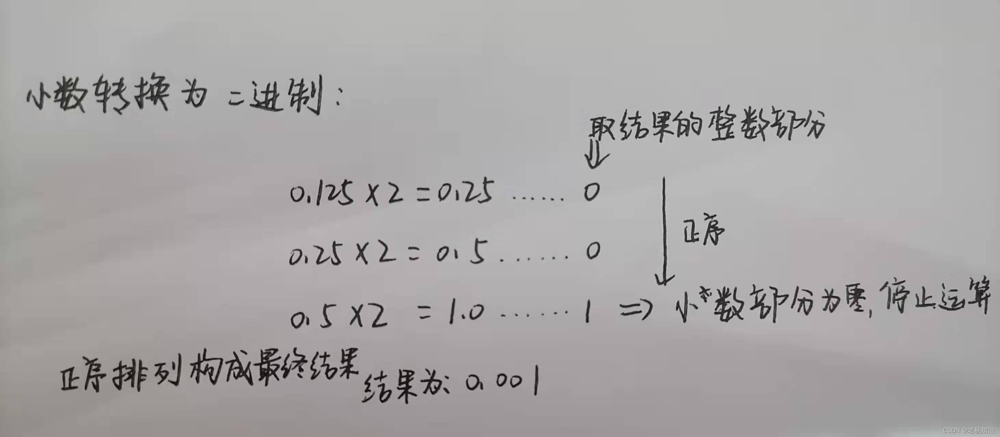    

如果小数的整数部分有大于0的整数时该如何转换呢？

方法：

      整数和小数部分各自转换成二进制，然后加在一起。如图所示。


二进制转换为十进制
方法一：

二进制转十进制的转换原理：从二进制的右边第一个数开始，每一个乘以2的n次方，n从0开始，每次递增1。然后得出来的每个数相加即是十进制数。

 例如：

     二进制的数110化为十进制：
    
          0*2^0+1*2^1+1^2^2=6

方法二：

先把2的次方依次排列出来，再将二进制数倒序依次排列，最后再把对应1的相加起来，0不加，如图：


即1+2+8=11,二进制数1011转化为十进制即为11 
————————————————

                            版权声明：本文为博主原创文章，遵循 CC 4.0 BY-SA 版权协议，转载请附上原文出处链接和本声明。

原文链接：https://blog.csdn.net/weixin_51472673/article/details/122482602

## 暴力枚举

设想一下，你觉得家门口的山非常碍事，下决心发扬“愚公移山”精神，凭借一镐一担打算把山一点一点的移走。虽然精神值得褒奖，而且理论上是可行的，只要给予足够多的时间迟早能做到。但是，实际上并不可能给你那么多时间，所以使用这种办法在有生之年是不可能将山移开的（也许你可以使用更好的办法，比如使用魔法或者设法让天神感动，让他帮你移山）。然而，如果你只是把一个不到半人高的小沙堆给移走，那使用这种方法很快就可以完成了。

算法的世界高深莫测，但是很多问题的解决方法简单而粗暴——就是枚举出所有可能的情况，然后判断或者统计，从而解决问题。在很多程序设计比赛中，有许多比较简单的题目是可以通过枚举暴力解决的；而有的更有具有挑战性的题目虽然有更巧妙的解法，但依然可以使用枚举暴力完成部分任务。

本章将介绍一些枚举与暴力策略，这是非常基础而且重要的，但是对初学者来说还是会有一些挑战。请务必理解本章之前的所有章节后再开始本章的学习。

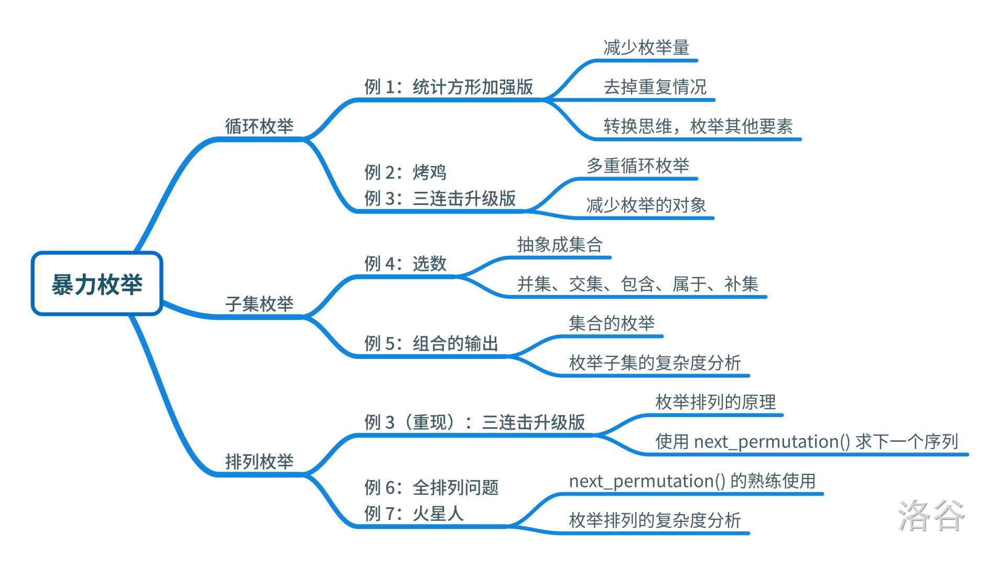

[【算法1-3】暴力枚举 - 题单 - 洛谷 | 计算机科学教育新生态 (luogu.com.cn)](https://www.luogu.com.cn/training/108#information)

## 模拟

说的具象一点（写完之后发现写抽象了），就是相当于你在想象题给的场景，只不过不只是用大脑想象了，更是用电脑去想象。

一般用一维二维数组实现，用于处理容易想但不容易算的东西，比如扫雷、迷宫等涉及图象的东西，开个二维数组，有雷有墙的地方标为1，能走的标为0，处理完之后，下面要得到某结果时用if把0避开。

## 前缀和&差分

前缀和，一种快速求和的方法（时间复杂度O(1)！），就是在数组输入的过程中就对数据进行迭代处理。

迭代公式是**①a[0]=0 a[1]=b[0]+a[0] ② a[i]=b[i-1]+a[i-1]**

那么a[i]就是前面所有元素之和，而a[i]-a[i-1]就是第i+1次输入即bi的值。

**实战一下**：没错还是洛谷题单……

[【算法2-1】前缀和、差分与离散化 - 题单 - 洛谷 | 计算机科学教育新生态 (luogu.com.cn)](https://www.luogu.com.cn/training/200)

在算法竞赛中，利用整体和部分的性质可以达成很多目的，例如利用前缀和可以在常数时间 复杂度中查询区间和，利用差分在常数时间复杂度对序列进行区间操作，或者利用离散化去除无 用数据区间，通过放缩保留有用的数据。这些操作使得我们不必每次都要重复处理个体的数据， 而是直接对整体进行处理，从而降低时间复杂度，提升运算效率。这一章将会学习前缀和、差分 和离散化的思想，并使用这些思想完成一些简单的任务。

该题单内容将继续改进。

对应进阶篇第 2 章。

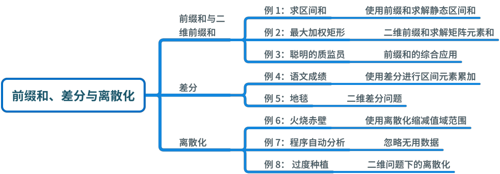


**前缀（prefix）和就是从位置1到位置i这个区间内的所有的数字之和。**

然后重新构成数组。

- int M =1e5+9，这是一个 C++ 中的常见语法，表示将变量 M 赋值为 100009。1e5 表示 10 的 5 次方，因此 M 的值为 100000 加上 9，即 100009。e 表示科学计数法中的指数符号，后面所跟的数字表示指数大小。

[寒假每日一题06 | 【蓝桥杯省赛】k倍区间 StarryCoding.49_哔哩哔哩_bilibili](https://www.bilibili.com/video/BV1oy421b7aA/?spm_id_from=333.337.search-card.all.click&vd_source=a0e678f0a699f40cb533e1a6673f35fa)

[6.k倍区间 - 蓝桥云课 (lanqiao.cn)](https://www.lanqiao.cn/problems/97/learning/?page=1&first_category_id=1&second_category_id=3)

通过前缀和取余数，遍历每遇到一个相同的数字之间相减为0，说明这两个数字之间的区间就是一个k区间

```c++
#include <iostream>
using namespace std;
using ll = long long;
const int N = 1e5 + 9;
ll a[N],prefix[N],ant[N];
int main()
{ 
  ll k,n;
  cin>>n;
  cin >> k;
  for(int i = 1;i <= n ; i++){
    cin>>a[i];
    prefix[i] = prefix[i-1] + a[i];
  }
  ant[0] = 1; //ant用于记录索引（index）中的数字在前缀和余数数组中出现的次数，因为余数为0代表前缀和本身就算是一个k区间，所以初始值为0
  ll ans = 0;
  for(int i = 1;i <= n; i++){
     ans += ant[prefix[i]%k];    //将前一次遇到数字的个数加入到结果当中，因为碰到两次数字的区间个数为（2-1 = 1）
      //记录遇到相同数字的个数
     ant[prefix[i]%k]++; 
  }
  cout<<ans;
  return 0;
}
```

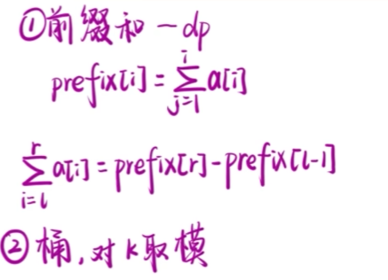

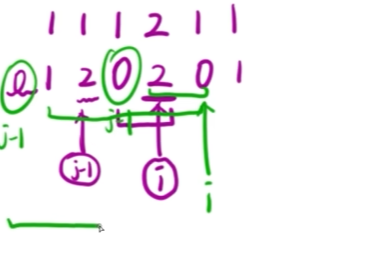

输入样例：

```
6 3
1 1 4 5 1 4
```


## 快速幂(fastpow)

能够将O(n)降低到O(log n)

[2023年计算机设计大赛微课作品国赛二等奖——《快速幂算法》视频_哔哩哔哩_bilibili](https://www.bilibili.com/video/BV1es4y197QH/?spm_id_from=333.788.recommend_more_video.-1&vd_source=a0e678f0a699f40cb533e1a6673f35fa)

模运算的乘法性质
$$
(a * b) \% p = ((a \% p) * (b \% p)) \% p
$$
这是模运算的一个基本性质，称为模运算的乘法性质。它表明，对于任意三个整数 a、b 和 p，它们的乘法对 p 取模的结果等于它们分别对 p 取模后的乘积再对 p 取模的结果。

这个性质的应用能够确保了每次乘法操作后结果在取模运算后不会溢出（缩小数字）。

应用前：

```python
for _ in range(n):
   result *= a
```

大O(n)

应用后:

```python
result=1
def power mod(a,n,p):
    in range(n):
        for result=(result*a)%p
        return result
```

范围缩小了，没有超出数据范围，但是速度还是太慢了

所以此时我们需要用上快速幂算法

假设我们要计算的是3^237 

237拆分成二进制为11101101

利用二进制转十进制的性质，我们可以得知：
$$
237 = 1*2^7 + 1*2^6 +  1*2^5 + 0*2^4 +  1*2^3 + 1*2^2 +  0*2^1 +  1*2^0
$$
再将二次幂展开：
$$
237 = 1*128 + 1*64 +  1*32 + 0*16 +  1*8 + 1*4 +  0*2 +  1*1
$$
然后我们计算3^237的结果展开:
$$
3^{237} = (3^{128})^1 *  (3^{64})^1 *  (3^{32})^1 *  (3^{16})^0 *  (3^{8})^1 *  (3^{4})^1 *  (3^{2})^0 *  (3^{1})^1
$$
然后通过观察，我们发现前者是后者的两倍，就比如：
$$
(3^{128}) =  (3^{64}) * (3^{64})
$$
也就是最终我们只需要进行十几次计算就能够计算出结果了，而不需要大O(n)次。

所以应用上快速幂之后，写法是：

```python
result=1
while(n>0):
     if n%2 == 1: #取模操作是为了得到幂中的二进制的最低位
        res = res * a
     a = a*a #每次将a翻倍
     n //=n #除2
```

| n(2)     | n&1  | a                    | result                                        |
| -------- | ---- | -------------------- | --------------------------------------------- |
| 11101101 | 1    | $3^1$                | $3^1$                                         |
| 1110110  | 0    | $3^2 = 3^{1^2}$      | $3^1$                                         |
| 111011   | 1    | $3^4 = 3^{2^2}$      | $3^1 * 3^4$                                   |
| 11101    | 1    | $3^8 = 3^{4^2}$      | $3^1 * 3^4 * 3^8$                             |
| 1110     | 0    | $3^16 = 3^{8^2}$     | $3^1 * 3^4 * 3^8$                             |
| 111      | 1    | $3^32 = 3^{16^2}$    | $3^1 * 3^4 * 3^8 * 3^{32}$                    |
| 11       | 1    | $3^64 = 3^{32^2}$    | $3^1 * 3^4 * 3^8 * 3^{32}* 3^{64}$            |
| 1        | 1    | $3^{128} = 3^{64^2}$ | $3^1 * 3^4 * 3^8 * 3^{32} * 3^{64} * 3^{128}$ |

然后加上模运算减少数字大小：

```python
def fast_pow_mode(a,n,p):
    result=1
    while(n>0):
        if n%2 == 1: 
           res = (res * a)%p
        a = (a*a)%p 
        n >>=1 #位运算跟除2一样的 
```

C++的写法：

```c++
#include <bits/stdc++.h>
using namespace std;

int main() {
    int  a,b,p,result=1;
    cin>>a>>b>>p;
    while(b>0){
		if(b%2 == 1){
			result = (result*a)%p;
		}
		a = (a*a)%p;
		b = b/2; 
	}
	result = result%p;
	cout<<result<<endl;
    return 0;
};
```

快速幂所使用的二进制数拆分思想运用场景有：

矩阵的幂运算：

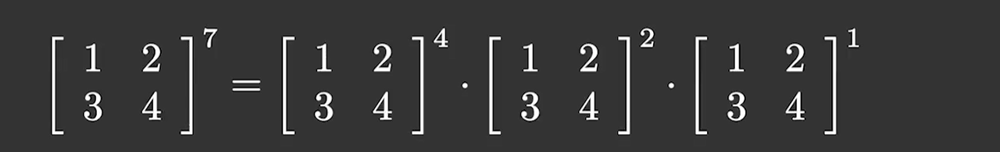

线段树，树状数组等

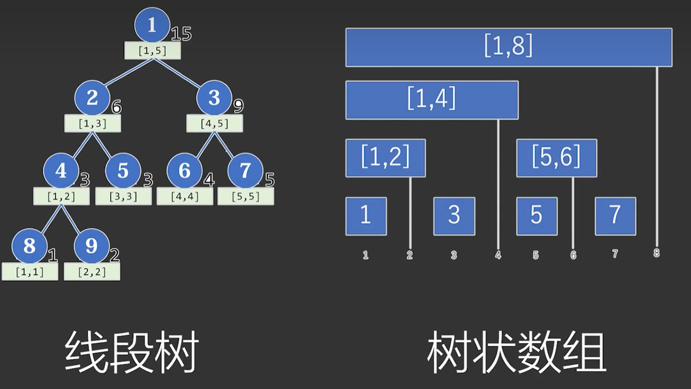

## 递归

好像一般都和分治有关吧，将一个大问题分解成许多小问题。 递归，说白了就是函数里面套函数，常用于解决知道相邻数据之间关系、知道初始值、算第n个值但是正推很难推的问题，最常见的就是斐波那契数列。

递归函数里一般都会有：

**① 终止条件(对初始值的判断)**

**② 数据处理(有时可以没有)**

**③ 返回值（相邻数据之间的关系，调用函数自身）**

递归函数传参时一般传每层递归都会用到且总在变的那些量，主函数调用递归函数时一般只调用一次，且传的参数为所求值的序号等与位置有关的数据。

**实战一下**： 还是洛谷题单

[【算法1-4】递推与递归 - 题单 - 洛谷www.luogu.com.cn/training/109](https://link.zhihu.com/?target=https%3A//www.luogu.com.cn/training/109)

在能用递归的题里，递归一般比迭代要更好思考，程序结构会更清楚，但是用的时间比迭代要长。

注意：**不是说递归简单，是说在大多数能递归的题里用递归思路更好想！**

别放弃！递归题确实难做，但是做多了就会发现——确实难做:p

## 贪心

就是每次操作都保证这是**阶段性最优解**，我这个阶段做这个选择，是在保证解决问题的趋势不会变差的前提下，我选它最好。

贪心的方法一般还是比较容易想到的，但是很大的一个缺点就是不能保证得到的解一定是**全局最优解**，万一我可以“曲线救国”呢？(-_-)

比如从一个地方到另一个地方，一条路线是先往前走100米，再拐弯向左走200米；另一条路线是先往左前走150米，再往右前走50米，那100<150的情况下局部最优就会带着我们往前走，但其实先往左才最短吧。（这个故事告诉我们不要只追逐眼前利益，这是贪心:p又哲学起来了……）

当然肯定并不是每个问题它都不是最优解，有些问题你确实贪心一点更简单而且结果是准确的。

关于贪心，一道经典入门题

[陶陶摘苹果（升级版） - 洛谷www.luogu.com.cn/problem/P1478](https://link.zhihu.com/?target=https%3A//www.luogu.com.cn/problem/P1478)

## **二分**

## 搜索

我们在之前的章节介绍了暴力枚举策略，将所有可能的情况都枚举一遍以获得最优解，但是枚举全部元素的效率如同愚翁移山，无法应付数据范围稍大的情形。本章在暴力枚举的基础上介绍了搜索算法，包括深度优先搜索和广度优先搜索，从起点开始，逐渐扩大寻找范围，直到找到需要的答案为止。

严格来说，搜索算法也算是一种暴力枚举策略，但是其算法特性决定了效率比直接的枚举所有答案要高，因为搜索可以跳过一些无效状态，降低问题规模。在算法竞赛中，如果选手无法找到一种高效求解的方法（比如贪心、递推、动态规划、公式推导等），使用搜索也可以解决一些规模较小的情况；而有的任务就是必须使用搜索来完成，因此这是相当重要的策略。

搜索主要是对图（包括树）通过不同的路线实现遍历，直到找到符合条件的路径或者元素。

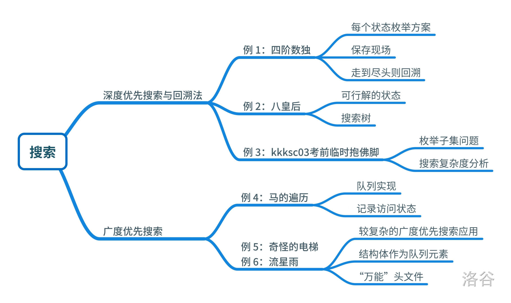

题单

[【算法1-7】搜索 - 题单 - 洛谷 | 计算机科学教育新生态 (luogu.com.cn)](https://www.luogu.com.cn/training/112)

### **DFS深搜**

说人话应该就是“一条路走到底”。就是从一个结点出发沿着一条路能走到哪走到哪，直到撞了南墙此路不通就折返，折返到最近的岔路口走另一条路再走到底……

[算法分析 | 一文理解搜索算法-彻底入门DFS - 知乎 (zhihu.com)](https://zhuanlan.zhihu.com/p/41307874)

[搜索思想——DFS & BFS（基础基础篇） - 知乎 (zhihu.com)](https://zhuanlan.zhihu.com/p/24986203)

dfs函数应该能主要分成两个部分：

**part 1 递归终止条件**

**part 2 循环{判断+标记+调用自身+去标记}**

其中：

**递归终止条件**一般为深度到达某个值时做出什么操作并return，**判断**是判断走到这里是不是符合题意，**标记**是标记现在这个点已经走过了，**调用自身**是继续往下一层走，**去标记**是在往回走之前去掉之前的标记（标记的逆操作），方便换一条路时还能走到这，这个操作我想了想应该是找路径的时候才要这样，找别的东西比如找一个元素应该就不能去标记，看题目要求吧。

以及做一道题练练手，“八皇后”问题，感觉这个问题这个名字挺熟的，是不是在数据结构学过？

[[USACO1.5\] 八皇后 Checker Challengewww.luogu.com.cn/problem/P1219](https://link.zhihu.com/?target=https%3A//www.luogu.com.cn/problem/P1219)

### BFS广搜


### 记忆化搜索

顾名思义就是带着脑子搜索，搜过一遍的点就记住它，这应该叫一种状态吧，下次再搜到这个点的时候就不用再搜一遍了。

典型的例子是斐波那契数列：

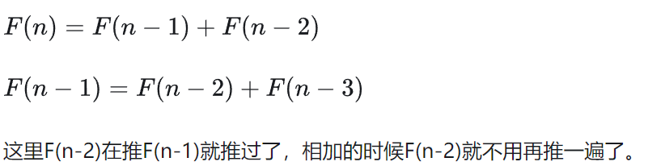

### 折半搜索

被去年买瓜题打过来学折半搜索，目的是降低时间复杂度。个人认为下面这个讲的很清楚了。

简单来说就是分为三步：前半一次dfs后存状态，后半一次dfs后存状态，最后用一种方法把两种状态合起来。

[【BZOJ4800】[CEOI2015 Day2\]世界冰球锦标赛 （折半搜索） - ZAGER - 博客园 (cnblogs.com)www.cnblogs.com/ZAGER/p/9827160.html](https://link.zhihu.com/?target=https%3A//www.cnblogs.com/ZAGER/p/9827160.html)

就拿这道题练手了，题目分析和代码在下面搜索题单里。

> 搜索题单

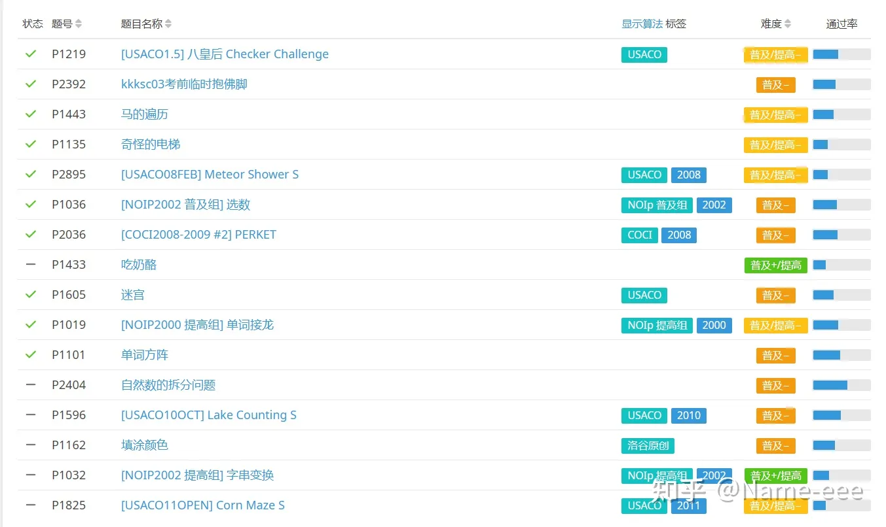

一些刷题经验：

\1. 测试程序运行过程时要把ios::sync...去掉

\2. 二维数组下标的横纵坐标对应问题一定要一开始就规定好

\3. 深搜是一个构建树的过程，可以在递归函数里写每一个分支的注释（如下面程序的注释）

\4. memset新用法，不止初始化0：memset(a,-1,sizeof(a))

\5. 矩阵n*m => n行, m列 => (x,y)->(m,n)

\6. BFS要在数据入队之前就检验数据有效性，不然入队占空间，严重就会MLE

## **哈希表**


## **二叉树**


## **二叉搜索树**


## **Manacher算法**


## 交并集

未完全理解

[算法学习笔记(1) : 并查集 - 知乎 (zhihu.com)](https://zhuanlan.zhihu.com/p/93647900)

[浅谈DLX - 洛谷专栏 (luogu.com.cn)](https://www.luogu.com.cn/article/2egmdio7)


[ACM金牌选手整理的【LeetCode刷题顺序】 - 知乎 (zhihu.com)](https://zhuanlan.zhihu.com/p/388470520)


## 动态规划


## **最短路算法**


## **最小生成树**


## **拓扑排序**
