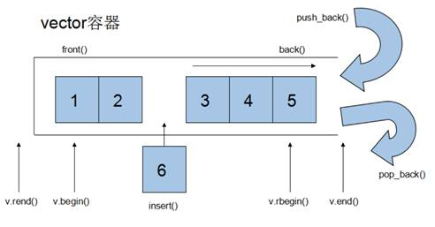

# c++STL知识整理

## string容器

**本质：**

* string是C++风格的字符串，**而string本质上是一个类**

**string和char * 区别：**

* char * 是一个指针
* string是一个类，类内部封装了char\*，管理这个字符串，是一个char*型的容器。

**特点：**

**string 类内部封装了很多成员方法**

**例如：查找find，拷贝copy，删除delete 替换replace，插入insert**

string管理char*所分配的内存，不用担心复制越界和取值越界等，由类内部进行负责

方法：

```c++
#include <iostream>
#include <string>

void testStringConstruction() {
    // 构造函数示例
    std::string s1; // 创建空字符串
    std::cout << "str1 = " << s1 << std::endl;

    const char* str = "hello world";
    std::string s2(str); // 将 c-style 字符串转换为 string
    std::cout << "str2 = " << s2 << std::endl;

    std::string s3(s2); // 使用拷贝构造函数
    std::cout << "str3 = " << s3 << std::endl;

    std::string s4(10, 'a'); // 输出：aaaaaaaaaa
    std::cout << "str4 = " << s4 << std::endl;

    // 赋值操作示例
    std::string str1;
    str1 = "hello world";
    std::cout << "str1 = " << str1 << std::endl;

    std::string str2;
    str2 = str1; // 赋值
    std::cout << "str2 = " << str2 << std::endl;

    std::string str3;
    str3 = 'a';
    std::cout << "str3 = " << str3 << std::endl;

    std::string str4;
    str4.assign("hello c++"); // 使用 assign 赋值
    std::cout << "str4 = " << str4 << std::endl;

    std::string str5;
    str5.assign("hello c++", 5); // 只取字符串的前五位
    std::cout << "str5 = " << str5 << std::endl;

    std::string str6;
    str6.assign(str5); // 将 str5 赋值给 str6
    std::cout << "str6 = " << str6 << std::endl;

    std::string str7;
    str7.assign(5, 'x');
    std::cout << "str7 = " << str7 << std::endl;
}

void testStringConcatenation() {
    std::string str1 = "我";

    str1 += "爱玩游戏"; // 进行字符串拼接
    std::cout << "str1 = " << str1 << std::endl;
    
    str1 += ':';
    std::cout << "str1 = " << str1 << std::endl;

    std::string str2 = "LOL DNF";
    str1 += str2; // 进行字符串拼接
    std::cout << "str1 = " << str1 << std::endl;

    std::string str3 = "I";
    str3.append(" love "); // 使用 append 追加字符串
    str3.append("game abcde", 4); // 只取字符串的前四个字符添加
    str3.append(str2, 4, 3); // 从下标4位置开始，截取3个字符，拼接到字符串末尾
    std::cout << "str3 = " << str3 << std::endl;
}

void testFindReplace() {
    // 查找示例
    std::string str1 = "abcdefgde";

    int pos = str1.find("de"); // 如果找到就返回int下标，从零开始算的，没有的话就返回-1
    if (pos == -1) {
        std::cout << "未找到" << std::endl;
    } else {
        std::cout << "pos = " << pos << std::endl;
    }

    pos = str1.rfind("de"); // rfind从右往左找 find从左往右找
    std::cout << "pos = " << pos << std::endl;

    // 替换示例
    std::string str2 = "abcdefgde";
    str2.replace(1, 3, "1111"); // 从一到三位的字符替换成1111
    std::cout << "str2 = " << str2 << std::endl;
}

int main() {
    testStringConstruction();
    testStringConcatenation();
    testFindReplace();

    system("pause");
    return 0;
}

```

##  向量vector容器

####  vector基本概念

**功能：**

* vector数据结构和**数组非常相似**，也称为**单端数组**

 vector<int> max_height(n);//n指定vector大小

max_height[i] = get<2>(boxes[i]);

**vector与普通数组区别：**

* 不同之处在于数组是静态空间，而vector可以**动态扩展**

**动态扩展：**

* 并不是在原空间之后续接新空间，而是找更大的内存空间，然后将原数据拷贝新空间，释放原空间




C++中的`std::vector`是一个动态数组容器，提供了许多方便的功能来操作数组。以下是一个包含所有常用用法的示例：

* `insert(const_iterator pos, ele);`        //迭代器指向位置pos插入元素ele
* `insert(const_iterator pos, int count,ele);`//迭代器指向位置pos插入count个元素ele
* `erase(const_iterator pos);`                     //删除迭代器指向的元素，deque会主动上位
* `erase(const_iterator start, const_iterator end);`//删除迭代器从start到end之间的元素
* `clear();`                                                        //删除容器中所有元素

```cpp
#include <iostream>
#include <vector>
#include <algorithm> // for sort, reverse, etc.

void display(const std::vector<int>& vec) {
    for (int val : vec) {
        std::cout << val << " ";
    }
    std::cout << std::endl;
}

int main() {
    // 1. 创建和初始化
    std::vector<int> vec1; // 创建一个空的vector
    std::vector<int> vec2(10); // 创建一个包含10个默认值(0)的vector
    std::vector<int> vec3(10, 5); // 创建一个包含10个值为5的vector
    std::vector<int> vec4 = {1, 2, 3, 4, 5}; // 使用初始化列表创建vector

    std::cout << "vec4: ";
    display(vec4);

    // 2. 访问元素
    std::cout << "First element: " << vec4[0] << std::endl; // 使用[]操作符
    std::cout << "First element: " << vec4.at(0) << std::endl; // 使用at()方法
    std::cout << "First element: " << vec4.front() << std::endl; // 使用front()方法
    std::cout << "Last element: " << vec4.back() << std::endl; // 使用back()方法

    // 3. 添加和删除元素
    vec4.push_back(6); // 在末尾添加元素
    vec4.insert(vec4.begin(), 0); // 在开头插入元素
    vec4.erase(vec4.begin() + 1); // 删除指定位置的元素
    vec4.pop_back(); // 删除末尾元素

    std::cout << "vec4 after modifications: ";
    display(vec4);

    // 4. 迭代器
    std::cout << "Using iterators: ";
    for (std::vector<int>::iterator it = vec4.begin(); it != vec4.end(); ++it) {
        std::cout << *it << " ";
    }
    std::cout << std::endl;

    // 5. 容量和大小
    std::cout << "Size: " << vec4.size() << std::endl;
    std::cout << "Capacity: " << vec4.capacity() << std::endl;
    std::cout << "Is empty: " << std::boolalpha << vec4.empty() << std::endl;

    vec4.resize(8); // 改变大小
    std::cout << "vec4 after resize: ";
    display(vec4);

    vec4.shrink_to_fit(); // 收缩容量以适应大小
    std::cout << "Capacity after shrink_to_fit: " << vec4.capacity() << std::endl;

    // 6. 其他常用操作
    std::sort(vec4.begin(), vec4.end()); // 排序
    std::cout << "Sorted vec4: ";
    display(vec4);

    std::reverse(vec4.begin(), vec4.end()); // 反转
    std::cout << "Reversed vec4: ";
    display(vec4);

    vec4.clear(); // 清空
    std::cout << "Size after clear: " << vec4.size() << std::endl;

    // 7. 2D vector
    std::vector<std::vector<int>> matrix(3, std::vector<int>(3, 1)); // 创建一个3x3的二维vector并初始化为1
    std::cout << "2D vector (matrix):" << std::endl;
    for (const auto& row : matrix) {
        display(row);
    }

    return 0;
}
```

### 详细解释：

1. **创建和初始化**
   - 默认构造：`std::vector<int> vec1;`
   - 指定大小：`std::vector<int> vec2(10);`
   - 指定大小和初始值：`std::vector<int> vec3(10, 5);`
   - 使用初始化列表：`std::vector<int> vec4 = {1, 2, 3, 4, 5};`
2. **访问元素**
   - 使用`operator[]`：`vec4[0]`
   - 使用`at()`方法：`vec4.at(0)`
   - 使用`front()`方法：`vec4.front()`
   - 使用`back()`方法：`vec4.back()`
3. **添加和删除元素**
   - 在末尾添加元素：`vec4.push_back(6);`
   - 在指定位置插入元素：`vec4.insert(vec4.begin(), 0);`
   - 删除指定位置的元素：`vec4.erase(vec4.begin() + 1);`
   - 删除末尾元素：`vec4.pop_back();`
4. **迭代器**
   - 使用迭代器遍历：`for (std::vector<int>::iterator it = vec4.begin(); it != vec4.end(); ++it) { ... }`
5. **容量和大小**
   - 获取大小：`vec4.size()`
   - 获取容量：`vec4.capacity()`
   - 检查是否为空：`vec4.empty()`
   - 改变大小：`vec4.resize(8);`
   - 收缩容量：`vec4.shrink_to_fit();`
6. **其他常用操作**
   - 排序：`std::sort(vec4.begin(), vec4.end());`
   - 反转：`std::reverse(vec4.begin(), vec4.end());`
   - 清空：`vec4.clear();`
7. **二维vector**
   - 创建并初始化一个3x3的二维vector：`std::vector<std::vector<int>> matrix(3, std::vector<int>(3, 1));`

## deque容器

#### deque容器基本概念


**功能：**

* 双端数组，可以对头端进行插入删除操作


**deque与vector区别：**

* vector对于头部的插入删除效率低，数据量越大，效率越低
* deque相对而言，对头部的插入删除速度回比vector快
* vector访问元素时的速度会比deque快,这和两者内部实现有关


deque内部工作原理:

deque内部有个**中控器**，维护每段缓冲区中的内容，缓冲区中存放真实数据

中控器维护的是每个缓冲区的地址，使得使用deque时像一片连续的内存空间


* deque容器的迭代器也是支持随机访问的。

以下是一个示例程序，展示了 `std::deque` 的常用操作：

```cpp
#include <iostream>
#include <deque>
#include <algorithm> // for sort, reverse, etc.

void display(const std::deque<int>& dq) {
    for (int val : dq) {
        std::cout << val << " ";
    }
    std::cout << std::endl;
}

int main() {
    // 1. 创建和初始化
    std::deque<int> dq1; // 创建一个空的deque
    std::deque<int> dq2(10); // 创建一个包含10个默认值(0)的deque
    std::deque<int> dq3(10, 5); // 创建一个包含10个值为5的deque
    std::deque<int> dq4 = {1, 2, 3, 4, 5}; // 使用初始化列表创建deque

    std::cout << "dq4: ";
    display(dq4);

    // 2. 访问元素
    std::cout << "First element: " << dq4[0] << std::endl; // 使用[]操作符
    std::cout << "First element: " << dq4.at(0) << std::endl; // 使用at()方法
    std::cout << "First element: " << dq4.front() << std::endl; // 使用front()方法
    std::cout << "Last element: " << dq4.back() << std::endl; // 使用back()方法

    // 3. 添加和删除元素
    dq4.push_back(6); // 在末尾添加元素
    dq4.push_front(0); // 在开头添加元素
    dq4.pop_back(); // 删除末尾元素
    dq4.pop_front(); // 删除开头元素

    std::cout << "dq4 after modifications: ";
    display(dq4);

    // 4. 迭代器
    std::cout << "Using iterators: ";
    for (std::deque<int>::iterator it = dq4.begin(); it != dq4.end(); ++it) {
        std::cout << *it << " ";
    }
    std::cout << std::endl;

    // 5. 容量和大小
    std::cout << "Size: " << dq4.size() << std::endl;
    std::cout << "Is empty: " << std::boolalpha << dq4.empty() << std::endl;

    dq4.resize(8); // 改变大小
    std::cout << "dq4 after resize: ";
    display(dq4);

    // 6. 其他常用操作
    std::sort(dq4.begin(), dq4.end()); // 排序
    std::cout << "Sorted dq4: ";
    display(dq4);

    std::reverse(dq4.begin(), dq4.end()); // 反转
    std::cout << "Reversed dq4: ";
    display(dq4);

    dq4.clear(); // 清空
    std::cout << "Size after clear: " << dq4.size() << std::endl;

    // 7. 插入和删除
    dq4 = {1, 2, 3, 4, 5}; // 重新赋值
    dq4.insert(dq4.begin() + 2, 10); // 在第2个位置插入10
    std::cout << "dq4 after insert: ";
    display(dq4);

    dq4.erase(dq4.begin() + 2); // 删除第2个位置的元素
    std::cout << "dq4 after erase: ";
    display(dq4);

    return 0;
}
```

### 详细解释：

1. **创建和初始化 `deque`**
   - 创建一个空的 `deque`：`std::deque<int> dq1;`
   - 创建一个包含 10 个默认值(0)的 `deque`：`std::deque<int> dq2(10);`
   - 创建一个包含 10 个值为 5 的 `deque`：`std::deque<int> dq3(10, 5);`
   - 使用初始化列表创建 `deque`：`std::deque<int> dq4 = {1, 2, 3, 4, 5};`

2. **访问元素**
   - 使用 `operator[]`：`dq4[0]`
   - 使用 `at()` 方法：`dq4.at(0)`
   - 使用 `front()` 方法：`dq4.front()`
   - 使用 `back()` 方法：`dq4.back()`

3. **添加和删除元素**
   - 在末尾添加元素：`dq4.push_back(6);`
   - 在开头添加元素：`dq4.push_front(0);`
   - 删除末尾元素：`dq4.pop_back();`
   - 删除开头元素：`dq4.pop_front();`

4. **迭代器**
   - 使用迭代器遍历 `deque`：
     ```cpp
     for (std::deque<int>::iterator it = dq4.begin(); it != dq4.end(); ++it) {
         std::cout << *it << " ";
     }
     ```

5. **容量和大小**
   - 获取大小：`dq4.size()`
   - 检查是否为空：`dq4.empty()`
   - 改变大小：`dq4.resize(8);`

6. **其他常用操作**
   - 排序：`std::sort(dq4.begin(), dq4.end());`
   - 反转：`std::reverse(dq4.begin(), dq4.end());`
   - 清空：`dq4.clear();`

7. **插入和删除**
   - 插入元素：`dq4.insert(dq4.begin() + 2, 10);`
   - 删除元素：`dq4.erase(dq4.begin() + 2);`

## stack容器

#### stack 基本概念


**概念：**stack是一种**先进后出**(First In Last Out,FILO)的数据结构，它只有一个出口


栈中只有顶端的元素才可以被外界使用，因此栈不允许有遍历行为

栈中进入数据称为  --- **入栈**  `push`

栈中弹出数据称为  --- **出栈**  `pop`


生活中的栈：


构造函数：

* `stack<T> stk;`                                 //stack采用模板类实现， stack对象的默认构造形式
* `stack(const stack &stk);`            //拷贝构造函数

赋值操作：

* `stack& operator=(const stack &stk);`           //重载等号操作符

数据存取：

* `push(elem);`      //向栈顶添加元素
* `pop();`                //从栈顶移除第一个元素
* `top(); `                //返回栈顶元素

大小操作：

* `empty();`            //判断堆栈是否为空
* `size(); `              //返回栈的大小

```c++
#include <iostream>
#include <stack>

int main() {
    // 1. 创建和初始化
    std::stack<int> stack1; // 创建一个空的stack

    // 2. 添加元素
    stack1.push(10); // 向栈中添加元素
    stack1.push(20);
    stack1.push(30);

    // 3. 访问和移除元素
    // 注意：栈不允许直接访问底层容器中的元素，只能访问栈顶元素

    // 获取栈顶元素
    std::cout << "Top element: " << stack1.top() << std::endl;

    // 移除栈顶元素
    stack1.pop();
    std::cout << "Top element after pop: " << stack1.top() << std::endl;

    // 4. 检查栈是否为空
    if (stack1.empty()) {
        std::cout << "The stack is empty." << std::endl;
    } else {
        std::cout << "The stack is not empty." << std::endl;
    }

    // 5. 获取栈的大小
    std::cout << "Size of the stack: " << stack1.size() << std::endl;

    // 6. 逐个弹出所有元素
    while (!stack1.empty()) {
        std::cout << "Popping element: " << stack1.top() << std::endl;
        stack1.pop();
    }

    // 检查栈是否为空
    std::cout << "Size of the stack after popping all elements: " << stack1.size() << std::endl;

    return 0;
}

```

## queue 容器

#### queue 基本概念


**概念：**Queue是一种**先进先出**(First In First Out,FIFO)的数据结构，它有两个出口


队列容器允许从一端新增元素，从另一端移除元素

队列中只有队头和队尾才可以被外界使用，因此队列不允许有遍历行为

队列中进数据称为 --- **入队**    `push`

队列中出数据称为 --- **出队**    `pop`


生活中的队列：


构造函数：

- `queue<T> que;`                                 //queue采用模板类实现，queue对象的默认构造形式
- `queue(const queue &que);`            //拷贝构造函数

赋值操作：

- `queue& operator=(const queue &que);`           //重载等号操作符

数据存取：

- `push(elem);`                             //往队尾添加元素
- `pop();`                                      //从队头移除第一个元素
- `back();`                                    //返回最后一个元素
- `front(); `                                  //返回第一个元素

大小操作：

- `empty();`            //判断堆栈是否为空

- `size(); `              //返回栈的大小

  

## set/ multiset 容器

**set和multiset区别**：

* set不允许容器中有重复的元素
* multiset允许容器中有重复的元素

**简介：**

* 所有元素都会在插入时自动被排序

**本质：**

* set/multiset属于**关联式容器**，底层结构是用**二叉树**实现。

### 功能描述

构造：

* `set<T> st;`                        //默认构造函数：
* `set(const set &st);`       //拷贝构造函数

赋值：

* `set& operator=(const set &st);`    //重载等号操作符

* `size();`          //返回容器中元素的数目
* `empty();`        //判断容器是否为空
* `swap(st);`      //交换两个集合容器

* `insert(elem);`           //在容器中插入元素。
* `clear();`                    //清除所有元素
* `erase(pos);`              //删除pos迭代器所指的元素，返回下一个元素的迭代器。
* `erase(beg, end);`    //删除区间[beg,end)的所有元素 ，返回下一个元素的迭代器。
* `erase(elem);`            //删除容器中值为elem的元素。

* `find(key);`                  //查找key是否存在,若存在，返回该键的元素的迭代器；若不存在，返回set.end();
* `count(key);`                //统计key的元素个数
* 利用仿函数，可以改变排序规则

```c++
#include <iostream>
#include <set>

// 自定义仿函数 Compare，用于改变 set 容器的排序规则
struct Compare {
    bool operator() (int a, int b) const {
        return a > b; // 自定义比较规则：从大到小排序
    }
};

int main()
{
    // 构造一个 set 容器
    // 使用自定义比较规则的 set 容器
    std::set<int, Compare> mySet;
   
    // 插入元素
    mySet.insert(30);
    mySet.insert(20);
    mySet.insert(10);
    mySet.insert(30); // 重复元素不会被插入

    // 输出 set 中的元素
    std::cout << "Set elements:";
    for (const int& elem : mySet) {
        std::cout << " " << elem;
    }
    std::cout << std::endl;

    // 获取容器中元素的数目
    std::cout << "Size of set: " << mySet.size() << std::endl;

    // 判断容器是否为空
    std::cout << "Is set empty? " << (mySet.empty() ? "Yes" : "No") << std::endl;

    // 查找元素
    auto it = mySet.find(20);
    if (it != mySet.end()) {
        std::cout << "Element 20 found in the set." << std::endl;
    }

    // 删除元素
    mySet.erase(10);

    // 再次输出 set 中的元素
    std::cout << "Set elements after erasing:";
    for (const int& elem : mySet) {
        std::cout << " " << elem;
    }
    std::cout << std::endl;

    // 清除所有元素
    mySet.clear();

    // 交换两个集合容器
    std::set<int> anotherSet = {100, 200, 300};
    std::cout << "Elements in anotherSet before swapping:";
    for (const int& elem : anotherSet) {
        std::cout << " " << elem;
    }
    std::cout << std::endl;

    mySet.swap(anotherSet);

    std::cout << "Elements in anotherSet after swapping:";
    for (const int& elem : anotherSet) {
        std::cout << " " << elem;
    }
    std::cout << std::endl;

    return 0;
}
```

## pair对组创建

`pair` 对组是 C++ 标准库中定义的一种容器，用于存储两个数据元素作为一个单元，提供了一种方便的方式以一对值的形式进行组合和访问。

在 C++ 中，`pair` 对组通常用于在需要同时处理两个相关数据的情况下，将它们打包在一起。每个 `pair` 对组包含两个公共成员变量，通过 `first` 和 `second` 成员可以分别访问其中的第一个和第二个元素。

通过使用 `pair` 对组，可以更加方便地对两个相关的值进行操作，传递，返回或存储。通常在需要返回多个值，或在一些算法中需要将两个元素关联起来时，可以使用 `pair` 对组来简化代码的书写。

```c++
#include <iostream>
#include <utility> // 包含 pair 对组所需的头文件

int main()
{
    // 创建一个 pair 对组
    std::pair<int, std::string> myPair;

    // 初始化 pair 对组的值
    myPair.first = 10;
    myPair.second = "Hello";

    // 输出 pair 对组的值
    std::cout << "Pair values: " << myPair.first << ", " << myPair.second << std::endl;

    // 使用 make_pair 快速创建 pair 对组
    auto anotherPair = std::make_pair(20, "World");

    // 输出另一个 pair 对组的值
    std::cout << "Another pair values: " << anotherPair.first << ", " << anotherPair.second << std::endl;

    return 0;
}
```

## map/ multimap容器

#### map基本概念

**简介：**

* map中所有元素都是pair
* pair中第一个元素为key（键值），起到索引作用，第二个元素为value（实值）
* 所有元素都会根据元素的键值自动排序

**本质：**

* map/multimap属于**关联式容器**，底层结构是用二叉树实现。

**优点：**

* 可以根据key值快速找到value

map和multimap**区别**：

- map不允许容器中有重复key值元素
- multimap允许容器中有重复key值元素

map是STL（中文标准模板库）的一个关联容器。

1. 可以将任何基本类型映射到任何基本类型。如int array[100]事实上就是定义了一个int型到int型的映射。
2. map提供一对一的数据处理，key-value键值对，其类型可以自己定义，第一个称为关键字，第二个为关键字的值
3. map内部是自动排序的


1. 必须引入包

```cpp
#include<map>
```

2.map的定义

map<type1name,type2name> maps;//第一个是键的类型，第二个是值的类型

```cpp
map<string,int> maps;
```

**3.map容器内元素的访问**

- **通过下标进行访问**

如：maps['c']=5;

- **通过迭代器进行访问**

map可以使用it->first来访问键，使用it->second访问值

```cpp
#include<map>
#include<iostream>
using namespace std;
int main()
{
   map<char,int>maps;
   maps['d']=10;
   maps['e']=20;
   maps['a']=30;
   maps['b']=40;
   maps['c']=50;
   maps['r']=60;
   for(map<char,int>::iterator it=mp.begin();it!=mp.end();it++)
   {
       cout<<it->first<<" "<<it->second<<endl;
   }
   return 0;
}
```

4.**map的常用用法**

- maps.insert() 插入

```cpp
// 定义一个map对象
map<int, string> m;
 
//用insert函数插入pair
m.insert(pair<int, string>(111, "kk"));
 
// 用insert函数插入value_type数据
m.insert(map<int, string>::value_type(222, "pp"));
 
// 用数组方式插入
m[123] = "dd";
m[456] = "ff";
```

- maps.find() 查找一个元素

find(key): 返回键是key的映射的迭代器

```cpp
map<string,int>::iterator it;
it=maps.find("123");
```

- maps.clear()清空


- maps.erase()删除一个元素

```cpp
//迭代器刪除
it = maps.find("123");
maps.erase(it);

//关键字删除
int n = maps.erase("123"); //如果刪除了返回1，否则返回0

//用迭代器范围刪除 : 把整个map清空
maps.erase(maps.begin(), maps.end());
//等同于mapStudent.clear()
```

- maps.szie()长度

```cpp
int len=maps.size();获取到map中映射的次数
```

- maps.begin()返回指向map头部的迭代器
- maps.end()返回指向map末尾的迭代器

```cpp
//迭代
map< string,int>::iterator it;
for(it = maps.begin(); it != maps.end(); it++)
    cout<<it->first<<" "<<itr->second<<endl;//输出key 和value值
```

- maps.rbegin()返回指向map尾部的逆向迭代器
- maps.rend()返回指向map头部的逆向迭代器

```cpp
//反向迭代
map<string,int>::reverse_iterator it;
for(it = maps.rbegin(); it != maps.rend(); it++)
    cout<<it->first<<' '<<it->second<<endl;
```

- maps.empty()判断其是否为空
- maps.swap()交换两个map

## 元组tuple（包含头文件tuple）

在 C++ 中，元组是一种可以存储多个不同类型的值的数据结构。它是由多个值按顺序排列在一起的序列，每个值叫做元素，可以使用访问器函数来访问。

在这个例子中，定义的 `box` 类型是一个包含三个整型变量的元组。例如，可以用如下代码创建一个 `box` 变量：

```c++
typedef tuple<int, int, int> box; 
box myBox(1, 2, 3);
```

然后可以使用访问器函数来访问元组中的每个元素：

```c++
int first = get<0>(myBox);  // first 的值为 1
int second = get<1>(myBox); // second 的值为 2
int third = get<2>(myBox);  // third 的值为 3
```

也可以使用解构（decomposition）来同时访问所有元素：

```c++
int a, b, c;
tie(a, b, c) = myBox;
```

这样，`a` 变量的值就等于元组的第一个元素，`b` 变量的值就等于元组的第二个元素，以此类推。


c++使用向量的元组按照元组的第一个元素的大小进行从大到小排列的代码

```c++
#include <algorithm>
#include <tuple>
#include <vector>
#include <iostream>

int main() {
  // 定义一个向量存储元组
  std::vector<std::tuple<int, std::string>> tuples = {
    {3, "c"},
    {1, "a"},
    {2, "b"},
    {4, "d"}
  };

  // 使用 std::sort 函数对元组进行排序
  std::sort(tuples.begin(), tuples.end(), [](const auto& a, const auto& b) {
    return std::get<0>(a) > std::get<0>(b);  // 使用 std::get 函数获取元组的第一个元素
  });

  // 输出排序后的元组
  for (const auto& t : tuples) {
    std::cout << std::get<0>(t) << " " << std::get<1>(t) << std::endl;
  }

  return 0;
}
```

std::tie`是 C++ 标准库中的一个函数，它允许您将多个变量绑定到元组，以便您可以使用元组比较运算符 （如） 来比较变量的值。`<

在表达式中，创建一个由元组的前两个元素组成的元组，并创建一个由元组的前两个元素组成的元组。然后使用运算符比较这两个元组，并返回此比较的结果。

## STL- 函数对象

#### 函数对象概念

**概念：**

* 重载**函数调用操作符**的类，其对象常称为**函数对象**
* **函数对象**使用重载的()时，行为类似函数调用，也叫**仿函数**

**本质：**

函数对象(仿函数)是一个**类**，不是一个函数

####  函数对象使用

**特点：**

* 函数对象在使用时，可以像普通函数那样调用, 可以有参数，可以有返回值
* 函数对象超出普通函数的概念，函数对象可以有自己的状态
* 函数对象可以作为参数传递


```c++
#include <iostream>
#include <string>

// 函数对象示例1：函数对象可以像普通函数一样调用，有参数和返回值
class MyAdd {
public :
	int operator()(int v1, int v2) {
		return v1 + v2;
	}
};

void test01() {
	MyAdd myAdd;
	std::cout << myAdd(10, 10) << std::endl;
}

// 函数对象示例2：函数对象可以有自己的状态
class MyPrint {
public:
	MyPrint() {
		count = 0;
	}
	
	void operator()(std::string test) {
		std::cout << test << std::endl;
		count++; // 统计使用次数
	}

	int count; // 内部自己的状态
};

void test02() {
	MyPrint myPrint;
	myPrint("hello world");
	myPrint("hello world");
	myPrint("hello world");
	std::cout << "myPrint调用次数为： " << myPrint.count << std::endl;
}

// 函数对象示例3：函数对象可以作为参数传递
void doPrint(MyPrint &mp, std::string test) {
	mp(test);
}

void test03() {
	MyPrint myPrint;
	doPrint(myPrint, "Hello C++");
}

int main() {
	//test01();
	//test02();
	test03();

	return 0;
}
```

## 谓词

**概念：**

* 返回bool类型的仿函数称为**谓词**
* 如果operator()接受一个参数，那么叫做一元谓词
* 如果operator()接受两个参数，那么叫做二元谓词

**示例：**

```C++
#include <iostream>
#include <vector>
#include <algorithm>

// 一元谓词示例
struct GreaterFive {
    bool operator()(int val) {
        return val > 5;
    }
};

// 二元谓词示例
class MyCompare {
public:
    bool operator()(int num1, int num2) {
        return num1 > num2;
    }
};

int main() {
    // 一元谓词示例
    std::vector<int> v1;
    for (int i = 0; i < 10; i++) {
        v1.push_back(i);
    }

    std::vector<int>::iterator it1 = find_if(v1.begin(), v1.end(), GreaterFive());
    if (it1 == v1.end()) {
        std::cout << "没找到!" << std::endl;
    } else {
        std::cout << "找到: " << *it1 << std::endl;
    }

    // 二元谓词示例
    std::vector<int> v2 = {10, 40, 20, 30, 50};

    // 默认从小到大排序
    sort(v2.begin(), v2.end());
    for (int num : v2) {
        std::cout << num << " ";
    }
    std::cout << std::endl;
    std::cout << "----------------------------" << std::endl;

    // 使用函数对象改变算法策略，排序从大到小
    sort(v2.begin(), v2.end(), MyCompare());
    for (int num : v2) {
        std::cout << num << " ";
    }
    std::cout << std::endl;

    return 0;
}
```


## for_search

下面是一个简单的示例，演示了如何使用`for_each`函数打印vector中的每个元素：

```c++
cpp复制代码#include <iostream>
#include <vector>
#include <algorithm>

void print(int i) {
    std::cout << i << " ";
}

int main() {
    std::vector<int> vec = {1, 2, 3, 4, 5};

    // 使用for_each打印每个元素
    std::for_each(vec.begin(), vec.end(), print);

    return 0;
}
```

在这个示例中，`print`函数被传递给`for_each`函数，它会对`vec`中的每个元素执行打印操作。

`for_each`函数在每次迭代时都会将当前元素作为参数传递给指定的函数对象，因此你可以在函数对象中执行任何你想要的操作

