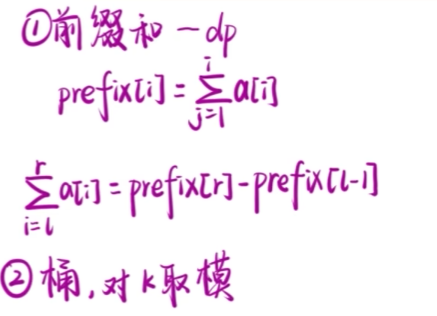
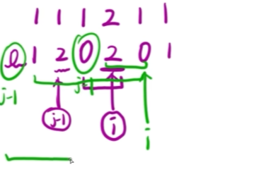

## 前缀和

**前缀（prefix）和就是从位置1到位置i这个区间内的所有的数字之和。**

然后重新构成数组。

- int M =1e5+9，这是一个 C++ 中的常见语法，表示将变量 M 赋值为 100009。1e5 表示 10 的 5 次方，因此 M 的值为 100000 加上 9，即 100009。e 表示科学计数法中的指数符号，后面所跟的数字表示指数大小。

[寒假每日一题06 | 【蓝桥杯省赛】k倍区间 StarryCoding.49_哔哩哔哩_bilibili](https://www.bilibili.com/video/BV1oy421b7aA/?spm_id_from=333.337.search-card.all.click&vd_source=a0e678f0a699f40cb533e1a6673f35fa)

[6.k倍区间 - 蓝桥云课 (lanqiao.cn)](https://www.lanqiao.cn/problems/97/learning/?page=1&first_category_id=1&second_category_id=3)

通过前缀和取余数，遍历每遇到一个相同的数字之间相减为0，说明这两个数字之间的区间就是一个k区间

```c++
#include <iostream>
using namespace std;
using ll = long long;
const int N = 1e5 + 9;
ll a[N],prefix[N],ant[N];
int main()
{ 
  ll k,n;
  cin>>n;
  cin >> k;
  for(int i = 1;i <= n ; i++){
    cin>>a[i];
    prefix[i] = prefix[i-1] + a[i];
  }
  ant[0] = 1; //ant用于记录索引（index）中的数字在前缀和余数数组中出现的次数，因为余数为0代表前缀和本身就算是一个k区间，所以初始值为0
  ll ans = 0;
  for(int i = 1;i <= n; i++){
     ans += ant[prefix[i]%k];    //将前一次遇到数字的个数加入到结果当中，因为碰到两次数字的区间个数为（2-1 = 1）
      //记录遇到相同数字的个数
     ant[prefix[i]%k]++; 
  }
  cout<<ans;
  return 0;
}
```





输入样例：

```
6 3
1 1 4 5 1 4
```

