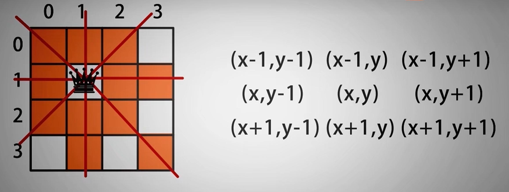
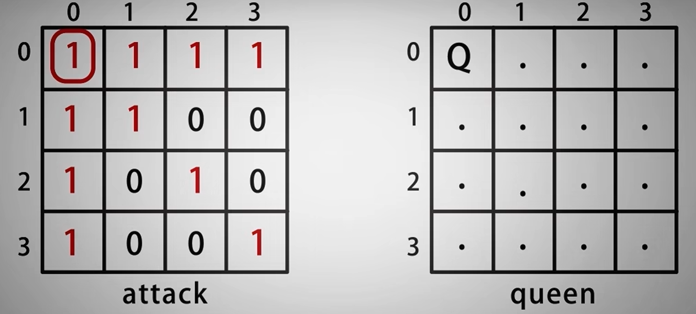

# 最简单最详细的n皇后问题讲解(回溯法)

## 思路

[51. N 皇后 - 力扣（LeetCode）](https://leetcode.cn/problems/n-queens/)

这是最经典的回溯法问题，但是通过我本人的理解，我感觉就像是一个复杂一点的枚举法。

贴上问题描述，更好得去讲解一下：

> **n 皇后问题** 研究的是如何将 `n` 个皇后放置在 `n×n` 的棋盘上，并且使皇后彼此之间不能相互攻击（每一行都要有一个皇后）。
>
> 给你一个整数 `n` ，返回所有不同的 **n 皇后问题** 的解决方案。
>
> 每一种解法包含一个不同的 **n 皇后问题** 的棋子放置方案，该方案中 `'Q'` 和 `'.'` 分别代表了皇后和空位。

问题描述按照我的理解就是皇后的左，左上，中上，右上，右，右下，中下，左下的八个方向的延申都不能有另外的皇后，那这样的话可以看成一个扩散问题，一个皇后落地，就有多少的位置不能放，然后枚举还有哪些位置能放皇后的，一次次得去循环枚举。



回溯一般是指这一步骤试错了，就回到上一个步骤的状态，再尝试，不行的话，再回到上一次尝试，无线循环。

那这样的话，能不能把这个步骤理解为不断地去枚举呢:

枚举一个一个的步骤，一个步骤不通，就舍弃一个步骤，取有效的步骤的结果。

**所以最终思路就可以理解为**: 我从第一行的第一个位置开始遍历起，枚举第一行所有皇后的放置情况，然后通过递归再遍历第二行一直到最后一行的皇后放置情况，如果直到最后一行都能放置，就说明这个方法是有效的，就保存起来



## 具体代码实现思路

### 1.初始化数据

首先我们需要定义基本的数据结构，主函数：

n是皇后的数量

k用来递归每一行，每次递归k+1代表遍历的行，数组[x行] [y列]

attack用来存储被皇后覆盖到的区域，被覆盖到为1，没有覆盖到的区域为0

vector<string> queens 存储皇后的位置每一个string元素代表一行，vector代表每一列

vector<vector<string>> solve; 用来存储皇后的位置结果

backtarck(attack, queens, solve, k, n); 最后我们将参数传到回溯函数里面去

```c++
    vector<vector<string>> solveNQueens(int n) {
        int k = 0;
        vector<vector<int>> attack(n, vector<int>(n, 0)); // 分配内存并初始化为零
        vector<string> queens(n, string(n,'.')); // 分配内存并每个元素初始化为（n）个点号
        vector<vector<string>> solve; //存储结果
        backtarck(attack, queens, solve, k, n); //递归函数
        return solve;
    }
```

### 2.完成主体部分的设计

定义完基本的数据之后，我们直接开始递归函数的设计，递归函数的最主要目的是直接能得到返回的结果，中间可能会涉及到需要再单独处理的函数，但我们写算法的时候，可以先不去实现具体的功能，我们先把 主体的部分写清楚之后再去完善细节部分：

思路为：
1.首先我们考虑到的情况是从第一行开始遍历到最后，只要能递归到最后的，都是正确的方法，所以一开始，我们先将当k==n的情况，记录答案，**注意：**一定要写return不然此时k此时已经在了n+1行（从1算起的说法）会爆栈，所以一定要返回结束。

```c++
    if (k == n) {
        solve.push_back(queens);
        return;  
    }
```

2.然后我们每一个递归函数的意义是枚举每一行，所以我们只需要遍历写一层循环就足以。

```c++
 for (int i = 0; i < n; i++) 
```

3.因为是递归，每一次我们要判断位置是否没有被占领为操作条件，因为位置被占据则无法放置皇后。

```c++
for (int i = 0; i < n; i++) {
        if (attack[k][i] == 0) {
            //进行放置皇后和递归操作
        }
    }
```

4.因为我们一次递归枚举一行，所以当我们每完成一次数据传递的时候，我们要将数据恢复到原来的状态，进行下一次枚举,所以如果需要被记录的状态就要被提前保存，最后都被重置。

```c++
    for (int i = 0; i < n; i++) {
        if (attack[k][i] == 0) {
            // 备份attack的操作改为传递引用
            vector<vector<int>> temp = attack;
            // 放置皇后
            queens[k][i] = 'Q';
            // 标记覆盖
            takeOver(k, i, attack, n);
            // 传到下一层
            backtarck(attack, queens, solve, k + 1, n);  //因为c++是这些都是同步操作，而且我们每一次都重置了每一行的更改，所以不会影响接下来的数据
            // 恢复状态
            attack = temp;
            //恢复皇后
		   queens[k][i] = '.';
        }
    }
}
```

5.在传递到下一次递归函数之前，先把此次枚举的情况标记再传到下一行枚举：

放置皇后:

```
queens [k] [i] = 'Q';
```

标记皇后放置时候覆盖的位置： takeOver(k, i, attack, n); //k为行，i为列记录的是皇后的放置位置，然后在attacks上做标记。

总代码：

```c++
void backtarck(vector<vector<int>> &attack, vector<string> &queens, vector<vector<string>> &solve, int k, int n) {
    if (k == n) {
        solve.push_back(queens);
        return;  
    }
    for (int i = 0; i < n; i++) {
        if (attack[k][i] == 0) {
            // 备份attack的操作改为传递引用
            vector<vector<int>> temp = attack;
            // 放置皇后
            queens[k][i] = 'Q';
            // 标记覆盖
            takeOver(k, i, attack, n);
            // 传到下一层
            backtarck(attack, queens, solve, k + 1, n);
            // 恢复现场
            attack = temp;
            //恢复皇后
		   queens[k][i] = '.';
        }
    }
}
```

### 3.完成组件功能的设计

在完成主体的设计之后，我们来完成标记覆盖的函数编写，如刚才解题思路所说，要将皇后八个方向上的位置都延申覆盖，所以我们可以定义dx[],dy[]来记录attack相对于皇后位置的偏移标记为占领。

```c++
        //左，左上，中上，右上，右，右下，中下，左下
        int dx[] = {-1, -1, 0, 1, 1, 1, 0, -1};
        int dy[] = {0, 1, 1, 1, 0, -1, -1, -1};
        //标记皇后位置
        attack[x][y] = 1;
```

因为是在棋盘上无限延申所以循环 for (int i = 0; i < n; i++)：

解释一下下面这个步骤，为什么这样设计会能够无限延申遍历八个方向，i可以理解为相对偏移次数，就比如：

假如我选择的方向是往皇后的右上角走，当i=1的时候，我向皇后的右上角走一格，然后在那格子做标记；当i=2的时候，我向皇后的右上角走一格之后再在此的基础上又往右上角走了一格。

```c++
            int xOver = x + i * dx[j];
            int yOver = y + i * dy[j];
```

最后通过判断边界来确定不越界的情况下（x，y分别不小于0，不超过最大的边界值），对占据的位置做标记：

```c++
        if (xOver < n && yOver < n && xOver >= 0 && yOver >= 0) {
                attack[xOver][yOver] = 1;
            }
```

总代码：

```c++
    //标记覆盖
    void takeOver(int x, int y, vector<vector<int>> &attack, int n) {  
        //左，左上，中上，右上，右，右下，中下，左下
        int dx[] = {-1, -1, 0, 1, 1, 1, 0, -1};
        int dy[] = {0, 1, 1, 1, 0, -1, -1, -1};
        //标记皇后位置
        attack[x][y] = 1;
        for (int i = 0; i < n; i++) {
            //八个方向
            for (int j = 0; j < 8; j++) {
                int xOver = x + i * dx[j];
                int yOver = y + i * dy[j];
                //判断边界
                if (xOver < n && yOver < n && xOver >= 0 && yOver >= 0) {
                    attack[xOver][yOver] = 1;
                }
            }
        }
    }
```

### 4.完整代码

```c++
#include<bits/stdc++.h>
using namespace std;
class Solution {
public:
    //标记覆盖
    void takeOver(int x, int y, vector<vector<int>> &attack, int n) {  
        //左，左上，中上，右上，右，右下，中下，左下
        int dx[] = {-1, -1, 0, 1, 1, 1, 0, -1};
        int dy[] = {0, 1, 1, 1, 0, -1, -1, -1};
        //标记皇后位置
        attack[x][y] = 1;
        for (int i = 0; i < n; i++) {
            //八个方向
            for (int j = 0; j < 8; j++) {
                int xOver = x + i * dx[j];
                int yOver = y + i * dy[j];
                //判断边界
                if (xOver < n && yOver < n && xOver >= 0 && yOver >= 0) {
                    attack[xOver][yOver] = 1;
                }
            }
        }
    }
void backtarck(vector<vector<int>> &attack, vector<string> &queens, vector<vector<string>> &solve, int k, int n) {
    if (k == n) {
        solve.push_back(queens);
        return;
    }
    for (int i = 0; i < n; i++) {
        if (attack[k][i] == 0) {
            // 备份attack的操作改为传递引用
            vector<vector<int>> temp = attack;
            // 放置皇后
            queens[k][i] = 'Q';
            // 标记覆盖
            takeOver(k, i, attack, n);
            // 传到下一层
            backtarck(attack, queens, solve, k + 1, n);
            // 恢复现场
            attack = temp;
            //恢复皇后
		   queens[k][i] = '.';
        }
    }
}
    vector<vector<string>> solveNQueens(int n) {
        int k = 0;
        vector<vector<string>> solve;
        vector<vector<int>> attack(n, vector<int>(n, 0)); // 分配内存并初始化为零
        vector<string> queens(n, string(n,'.')); // 分配内存并初始化为点号
        backtarck(attack, queens, solve, k, n);
        return solve;
    }
};
int main() {
    Solution solution;
    int n = 8; // 测试N皇后问题的规模
    vector<vector<string>> result = solution.solveNQueens(n);

    cout << "Solutions for " << n << " queens problem:" << endl;
    cout << "多少种解 " << result.size()<< " queens problem:" << endl;
    for (const auto& solution : result) {
        for (const string& row : solution) {
        cout << row << std::endl;
        }
        cout << std::endl;
    }

    return 0;
}
```

参考：

[算法与数据结构，回溯法求解八皇后，最经典的递归问题_哔哩哔哩_bilibili](https://www.bilibili.com/video/BV1ZK411K7A8/?spm_id_from=333.999.0.0&vd_source=a0e678f0a699f40cb533e1a6673f35fa)