# go语言学习

**Go**（又称 **Golang**）是 [Google](https://baike.baidu.com/item/Google/86964?fromModule=lemma_inlink) 的 Robert Griesemer，Rob Pike 及 Ken Thompson 开发的一种[静态](https://baike.baidu.com/item/静态?fromModule=lemma_inlink)[强类型](https://baike.baidu.com/item/强类型?fromModule=lemma_inlink)、[编译型语言](https://baike.baidu.com/item/编译型语言/9564109?fromModule=lemma_inlink)。Go 语言语法与 [C](https://baike.baidu.com/item/C/7252092?fromModule=lemma_inlink) 相近，但功能上有：内存安全，[GC](https://baike.baidu.com/item/GC/66426?fromModule=lemma_inlink)（垃圾回收），[结构形态](https://baike.baidu.com/item/结构形态/5942010?fromModule=lemma_inlink)及 CSP-style [并发计算](https://baike.baidu.com/item/并发计算/9939802?fromModule=lemma_inlink)。

Go语言的主要特征有：

- **简洁、快速、安全**：Go语言的语法简洁，编译速度快，支持垃圾回收和内存安全，避免了一些常见的内存错误。
- **并行、有趣、开源**：Go语言支持并发编程，可以利用多核CPU的优势，提高程序的性能和响应速度。Go语言也有很多有趣的特性，比如匿名函数、闭包、反射等。Go语言是完全开源的，有一个活跃的社区和丰富的资源。
- **内置类型和函数**：Go语言有更丰富的内置类型，比如切片、映射、接口等，可以方便地处理各种数据结构。Go语言也有很多内置的函数，比如append、copy、len、make等，可以简化一些常用的操作。
- **函数多返回值**：Go语言的函数可以返回多个值，这在一些场景下非常有用，比如返回结果和错误信息。
- **错误处理**：Go语言没有异常机制，而是使用错误值来表示错误情况。这样可以避免一些异常处理的复杂性和开销，让程序更加清晰和稳定。
- **类型和接口**：Go语言是一门静态类型的语言，但是它也支持一些动态类型的特性，比如接口。接口是一种抽象类型，它定义了一组方法，但是不指定具体的实现。任何类型只要实现了接口中的方法，就可以被视为该接口类型。这样可以实现多态和解耦的效果。
- **并发编程**：Go语言提供了一种轻量级的并发机制，称为goroutine。goroutine是一种类似于线程的实体，但是它更加简单和高效。Go语言还提供了一种通信机制，称为channel。channel是一种管道，可以在不同的goroutine之间传递数据。通过goroutine和channel，可以实现复杂的并发逻辑。


1.高性能，高并发

2.语法简单，学习曲线平缓

3.丰富的标准库

4.完善的工具链

5.静态链接

6.快速编译

7.跨平台

8.垃圾回收

以下是我学习go语言基础语法时写的一些代码示例：

```go
go复制代码// hello.go 文件
package main // 声明包名

import "fmt" // 导入fmt包

func main() { // 定义main函数
	fmt.Println("Hello, World!") // 调用fmt包中的Println函数
}

// 运算符.go 文件
package main

import "fmt"

func main() {
	var a int = 10 // 声明变量a并赋值为10
	var b int = 3  // 声明变量b并赋值为3
	fmt.Println(a + b)  // 加法运算
	fmt.Println(a - b)  // 减法运算
	fmt.Println(a * b)  // 乘法运算
	fmt.Println(a / b)  // 整除运算
	fmt.Println(a % b)  // 取模运算
	fmt.Println(a << b) // 左移运算
	fmt.Println(a >> b) // 右移运算
	fmt.Println(a & b)  // 按位与运算
	fmt.Println(a | b)  // 按位或运算
	fmt.Println(a ^ b)  // 按位异或运算
	fmt.Println(a &^ b) // 按位清零运算
	fmt.Println(!true)  // 逻辑非运算
	fmt.Println(true && false) // 逻辑与运算
	fmt.Println(true || false) // 逻辑或运算
}

// 切片.go 文件
package main

import "fmt"

func main() {
	var arr [5]int = [5]int{1, 2, 3, 4, 5} // 声明并初始化一个数组
	var s1 []int = arr[1:3]               // 声明并初始化一个切片，从数组中截取一部分
	fmt.Println(s1)                       // 输出切片的内容
	fmt.Println(len(s1))                  // 输出切片的长度
	fmt.Println(cap(s1))                  // 输出切片的容量
	s1 = append(s1, 6, 7, 8)              // 使用append函数向切片追加元素
	fmt.Println(s1)
	s2 := make([]int, 3, 5)               // 使用make函数创建一个切片，指定长度和容量
	fmt.Println(s2)
	copy(s2, s1)                          // 使用copy函数复制一个切片的内容
	fmt.Println(s2)
}

// 接口.go 文件
package main

import "fmt"

// 定义一个接口类型，包含两个方法
type Animal interface {
	Speak() string
	Eat() string
}

// 定义一个结构体类型，表示狗
type Dog struct {
	Name string
}

// 定义一个结构体类型，表示猫
type Cat struct {
	Name string
}

// 为Dog类型实现Animal接口中的方法
func (d Dog) Speak() string {
	return "Woof!"
}

func (d Dog) Eat() string {
	return "Bone"
}

// 为Cat类型实现Animal接口中的方法
func (c Cat) Speak() string {
	return "Meow!"
}

func (c Cat) Eat() string {
	return "Fish"
}

func main() {
	// 声明一个Animal类型的变量，并赋值为Dog类型的值
	var a Animal = Dog{Name: "Spike"}
	fmt.Println(a.Speak()) // 调用Animal接口中的Speak方法，输出"Woof!"
	fmt.Println(a.Eat())   // 调用Animal接口中的Eat方法，输出"Bone"

	// 声明一个Animal类型的变量，并赋值为Cat类型的值
	a = Cat{Name: "Tom"}
	fmt.Println(a.Speak()) // 调用Animal接口中的Speak方法，输出"Meow!"
	fmt.Println(a.Eat())   // 调用Animal接口中的Eat方法，输出"Fish"
}
```


## 配置Go开发环境

Golang的安装

先去官网上下载Golang的安装包：https://go.dev/dl/

安装好Go安装包后，需要配置环境变量，印象中记得Go在1.6版本后，这些环境变量都不需要我们手动配置了，安装的时候都会自动配置好

配置环境变量：

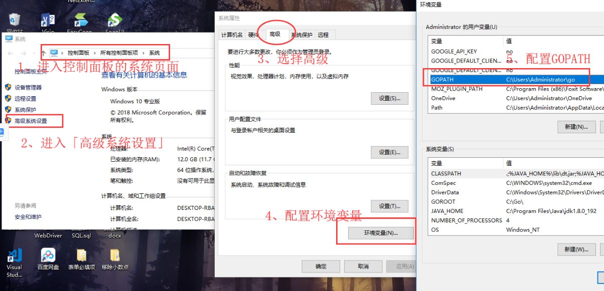

我是提倡使用VSCode，所以也就只说VSCode了，如果你们热爱别的编译器，那我在这也只能告诉你如何安装Go的依赖包了…

打开我们的VSCode，安装`Go`插件，就这一个就可以了

在命令框输入go build 名字.go 来编译go文件

./名字.exe运行编译好的文件

go run .go

安装依赖：

[(85条消息) VSCode搭建Go开发环境（2020-04-13更新）_vscode写go_闹闹吃鱼的博客-CSDN博客](https://blog.csdn.net/AdolphKevin/article/details/105480530)

[(85条消息) Go Build报错汇总（持续更新）_rockage的博客-CSDN博客](https://blog.csdn.net/rockage/article/details/120438635)

Windows目录权限引发的问题
现象：
每次执行go build的时候，总是会报以下错误：

open C:\Users\rocka\AppData\Local\Temp\go-build2905132708\b001\exe\a.out.exe:
The process cannot access the file because it is being used by another process.
go: failed to remove work dir: remove C:\Users\rocka\AppData\Local\Temp\go-build2905132708\b001\exe\a.out.exe:
The process cannot access the file because it is being used by another process.

解决方案：

找到 go文件夹， 鼠标右键点中 go 文件夹 > 属性 > 安全 > 高级
添加 > 主体：Everyone > 把所有权限都打开 > 应用 > 确定退出


实现一个简单的http服务器：

```go
package main //标准库

import (
     "net/http"
)

func main (){
    http.Handle("/",http.FileServer(http.Dir("."))) //路由
    http.ListenAndServe(":8080",nil)   //8080端口，启动服务器
}
```

字节跳动为什么全面拥抱Go语言

1.最初使用的python，由于性能问题换成了Go

2.C++ 不太适合在线web服务

3.早期团队非java团队

4.性能比较好

5.部署简单,学习成本低

6.内部 RPC 和 HTTP框架 的推广

7. 实践：使用module方式创建go项目
1） 创建目录
进入gopath的src目录下，创建文件夹example.com\cobra-go\hello。
1
2） 初始化module
在hello目录下使用go mod init example.com/cobra-go/hello目录来初始化项目，会生成go.mod文件。

go run main.go 编译运行

```go
package main  //入口包

import {
    "fmt"   // 导入fmt包
}

func main() {
	fmt.Println("hello world")
}
```

## 单词意思记忆

> scanner 扫描仪
>
> page 页面
>
> info 信息
>
> topic 话题
>
> post 帖子 
>
> list 列表
>
> service 服务
>
> param 参数
>
> query 查询
>
> flow 流，流程
>
> msg（message） 消息
>
> router 路由器
>
> parse 解析
>
> upgraded 升级
>
> duration 期间，持续时间
>
> format 格式
>
> heap 堆内存
>
> *SDK* 就是 Software Development Kit 的缩写  软件开发工具包
>
> span 跨度，宽度
>
> *clause* 子句
>
> dest 目的
>
> execute 执行
>
> instance 实例
>
> instance 回叫，回调
>
> bufio 缓冲器
>
> queue 队列
>
> channel 渠道
>
> Replica 副本
>
> Partition 分区，分割
>
> Batch 批量发送 （批量发送可以减少io次数）
>
> *fetch* 拿取（是web提供的一个可以获取异步资源的api）
>
> Coordinator 协调员 
>
> broker 经纪人，安排
>
> *SDK* （Software Development Kit 的缩写）软件开发工具包
>
> expire 失效
>
> alloc 分配
>
> pivot 中心，枢轴

## 基础语法

```go
package main  //入口包

import {
    "fmt"   // 导入fmt包
}

func main() {
	fmt.Println("hello world")
}
```


#### 从键盘上读取数据

使用"bufio","os"包

```go
package main

import (
    "bufio"
    "fmt"
    "os"
)

func query(word string) {
    fmt.Println("Querying for word:", word)
    // 具体的查询逻辑在这里实现
}

func main() {
    reader := bufio.NewReader(os.Stdin) //使用bufio中的NewReader方法，os中的输入流从键盘上读取到数据
    fmt.Print("Enter a word: ")
    word, _ := reader.ReadString('\n') //将读取到的数据转换成字符串，但在后面会有换行符号，可以用切片或者word = strings.TrimSpace(word)方法去掉换行符，word = word[:len(word)-1] // 利用切片去除最后一个字符（即换行符）
    query(word)
}
```

`word = strings.TrimSpace(word)` 这行代码使用 `strings.TrimSpace()` 函数去除字符串中的空白字符（包括换行符）。

#### fmt.Scanf 和 fmt.Printf  输入输出

`fmt.Scanf`是Go语言标准库中的一个函数，用于从标准输入中读取输入并根据指定的格式将其存储到变量中。

%s用于读取字符串，%d用于读取整数

以下是`fmt.Scanf`的基本用法示例：

```go
package main

import "fmt"

func main() {
    var name string
    var age int

    fmt.Println("请输入您的姓名和年龄：")
    _, err := fmt.Scanf("%s %d/n", &name, &age) //%s用于读取字符串，%d用于读取整数。读取用户输入的姓名和年龄，输入的两个数据要用空格隔开才能正确读取到，Scanf传递的是地址,要加上&
    //加上换行符可以避免意外换行错误
    if err != nil {
        fmt.Println("输入错误：", err)
        return
    }

    fmt.Println("您的姓名是：", name)
    fmt.Println("您的年龄是：", age)
}
```

**输入的数要用空格隔开才能正确读取到**

`fmt.Scanf`函数的第一个返回值表示成功读取的输入数量，我们在示例中使用`_`忽略了该返回值。如果输入格式不匹配，`fmt.Scanf`会返回一个非空的错误值。

使用`fmt.Scanf`时需要注意几点：

- 按照指定格式读取输入时，输入的内容必须与指定格式一致，否则会导致错误。

- 在读取变量时，要确保传递的是变量的地址（使用`&`符号）而不是变量本身。

- 如果读取的输入包含空格，则需要使用对应的格式标识符来匹配。

  **fmt.Printf**

  fmt.Printf传递的是数值，不用加&符号


#### 变量

```go
package main

import (
    "fmt"
    "math" //数字
)

func main() {
    var a = "initial"  //var创建变量

    var b,c int = 1,2 //指定类型赋值
    
    var d = true

    var e float64  //int64指的是带符号的64位整数
    
    f:= float32(e)

    g:= a + "foo"   //字符串可以相加

    fmt.Println(a,b,c,d,e,f)  // initial 1 2 true 0 0
    fmt.Println(g)  //initialfoo

    const s string = "constant" //常量

    const h =500000000

    const i =3e20 / h

    fmt.Println(s,h,i,math.Sin(h),math.Sin(i))
}
```

在Go语言中, := 是一种短变量声明的方式。它用于声明一个新的变量并初始化它。这种方式可以省略变量类型的声明，由编译器根据右侧的表达式推断出变量的类型。

例如：

```
x := 10
```

这段代码声明了一个名为x的新变量，并将其初始化为10。由于右侧的表达式是一个整数，编译器会推断出x的类型为int。

短变量声明操作符也可以用于声明并初始化多个变量：

```
x, y := 10, 20
```

这段代码声明了两个新变量x和y，并将它们分别初始化为10和20。

需要注意的是，:= 只能在函数内部使用，用于声明局部变量。在函数外部，必须使用var关键字来声明变量


#### if else

```go
package main

import "fmt"

func main() {

	if 7%2 == 0 { //没有括号，有括号会自动去掉
		fmt.Println("7 is even")
	} else {
		fmt.Println("7 is odd")
	}

	if 8%4 == 0 {
		fmt.Println("8 is divisible by 4")
	}

	if num := 9; num < 0 {
		fmt.Println(num, "is negative")
    } else if num < 10 { //else一定要跟在}后面才能读取到
		fmt.Println(num, "has 1 digit")
	} else {
		fmt.Println(num, "has multiple digits")
	}
}
```

#### 循环，go没有while，dowhile循环只有for循环

```go
package main

import "fmt"

func main() {

	i := 1
	for {  //什么都不写就代表死循环
		fmt.Println("loop")
		break
	}
	for j := 7; j < 9; j++ { //经典c循环
		fmt.Println(j)
	}

	for n := 0; n < 5; n++ {
		if n%2 == 0 {
			continue
		}
		fmt.Println(n)
	}
	for i <= 3 {   //while
		fmt.Println(i)
		i = i + 1
	}
}
```

#### switch分支结构

```go
package main

import (
	"fmt"
	"time" //时间
)

func main() {

	a := 2
	switch a { //c++中如果不加case后不加break会继续跑完剩下的case，但go不会
	case 1:
		fmt.Println("one")
	case 2:
		fmt.Println("two")
	case 3:
		fmt.Println("three")
	case 4, 5:
		fmt.Println("four or five")
	default:
		fmt.Println("other")
	}

	t := time.Now()
	switch {
	case t.Hour() < 12:
		fmt.Println("It's before noon")
	default:
		fmt.Println("It's after noon")
	}
}
```

#### 数组

```go
package main

import "fmt"

func main() {

	var a [5]int //0-4，创建五个元素的int数组
	a[4] = 100
	fmt.Println("get:", a[2])
	fmt.Println("len:", len(a))//显示数组长度  len: 5

	b := [5]int{1, 2, 3, 4, 5} //创建数组并赋值   
	fmt.Println(b)  //[1 2 3 4 5]

	var twoD [2][3]int   //二维数组
	for i := 0; i < 2; i++ {
		for j := 0; j < 3; j++ {
			twoD[i][j] = i + j
		}
	}
	fmt.Println("2d: ", twoD) //打印数组get: 0    2d:  [[0 1 2] [1 2 3]]
}
```

#### 切片（可变长度的数组）

可以任意去更改长度

```go
package main

import "fmt"

func main() {

	s := make([]string, 3) //创建一个长度为3的string切片
	s[0] = "a"
	s[1] = "b"
	s[2] = "c"
	fmt.Println("get:", s[2])   // c
	fmt.Println("len:", len(s)) // 3

	s = append(s, "d")  //追加长度，append必须赋值回原数组，因为slice（切片）实际上是长度，容量，指向原数组的指针
	s = append(s, "e", "f")
	fmt.Println(s) // [a b c d e f]

	c := make([]string, len(s))
	copy(c, s)  //c从s中拷贝数值
	fmt.Println(c) // [a b c d e f]

	fmt.Println(s[2:5]) // [c d e] 从第二位到第五位不包括第五位之间取元素，类似python的操作
	fmt.Println(s[:5])  // [a b c d e]
	fmt.Println(s[2:])  // [c d e f]

	good := []string{"g", "o", "o", "d"}
	fmt.Println(good) // [g o o d]
}
```

#### map（key,value）

```go
package main

import "fmt"

func main() {
	m := make(map[string]int) //创建map,string为key，value为值
	m["one"] = 1  //添加元素
	m["two"] = 2
	fmt.Println(m)           // map[one:1 two:2]
	fmt.Println(len(m))      // 2
	fmt.Println(m["one"])    // 1
	fmt.Println(m["unknow"]) // 0

	r, ok := m["unknow"]  //r,ok判断map中是否有这个key存在，r为value为0
	fmt.Println(r, ok) // 0 false

	delete(m, "one")//删除元素

	m2 := map[string]int{"one": 1, "two": 2}
	var m3 = map[string]int{"one": 1, "two": 2}
	fmt.Println(m2, m3)
}
```

#### range（遍历，使代码更简洁）

```go
package main

import "fmt"

func main() {
	nums := []int{2, 3, 4}
	sum := 0
	for i, num := range nums { //遍历数组会返回两个值，一个是索引，一个是对应数组的值，如果不需要索引的话可以用下划线取忽略
		sum += num
		if num == 2 {
			fmt.Println("index:", i, "num:", num) // index: 0 num: 2
		}
	}
	fmt.Println(sum) // 9

	m := map[string]string{"a": "A", "b": "B"}
	for k, v := range m {  //变量map，第一个值是key，第二个值是value
		fmt.Println(k, v) // b 8; a A
	}
	for k := range m {
		fmt.Println("key", k) // key a; key b
	}
}
```

#### 函数（func）

```go
package main

import "fmt"

func add(a int, b int) int {
	return a + b
}

func add2(a, b int) int {
	return a + b
}

func exists(m map[string]string, k string) (v string, ok bool) {  //第一个括号里面包含的是传参，第二个是要返回的值
	v, ok = m[k]
	return v, ok
}

func main() {
	res := add(1, 2)
	fmt.Println(res) // 3

	v, ok := exists(map[string]string{"a": "A"}, "a")
	fmt.Println(v, ok) // A True
}
```

**func (*TopicDao) QueryTopicById(id int64) *Topic**

`func (*TopicDao) QueryTopicById(id int64) *Topic`，它表示 `QueryTopicById` 是一个属于 `*TopicDao` 类型的方法。这意味着你可以在 `*TopicDao` 类型的指针上调用该方法来查询对应 `id` 的话题，并返回对应的 `*Topic` 实例。

**func (f *TopicDao) QueryTopicById(id int64) *Topic**

在方法内部可以通过`f`来访问`TopicDao`类型的字段和调用结构体上定义的方法。

#### init函数

1. init函数可以在所有程序执行开始前被调用，并且每个包下可以有多个init函数
2. init函数先于main函数自动执行
3. 每个包中可以有多个init函数，每个包中的源文件中也可以有多个init函数
4. init函数没有输入参数、返回值，也未声明，所以无法引用
5. 不同包的init函数按照包导入的依赖关系决定执行顺序
6. 无论包被导入多少次，init函数只会被调用一次，也就是只执行一次
7. init函数在代码中不能被显示的调用，不能被引用（赋值给函数变量），否则会出现编译错误
8. Go程序仅仅想要用一个package的init执行，我们可以这样使用：import _ “test_xxxx”，导入包的时候加上下划线就ok了
9. init函数不应该依赖任何在main函数里创建的变量，因为init函数的执行是在main函数之前的

执行顺序

被依赖的全局变量>>被依赖包的init函数>>...>>main包的全局变量>>main的init函数>>main函数

##### [init可以做什么](https://docs.fengfengzhidao.com/#/docs/golang基础/13.init函数?id=init可以做什么)

初始化操作

#### 指针

```go
package main

import "fmt"

func add2(n int) { 
	n += 2   //add2函数接受一个整数参数n，将其加上2，但并没有对原来的变量进行修改，而是在函数内部创建了一个新的变量来保存结果。
}

func add2ptr(n *int) {
	*n += 2  //add2ptr函数接受一个整数指针参数n，通过*n来访问指针指向的变量，并将该变量加上2，这会修改原来的变量。
    //在main函数中，调用add2ptr(&n)将n的地址传递给add2ptr，所以add2ptr修改的是原来的变量n，输出结果为7。
}

func main() {
	n := 5
	add2(n)
	fmt.Println(n) // 5
	add2ptr(&n) //传入地址
	fmt.Println(n) // 7
}
```

#### 结构体

```go
package main

import "fmt"

type user struct {
	name     string
	password string
}

func main() {
	a := user{name: "wang", password: "1024"}
	b := user{"wang", "1024"}
	c := user{name: "wang"} //没有初始值的就是空字符串
	c.password = "1024"
	var d user
	d.name = "wang"
	d.password = "1024"

	fmt.Println(a, b, c, d)                 // {wang 1024} {wang 1024} {wang 1024} {wang 1024}
	fmt.Println(checkPassword(a, "haha"))   // false
	fmt.Println(checkPassword2(&a, "haha")) // false
}

func checkPassword(u user, password string) bool {  //判断函数
	return u.password == password
}

func checkPassword2(u *user, password string) bool {
	return u.password == password
}
```

#### 结构体方法

```go
ackage main

import "fmt"

type user struct {
	name     string
	password string
}
//成员函数，go的变量名写在前头
func (u user) checkPassword(password string) bool {
	return u.password == password
}

func (u *user) resetPassword(password string) {  
	u.password = password
}
//
func main() {
	a := user{name: "wang", password: "1024"}
	a.resetPassword("2048")
	fmt.Println(a.checkPassword("2048")) // true
}
```

#### 包

##### [自己写一个包](https://docs.fengfengzhidao.com/#/docs/golang基础/14.包?id=自己写一个包)

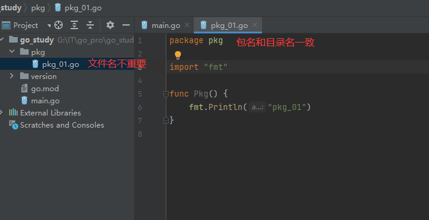

注意点

1. 一个包就是一个目录，包名和目录名一致

##### [包的导入](https://docs.fengfengzhidao.com/#/docs/golang基础/14.包?id=包的导入)

```go
package main

import "fmt"
import "go_study/pkg"

func main() {
  pkg.Pkg()
  fmt.Println("xxx")
}
```

##### [简写](https://docs.fengfengzhidao.com/#/docs/golang基础/14.包?id=简写)

```go
package main

import (
  "fmt"
  "go_study/pkg"
)
func main() {
  pkg.Pkg()
  fmt.Println("xxx")
}
```

##### [起别名](https://docs.fengfengzhidao.com/#/docs/golang基础/14.包?id=起别名)

如果有两个一样的包，那么在导入的时候就可以起一个别名

```go
package main

import (
  "fmt"
  pkg01 "go_study/pkg"
  pkg02 "go_study/pkg"
)

func main() {
  pkg01.Pkg()
  pkg02.Pkg()
  fmt.Println("xxx")
}CopyErrorOK!
```

##### [全部引入 .](https://docs.fengfengzhidao.com/#/docs/golang基础/14.包?id=全部引入-)

我们在使用包中的函数、变量的时候，通常都是包名点变量名这样，如果想直接使用变量名，那么需要将包中的内容全部导入

```go
package main

import (
  "fmt"
  . "go_study/pkg"
)

func main() {
  Pkg()
  fmt.Println("xxx")
}
```

但是这样做会有一些问题，一般是不建议的

如果在当前包中，有重名的函数名或变量，则会编译失败

##### [下划线_](https://docs.fengfengzhidao.com/#/docs/golang基础/14.包?id=下划线_)

引入某个包，但不直接使用包里的函数，而是调用该包里面的init函数

```go
package main

import (
  "fmt"
  _ "go_study/pkg"
)

func main() {
  fmt.Println("xxx")
}
```

#### 错误处理

```go
package main

import (
	"errors" //错误处理包
	"fmt"
)

type user struct {
	name     string
	password string
}

func findUser(users []user, name string) (v *user, err error) {
	for _, u := range users {
		if u.name == name {
			return &u, nil
		}
	}
	return nil, errors.New("not found")
}

func main() {
	u, err := findUser([]user{{"wang", "1024"}}, "wang")
	if err != nil {
		fmt.Println(err)
		return
	}
	fmt.Println(u.name) // wang

	if u, err := findUser([]user{{"wang", "1024"}}, "li"); err != nil {
		fmt.Println(err) // not found
		return
	} else {
		fmt.Println(u.name)
	}
}
```

程序中的`findUser`函数用于在用户数组中查找指定用户名的用户，并返回该用户的指针以及可能的错误。如果找到了用户，则返回用户的指针和`nil`错误；如果未找到用户，则返回`nil`指针和自定义的错误信息。

在`main`函数中，首先调用`findUser`函数来查找用户名为"wang"的用户。如果查找成功，则输出用户的名字"wang"；如果查找失败，则输出自定义的错误信息"not found"。

接着，在一个单独的if语句中，再次调用`findUser`函数来查找用户名为"li"的用户。如果查找成功，则输出用户的名字；如果查找失败，则输出自定义的错误信息"not found"。

注意，这里的`u`和`err`是在if语句块中的局部变量，与外部的`u`和`err`变量是独立的。所以在if语句块中输出`u.name`时，输出的是if语句块内部的`u`变量的名字。

nil就是NULL

#### 字符串操作

```go
package main

import (
	"fmt"
	"strings"
)

func main() {
	a := "hello"
	fmt.Println(strings.Contains(a, "ll"))                // true
	fmt.Println(strings.Count(a, "l"))                    // 2
	fmt.Println(strings.HasPrefix(a, "he"))               // true
	fmt.Println(strings.HasSuffix(a, "llo"))              // true
	fmt.Println(strings.Index(a, "ll"))                   // 2
	fmt.Println(strings.Join([]string{"he", "llo"}, "-")) // he-llo
	fmt.Println(strings.Repeat(a, 2))                     // hellohello
	fmt.Println(strings.Replace(a, "e", "E", -1))         // hEllo
	fmt.Println(strings.Split("a-b-c", "-"))              // [a b c]
	fmt.Println(strings.ToLower(a))                       // hello
	fmt.Println(strings.ToUpper(a))                       // HELLO
	fmt.Println(len(a))                                   // 5
	b := "你好"
	fmt.Println(len(b)) // 6
}
```

在`main`函数中，首先定义了一个字符串变量`a`，其值为"hello"。然后通过`strings`包中的各种函数进行字符串操作，并输出结果：

- `strings.Contains(a, "ll")`：判断字符串`a`是否包含子串"ll"，输出`true`。
- `strings.Count(a, "l")`：计算字符串`a`中子串"l"的出现次数，输出`2`。
- `strings.HasPrefix(a, "he")`：判断字符串`a`是否以前缀"he"开头，输出`true`。
- `strings.HasSuffix(a, "llo")`：判断字符串`a`是否以后缀"llo"结尾，输出`true`。
- `strings.Index(a, "ll")`：查找子串"ll"在字符串`a`中的索引位置，输出`2`。
- `strings.Join([]string{"he", "llo"}, "-")`：将字符串切片`[]string{"he", "llo"}`用连接符"-"拼接成一个字符串，输出"he-llo"。
- `strings.Repeat(a, 2)`：重复字符串`a`两次，输出"hellohello"。
- `strings.Replace(a, "e", "E", -1)`：将字符串`a`中的所有"e"替换为"E"，输出"hEllo"。
- `strings.Split("a-b-c", "-")`：将字符串"a-b-c"按照连接符"-"分割成字符串切片，输出`[a b c]`。
- `strings.ToLower(a)`：将字符串`a`转换为小写字母形式，输出"hello"。
- `strings.ToUpper(a)`：将字符串`a`转换为大写字母形式，输出"HELLO"。
- `len(a)`：获取字符串`a`的长度，输出`5`。
- `len(b)`：获取字符串`b`的长度，输出`6`。注意，这里的`b`是包含中文字符的字符串，一个中文字符占用3个字节。

通过以上函数和方法，你可以方便地进行字符串的查找、计数、替换、分割、大小

#### 字符串格式化

```go
package main

import "fmt"

type point struct {
	x, y int
}

func main() {
	s := "hello"
	n := 123
	p := point{1, 2}
	fmt.Println(s, n) // hello 123
	fmt.Println(p)    // {1 2}

	fmt.Printf("s=%v\n", s)  // s=hello
	fmt.Printf("n=%v\n", n)  // n=123
	fmt.Printf("p=%v\n", p)  // p={1 2}
	fmt.Printf("p=%+v\n", p) // p={x:1 y:2}
	fmt.Printf("p=%#v\n", p) // p=main.point{x:1, y:2}

	f := 3.141592653
	fmt.Println(f)          // 3.141592653
	fmt.Printf("%.2f\n", f) // 3.14
}
```

在`main`函数中，首先定义了字符串`s`、整数`n`和结构体`p`的变量，并初始化其值。然后使用`fmt.Println`函数将它们输出到标准输出：

- `fmt.Println(s, n)`：将字符串`s`和整数`n`以空格分隔输出，输出结果为`hello 123`。
- `fmt.Println(p)`：将结构体变量`p`输出，输出结果为`{1 2}`。

接着，使用`fmt.Printf`函数以格式化的方式输出变量的值：

- `fmt.Printf("s=%v\n", s)`：将字符串`s`的值以默认格式输出，输出结果为`s=hello`。
- `fmt.Printf("n=%v\n", n)`：将整数`n`的值以默认格式输出，输出结果为`n=123`。
- `fmt.Printf("p=%v\n", p)`：将结构体`p`的值以默认格式输出，输出结果为`p={1 2}`。
- `fmt.Printf("p=%+v\n", p)`：将结构体`p`的值以带字段名的格式输出，输出结果为`p={x:1 y:2}`。
- `fmt.Printf("p=%#v\n", p)`：将结构体`p`的值以Go语法表示的格式输出，输出结果为`p=main.point{x:1, y:2}`。

最后，使用`fmt.Println`和`fmt.Printf`函数将浮点数`f`的值输出：

- `fmt.Println(f)`：将浮点数`f`的值以默认格式输出，输出结果为`3.141592653`。
- `fmt.Printf("%.2f\n", f)`：将浮点数`f`的值以两位小数的格式输出，输出结果为`3.14`。


#### JSON处理

```go
package main

import (
	"encoding/json" //JOSN
	"fmt"
)

type userInfo struct {
	Name  string
	Age   int `json:"age"` //输出的字段名字改成小写，输出的字段就变成小写了
    Hobby []string      //最好都加上json:"",防止转成json文件的时候被认为是私有字段而没有正常生成
}

func main() {
	a := userInfo{Name: "wang", Age: 18, Hobby: []string{"Golang", "TypeScript"}}
	buf, err := json.Marshal(a)
	if err != nil {
		panic(err)
	}
	fmt.Println(buf)         // [123 34 78 97...]  十六进制的编码
	fmt.Println(string(buf)) // {"Name":"wang","age":18,"Hobby":["Golang","TypeScript"]}

	buf, err = json.MarshalIndent(a, "", "\t")
	if err != nil {
		panic(err)
	}
	fmt.Println(string(buf))

	var b userInfo
	err = json.Unmarshal(buf, &b)
	if err != nil {
		panic(err)
	}
	fmt.Printf("%#v\n", b) // main.userInfo{Name:"wang", Age:18, Hobby:[]string{"Golang", "TypeScript"}}
}
```

**err = json.Unmarshal(bodyText, &dictResponse) //将json反转译成结构体数据，err是抛出异常，bodyText传给dictResponse**

如果bodyText是string型，要转成[]byte类型

err = json.Unmarshal([]byte(bodyText), &dictResponse)

**结构体转成json文件，数据丢失的问题：**

`json:"age"` 结构体定义变量后面加上这个就行了

#### 将 `DictRequest` 结构体转换为 URL 编码的方法

可以使用 Go 的 `net/url` 包来将结构体转换为 URL 编码的字符串。

以下是将 `DictRequest` 结构体转换为 URL 编码的字符串的示例代码：

```go
package main

import (
	"fmt"
	"net/url"
)

type DictRequest struct {
	From    string `json:"from"`
	To      string `json:"to"`
	Client  string `json:"client"`
	Text    string `json:"text"`
	UUID    string `json:"uuid"`
	PID     string `json:"pid"`
	AddSugg string `json:"addSugg"`
}

func main() {
	a := DictRequest{
		From:    "auto",
		To:      "zh-CHS",
		Client:  "web",
		Text:    "hello",
		UUID:    "fdb4d454-cc47-465a-b018-9db29f85ab9b",
		PID:     "sogou-dict-vr",
		AddSugg: "on",
	}
///看这里
	v := url.Values{} //使用 `url.Values` 创建一个空的 URL 值对象
	v.Set("from", a.From) //并使用 `Set` 方法设置每个字段的值
	v.Set("to", a.To)
	v.Set("client", a.Client)
	v.Set("text", a.Text)
	v.Set("uuid", a.UUID)
	v.Set("pid", a.PID)
	v.Set("addSugg", a.AddSugg)//

	queryString := v.Encode() //使用 `Encode` 方法将 URL 值对象编码为 URL 编码的字符串。
	fmt.Println(queryString)
    ////
}
```

结果将输出：`from=auto&to=zh-CHS&client=web&text=hello&uuid=fdb4d454-cc47-465a-b018-9db29f85ab9b&pid=sogou-dict-vr&addSugg=on`。

在这个示例中，我们使用 `url.Values` 创建一个空的 URL 值对象，并使用 `Set` 方法设置每个字段的值。然后，使用 `Encode` 方法将 URL 值对象编码为 URL 编码的字符串。

#### 时间处理

```go
package main

import (
	"fmt"
	"time"
)

func main() {
	now := time.Now() //快速获取当前时间
	fmt.Println(now) // 2022-03-27 18:04:59.433297 +0800 CST m=+0.000087933
	t := time.Date(2022, 3, 27, 1, 25, 36, 0, time.UTC) //设置时间
	t2 := time.Date(2022, 3, 27, 2, 30, 36, 0, time.UTC)
	fmt.Println(t)                                                  // 2022-03-27 01:25:36 +0000 UTC
	fmt.Println(t.Year(), t.Month(), t.Day(), t.Hour(), t.Minute()) // 2022 March 27 1 25
	fmt.Println(t.Format("2006-01-02 15:04:05"))    //以规定的格式输出                // 2022-03-27 01:25:36
	diff := t2.Sub(t) //计算时间差
	fmt.Println(diff)                           // 1h5m0s
	fmt.Println(diff.Minutes(), diff.Seconds()) // 65 3900
	t3, err := time.Parse("2006-01-02 15:04:05", "2022-03-27 01:25:36")
	if err != nil {
		panic(err)
	}
	fmt.Println(t3 == t)    // true
	fmt.Println(now.Unix()) // 1648738080
}
```

- 在 `main` 函数中，使用 `time.Now()` 快速获取当前时间，并将其赋值给变量 `now`。
- 使用 `fmt.Println()` 打印当前时间 `now` 的值，以及输出的格式。
- 使用 `time.Date()` 创建了一个特定日期和时间的时间对象，并将其赋值给变量 `t`。
- 使用 `time.Date()` 再创建一个时间对象 `t2`，表示一个稍晚的时间。
- 使用 `fmt.Println()` 打印时间对象 `t` 的值，并分别输出年、月、日、小时和分钟等信息。
- 使用 `t.Format()` 将时间 `t` 格式化为指定的字符串格式，并使用 `fmt.Println()` 打印输出。
- 使用 `t2.Sub(t)` 计算 `t2` 和 `t` 时间之间的差值，并将结果赋值给变量 `diff`。
- 使用 `fmt.Println()` 打印差值 `diff` 的值。
- 使用 `diff.Minutes()` 和 `diff.Seconds()` 分别获取差值 `diff` 的分钟数和秒数，并使用 `fmt.Println()` 打印输出。
- 使用 `time.Parse()` 将字符串时间解析为时间对象，并将结果赋值给变量 `t3`。如果解析过程中遇到错误，会通过 `panic(err)` 抛出异常。
- 使用 `fmt.Println()` 比较时间对象 `t3` 和 `t` 是否相等，并打印结果。
- 使用 `now.Unix()` 获取当前时间 `now` 的 Unix 时间戳，并使用 `fmt.Println()` 打印输出。


##### Unix时间戳

Unix时间戳（Unix timestamp）是一种时间表示方式，它表示从1970年1月1日 00:00:00 UTC（协调世界时）起经过的秒数或毫秒数。Unix时间戳通常用于计算机系统中存储和处理时间相关的数据。

在Go语言中，可以使用`time`包来操作Unix时间戳。下面是几个示例：

1. 获取当前的Unix时间戳（秒数）：

go复制

```go
package main

import (
    "fmt"
    "time"
)

func main() {
    now := time.Now()
    unixTime := now.Unix()
    fmt.Println(unixTime)
}
```

1. 将Unix时间戳转换为时间对象：

```go
package main

import (
    "fmt"
    "time"
)

func main() {
    unixTime := int64(1648738080)
    timeObj := time.Unix(unixTime, 0)
    fmt.Println(timeObj)
}
```

1. 格式化Unix时间戳为特定的时间字符串：

```go
package main

import (
    "fmt"
    "time"
)

func main() {
    unixTime := int64(1648738080)
    timeObj := time.Unix(unixTime, 0)
    formattedTime := timeObj.Format("2006-01-02 15:04:05")
    fmt.Println(formattedTime)
}
```

这些示例展示了如何在Go语言中处理Unix时间戳。通过`time`包提供的函数和方法，我们可以轻松地进行时间和Unix时间戳之间的转换和格式化操作。


##### panic

在Go语言中，`panic` 是一个内建函数，用于发生严重错误或异常时引发一个运行时恐慌（panic）。当程序遇到无法处理的错误时，可以调用 `panic` 函数来停止程序的正常执行。

当 `panic` 函数被调用时，程序会立即停止当前函数的执行，并开始执行已被推迟的函数（deferred functions）并依次执行它们。然后，程序会沿着调用堆栈向上寻找，执行每一层的已被推迟的函数。最后，程序会打印出一个错误信息，并终止程序的运行。这个错误信息包含了 panic 发生的位置和触发 panic 的具体值。

一般来说，我们在编程过程中应该尽量避免 `panic` 的使用，并采用错误处理的方式来处理异常情况。使用 `panic` 应该是在遇到无法恢复或处理的、非常严重的错误时的最后手段。

可以使用 `recover` 函数来捕获 `panic` 引发的运行时恐慌，并尝试进行错误处理。`recover` 函数只能在延迟函数（deferred function）中使用，并且应该在 `defer` 语句中进行调用。当 `recover` 函数被调用时，它会终止当前的 `panic` 运行时恐慌，并返回触发 panic 的值。通过使用 `recover`，我们可以捕获并处理某些类型的错误，以保证程序的正常执行。

以下是一个示例代码，展示了 `panic` 和 `recover` 的基本用法：

```go
package main

import "fmt"

func main() {
    defer func() {
        if r := recover(); r != nil {
            fmt.Println("恢复运行时恐慌:", r)
        }
    }()
    
    fmt.Println("执行panic前")
    panic("发生了一个错误！")
    fmt.Println("执行panic后") // 这行代码不会被执行到
}
```

在上述示例中，我们使用 `defer` 和匿名函数来捕获 `panic`，并在其中使用 `recover` 进行错误处理。即使在 `panic` 之后还有代码，它也不会被执行到，因为 `panic` 将在这之前终止程序的执行。通过使用 `recover`，我们可以恢复程序的控制，并进行额外的错误处理，以确保程序的正常执行。

#### 数字解析

```go
package main

import (
	"fmt"
	"strconv"  //数字解析
)

func main() {
	f, _ := strconv.ParseFloat("1.234", 64)
	fmt.Println(f) // 1.234

	n, _ := strconv.ParseInt("111", 10, 64)  //10进制，传0就是自动推测
    fmt.Println(n) // 111

	n, _ = strconv.ParseInt("0x1000", 0, 64)
	fmt.Println(n) // 4096

	n2, _ := strconv.Atoi("123") //快速把十进制字符串改成数字
	fmt.Println(n2) // 123

	n2, err := strconv.Atoi("AAA") //AAA输入不合法
	fmt.Println(n2, err) // 0 strconv.Atoi: parsing "AAA": invalid syntax
}
```

#### 进程信息

```go
package main

import (
	"fmt"
	"os"
	"os/exec"
)

func main() {
	// go run example/20-env/main.go a b c d
	fmt.Println(os.Args)           // [/var/folders/8p/n34xxfnx38dg8bv_x8l62t_m0000gn/T/go-build3406981276/b001/exe/main a b c d]
	fmt.Println(os.Getenv("PATH")) // /usr/local/go/bin...
	fmt.Println(os.Setenv("AA", "BB"))

	buf, err := exec.Command("grep", "127.0.0.1", "/etc/hosts").CombinedOutput()
	if err != nil {
		panic(err)
	}
	fmt.Println(string(buf)) // 127.0.0.1       localhost
}
```

这段代码展示了如何在Go中使用`os`和`exec`包与环境变量进行交互和执行Shell命令。

首先导入`fmt`和`os`包。

然后在`main`函数中：

1. `fmt.Println(os.Args)` 打印程序传递的命令行参数。
2. `fmt.Println(os.Getenv("PATH"))` 打印`PATH`环境变量的值。
3. `fmt.Println(os.Setenv("AA", "BB"))` 将`AA`环境变量的值设置为"BB"并打印任何发生的错误。
4. `exec.Command("grep", "127.0.0.1", "/etc/hosts")` 创建一个新的`exec.Cmd`结构，其中包含命令"grep"和参数"127.0.0.1"和"/etc/hosts"。
5. 调用`CombinedOutput()`在`exec.Cmd`结构上执行命令并捕获其输出。输出存储在`buf`变量中，任何发生的错误存储在`err`变量中。
6. `fmt.Println(string(buf))` 打印命令的输出（在这种情况下，包含"127.0.0.1 localhost"的"/etc/hosts"文件中的行）。

如果在执行命令时发生任何错误（步骤5），程序将会崩溃并打印错误信息。

#### 分文件编写

在以main.go相对路径`./myPath`目录下面有两个Go文件：

mathadd.go：

```go
package mathClass //包的名字要一致
 
func Submy(x, y int) int{
        return x - y;
}
```

mathsub.go：

```go
package mathClass
 
func Addmy(x, y int) int{
        return x + y;
}
```


主文件：

```go
// hello.go
package main 
 
import "./myMath" //如果go处于go env -w GO111MODULE=off模式则能正常运行
import "fmt" 
 
func myPrint(){
        fmt.Println("start leran go program");
        fmt.Println(mathClass.Addmy(2,4)); //使用package命名的mathClass引用
        fmt.Println(mathClass.Submy(5,2));
 
}
 
func main(){
        myPrint();
        fmt.Println("end print");
}
```


**在终端中运行，直接报错：**

```
"./myPath" is relative, but relative import paths are not supported in module mode
```

说明go处于go env -w GO111MODULE=on模式

此时打开go.mod文件：

```
module gotest

go 1.20

require github.com/gin-gonic/gin v1.9.1

....//下面的内容我省略了
```

看向第一行的module gotest，用gotest替代相对路径 `.`，程序就正常运行了

```go
package main 
 
import "gotest/myMath"
import "fmt" 
 
func myPrint(){
        fmt.Println("start leran go program");
        fmt.Println(mathClass.Addmy(2,4));
        fmt.Println(mathClass.Submy(5,2));
 
}
 
func main(){
        myPrint();
        fmt.Println("end print");
}
```

#### 接口

##### 空接口

特殊的数据类型

方法定义的合集

方法名(形参类型)返回值类型

提高代码的复用率

```go
package main

import "fmt"

// Animal 定义一个animal的接口，它有唱，跳，rap的方法
type Animal interface {
  sing()
  jump()
  rap()
}

// Chicken 需要全部实现这些接口
type Chicken struct { //用Chicken类型实现Animal接口的所有方法。
  Name string
}

func (c Chicken) sing() {
  fmt.Println("chicken 唱")
}

func (c Chicken) jump() {
  fmt.Println("chicken 跳")
}
func (c Chicken) rap() {
  fmt.Println("chicken rap")
}

// 全部实现完之后，chicken就不再是一只普通的鸡了

func main() {
  var animal Animal

  animal = Chicken{"ik"}

  animal.sing()//chicken 唱
  animal.jump()//chicken 跳
  animal.rap() //chicken rap
    
  chicken := animal.(Chicken) //获取Chicken结构体中的数据 "ik"
  name := chicken.Name
  fmt.Println(name) //"ik"
}
```

接口本身不能绑定方法

接口是值类型，保存的是：值+原始类型

```go
package main

import "fmt"

// Animal 定义一个animal的接口，它有唱，跳，rap的方法
type Animal interface {
  sing()
  jump()
  rap()
}

// Chicken 需要全部实现这些接口
type Chicken struct {
  Name string
}

func (c Chicken) sing() {
  fmt.Println("chicken 唱")
}

func (c Chicken) jump() {
  fmt.Println("chicken 跳")
}
func (c Chicken) rap() {
  fmt.Println("chicken rap")
}

// Cat 需要全部实现这些接口
type Cat struct {
  Name string
}

func (c Cat) sing() {
  fmt.Println("cat 唱")
}

func (c Cat) jump() {
  fmt.Println("cat 跳")
}
func (c Cat) rap() {
  fmt.Println("cat rap")
}

func sing(obj Animal) {
  obj.sing()
}

// 全部实现完之后，chicken就不再是一只普通的鸡了

func main() {
  chicken := Chicken{"ik"}
  cat := Cat{"阿狸"}
  sing(chicken)
  sing(cat)
}
CopyErrorOK!
```

实现接口：

一个类型实现了接口的所有方法

即实现了该接口

##### [类型断言](https://docs.fengfengzhidao.com/#/docs/golang基础/20.接口?id=类型断言)

还原为原始类型 interface.(Type)

如果接口没有保存类型，则会报错

可返回两个值

value,ok := interface.(Type)

##### [空接口](https://docs.fengfengzhidao.com/#/docs/golang基础/20.接口?id=空接口)

interface{}

**空接口可以保存任何类型**

```go
package main

import "fmt"

type data interface{} //定义空接口

type Dog struct {
  Name string
}

func Print(d data) {
  fmt.Println(d)
}

func main() {
  d := Dog{"小黑"} //传入的是结构体类型

  Print(d)

  Print(12)//int类型
  Print("123")//string类型
  Print(true)//bool类型
  Print([]int{1, 2, 3})//数组类型
  Print(make(map[string]string, 2))//map类型
}
```

##### [nil问题](https://docs.fengfengzhidao.com/#/docs/golang基础/20.接口?id=nil问题)

nil值：有类型没有值，接口本身并不是nil，可以处理

nil接口：既没有报错值，也没有保存类型，使用时会报错

#### 协程

Goroutine是Go运行时管理的轻量级线程

主线程结束时，协程会被中断，需要有效的阻塞机制

##### [协程的使用](https://docs.fengfengzhidao.com/#/docs/golang基础/21.协程?id=协程的使用)

```go
package main

import (
  "fmt"
  "time"
)

// SendCode 发送验证码
func SendCode() {
  fmt.Println("发送验证码开始")
  time.Sleep(3 * time.Second)
  fmt.Println("发送验证码完成！")
}

func main() {
  // 实现用户注册功能
  fmt.Println("用户注册校验完成")
  // 发送验证码
  //SendCode() // 会阻塞主线程
  go SendCode() // 会阻塞主线程
  fmt.Println("验证码已发送，请注意查收...")
}
CopyErrorOK!
```

问题：

1. 主线程结束，协程也会结束
2. 协程安全
3. 如何获取协程函数的返回值，如何在协程中传递数据？

##### [WaitGroup](https://docs.fengfengzhidao.com/#/docs/golang基础/21.协程?id=waitgroup)

前面我们通过让主程序延时的方式，可以成功让协程函数顺利结束

但是，延时多久没人能够知道

所以，睡眠这种方式肯定不靠谱

go 自带一个WaitGroup可以解决这个问题, 代码如下

```go
package main

import (
    "sync"
)

var wg sync.WaitGroup

func say(s string) {
    for i := 0; i < 5; i++ {
        println(s)
    }
    wg.Done()
}

func main() {
    wg.Add(2)
    
    go say("Hello")
    go say("World")
    
    wg.Wait()
}
CopyErrorOK!
```

wg.add(2)是有2个goroutine需要执行

wg.Done 相当于 wg.Add(-1) 意思就是我这个协程执行完了。wg.Wait() 就是告诉主线程要等一下，等他们2个都执行完再退出

##### [协程安全](https://docs.fengfengzhidao.com/#/docs/golang基础/21.协程?id=协程安全)（锁）

非常经典的例子，两个协程函数，分别对同一个全局变量进行操作

按照我们预期的结果，应该是200万，但是多运行几次，会发现结果各不相同

这就是协程安全问题

```go
package main

import (
  "fmt"
  "sync"
)

var w = sync.WaitGroup{}
var num = 0

func AddNum() {
  for i := 0; i < 1000000; i++ {
    num++
  }
  w.Done()
}

func main() {
  w.Add(2)
  go AddNum()
  go AddNum()
  w.Wait()
  fmt.Println(num)

}
CopyErrorOK!
```

这种情况我们可以通过加锁进行解决，go语言中给我们通过了这个方法

```go
package main

import (
  "fmt"
  "sync"
)

var lock = sync.Mutex{}
var w = sync.WaitGroup{}
var num = 0

func AddNum() {
  lock.Lock()  // 上锁
  for i := 0; i < 1000000; i++ {
    num++
  }
  lock.Unlock() // 解锁
  w.Done() 
}

func main() {
  w.Add(2)
  go AddNum()
  go AddNum()
  w.Wait()
  fmt.Println(num)

}
```

#### channel

##### [声明和存取](https://docs.fengfengzhidao.com/#/docs/golang基础/22.channel?id=声明和存取)

channel，是一种带有类型的管道引用类型

使用前需要make(Type, (缓冲容量))

不带缓冲区的管道必须结合协程使用

可以查看长度len和容量cap

```go
package main

import "fmt"

func main() {
  // 声明一个string信道，容量为2
  var ch chan string = make(chan string, 2)

  ch <- "枫枫" // 写入数据到信道中
  ch <- "知道"

  s := <-ch // 从信道读取数据
  fmt.Println(s)//枫枫
  ss, ok := <-ch //取出数据
  fmt.Println(ss, ok)//知道 true

  close(ch)

}
```

```
存入：channel <- value
取出：value, (ok) <- channel
丢弃：<- channel
先进先出，自动阻塞
数据需要保持流动，否则会阻死报错CopyErrorOK!
```

搭配协程使用

```go
package main

import "fmt"

func pushNum(c chan int) {
  for i := 0; i < 100; i++ {
    c <- i
  }
  close(c) // 写完必须要关闭，不然会死锁
}

func main() {
  var c1 chan int = make(chan int, 2) // 2表示缓冲区大小
  go pushNum(c1)

  for value := range c1 {
    fmt.Println(value)
  }
}
CopyErrorOK!
```

多个协程函数，close就不能写在协程函数里了

```go
package main

import (
  "fmt"
  "sync"
)

var ch chan int = make(chan int, 10)
var wg = sync.WaitGroup{}

func pushNum() {

  for i := 0; i < 5; i++ {
    ch <- i
  }
  wg.Done()
}

func main() {

  wg.Add(2)
  go pushNum()
  go pushNum()
  wg.Wait()
  close(ch)
  for {
    res, ok := <-ch
    if !ok {
      break

    }
    fmt.Println(res)
  }

}
CopyErrorOK!
```

##### [close](https://docs.fengfengzhidao.com/#/docs/golang基础/22.channel?id=close)

使用close之后就不能在继续写入了，但是还可以继续从缓冲区读取

1. close之后，读取的chan是数据类型的默认值
2. close之后，不能再往chan里面写入数据
3. for range之前必须要close

##### [可读可写](https://docs.fengfengzhidao.com/#/docs/golang基础/22.channel?id=可读可写)

一个管道读取，一个管道写入

```go
package main

import "fmt"

func main() {
  var ch chan int = make(chan int, 2)
  // 可读chan
  var readCh <-chan int = ch
  // 可写chan
  var writeCh chan<- int = ch

  writeCh <- 1
  writeCh <- 2

  fmt.Println(<-readCh)
  fmt.Println(<-readCh)

}
```

##### [select ... case](https://docs.fengfengzhidao.com/#/docs/golang基础/22.channel?id=select-case)

适用于无法确认合适关闭信道的情况

通常结合for循环使用

select ... case会阻塞到某个分支可以继续执行时执行该分支，当没有可执行的分支是执行default分支

```go
package main

import "fmt"

func main() {
  var ch1 chan int = make(chan int, 2)
  var ch2 chan int = make(chan int, 2)
  var ch3 chan int = make(chan int, 2)
  ch1 <- 1
  ch2 <- 2
  ch3 <- 3

  select {
  // 监听多个chan的情况，是随机执行
  case v := <-ch1:
    fmt.Println(v)
  case v := <-ch2:
    fmt.Println(v)
  case v := <-ch3:
    fmt.Println(v)
  default:
    fmt.Println("没有数据")
  }

}
CopyErrorOK!
package main

import "fmt"

func PrimeNum(n int, c chan int) {
  for i := 2; i < n; i++ {
    if n%i == 0 {
      return
    }

  }
  c <- n
}

func main() {
  c := make(chan int)
  for i := 2; i < 100001; i++ {
    go PrimeNum(i, c)
  }
Print:
  for {
    select {
    case v := <-c:
      fmt.Printf("%v\t", v)
    default:
      fmt.Printf("所有素数都已被找到")
      break Print
    }
  }

}
```

#### 泛型

从1.18版本开始，Go添加了对[泛型](https://so.csdn.net/so/search?q=泛型&spm=1001.2101.3001.7020)的支持，即类型参数

##### [泛型函数](https://docs.fengfengzhidao.com/#/docs/golang基础/23.泛型?id=泛型函数)

没有泛型的痛点

1. 对于相近类型的操作，可能会写多个一模一样的函数
2. 不停的类型转换

```go
package main

import "fmt"
// 遍历int切片
func PrintIntSlice(slice []int) {
  for _, v := range slice {
    fmt.Printf("%T  %v\n", v, v)
  }
}
// 遍历int64切片
func PrintInt64Slice(slice []int64) {
  for _, v := range slice {
    fmt.Printf("%T  %v\n", v, v)
  }
}
// int64切片转int切片
func Int64SliceToIntSlice(Int64Slice []int64) (IntSlice []int) {
  for _, v := range Int64Slice {
    IntSlice = append(IntSlice, int(v))
  }
  return
}

func main() {
  PrintIntSlice([]int{1, 2, 3, 4, 5})
  var int64Slice []int64 = []int64{4, 5, 7}
  PrintInt64Slice(int64Slice)

  var intSlice []int
  for _, v := range int64Slice {
    intSlice = append(intSlice, int(v))
  }
  PrintIntSlice(intSlice)

  PrintIntSlice(Int64SliceToIntSlice(int64Slice))

}CopyErrorOK!
```

有了泛型函数，就很方便

```go
package main

import "fmt"

// 泛型函数
func PrintSliceTypeSlice[T int | int64 | string](slice []T) {
  fmt.Printf("%T\n", slice)
  for _, v := range slice {
    fmt.Printf("%T  %v\n", v, v)
  }
}

func main() {

  PrintSliceTypeSlice([]int{1, 2, 3, 4, 5})
  PrintSliceTypeSlice([]int64{1, 2, 3, 4, 5})
  PrintSliceTypeSlice([]string{"hello"})
  
  // 标准写法
  PrintSliceTypeSlice[int]([]int{1, 2, 3, 4, 5})
  PrintSliceTypeSlice[int64]([]int64{1, 2, 3, 4, 5})
  PrintSliceTypeSlice[string]([]string{"hello"})

}
CopyErrorOK!
```

##### [泛型切片](https://docs.fengfengzhidao.com/#/docs/golang基础/23.泛型?id=泛型切片)

```go
package main

import "fmt"

type mySlice[T int | string] []T

func printIntTypeSlice[T int | int64 | string](slice []T) {
  fmt.Printf("%T\n", slice)
  for _, v := range slice {
    fmt.Printf("%T  %v\n", v, v)
  }
}
func main() {
  v1 := mySlice[int]{1, 2, 3, 4, 5}
  printIntTypeSlice(v1)
  v2 := mySlice[string]{"hello"}
  printIntTypeSlice(v2)
}
CopyErrorOK!
```

##### [泛型map](https://docs.fengfengzhidao.com/#/docs/golang基础/23.泛型?id=泛型map)

```go
package main

import "fmt"

type myMap[K string | int, V any] map[K]V
type _User struct {
  Name string
}

func main() {
  m1 := myMap[string, string]{
    "key": "fengfeng",
  }
  fmt.Println(m1)
  m2 := myMap[int, _User]{
    0: _User{"枫枫"},
  }
  fmt.Println(m2)
}
CopyErrorOK!
```

##### [泛型约束](https://docs.fengfengzhidao.com/#/docs/golang基础/23.泛型?id=泛型约束)

##### [约束参数](https://docs.fengfengzhidao.com/#/docs/golang基础/23.泛型?id=约束参数)

```go
package main

import "fmt"

type NumStr interface {
  Num | Str
}

// ~的意思就是底层数据类型
type Num interface {
  ~int | ~int32 | ~int64 | ~uint8
}
type Str interface {
  string
}

type Status uint8

type mySlice1[T NumStr] []T

func main() {
  m1 := mySlice1[int]{1, 2, 3}
  fmt.Println(m1)
  m2 := mySlice1[int64]{1, 2, 3}
  fmt.Println(m2)
  m3 := mySlice1[string]{"hello"}
  fmt.Println(m3)
  m4 := mySlice1[Status]{1, 2, 3}
  fmt.Println(m4)
}
CopyErrorOK!
```

##### [约束方法](https://docs.fengfengzhidao.com/#/docs/golang基础/23.泛型?id=约束方法)

```go
package main

import (
  "fmt"
  "strconv"
)

type Price int

func (p Price) String() string {
  // int转数字
  return strconv.Itoa(int(p))
}

type Price2 string

func (p Price2) String() string {
  // int转数字
  return string(p)
}

type showPrice interface {
  ~int | ~string
  String() string
}

func showPriceFunc[T showPrice](p T) {
  fmt.Println(p.String())

}

func main() {
  var p1 Price = 12
  showPriceFunc(p1)
  var p2 Price2 = "56"
  showPriceFunc(p2)
}
```

#### 反射

go语言提供了一种机制，在编译时不知道类型的情况下，可更新变量，在运行时查看值，调用方法以及直接对他们的布局进行操作。这种机制称为反射(reflection)。

##### [为什么使用反射](https://docs.fengfengzhidao.com/#/docs/golang基础/24.反射?id=为什么使用反射)

使用空接口，可以传任意类型的数据，但是不能修改原始值

```go
package main

import "fmt"

type User struct {
  Name string
  Age  int
}

func Print(inter interface{}) {
  switch x := inter.(type) {
  case User:
    x.Name = "张三"
    fmt.Println(x.Name, x.Age)
  }
  //user := inter.(User)
  //user.Name = "xxx"
}

func PPrint(user *User) {
  user.Name = "王五"
}

func main() {
  user := User{"枫枫", 21}
  Print(user)
  fmt.Println(&user)

  //PPrint(&user)
  //fmt.Println(user)
}
```

用反射就能动态修改原始数据

##### [反射的优缺点](https://docs.fengfengzhidao.com/#/docs/golang基础/24.反射?id=反射的优缺点)

1. 可以动态修改数据的值

1. 性能问题
2. 可读性不太好

##### [reflect包](https://docs.fengfengzhidao.com/#/docs/golang基础/24.反射?id=reflect包)

两个很重要的方法 TypeOf，ValueOf

```go
package main

import (
  "fmt"
  "reflect"
)

type User struct {
  Name string `json:"name" feng:"name_xxx"`
  Age  int    `json:"age" feng:"age_xxx"`
}

func FPrint(inter interface{}) {
  t := reflect.TypeOf(inter)
  v := reflect.ValueOf(inter)
  //fmt.Println(t.Kind()) // 获取这个接口的底层类型
  //fmt.Println(t.Elem()) // 变量的原始类型
  for i := 0; i < t.NumField(); i++ {
    //fmt.Println()
    // 字段的类型
    // 字段名
    // 字段的值
    // 字段的tag
    fmt.Println(
      t.Field(i).Type,
      t.Field(i).Name,
      v.Field(i),
      t.Field(i).Tag.Get("feng"),
    )
  }

}

func main() {
  user := User{"枫枫", 21}
  FPrint(user)
}
CopyErrorOK!
```

##### [修改结构体的数据](https://docs.fengfengzhidao.com/#/docs/golang基础/24.反射?id=修改结构体的数据)

```go
package main

import (
  "fmt"
  "reflect"
)

type User struct {
  Name string `json:"name" feng:"name_xxx"`
  Age  int    `json:"age" feng:"age_xxx"`
}

func FPrint(inter interface{}) {
  v := reflect.ValueOf(inter)
  e := v.Elem()  // 必须用这个
  e.FieldByName("Name").SetString("枫枫知道")
}

func main() {
  user := User{"枫枫", 21}
  FPrint(&user)  // 必须传指针
  fmt.Println(user)
}
```

#### [IO包的基础使用](https://docs.fengfengzhidao.com/#/docs/golang基础/25.文件操作?id=io包的基础使用)

##### [Reader interface](https://docs.fengfengzhidao.com/#/docs/golang基础/25.文件操作?id=reader-interface)

```go
type Reader interface {
  Read(p []byte) (n int, err error)
}
CopyErrorOK!
```

将len(p)个字节读取到p中

##### [Writer interface](https://docs.fengfengzhidao.com/#/docs/golang基础/25.文件操作?id=writer-interface)

```go
type Writer interface {
  Write(p []byte) (n int, err error)
}
CopyErrorOK!
```

用于将p中的数据写入到对象的数据流中

##### [Seek interface](https://docs.fengfengzhidao.com/#/docs/golang基础/25.文件操作?id=seek-interface)

```go
type Seeker interface {
  Seek(offset int64, whence int) (int64, error)
}
CopyErrorOK!
```

offset是指针移动的偏移量

whence表示指针移动的方式

0 从数据的头部开始移动指针

1 从数据的当前指针位置开始移动指针

2 从数据的尾部移动指针

seek设置下一次读写操作的指针位置，每次的读写操作都是从指针位置开始的

##### [Close interface](https://docs.fengfengzhidao.com/#/docs/golang基础/25.文件操作?id=close-interface)

```go
type Closer interface {
  Close() error
}
CopyErrorOK!
```

关闭文件

##### [文件操作](https://docs.fengfengzhidao.com/#/docs/golang基础/25.文件操作?id=文件操作)

##### [文件打开模块](https://docs.fengfengzhidao.com/#/docs/golang基础/25.文件操作?id=文件打开模块)

```go
O_RDONLY int = syscall.O_RDONLY // 只读
O_WRONLY int = syscall.O_WRONLY // 只写
O_RDWR   int = syscall.O_RDWR   // 读写
O_APPEND int = syscall.O_APPEND // 追加
O_CREATE int = syscall.O_CREAT  // 如果不存在就创建
O_EXCL   int = syscall.O_EXCL   // 文件必须不存在
O_SYNC   int = syscall.O_SYNC   // 同步io
O_TRUNC  int = syscall.O_TRUNC  // 打开时清空文件
CopyErrorOK!
```

##### [读取文件](https://docs.fengfengzhidao.com/#/docs/golang基础/25.文件操作?id=读取文件)

```go
os.Open(name string) (file *File, err error)
ioutil.ReadFile(name string) ([]byte, error)
os.ReadFile(name string) ([]byte, error)
os.OpenFile(name string, flag int, perm FileMode) (*File, error)
CopyErrorOK!
```

##### [一次性读](https://docs.fengfengzhidao.com/#/docs/golang基础/25.文件操作?id=一次性读)

```go
func main() {
  bs, err := os.ReadFile("./abc.txt")
  if err != nil {
    fmt.Printf("Read file error: %v\n", err)
    return
  }

  fmt.Printf("%s\n", bs)
}
CopyErrorOK!
```

##### [分片读](https://docs.fengfengzhidao.com/#/docs/golang基础/25.文件操作?id=分片读)

```go
func main() {
  file, err := os.Open("abc.txt")
  if err != nil {
    panic(err)
  }
  defer file.Close()

  for {
    buf := make([]byte, 32)
    _, err = file.Read(buf)
    if err == io.EOF {
      break
    }

    if err != nil {
      panic(err)
    }

    fmt.Printf("%s", buf)
  }
}
CopyErrorOK!
```

##### [带缓冲读](https://docs.fengfengzhidao.com/#/docs/golang基础/25.文件操作?id=带缓冲读)

```go
func main() {
  file, err := os.Open("./abc.txt")
  if err != nil {
    fmt.Printf("Open file error: %v\n", err)
    return
  }
  defer file.Close()

  reader := bufio.NewReader(file)
  for {
    // 按行读取
    line, err := reader.ReadString('\n')
    if err == io.EOF {
      break
    }
    fmt.Print(line)
  }
}
CopyErrorOK!
```

##### [光标操作](https://docs.fengfengzhidao.com/#/docs/golang基础/25.文件操作?id=光标操作)

```go
file, _ := os.Open("abc.txt")
defer file.Close()

// 开始位置前进5个字节
var whence = 0
var offset int64 = 5
pos, _ := file.Seek(offset, whence)
fmt.Println("Jump forward 5 bytes from start position:", pos)

// 当前位置回退2个字节
whence = 1
offset = -2
pos, _ = file.Seek(offset, whence)
fmt.Println("Jump back 2 bytes from current position:", pos)
}
CopyErrorOK!
```

##### [分隔符读](https://docs.fengfengzhidao.com/#/docs/golang基础/25.文件操作?id=分隔符读)

```go
func main() {
  file, _ := os.Open("abc.txt")
  defer file.Close()

  scanner := bufio.NewScanner(file)

  // 分隔函数，默认 bufio.ScanLines
  scanner.Split(bufio.ScanWords)

  for scanner.Scan() {
    fmt.Println(scanner.Text())
  }

  err := scanner.Err()
  if err != nil {
    panic(err)
  }
}
CopyErrorOK!
```

##### [按行读](https://docs.fengfengzhidao.com/#/docs/golang基础/25.文件操作?id=按行读)

```go
func main() {
  file, _ := os.Open("abc.txt")
  defer file.Close()

  scanner := bufio.NewScanner(file)

  // 分隔函数，默认 bufio.ScanLines
  scanner.Split(bufio.ScanWords)

  for scanner.Scan() {
    fmt.Println(scanner.Text())
  }

  err := scanner.Err()
  if err != nil {
    panic(err)
  }
}
CopyErrorOK!
```

##### [写入文件](https://docs.fengfengzhidao.com/#/docs/golang基础/25.文件操作?id=写入文件)

```go
os.OpenFile(name string, flag int, perm FileMode) (file *File, err error)
os.Create(name string) (*File, error)
io/ioutil.Write(filename string, data []byte, perm fs.FileMode) error

文件操作模式：
覆盖写：os.O_WRONLY | os.O_TRUNC
追加写：os.O_WRONLY | os.O_APPEND
读写并追加：os.O_RDWR | os.OS_APPENDCopyErrorOK!
```

##### [常规写](https://docs.fengfengzhidao.com/#/docs/golang基础/25.文件操作?id=常规写)

```go
func writeFile() {
  file, err := os.OpenFile("abc.txt", os.O_CREATE|os.O_APPEND|os.O_RDWR, 0644)
  if err != nil {
    panic(err)
  }
  defer file.Close()

  byteSlice := []byte("hello world!")
  bytesWritten, err := file.Write(byteSlice)
  if err != nil {
    panic(err)
  }
  fmt.Printf("Wrote %d bytes\n", bytesWritten)
}
CopyErrorOK!
```

##### [快速写](https://docs.fengfengzhidao.com/#/docs/golang基础/25.文件操作?id=快速写)

```go
func main() {
  err := ioutil.WriteFile("abc.txt", []byte("add a new line"), 0644)
  if err != nil {
    panic(err)
  }
}
CopyErrorOK!
```

##### [缓冲写](https://docs.fengfengzhidao.com/#/docs/golang基础/25.文件操作?id=缓冲写)

```go
func main() {
  file, err := os.OpenFile("abc.txt", os.O_CREATE|os.O_WRONLY, 0600)
  if err != nil {
        panic(err)
  }
  defer file.Close()

  msg := "Hello World!\n"

  writer := bufio.NewWriter(file)
  for i := 0; i < 5; i++ {
    writer.Write([]byte(msg))
  }
  writer.Flush()
}
CopyErrorOK!
```

##### [复制文件](https://docs.fengfengzhidao.com/#/docs/golang基础/25.文件操作?id=复制文件)

```go
io.Copy(dst Writer, src Reader) (written int64, err error)CopyErrorOK!
read, _ := os.Open("xxx.jpg")
write, _ := os.Create("xx2.jpg")
n, err := io.Copy(write, read)
fmt.Println(n, err)CopyErrorOK!
```

##### [目录操作](https://docs.fengfengzhidao.com/#/docs/golang基础/25.文件操作?id=目录操作)

递归展示文件夹下所有文件

```go
func readDir(path string) {
  dir, err := os.ReadDir(path)
  if err != nil {
    fmt.Println(err)
    return
  }

  for _, entry := range dir {
    name := entry.Name()
    nPath := fmt.Sprintf("%s/%s", path, name)
    if entry.IsDir() {
      readDir(nPath)
      continue
    }
    fmt.Println(nPath)

  }
}
```

## 一些高级词

#### net包（网络连接）

**net.Conn**：

`net.Conn` 是 Go 语言中用于表示通用网络连接的接口类型。它定义了网络连接的基本操作和方法。

在 Go 中，`net.Conn` 接口用于表示一个通用的网络连接，可以是 TCP 连接、UDP 连接或其他类型的网络连接。它是 `net` 包中的一个接口，定义了读取数据、写入数据、关闭连接等基本功能。

`net.Conn` 接口包括以下一些常用的方法：

- `Read`: 从连接中读取数据到指定的缓冲区。
- `Write`: 将指定的数据写入连接。
- `Close`: 关闭连接。
- `SetDeadline`: 设置连接的读写超时时间。
- `LocalAddr`: 获取本地网络地址。
- `RemoteAddr`: 获取远程网络地址。

通过调用网络库函数（如 `net.Dial`）返回的 `net.Conn` 对象，我们可以使用这些方法来处理网络连接的读写和操作。

需要注意的是，Go 中的 `net.Conn` 接口是一个抽象接口，具体的实现是由不同的网络库来提供。例如，对于 TCP 连接，`net.Conn` 的实现对应的是 TCP 连接。


**net.Dial**：

`net.Dial` 是 Go 语言中用于建立网络连接的函数。它的作用是根据指定的网络类型和地址，与远程主机建立连接。

函数签名如下：

```go
func Dial(network, address string) (Conn, error) //最后一个括号代表的是返回值
```

中，`network` 表示网络类型，可以是 `"tcp"`、`"udp"`、`"unix"` 等。`address` 表示目标主机的地址，可以是 IP 地址或者域名。

`net.Dial` 函数根据提供的网络类型和地址，尝试与远程主机建立连接。如果连接成功，它将返回一个实现了 `net.Conn` 接口的对象，可以使用该对象进行数据的读写操作。如果连接过程中出现错误，将返回一个非空的错误对象。

下面是一个例子，使用 `net.Dial` 函数与目标主机建立 TCP 连接：

```go
conn, err := net.Dial("tcp", "example.com:80") //"example.com:80"为Dial 函数的目标地址，Dial 函数与尝试与该地址建立TCP连接
if err != nil {
    log.Fatal(err)
}
defer conn.Close()
```

#### reader（读取器）

`reader`（读取器）是一个接口类型，用于从数据源中读取数据。它定义了一组用于读取字节或字符的方法，可以读取来自不同数据源（例如文件、网络连接、内存缓冲区等）的数据。

*`reader` 接口定义如下：

```go
type Reader interface {
    Read(p []byte) (n int, err error)
}
```

其中，`Read` 方法接收一个字节切片 `p`，并返回读取的字节数 `n` 和可能出现的错误 `err`。通过多次调用 `Read` 方法，可以有效地从数据源中连续读取数据。

**bufio.Reader**

在标准库中，`bufio.Reader` 是实现 `Reader` 接口的一个常用类型，它提供了带缓冲功能的读取器。通过使用 `bufio.NewReader` 函数，你可以创建一个 `bufio.Reader` 对象来读取数据。`bufio.Reader` 提供了很多方法，例如 `ReadByte`、`ReadLine`、`ReadString` 等，用于按字节、按行或按字符串方式读取数据。

以下是一个示例代码片段，展示了如何使用 `bufio.Reader` 从标准输入中读取一行数据：

```go
package main

import (
    "bufio"
    "fmt"
    "os"
)

func main() {
    reader := bufio.NewReader(os.Stdin)
    fmt.Print("Enter text: ")
    text, _ := reader.ReadString('\n')
    fmt.Println("You entered:", text)
}
```

在上述代码中，我们使用 `bufio.NewReader` 创建一个读取器对象 `reader`，然后使用 `reader.ReadString` 方法读取用户在命令行输入的一行文本，并打印出来。

通过使用 `reader` 和不同的读取方法，你可以根据需要从不同的数据源读取数据并进行处理。

**NewReader就是读取任意数据进行存储，返回对象，通过这个对象可以读取到相关数据进行操作输入输出**


#### goroutine

`goroutine` 是一种轻量级的协程（goroutine），它比操作系统级线程更加高效和灵活。`goroutine` 可以在并发程序中并行地执行函数或方法，而不需要显式地创建和管理线程。

使用 `go` 关键字可以启动一个新的 `goroutine`。下面是一个简单的示例：

```go
package main

import (
	"fmt"
	"time"
)

func main() {
	go count()  // 启动一个新的 goroutine
	time.Sleep(2 * time.Second)
	fmt.Println("Main function done.")
}

func count() {
	for i := 1; i <= 5; i++ {
		fmt.Println(i)
		time.Sleep(500 * time.Millisecond)
	}
	fmt.Println("Counting done.")
}
```

**在上述代码中，`count` 函数会使用 `for` 循环打印数字 1 到 5，并在每个数字之间暂停 500 毫秒。`main` 函数中通过调用 `go count()` 来启动一个新的 `goroutine`，并同时执行主函数的其余部分。

结果：

```
1
2
3
4
5
Counting done.
Main function done.
```


当主函数的 `Sleep` 方法结束后，它会继续打印 “Main function done.”。而在后台的 `goroutine` 中，`count` 函数会继续执行，打印数字并最终输出 “Counting done.”。

需要注意的是，`goroutine` 可能会在主函数结束之前还没有执行完毕，因此在这个例子中我们使用 `Sleep` 方法来让主函数等待一段时间。

通过使用 `goroutine`，我们可以编写高效的并发程序，从而充分利用多核处理器的能力。`goroutine` 之间可以通过通道（channel）进行通信，用于传递数据和同步操作，实现数据的安全共享和协调执行。

使用 `goroutine` 需要注意避免共享资源的竞态条件（race condition），通过合适的同步机制（例如互斥锁、条件变量等）来保证数据的正确性和一致性。

#### bufio

`bufio.Reader` 是Go语言标准库中的一种类型，用于包装一个 `io.Reader`（接口类型）并提供带缓冲的读取功能。

`bufio.Reader` 可以用于高效地从输入流（比如文件、网络连接等）中读取数据，并提供了一些便捷的方法来处理读取的数据。

这个类型有一些常用的方法，例如：

- `Read`：读取指定数量的字节数据到指定的缓冲区，并返回实际读取的字节数和可能出现的错误。
- `ReadByte`：从输入流中读取一个字节，并返回该字节及可能的错误。
- `ReadLine`：读取一行数据（以换行符为界），并返回读取的字节数据和可能的错误。
- `ReadString`：读取直到遇到指定的分隔符（比如换行符）的数据，并返回读取到的字符串和可能的错误。

通过使用 `bufio.Reader`，我们可以实现快速而高效的数据读取，减少对低级别读写操作的频繁调用，从而提高性能。

**bufio.NewReader**

`bufio.NewReader`返回的是一个`bufio.Reader`对象，它用于从底层的`io.Reader`（例如网络连接）中读取数据。

`bufio.Reader`提供了多个方法用于读取数据，例如`ReadByte`、`ReadString`、`ReadLine`、`Read`等。这些方法用于按不同的方式读取数据，可以根据需要选择适合的方法。

具体传输的数据类型取决于具体的读取方法。例如，`ReadByte`方法返回的是一个字节（`byte`类型），而`ReadString`方法返回的是一个字符串（`string`类型）。可以根据接收到的数据类型修改代码，使用适当的读取方法。

**在上面的代码中，`reader := bufio.NewReader(conn)`创建的`reader`对象使用`ReadByte`方法逐字节读取数据。因此，`b`变量接收的是一个字节（`byte`类型）。

总之，`bufio.NewReader`返回的是一个读取器对象，可以使用不同的读取方法读取不同类型的数据，具体取决于读取方法的选择和使用。


###### **Scan**()

> `Scan()`是`bufio.Scanner`类型的方法，用于通过标准输入流（或其他输入流）逐行扫描并读取数据。它会扫描输入流中的下一行，并将结果存储在传递给`Scan()`方法的变量中。

> `Scan()`方法返回一个布尔值，表示是否成功读取到下一行数据。如果成功读取到数据，可以通过`scanner.Text()`方法获取该行数据的字符串形式。

以下是一个简单的示例代码，演示了如何使用`scanner.Scan()`方法从标准输入流逐行读取数据：

```go
package main

import (
    "bufio"
    "fmt"
    "os"
)

func main() {
    scanner := bufio.NewScanner(os.Stdin)

    // 循环扫描每一行数据
    for scanner.Scan() {
        line := scanner.Text() // 获取当前行的内容
        fmt.Println("输入的内容是：", line)
    }

    if err := scanner.Err(); err != nil {
        fmt.Println("读取输入时发生错误：", err)
    }
}
```

当程序运行起来后，可以逐行输入数据并按回车键确认，每输入一行，程序就会打印出这行数据的内容。使用`scanner.Scan()`方法可以方便地从输入流中读取数据，适用于处理标准输入或文件等数据源。

------


#### io

##### **io.ReadFull**

`io.ReadFull(reader, method)` 是一个标准库函数，用于从 `reader` 中读取 `method` 切片的数据。

具体而言，`io.ReadFull` 函数会尽可能地从 `reader` 中读取足够的字节填充到 `method` 切片中，直到 `method` 切片被完全填充满或者遇到了一个错误。

如果读取成功，`io.ReadFull` 函数会返回 `nil`，表示读取全部数据。否则，它会返回一个非空的错误。

##### **io.copy**

`io.Copy` 是 Go 语言中的一个函数，用于在两个数据流之间进行数据的拷贝操作。它的函数签名如下：

```go
func Copy(dst Writer, src Reader) (written int64, err error)
```

其中，`dst` 是目标写入流，`src` 是源读取流。函数会将从源读取到的数据逐字节地拷贝到目标流中，直到源结束或者发生错误。

`io.Copy` 函数会返回拷贝的字节数和可能发生的错误。如果拷贝过程中出现错误，将会提前终止拷贝操作，并返回错误信息。

示例：

```go
package main

import (
	"fmt"
	"io"
	"os"
)

func main() {
	srcFile, err := os.Open("source.txt") //打开资源文件
	if err != nil {
		fmt.Println("Failed to open source file:", err)
		return
	}
	defer srcFile.Close()

	dstFile, err := os.Create("destination.txt")//打开目标文件
	if err != nil {
		fmt.Println("Failed to create destination file:", err)
		return
	}
	defer dstFile.Close()

	// 拷贝源文件的内容到目标文件
	written, err := io.Copy(dstFile, srcFile) //将资源文件内容拷贝到目标文件
	if err != nil {
		fmt.Println("Failed to copy file:", err)
		return
	}

	fmt.Println("Copied", written, "bytes.") //written数值表示的是输出拷贝的字节数。
}
```

述示例中，我们打开了一个源文件（`source.txt`）和一个目标文件（`destination.txt`）。然后，使用 `io.Copy` 函数将源文件的内容拷贝到目标文件中。最后，输出拷贝的字节数。

需要注意的是，在进行文件拷贝时，需要确保源文件和目标文件都已经正确打开，并在操作结束后关闭文件流，以释放相关资源。

#### Defer(关键字)

加上该关键字的一行代码延迟到函数结束前进行 ,**后进先出**

#### `interface{}` 空接口（empty interface）


`nterface{}` 是 Go 语言中的一个特殊类型，它可以表示任意类型的值。

下面是一个使用空接口的示例：

```go
package main

import "fmt"

func main() {
    var x interface{} // 定义一个空接口变量
    x = 42           // 将整数值赋给空接口
    fmt.Println(x)  // 输出：42

    x = "Hello"     // 将字符串赋给空接口
    fmt.Println(x) // 输出：Hello

    x = 3.14        // 将浮点数赋给空接口
    fmt.Println(x) // 输出：3.14
}
```


空接口在需要处理不同类型数据的情况下非常有用，但由于缺乏类型信息，使用空接口也可能导致运行时类型错误。在处理空接口时，可以使用类型断言来判断实际的数据类型并进行相应的操作

在 Go 中，`interface{}` 被称为空接口（empty interface）。空接口没有任何方法要求，因此可以被任何类型的值实现。这使得我们可以使用空接口来存储和传递不同类型的值。

具体来说，使用空接口可以有以下用途：

1. 存储任意类型的值：可以使用空接口来存储不同类型的值，因为空接口可以接受任何类型的值。例如，可以将不同类型的元素存储在同一个切片中，通过空接口作为元素类型。

   ```go
   var data []interface{}
   data = append(data, 42)
   data = append(data, "hello")
   ```

   

2. 作为函数参数或返回值：使用空接口作为函数的参数或返回值类型，可以接受任意类型的参数或返回任意类型的值。

   ```go
   func processData(input interface{}) {
       // 处理数据...
   }
   
   func getData() interface{} {
       // 获取数据...
   }
   ```

   

3. 接口的通用类型：在没有明确的类型需求时，可以使用空接口作为通用类型。这样，可以接受实现了空接口的任何类型。

   ```go
   type Any interface{}
   
   func processAnyValue(value Any) {
       // 处理任意值...
   }
   ```

   

需要注意的是，当使用空接口时，需要进行类型断言（type assertion）或类型判断（type switch）来恢复具体的类型。这是因为编译器无法在运行时确定接口中存储的具体类型。

总结来说，`interface{}` 是 Go 语言中的空接口类型，可以用于存储和传递任意类型的值。


#### sync.Once 类型

`sync.Once`是Go语言标准库`sync`包中的一个类型，用于在并发环境下执行一次性操作的机制。

`sync.Once`只有一个方法`Do(f func())`，它接收一个函数作为参数。在第一次调用`Do()`方法时，`f`函数会被执行；后续的调用将被忽略，不会再次执行。(就仅仅只执行一次，有循环都不重复)

`sync.Once`保证只有一个协程可以执行`Do()`方法中的函数，其它协程将被阻塞，直到第一个协程执行完成。这在需要确保某个操作只执行一次的场景非常有用，比如单例模式的实现。

以下是一个简单的示例代码，演示了`sync.Once`的使用：

```go
package main

import (
	"fmt"
	"sync"
)

func main() {
	once := sync.Once{}

	for i := 0; i < 5; i++ {
		once.Do(func() {
			fmt.Println("This will only be printed once.")//只运行一次
		})
	}
}
```


在上述代码中，我们创建了一个`sync.Once`类型的变量`once`。然后，我们循环5次调用`once.Do()`方法，并传入一个匿名函数作为参数。由于`Do()`方法只能执行一次，所以匿名函数中的打印语句只会被执行一次。无论循环多少次，都只会打印一次字符串。

总结来说，`sync.Once`提供了一种简单、线程安全的方式来执行一次性操作，确保在并发环境下只执行一次。


#### dao := &TopicDao{} 和var dao *TopicDao 的区别

`dao := &TopicDao{}` 使用了短变量声明（short variable declaration）并结合了字面量初始化的方式来创建 `dao` 变量，并将一个新的 `TopicDao` 对象的指针赋值给它。这是在声明变量的同时完成了对象的实例化。

`var dao *TopicDao` 使用了 `var` 关键字来声明一个变量 `dao`，并将其类型定义为 `*TopicDao`，也就是 `TopicDao` 类型的指针。这种方式只声明了变量，但并没有对其进行赋值。此时，`dao` 变量的值为 `nil`。

因此，可以说 `dao := &TopicDao{}` 是创建了一个指向 `TopicDao` 类型对象的非空指针变量，而 `var dao *TopicDao` 是创建了一个指向 `TopicDao` 类型对象的空指针变量。

当需要使用已经存在的 `TopicDao` 实例时，可以使用 `&TopicDao{}` 的方式来创建一个新的非空指针变量并赋值给 `dao`，而如果后续需要对 `dao` 变量进行延迟初始化或者赋值，在初始声明时就使用 `var dao *TopicDao` 的方式会更合适。


#### strconv.ParseInt

`strconv.ParseInt(topicIdStr, base, bitSize)` 是 Go 语言标准库 `strconv` 包中的一个函数，用于将字符串转换为 `int64` 类型的整数。

在指定的代码中，`strconv.ParseInt(topicIdStr, base: 10,bitSize: 64)` 表示要将 `topicIdStr` 字符串解析为 `int64` 类型的整数。其中，参数的含义如下：

- `topicIdStr`：要解析的字符串。
- `base`：解析时使用的进制，`10` 表示使用十进制。也可以使用其他进制，如 `2` 表示二进制，`8` 表示八进制，`16` 表示十六进制，以此类推。
- `bitSize`：要解析的整数的位大小，`64` 表示解析为 `int64` 类型。


------

## 算法函数

Go语言的标准库`sort`中提供了多种排序算法。以下是几种常用的排序算法示例：

### **排序（Sort**）:

```go
package main

import (
	"fmt"
	"sort"
)

func main() {
	arr := []int{5, 4, 3, 2, 1}
	sort.Slice(arr, func(i, j int) bool {
		return arr[i] < arr[j]
	})
	fmt.Println(arr)
}
```

### 

## Go 语言的实战案例

#### 猜测生成的随机数游戏

```go
package main

import (
	"fmt"
	"math/rand" //随机数包
)

func main() {
	maxNum := 100
	secretNumber := rand.Intn(maxNum) //100以内随机数rand.Intn(maxNum) 函数会返回一个取值范围在0（包括）到 maxNum（不包括）之间的随机整数，随机整数是根据系统时间进行生成的。
	fmt.Println("The secret number is ", secretNumber) //生成的随机数是同一个数
}
```

加上时间戳使得随机数不同：

```go
package main

import (
	"fmt"
	"math/rand"
	"time"
)

func main() {
	maxNum := 100
	rand.Seed(time.Now().UnixNano()) //时间戳
	secretNumber := rand.Intn(maxNum)
	fmt.Println("The secret number is ", secretNumber)
}
```

读取用户输入：

```go
package main

import (
    "bufio"
    "fmt"
    "math/rand"
    "os"
    "strconv"
    "strings"
    "time"
)

func main() {
    maxNum := 100

    // 设置随机数生成的种子
    rand.Seed(time.Now().UnixNano())//UnixNano()返回的是当前时间的纳秒级 Unix 时间戳，Unix()当前时间的秒级 Unix 时间戳

    // 生成一个0到maxNum之间的随机秘密整数数字
    secretNumber := rand.Intn(maxNum)
    fmt.Println("The secret number is ", secretNumber)

    fmt.Println("Please input your guess")
    
    reader := bufio.NewReader(os.Stdin) // 创建一个读取器用于读取用户输入
    input, err := reader.ReadString('\n')  //reader.ReadString('\n') 是将从标准输入读取到的数据转换成字符串，直到遇到换行符（'\n'）为止的功能。reader.ReadString('\n') 会从标准输入读取用户输入的一行，并将其作为字符串返回给 input 变量
    if err != nil {
        fmt.Println("An error occurred while reading input. Please try again", err)
        return
    }

    // 去除输入字符串中的前后空格和换行符
    input = strings.Trim(input, "\r\n")

    // 将输入转换为整数
    guess, err := strconv.Atoi(input)
    if err != nil {
        fmt.Println("Invalid input. Please enter an integer value")
        return
    }

    fmt.Println("Your guess is", guess)
}
```

逻辑判断

```go

	if guess > secretNumber {
		fmt.Println("Your guess is bigger than the secret number. Please try again")
	} else if guess < secretNumber {
		fmt.Println("Your guess is smaller than the secret number. Please try again")
	} else {
		fmt.Println("Correct, you Legend!")
	}
```

#### 改进

修改第一个例子猜谜游戏里面的最终代码，使用 fmt.Scanf 来简化代码实现

```go
package main

import (
	"fmt"
	"math/rand"
	"time"
)

func main() {
	var PlayerNums int
	maxNUM := 100
	for {
		rand.Seed(time.Now().Unix())
		ScNUM := rand.Intn(maxNUM) //系统的随机数字
		fmt.Printf("请输入你猜测的数字\n")//加上换行符

		_, err := fmt.Scanf("%d\n", &PlayerNums) //读取玩家输入的数字，最后一定要加上换行符\n，否则循环会出现意外换行错误，Scanf传递的是地址，必须加上&
		if err != nil {
			fmt.Println(err)
			return
		}
		if ScNUM-PlayerNums > 0 {
			fmt.Println("你猜测的数字小了")
		} else if ScNUM == PlayerNums {
			fmt.Println("你猜测的数字和系统给出的一样！")
		} else {
			fmt.Println("你猜测的数字大了")
		}
		fmt.Printf("系统的结果是%d\n", ScNUM) //Printf传递是数值不用加&
	}
}
```


### 在线词典介绍

输入单词，就会弹出单词的翻译和介绍

##### 抓包

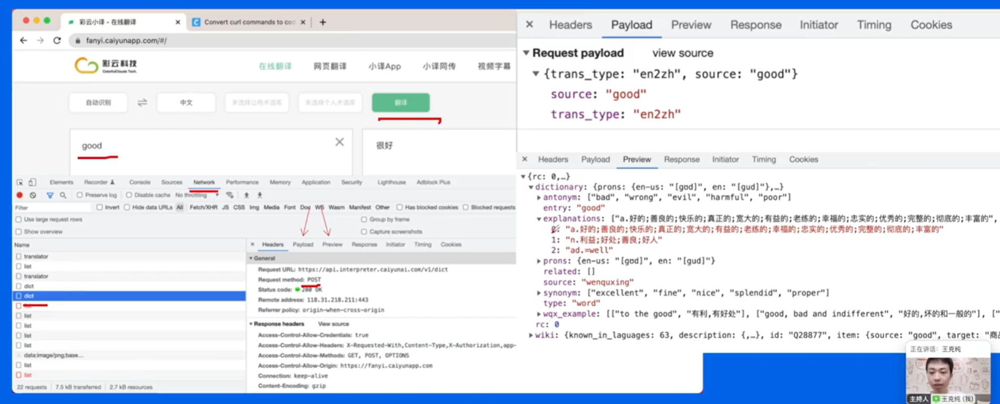

##### 生成代码（请求）

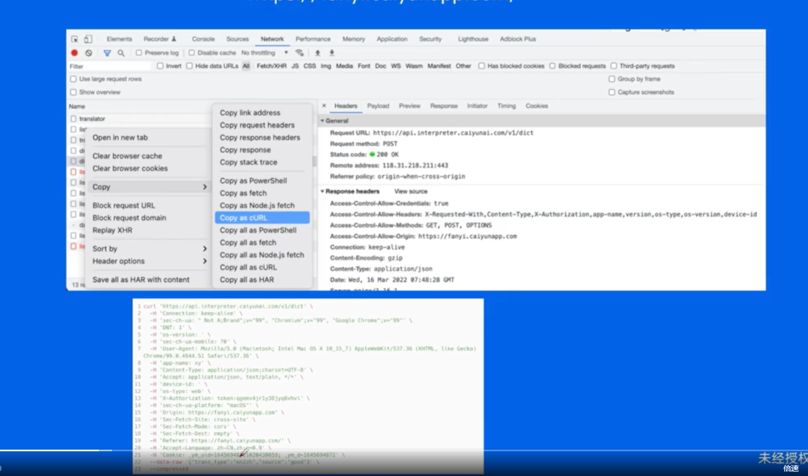

复制了curl bash请求后，用网站生成go代码


https://curlconverter.com/#go

获取到：

```go
package main

import (
	"fmt"
	"io"
	"log"
	"net/http"
	"strings"
)

func main() {
	client := &http.Client{}
	var data = strings.NewReader(`{"trans_type":"en2zh","source":"go"}`)
	req, err := http.NewRequest("POST", "https://api.interpreter.caiyunai.com/v1/dict", data)//创建请求，三个值，请求方式，url和响应数据
	if err != nil {
		log.Fatal(err)
	}
    //设置请求头
	req.Header.Set("authority", "api.interpreter.caiyunai.com")
	req.Header.Set("accept", "application/json, text/plain, */*")
	req.Header.Set("accept-language", "zh-CN,zh;q=0.9")
	req.Header.Set("app-name", "xy")
	req.Header.Set("content-type", "application/json;charset=UTF-8")
	req.Header.Set("device-id", "2de9c0e5f77c741461507e0ab40ea3d1")
	req.Header.Set("origin", "https://fanyi.caiyunapp.com")
	req.Header.Set("os-type", "web")
	req.Header.Set("os-version", "")
	req.Header.Set("referer", "https://fanyi.caiyunapp.com/")
	req.Header.Set("sec-ch-ua", `"Not.A/Brand";v="8", "Chromium";v="114", "Google Chrome";v="114"`)
	req.Header.Set("sec-ch-ua-mobile", "?0")
	req.Header.Set("sec-ch-ua-platform", `"Windows"`)
	req.Header.Set("sec-fetch-dest", "empty")
	req.Header.Set("sec-fetch-mode", "cors")
	req.Header.Set("sec-fetch-site", "cross-site")
	req.Header.Set("user-agent", "Mozilla/5.0 (Windows NT 10.0; Win64; x64) AppleWebKit/537.36 (KHTML, like Gecko) Chrome/114.0.0.0 Safari/537.36")
	req.Header.Set("x-authorization", "token:qgemv4jr1y38jyq6vhvi")
    //发起请求
	resp, err := client.Do(req)
	if err != nil {
		log.Fatal(err)
	}
	defer resp.Body.Close()
    //响应请求
	bodyText, err := io.ReadAll(resp.Body)//将响应的内容（json）读进字符串
	if err != nil {
		log.Fatal(err)
	}
	fmt.Printf("%s\n", bodyText) //打印json
}
```

可以跟python requests对比

##### 生成request body,返回data：

```go
package main

import (
	"bytes" 
	"encoding/json"
	"fmt"
	"io/ioutil"
	"log"
	"net/http"
)
//新增
type DictRequest struct {  //构建一个和响应数据data一样的结构体
	TransType string `json:"trans_type"`
	Source    string `json:"source"`
	UserID    string `json:"user_id"`
}
//DictRequest 结构体中的字段名称首字母小写，因此在进行 JSON 序列化时，这些字段会被视为私有字段，而不会被导出。为了使这些字段能够被导出并进行 JSON 序列化，你需要将它们的首字母改为大写。这样，json.Marshal(a) 就可以正确地将结构体转换为 JSON 字符串。
func main() {
	client := &http.Client{}
    //新增
	request := DictRequest{TransType: "en2zh", Source: "good"}
	buf, err := json.Marshal(request) //将request转成json格式
	if err != nil { //判断是否转义成功
		log.Fatal(err)
	}
	var data = bytes.NewReader(buf) //
    //
	req, err := http.NewRequest("POST", "https://api.interpreter.caiyunai.com/v1/dict", data)
	if err != nil {
		log.Fatal(err)
	}
	req.Header.Set("Connection", "keep-alive")
	req.Header.Set("DNT", "1")
	req.Header.Set("os-version", "")
	req.Header.Set("sec-ch-ua-mobile", "?0")
	req.Header.Set("User-Agent", "Mozilla/5.0 (Macintosh; Intel Mac OS X 10_15_7) AppleWebKit/537.36 (KHTML, like Gecko) Chrome/99.0.4844.51 Safari/537.36")
	req.Header.Set("app-name", "xy")
	req.Header.Set("Content-Type", "application/json;charset=UTF-8")
	req.Header.Set("Accept", "application/json, text/plain, */*")
	req.Header.Set("device-id", "")
	req.Header.Set("os-type", "web")
	req.Header.Set("X-Authorization", "token:qgemv4jr1y38jyq6vhvi")
	req.Header.Set("Origin", "https://fanyi.caiyunapp.com")
	req.Header.Set("Sec-Fetch-Site", "cross-site")
	req.Header.Set("Sec-Fetch-Mode", "cors")
	req.Header.Set("Sec-Fetch-Dest", "empty")
	req.Header.Set("Referer", "https://fanyi.caiyunapp.com/")
	req.Header.Set("Accept-Language", "zh-CN,zh;q=0.9")
	req.Header.Set("Cookie", "_ym_uid=16456948721020430059; _ym_d=1645694872")
	resp, err := client.Do(req)
	if err != nil {
		log.Fatal(err)
	}
	defer resp.Body.Close()
	bodyText, err := ioutil.ReadAll(resp.Body)
	if err != nil {
		log.Fatal(err)
	}
	fmt.Printf("%s\n", bodyText)
}
```

解析responds Json

直接写会很麻烦，直接用网站生成（[JSON转Golang Struct - 在线工具 - OKTools](https://oktools.net/json2go)）

直接右键复制预览中的object就是json文本，在网站中转成go：

```go
type AutoGenerated struct {
	Rc int `json:"rc"`
	Wiki Wiki `json:"wiki"`
	Dictionary Dictionary `json:"dictionary"`
}
type Wiki struct {
}
type Prons struct {
	EnUs string `json:"en-us"`
	En string `json:"en"`
}
type Dictionary struct {
	Prons Prons `json:"prons"`
	Explanations []string `json:"explanations"`
	Synonym []string `json:"synonym"`
	Antonym []string `json:"antonym"`
	WqxExample []WqxExample[]string `json:"wqx_example"`
	Entry string `json:"entry"`
	Type string `json:"type"`
	Related []interface{} `json:"related"`
	Source string `json:"source"`
}
```

将json传入定义好的对应的结构体

```go
package main

import (
	"bytes"
	"encoding/json"
	"fmt"
	"io/ioutil"
	"log"
	"net/http"
)

type DictRequest struct {  //传入数据
	TransType string `json:"trans_type"`
	Source    string `json:"source"`
	UserID    string `json:"user_id"`
}

type DictResponse struct { //响应数据
	Rc   int `json:"rc"`
	Wiki struct {
		KnownInLaguages int `json:"known_in_laguages"`
		Description     struct {
			Source string      `json:"source"`
			Target interface{} `json:"target"`
		} `json:"description"`
		ID   string `json:"id"`
		Item struct {
			Source string `json:"source"`
			Target string `json:"target"`
		} `json:"item"`
		ImageURL  string `json:"image_url"`
		IsSubject string `json:"is_subject"`
		Sitelink  string `json:"sitelink"`
	} `json:"wiki"`
	Dictionary struct {
		Prons struct {
			EnUs string `json:"en-us"`
			En   string `json:"en"`
		} `json:"prons"`
		Explanations []string      `json:"explanations"`
		Synonym      []string      `json:"synonym"`
		Antonym      []string      `json:"antonym"`
		WqxExample   [][]string    `json:"wqx_example"`
		Entry        string        `json:"entry"`
		Type         string        `json:"type"`
		Related      []interface{} `json:"related"`
		Source       string        `json:"source"`
	} `json:"dictionary"`
}

func main() {
	client := &http.Client{}
	request := DictRequest{TransType: "en2zh", Source: "good"}
	buf, err := json.Marshal(request)
	if err != nil {
		log.Fatal(err)
	}
	var data = bytes.NewReader(buf)
	req, err := http.NewRequest("POST", "https://api.interpreter.caiyunai.com/v1/dict", data)
	if err != nil {
		log.Fatal(err)
	}
	req.Header.Set("Connection", "keep-alive")
	req.Header.Set("DNT", "1")
	req.Header.Set("os-version", "")
	req.Header.Set("sec-ch-ua-mobile", "?0")
	req.Header.Set("User-Agent", "Mozilla/5.0 (Macintosh; Intel Mac OS X 10_15_7) AppleWebKit/537.36 (KHTML, like Gecko) Chrome/99.0.4844.51 Safari/537.36")
	req.Header.Set("app-name", "xy")
	req.Header.Set("Content-Type", "application/json;charset=UTF-8")
	req.Header.Set("Accept", "application/json, text/plain, */*")
	req.Header.Set("device-id", "")
	req.Header.Set("os-type", "web")
	req.Header.Set("X-Authorization", "token:qgemv4jr1y38jyq6vhvi")
	req.Header.Set("Origin", "https://fanyi.caiyunapp.com")
	req.Header.Set("Sec-Fetch-Site", "cross-site")
	req.Header.Set("Sec-Fetch-Mode", "cors")
	req.Header.Set("Sec-Fetch-Dest", "empty")
	req.Header.Set("Referer", "https://fanyi.caiyunapp.com/")
	req.Header.Set("Accept-Language", "zh-CN,zh;q=0.9")
	req.Header.Set("Cookie", "_ym_uid=16456948721020430059; _ym_d=1645694872")
	resp, err := client.Do(req)
	if err != nil {
		log.Fatal(err)
	}
	defer resp.Body.Close()
	bodyText, err := ioutil.ReadAll(resp.Body)
	if err != nil {
		log.Fatal(err)
	}
	var dictResponse DictResponse //定义响应的结构体
	err = json.Unmarshal(bodyText, &dictResponse) //将json的数据传到结构体
	if err != nil {
		log.Fatal(err)
	}
	fmt.Printf("%#v\n", dictResponse)//输出结构体
}
```

err = json.Unmarshal(bodyText, &dictResponse) //将json反转译成结构体数据，err是抛出异常，bodyText传给dictResponse

buf, err := json.Marshal(a) //将结构体转换成json   牵扯到数据转换都要返回一个err值，如果不要的话就使用_

##### 最后将结构体里面的翻译数据拿出来

```go
package main

import (
	"bufio"
	"encoding/json"
	"fmt"
	"io"
	"log"
	"net/http"
	"os"
    "strings"
	
)

type DictRequest struct {  //传入数据
	TransType string `json:"trans_type"`
	Source    string `json:"source"`
	UserID    string `json:"user_id"`
}

type DictResponse struct { //响应数据
	Rc   int `json:"rc"`
	Wiki struct {
		KnownInLaguages int `json:"known_in_laguages"`
		Description     struct {
			Source string      `json:"source"`
			Target interface{} `json:"target"`
		} `json:"description"`
		ID   string `json:"id"`
		Item struct {
			Source string `json:"source"`
			Target string `json:"target"`
		} `json:"item"`
		ImageURL  string `json:"image_url"`
		IsSubject string `json:"is_subject"`
		Sitelink  string `json:"sitelink"`
	} `json:"wiki"`
	Dictionary struct {
		Prons struct {
			EnUs string `json:"en-us"`
			En   string `json:"en"`
		} `json:"prons"`
		Explanations []string      `json:"explanations"`
		Synonym      []string      `json:"synonym"`
		Antonym      []string      `json:"antonym"`
		WqxExample   [][]string    `json:"wqx_example"`
		Entry        string        `json:"entry"`
		Type         string        `json:"type"`
		Related      []interface{} `json:"related"`
		Source       string        `json:"source"`
	} `json:"dictionary"`
}

func main() {
    client := &http.Client{}
    ////
    read := bufio.NewReader(os.Stdin) //从键盘输入数据
     fmt.Println("请输入单词")
     word,_:= read.ReadString('\n')
     word = strings.TrimSpace(word) //去掉换行符\n
	request := DictRequest{TransType: "en2zh", Source: word} //结构体
    ////
    utf,_ := json.Marshal(request) //将结构体转成json，下一步再将json转成str实现结构体转换成字符串
    var data = strings.NewReader(string(utf))
	req, err := http.NewRequest("POST", "https://api.interpreter.caiyunai.com/v1/dict", data)//创建请求，三个值，请求方式，url和响应数据
	if err != nil {
		log.Fatal(err)
	}
    //设置请求头
	req.Header.Set("authority", "api.interpreter.caiyunai.com")
	req.Header.Set("accept", "application/json, text/plain, */*")
	req.Header.Set("accept-language", "zh-CN,zh;q=0.9")
	req.Header.Set("app-name", "xy")
	req.Header.Set("content-type", "application/json;charset=UTF-8")
	req.Header.Set("device-id", "2de9c0e5f77c741461507e0ab40ea3d1")
	req.Header.Set("origin", "https://fanyi.caiyunapp.com")
	req.Header.Set("os-type", "web")
	req.Header.Set("os-version", "")
	req.Header.Set("referer", "https://fanyi.caiyunapp.com/")
	req.Header.Set("sec-ch-ua", `"Not.A/Brand";v="8", "Chromium";v="114", "Google Chrome";v="114"`)
	req.Header.Set("sec-ch-ua-mobile", "?0")
	req.Header.Set("sec-ch-ua-platform", `"Windows"`)
	req.Header.Set("sec-fetch-dest", "empty")
	req.Header.Set("sec-fetch-mode", "cors")
	req.Header.Set("sec-fetch-site", "cross-site")
	req.Header.Set("user-agent", "Mozilla/5.0 (Windows NT 10.0; Win64; x64) AppleWebKit/537.36 (KHTML, like Gecko) Chrome/114.0.0.0 Safari/537.36")
	req.Header.Set("x-authorization", "token:qgemv4jr1y38jyq6vhvi")
    //发起请求
	resp, err := client.Do(req)
	if err != nil {
		log.Fatal(err)
	}
	defer resp.Body.Close()
    //响应请求
	bodyText, err := io.ReadAll(resp.Body)//将响应的内容（json）读进字符串
	if err != nil {
		log.Fatal(err)
	}
    var dictResponse DictResponse //定义响应的结构体
	err = json.Unmarshal(bodyText, &dictResponse) //将json的数据传到结构体,err是抛出异常

    for _,num := range dictResponse.Dictionary.Explanations{
        fmt.Println(num)
    }
}
```

##### 练习（抓取搜狗翻译）

[搜狗翻译 - 我的贴身智能翻译专家 (sogou.com)](https://fanyi.sogou.com/text?keyword=hello&transfrom=auto&transto=zh-CHS&model=general)

data所需要的数据不是json，而是 URL 编码的字符串。

可以使用 Go 的 `net/url` 包来将结构体转换为 URL 编码的字符串。

##### **将 `DictRequest` 结构体转换为 URL 编码的方法**

可以使用 Go 的 `net/url` 包来将结构体转换为 URL 编码的字符串。

以下是将 `DictRequest` 结构体转换为 URL 编码的字符串的示例代码：

```go
package main

import (
	"fmt"
	"net/url"
)

type DictRequest struct {
	From    string `json:"from"`
	To      string `json:"to"`
	Client  string `json:"client"`
	Text    string `json:"text"`
	UUID    string `json:"uuid"`
	PID     string `json:"pid"`
	AddSugg string `json:"addSugg"`
}

func main() {
	a := DictRequest{
		From:    "auto",
		To:      "zh-CHS",
		Client:  "web",
		Text:    "hello",
		UUID:    "fdb4d454-cc47-465a-b018-9db29f85ab9b",
		PID:     "sogou-dict-vr",
		AddSugg: "on",
	}
///看这里
	v := url.Values{} //使用 `url.Values` 创建一个空的 URL 值对象
	v.Set("from", a.From) //并使用 `Set` 方法设置每个字段的值
	v.Set("to", a.To)
	v.Set("client", a.Client)
	v.Set("text", a.Text)
	v.Set("uuid", a.UUID)
	v.Set("pid", a.PID)
	v.Set("addSugg", a.AddSugg)//

	queryString := v.Encode() //使用 `Encode` 方法将 URL 值对象编码为 URL 编码的字符串。
	fmt.Println(queryString)
    ////
}
```

结果将输出：`from=auto&to=zh-CHS&client=web&text=hello&uuid=fdb4d454-cc47-465a-b018-9db29f85ab9b&pid=sogou-dict-vr&addSugg=on`。

在这个示例中，我们使用 `url.Values` 创建一个空的 URL 值对象，并使用 `Set` 方法设置每个字段的值。然后，使用 `Encode` 方法将 URL 值对象编码为 URL 编码的字符串。

```go
package main

import (
	"encoding/json"
	"fmt"
	"io"
	"log"
	"net/http"
	"net/url"
	"strings"
)

type DictRequest struct {
	From    string `json:"from"`
	To      string `json:"to"`
	Client  string `json:"client"`
	Text    string `json:"text"`
	UUID    string `json:"uuid"`
	PID     string `json:"pid"`
	AddSugg string `json:"addSugg"`
}
//这个是json的主体部分
type AutoGenerated struct {
	Zly string `json:"zly"`
	Message string `json:"message"`
	Code int `json:"code"`
	UUID string `json:"uuid"`
	Sugg []Sugg `json:"sugg"`
	Direction string `json:"direction"`
}
type Sugg struct {
	K string `json:"k"`
	V string `json:"v"`
}
//获取到post数据
func main() {
	var word string
	fmt.Println("请输入要查询的单词")
	fmt.Scanf("%s",&word)
	client := &http.Client{}
	a := DictRequest{
		From:    "auto",
		To:      "zh-CHS",
		Client:  "web",
		Text:    word,
		UUID:    "fdb4d454-cc47-465a-b018-9db29f85ab9b",
		PID:     "sogou-dict-vr",
		AddSugg: "on",
	}

	v := url.Values{}
	v.Set("from", a.From)
	v.Set("to", a.To)
	v.Set("client", a.Client)
	v.Set("text", a.Text)
	v.Set("uuid", a.UUID)
	v.Set("pid", a.PID)
	v.Set("addSugg", a.AddSugg)

	queryString := v.Encode()
	//fmt.Println(queryString)
	var data = strings.NewReader(queryString)
    //var data = strings.NewReader(`from=auto&to=zh-CHS&client=web&text=hello&uuid=fdb4d454-cc47-465a-b018-9db29f85ab9b&pid=sogou-dict-vr&addSugg=on`) 
	req, err := http.NewRequest("POST", "https://fanyi.sogou.com/reventondc/suggV3", data)
	if err != nil {
		log.Fatal(err)
	}
	req.Header.Set("Accept", "application/json")
	req.Header.Set("Accept-Language", "zh-CN,zh;q=0.9,en-US;q=0.8,en;q=0.7,en-GB;q=0.6")
	req.Header.Set("Cache-Control", "no-cache")
	req.Header.Set("Connection", "keep-alive")
	req.Header.Set("Content-Type", "application/x-www-form-urlencoded")
	req.Header.Set("Cookie", "ssuid=940679152; SUID=D23AE7781F49910A00000000639ACC7E; cuid=AAH+mBAFRgAAAAqHS07gkAEANgg=; SUV=1689238283241317; LSTMV=86%2C532; LCLKINT=2153763; ABTEST=2|1690344667|v17; SNUID=D34E49EEE0D9E1BCE9AAE3C8E095DBD4; wuid=1690344667584; FQV=0a1d247370350cf6558d48a98fde7304; translate.sess=5d078bf7-880c-402d-a644-29c6861bbe18; SGINPUT_UPSCREEN=1690344669163")
	req.Header.Set("Origin", "https://fanyi.sogou.com")
	req.Header.Set("Pragma", "no-cache")
	req.Header.Set("Referer", "https://fanyi.sogou.com/text")
	req.Header.Set("Sec-Fetch-Dest", "empty")
	req.Header.Set("Sec-Fetch-Mode", "cors")
	req.Header.Set("Sec-Fetch-Site", "same-origin")
	req.Header.Set("User-Agent", "Mozilla/5.0 (Windows NT 10.0; Win64; x64) AppleWebKit/537.36 (KHTML, like Gecko) Chrome/115.0.0.0 Safari/537.36 Edg/115.0.1901.183")
	req.Header.Set("sec-ch-ua", `"Not/A)Brand";v="99", "Microsoft Edge";v="115", "Chromium";v="115"`)
	req.Header.Set("sec-ch-ua-mobile", "?0")
	req.Header.Set("sec-ch-ua-platform", `"Windows"`)
	resp, err := client.Do(req)
	if err != nil {
		log.Fatal(err)
	}
	defer resp.Body.Close()
	bodyText, err := io.ReadAll(resp.Body)
	if err != nil {
		log.Fatal(err)
	}
	//fmt.Printf("%s\n", bodyText)
	var shuju AutoGenerated  //respond结构体
	err = json.Unmarshal(bodyText,&shuju)
	if err != nil {
		fmt.Println("转换失败")
	}
	//打印翻译
	for _,name := range shuju.Sugg{
		fmt.Println(name)
	}
}
```


### SOCKS5 代理介绍

SOCKS5（Socket Secure 5）是一种网络协议，用于在客户端和服务器之间建立安全的代理连接。它是 SOCKS 协议的第五个版本，提供了更强大的功能和更好的安全性。

以下是 SOCKS5 代理的一些关键特点和用途：

1. 匿名代理：使用 SOCKS5 代理可以隐藏客户端的真实 IP 地址，提供匿名性。通过 SOCKS5 代理，客户端可以使用代理服务器的 IP 地址与目标服务器进行通信，保护了客户端的隐私。
2. 支持 TCP 和 UDP：与 SOCKS4 和 SOCKS4a 类型的代理相比，SOCKS5 代理支持更多的应用层协议，包括 TCP 和 UDP。这使得它可以用于更广泛的网络应用，如网页浏览、邮件传输、文件传输等。
3. 身份验证：SOCKS5 支持多种身份验证方法，包括无验证、用户名/密码验证和 GSSAPI（通用安全服务应用程序接口）身份验证。这提供了更好的安全性和灵活性，以便根据具体需求进行身份验证。
4. 网络访问控制：SOCKS5 代理可以用于限制对特定目标服务器或特定端口的访问。这种灵活性使得它成为在企业环境中控制和监视网络访问的有效工具。
5. 穿透防火墙：SOCKS5 代理可以用作穿透防火墙的一种方法。通过在防火墙之外建立 SOCKS5 代理服务器，客户端可以绕过防火墙限制，访问受限制的资源。

SOCKS5 代理在各种场景中都有广泛应用，包括隐私保护、绕过地理限制、网络爬虫、数据采集等。请注意，使用 SOCKS5 代理需要在客户端应用程序中配置代理设置，以便与代理服务器建立连接并传输数据。


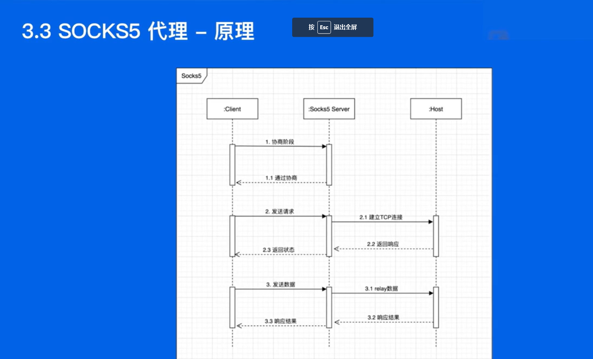


#### TCP echo server 监听阶段

```go
package main

import (
	"bufio"
	"log"
	"net" //监听需要的包
)

func main() {
	server, err := net.Listen("tcp", "127.0.0.1:1080") //监听端口，返回server （相当于在本地开辟一个TCP协议的地址为127.0.0.1:1080的服务器）
	if err != nil {
		panic(err)
	}
	for { //while循环
		client, err := server.Accept()  //Accept接受一个请求，如果成功的话就会返回一个链接给客户端（client）
		if err != nil { //如果错误的话，会返回err
			log.Printf("Accept failed %v", err)
			continue
		}
        go process(client) //类比其他语言的子线程，用process()函数去处理这个链接，消耗资源要比其他语言小很多
	}
}

func process(conn net.Conn) {
	defer conn.Close()//defer 是一个关键字，用于延迟（defer）函数或方法的执行。当使用 defer 语句时，函数调用被推迟到包含它的函数返回之前执行。也就是在函数执行完成之后，链接才被关闭
	reader := bufio.NewReader(conn) //有缓冲作用，创建对象
	for {
		b, err := reader.ReadByte() //创建的`reader`对象使用`ReadByte`方法逐字节读取数据。因此，`b`变量接收的是一个字节（`byte`类型）。
		if err != nil {
			break
		}
		_, err = conn.Write([]byte{b})//[]byte{b}将字节b转换为一个[]byte切片，将它们写回连接
		if err != nil {
			break
		}
	}
}
```

这是一个使用Go语言实现的简单TCP服务器。它监听端口1080，并接受传入的连接。每个连接都在一个单独的goroutine中进行处理。

主函数开始通过调用`net.Listen`函数监听端口1080。如果在监听过程中出现错误，程序会panic。

接下来，在一个无限循环中，使用`server.Accept`方法接受传入的连接。如果在接受连接过程中出现错误，会记录错误并继续循环。

对于每个被接受的连接，使用`go`关键字创建一个新的goroutine。这个goroutine调用`process`函数处理该连接。`process`函数使用`bufio.NewReader`从连接中读取字节，并使用`conn.Write`将它们写回连接。如果在读取或写入过程中出现错误，循环会中断并关闭连接。

总的来说，这个程序创建了一个TCP服务器，它会将接收到的数据原样返回给客户端。


**bufio传输方式**

`bufio.NewReader`返回的是一个`bufio.Reader`对象，它用于从底层的`io.Reader`（例如网络连接）中读取数据。

`bufio.Reader`提供了多个方法用于读取数据，例如`ReadByte`、`ReadString`、`ReadLine`、`Read`等。这些方法用于按不同的方式读取数据，可以根据需要选择适合的方法。

具体传输的数据类型取决于具体的读取方法。例如，`ReadByte`方法返回的是一个字节（`byte`类型），而`ReadString`方法返回的是一个字符串（`string`类型）。可以根据接收到的数据类型修改代码，使用适当的读取方法。

**在上面的代码中，`reader := bufio.NewReader(conn)`创建的`reader`对象使用`ReadByte`方法逐字节读取数据。因此，`b`变量接收的是一个字节（`byte`类型）。

总之，`bufio.NewReader`返回的是一个读取器对象，可以使用不同的读取方法读取不同类型的数据，具体取决于读取方法的选择和使用。

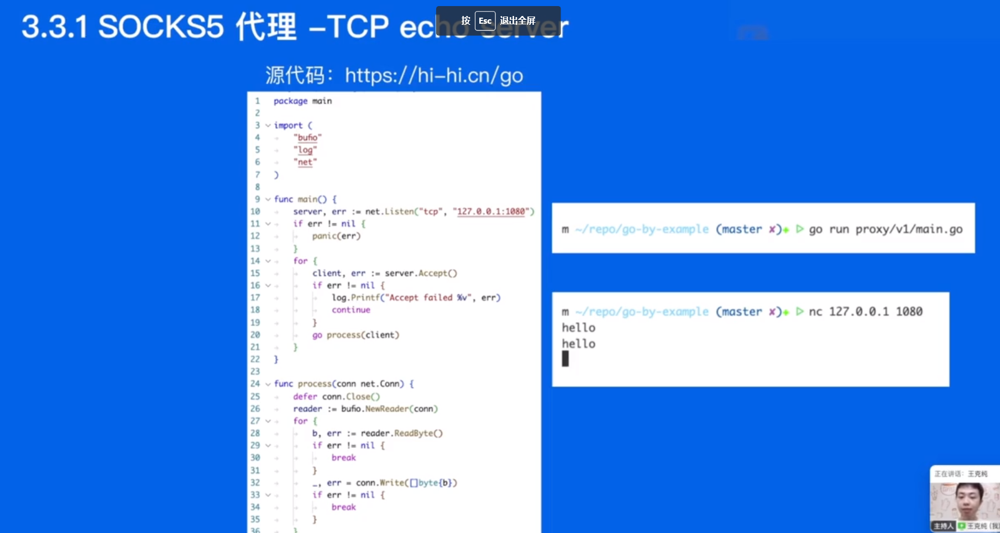

运行服务器，再另外打开一个命令框

然后通过安装nc命令来查看服务器：nc 127.0.0.1 1080     然后输入文本就会返回一样的文本

##### nc命令安装

在Windows上，nc（netcat）命令是一个常用的网络工具，可以用于发送和接收数据，进行端口扫描等。以下是在Windows上安装和使用nc命令的步骤：

1. 下载nc工具：
   - 首先，访问 https://eternallybored.org/misc/netcat/ 下载Windows版本的nc。
   - 选择合适的版本（32位或64位），然后下载对应的压缩文件。
2. 解压缩文件：
   - 将下载的压缩文件解压到一个你方便访问的目录下（比如C:\nc）。
3. 设置环境变量（可选）：
   - 可以将nc工具路径添加到系统的环境变量中，这样你就可以在任意位置直接使用nc命令。
   - 可以按下Win + X组合按键，选择“系统”（System），然后点击“高级系统设置”（Advanced system settings）。
   - 在弹出的窗口中点击“环境变量”（Environment Variables）按钮。
   - 在“系统变量”（System variables）部分找到名为“Path”的变量，双击它并在末尾添加nc工具的路径（比如C:\nc）。
   - 确认所有窗口，保存变更。
4. 打开命令提示符：
   - 点击开始菜单，搜索并打开“命令提示符”（Command Prompt）或者“PowerShell”。
5. 验证安装：
   - 在命令提示符中输入 `nc -h` 或 `ncat -h`并按下回车键，如果成功安装，你应该能看到nc的帮助与用法信息。

现在，你已经成功安装并可以使用nc命令进行网络操作了。你可以在命令提示符中输入 `nc -h` 以查看nc的帮助信息，并了解如何在客户端和服务器之间建立连接，发送数据等操作。

#### SOCKS5 代理 - auth （实现TCP协议的认证阶段）

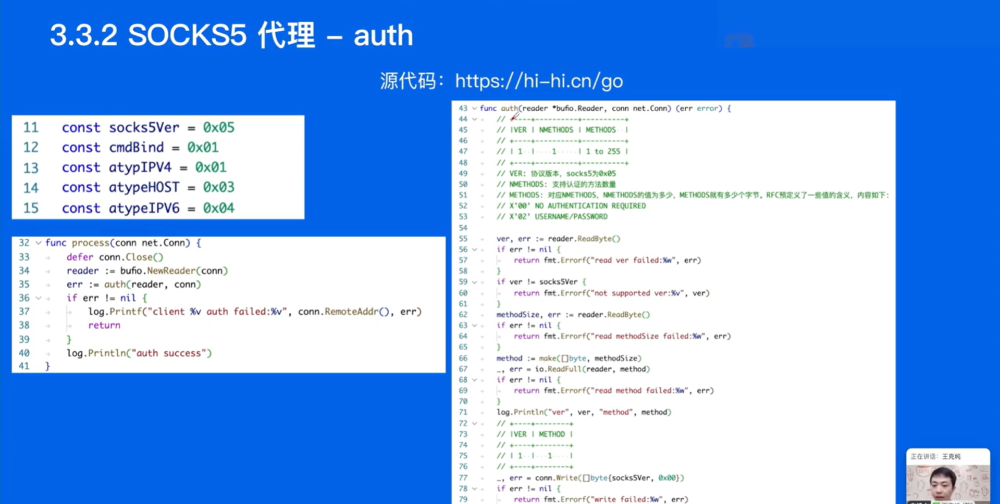

通过编写auth函数实现认证操作：

```go
package main

import (
	"bufio"
	"fmt"
	"io"
	"log"
	"net"
)

const socks5Ver = 0x05 //定义了 Socks5 协议的版本号为 0x05
const cmdBind = 0x01  //定义了 Socks5 中的绑定命令标识为 0x01
const atypeIPV4 = 0x01//
const atypeHOST = 0x03
const atypeIPV6 = 0x04//三个分别定义了 Socks5 中的地址类型常量。

func main() {
	server, err := net.Listen("tcp", "127.0.0.1:1080")
	if err != nil {
		panic(err)
	}
	for {
		client, err := server.Accept()  
		if err != nil {
			log.Printf("Accept failed %v", err)
			continue
		}
		go process(client)
	}
}
//代码有改动
func process(conn net.Conn) {  //`process` 函数是处理客户端连接的逻辑，传入客户端数据
	defer conn.Close()
	reader := bufio.NewReader(conn)//process 函数使用一个 bufio.Reader 对象创建读取器，读取客户端数据然后调用 auth 函数进行客户端的认证操作。
	err := auth(reader, conn)//
	if err != nil {
		log.Printf("client %v auth failed:%v", conn.RemoteAddr(), err)
		return
	}
	log.Println("auth success") //认证成功
}
//***先看这里
func auth(reader *bufio.Reader, conn net.Conn) (err error) { //auth 函数进行客户端的认证操作。
	// +----+----------+----------+
	// |VER | NMETHODS | METHODS  |
	// +----+----------+----------+
	// | 1  |    1     | 1 to 255 | //字节数
	// +----+----------+----------+
	// VER: 协议版本，socks5为0x05
	// NMETHODS: 支持认证的方法数量
	// METHODS: 对应NMETHODS，NMETHODS的值为多少，METHODS就有多少个字节。RFC预定义了一些值的含义，内容如下:
	// X’00’ NO AUTHENTICATION REQUIRED 表示"无需认证"
	// X’02’ USERNAME/PASSWORD  用户名/密码
    
    //都是从reader.ReadByte()中读取数据
      //从读取器中读取协议版本号 ver，并与预定义的 Socks5 协议版本号进行比较
	ver, err := reader.ReadByte()  //监听读取到的字节，看是否符合版本号
	if err != nil {//传输出现错误
		return fmt.Errorf("read ver failed:%w", err)
	}
	if ver != socks5Ver {   //版本号不同
		return fmt.Errorf("not supported ver:%v", ver)
	}
    
	methodSize, err := reader.ReadByte() //从读取器中读取支持的认证方法的数量 methodSize，然后读取相应数量的字节，表示认证方法。根据 Socks5 协议规范，其中的每个字节都代表一个认证方法。
	if err != nil {//出现错误
		return fmt.Errorf("read methodSize failed:%w", err)
	}
	method := make([]byte, methodSize) //创建一个methodSize长度的字节数组
	_, err = io.ReadFull(reader, method)  //`method` 是一个长度为 `methodSize` 的字节切片。通过调用 `io.ReadFull(reader, method)`，我们从 `reader` 中读取 `methodSize` 个字节，将其填充到 `method` 切片中。
	if err != nil { //出现错误
		return fmt.Errorf("read method failed:%w", err)
	}
	log.Println("ver", ver, "method", method) //打印版本号和表示客户端支持的认证方法字节的集合
	// +----+--------+
	// |VER | METHOD |
	// +----+--------+
	// | 1  |   1    |
	// +----+--------+
	_, err = conn.Write([]byte{socks5Ver, 0x00}) //将获取到的数据发送回客户端
	if err != nil {
		return fmt.Errorf("write failed:%w", err)
	}
	return nil
}
```

**完整代码逻辑**

这段代码是一个简化的 Socks5 代理服务器示例，它监听本地地址的 1080 端口，接受客户端连接，并处理客户端的认证过程。

- `socks5Ver` 定义了 Socks5 协议的版本号为 `0x05`。
- `cmdBind` 定义了 Socks5 中的绑定命令标识为 `0x01`。
- `atypeIPV4`、`atypeHOST` 和 `atypeIPV6` 分别定义了 Socks5 中的地址类型常量。

在 `main` 函数中，首先使用 `net.Listen` 方法监听本地地址的 1080 端口，然后通过一个无限循环 `for` 来接受客户端的连接。对于每个客户端连接，使用 `server.Accept()` 方法接受客户端连接请求，并在一个单独的 `goroutine` 中调用 `process` 函数进行处理。

`process` 函数使用一个 `bufio.Reader` 对象创建读取器，然后调用 `auth` 函数进行客户端的认证操作。

`auth` 函数实现了 Socks5 的认证过程。首先，从读取器中读取协议版本号 `ver`，并与预定义的 Socks5 协议版本号进行比较。如果不匹配，则返回错误。

接下来，从读取器中读取支持的认证方法的数量 `methodSize`，然后读取相应数量的字节，表示认证方法。根据 Socks5 协议规范，其中的每个字节都代表一个认证方法。

在这个示例中，我们只实现了 “无需认证” 这一方法，因此我们期望方法字节中只包含一个字节 `0x00`。如果方法字节数量与预期不符，则返回错误。

然后，回复客户端认证过程的响应，发送包含协议版本号和认证方法字节为 `0x05` 和 `0x00` 的数据。

如果在认证过程中发生任何错误，将返回相应的错误；否则，返回 `nil` 表示认证成功。

本段代码主要实现了 Socks5 代理服务器的初始化和认证过程。后续的代码还需要添加连接请求处理、地址解析、远程服务器连接和数据转发等逻辑。


**函数 `auth` 的实现如下:**

1. 首先，它读取一个字节来获取协议版本（`ver`）。
2. 然后，它读取一个字节来获取支持的认证方法数量（`methodSize`）。
3. 接下来，它读取 `methodSize` 个字节来获取具体的认证方法。
4. 最后，它向客户端发送一个认证成功的响应，包含协议版本和认证方法。

如果在任何步骤中发生错误，`auth` 函数会返回相应的错误信息。

请注意，这段代码只实现了Socks5协议中的认证部分，并没有处理后续数据传输的逻辑。

`METHODS` 是一个切片，用于存储从客户端发送过来的认证方法字节，表示客户端支持的认证方法字节的集合。

**运行服务器**go run

**另开cmd查看服务器：curl --socks5 127.0.0.1:1080 -v http://www.qq.com**

**查看服务器出现的问题**：

**问题：Invoke-WebRequest : 找不到接受实际参数“127.0.0.1:1080”的位置形式参数。**

**解决方式：**有一个名为 Invoke-WebRequest 的 CmdLet，其别名为 curl。因此，当您执行此命令时，它会尝试使用 Invoke-WebRequest，而不是使用 curl。删除此别名允许您按预期执行 curl。

**执行命令**：**Remove-item alias:curl** 之后再执行命令

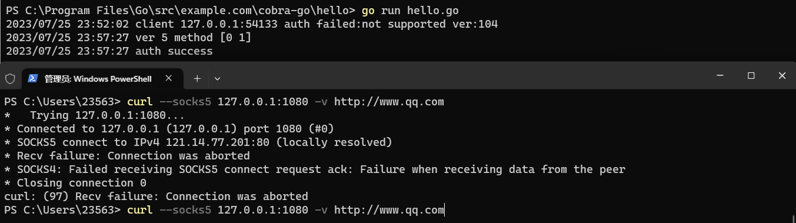

上面是服务器，下面是客户端


#### SOCKS5 代理 -请求阶段

看connect函数

```go
package main

import (
	"bufio"
	"encoding/binary"
	"errors"
	"fmt"
	"io"
	"log"
	"net"
)

const socks5Ver = 0x05
const cmdBind = 0x01
const atypeIPV4 = 0x01
const atypeHOST = 0x03
const atypeIPV6 = 0x04

func main() {
	server, err := net.Listen("tcp", "127.0.0.1:1080")
	if err != nil {
		panic(err)
	}
	for {
		client, err := server.Accept()
		if err != nil {
			log.Printf("Accept failed %v", err)
			continue
		}
		go process(client)
	}
}

func process(conn net.Conn) {
	defer conn.Close()
	reader := bufio.NewReader(conn)
	err := auth(reader, conn)
	if err != nil {
		log.Printf("client %v auth failed:%v", conn.RemoteAddr(), err)
		return
	}
	err = connect(reader, conn)
	if err != nil {
		log.Printf("client %v auth failed:%v", conn.RemoteAddr(), err)
		return
	}
}

func auth(reader *bufio.Reader, conn net.Conn) (err error) {
	// +----+----------+----------+
	// |VER | NMETHODS | METHODS  |
	// +----+----------+----------+
	// | 1  |    1     | 1 to 255 |
	// +----+----------+----------+
	// VER: 协议版本，socks5为0x05
	// NMETHODS: 支持认证的方法数量
	// METHODS: 对应NMETHODS，NMETHODS的值为多少，METHODS就有多少个字节。RFC预定义了一些值的含义，内容如下:
	// X’00’ NO AUTHENTICATION REQUIRED
	// X’02’ USERNAME/PASSWORD

	ver, err := reader.ReadByte()
	if err != nil {
		return fmt.Errorf("read ver failed:%w", err)
	}
	if ver != socks5Ver {
		return fmt.Errorf("not supported ver:%v", ver)
	}
	methodSize, err := reader.ReadByte()
	if err != nil {
		return fmt.Errorf("read methodSize failed:%w", err)
	}
	method := make([]byte, methodSize)
	_, err = io.ReadFull(reader, method)
	if err != nil {
		return fmt.Errorf("read method failed:%w", err)
	}

	// +----+--------+
	// |VER | METHOD |
	// +----+--------+
	// | 1  |   1    |
	// +----+--------+
	_, err = conn.Write([]byte{socks5Ver, 0x00})
	if err != nil {
		return fmt.Errorf("write failed:%w", err)
	}
	return nil
}


//**看这里
func connect(reader *bufio.Reader, conn net.Conn) (err error) {
    
	// +----+-----+-------+------+----------+----------+
	// |VER | CMD |  RSV  | ATYP | DST.ADDR | DST.PORT |
	// +----+-----+-------+------+----------+----------+
	// | 1  |  1  | X'00' |  1   | Variable |    2     |
	// +----+-----+-------+------+----------+----------+
	// VER 版本号，socks5的值为0x05
	// CMD 0x01表示CONNECT请求
	// RSV 保留字段，值为0x00
	// ATYP 目标地址类型，DST.ADDR的数据对应这个字段的类型。
	//   0x01表示IPv4地址，DST.ADDR为4个字节
	//   0x03表示域名，DST.ADDR是一个可变长度的域名
	// DST.ADDR 一个可变长度的值
	// DST.PORT 目标端口，固定2个字节
//下文中的这串代码的数值含义就在上面  _, err = conn.Write([]byte{0x05, 0x00, 0x00, 0x01, 0, 0, 0, 0, 0, 0})
	buf := make([]byte, 4) 
	_, err = io.ReadFull(reader, buf) //从reader中读取四个字节，分别对应长度一致的版本号 ver、命令 cmd、保留字段 RSV 和目标地址类型 atyp的数据保存在buf
	if err != nil { 
		return fmt.Errorf("read header failed:%w", err)
	}
    
	ver, cmd, atyp := buf[0], buf[1], buf[3]  //取出版本号 ver、命令 cmd、目标地址类型 atyp的数据
	if ver != socks5Ver {  //检查版本号 ver 是否与预期的 Socks5 版本号匹配，如果不匹配则返回错误。
		return fmt.Errorf("not supported ver:%v", ver)
	}
	if cmd != cmdBind {  //检查命令 cmd 是否为 CONNECT 请求 (0x01)，如果不是则返回错误。
		return fmt.Errorf("not supported cmd:%v", cmd)
	}
	addr := "" //地址
	switch atyp {  //switch分支，确定目标地址类型 
	case atypeIPV4:  //如果 atyp 为 atypeIPV4 (0x01)，从 reader 中读取额外的 4 个字节，组合成 IPv4 地址形式。
		_, err = io.ReadFull(reader, buf)
		if err != nil {
			return fmt.Errorf("read atyp failed:%w", err)
		}
		addr = fmt.Sprintf("%d.%d.%d.%d", buf[0], buf[1], buf[2], buf[3])
	case atypeHOST: //如果 atyp 为 atypeHOST (0x03)，从 reader 中读取一个字节指示域名长度，再从 reader 中读取相应长度的字节作为域名。
		hostSize, err := reader.ReadByte()
		if err != nil {
			return fmt.Errorf("read hostSize failed:%w", err)
		}
		host := make([]byte, hostSize)
		_, err = io.ReadFull(reader, host)
		if err != nil {
			return fmt.Errorf("read host failed:%w", err)
		}
		addr = string(host)
	case atypeIPV6://如果 atyp 为 atypeIPV6 (0x04)，返回错误，暂时不支持 IPv6 地址。
		return errors.New("IPv6: no supported yet")
	default: //如果 atyp 值无效，返回错误。
		return errors.New("invalid atyp") 
	}
	_, err = io.ReadFull(reader, buf[:2]) //通过 io.ReadFull(reader, buf[:2]) 从 reader 中读取 2 个字节，表示目标端口号。将这两个字节解析为一个大端字节序的无符号整数 port。
	if err != nil {
		return fmt.Errorf("read port failed:%w", err)
	}
	port := binary.BigEndian.Uint16(buf[:2])//函数 binary.BigEndian.Uint16 是 Go 语言标准库 encoding/binary 包中的一个函数，用于将大端字节序的 2 个字节转换为对应的 uint16 整数。
    //BigEndian 是 Go 语言标准库 encoding/binary 包中的 ByteOrder 接口的一个实现。它用于处理大端字节序（Big Endian）的编解码操作。（在计算机中，字节序（Byte Order）指的是多字节数据在内存中存储的顺序。大端字节序是一种常见的字节序，其中高位字节存储在内存的低地址，低位字节存储在内存的高地址。这与人类习惯的阅读顺序一致，因此被称为"大端"。）

	log.Println("dial", addr, port)   //这行代码使用 log.Println 函数打印日志信息，其中包括连接的目标地址和端口号。就是在服务器端显示的东西

	// +----+-----+-------+------+----------+----------+
	// |VER | REP |  RSV  | ATYP | BND.ADDR | BND.PORT |
	// +----+-----+-------+------+----------+----------+
	// | 1  |  1  | X'00' |  1   | Variable |    2     |
	// +----+-----+-------+------+----------+----------+
	// VER socks版本，这里为0x05
	// REP Relay field,内容取值如下 X’00’ succeeded
	// RSV 保留字段
	// ATYPE 地址类型
	// BND.ADDR 服务绑定的地址 
	// BND.PORT 服务绑定的端口DST.PORT
    //   0x01表示IPv4地址，DST.ADDR为4个字节
    
	_, err = conn.Write([]byte{0x05, 0x00, 0x00, 0x01, 0, 0, 0, 0, 0, 0})  //通过 conn.Write() 向客户端发送一个固定的响应，表示连接建立成功。
	if err != nil {
		return fmt.Errorf("write failed: %w", err)
	}
	return nil
}
```

这段代码实现了处理客户端连接请求的逻辑，主要用于解析客户端的 CONNECT 请求。

在 Socks5 协议中，CONNECT 请求用于建立与目标服务器的连接。接收到 CONNECT 请求后，服务器需要解析请求的数据，包括目标地址和目标端口，然后进行相应的连接和响应。

以下是代码中的具体处理过程：

1. 通过 `io.ReadFull(reader, buf)` 从 `reader` 中读取 4 个字节的数据，存储在 `buf` 中。这些数据包含了版本号 `ver`、命令 `cmd`、保留字段 `RSV` 和目标地址类型 `atyp`。

2. 检查版本号 `ver` 是否与预期的 Socks5 版本号匹配，如果不匹配则返回错误。

3. 检查命令 `cmd` 是否为 CONNECT 请求 (0x01)，如果不是则返回错误。

4. 根据目标地址类型`atyp`的值，解析目标地址`addr`和目标端口`port`:
   - 如果 `atyp` 为 `atypeIPV4` (0x01)，从 `reader` 中读取额外的 4 个字节，组合成 IPv4 地址形式。
   - 如果 `atyp` 为 `atypeHOST` (0x03)，从 `reader` 中读取一个字节指示域名长度，再从 `reader` 中读取相应长度的字节作为域名。
   - 如果 `atyp` 为 `atypeIPV6` (0x04)，返回错误，暂时不支持 IPv6 地址。
   - 如果 `atyp` 值无效，返回错误。

5. 通过 `io.ReadFull(reader, buf[:2])` 从 `reader` 中读取 2 个字节，表示目标端口号。将这两个字节解析为一个大端字节序的无符号整数 `port`。

6. 输出日志，打印连接的目标地址和端口。

7. 通过`conn.Write(）`向客户端发送一个固定的响应，表示连接建立成功。

8. 响应的格式如下：
   - VER: Socks 版本号，这里为 0x05。
   - REP: Relay field，内容为 X’00’，表示连接成功。
   - RSV: 保留字段。
   - ATYP: 地址类型。
   - BND.ADDR: 绑定的地址。
   - BND.PORT: 绑定的端口，与 DST.PORT 相同。

9. 如果在任何步骤中发生错误，将返回相应的错误。

   测试：和上一个阶段一样的方式，还是失败，但是能够正确打印出链接和端口：

   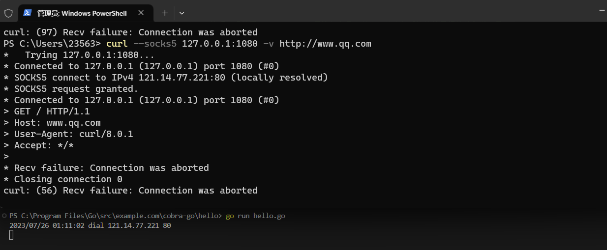

User Agent（用户代理）是一个由客户端应用程序或设备发送到服务器的标识字符串，用于描述该应用程序或设备的相关信息。


##### Byte Order

函数 `binary.BigEndian.Uint16` 是 Go 语言标准库` encoding/binary` 包中的一个函数，用于将大端字节序的 2 个字节转换为对应的 `uint16 `整数。
    `BigEndian `是 Go 语言标准库` encoding/binary `包中的 `ByteOrder` 接口的一个实现。它用于处理大端字节序（`Big Endian`）的编解码操作。（在计算机中，字节序（`Byte Order`）指的是多字节数据在内存中存储的顺序。大端字节序是一种常见的字节序，其中高位字节存储在内存的低地址，低位字节存储在内存的高地址。这与人类习惯的阅读顺序一致，因此被称为"大端"。）

#####  **log.Println（包含在log包） 和 fmt.Println（包含在fmt包） 的区别**

`log.Println` 和 `fmt.Println` 在功能上非常相似，它们都用于将数据打印到标准输出并添加换行符。然而，它们之间存在一些重要的区别：

1. 日志级别：`log.Println` 用于输出日志信息，而 `fmt.Println` 主要用于一般的输出和调试目的。因此，`log.Println` 通常用于记录程序运行时的重要事件或错误信息，可以与日志记录系统集成，进行更灵活的日志处理和管理。
2. 日志格式：`log.Println` 提供了更多灵活的日志格式定制选项。它支持设置日志的前缀、输出时间戳等。相比之下，`fmt.Println` 输出的内容较为简单，仅将参数以默认格式打印出来。
3. 输出位置：`log.Println` 默认将日志输出到标准错误输出 (`os.Stderr`)，而 `fmt.Println` 将数据输出到标准输出 (`os.Stdout`)。这样设计的目的是区分一般输出（标准输出）和日志输出（标准错误输出）。

总的来说，`log.Println` 更加适合用于输出日志信息、错误处理和事件记录等操作，而 `fmt.Println` 则更适用于一般的调试和输出需求。

#### SOCKS5 代理 -relay阶段

最后我们需要和ip真正建立连接，双向转换数值，代理就算完成

在connect函数中的port := binary.BigEndian.Uint16(buf[:2])

到log.Println("dial", addr, port)的段之间新增代码：

```go
dest, err := net.Dial("tcp", fmt.Sprintf("%v:%v", addr, port)) //fmt.Sprintf("%v:%v", addr, port) 生成了一个形如 “address:port” 的字符串，作为 Dial 函数的目标地址。Dial 函数会尝试与指定的目标地址建立 TCP 连接
//如果连接成功，将返回一个 net.Conn 对象 dest，我们可以使用该对象进行数据的输入和输出操作。
	if err != nil {
		return fmt.Errorf("dial dst failed:%w", err)
	}

	defer dest.Close()
```

代码片段中的代码段使用 `net.Dial` 函数与一个远程的 TCP 服务器建立连接。它使用提供的 `addr`（地址）和 `port`（端口）参数来指定要连接的远程服务器的主机名和端口号。

根据提供的 `addr` 和 `port`，`fmt.Sprintf("%v:%v", addr, port)` 生成了一个形如 “address:port” 的字符串，作为 `Dial` 函数的目标地址。`Dial` 函数会尝试与指定的目标地址建立 TCP 连接。

如果连接成功，将返回一个 `net.Conn` 对象 `dest`，我们可以使用该对象进行数据的输入和输出操作。如果连接过程中发生错误，将返回一个非空的 `error` 对象。

在代码的最后，通过使用 `defer dest.Close()` 语句，可以确保在函数执行完成后关闭与目标服务器的连接，以避免资源泄漏。


在return nil最后前增代码：

```go
	ctx, cancel := context.WithCancel(context.Background())
	defer cancel()

	go func() {
		_, _ = io.Copy(dest, reader) //服务器copy给本地
		cancel()
	}()
	go func() {
		_, _ = io.Copy(conn, dest) //本地copy给服务器
		cancel()
	}()

	<-ctx.Done()
```

#### 最终代码

```go
package main

import (
	"bufio"
	"context"
	"encoding/binary"
	"errors"
	"fmt"
	"io"
	"log"
	"net"
)

const socks5Ver = 0x05
const cmdBind = 0x01
const atypeIPV4 = 0x01
const atypeHOST = 0x03
const atypeIPV6 = 0x04

func main() {
	server, err := net.Listen("tcp", "127.0.0.1:1080")
	if err != nil {
		panic(err)
	}
	for {
		client, err := server.Accept()
		if err != nil {
			log.Printf("Accept failed %v", err)
			continue
		}
		go process(client)
	}
}

func process(conn net.Conn) {
	defer conn.Close()
	reader := bufio.NewReader(conn)
	err := auth(reader, conn)
	if err != nil {
		log.Printf("client %v auth failed:%v", conn.RemoteAddr(), err)
		return
	}
	err = connect(reader, conn)
	if err != nil {
		log.Printf("client %v auth failed:%v", conn.RemoteAddr(), err)
		return
	}
}

func auth(reader *bufio.Reader, conn net.Conn) (err error) {
	// +----+----------+----------+
	// |VER | NMETHODS | METHODS  |
	// +----+----------+----------+
	// | 1  |    1     | 1 to 255 |
	// +----+----------+----------+
	// VER: 协议版本，socks5为0x05
	// NMETHODS: 支持认证的方法数量
	// METHODS: 对应NMETHODS，NMETHODS的值为多少，METHODS就有多少个字节。RFC预定义了一些值的含义，内容如下:
	// X’00’ NO AUTHENTICATION REQUIRED
	// X’02’ USERNAME/PASSWORD

	ver, err := reader.ReadByte()
	if err != nil {
		return fmt.Errorf("read ver failed:%w", err)
	}
	if ver != socks5Ver {
		return fmt.Errorf("not supported ver:%v", ver)
	}
	methodSize, err := reader.ReadByte()
	if err != nil {
		return fmt.Errorf("read methodSize failed:%w", err)
	}
	method := make([]byte, methodSize)
	_, err = io.ReadFull(reader, method)
	if err != nil {
		return fmt.Errorf("read method failed:%w", err)
	}

	// +----+--------+
	// |VER | METHOD |
	// +----+--------+
	// | 1  |   1    |
	// +----+--------+
	_, err = conn.Write([]byte{socks5Ver, 0x00})
	if err != nil {
		return fmt.Errorf("write failed:%w", err)
	}
	return nil
}

func connect(reader *bufio.Reader, conn net.Conn) (err error) {
	// +----+-----+-------+------+----------+----------+
	// |VER | CMD |  RSV  | ATYP | DST.ADDR | DST.PORT |
	// +----+-----+-------+------+----------+----------+
	// | 1  |  1  | X'00' |  1   | Variable |    2     |
	// +----+-----+-------+------+----------+----------+
	// VER 版本号，socks5的值为0x05
	// CMD 0x01表示CONNECT请求
	// RSV 保留字段，值为0x00
	// ATYP 目标地址类型，DST.ADDR的数据对应这个字段的类型。
	//   0x01表示IPv4地址，DST.ADDR为4个字节
	//   0x03表示域名，DST.ADDR是一个可变长度的域名
	// DST.ADDR 一个可变长度的值
	// DST.PORT 目标端口，固定2个字节

	buf := make([]byte, 4)
	_, err = io.ReadFull(reader, buf)
	if err != nil {
		return fmt.Errorf("read header failed:%w", err)
	}
	ver, cmd, atyp := buf[0], buf[1], buf[3]
	if ver != socks5Ver {
		return fmt.Errorf("not supported ver:%v", ver)
	}
	if cmd != cmdBind {
		return fmt.Errorf("not supported cmd:%v", cmd)
	}
	addr := ""
	switch atyp {
	case atypeIPV4:
		_, err = io.ReadFull(reader, buf)
		if err != nil {
			return fmt.Errorf("read atyp failed:%w", err)
		}
		addr = fmt.Sprintf("%d.%d.%d.%d", buf[0], buf[1], buf[2], buf[3])
	case atypeHOST:
		hostSize, err := reader.ReadByte()
		if err != nil {
			return fmt.Errorf("read hostSize failed:%w", err)
		}
		host := make([]byte, hostSize)
		_, err = io.ReadFull(reader, host)
		if err != nil {
			return fmt.Errorf("read host failed:%w", err)
		}
		addr = string(host)
	case atypeIPV6:
		return errors.New("IPv6: no supported yet")
	default:
		return errors.New("invalid atyp")
	}
	_, err = io.ReadFull(reader, buf[:2])
	if err != nil {
		return fmt.Errorf("read port failed:%w", err)
	}
	port := binary.BigEndian.Uint16(buf[:2])

	dest, err := net.Dial("tcp", fmt.Sprintf("%v:%v", addr, port))
	if err != nil {
		return fmt.Errorf("dial dst failed:%w", err)
	}
	defer dest.Close()
	log.Println("dial", addr, port)

	// +----+-----+-------+------+----------+----------+
	// |VER | REP |  RSV  | ATYP | BND.ADDR | BND.PORT |
	// +----+-----+-------+------+----------+----------+
	// | 1  |  1  | X'00' |  1   | Variable |    2     |
	// +----+-----+-------+------+----------+----------+
	// VER socks版本，这里为0x05
	// REP Relay field,内容取值如下 X’00’ succeeded
	// RSV 保留字段
	// ATYPE 地址类型
	// BND.ADDR 服务绑定的地址
	// BND.PORT 服务绑定的端口DST.PORT
	_, err = conn.Write([]byte{0x05, 0x00, 0x00, 0x01, 0, 0, 0, 0, 0, 0})
	if err != nil {
		return fmt.Errorf("write failed: %w", err)
	}
	ctx, cancel := context.WithCancel(context.Background())
	defer cancel()

	go func() {
		_, _ = io.Copy(dest, reader)//将服务器拷贝给客户端
		cancel()
	}()
	go func() {
		_, _ = io.Copy(conn, dest)//客户端拷贝回服务器
		cancel()
	}()

	<-ctx.Done()
	return nil
}
```

测试方法一样，成功：

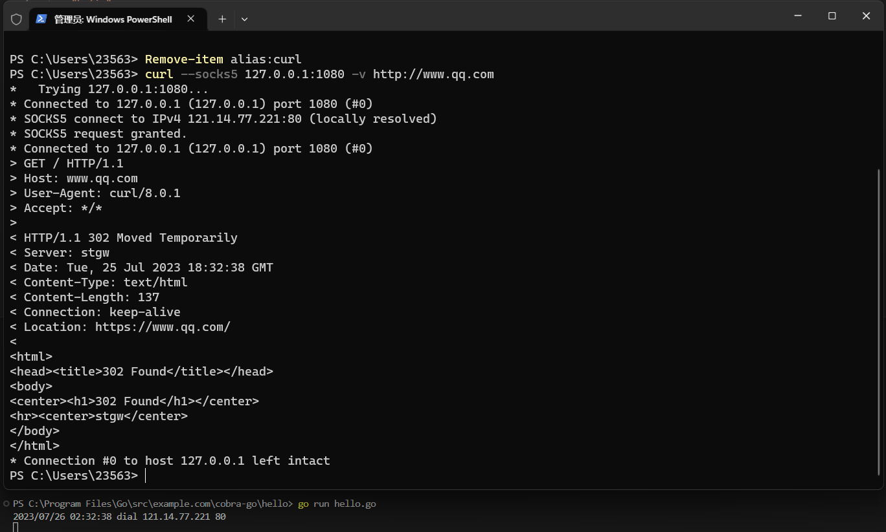


这段代码创建了一个带有取消功能的上下文(Context)，并使用 `io.Copy` 在两个 goroutine 之间进行数据的拷贝。以下是对代码的解释：

```go
ctx, cancel := context.WithCancel(context.Background())
defer cancel()
```

首先，使用 `context.Background()` 函数创建了一个默认的、无法取消的上下文作为根上下文。然后，通过 `context.WithCancel` 函数创建了一个新的上下文 `ctx`，并返回了 `cancel` 函数。最后，通过 `defer` 关键字，确保在函数返回时调用 `cancel` 函数，以释放相关资源。

```go
go func() {
    _, _ = io.Copy(dest, reader) // 将服务器拷贝给客户端
    cancel()
}()
```


接下来，启动了一个新的 goroutine，该 goroutine 使用 `io.Copy` 从 `reader` 中读取数据并将数据拷贝到 `dest` 中。一旦拷贝过程完成，就会调用 `cancel` 函数，取消上下文。

```go
go func() {
    _, _ = io.Copy(conn, dest) // 客户端拷贝回服务器
    cancel()
}()
```


类似地，又启动了另一个 goroutine，该 goroutine 使用 `io.Copy` 从 `dest` 中读取数据并将数据拷贝到 `conn` 中。拷贝过程完成后，同样调用 `cancel` 函数，取消上下文。

```go
<-ctx.Done()
```


最后，通过 `<-ctx.Done()` 代码，等待上下文被取消操作完成。当上下文取消时，`ctx.Done()` 通道会被关闭，这样 `<-ctx.Done()` 就会立即返回，程序继续向下执行。

整个代码片段的作用是在两个 goroutine 中并发进行数据拷贝操作，并在其中一个拷贝过程完成后取消另一个拷贝操作，以及等待上下文的完成。这样可以及时释放资源，并结束函数的执行。


## Go语言进阶

### 并发 VS 并行

#### **并发与并行的区别**:

​     并发：多线程程序在一个核的CPU上运行

​     并行：多线程程序在多个核的CPU上运行

​     Go**可以充分发挥多核优势** 高效运行


#### 协程Goroutine

协程：用户态，轻量级线程 栈MB级别

线程：内核态，线程跑多个协程，栈KB级别

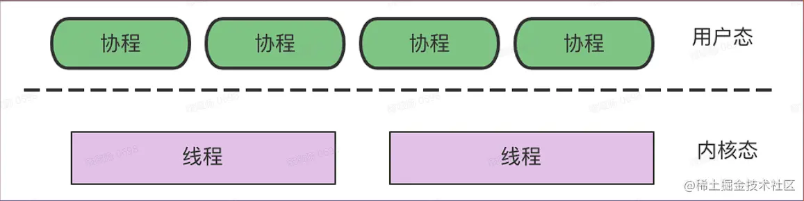


​        goroutine实现并发，创建的五个函数都是同时运行的

线程的创建、切换、停止较大地占用系统资源

协程的创建和调度由Go语言进行完成

通过开启协程快速打印hello goroutine案例：

```go
package concurrence
​
import (
    "fmt"
    "time"
)
​
func hello(i int) {
    println("hello goroutine : " + fmt.Sprint(i))
}
​
func HelloGoRoutine() {
    for i := 0; i < 5; i++ {
        // go关键字作为创建协程的关键字
        go func(j int) {
            hello(j)
        }(i)
    }
    // 保证子协程运行完前主线程不退出
    time.Sleep(time.Second)
}
```


#### CSP（communicating sequential processes）并发模型

不同于传统的多线程通过共享内存来通信，CSP讲究的是“以通信的方式来共享内存”。

Do not communicate by sharing memory; instead, share memory by communicating. “不要以共享内存的方式来通信，相反，要通过通信来共享内存。”


提倡通过通信共享内存而不是通过共享内存而实现通信

#### channel（**通道**）


创建方式：

make(chan 元素类型, [缓冲大小])

通道是用来传递数据的一个**数据结构**，可以用于两个goroutine之间，通过传递一个指定类型的值来同步运行和通讯。

操作符`<-`用于指定通道的**方向**，实现发送or接收

若未指定方向，则为**双向通道**

- 无缓冲通道 make(chan int)

- 有缓冲通道 make(chan int, 2)

- 

  通过两个Channel通道完成数字平方任务案例：

```go
func CalSquare(){
   src := make(chan int )  //协程A
   dest := make(chan int, 3 ) //创建了两个通道 `src` 和 `dest`，分别用于传递输入和输出数据。`dest`有三个缓冲
    go func(){  //
    for i := 0 ; i <10 ;i++{
    src <- i    //首先，在一个单独的 Goroutine 中，我们使用循环将 0 到 9 的整数发送到 `src` 通道
         }
     }()
    go func() {  //协程B
       defer close(dest)
       for i := range src {
       dest <- i*i  //Goroutine 中使用 `for range` 语句从 `src` 通道接收数据，并计算每个接收到的数的平方，然后将结果发送到 `dest` 通道
         }
    }()
    for i := range dest {
//复杂操作
println( i )  //Goroutine 中使用 `for range` 语句从 `src` 通道接收数据，并计算每个接收到的数的平方，然后将结果发送到 `dest` 通道
 }
}
```

A 子协程发送0~9数字
B 子协程计算输入数字的平方主协程输出最后的平方数

**注意**：

1.如果通道不带缓冲，发送方会阻塞直到**接收方从通道中接收了值**。如果通道带缓冲，发送方则会阻塞直到发送的值**被拷贝到缓冲区内**；如果缓冲区已满，则意味着需要等待直到某个接收方获取到一个值。接收方在有值可以接收之前会一直阻塞。

2.上述代码中之所以能够顺利从通道接收到数据，是因为每次遍历之前都通过关闭对应的通道后再进行的遍历接受数据。


#### 并发安全Lock(sync.Mutex)

**若采用共享内存实现通信，则会出现多个Goroutine同时操作一块内存资源的情况，这种情况会发生竞态问题（数据竞态）**


**Mutex互斥锁解决数据竞争**

**Mutex互斥锁**: 互斥锁是一种常用的控制共享资源访问的方法，它能够保证同时只有一个goroutine可以访问共享资源。Go语言中使用`sync`包的`Mutex`类型来实现互斥锁。

**互斥锁的基本原理是，在进入临界区之前，先尝试获取锁，如果锁已被其他 Goroutine 占用，则等待锁的释放。当一个 Goroutine 完成对共享资源的访问时，它会释放锁，这样其他 Goroutine 才能获取锁并访问资源**。


```go
package concurrence //定义了一个包 concurrence，并导入了需要使用的包 sync 和 time。

import (
    "sync"
    "time"
)

var (
    x    int64   //x：这是一个全局变量，用于表示一个共享的整数值。在本例中，类型为 int64
    lock sync.Mutex  //lock：这是一个 sync.Mutex 类型的互斥锁，用来保护对 x 变量的并发访问。
)

func addWithLock() {  //这个函数使用互斥锁来同步对共享资源 x 的访问。
    for i := 0; i < 2000; i++ { //在一个循环中，它对 x 的值执行增加操作，并在每次操作之前获取互斥锁，操作完成后释放互斥锁。
        lock.Lock()
        x += 1
        lock.Unlock()
    }
}
func addWithoutLock() { //这个函数没有使用互斥锁来同步对共享资源 x 的访问,在一个循环中，它对 x 的值执行增加操作，但没有做任何并发保护。
    for i := 0; i < 2000; i++ {
        x += 1
    }
}

func Add() {//这个函数用于执行实际的并发操作。
//首先，它将 x 的值设置为 0。
//然后，它使用 5 个 Goroutine 并发地执行 addWithoutLock() 函数，这会导致并发修改 x 的竞态条件。
//使用 time.Sleep() 函数等待足够的时间，以确保所有的并发操作完成。
//最后，它打印出不使用互斥锁的情况下的加法结果
    x = 0
    for i := 0; i < 5; i++ {
        go addWithoutLock()
    }
    time.Sleep(time.Second)//等待执行完毕
    println("WithoutLock:", x)//打印出不使用互斥锁的情况下的加法结果,8382
    x = 0
    for i := 0; i < 5; i++ {
        go addWithLock()
    }
    time.Sleep(time.Second)//等待执行完毕
    println("WithLock:", x) //打印出使用互斥锁的情况下的加法结果,10000
}

func ManyGoWait() {    //WaitGroup解决数据竞争
    var wg sync.WaitGroup //使用 sync.WaitGroup类型 来等待所有的 Goroutine 完成
    wg.Add(5)//然后使用 Add() 方法设置等待的 Goroutine 数量为 5
    for i := 0; i < 5; i++ {
        go func(j int) {
            defer wg.Done() //当五个wg.Done触发后，wg.Wait() 将会解除阻塞，程序继续往下执行。
            hello(j)
        }(i)
    }
    wg.Wait()  //当所有 Goroutine 都执行完毕时，主函数的 wg.Wait() 将会解除阻塞，程序继续往下执行。
}

```

#### WaitGroup解决数据竞争

Go语言中除了可以使用通道（channel）和互斥锁进行两个并发程序间的同步外，还可以使用等待组进行多个任务的同步，等待组可以保证在并发环境中完成指定数量的任务 WaitGroup 值在内部维护着一个计数，此计数的初始默认值为零。

```go
package concurrence

import (
    "fmt"
    "sync"
)

func HelloPrint(i int) {
    fmt.Println("Hello WaitGroup :", i)
}

func ManyGoWait() {
    var wg sync.WaitGroup //使用 sync.WaitGroup类型 来等待所有的 Goroutine 完成
    wg.Add(5)   //然后使用 Add() 方法设置等待的 Goroutine 数量为 5
    for i := 0; i < 5; i++ {
        go func(j int) {
            defer wg.Done()  //当五个wg.Done触发后，wg.Wait() 将会解除阻塞，程序继续往下执行。
            HelloPrint(j)
        }(i)//传入参数
    }
    wg.Wait()   //当所有 Goroutine 都执行完毕时，主函数的 wg.Wait() 将会解除阻塞，程序继续往下执行。
}

func main() {
    ManyGoWait()
}
```

## Go语言的依赖管理

**背景**

开发项目时应学会站在巨人的肩膀上，即有效利用开发组件进行或工具提升自己的研发效率

对于较简单的单体函数而言，只需要依赖原生的SDK即可完成开发

对于实际开发的工程较于复杂，应将精力投放在实现的业务逻辑之上

- 工程项目不可能基于标准库0-1编码搭建
- 管理依赖库

### GOPATH 模式

GOPATH为环境变量 包含bin、pkg、src三部分

$GOPATH：项目根路径

- src：项目源代码

- bin：项目编译的二进制文件 可执行程序

- pkg：项目编译的中间产物 加速编译 第三方依赖包

  **运行方式**：

  所有工程代码要求放在`GOPATH/src`目录下 工程本身也将作为一个依赖包，可以被其它 GOPATH/src 目录下的工程引用 在 `$GOPATH/src`下进行 .go 文件或源代码的存储，我们可以称其为` GOPATH `的模式

**缺点**：

- 没有版本控制的概念

- 所有项目都要放在`$GOPATH/src`目录下，不在当前目录则不能编译

  

### GO Vendor模式(可以随处创建项目)

解决 GOPATH模式 所有项目都在`$GOPATH/src`目录的问题 可以随处可以创建项目，不用扎堆 src 目录下

原理：本地化构建

**在每个项目下都创建一个`vendor`目录，每个项目所需要的以来都会下载到自己的`vendor`目录下。在使用包时，会先从当前项目下的`vendor`目录查找，然后再从`GOPATH`中查找，都没有找到最后才在`GOROOT`中查找（依赖寻址方式：vendor -> GOPATH)**

**缺点**：

- 放弃了依赖重用，使得冗余度上升

- 无法控制依赖的版本 更新项目可能出现依赖冲突 导致编译出错

  


### Go Module模式

1.16版本后默认开启的模式

通过`go.mod`文件管理依赖的版本

通过`go get/go mod`指令工具管理依赖包

工程不用全放在`gopath/src`目录下

定义版本规则和管理项目依赖关系


**主要改动**：

- GO MODULE模式下所有依赖的包存放在`$GOPATH/pkg/mod`目录下
- 项目中需要有`go.mod`文件，来应用`$GOPATH/pkg/mod`


### 依赖管理三要素

- 配置文件 描述依赖 `go.mod`
- 中心仓库管理依赖库 `Proxy`
- 本地工具 `go get/mod`

#### 依赖配置 `go.mod`

```go
module example.com/my/thing       // module 指令指定模块名

go 1.12                           // go 指令指定 go 版本号

require example.com/other/thing v1.0.2 
// require 指令指定依赖包的最小可用版本(见最小版本抉择)。

require example.com/new/thing/v2 v2.3.4 
// Go 语言规定 vN (N>=2) 及以上版本的依赖包，模块名后都要加上/vN后缀

require example.com/big/thing v3.2.0+incompatible
// 对于开发比较早的依赖包可能在Go module推出前已经打上 vN (N>=2) 的tag，
// 为了兼容这部分依赖包，对于没有 go.mod 文件 且 vN (N>=2) 的依赖包，在版本号后加上 +incompatible 来标识

require example.com/samll/thing v1.0.2 // indirect
// indirect后缀，表明当前依赖包不是直接依赖，而是间接依赖

exclude example.com/old/thing v1.2.3   
// exclude 指令排除某个依赖的版本。

replace example.com/bad/thing v1.4.5 => example.com/good/thing v1.4.5
// replace 指令可以用指定内容替换一个模块的特定版本，或一个模块的所有版本。
// 替换可以指定另一个模块的路径和版本，或者一个特定平台的文件路径。

retract [v1.9.0, v1.9.5]
// 指定当前项目的某个版本或一系列版本不应该被依赖。
// 往往用于版本发布过早，或者出现重大错误的情况，来撤回某个版本。
// 并且在云端保留该版本，保证已经依赖该版本的程序能够正常依赖。

```

`go.mod` 是启用了 Go moduels 的项目所必须的最重要的文件，它描述了当前项目（也就是当前模块）的元信息，每一行都以一个动词开头，目前有以下 5 个动词:

- `module`：用于定义当前项目的模块路径。
- `go`：用于设置预期的 Go 版本。
- `require`：用于设置一个特定的模块版本。
- `exclude`：用于从使用中排除一个特定的模块版本。
- `replace`：用于将一个模块版本替换为另外一个模块版本。

这里的填写格式基本为包引用路径+版本号，另外比较特殊的是 `go $version`，目前从 Go1.16 的代码里来看，还只是个标识作用，暂时未知未来是否有更大的作用。

#### go mod命令

常用的go mod命令如下：

```go
go mod download    下载依赖的module到本地cache（默认为$GOPATH/pkg/mod目录）
go mod edit        编辑go.mod文件
go mod graph       打印模块依赖图
go mod init        初始化当前文件夹, 创建go.mod文件
go mod tidy        增加缺少的module，删除无用的module
go mod vendor      将依赖复制到vendor下
go mod verify      校验依赖
go mod why         解释为什么需要依赖 
```

#### go get命令

在项目中执行go get命令可以下载依赖包，并且还可以指定下载的版本。

- 运行go get -u将会升级到最新的次要版本或者修订版本(x.y.z, z是修订版本号， y是次要版本号)
- 运行go get -u=patch将会升级到最新的修订版本
- 运行go get package[@version](https://link.juejin.cn?target=https%3A%2F%2Fgithub.com%2Fversion)将会升级到指定的版本号version 如果下载所有依赖可以使用go mod download命令。


#### 快速使用go module

- SET GOPROXY=[goproxy.cn](https://link.juejin.cn?target=https%3A%2F%2Fgoproxy.cn%2F) (这是win环境下的) export GOPROXY=[goproxy.cn](https://link.juejin.cn?target=https%3A%2F%2Fgoproxy.cn%2F) (这是mac环境下的)

- go mod init [包名] // 初始化项目(如果你是初始化项目直接 `go mod init` 就好了)

- 在目录文件下会生成go.mod和go.sum文件 go.mod 里面包含了所有的包！

- 在文件里面引入包名的时候有的编辑器会报错但是是可以正常编译的

- 下载包使用go get

- 修改包的版本号直接去go.mod文件修改然后go mod download

  ##### 原理解析

  `go get/mod` 会将 命令行参数/go.mod 中 require 命令声明的唯一标识 解析为url，发出请求，获取到依赖包，保存到 `$GOPATH/pkg/mod`目录下。

  项目获取依赖包时，会先向 Proxy 根据唯一标识请求依赖包，请求不到才会访问源存储库。

  如果模块名末尾中包含VCS限定符(`.bzr`、`.fossil`、`.git`、`.hg`、`.svn` 之一)，使用该路径限定符之前的所有内容作为存储库 URL。

  比如   `example.com/foo.git/bar`

  Go 语言会使用 git 访问 `example.com/foo.git`, 并尝试在 bar 子目录下查找模块代码。

  对于模块名末尾不包含 VCS 限定符的，会像派生的 url 发送 get 请求，并携带查询字符串 go-get=1

  比如模块  `golang.org/x/mod`

  可能发送 `https://golang.org/x/mod?go-get=1请求`

  获取到响应后，根据响应htmnl的meta标签定位到代码托管仓库，获取源代码。


#### 中心仓库实现 ---- Proxy

#### 简介

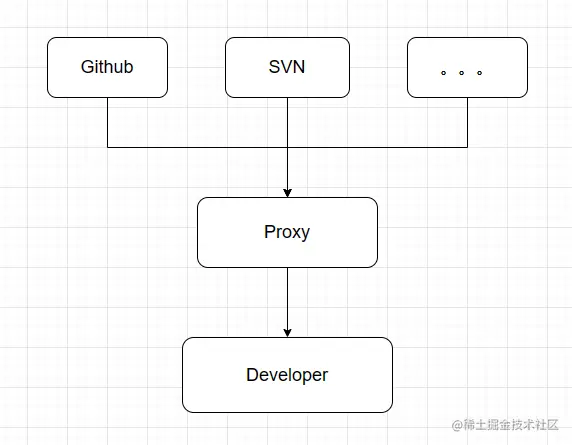

项目中依赖包都可以在代码托管平台中找到某个项目的提交与之对应。

但代码仓库拥有者可以对自己发布的源码进行添加、修改、删除操作，这就导致了直接下载代码仓库源码并构建程序的方案，具有不稳定性。

为了解决这个问题，Go引入一个中间层Proxy，对代码仓库内容进行缓存，制定了一系列规则，保证了基于Proxy构建软件的稳定性。


#### Proxy规则

- Proxy是一个HTTP服务器，可以响应对指定目录的Get请求
- 项目构建时，在缓存中找不到依赖的包，会对`GOPROXY`解析，发起Get请求。
- 成功的请求返回 200 响应码、源码。
- 未找到的请求返回404 或者 410 响应码(继续找下一个Proxy)
- 失败的请求返回 4xx 或 5xx 响应码(结束)
- Proxy必须响应以下请求
  - base/base/base/module/@v/list          获取模块版本列表
  - $base/wmodule/@v/wrversion.info      返回特定版本元数据(json格式)
  - $base/wmodule/@v/wrversion.mod    返回特定版本go.mod文件
  - $base/wmodule/@v/wrversion.zip     返回特定版本 zip 文件 (源码)
  - base/base/base/module/@latest                     返回最新版本元数据
- Proxy缓存的源码存放在 `$GOMODCACHE/cache`目录下

**示例**

```go
GOPROXY="https://goproxy.cn,direct" # 代理仓库配置
```

#### 最小版本抉择

简介

最小版本抉择机制是Go语言提出的高保真构建算法。

能够用户构建的软件与作者构建的软件尽可能的采用相同的依赖版本，并且实现简单，只需要几百行代码

##### 算法流程图

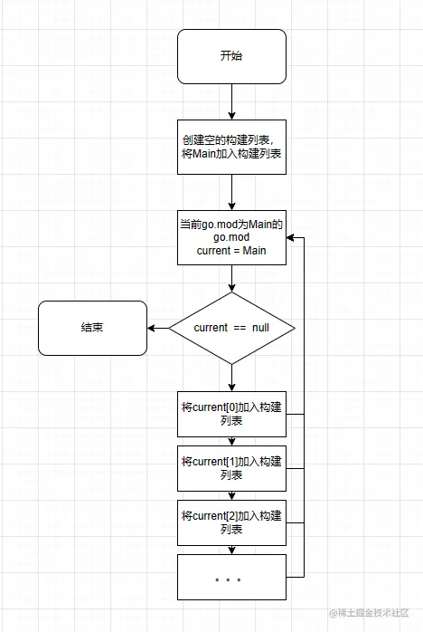

最后需要补充该操作。

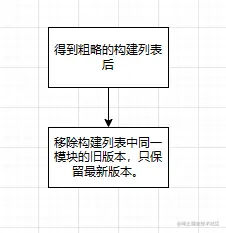

> 注：构造构建列表有两种方式，一种递归式(上述)，一种图遍历方式。 实际使用的算法是图遍历方式，因为递归式算法性能太差，以及会出现循环依赖问题。之所以在这里列出来，是为了方便理解构造构建列表的过程。

##### 示例

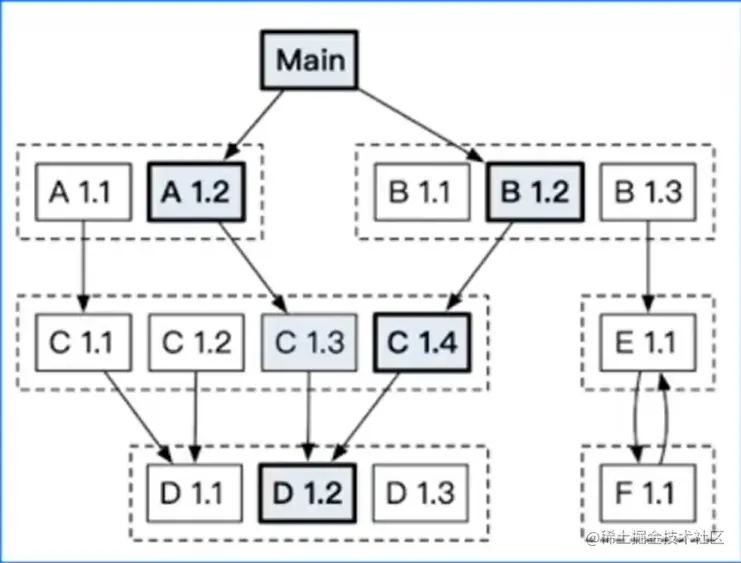

对于上述依赖图，构造构建列表时，会先将 Main 加入构建列表。然后遍历 Main 的go.mod文件，先遍历

 A 1.2，将A 1.2 依赖包加入构建列表，然后进行深度遍历，将之后的 C 1.3、D 1.2 依赖包加入构建列表。 在深度遍历 B 1.2， 将 B 1.2、C 1.4、D 1.2加入构造列表。这就得到了粗略的构造列表.

> [A 1.2，B 1.2，C 1.3，C 1.4，D 1.2]

最后移除 C 模块的旧版本 1.3，只保留最新版本 1.4。

> [A 1.2，B 1.2，C 1.4，D 1.2]

## Go语言工程实践之测试 

**背景**

> 测试的出现是为了避免项目中出现重大事故
>
> 测试是避免事故的最后一道屏障

**测试**


> 单元测试的覆盖率在一定程度上而言，决定了代码的质量

### 单元测试

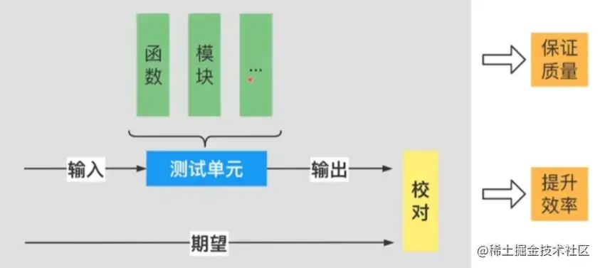

通过测试单元的输出与期望值进行校对从而验证代码的正确性，从而保证新旧代码的互不影响与程序的正常运行。

进而单元测试较于编译更易于在较短的周期内发现和定位代码中的错误使损失最小化从而提升效率。所以写单元测试是很有必要的。


Golang单元测试对文件名和方法名，参数都有很**严格的要求**。

> - 文件名必须以`xx_test.go`命名
> - 方法必须是`Test[^a-z]`开头
> - 方法参数必须`t *testing.T`
> - 初始化逻辑放到TestMain中
> - 使用`go test`执行单元测试。

#### 演示

当我们编写代码时，我们经常希望验证函数是否按照我们预期的方式运行。为了实现这一点，我们使用单元测试来测试每个函数的行为和结果。

> 通过第三方包assert演示单元测试
>
> 判断函数测试值与期望值是否一致

```go
import(
    "github.com/stretchr/testify/assert" //使用了一个流行的Go语言单元测试库 testify/assert 来进行断言
    "testing" 
)

func TestHelloTom(t *testing.T) { //TestHelloTom(t *testing.T)，它将作为一个单元测试运行
    //试函数必须以Test开头，并且接受一个 *testing.T 参数，以便在测试过程中报告测试状态和错误。
    output := HelloTom()//调用了要测试的函数 HelloTom() 并将其结果存储在变量 output 中。
    expectOutput := "Tom" //定义了一个期望的输出值 expectOutput，在这种情况下是字符串 “Tom”
    assert.Equal(t, expectOutput, output)//使用 assert.Equal(t, expectOutput, output) 进行断言，判断 output 是否等于 expectOutput。assert.Equal() 函数将比较两个值是否相等。如果不相等，它将生成一个测试失败的错误 可以用if代替
}

func HelloTom() string {
    return "Tom"
}
```

当输入命令go test运行这个测试函数时，测试框架将会执行 `HelloTom()` 函数，获取其返回值，并与预期的结果进行比较。如果两者相等，测试将通过，否则将会报错。

这样，就可以确定 `HelloTom()` 函数是否按照预期输出了 “Tom”。

#### 覆盖率

覆盖率出现的目的：

- 衡量代码是否经过了足够的测试
- 评价项目的测试水准
- 评估项目是否达到了高水准测试等级

通过go test命令测试函数的覆盖率

```go
// judgment.go
func JudgePassLine(score int16) bool {
    if score >= 60 {
        return true
    }
    else {
        return false
    }
}

// judgment_test.go
func TestJudgePassLineTrue(t *testing.T) {
    isPass := JudgeePassLine(70)
    assert.Equal(t, true, isPass)
}

func TestJudgePassLineFalse(t *testing.T) {
    isPass := JudgeePassLine(50)
    assert.Equal(t, false, isPass)
}

/*
 通过go test 命令测试覆盖率
 go test judgment_test.go judgment.go --cover
*/

```

- 一般覆盖率：`50%~60%`，较高覆盖率：`80%+`

测试分支相互独立、全面覆盖

> 对于上述案例代码而言
>
> 应出现成绩大于等于60 和小于60的测试用例

- 测试单元粒度足够小，函数单一职责

#### 依赖

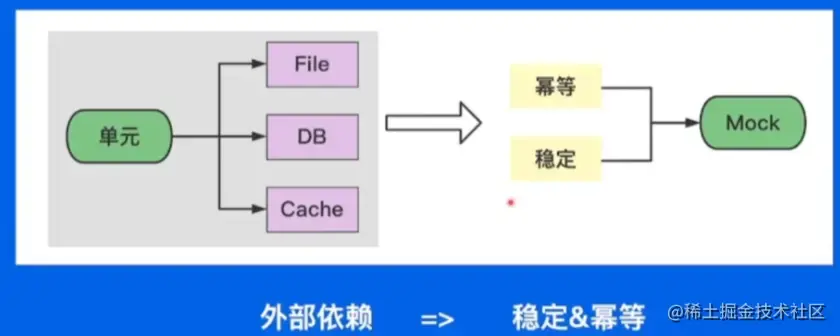

- 幂等：重复运行同一个case，结果与之前一致
- 稳定：指单元测试相互隔离，可以独立运行

#### 文件处理

> 当测试文件被修改后，可能会导致测试失败或错误率增高
>
> 从而出现了Mock函数

```go
func ReadFirstLine() string {
    open, err := os.Open("log") // 打开一个文件
    defer open.Close()
    if err != nil {
        return ""
    }
    scanner := bufio.NewScanner(open) // 对每行进行遍历
    for scanner.Scan() {
        return scanner.Text()
    }
    return ""
}

func ProcessFirstLine() string {
    line := ReadFirstLine()
    destLine := strings.ReplaceAll(line, "11", "00") // 替换11为00
    return destLine
}

func TestProcessFirstLine(t *testing.T) { // 执行单元测试
    firstLine := ProcessFirstLine()
    assert.Equal(t, "line00", firstLine)
}
```

### Mock测试

有时我们需要模拟（mock）函数或对象，以便更好地控制测试环境并模拟特定行为。在Go语言中，有一些用于模拟的库，例如 `testify/mock` 和 `gomock`。

> monkey: [github.com/bouk/monkey](https://link.juejin.cn?target=https%3A%2F%2Fgithub.com%2Fbouk%2Fmonkey) 这是一个开源的mock测试库，可以对method或者实例的方法进行mock
>
> Monkey Patch的作用域在Runtime， 运行时通过Go的unsafe包能够将内存中函数的地址替换为运行时函数的地址，将待打桩函数或方法的实现跳转。

Mock函数不仅可以为一个函数打桩 也可以为一个方法打桩

`monkey`的实现原理主要是在运行时，通过`Go`的`unsafe`包能够将内存中函数的地址替换为运行时函数的地址，最终调用的是打桩函数，从而实现`Mock`的功能。

`Mock`常用方法：`Patch`、`Unpatch`。

`Patch`方法有两个参数，`target`为替换的函数(原函数)，`replacement`为要替换成的函数

```go
func Patch(target, replacement interface{}) *PatchGuard {
    t := reflect.ValueOf(target)
    r := reflect.ValueOf(replacement)//使用 `reflect.ValueOf` 函数将 `target` 和 `replacement` 转换为 `reflect.Value` 类型的值
    patchValue(t, r)//该函数的作用是将 `replacement` 的值赋给 `target`
    return &PatchGuard{t, r} //通过创建一个 `PatchGuard` 对象，将 `target` 和 `replacement` 的反射对象作为成员变量，并返回该对象。
}
```

函数 `Patch` 的作用是用于替换原函数为打桩函数，并返回一个 `PatchGuard` 对象。下面是对函数 `Patch` 的解释：

- `target` 是需要被替换的原函数。
- `replacement` 是用于替换的打桩函数。

> 在函数内部，使用 `reflect.ValueOf` 函数将 `target` 和 `replacement` 转换为 `reflect.Value` 类型的值。`reflect.ValueOf` 函数用于获取值的反射对象，方便后续的操作。
>
> 然后，调用 `patchValue` 函数，传入 `target` 和 `replacement` 的反射对象。该函数的作用是将 `replacement` 的值赋给 `target`，从而实现替换原函数为打桩函数的效果。
>
> 最后，通过创建一个 `PatchGuard` 对象，将 `target` 和 `replacement` 的反射对象作为成员变量，并返回该对象。
>
> 总结来说，函数 `Patch` 的作用是替换原函数为打桩函数，并返回一个包含原函数和打桩函数的 `PatchGuard` 对象，以便在之后的操作中进行跟踪和管理。

将函数从打桩状态恢复为原始状态

```go
func Unpatch(target interface{}) bool {  //interface{}类型可以接收任意类型数据
    return unpatchValue(reflect.ValueOf(target))
}

```


函数 `Unpatch` 的作用是将函数从打桩状态恢复为原始状态，并返回一个布尔值用于指示操作是否成功。下面是对函数 `Unpatch` 的解释：

- `target` 是需要被恢复的函数

> 在函数内部，使用 `reflect.ValueOf` 函数将 `target` 转换为 `reflect.Value` 类型的值。`reflect.ValueOf` 函数用于获取值的反射对象，方便后续的操作。
>
> 然后，调用 `unpatchValue` 函数，传入 `target` 的反射对象。该函数的作用是将被打桩的函数恢复为原始状态，以便后续的测试代码可以再次正常调用该函数。
>
> 最后，`Unpatch` 函数返回一个布尔值，表示恢复操作是否成功。如果成功恢复函数为原始状态，则返回 `true`，否则返回 `false`。


下面通过`Mock`来模拟对文件的操作。（还没看）

```go
func TestProcessFirstLineWithMock(t *testing.T) {
    monkey.Patch(ReadFirstLine, func() string {
        return "line110"
    })
    defer monkey.Unpatch(ReadFirstLine)
    line := ProcessFirstLine()
    assert.Equal(t, "line000", line)
}
func ReadFirstLine() string {
    open, err := os.Open("log")
    defer open.Close()
    if err != nil {
        return ""
    }
    scanner := bufio.NewScanner(open)
    for scanner.Scan() {
        return scanner.Text()
    }
    return ""
}
func ProcessFirstLine() string {
    line := ReadFirstLine()
    destLine := strings.ReplaceAll(line, "11", "00")
    return destLine
}

```

该测试用例对`ProcessFirstLine`函数进行测试，这个函数调用了`ReadFirstLine`函数，涉及到文件的操作，通过`Mock`对文件的操作进行打桩，这样就避免了其他进程对文件操作的影响。

### 基准测试

> 优化代码，需要对当前代码分析
> 内置的测试框架提供了基准测试的能力

`Go`还提供了基准测试框架，可以测试一段程序的性能、CPU消耗，可以对代码做性能分析，测试方法与单元测试类似。

**基准测试规则**：

- 基准测试以Benchmark为前缀
- 需要一个*testing.B类型的参数b
- 基准测试必须要执行b.N次

下面通过一个模拟负载均衡的例子，来看下基准测试：

```go
var ServerIndex [10]int //创建十个服务器
func InitServerIndex() {
    for i := 0; i < 10; i++ {
        ServerIndex[i] = i + 100 //赋值
    }
}
func Select() int {
    return ServerIndex[rand.Intn(10)] //随机选择一个服务器运行
}
func BenchmarkSelect(b *testing.B) {
    InitServerIndex()
    b.ResetTimer() //重置时间
    for i := 0; i < b.N; i++ {
        Select()
    }
}
func BenchmarkSelectParallel(b *testing.B)  {
    InitServerIndex()
    b.ResetTimer()
    b.RunParallel(func (pb *testing.PB)  {
        for pb.Next() {
            Select()
        }
    })
}
```

> `BenchmarkSelect` 函数是一个基准测试函数，用于计算执行 `Select` 函数的性能。在函数开始时，调用 `InitServerIndex` 函数进行初始化操作。然后，通过调用 `b.ResetTimer()` 重置计时器，以便准确地测量 `Select` 函数的执行时间。接下来，使用 `for` 循环运行 N 次 `Select` 函数，其中 N 表示 `b.N` 的值， `b.N` 是基准测试函数框架提供的一个表示迭代次数的变量。
>
> `BenchmarkSelectParallel` 函数也是一个基准测试函数，与 `BenchmarkSelect` 不同的是它使用 `b.RunParallel` 函数来并行运行 `Select` 函数。在函数开始时，同样调用 `InitServerIndex` 进行初始化操作。然后，通过调用 `b.ResetTimer()` 重置计时器。接下来，使用 `b.RunParallel` 函数和一个匿名函数来并行运行 `Select` 函数。其中，匿名函数有一个 `testing.PB` 类型的参数 `pb`，`testing.PB` 是基准测试函数框架提供的一个用于并行迭代的结构体。在匿名函数中，通过 `for pb.Next()` 循环调用 `Select` 函数，直到迭代结束。
>
> 这两个基准测试函数都用来衡量函数 `Select` 的性能，并提供了不同的测试方式。`BenchmarkSelect` 是串行运行，而 `BenchmarkSelectParallel` 是并行运行。通过执行多次函数调用并测量执行时间，可以得出函数 `Select` 在各种情况下的性能指标。


## 项目实践（服务端的接口逻辑）

> 需求设计
>
> 代码开发
>
> 测试运行

项目地址：https://github.com/gin-gonic/gin#installation

### 需求描述

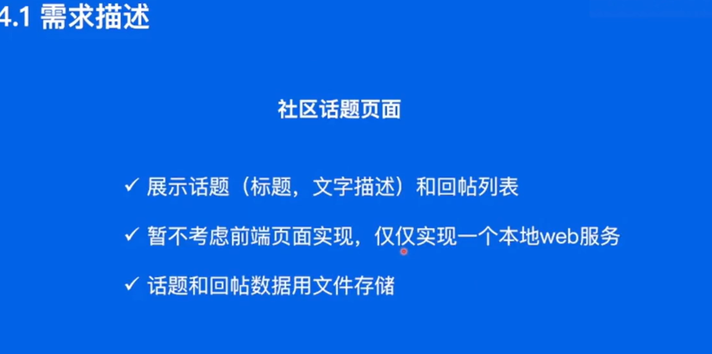

社区话题页面

> 展示话题 (标题，文字描述) 和回帖列表
>
> 暂不考虑前端页面实现，仅仅实现一个本地web服务
>
> 话题和回帖数据用文件存储

##### 需求用例

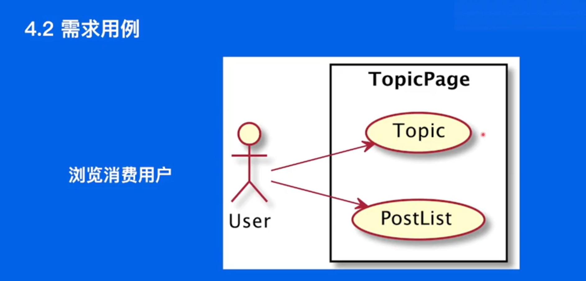

浏览消费用户

> topic 话题
>
> postlist网络列表

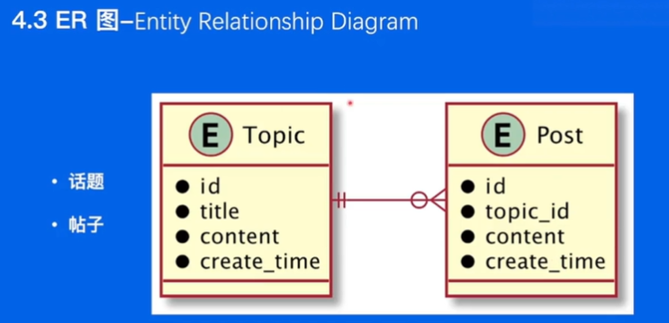

##### 分层结构

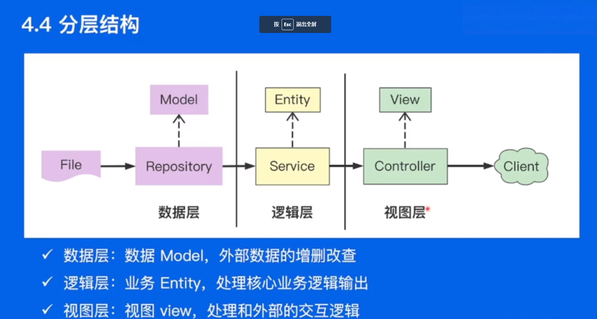

数据层: 数据 Model，外部数据的增删改查

逻辑层: 业务 Entity，处理核心业务逻辑输出

视图层: 视图 view，处理和外部的交互逻辑

##### 组件工具

Gin 高性能 go web 框架：[介绍 | Gin Web Framework (gin-gonic.com)](https://gin-gonic.com/zh-cn/docs/introduction/)

Gin文件地址：https://github.com/gin-gonic/gin#installation

在md文档中有用法介绍，可以将该项目copy下来学习

Go Mod

- go mod init

  go get gopkg.in/gin-gonic/gin.v1@1.3.0

### Repository(数据层)

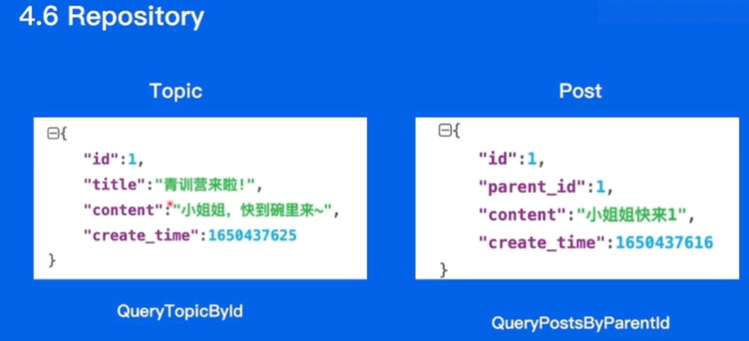

索引

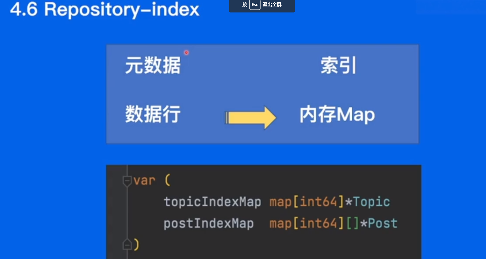

```go
var (
topicIndexMap map[int64]*Topic //
postIndexMap map[int64][]*Post//定义了两个索引
)
```

> `topicIndexMap`是一个`map[int64]*Topic`类型的变量，用于存储主题（Topic）的索引。它是一个以`int64`类型的数字作为key，对应的value是`*Topic`类型的指针。
>
> `postIndexMap`是一个`map[int64][]*Post`类型的变量，用于存储帖子（Post）的索引。它是一个以`int64`类型的数字作为key，对应的value是`[]*Post`类型的切片，即一个帖子列表。

##### 实现初始化话题数据索引功能

示例

```go
func initTopicIndexMap(filePath string)error{  //init初始化，传入topic的目录地址
   //初始化话题索引
open, err := os.Open(filePath + "topic") //打开存放topic信息的文件
if err != nil{  
     return err
}
scanner := bufio.NewScanner(open) //scanner的意思是扫描仪，将读取到的数据传给scanner
topicTmpMap := make(map[int64]*Topic) //创建一个key为int64类型,value为*Topic类型的MAP容器
    // 循环扫描每一行数据
    for scanner.Scan() {  //Scan()是bufio.Scanner类型的方法，用于通过标准输入流（或其他输入流）逐行扫描并读取数据
        text := scanner.Text() //将读取到的文本信息以字符串的类型写入到text中
        var topic Topic //创建一个topic结构体的对象
        if err := json.Unmarshal([]byte(text), &topic); //将json数据转成结构体，text是一行文本数据，其中包含了一个JSON格式的字符串。[]byte(text)将text转换为字节数组，因为json.Unmarshal()方法需要接收字节数组作为参数
        err != nil {
          return err
        }
     topicTmpMap[topic.Id] = &topic //将结构体的地址数据以id的key形式传入MAP中
    }
     topicIndexMap = topicTmpMap//
return nil
}
```

topicIndexMap = topicTmpMap：

这样做的目的是将经过初始化和解析的`topicTmpMap`（从文件中读取并解析的数据）赋值给全局的`topicIndexMap`，从而完成了初始化话题索引的过程。通过这个赋值操作，后续的代码可以通过访问`topicIndexMap`来获取和操作话题数据。


##### 实现查询功能

索引: 话题ID
数据: 话题

```go
type Topic struct{  //定义话题结构体
Id    int64          `json;"id"`
Title string         `json;"title"`
Content    string    `json:"content"`
CreateTime int64     `json;"create_time"`
}

type TopicDao struct { //
}
var (
   topicDao *TopicDao //定义类型为*TopicDao的变量topicDao
   topicOnce sync.Once//定义类型为sync.Once的变量topicOnce,sync.Once的用法已添加到一些高级词的目录中
)

func NewTopicDaoInstance() *TopicDao {
    topicOnce.Do( //确保func只执行一次,确保在并发环境下只执行一次。
    func() {
        topicDao = &TopicDao{}  //赋值为初始值为默认值的变量topicDao 
    })
    return topicDao  //返回的是*topicDao类型，通过这个可以访问QueryTopicById方法输入对应id获得话题数据
}

func (*TopicDao) QueryTopicById(id int64) *Topic { //(*TopicDao) 它表示 QueryTopicById 是一个属于 *TopicDao 类型的方法。通过*TopicDao 类型的变量可以调用该方法
    //输入对应id就会返回对应的话题数据
return topicIndexMap[id]
}
```

在代码中，我只需要调用NewTopicDaoInstance()函数返回*TopicDao类型，该类型再调用其中的QueryTopicById(id int64)方法，输入int64类型的id数据，就可以返回得到对应的话题数据

> data := NewTopicDaoInstance().QueryTopicById(id int64) //data为获得的数据

### 定义一个实体（service 服务）逻辑层

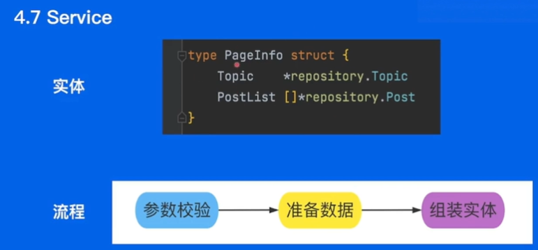

**实体：**

```go
type PageInfo struct{ //PageInfo页面信息，有两个实体，一个是Topic，一个是PostList数组
     Topic *repository.Topic
     PostList []*repository.Post
}
```

**流程：**

> 参数校验：首先对传入的topic id 进行是否合法的校验
>
> 准备数据：拿取数据
>
> 组装实体：最后将数据组装成实体

**代码流程编排**：

```go
func (f *QueryPageInfoFlow) Do() (*PageInfo，error) {
    if err := f.checkParam(); err ！= nil{
        return nil, err
} 
    if err := f.prepareInfo(); err != nil {
        return nil, err
}
    if err := f.packPageInfo(); err != nil {
        return nil, err
}
    return f.pageInfo, nil
}
```

##### 可用性，并行处理

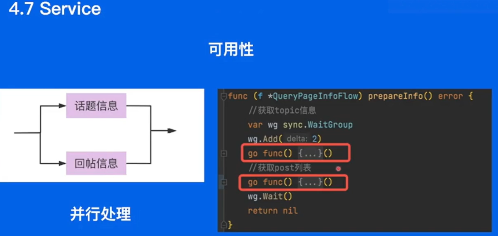

并行获取topic和post列表

并行处理话题信息和回帖信息，两者之间没有没有相互依赖

### 实现Controller（控制层逻辑）

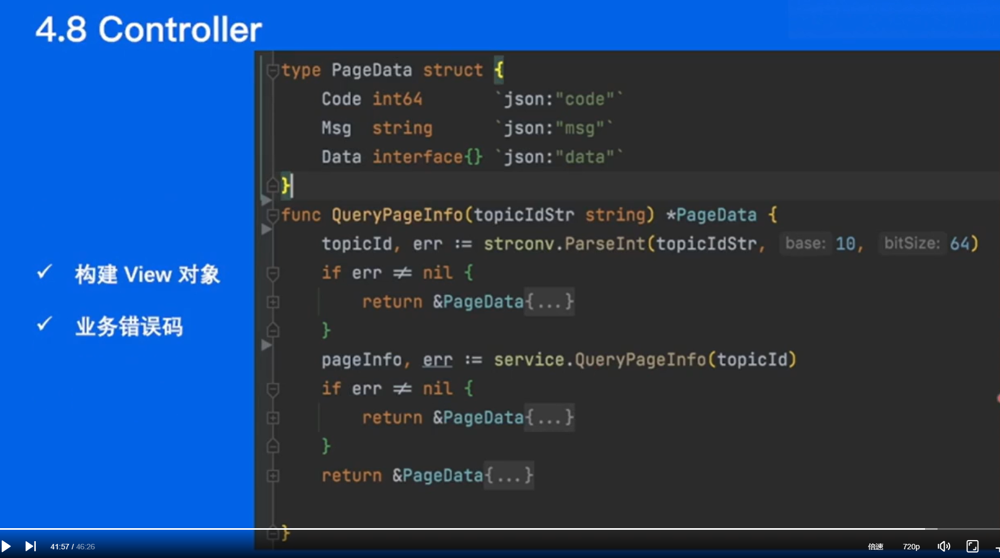

```go
type PageData struct{
    Code int64  `json;"code"`
    Msg string  `json:"msg"`
    Data interface  `json:"data"`

    func QueryPageInfo(topicIdStr string) *PageData {
        topicId,err := strconv.ParseInt(topicIdStr, base: 10,bitSize: 64)//字符串类型变量解析为 int64 类型的变量 base十进制，bitSize64位
        if err != nil{
            return &PageData{ ... }
      }
        pageInfo，err := service.QueryPageInfo(topicId)
        if err != nil {
            return &PageData{ ... }
     }
   return &PageData{ ...]
}
```

##### router 搭建web框架

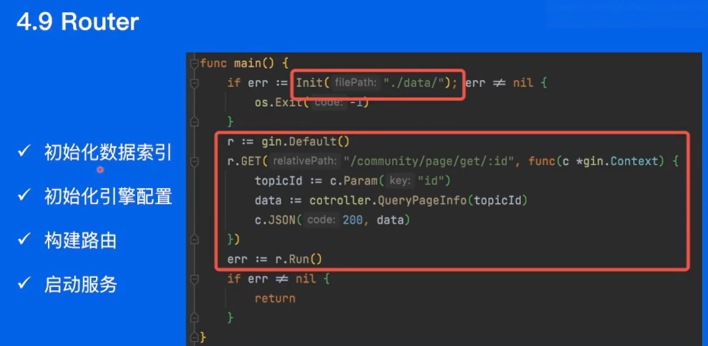

初始化数据索引

初始化引擎配置

构建路由

启动服务

```go
func main(){
    if err := Init (filePath:"./data/");//遍历topic，post文件，初始化数据索引
    err != nil {
        os.Exit(-1)
   }
    r := gin.Default() //初始化引擎配置
    //
    r.GET( relativePath: "/community/page/get/:id"， func(c *gin.Context) {
        topicId := c.Param( key:"id")
        data := cotroller.QueryPageInfo(topicId)
        c.JSON( code: 200,data)
    })//构建路由
     err := r.Run() //启动服务
     err != nil {
        return
   }
}
```

如此，接口就完成了

### 运行测试

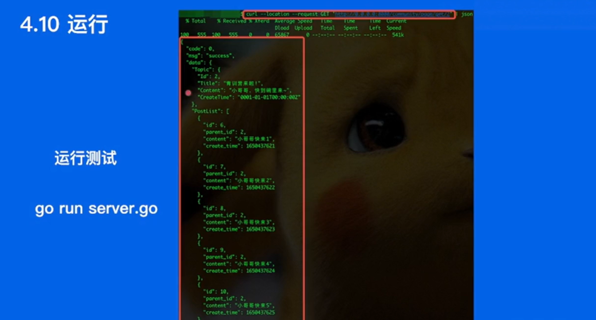


------


### 课后实践

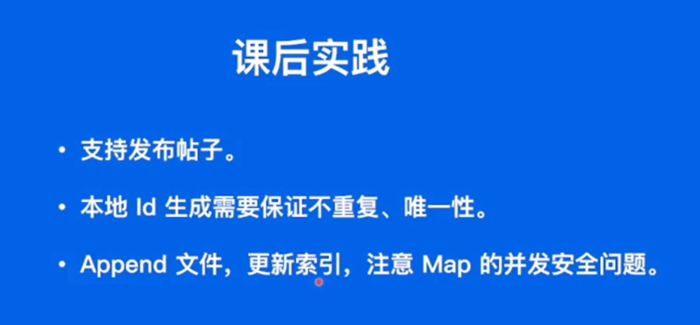

#### 搭建gin web框架

[快速入门 | Gin Web Framework (gin-gonic.com)](https://gin-gonic.com/zh-cn/docs/quickstart/)

[(88条消息) 报错no required module provides package github.com/xx的解决方案_counsellor的博客-CSDN博客](https://blog.csdn.net/counsellor/article/details/123031707)

创建你的项目文件夹并 `cd` 进去

```go
$ mkdir -p $GOPATH/src/github.com/myusername/project  
```

拷贝一个初始模板到你的项目里

```go
curl https://raw.githubusercontent.com/gin-gonic/examples/master/basic/main.go > main.go
```

开始：

下载并安装 gin：

```
$ go get -u github.com/gin-gonic/gin
```

在项目文件夹创建一个名为 `example.go` 的文件

接下来, 将如下的代码写入 `example.go` 中：

```go
package main

import "github.com/gin-gonic/gin"

func main() {
	r := gin.Default()
	r.GET("/ping", func(c *gin.Context) {
		c.JSON(200, gin.H{
			"message": "pong",
		})
	})
	r.Run() // 监听并在 0.0.0.0:8080 上启动服务
}
```

初始化当前主目录（即主模块）:

```
go mod init gotest
```

```
go install golang.org/x/tools/gopls@latest
```

然后, 执行 `go run example.go` 命令来运行代码：

```go
# 运行 example.go 并且在浏览器中访问 本地IPV4:8080/ping
$ go run example.go
```

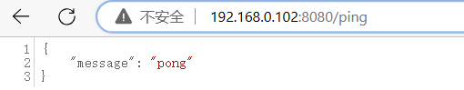

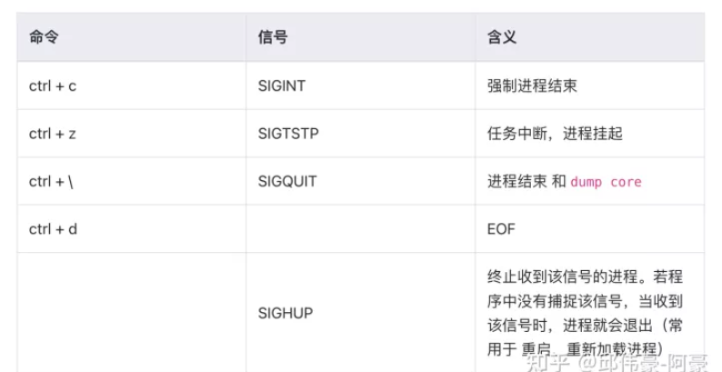
