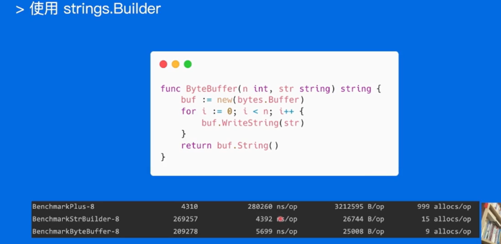
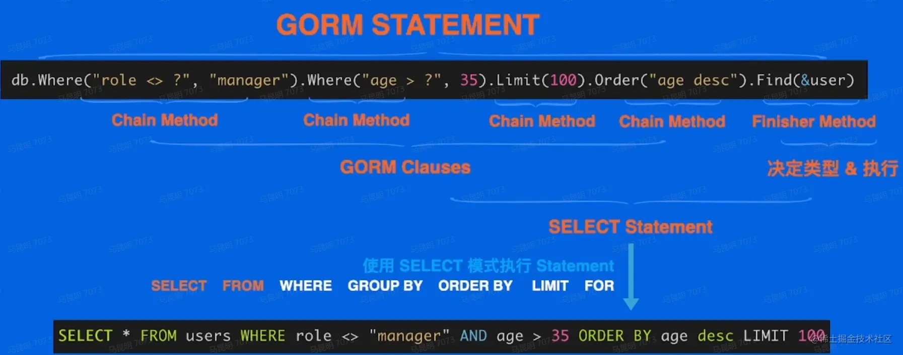
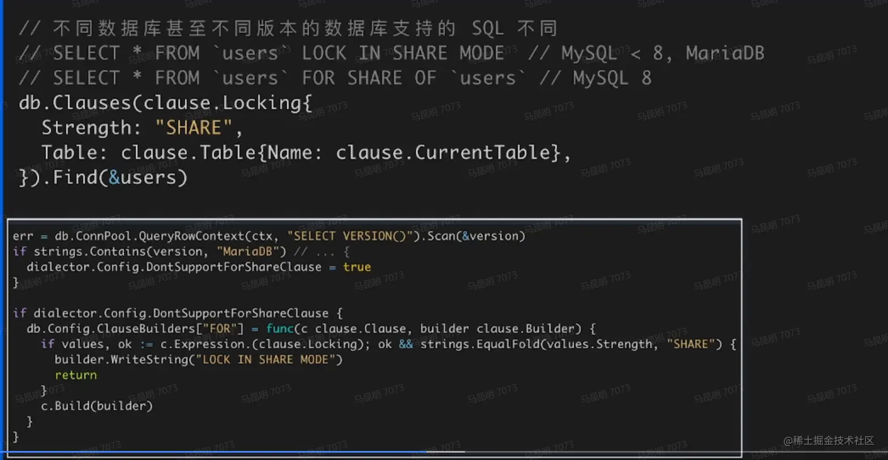

## 高质量编程简介及编码规范


什么是高质量？

在编写代码时，能够达到正确可靠、简洁清晰的目标可称之为高质量代码。

高质量代码需要满足的条件：

- 各种边界条件是否考虑完备
- 异常情况处理周全、稳定性的保证
- 代码易读易维护

编写高质量代码，团队之间相互阅读代码才会比较顺畅，同时也能提高团队开发效率。做到高质量代码，别人在看代码时才能清楚明白代码的作用，才能够放心的去重构或进行代码优化，才能放心的在原有代码基础之上增加新的功能，不用担心出现无法预料到的东西

处。

### 编程原则

实际应用场景千变万化，各种语言的特性和语法各不相同，但是高质量编程遵循的原则是相同的。

#### 简单性

- 消除“多余的复杂性”，以简单清晰的逻辑编写代码
- 不理解的代码无法修复改进

#### 可读性

- 代码是写给人看的，而不是机器
- 编写可维护代码的第一步是确保代码可读

#### 生产力

- 团队整体工作效率非常重要

### 编码规范

如何编写高质量的Go代码？有一些公认的开源的编码规范可以提供我们参考，像一些公司内部也有自己的编码规范。

下面选几个重要的规范来介绍下：

- 代码格式
- 注释
- 命名规范
- 控制流程
- 错误和异常处理

#### 代码格式

代码各种能统一的话，团队之间合作就能把关注点放在具体的逻辑上，提高效率。

推荐使用`gofmt`自动格式化代码

```
gofmt
```

`Go`语言官方提供的工具，能自动格式化`Go`语言代码为官方统一风格，常见IDE都支持方便的配置

```
goimports
```

也是`Go`语言官方提供的工具，实际等于`gofmt`加上依赖包管理，自动增删依赖的包引用、将依赖包按字母序排序并分类。

#### 注释

写代码时不加注释，当时也许只有你和上帝知道，但过了几年，也许只有上帝才能知道了。

> Good code has lots of comments, bad code requires lots of comments. 好的代码有很多注释，坏的代码需要很多注释。

公共符号始终要注释

- 包中声明的每个公共的符号：变量、常量、函数以及结构都需要添加注释
- 任何既不明显也不简单的公共功能必须予以注释
- 无论长度或复杂成都如何，对库中的任何函数都必须进行注释
- 例外：不需要注释接线接口的方法。。


注释很重要，能够快速理解代码的含义，那注释应该怎么做呢？

- 应该解释代码作用
- 应该解释代码如何做的
- 应该解释代码实现的原因
- 应该解释代码什么情况会出现错误

##### 解释代码作用

适合注释公共符号，比如公共的常量、函数。如果一个函数通过名字就能知道他的作用，那么这样的函数可以不用加注释。


##### 解释代码如何做的

适合注释实现过程

对一些实现逻辑复杂的代码、调用函数功能不是很明显的代码逻辑加上注释。


##### 解释代码实现的原因

适合解析代码的外部因素，提供额外上下文，让人知道为什么这样做，要不然后续再维护代码时，会让人很难理解。


##### 解释出错情况

适合解释代码的限制条件，通过注释可以知道在使用的过程中应该有哪些注意的点，以防在使用的过程中，产生错误。


### 命名规范

命名规范的核心目标是降低阅读理解代码的成本，重点考虑上下文信息，设计简洁清晰的名称。

> Good naming is like a good joke,if you have to explian it, it is not funny. 好的命名就像一个好笑话，如果你必须解释她，那就不好笑了。

#### 变量

- 简洁胜于冗长
- **缩略词全大写**，但当其位于变量开头且不需要导出时，使用全小写
  - 例如使用ServeHTTP而不是ServeHttp
  - 使用XMLHTTPRequest或者xmlHTTPRequest
- **变量距离其被使用的地方越远，则需要携带越多的上下文信息**
  - 全局变量在其名字中需要更多的上下文信息，使得在不同地方可以轻易辨认出其含义

```go
go复制代码// 不好的代码
for index := 0; index < len(s); index++ {
    // so something
}
// 好的代码
for i := 0; i < len(s); i++ {
    // so something
}
```

`i` 和 `index` 的作用域范围仅限于`for`循环内部时，`index`的额外冗长几乎没有增加对于程序的理解。

#### 函数

- 函数名不携带包名的上下文信息，因为包名和函数名总数成对出现的
- 函数名尽量简短
- 当名为foo的包某个函数返回类型Foo时，可以省略类型信息而不导致歧义
- 当名为foo的包某个函数返回类型T时(T并不是Foo)，可以在函数名中加入类型信息

#### 包名

- 只由小写字母组成，不包含大写字母和下划线等字符
- 简短并包含一定的上下文信息，例如schema、task等
- 不要与标准库同名，例如不要使用sync、strings等

以下规则尽量满足，以标准库包名为例

- 不使用常用变量名作为包名，例如使用bufio而不是buf
- 使用单数而不是复数，例如使用encoding而不是encodings
- 谨慎地使用缩写，例如使用fmt在不破坏上下文的情况下比format更加简短

### 控制流程

流程控制要遵循线性原理，处理逻辑尽量走直线，避免复杂的嵌套分支；正常流程代码要沿着屏幕向下移动；

好的流程可以提升代码的可维护性和可读性。

在实际项目中，故障问题大多出现在复杂的条件语句和循环语句中。

好的流程控制要遵循以下几点：

- 避免嵌套，保持正常流程清晰

  ```go
  go复制代码// 不好的代码
  if foo {
      return x
  } else {
      return nil
  }
  // 好的代码
  if foo {
      return x
  }
  return nill
  ```

  如果两个分支都包含`return`语句，则可以去除冗余的`else`(也被称为卫语句)。

- 尽量保持正常代码路径为最小缩进

  - 优先处理错误情况/特殊情况，尽早返回或继续循环来减少嵌套

  ```go
  go复制代码// 不好的代码
  func OneFunc() error {
      err := dosomething()
      if err == nil {
          err := dosomething()
          if err == nil {
              return nil
          }
          return err
      }
      return err
  }
  // 好的代码
  func OneFunc() error {
      if err := dosomething(); err != nil {
          return err
      }
      if err := doAnotherthing(); err != nil {
          return err
      }
      return nil
  }
  ```

### 错误和异常处理

error尽可能提供简明的上下文信息链，方便定位问题，panic用于真正异常的情况，recover生效范围，在当前goroutine的被defer的函数中生效。

#### 简单错误

- 简单的错误指的是仅出现一次的错误，且在其他地方不需要捕获该错误
- 优先使用`errors.New`来创建匿名变量来直接表示简单错误
- 如果有格式化的需求，使用`fmt.Errorf`


#### 错误的Wrap和Unwrap

- 错误的`Wrap`实际上是提供了一个`error`嵌套另一个`error`的能力，从而生成一个`error`的跟踪链
- 在`fmt.Errorf`中使用`%w`关键字来将一个错误关联至错误链中

#### 错误判定

- 判定一个错误是否为特定错误，使用`errors.Is`
- 不同于使用==，使用该方法可以判定错误链上的所有错误是否含有特定的错误
- 在错误链上获取特定种类的错误，使用`errors.As`

#### panic

- 不建议在业务代码中使用`panic`
- 调用函数不包含`recover`会造成程序崩溃
- 若问题可以被屏蔽或解决，建议使用`error`代替`panic`
- 当程序启动阶段发生不可逆转的错误时，可以在`init`或`main`函数中使用`panic`

#### recover

- `recover`只能在被`defer`的函数中使用
- 嵌套无法生效
- 只在当前`goroutine`生效
- `defer`的语句是后进先出
- 如果需要更多的上下文信息，可以`recover`后再`log`中记录当前的调用栈

##  性能优化指南

### 性能优化建议

简介：

性能优化的前提是满足正确可靠、简洁清晰等质量因素

性能优化是综合评估，有时候时间效率和空间效率可能对立

针对 Go 语言特性，介绍 Go 相关的性能优化建议

### 1.3.1 性能优化建议-Benchmark

>如何使用
>性能表现需要实际数据衡量
>Go 语言提供了支持基准性能测试的 benchmark 工具


### 1.3.2 性能优化建议-Slice


- 切片本质是一个数组片段的描述
- 包括数组指针
- 片段的长度
- 片段的容量(不改变内存分配情况下的最大长度)切片操作并不复制切片指向的元素创建一个新的切片会复用原来切片的底层数组


### 性能优化建议-Map


### 性能优化建议-字符串处理





### 性能优化建议—空结构体


###  性能优化建议-atomic 包


### 性能优化指南


## 性能优化分析工具

### 性能调优原则

> 要依靠数据不是猜测
> 要定位最大瓶颈而不是细枝末节
> 不要过早优化
> 不要过度优化

### 性能分析工具 pprof


#### 功能简介


#### 搭建 pprof 实践项目


运行项目之后，在浏览器中打开：

```
http://localhost:6060/debug/pprof/
```


####  性能分析工具 pprof-排查实战


go tool pprof "http://localhost:6060/debug/pprof/profile?seconds=10"

#### 采样十秒的数据分析性能


在运行时候，输入top指令获得一下数据

> flat 当前函数本身的执行耗时
> flat% flat 占 CPU 总时间的比例
> sum% 上面每一行的 flat% 总和
> cum 指当前函数本身加上其调用函数的总耗时
> cum% cum 占 CPU 总时间的比例
>
> 每行最后的数据是函数名称线索

#### *CPU


#### 关系图web

不是很直观，可以使用web命令，自动生成调用关系图，并使用浏览器打开


我们输入web后应该会弹出web可使界面，**但是如果没有安装过gvedit会报错**：
Failed to execute dot. Is Graphviz installed? Error: exec: "dot": executable file not found in %PATH%

**解决方案**
gvedit官网：https://graphviz.gitlab.io/_pages/Download/Download_windows.html
按照提示安装即可。注意配置环境变量。
安装结束后需要进入到安装目录，以管理员模式打开cmd输入dot -c安装插件，重启cmd。


注释掉占用最多的代码，重新运行，看看占用效果

cpu占用和时间降低，但内存没有降低多少


#### *heap堆内存


运行命令go tool pprof -http=:8080 "http://localhost:6060/debug/pprof/heap"

就会打开一个分析内存占用的窗口：


http://localhost:8080/ui/ 可以看到所有参数列表


#### *105个协程，排查协程 goroutine


go tool pprof -http=:8080 "http://localhost:6060/debug/pprof/goroutine"


#### mutex锁


block 阻塞


#### block阻塞


## 性能调优实战案例

CPU


Heap-堆内存


### 前言

本文主要介绍实际业务服务性能优化的案例以及对逻辑相对复杂的程序是如何进行性能调优的。

优化类型可分为：业务服务优化、基础库优化、Go语言优化。

### 业务服务优化

### 基本概念

- 服务：能单独部署，承载一定功能的程序
- 依赖：ServiceA的功能实现依赖ServiceB的响应结果，称之为ServiceA依赖ServiceB
- 调用链路：能支持一个接口请求的相关服务集合及其相互之间的依赖关系
- 基础库：公共的工具包、中间件


上图是系统部署的简单示意图，客户端请求经过网关转发，由不同的业务服务处理，业务服务可能依赖其他的服务，也可能会依赖存储、消息队列等组件。

接下来我们以业务服务优化为例，说明性能调优的流程，图中的 ServiceB 被 ServiceA依赖，同时也依赖了存储和ServiceD。

### 优化流程

1. 建立服务性能评估手段
2. 分析性能数据，定位性能瓶颈
3. 重点优化项改造
4. 优化效果验证

#### 建立服务性能评估手段

- 服务性能评估方式
  - 单独benchmark无法满足复杂逻辑分析
  - 不同负载情况下性能表现差异
- 请求流量构造
  - 不同请求参数覆盖逻辑不同
  - 线上真实流量情况
- 压测范围
  - 单机压测
  - 集群压测
- 性能数据采集
  - 单机性能数据
  - 集群性能数据

因为逻辑复杂，不同的请求参数会走不同的处理逻辑，对应的性能表现也不相同，需要尽量模拟线上真实情况，分析真正的性能瓶颈。

压测会录制线上的请求流量，通过控制回放速度来对服务进行测试，测试范围可以是单个实例，也可以是整个集群，同样性能采集也会区分单机和集群。

评估手段建立后，会产生一个服务的性能指标分析报告。

实际的压测报告上会统计压测期间服务的各项监控指标，包括qps，延迟等内容，同时在压测过程中，也可以采集服务的pprof数据，使用之前的方式分析性能问题。

#### 分析性能数据

分析性能数据，定位性能瓶颈

有了服务优化前的性能报告和一些性能采样数据，我们可以进行性能瓶颈分析了。

业务服务常见的性能问题可能是**使用基础组件不规范**。

比如下面代码，每次使用配置时都会进行json解析，拿到配置项，实际组件内部提供了缓存机制，只有数据变更的时候才需要重新解析json。


还有可能是：**高并发场景优化不足**


上边是服务高峰期的火焰图，下边是低峰期的火焰图，可以发现metrics，即监控组件的CPU资源占用变化较大，主要原因是监控数据上报是同步请求，在请求量上涨，监控打点数据量增加时，达到性能瓶颈，造成阻塞，影响业务逻辑的处理，后续是改成异步上报的机制提升了性能。

#### 重点优化项改造

定位到性能瓶颈后，修改完后能直接发布上线吗？

- 正确性是基础
- 响应数据diff
  - 线上请求数据录制回放
  - 新旧逻辑接口数据diff

性能优化的前提是保证正确性，在变动较大的性能优化上线之前，还需要进行正确性验证，因为线上的场景和流程太多，所以要借助自动化手段来保证优化后程序的正确性。

线上请求的录制，要包含请求参数录制、返回内容录制，重放时对比优化前后返回内容进行正确性验证。

#### 优化效果验证

- 重复压测验证
- 上线评估优化效果
  - 关注服务监控
  - 逐步放量
  - 收集性能数据

改造完成后，可以进行优化效果验证了。

验证分两部分，首先依然是用同样的数据对优化后的服务进行压测。

正式上线的时候会逐步放量，记录真正的优化效果。

压测并不能保证和线上表现完全一致，有时还要通过线上的表现再进行分析改进，是个长期的过程。

#### 进一步优化

进一步优化，服务整体链路分析

- 规范上游服务调用接口，明确场景需求
- 分析链路，通过业务流程优化提升服务性能

#### 基础库优化

基础库优化使用范围更广，在实际的业务服务中，为了评估某些功能上线后的效果，经常需要进行AB实验，看看不同策略对核心指标的影响，所以公司内部多数服务都会使用AB实验的SDK，如果能优化AB组件库的性能，所有用到的服务都会有性能提升。

类似业务服务的优化流程，也会先统计下各个服务中AB组件的资源占用情况，看看AB组件的哪些逻辑更耗费资源，提取公共问题进行重点优化。

SDK优化主要包括：

- 分析基础库核心逻辑和性能瓶颈
  - 设计完善改造方案
  - 数据按需获取
  - 数据序列化协议优化
- 内部压测验证
- 推广业务服务落地验证

#### Go语言优化

针对Go本身进行的优化，会优化编译器和运行时的内存分配策略，构建更高效的go发行版本。

Go语言优化主要是编译器和运行时的优化，主要包括：

- 优化内存分配策略
- 优化代码编译流程，生成更高效的程序
- 内部压测验证
- 推广业务服务落地验证

此优化方案接入简单，只需要调整编辑器编译配置就行，并且通用性较强。

#### 总结

- 性能调优原则
  - 要依靠数据而不是猜测
- 性能分析工具
  - 熟练使用pprof工具排查性能问题并了解其基本原理
- 性能调优
  - 保证正确性
  - 定位主要瓶颈


## 相关术语解读

### 自动内存管理

- Auto memory management: 自动内存管理
- Grabage collction: 垃圾回收
- Mutator: 业务线程
- Collector: GC 线程
- Concurrent GC: 并发 GC
- Parallel GC: 并行 GC
- Tracing garbage collection: 追踪垃圾回收
  - Copying GC: 复制对象 GC
  - Mark-sweep GC: 标记-清理 GC
  - Mark-compact GC: 标记-压缩 GC
- Reference counting: 引用计数
- Generational GC: 分代 GC
  - Young generation: 年轻代
  - Old generation: 老年代

### Go 内存管理及优化

- TCMalloc
- `mmap()` 系统调用
- scan object 和 noscan object
- mspan, mcache, mentral
- Bump-pointer object allocation: 指针碰撞风格的对象分配

### 编译器和静态分析

- 词法分析
- 语法分析
- 语义分析
- Intermediate representation (IR) 中间表示
- 代码优化
- 代码生成
- Control flow: 控制流
- Data flow: 数据流
- Intra-procedural analysis 过程内分析
- Inter-procedural analysis: 过程间分析

### Go 编译器优化

- Function inlining: 函数内联 
- Escape analysis: 逃逸分析

## 性能优化

### 1.性能优化的定义与原因

定义：提升软件系统的处理能力，减少不必要的消耗，充分发掘计算机算力。

原因：

1. 用户体验：带来用户体验的提升
   - 抖音滑动点击更加顺滑流畅
   - 突发事件618，双11，双12购物能够尽可能做到和平时购物一样的流畅度，不卡顿
2. 资源高效利用：降低成本，提高效率
   - 很小的优化乘以海量机器会显著的性能提升和成本节约

### 2.两个层面

业务层优化：

- 针对特定场景，具体问题，具体分析
- 容易获得较大性能提升

语言运行优化：

- 解决更通用的性能问题
- 需要考虑更多的场景
- Tradeoffs，折中考虑

### 3.可维护性

一般来说，优化都是需要写代码，而一般性能优化都是对Go SDK写代码

**Go SDK**

- 接口层：Commands APIs New APIs
- 实现层： Compiler Scheduler GC Runtime Libs Profiling

质量和可维护性要保证

1. 前提：保证接口稳定再进行改进
2. 测试用例：覆盖尽可能多的场景，基于正确的软件进行优化
3. 文档：将做了什么，能达到什么效果展示给用户，以便用户的个性化使用
4. 隔离：通过选项控制是否开启优化
5. 可观测：日志输出，告诉用户功能是正常的


## Go内存管理及性能与编译优化

**零、前言：**

本节课将主要介绍关于高性能 Go 语言发行版**优化的内存管理**， 分享**自动内存管理**与 **Go 内存管理**知识，提供可行性的**优化建议**。

------

**一、本堂课重点内容：**

- 高性能Go语言发行版**优化**与**落地实践**
- 优化：内存管理优化 + 编译器优化
- 背景：自动内存管理和Go内存管理机制 & 编译器优化的基本问题和思路
- 实践：字节跳动公司遇到的性能问题以及优化方案简介

------

**二、详细知识点介绍**

### 0. 性能优化

*性能优化 -> 提升软件处理系统的能力 -> 资源高效利用 -> 提升用户体验*

#### 性能优化的层面

由于自顶向下的是业务代码、SDK、基础库、语言运行时以及OS，所以性能优化有着针对不同层面的优化：

- 业务层优化

  ：

  可以理解为做菜的时候学习菜谱，这道菜就会很好吃，很标准

  - 针对特定场景，具体问题，具体分析
  - 比较容易获得较大的性能收益

- 语言运行时优化

  ：

  可以理解为磨刀，这样对于任何菜肴，切割食材就会变得容易

  - 解决更通用的性能问题
  - 考虑更多场景
  - Tradeoffs

无论是哪种层面的性能优化，都需要**数据作为驱动**：

- 数据驱动
  - 自动化性能分析工具——pprof
  - 依靠数据而非猜测，实事求是
  - 首先优化最大瓶颈

#### 性能优化与软件质量

- 软件质量至关重要
- 在保证**接口稳定**的前提下，改进具体实现（不然变成屎山了）
- 测试用例：覆盖尽可能多的场景，方便回归
- 文档：说明清楚功能和效果
- 隔离：通过选项控制是否开启优化（省钱）
- 可观测：必要的日志输出（看清楚搞明白）

事实上，我们在实际工作中写代码，就是在写SDK里面的代码；

那么SDK究竟是什么呢？可能有的小伙伴很清楚，那就可以跳过这部分。

**SDK：**

即Software Development Kit的缩写，译作软件开发工具包。软件开发工具包是一个覆盖面相当广泛的名词，你甚至可以这么理解：辅助开发某一类软件的相关文档、范例和工具的集合都可以叫做SDK。

**SDK的组成：**

一个完整的SDK应该包括以下内容：

1. 接口文件和库文件：笼统地说就是API。通过将底层的代码进行封装保护，提供给用户一个调用底层代码的接口。
2. 帮助文档：用来解释接口文件和库文件（即API）的功能，以及介绍相关的开发工具，操作示例等。
3. 开发示例：即简单的成品DEMO展示，包括源代码。
4. 实用工具：通常是指用来协助用户进行二次开发的工具，比如二次开发向导、API 搜索工具、软件打包工具等。


------

### 1. 自动内存管理

#### 自动内存管理的基本概念

**动态内存**：

- 程序在运行时根据**需求**动态分配的内存：类似于C语言的`malloc()`

**自动内存管理**（垃圾回收）：由程序语言的**运行时系统**管理动态内存

- 避免手动内存管理，专注于实现业务逻辑（勤奋的目的是为了懒）
- 保证内存使用的**正确性**和**安全性**，防止出现`double-free problem & use-after-free problem`

**GC的三个任务**：（战场清理大师）

- 为新对象分配空间
- 找到存活对象
- 回收死亡对象的内存空间

接下来让我们先明确一些**名词的概念**，同样，如果你已经掌握了，那么可以直接跳过：

- Mutator：业务线程，分配新对象，修改对象指向关系
- Collector：GC线程，找到存活对象，回收死亡对象的内存空间
- Serial GC：只有一个collector
- Parallel GC：支持多个collectors同时回收的GC算法
- Concurrent GC：mutator(s) 和 collector(s) 可以**同时执行**


特别地，Collectors 必须感知对象指向关系的改变；

如上图例子，最右边被红色箭头指向的b是在GC过程中被用户新创建出来的对象，但是这个时候没有被标记，Collectors必须标记它，这个时候如果存活就标记为存活，否则为不存活的话有可能会发生错误。

GC算法的一些补充：

- 安全性：不能回收存活的对象 **基本要求**
- 吞吐率：`1 - GC时间 / 程序执行总时间` **花在GC上的时间**
- 暂停时间：stop the word (STW) **业务是否感知**
- 内存开销：**GC元数据开销**

------

#### 追踪垃圾回收

对象被回收的**条件**：指针指向关系不可达的对象

**步骤**：

- 标记root对象：包括静态变量、全局变量、常量和线程栈等等；
- 标记可达对象：求指针指向关系的传递闭包：从根对象出发，找到所有可达对象；
- 清理所有不可达对象：
  - 将存活对象复制到另外的内存空间 (Copying GC)
  - 将死亡对象的内存标记为"可分配" (Mark-sweep GC)
  - 移动并整理存活对象 (Mark-compact GC)
- **根据对象的生命周期，使用不同的标记和清理策略**


#### 分代GC (Generational GC)

- 分代假说：most objects die young
- Intuition：很多对象在分配出来后很快就不再使用了（英年早逝）
- 每个对象都有年龄：经历过GC的次数
- 目的：对年轻和老年的对象，指定不同的GC策略，**降低整个提内存管理的开销**
- 不同年龄的对象处于heap的不同区域
- 年轻代
  - 常规的内存分配
  - 由于**存活对象很少**，可以采用copying GC
  - GC吞吐率很高
- 老年代
  - **对象趋向于一直活着，反复复制开销较大**
  - 可以采用mark-sweep GC

#### 引用计数

每个对象都有一个与之关联的引用数目；

对象存活的条件：**当且仅当引用数>0**

这样做的**优点**是：

- 内存管理的操作被平摊到程序执行过程中
- 内存管理不需要了解runtime的实现细节：C++智能指针(smart pointer)

这样做的**缺点**也是有的：

- 维护引用计数的开销较大：通过**原子操作**保证对引用计数的**原子性**和**可见性**
- 无法回收环形数据结构——weak reference
- 内存开销：每个对象都引入的额外内存空间存储引用数目
- 回收内存时依然可能引发暂停

### 2. Go内存管理及优化

#### Go内存分配——分块

**目标**：提前为对象在heap上分配内存

- 调用系统调用`mmap()`向OS申请一大块内存，例如4MB
- 先将内存划分成大块，例如8KB，称作**mspan**
- 再继续将大块划分成**特定大小**的小块，用于按需对象的分配
- noscan mspan：分配不包含指针的对象——GC不需要扫描
- scan mspan：分配包含指针的对象——GC需要扫描
- 对象分配：根据对象的大小，选择最合适的块

#### Go内存分配——缓存

**缓存过程**：

- TCMalloc：thread caching（线程缓存）
- 每个p包含一个mcache用于快速分配，用于为绑定于p上的g分配对象
- mcache管理一组mspan
- 当mcache中的mspan分配完毕，向mcentral申请带有未分配块的mspan
- 当mspan中没有分配的对象，mspan会被缓存在mcentral中，而不是立刻释放并归还给OS

一图以释之：


#### Go内存管理优化

**一些须知**：

- 对象分配是非常高频的操作：每秒分配GB级别的内存
- 空间较小的对象占比比较高
- Go内存分配比较耗时
  - 分配路径长：g -> m -> p -> mcache -> mspan -> memory block -> return pointer
  - pprof：对象分配的函数是最频繁调用的函数之一

**字节跳动的优化方案**：`Balanced GC`

- 每个g都**绑定**一大块内存（1KB），称作`goroutine allocation buffer (GAB)`

- GAB用于noscan类型的小对象分配：`< 128B`

- 使用三个指针维护GAB：`base基地址, end结束地址, top当前地址`

- Bump pointer（指针碰撞）风格对象分配：

  - 无需和其他分配请求互斥

  - 分配动作简单高效（移动top指针）

    ```Go
    Go复制代码if top + size <= end {
    	addr := top
    	top += size
    	return addr
    }
    ```

  

Balanced GC的**一些细节**：

- GAB对于Go内存来说是一个大对象
- 本质：将多个小对象的分配合并成一次大对象的分配
- 问题：GAB的对象分配方式会导致内存被延迟释放
- 方案：移动GAB中的存活对象
  - 当GAB总大小超过一定阈值时，将GAB中存活的对象复制到另外分配的GAB中
  - 原先的GAB可以释放，避免内存泄漏
  - 本质：用copying GC的算法管理小对象（根据对象的生命周期，使用不同的标记和清理策略）


### 3. 编译器和静态分析

#### 编译器的**结构**：


- 重要的系统软件
  - 识别符合语法和非法的程序
  - 生成正确且高效的代码
- 分析部分：（前端 front end）
  - 词法分析：生成**词素**（lexeme）
  - 语法分析：生成**语法树**
  - 语义分析：收集类型信息，进行语义检查
  - 中间代码生成：生成intermediate representation（IR）
- 综合部分：（后端 back end）
  - 代码优化：机器无关代码，生成优化后的IR
  - 代码生成：生成**目标代码**

#### 静态分析

##### 控制流和数据流

静态分析 ：**不执行程序代码**，推导程序的行为，分析程序的性质。

常见的**两种分析**：

- 控制流：程序执行的**流程**
- 数据流：数据在控制流上的**传递**

控制流图示：


通过分析控制流和数据流，我们可以知道更多关于**程序的性质（properties）**，根据这些性质优化代码。

##### 过程内分析和过程间分析

过程内分析：仅在函数内部进行分析

过程间分析：考虑过程调用时参数传递和返回值的数据流和控制流

过程间分析的难点：

- 需要通过**数据流分析**得知`i`的具体类型，才能知道`i.foo()`调用的是哪个`foo()`
- 根据`i`的具体类型，**产生了新的控制流**，`A.foo()`，分析继续
- 过程间分析需要**同时**分析控制流和数据流——**联合求解，比较复杂**

### 4. Go编译器优化

编译优化的思路：

- 场景：面向后端长期执行任务
- Tradeoff：**用编译时间换取更高效的机器码**

Beast mode：

- 函数内联
- 逃逸分析
- 默认栈大小调整
- 边界检查消除
- 循环展开，等

#### 函数内联  inlining

**内联的定义**：将被调用函数的函数体(callee)的副本替换到调用位置(caller)上，同时重写代码以反映参数的绑定

**优点**：

- **清除函数调用开销**，例如传递参数、保存寄存器等
- **将过程间分析转化为过程内分析**，帮助其他优化，例如**逃逸分析**

逃逸分析解释：分析代码中指针的动态作用域：指针在何处可以被访问

```GO
GO复制代码// 一个使用micro-benchmark的性能测试
func BenchmarkInline(b *testing.B) {
    x := genInteger()
    y := genInteger()
    for i := 0; i < n.N; i++ {
        addInline(x, y)
    }
}

func addInline(a, b int) int {
    return a + b
}

func BenchmarkInlineDisabled(b *testing.B) {
	x := genInteger()
    y := genInteger()
    for i := 0; i < n.N; i++ {
        addNoInline(x, y)
    }
}

// go:noinline
func addNoInline(a, b int) int {
    return a + b
}
// 大约可以提升4.58倍的性能
```

**缺点**：

- 函数体变大，instruction cache不友好（大概就是会占用很多的意思）
- 编译生成的Go镜像变大（时间换空间的感觉）

函数内联在**大多数情况下**是正向优化

#### Beast Mode

- Go函数内联受到的限制较多
  - 语言特性，例如interface，defer等，限制了函数内联
  - 内联策略非常保守
- Beast mode：调整函数内联的策略，使更多函数被内联
  - 降低函数调用的开销
  - 增加了其他优化机会：**逃逸分析**
- 开销：
  - Go镜像增加约10%
  - 编译时间增加

相当于是一个折中的方法。

该种方法下的逃逸分析大致思路：


------


## Database/sql 及 GORM 相关解读

### 理解database / sql

#### 1.1 基本用法 - Quick Start

*DSN*是Distributed Service Network的简称，专业名称叫做分布式业务网络。

DB 数据接口

```go
import (
    "database/sql"
    
    "github.com/go-sql-driver/mysql"//import   driver 实现
    //使用driver + DSN 初始化DB连接
)
func main( ){
    db,err := sql.Open("mysql","user:password@tcp(127.0.0.1:3306)/hello") //链接数据库
    rows,err := db.Query("select id,name form users where id = ?",1) //执行sql语句，查询数据库，通过rows取到返回的数据处理完毕，需要释放链接
    if err != nil{
//xxx
    }
    defer rows.Close()//函数最后关闭数据库连接,将连接返回给连接池
    var users []User //用户类型的数组
    for rows.Next(){//我们使用 for 循环和 rows.Next() 来遍历查询结果的每一行数据。
        var rows User // 单个用户对象
        err := rows.Scan(&user ID,&user.Name)
        //使用 &user.ID 和 &user.Name 将 ID 和 Name 字段的指针传递给 Scan 方法，确保结果能够正确存储到对应的字段中。
        if err != nil {
            // ...
    }
        
        users = oppend(users,user)// 将用户添加到切片中，我们使用内置的 append 函数将获取到的用户对象 user 添加到 users 切片中。这个函数会返回一个新的切片，所以需要将其赋值给 users 变量来更新切片
     
}
  if err := rows.Err(); err != nil { //如果错误
        fmt.Println("An error occurred during iteration:", err)
        return
    }

    // 输出查询结果
    for _, user := range users {
        fmt.Printf("User ID: %d, Name: %s\n", user.ID, user.Name)
    }
    
}
```


> 请确保将代码中的`user:password`替换为你的实际MySQL用户名和密码，并将`127.0.0.1:3306`替换为你的MySQL服务器地址和端口号。如果你的代码中未使用到User类型，请自行移除相关代码。

#### 1.2 设计原理


操作过程伪实现：


```go
for  i := 0 ; i <maxBadConnRetries; i++ {
 // 从连接池获取连接或通过driver新建连接
 dc,err := db.conn(ctx,strategy)
   //有空闲连接 ->reuse ->max life time
   //新建连接 -> max open
   
   //将连接放回连接池
   defer dc.db.putConn(dc,err,true)
    //validateConnection 有无错误
    // max life time, max idle conns 检查
    
    // 连接实现 driver.Queryer,driver.Execer 等 inerface
    if err == nil{
     err = dc.ci.Query(sql,args...)
    }
    
    isBadConn = errors.Is(err,driver.ErrBadConn)
    if !isBadConn{
    break
   }
}
```

#### **连接接口**（database/sql -> 数据库）：

```go
//Driver 接口
type Driver interface {
  // Open returns a new connection to the database.
  Open(name string)(Conn,error)//传入一个名字，返回一个连接
}

//注册全局 driver
func Register(name string,driver driver.Driver){ //传入名字和driver
    driverMu.lock() //锁
    defer driversMU.Unlock()//函数结束后解锁
    if driver == nil {
        panic("sql:Register driver is nil")
   }
    if _,dup := driver[name];dup{
        panic("sql: Register called twice for driver"+name)
        drivers[name] = driver
    }
}
```

**怎么去用这个注册的**driver：

```go
//业务代码
import "github.com/go-sql-driver/mysql"

func main(){//建立连接
    db,err := sql.Open("mysql","gorm:gorm@tcp(localhost:9910)/gorm?charset=utf &&  parseTime=True&local")
}

//github.com/go-sql-driver/mysql/driver.go

//注册 Driver
func init (){
    sql.Regiseter("mysql",&MySQLDriver{})
}
```

新接口 Driver 连接接口 2： 

```go
type Connector interface {
    Connect(context.Context)(Conn,error)
    Driver() Driver
}

func OpenDB(c driver.Connector) *DB{
   // ...
}
```

业务：

```go
import "github.com/go-sql-driver/mysql"

func main(){
   connector,err := mysql.NewConnector(&mysql.Config{ //方便的创建连接写法
   User: "gorm",
   Passwd: "gorm",
   Net: "tcp",
   Addr: "127.0.0.1:3306",
   DBName: "gorm",
   ParseTime: true,
})

db := sql.OpenDB(connector) //传给数据接口
}
```

#### 操作接口：


DB连接的几种类型：

> 直接连接 / Conn
>
> 预编译 / Stmt
>
> 事务 / Tx

处理返回数据的几种方式：

> Exec / ExecContext -> Result
>
> Query / QueryContext ->Rows (Columns)
>
> Query / QueryRowContext ->Row(Rows 简化)


## GORM 基础使用

### 背景知识

“设计简洁，功能强大，自由扩展的全功能ORM”

设计原则：API精简，测试优先，最小惊讶，灵活扩展

Go英文手册：[gorm.io/docs](https://link.juejin.cn?target=https%3A%2F%2Fgorm.io%2Fdocs%2Fmodels.html%23embedded_struct) 


Go中文手册：[learnku.com/docs ](https://link.juejin.cn?target=https%3A%2F%2Flearnku.com%2Fdocs%2Fgorm%2Fv2%2Findex%2F9728%23e655a4) 用法在里面有介绍


原本我尝试按照文档做了一些操作的案例，但中途认为，这样做的意义并不是很大，加上上面已经罗列了使用原生database/sql进行CRUD的步骤。GORM文档已经十分清爽完备，最终决定不再笔记中二次赘述。

### 小结


GORM还是原生database/sql，都是在应用程序层面，向用户隐藏了底层连接数据库，操作数据库的实现细节。使得开发者通过API就可以实现和数据库进程的通信，而数据库进程才是直接操作数据库文件的，而非应用程序。

或者说应用程序进程的工作只是将SQL命令传递给了数据库进程，最终一条SQL的执行将完全在数据库进程内完成。以MySQL为例收到一条SQL后将涉及如下方面的工作：

- 语句的解析

- 查询的优化

- 存储引擎的工作：

  - 索引的选择与实现
  - 数据一致性的保证（redo log）
  - 事务的实现，不同事务隔离级别如何实现（多版本并发控制MVCC、undo log）
  - 锁的实现（表级锁、行级锁、间隙锁）

- 数据恢复与同步，主从复制（bin log）

- 等等...

- 一点小问题：

  - 上面连接中，连接信息是很长的字符串，有的时候字符串转义等会出现问题，为了解决这个问题，后来Go语言官方提供了一个新的方式连接
  - 新的方式使用**结构体**的方式连接

  

  

## 设计原理

### DB连接的类型

- 直接连接 / Conn
- 预编译 / Stmt
- 事务

### 处理返回数据的几种形式

- Exec/ExecContext -> Result: 执行sql，可以获取是否成功，lastInsertId等信息
- Query / QueryContext -> Rows (Columns)： 将请求结果返回
- QueryRow / QueryRowContext -> Row (Rows 简化)

具体实现


### 二、Gorm基础使用

#### 基本用法


### 模型定义


**软件设计范式：约定优于配置**

- 表名为struct name的snake_cases复数格式
- 字段名为field name 的snake_case单数格式
- ID/Id字段为主键,如果为数字,则为自增主键
- CreatedAt 字段,创建时,保存当前时间
- UpdatedAt字段,创建、更新时,保存当前时间
- gorm.DeletedAt 字段,默认开启 soft delete模式

### 关联介绍

- has one
- has many
- 多态 has many
- ...


### 关联操作


#### Preload/Joins预加载

- 一条sql不一定比三条sql性能好
- 所以要测试preload和join的性能比较


### 级联删除

保障数据没有孤儿数据

- 使用数据库约束
- 使用 select 实现级联删除，不依赖数据库约数和软删除功能


### 三、Gorm设计原理

Gorm是在应用程序和database/sql之间的一层，操作sql的接口


### SQL是怎么生成的

- “找出35岁以上不是管理者的打工人”


- Chain Method：可以添加字句的

- Finisher Method： 决定类型 & 执行的方法

  **GORM转SQL**：



#### Chain Method实现


#### Finish Method 实现


#### 为什么这么设计

- 自定义Clause Builder
- 方便扩展Clause
- 自由选择 Clauses

#### 不同数据库甚至不同版本支持的sql不同

- 根据不同版本来实现



#### 扩展子句


#### 选择子句


\

### 插件是怎么工作的


#### Create的callback设计


#### 修改callback

#### 

#### 为什么要这么设计

完成灵活定制，自由扩展

- 怎么支持多租户
- 支持多数据库，读写分离
- 加解密，混沌工程...

#### 多租户

**查询的时候往往加上id等过滤条件，希望查询的时候自动加上这些条件**


#### 多数据库，读写分离


#### ConnPool是什么

- 重新定义了一个接口interface ConnPool 在Gorm和数据库之间


#### PrepareStmt模式：

- 全局模式： 缓存不含参数部分，尽量不要拼接sql，一定要作为参数执行
  - 这里缓存会有容量限制，达到容量就无法缓存了

- 会话模式：后续的会话操作都会预编译并缓存


- 查找缓存的预编译 SQL
- 未找到,将收到的SQL和Vars预编译
- 使用缓存的预编译SQL执行

#### 通过ConnPool接口更改下游数据库


#### 利用ConnPool 开发缓存插件


#### 通过一行配置提升性能

- interpolateParams=false
- **这里预编译用完就关掉了，导致利用率低**
- **这个为了解决多编码环境下的注入问题，一般情况下不会有这个情况**
- **可以试着关闭这个参数**


#### 字节内部封装了一些默认配置 bytedgorm


#### Dialector是什么

- 不同语言的实现


#### 功能


### 四、Gorm最佳实践

### 数据序列化与 SQL表达式

### SQL表达式更新创建

- gorm.Expr 使用sql表达式
- 使用GormValue
- 使用子查询SubQuery


### 查询

- gorm.Expr
- GormValue
- 自定义查询SQL实现接口
- SubQuery


### 数据序列化

- 可以对密码加解密等


## 批量数据操作

### 创建

- CreateInBatches(users, 100): 每一百条数据创建一次

### 查询

- 避免把数据都加载到内存，避免oom
- FindInBatches： 每100条查询数据，分批处理


### 更新


### 批量数据加速操作

- 关闭默认事务
- 默认批量导入会调用hooks方法，使用Skiphooks跳过
- 使用Prepares Statement预编译sql
- 混合使用， CreateBatchSize：默认使用批量插入，1000个一次


### 代码复用、分库分表、Sharding

### 代码复用

- 把分页逻辑抽象出来，利用Scopes方法复用抽象的逻辑


### 分库分表

- 根据数据选择分库分表，然后后面复用这个逻辑


### Sharding

- 创建订单时，userId是2，就会把数据插入到orders_2的表里


### 混沌工程/压测

插入数据时篡改一些数据，检查系统状态能不能发现


### Logger/Trace

- 全局模式
- 会话模式


### Migrator 数据库迁移管理

- 自动迁移数据库
- 版本管理数据库


- 数据库迁移接口


- 获取字段信息的接口


### Raw SQL

- Raw sql 不容易管理，改的时候容易忘


### 代码生成 Raw SQL - Gen


### 安全问题

- 要以参数的形式输入，如果直接拼接会发生sql注入的事故


### Q&A

1. Gorm支持动态sql吗
   - 可以使用Scopes等实现
2. 外键实现的场景
   - Gorm的外键和数据库的外键不一样，根据这个字段作为一个referenceId 辅助查询
3. 修改数据库结构，可以更改Struct，然后AutoMigrate
4. 取消点赞
   - 一般倾向于保留，添加一个状态实现，并且添加更改时间
5. save和create方法区别
   - save使用前会判断主键是不是存在，如果存在，就调用update，不存在，就调用create
6. gorm v1过渡gorm v2
   - 不能平滑过渡
   - 在做不同代码实现的时候，要考虑用户迁移成本
7. 业务代码一般是通过model（和表对应的结构体）查询出来值，再赋值到返回给前端的响应体结构（vo）中吗
   - gorm有 smart select


