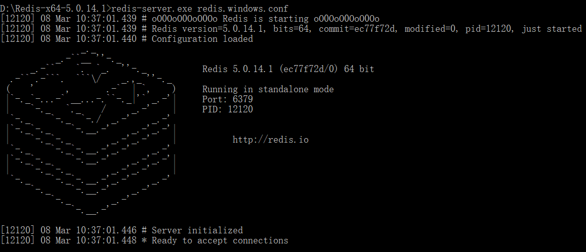

# Redis系列教程

# 1. Redis入门

## 1.1 什么是NoSQL

NoSQL = Not Only SQL（不仅仅是 SQL） 非关系型数据库

关系型数据库：以关系模型组织数据，表现形式为：表格，行，列。

随着 web 2.0 互联网的诞生！传统的关系型数据库很难对付 web 2.0 时代！尤其是超大规模的高并发的社区！暴露出来很多难以克服的问题 。

NoSQL 在当今大数据环境下发展的十分迅速，Redis 是发展最快，而且是我们当下必须要掌握的一个技术！

**NoSQL 的特点**：

1. 方便扩展（数据之间没有关系，很好扩展）

2. 大数据量高性能（NoSQL的缓存记录级，是一种细粒度的缓存，性能会比较高）
3. 数据类型是多样型的（不需要事先设计数据库，随取随用）

**传统 RDBMS 和 NoSQL的比较**：

> 传统的 RDBS 
>
> - 结构化组织 
> - SQL 
> - 数据和关系都存在单独的表中
> - 操作语言，数据库定义语言 
> - 严格的一致性 
> - 基础的事务

> NoSQL
>
> - 不仅仅是数据 
> - 没有固定的查询语言 
> - 键值对存储，列存储，文档存储，图形数据库 
> - 最终一致性
> - CAP 定理和 BASE （异地多活）
> - 高性能，高可用，高可扩

## 1.2 NoSQL的四大分类

1. KV 键值对：Redis

2. 文档型数据库（bson 和 json 一样）：
   1. MongoDB：
      1. MongoDB 是一个基于**分布式文件储存**的数据库，使用 C++编写，主要用来处理大量的文档。
      2. MongoDB 是一个**介于关系型数据库和非关系型数据中间的产品**！MongoDB 是非关系型数据中功能最丰富，最像关系型数据库的。

3. 列存储数据库：
   1. HBase
   2. 分布式文件系统
4. 图关系数据库：
   1. 他不是存图形，放的是关系，比如：朋友圈社交网络，广告推荐
   2. Neo4j、InfoGrid

## 1.3 Redis入门

Redis （Remote Dictionary Server），即远程字典服务！

是一个开源的使用 ANSI C语言编写、支持网络、可基于内存亦可持久性的日志型、key-value 数据库，并提供多种语言的 API。

免费和开源！是当下最热门的NoSQL 技术之一。

**Redis 的作用**：

1. 内存存储、持久化（RDB 和 AOF）
2. 效率高，可以用于高速缓存
3. 发布订阅系统，队列
4. 地图信息分析
5. 计数器、计时器（比如浏览量）

**Redis 的特征：**

1. 多样化的数据类型
2. 持久化
3. 集群
4. 事务

Redis 官网： https://redis.io/

Redis 中文网： http://www.redis.cn/

## 1.4 Redis安装启动

到官网下载压缩包，上传到服务器

~~~shell
[root@coder opt]# ls
 redis-5.0.8.tar.gz
[root@coder opt]# tar -zxvf redis-5.0.8.tar.gz 		# 解压
[root@coder redis-5.0.8]# yum install gcc-c++			# 增加环境支持
[root@coder redis-5.0.8]# make					   # 安装
[root@coder redis-5.0.8]# make install
[root@coder redis-5.0.8]# cd /usr/local/bin		    # 进入Redis的默认安装目录
[root@coder bin]# ls
redis-cli        redis-server
~~~

拷贝配置文件：

~~~shell
[root@coder bin]# mkdir redis-config
[root@coder bin]# cp /opt/redis-5.0.8/redis.conf redis-config/
[root@coder bin]# cd redis-config/
[root@coder redis-config]# ls
redis.conf
~~~

修改配置文件为后台启动：

~~~shell
[root@coder redis-config]# pwd
/usr/local/bin/redis-config
[root@coder redis-config]# vim redis.conf
~~~

修改配置项：

- `daemonize`为`yes`。
- 注释掉 `bind 127.0.0.1` 或者 修改为bind 0.0.0.0(生产环境慎用，允许所有的ip访问redis)
- 修改`protected-mode no`

启动 Redis：

~~~shell
[root@coder bin]# redis-server redis-config/redis.conf #通过特定的配置文件启动Redis
~~~

使用客户端连接和测试：

~~~shell
[root@coder bin]# redis-cli -h 127.0.0.1 -p 6379 
127.0.0.1:6379> ping
PONG
127.0.0.1:6379> set name test
OK
127.0.0.1:6379> get name
"test"
127.0.0.1:6379> 
~~~

查看 Redis 进程：再开一个窗口

~~~shell
[root@coder ~]# ps -ef|grep redis
root      34565     1  0 20:43 ?        00:00:00 redis-server 127.0.0.1:6379
~~~

退出Redis：

~~~shell
127.0.0.1:6379> shutdown		# 关闭Redis 
not connected> exit				# 退出
[root@coder bin]# ps -ef|grep redis #查看 已经没有redis-server的进程存在
root      8330  3437  0 08:49 pts/1    00:00:00 grep --color=auto redis
[root@coder bin]# 
~~~

报错：
redis服务在window下启动，报错：

Could not create server TCP listening socket 127.0.0.1:6379: bind: 操作成功完成。

原因：
6379端口已绑定。应该是因为上次服务没有关闭

解决方法：
①依次输入命令：

- redis-cli.exe*（启动redis客户端，连接本机6379端口（127.0.0.1）并启动redis服务）*
- shutdown
- exit

②启动redis服务：redis-server.exe redis.windows.conf

 

## 1.5 Redis性能测试

redis-benchmark 是官网自带的压力测试工具。

| 序号 | 选项      | 描述                                       | 默认值    |
| :--- | :-------- | :----------------------------------------- | :-------- |
| 1    | **-h**    | 指定服务器主机名                           | 127.0.0.1 |
| 2    | **-p**    | 指定服务器端口                             | 6379      |
| 3    | **-s**    | 指定服务器 socket                          |           |
| 4    | **-c**    | 指定并发连接数                             | 50        |
| 5    | **-n**    | 指定请求数                                 | 10000     |
| 6    | **-d**    | 以字节的形式指定 SET/GET 值的数据大小      | 2         |
| 7    | **-k**    | 1=keep alive 0=reconnect                   | 1         |
| 8    | **-r**    | SET/GET/INCR 使用随机 key, SADD 使用随机值 |           |
| 9    | **-P**    | 通过管道传输 请求                          | 1         |
| 10   | **-q**    | 强制退出 redis。仅显示 query/sec 值        |           |
| 11   | **--csv** | 以 CSV 格式输出                            |           |
| 12   | **-l**    | 生成循环，永久执行测试                     |           |
| 13   | **-t**    | 仅运行以逗号分隔的测试命令列表。           |           |
| 14   | **-I**    | Idle 模式。仅打开 N 个 idle 连接并等待。   |           |

使用方式：

~~~shell
# 测试 100 个并发连接，100000 个请求
redis-benchmark -h 127.0.0.1 -p 6379 -c 100 -n 100000
~~~

分析举例：

~~~shell
====== SET ======
  100000 requests completed in 1.97 seconds		  # 对 10万个请求进行写入测试
  100 parallel clients							# 100 个并发客户端 
  3 bytes payload								# 每次写入 3 个字节
  keep alive: 1									# 只有一台服务器来处理这些请求，即单机性能

19.56% <= 1 milliseconds
98.70% <= 2 milliseconds
99.82% <= 3 milliseconds
99.85% <= 9 milliseconds
99.94% <= 10 milliseconds
99.95% <= 126 milliseconds
99.96% <= 127 milliseconds
100.00% <= 127 milliseconds					# 所有请求在127 毫秒处理完成
50761.42 requests per second				# 每秒处理 50761.42 个请求
~~~

## 1.6 Redis基础知识

Redis 默认有 16 个数据库，这个可以在配置文件中查看。

~~~shell
[root@coder bin]# vim redis-config/redis.conf 
~~~

~~~shell
# Set the number of databases. The default database is DB 0, you can select
# a different one on a per-connection basis using SELECT <dbid> where
# dbid is a number between 0 and 'databases'-1
databases 16
~~~

默认使用的是第 0 个。

使用 `select` 命令切换数据库，使用 `dbsize`查看数据库大小：

~~~shell
[root@coder bin]# redis-cli -p 6379
127.0.0.1:6379> ping
PONG
127.0.0.1:6379> select 3		# 切换数据库
OK
127.0.0.1:6379[3]> dbsize		# 查看数据库大小
(integer) 0
127.0.0.1:6379[3]> set name jack
OK
127.0.0.1:6379[3]> dbsize
(integer) 1
127.0.0.1:6379[3]> 
~~~

查看数据库中所有的`key`：

~~~shell
127.0.0.1:6379[3]> keys *
1) "name"
127.0.0.1:6379[3]> 
~~~

清除当前数据库：

~~~shell
127.0.0.1:6379[3]> flushdb
OK
127.0.0.1:6379[3]> keys *
(empty list or set)
~~~

清除所有数据库：

~~~shell
127.0.0.1:6379> flushall
OK
127.0.0.1:6379> keys *
(empty list or set)
~~~

## 1.7 Redis是单线程为什么这么快(面试题)

Redis 是很快的，官方表示，Redis 是基于内存操作，CPU 不是 Redis 的性能瓶颈，Redis 的性能瓶颈是机器的内存和网络带宽。既然可以单线程来实现，就使用单线程。

Redis 是 C 语言写的，官方提供的数据为 100000+ 的 QPS ，完全不比同样是使用 key-value 的Memecache 差。

**Redis 为什么单线程还这么快呢？**

1、误区1：高性能的服务器一定是多线程的？

2、误区2：多线程一定比单线程的效率高？

要了解在执行效率上 CPU > 内存 > 硬盘

核心：Redis 是将所有的数据全部放在内存中的，所有说使用单线程去操作执行效率就是最高的，多线程在执行过程中需要进行 CPU 的上下文切换，这个是耗时操作。

对于内存系统来说，如果没有上下文切换效率就是最高的，多次读写都是在一个 CPU 上的，在内存情况下，这个就是最佳方案。

redis 采用网络IO多路复用技术来保证在多连接的时候， 系统的高吞吐量。

redis使用跳表，链表，动态字符串，压缩列表等来实现它的数据结构，效率更高。