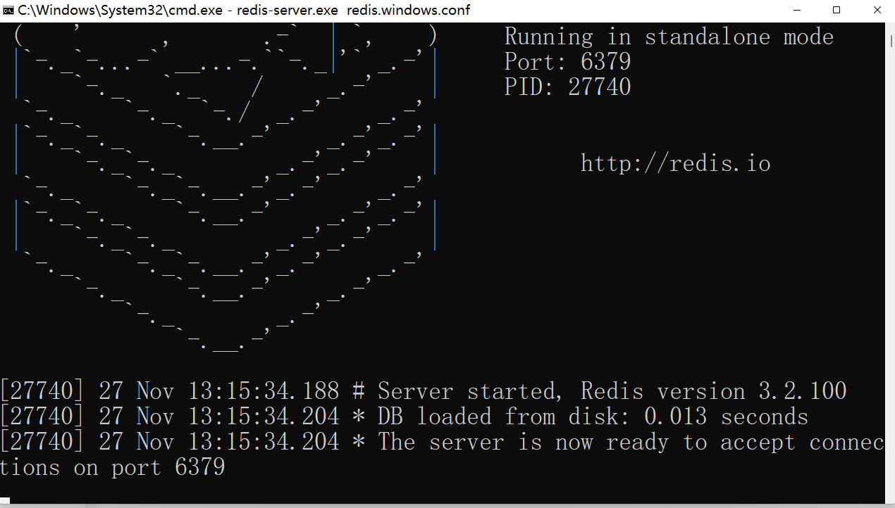
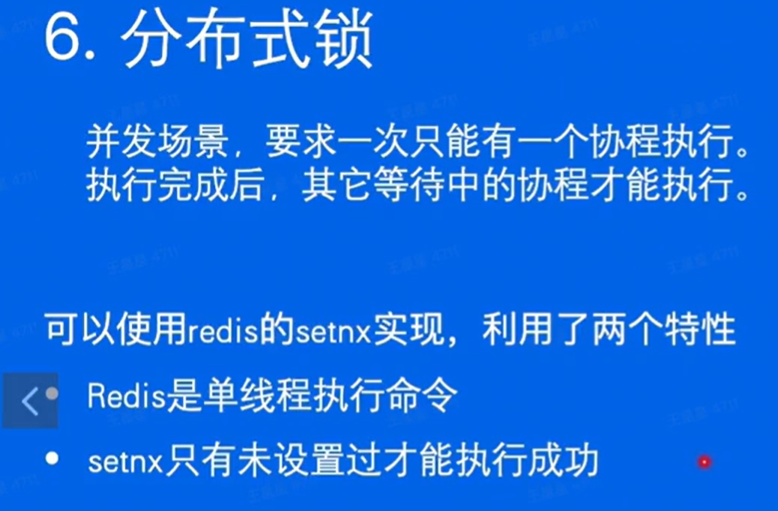

# 快速入门

redis是目前使用最广的k/v数据库，基本上各大项目都会使用，go-redis是golang操作redis的库，也是目前使用最多的库之一。

## 1. 入门案例

官方地址：https://github.com/go-redis/redis

[Redis下载和安装（Windows系统） (biancheng.net)](http://c.biancheng.net/redis/windows-installer.html)

报错：
redis服务在window下启动，报错：

Could not create server TCP listening socket 127.0.0.1:6379: bind: 操作成功完成。

[](https://img2022.cnblogs.com/blog/1765902/202203/1765902-20220308104155099-1935037969.png)

原因：
6379端口已绑定。应该是因为上次服务没有关闭

解决方法：
①依次输入命令：

- redis-cli.exe*（启动redis客户端，连接本机6379端口（127.0.0.1）并启动redis服务）*
- shutdown
- exit

[](https://img2022.cnblogs.com/blog/1765902/202203/1765902-20220308104102885-812179561.png)

②启动redis服务：redis-server.exe redis.windows.conf

[](

写入门案例之前，需要先启动一个redis：



在本机启动一个单机redis服务端，连接地址为`localhost:6379`

> 安装go-redis

```go
//redis 6
go get github.com/go-redis/redis/v8
//redis 7
go get github.com/go-redis/redis/v9
```

> 连接redis

```go
import "github.com/go-redis/redis/v8"

rdb := redis.NewClient(&redis.Options{
	Addr:	  "localhost:6379",
	Password: "", // no password set
	DB:		  0,  // use default DB
})
```

> 简单实例

```go
package main

import (
	"context"
	"fmt"
	"github.com/go-redis/redis/v8"
)

var rdb *redis.Client

func init() {
	rdb = redis.NewClient(&redis.Options{
		Addr:     "localhost:6379",
		Password: "", // no password set
		DB:       0,  // use default DB
	})
}
func main() {
	ctx := context.Background()
	//0代表永不过期
	err := rdb.Set(ctx, "gorediskey", "goredisvalue", 0).Err()//文本，key,value,time
	if err != nil {
		panic(err)
	}
	value, err := rdb.Get(ctx, "gorediskey").Result() //文本，key，返回value
	if err != nil {
		panic(err)
	}
	fmt.Println("gorediskey", value)

	//或者
	val, err := rdb.Do(ctx, "get", "gorediskey").Result()
    //这段代码首先使用rdb.Do()方法执行Redis命令，其中参数包括上下文(ctx)、命令名(“get”)，以及键名(“goredistest”)。然后，通过调用.Result()方法来获取命令的返回结果。
	if err != nil {
		if err == redis.Nil {
			fmt.Println("gorediskey 不存在")
			return
		}
		panic(err)
	}
	fmt.Println("do operator : gorediskey", val.(string))
}
```

## 2.连接设置

```go
type Options struct {
  // 网络类型：[ tcp , unix ]
  // 默认是 tcp
  Network string

  // host:port 地址
  Addr string

  // 要使用的 TLS 配置。 当设置 TLS 时将协商。
  TLSConfig *tls.Config
  //创建一个新的连接，优先于Newwork和Addr选项
  Dialer func(ctx context.Context, network, addr string) (net.Conn, error)
  // 新建一个redis连接的时候，会回调这个函数
  OnConnect func(ctx context.Context, cn *Conn) error
  // 当连接到使用 Redis ACL 系统的 Redis 6.0 或更高版本的实例时，
  // 使用指定的 用户名 对当前连接进行身份验证  (ACL 列表中定义的连接之一)。
  Username string

  // 可选密码。 
  // 必须与 requirepass 服务器配置选项中指定的密码（如果连接到 Redis 5.0 或更低版本的实例）
  // 或 连接到使用 Redis ACL 系统的 Redis 6.0 或更高版本的实例时的用户密码 匹配。
  Password string

  // 连接到服务器后要选择的数据库。
  DB int

  // ====== 重试、退避时间======
  // 放弃前的最大重试次数。
  // 默认是 3 次重试； -1（非 0）禁用重试。
  MaxRetries int
  // 每次重试之间的最小退避。
  // 默认为 8 毫秒； -1 禁用退避。
  MinRetryBackoff time.Duration
   // 每次重试之间的最大退避。
  // 默认为 512 毫秒； -1 禁用退避。
  MaxRetryBackoff time.Duration

  // ======连接超时、读超时、写超时======
  // 建立新连接的拨号超时。
  // 默认为 5 秒。
  DialTimeout time.Duration
  // 套接字读取超时。 
  // 如果达到，命令将失败并超时而不是阻塞。
  // 使用值 -1 表示无超时，使用 0 表示默认值。
  // 默认为 3 秒。
  ReadTimeout time.Duration
  // 套接字写入超时。 
  // 如果达到，命令将失败并超时而不是阻塞。
  // 默认为 ReadTimeout。
  WriteTimeout time.Duration

  // 连接池的类型。
  // FIFO 池为 true，LIFO 池为 false。
  // 请注意，与 lifo 相比，fifo 的开销更高。
  PoolFIFO bool

  // 最大套接字连接数。
  // 默认为每个可用 CPU 10 个连接，由 runtime.GOMAXPROCS 报告。  
  PoolSize int

  // 建立新连接缓慢时有用的最小空闲连接数。
  MinIdleConns int

  // 客户端退出（关闭）连接的连接年龄。
  // 默认是不关闭老化的连接。
  MaxConnAge time.Duration

  // 如果所有连接都忙，则客户端在返回错误之前等待连接的时间。
  // 默认为 ReadTimeout + 1 秒。
  PoolTimeout time.Duration

  // 客户端关闭空闲连接的时间。
  // 应该小于服务器的超时时间。
  // 默认为 5 分钟。 -1 禁用空闲超时检查。
  IdleTimeout time.Duration

  // 空闲连接 reaper 进行空闲检查的频率。
  // 默认为 1 分钟。 -1 禁用空闲连接reaper，
  // 但如果设置了 IdleTimeout，空闲连接仍会被客户端丢弃。
  IdleCheckFrequency time.Duration
  
  // 在从节点上启用只读查询。
  readOnly bool

  // 用于实现断路器或速率限制器的限制器接口。
  Limiter Limiter
}
```

# 基本使用

[Redis Desktop Manager(Redis可视化工具)安装及使用图文教程_Redis_脚本之家 (jb51.net)](https://www.jb51.net/article/282693.htm)

## 1.String类型

### 1. Set

```go
err := rdb.Set(ctx, "gorediskey", "goredisvalue", 0).Err()
	if err != nil {
		panic(err)
	}
```

### 2. Get

```go
value, err := rdb.Get(ctx, "gorediskey").Result()
	if err != nil {
		panic(err)
	}
	fmt.Println("gorediskey", value)
```

### 3. GetSet

设置一个key的值，并返回这个key的旧值

```go
oldVal, err := rdb.GetSet(ctx, "gorediskey", "new value").Result()

	if err != nil {
		panic(err)
	}
	// 打印key的旧值
	fmt.Println("key", oldVal)
```


### 4. SetNX（分布式锁） 




如果key不存在，则设置这个key的值

```go
  err := rdb.SetNX(ctx, "key1", "value", 0).Err()
	if err != nil {
		panic(err)
	}
```


### 5. MGet（批量查询key的值）

批量查询key的值

```go
vals, err := rdb.MGet(ctx, "key1", "key2", "key3").Result()
	if err != nil {
		panic(err)
	}
	fmt.Println(vals) //返回的是切片类型
```


### [#](https://www.mszlu.com/go/go-redis/02/02.html#_6-mset)6. MSet

批量设置key的值

```go
err := rdb.MSet(ctx, "key1", "value1", "key2", "value2", "key3", "value3").Err()
	if err != nil {
		panic(err)
	}
```

### [#](https://www.mszlu.com/go/go-redis/02/02.html#_7-incr-incrby)7. Incr,IncrBy（增值）

针对一个key的数值进行递增操作

```go
// Incr函数每次加一
	val, err := rdb.Incr(ctx, "key").Result()
	if err != nil {
		panic(err)
	}
	fmt.Println("最新值", val)

	// IncrBy函数，可以指定每次递增多少
	valBy, err := rdb.IncrBy(ctx, "key", 2).Result()
	if err != nil {
		panic(err)
	}
	fmt.Println("最新值", valBy)

	// IncrByFloat函数，可以指定每次递增多少，跟IncrBy的区别是累加的是浮点数
	valFloat, err := rdb.IncrByFloat(ctx, "key1", 2.2).Result()
	if err != nil {
		panic(err)
	}
	fmt.Println("最新值", valFloat)
```


### [#](https://www.mszlu.com/go/go-redis/02/02.html#_8-decr-decrby)8. Decr,DecrBy（针对一个key的数值进行递减操作）

针对一个key的数值进行递减操作

```go
// Decr函数每次减一
	val, err := rdb.Decr(ctx, "key").Result()
	if err != nil {
		panic(err)
	}
	fmt.Println("最新值", val)

	// DecrBy函数，可以指定每次递减多少
	valBy, err := rdb.DecrBy(ctx, "key", 2).Result()
	if err != nil {
		panic(err)
	}
	fmt.Println("最新值", valBy)
```


### [#](https://www.mszlu.com/go/go-redis/02/02.html#_9-del)9. Del

删除key操作，支持批量删除

```go
// 删除key
	rdb.Del(ctx, "key")

	// 删除多个key, Del函数支持删除多个key
	err := rdb.Del(ctx, "key1", "key2", "key3").Err()
	if err != nil {
		panic(err)
	}
```


### [#](https://www.mszlu.com/go/go-redis/02/02.html#_10-expire)10. Expire（设置key的过期时间）

设置key的过期时间

```go
rdb.Expire(ctx, "key", 3*time.Second)
```


## [#](https://www.mszlu.com/go/go-redis/02/02.html#_2-hash类型)2. Hash类型

### [#](https://www.mszlu.com/go/go-redis/02/02.html#_1-hset)1. HSet

根据key和field字段设置，field字段的值

```go
// user_1 是hash key，username 是字段名, zhangsan是字段值
err := rdb.HSet(ctx,"user_1", "username", "zhangsan").Err()
if err != nil {
	panic(err)
}
```


### [#](https://www.mszlu.com/go/go-redis/02/02.html#_2-hget)2. HGet

根据key和field字段，查询field字段的值

```go
// user_1 是hash key，username是字段名
username, err := rdb.HGet(ctx,"user_1", "username").Result()
if err != nil {
	panic(err)
}
fmt.Println(username)
```


### [#](https://www.mszlu.com/go/go-redis/02/02.html#_3-hgetall)3. HGetAll（查询所有字段和值）

根据key查询所有字段和值

```go
// 一次性返回key=user_1的所有hash字段和值
data, err := rdb.HGetAll(ctx,"user_1").Result()
if err != nil {
	panic(err)
}

// data是一个map类型，这里使用使用循环迭代输出
for field, val := range data {
	fmt.Println(field,val)
}
```


### [#](https://www.mszlu.com/go/go-redis/02/02.html#_4-hincrby)4. HIncrBy（根据key和field字段，累加字段的数值）

根据key和field字段，累加字段的数值

```go
// 累加count字段的值，一次性累加2， user_1为hash key
count, err := rdb.HIncrBy(ctx,"user_1", "count", 2).Result()
if err != nil {
	panic(err)
}

fmt.Println(count)
```


### [#](https://www.mszlu.com/go/go-redis/02/02.html#_5-hkeys)5. HKeys （所有字段名）

根据key返回所有字段名

```go
// keys是一个string数组
keys, err := rdb.HKeys(ctx,"user_1").Result()
if err != nil {
	panic(err)
}

fmt.Println(keys)
```


### [#](https://www.mszlu.com/go/go-redis/02/02.html#_6-hlen)6. HLen （查询字段数量）

根据key，查询hash的字段数量

```go
size, err := rdb.HLen(ctx,"user_1").Result()
if err != nil {
	panic(err)
}

fmt.Println(size)
```


### [#](https://www.mszlu.com/go/go-redis/02/02.html#_7-hmget)7. HMGet（批量查询）

根据key和多个字段名，批量查询多个hash字段值

```go
// HMGet支持多个field字段名，意思是一次返回多个字段值
vals, err := rdb.HMGet(ctx,"user_1","username", "count").Result()
if err != nil {
	panic(err)
}

// vals是一个数组
fmt.Println(vals)
```

###  HMSet （批量设置）

根据key和多个字段名和字段值，批量设置hash字段值

```go
// 初始化hash数据的多个字段值
data := make(map[string]interface{})
data["id"] = 1
data["username"] = "lisi"

// 一次性保存多个hash字段值
err := rdb.HMSet(ctx,"key", data).Err()
if err != nil {
	panic(err)
}
```


### [#](https://www.mszlu.com/go/go-redis/02/02.html#_9-hsetnx)9. HSetNX（分布式锁）

如果field字段不存在，则设置hash字段值

```go
err := rdb.HSetNX(ctx,"key", "id", 100).Err()
if err != nil {
	panic(err)
}
```


### [#](https://www.mszlu.com/go/go-redis/02/02.html#_10-hdel)10. HDel

根据key和字段名，删除hash字段，支持批量删除hash字段

```go
// 删除一个字段id
rdb.HDel(ctx,"key", "id")

// 删除多个字段
rdb.HDel(ctx,"key", "id", "username")
```

### HExists

检测hash字段名是否存在

```go
// 检测id字段是否存在
err := rdb.HExists(ctx,"key", "id").Err()
if err != nil {
	panic(err)
}
```


## [#](https://www.mszlu.com/go/go-redis/02/02.html#_3-list)3. List

### [#](https://www.mszlu.com/go/go-redis/02/02.html#_1-lpush)1. LPush（左边插入数据）

从列表左边插入数据

```go
// 插入一个数据
rdb.LPush(ctx,"key", "data1")

// LPush支持一次插入任意个数据
err := rdb.LPush(ctx,"key", 1,2,3,4,5).Err()
if err != nil {
	panic(err)
}
```


### [#](https://www.mszlu.com/go/go-redis/02/02.html#_2-lpushx)2. LPushX （分布式锁，仅当列表存在）

跟LPush的区别是，仅当列表存在的时候才插入数据,用法完全一样。

```go
err := rdb.LPushX(ctx, "key", "sss").Err()
	if err != nil {
		panic(err)
	}
```


### [#](https://www.mszlu.com/go/go-redis/02/02.html#_3-rpop)3. RPop（右边删除第一个数据，并返回删除的数据）

从列表的右边删除第一个数据，并返回删除的数据

```go
val, err := rdb.RPop(ctx,"key").Result()
if err != nil {
	panic(err)
}

fmt.Println(val)
```


### [#](https://www.mszlu.com/go/go-redis/02/02.html#_4-rpush)4. RPush （从列表右边插入数据）

从列表右边插入数据

```go
// 插入一个数据
rdb.RPush(ctx,"key", "data1")

// 支持一次插入任意个数据
err := rdb.RPush(ctx,"key", 1,2,3,4,5).Err()
if err != nil {
	panic(err)
}
```


### [#](https://www.mszlu.com/go/go-redis/02/02.html#_5-rpushx)5. RPushX

跟RPush的区别是，仅当列表存在的时候才插入数据, 他们用法一样

```go
err := rdb.RPushX(ctx,"key", "right_x").Err()
if err != nil {
	panic(err)
}
```


### [#](https://www.mszlu.com/go/go-redis/02/02.html#_6-lpop)6. LPop

从列表左边删除第一个数据，并返回删除的数据

```go
val, err := rdb.LPop(ctx,"key").Result()
if err != nil {
	panic(err)
}

fmt.Println(val)
```


### [#](https://www.mszlu.com/go/go-redis/02/02.html#_7-llen)7. LLen（返回列表的大小）

返回列表的大小

```go
val, err := rdb.LLen(ctx,"key").Result()
if err != nil {
	panic(err)
}

fmt.Println(val)
```


### [#](https://www.mszlu.com/go/go-redis/02/02.html#_8-lrange)8. LRange（返回列表的一个范围内的数据，也可以返回全部数据）

返回列表的一个范围内的数据，也可以返回全部数据

```go
// 返回从0开始到-1位置之间的数据，意思就是返回全部数据
vals, err := rdb.LRange(ctx,"key",0,-1).Result()
if err != nil {
	panic(err)
}
fmt.Println(vals)
```


### [#](https://www.mszlu.com/go/go-redis/02/02.html#_9-lrem)9. LRem （删除列表中的数据）

删除列表中的数据

```go
// 从列表左边开始，删除100， 如果出现重复元素，仅删除1次，也就是删除第一个
dels, err := rdb.LRem(ctx,"key",1,100).Result()
if err != nil {
	panic(err)
}

// 如果存在多个100，则从列表左边开始删除2个100
rdb.LRem(ctx,"key",2,100)


// 如果存在多个100，则从列表右边开始删除2个100
// 第二个参数负数表示从右边开始删除几个等于100的元素
rdb.LRem(ctx,"key",-2,100)

// 如果存在多个100，第二个参数为0，表示删除所有元素等于100的数据
rdb.LRem(ctx,"key",0,100)
```


### [#](https://www.mszlu.com/go/go-redis/02/02.html#_10-lindex)10. LIndex（根据索引坐标，查询列表中的数据）

根据索引坐标，查询列表中的数据

```go
// 列表索引从0开始计算，这里返回第6个元素
val, err := rdb.LIndex(ctx,"key",5).Result()
if err != nil {
	panic(err)
}

fmt.Println(val)
```


### [#](https://www.mszlu.com/go/go-redis/02/02.html#_11-linsert)11. LInsert（在指定位置插入数据）

在指定位置插入数据

```go
// 在列表中5的前面插入4
// before是之前的意思
err := rdb.LInsert(ctx,"key","before", 5, 4).Err()
if err != nil {
	panic(err)
}

// 在列表中 zhangsan 元素的前面插入 欢迎你
rdb.LInsert(ctx,"key","before", "zhangsan", "欢迎你")

// 在列表中 zhangsan 元素的后面插入 2022
rdb.LInsert(ctx,"key","after", "zhangsan", "2022")
```


## [#](https://www.mszlu.com/go/go-redis/02/02.html#_4-set)4. Set

### [#](https://www.mszlu.com/go/go-redis/02/02.html#_1-sadd)1. SAdd（添加集合元素）

添加集合元素

```go
// 添加100到集合中
err := rdb.SAdd(ctx,"key",100).Err()
if err != nil {
	panic(err)
}

// 将100,200,300添加到集合中
rdb.SAdd(ctx,"key",100, 200, 300)
```


### [#](https://www.mszlu.com/go/go-redis/02/02.html#_2-scard)2. SCard（获取集合元素个数）

获取集合元素个数

```go
size, err := rdb.SCard(ctx,"key").Result()
if err != nil {
	panic(err)
}
fmt.Println(size)
```


### [#](https://www.mszlu.com/go/go-redis/02/02.html#_3-sismember)3. SIsMember（判断元素是否在集合中）

判断元素是否在集合中

```go
// 检测100是否包含在集合中
ok, _ := rdb.SIsMember(ctx,"key", 100).Result()
if ok {
	fmt.Println("集合包含指定元素")
}
```


### [#](https://www.mszlu.com/go/go-redis/02/02.html#_4-smembers)4. SMembers（获取集合中所有的元素）

获取集合中所有的元素

```go
es, _ := rdb.SMembers(ctx,"key").Result()
// 返回的es是string数组
fmt.Println(es)
```


### [#](https://www.mszlu.com/go/go-redis/02/02.html#_5-srem)5. SRem（删除集合元素）

删除集合元素

```go
// 删除集合中的元素100
	rdb.SRem(ctx, "key", 100)

	// 删除集合中的元素200和300
	rdb.SRem(ctx, "key", 200, 300)
```


### [#](https://www.mszlu.com/go/go-redis/02/02.html#_6-spop-spopn)6. SPop,SPopN（随机返回集合中的元素，并且删除返回的元素）

随机返回集合中的元素，并且删除返回的元素

```go
// 随机返回集合中的一个元素，并且删除这个元素
val, _ := rdb.SPop(ctx,"key").Result()
fmt.Println(val)

// 随机返回集合中的5个元素，并且删除这些元素
vals, _ := rdb.SPopN(ctx,"key", 5).Result()
fmt.Println(vals)
```


## 5. sorted set（添加一个或者多个元素到集合，如果元素已经存在则更新分数）

### 1. ZAdd

添加一个或者多个元素到集合，如果元素已经存在则更新分数

```go
// 添加一个集合元素到集合中， 这个元素的分数是2.5，元素名是zhangsan
err := rdb.ZAdd(ctx, "key", &redis.Z{Score: 2.5, Member: "zhangsan"}).Err()
if err != nil {
		panic(err)
}	
```

### 2. ZCard

返回集合元素个数

```go
size, err := rdb.ZCard(ctx,"key").Result()
if err != nil {
	panic(err)
}
fmt.Println(size)
```

### 3. ZCount

统计某个分数范围内的元素个数

```go
// 返回： 1<=分数<=5 的元素个数, 注意："1", "5"两个参数是字符串
size, err := rdb.ZCount(ctx,"key", "1","5").Result()
if err != nil {
	panic(err)
}
fmt.Println(size)

// 返回： 1<分数<=5 的元素个数
// 说明：默认第二，第三个参数是大于等于和小于等于的关系。
// 如果加上（ 则表示大于或者小于，相当于去掉了等于关系。
size, err := rdb.ZCount(ctx,"key", "(1","5").Result()
```

### 4.增加元素的分数

```go
// 给元素zhangsan，加上2分
rdb.ZIncrBy(ctx,"key", 2,"zhangsan")
```

### 5. ZRange,ZRevRange

返回集合中某个索引范围的元素，根据分数从小到大排序

```go
// 返回从0到-1位置的集合元素， 元素按分数从小到大排序
// 0到-1代表则返回全部数据
vals, err := rdb.ZRange(ctx,"key", 0,-1).Result()
if err != nil {
	panic(err)
}

for _, val := range vals {
	fmt.Println(val)
}
```

ZRevRange用法跟ZRange一样，区别是ZRevRange的结果是按分数从大到小排序。

### r6. ZRangeByScore

根据分数范围返回集合元素，元素根据分数从小到大排序，支持分页。

```go
// 初始化查询条件， Offset和Count用于分页
op := redis.ZRangeBy{
	Min:"2", // 最小分数
	Max:"10", // 最大分数
	Offset:0, // 类似sql的limit, 表示开始偏移量 
	Count:5, // 一次返回多少数据
}
	
vals, err := rdb.ZRangeByScore(ctx,"key", &op).Result()
if err != nil {
	panic(err)
}

for _, val := range vals {
	fmt.Println(val)
}
```

### 7. ZRevRangeByScore

用法类似ZRangeByScore，区别是元素根据分数从大到小排序。

### 8. ZRangeByScoreWithScores

用法跟ZRangeByScore一样，区别是除了返回集合元素，同时也返回元素对应的分数

```go
// 初始化查询条件， Offset和Count用于分页
op := redis.ZRangeBy{
	Min:"2", // 最小分数
	Max:"10", // 最大分数
	Offset:0, // 类似sql的limit, 表示开始偏移量
	Count:5, // 一次返回多少数据
}

vals, err := rdb.ZRangeByScoreWithScores(ctx,"key", &op).Result()
if err != nil {
	panic(err)
}

for _, val := range vals {
	fmt.Println(val.Member) // 集合元素
	fmt.Println(val.Score) // 分数
}
```

### 9. ZRem

删除集合元素

```go
// 删除集合中的元素zhangsan
rdb.ZRem(ctx,"key", "zhangsan")

// 删除集合中的元素zhangsan和zhangsan1
// 支持一次删除多个元素
rdb.ZRem(ctx,"key", "zhangsan", "zhangsan1")
```

### 10. ZRemRangeByRank

根据索引范围删除元素

```go
// 集合元素按分数排序，从最低分到高分，删除第0个元素到第5个元素。
// 这里相当于删除最低分的几个元素
rdb.ZRemRangeByRank(ctx,"key", 0, 5)

// 位置参数写成负数，代表从高分开始删除。
// 这个例子，删除最高分数的两个元素，-1代表最高分数的位置，-2第二高分，以此类推。
rdb.ZRemRangeByRank(ctx,"key", -1, -2)
```


### 11.ZRemRangeByScore

根据分数范围删除元素

```go
// 删除范围： 2<=分数<=5 的元素
rdb.ZRemRangeByScore(ctx,"key", "2", "5")

// 删除范围： 2<=分数<5 的元素
rdb.ZRemRangeByScore(ctx,"key", "2", "(5")
```

### 12. ZScore（查询元素对应的分数）

查询元素对应的分数

```go
// 查询集合元素zhangsan的分数
score, _ := rdb.ZScore(ctx,"key", "zhangsan").Result()
fmt.Println(score)
```

### 13. ZRank（集合元素按分数从小到大排序）

根据元素名，查询集合元素在集合中的排名，从0开始算，集合元素按分数从小到大排序

```go
rk, _ := rdb.ZRank(ctx,"key", "zhangsan").Result()
fmt.Println(rk)
```

ZRevRank的作用跟ZRank一样，区别是ZRevRank是按分数从大到小排序。

## Redis切换存储数据库

Redis一共有划分十六个编号的存储数据库，分别是0到15号。

命令行切换命令为：

```
 Select 1 
```

选择数据库第二个数据库，数据库编号为1

在go中可以使用do函数进行使用Redis命令来切换数据库：

```go
	_, err = rdb.Do(context.Background(), "Select", 0).Result() //切换到第一个数据库存储 
	if err != nil {
		panic(err)
	}
```


# 其他操作

## [#](https://www.mszlu.com/go/go-redis/03/03.html#_1-发布订阅)1. 发布订阅

Redis提供了发布订阅功能，可以用于消息的传输，Redis的发布订阅机制包括三个部分，发布者，订阅者和Channel。


发布者和订阅者都是Redis客户端，Channel则为Redis服务器端，发布者将消息发送到某个的频道，订阅了这个频道的订阅者就能接收到这条消息。

### [#](https://www.mszlu.com/go/go-redis/03/03.html#_1-subscribe)1. Subscribe

订阅channel

```go
	// 订阅channel1这个channel
	sub := rdb.Subscribe(ctx, "channel1")
	// sub.Channel() 返回go channel，可以循环读取redis服务器发过来的消息
	for msg := range sub.Channel() {
		// 打印收到的消息
		fmt.Println(msg.Channel)
		fmt.Println(msg.Payload)
	}
//或者
for {
		msg, err := sub.ReceiveMessage(ctx)
		if err != nil {
			panic(err)
		}
		fmt.Println(msg.Channel, msg.Payload)
	}
```


### [#](https://www.mszlu.com/go/go-redis/03/03.html#_2-publish)2. Publish

将消息发送到指定的channel

```go
// 将"message"消息发送到channel1这个通道上
rdb.Publish(ctx,"channel1","message")
```


### [#](https://www.mszlu.com/go/go-redis/03/03.html#_3-psubscribe)3. PSubscribe

用法跟Subscribe一样，区别是PSubscribe订阅通道(channel)支持模式匹配。

```go
// 订阅channel1这个channel
sub := rdb.PSubscribe(ctx,"ch_user_*")
// 可以匹配ch_user_开头的任意channel
```

1
2
3

### [#](https://www.mszlu.com/go/go-redis/03/03.html#_4-unsubscribe)4. Unsubscribe

取消订阅

```go
// 订阅channel1这个channel
sub := rdb.Subscribe(ctx,"channel1")
// 取消订阅
sub.Unsubscribe(ctx,"channel1")
```

1
2
3
4

### [#](https://www.mszlu.com/go/go-redis/03/03.html#_5-pubsubnumsub)5. PubSubNumSub

查询指定的channel有多少个订阅者

```go
// 查询channel_1通道的订阅者数量
	chs, _ := rdb.PubSubNumSub(ctx, "channel_1").Result()
	for ch, count := range chs {
		fmt.Println(ch)    // channel名字
		fmt.Println(count) // channel的订阅者数量
	}
```


## [#](https://www.mszlu.com/go/go-redis/03/03.html#_2-事务处理)2. 事务处理

redis事务可以一次执行多个命令， 并且带有以下两个重要的保证：

- 事务是一个单独的隔离操作：事务中的所有命令都会序列化、按顺序地执行。事务在执行的过程中，不会被其他客户端发送来的命令请求所打断。
- 事务是一个原子操作：事务中的命令要么全部被执行，要么全部都不执行。

### [#](https://www.mszlu.com/go/go-redis/03/03.html#_1-txpipeline)1. TxPipeline

以Pipeline的方式操作事务

```go
// 开启一个TxPipeline事务
pipe := rdb.TxPipeline()

// 执行事务操作，可以通过pipe读写redis
incr := pipe.Incr(ctx,"tx_pipeline_counter")
pipe.Expire(ctx,"tx_pipeline_counter", time.Hour)

// 上面代码等同于执行下面redis命令
//
//     MULTI
//     INCR pipeline_counter
//     EXPIRE pipeline_counts 3600
//     EXEC

// 通过Exec函数提交redis事务
_, err := pipe.Exec(ctx)

// 提交事务后，我们可以查询事务操作的结果
// 前面执行Incr函数，在没有执行exec函数之前，实际上还没开始运行。
fmt.Println(incr.Val(), err)
```

### [#](https://www.mszlu.com/go/go-redis/03/03.html#_2-watch)2. watch

redis乐观锁支持，可以通过watch监听一些Key, 如果这些key的值没有被其他人改变的话，才可以提交事务

```go
ctx := context.Background()

	// 定义一个回调函数，用于处理事务逻辑
	fn := func(tx *redis.Tx) error {
		// 先查询下当前watch监听的key的值
		v, err := tx.Get(ctx, "key").Int()
		if err != nil && err != redis.Nil {
			return err
		}
		// 这里可以处理业务
		v++

		// 如果key的值没有改变的话，Pipelined函数才会调用成功
		_, err = tx.Pipelined(ctx, func(pipe redis.Pipeliner) error {
			// 在这里给key设置最新值
			pipe.Set(ctx, "key", v, 0)
			return nil
		})
		return err
	}

	// 使用Watch监听一些Key, 同时绑定一个回调函数fn, 监听Key后的逻辑写在fn这个回调函数里面
	// 如果想监听多个key，可以这么写：client.Watch(ctx,fn, "key1", "key2", "key3")
	rdb.Watch(ctx, fn, "key")
```