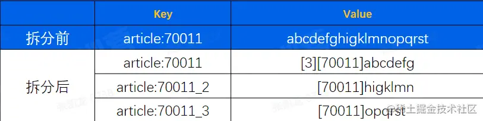

# Redis介绍和使用 ｜ 青训营笔记


# 一：Redis简介

## 1：出现背景

- 数据从单表，演进出了分库分表
- MySoL从单机演进出了集群
  - 数据量增长
  - 读写数据压力的不断增加


- 数据分冷热
  - 热数据:经常被访问到的数据
- 将热数据存储到内存中


## 2：Redis工作原理

- 数据从内存中读写

- 数据保存到硬盘上防止重启数据丢失

  - 增量数据保存到AOF文件

  

  - 全量数据RDB文件

  

- 单线程处理所有操作命令


# 二：Redis应用案例

## 1：实际应用场景

### （1）连续签到

- 用户每日有一次签到的机会，如果断签，连续签到计数将归0。
- 连续签到的定义:每天必须在23:59:59前签到
- Key: cc_uid_1165894833417101
- value: 252
- expireAt:后天的0点

```go
go复制代码// Ex01 连续签到天数

func Ex01(ctx context.Context, params []string) {

	if userID, err := strconv.ParseInt(params[0], 10, 64); err == nil {

		addContinuesDays(ctx, userID)

	} else {

		fmt.Printf("参数错误, params=%v, error: %v\n", params, err)

	}

}
// addContinuesDays 为用户签到续期

func addContinuesDays(ctx context.Context, userID int64) {

	key := fmt.Sprintf(continuesCheckKey, userID)

	// 1. 连续签到数+1

	err := RedisClient.Incr(ctx, key).Err()

	if err != nil {

		fmt.Errorf("用户[%d]连续签到失败", userID)

	} else {

		expAt := beginningOfDay().Add(48 * time.Hour)

		// 2. 设置签到记录在后天的0点到期

		if err := RedisClient.ExpireAt(ctx, key, expAt).Err(); err != nil {

			panic(err)

		} else {

			// 3. 打印用户续签后的连续签到天数

			day, err := getUserCheckInDays(ctx, userID)

			if err != nil {

				panic(err)

			}

			fmt.Printf("用户[%d]连续签到：%d(天), 过期时间:%s", userID, day, expAt.Format("2006-01-02 15:04:05"))

		}

	}

}
```

### （2）消息通知

- 用list作为消息队列
- 传用场景:消息通知。
  - 例如当文章更新时，将更新后的文章推送到ES，用户就能搜索到最新的文章数据


### （3）计数

一个用户有多项计数需求，可通过hash结构存储


### （4）排行榜

- 积分变化时，排名要实时变更
- 结合dict后，可实现通过key操作跳表的功能
  - zINCRBY myzset 2 "A1ex"
  - zSCORE myzset "A1ex"


### （5）限流

- 要求1秒内放行的请求为N，超过N则禁止访问
- Key: comment_freq_limit_1671356046
- 对这个Key调用incr，超过限制N则禁止访问
- 1671356046是当前时间戳


### （6）分布式锁

- 并发场景，要求一次只能有一个协程执行。执行完成后，其它等待中的协程才能执行。
- 可以使用redis的setnx实现，利用了两个特性
  - Redis是单线程执行命令
  - setnx只有未设置过才能执行成功


## 2：常用数据结构

### （1）string

- 数据结构-sds
- 可以存储字符串、数字、二进制数据
- 通常和expire配合使用
- 场景:存储计数、Session


### （2）list数据结构quicklist

Quicklist由一个双向链表和listpack实现


### （3）listpack


### （4）hash数据结构dict

- rehash: rehash操作是将ht[0]中的数据.全部迁移到ht[1]中。数据量小的场景下,直接将数据从ht[0]拷贝到ht[1]速度是较快的。数据量大的场景，例如存有上百万的KV时，迁移过程将会明显阻塞用户请求。
- 渐进式rehash:为避免出现这种情况，使用了rehash方案。基本原理就是，每次用户访问时都会迁移少量数据。将整个迁移过程，平摊到所有的访问用户请求过程中。

  

### （5）zset数据结构zskiplist

- 查找数字7的路径，head,3,3,7
- 结合dict后，可实现通过key操作跳表的功能
  - 之工NCRBY myzset 2 "Alex"
  - zSCORE myzset "Alex"


# 三：Redis使用注意事项

## 1：大key


- 大Key的危害
  - 读取成本高
  - 容易导致慢查询(过期、删除)
  - 主从复制异常,服务阻塞，无法正常响应请求
- 业务侧使用大Key的表现
  - 请求Redis超时报错


### 消除大key的方法

- 拆分
  - 将大key拆分为小key。例如一个String拆分成多个String



- 压缩
  -  将value压缩后写入redis，读取时解压后再使用。压缩算法可以是gzip、snappy、lz4等。通常情况下,一个压缩算法压缩率高、则解压耗时就长。需要对实际数据进行测试后，选择一个合适的算法
  - 如果存储的是JSON字符串，可以考虑使用MessagePack进行序列化。
- 集合类结构hash、list、set、set
  - **拆分:可以用hash取余、位掩码的方式决定放在哪个key中
  - **区分冷热:如榜单列表场景使用zset，只缓存前10页数据，后续数据走db**

## 2：热key

- 热Key的定义
  - 用户访问一个Key的QPS特别高，导致Server实例出现CPU负载突增或者不均的情况。热key没有明确的标准,QPS超过500就有可能被识别为热Key
  - *QPS*即每秒查询率，是对一个特定的查询服务器在规定时间内所处理流量多少的衡量标准。*QPS* = req/sec = 请求数/秒，即每秒的响应请求数，也即是最大吞吐能力。 


### 解决热Key的方法

- 设置Localcache
  - 在访问Redis前，在业务服务侧设置Localcache，降低访问Redis的QPS。LocalCache中缓存过期或未命中，则从Redis中将数据更新到LocalCache。Java的Guava、Golang的Bigcache就是这类LocalCache


- 拆分
  - 将keyvalue这一个热Key复制写入多份，例如key1.value,key2:value，访问的时候访问多个key，但value是同一个.以此将qps分散到不同实例上，降低负载。代价是，更新时需要更新多个key，存在数据短暂不一致的风险


- 使用Redis代理的热Key承载能力
  - 字节跳动的Redis访问代理就具备热Key承载能力。本质上是结合了"热Key发现"、"LocalCache"两个功能


## 3：慢查询情景

- 容易导致redis慢查询的操作
  - 批量操作一次性传入过多的key/value，如mset/hmset/sadd/zadd等O(n)操作 ，建议单批次不要超过100，超过100之后性能下降明显。
  - zset大部分命令都是O(log(n))、当大小超过5k以上时，简单的zadd/zrem也可能导致慢查询
  - 操作的单个value过大，超过10KB。也即，避免使用大Key
  - 对大key的delete/expire操作也可能导致慢查询，Redis4.0之前不支持异步删除unlink，大key删除会阻塞Redis

## 4：缓存穿透、缓存雪崩

- 缓存穿透:热点数据查询绕过缓存,直接查询数据库
- 缓存雪崩:大量缓存同时过期
- 缓存穿透的危害
  - 查询一个一定不存在的数据
    - 通常不会缓存不存在的数据，这类查询请求都会直接打到db，如果有系统bug或人为攻击，那么容易导致db响应慢甚至宕机
  - 缓存过期时
    - 在高并发场景下，一个热key如果过期，会有大量请求同时击穿至db，容易影响db性能和稳定。
    - 同一时间有大量key集中过期时，也会导致大量请求落到db上，导致查询变慢，甚至出现db无法响应新的查询
- 如何减少缓存穿透
  - 缓存空值
    - 如一个不存在的userlD。这个id在缓存和数据库中都不存在。则可以缓存一个空值，下次再查缓存直接反空值。
  - 布隆过滤器
    - 通过bloom filter算法来存储合法Key，得益于该算法超高的压缩率，只需占用极小的空间就能存储大量key值
- 如何避免缓存雪崩
  - 缓存空值
    - 将缓存失效时间分散开，比如在原有的失效时间基础上增加一个随机值，例如不同Key过期时间，
    - 可以设置为10分1秒过期,10分23秒过期,10分8秒过期。单位秒部分就是随机时间，这样过期时间就分散了。
    - 对于热点数据，过期时间尽量设置得长一些，冷门的数据可以相对设置过期时间短一些。
  - 使用缓存集群，避免单机宕机造成的缓存雪崩。