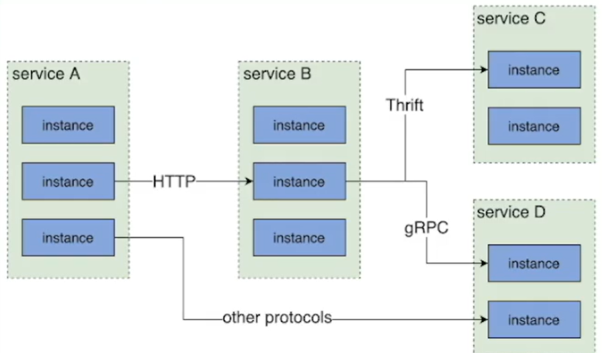

# 微服务架构原理与治理实践|青训营笔记


## 微服务架构介绍

系统架构需要演进。
单体-》
垂直应用（按照业务线垂直划分-》
分布式（抽出与业务无关的公共模块-》
SOA(面向服务,服务注册中心-》
微服务(彻底的服务化，由下而上，故障隔离，开发效率高

### 核心因素

- 服务治理
- 可观测性
- 安全性

## 微服务架构原理及特征

**服务**：一组具有**相同逻辑**的**运行实体** 。一个服务的所有实例必须运行相同代码 **实例**：服务中每个运行实体即为一个实例
**集群**：服务内部的逻辑划分，每个集群包含多个实例
**实例与进程的关系**：一个实例可以对应一个或多个进程。实例和进程之间没有必然的对应关系
**常见的实例承载形式**：进程、VM、K8S pod
**有状态/无状态服务**：服务中是否存储了可持久化数据


[Hadoop](https://baike.baidu.com/item/Hadoop/3526507?fromModule=lemma_inlink)[分布式文件系统](https://baike.baidu.com/item/分布式文件系统/1250388?fromModule=lemma_inlink)(HDFS)是指被设计成适合运行在通用硬件(commodity hardware)上的分布式[文件系统](https://baike.baidu.com/item/文件系统/4827215?fromModule=lemma_inlink)（Distributed File System）。它和现有的分布式文件系统有很多共同点。但同时，它和其他的分布式文件系统的区别也是很明显的。HDFS是一个高度[容错性](https://baike.baidu.com/item/容错性/9131391?fromModule=lemma_inlink)的系统，适合部署在廉价的机器上。HDFS能提供高[吞吐量](https://baike.baidu.com/item/吞吐量/157092?fromModule=lemma_inlink)的数据访问，非常适合大规模[数据集](https://baike.baidu.com/item/数据集/4745883?fromModule=lemma_inlink)上的应用。HDFS放宽了一部分[POSIX](https://baike.baidu.com/item/POSIX/3792413?fromModule=lemma_inlink)约束，来实现流式读取文件系统数据的目的。HDFS在最开始是作为[Apache](https://baike.baidu.com/item/Apache/6265?fromModule=lemma_inlink) Nutch搜索引擎项目的基础架构而开发的。HDFS是[Apache Hadoop](https://baike.baidu.com/item/Apache Hadoop/18754243?fromModule=lemma_inlink) Core项目的一部分。

#### 服务间的通信

单体服务的不同模块通信是简单的函数调用
微服务的服务间通信是网络传输。服务间通信使用不同的协议。

*Thrift* 是一个软件框架（远程过程调用框架），用来进行可扩展且跨语言的服务的开发。



1. 在代码层面，如何指定调用目标服务的地址(ip:port? 一般不会指定固定的地址。如果一个服务多个实例，只能返回一个ip，且服务的地址可能是动态改变的。

```go
// Service A wants to call service B
client := grpc.NewClient("") //本地DNS:端口
```

2.如果使用DNS指定目的地址，部分来看是可以的，但是**dns缓存会导致延时，且存在负载均衡问题，不支持服务实例的探活检查，域名无法配置端口**。

**解决思路：**以DNS思想为启发，**使用服务注册中心Service Registry**，用于存储服务名到服务实例的映射。

- 服务上线和下线的过程？
  服务下线前先在服务注册中心删除该服务，再下线服务是安全的。
  服务上线时需要先启动添加，health check（发送请求试探），再将服务注册到注册中心，恢复流量。
- 

### 流量特征

基于流量的微服务。终端进入内网intranet->api gateway->servcie->offline training job.
rpc是二进制协议，内部的服务调用采用rpc。


## 核心服务治理能力

### 服务发布deployment

让一个服务升级运行新的代码的过程。
在线服务的发布可能出现：

1.服务不可用

2.服务抖动

3.服务回滚的问题

- 蓝绿部署。将实例分类后，分别部署
- 金丝雀发布 流量控制和回滚问题

### 流量治理

基于**地区、集群、实例、请求**等维度，对端到端流量的路由路径进行精确的流量控制。

### 负载均衡

负载分配请求在每个下游实例上的分布

### 稳定性治理

线上问题会出问题但与程序的正确性无关。

- 限流 reject 部分qps
- 熔断
- 过载保护 dynamic overload
- 降级

## 字节跳动服务治理实践---对请求重试机制进行探索

```go
go复制代码func LocalFunc(x int) int{
    res:=calculate(x*2)
    return res
   }
```

对于一个普通的本地函数调用，可能出现哪些异常？

- 参数非法
- OOM
- NPE Null Pointer Exception
- 边界case
- 系统崩溃
- 死循环
- 程序异常退出 当然，该函数**没有重试必要**。

```go
go复制代码func RemoteFunc(ctx context.Context,x int)(int,error){
          ctx2,defer_func:=context.WithTimeout(ctx,time.Second)
         defer defer_func()
         res,err:=grpc_client.Calculate(ctx2,x*2)
         return res,err
 }
```

对于该远程调用函数，可能会出现哪些异常？

- 网络抖动
- 下游负载高导致超时
- 下游机器宕机
- 本地机器负载高，调度超时
- 下游熔断、限流
- 。。。 对上述函数进行充实，避免偶发错误
- 提高SLA(service-level agreement
- 降低错误率
- 降低长尾延时（对于偶尔耗时较长的请求，重试请求有机会提前返回
- 容忍暂时性错误
- 避开下游故障实例

```go
go复制代码func RemoteFuncRetry(ctx context.Context,x int)(res int,err error){
//重试三次
    for i:=0;i<3;i++{
        if res,err=RemoteFunc(ctx,x);err==nil{
            return 
            }
        }
    return 
    }
```

那么，为什么默认不使用重试？

- 部分请求不具有**幂等性**。
- 重试风暴
  - 微服务调用链路较多，上游的每次重试都会带动下游，可能使下游机器宕机 解决重试风暴：
  - 可以限制重试比例，设置重试比例阈值，重试次数占所有请求比例不超过该阈值。
  - 可以防止链路重试。链路层面的防止重试风暴的核心是限制每层都重试，理想情况下只有下一层重试。如果链路失败返回特殊的status标明“请求失败，但别重试”
  - **Hedged requests**.对于延迟高或可能超时的请求，重新向下一个下游实例发送相同请求，等待先达到的响应。
- 超时设置