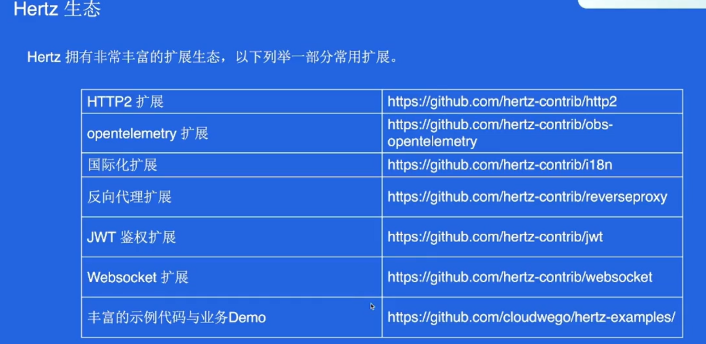

#  Go框架三件套详解 ｜ 青训营笔记

## 前言

> 记录加入青训营的每一天的笔记
>
> 今天这次的笔记是对于Go框架(Gorm、Kitex、Hertz)三件套的内容

## 学习如何安装 Docker/Postman/Git/Golang

- 安装 Minikube 或 Docker Desktop 用于使用 Docker [安装教程](https://link.juejin.cn/?target=https%3A%2F%2Fwww.runoob.com%2Fdocker%2Fwindows-docker-install.html)
  - 可以使用 Minikube 或者使用 Docker Desktop 启动 Docker
- 安装 Postman
- 安装 Git [安装教程](https://link.juejin.cn/?target=https%3A%2F%2Fwww.liaoxuefeng.com%2Fwiki%2F896043488029600%2F896067074338496)
- 安装 Go(Golang >= 1.15) [安装教程](https://link.juejin.cn/?target=https%3A%2F%2Fgo.dev%2Fdoc%2Finstall)

# 框架体验部分

> 提前体验一下课程涉及的 HTTP/RPC/ORM 框架

## HTTP 框架 Hertz 初体验

通过阅读 [www.cloudwego.io/zh/docs/her…](https://link.juejin.cn/?target=https%3A%2F%2Fwww.cloudwego.io%2Fzh%2Fdocs%2Fhertz%2Fgetting-started%2F) 尝试运行 Hertz 的示例代码

- Hertz 框架地址: [github.com/cloudwego/h…](https://link.juejin.cn/?target=https%3A%2F%2Fgithub.com%2Fcloudwego%2Fhertz)

## RPC 框架 Kitex 初体验

通过阅读 [www.cloudwego.io/zh/docs/kit…](https://link.juejin.cn/?target=https%3A%2F%2Fwww.cloudwego.io%2Fzh%2Fdocs%2Fkitex%2Fgetting-started%2F) 尝试运行 Kitex 的示例代码

- kitex 暂时没有针对 Windows 做支持，如果本地开发环境是 Windows 建议使用 [WSL2](https://link.juejin.cn/?target=https%3A%2F%2Fdocs.microsoft.com%2Fzh-cn%2Fwindows%2Fwsl%2Finstall)
- KItex 框架地址: [github.com/cloudwego/k…](https://link.juejin.cn/?target=https%3A%2F%2Fgithub.com%2Fcloudwego%2Fkitex%2F)

## ORM 框架 Gorm 初体验

通过阅读 [gorm.cn/docs/#Insta…](https://link.juejin.cn/?target=https%3A%2F%2Fgorm.cn%2Fdocs%2F%23Install) 尝试运行 Gorm 的示例代码

- Gorm 框架地址: [github.com/go-gorm/gor…](https://link.juejin.cn/?target=https%3A%2F%2Fgithub.com%2Fgo-gorm%2Fgorm)

## 三件套介绍

> Gorm、Kitex、Hertz的基本用法与常见的API讲解

### Gorm（ORM框架）

> gorm是Golang语言中一个已经迭代数十年且功能强大、性能极好的ORM框架

ORM：Object Relational Mapping(**对象关系映射**)，其主要作用是在编程中，把**面向对象**的概念跟数据库中**表的概念**对应起来，

简单来说，在golang中，自定义的一个结构体对应着一张表，结构体的实例则对应着表中的一条记录。

### Kitex（微服务RPC框架）

> Kitex是字节内部Golang微服务RPC框架 具有高性能、强可扩展的主要特点 支持多协议并且拥有丰富的开源扩展

### Hertz（Http框架）

> Hertz是字节内部的Http框架 参考了其他开源框架的优势 结合字节跳动内部的需求 具有高可用、高性能、高扩展性的特点

## 三件套使用

### Gorm

> 该部分笔记主要参考：[gorm.io/zh_CN/docs](https://link.juejin.cn/?target=https%3A%2F%2Fgorm.io%2Fzh_CN%2Fdocs)


#### 声明模型

##### 模型定义

模型是标准的 struct，由 Go 的基本数据类型、实现了 [Scanner](https://link.juejin.cn/?target=https%3A%2F%2Fpkg.go.dev%2Fdatabase%2Fsql%2F%3Ftab%3Ddoc%23Scanner) 和 [Valuer](https://link.juejin.cn/?target=https%3A%2F%2Fpkg.go.dev%2Fdatabase%2Fsql%2Fdriver%23Valuer) 接口的自定义类型及其指针或别名组成

```go
go复制代码type User struct {
  ID           uint
  Name         string
  Email        *string
  Age          uint8
  Birthday     *time.Time
  MemberNumber sql.NullString
  ActivatedAt  sql.NullTime
  CreatedAt    time.Time
  UpdatedAt    time.Time
}
```

##### 约定

GORM 倾向于约定优于配置

默认情况下，GORM 使用 `ID` 作为主键，使用结构体名的 `蛇形复数` 作为表名，字段名的 `蛇形` 作为列名，并使用 `CreatedAt`、`UpdatedAt` 字段追踪创建、更新时间

##### gorm.Model

GORM 定义一个 `gorm.Model` 结构体，其包括字段 `ID`、`CreatedAt`、`UpdatedAt`、`DeletedAt`

```go
go复制代码// gorm.Model 的定义
type Model struct {
  ID        uint           `gorm:"primaryKey"`
  CreatedAt time.Time
  UpdatedAt time.Time
  DeletedAt gorm.DeletedAt `gorm:"index"`
}
```

还可以将它**嵌入**到结构体中，以包含这几个字段，例如：

```go
go复制代码type User struct {
  gorm.Model
  Name string
}
// 等效于
type User struct {
  ID        uint           `gorm:"primaryKey"`
  CreatedAt time.Time
  UpdatedAt time.Time
  DeletedAt gorm.DeletedAt `gorm:"index"`
  Name string
}
```

#### 连接到数据库

GORM 官方支持的数据库类型有： MySQL, PostgreSQL, SQlite, SQL Server

##### MySQL

```go
go复制代码import (
  "gorm.io/driver/mysql"
  "gorm.io/gorm"
)

func main() {
  // 参考 https://github.com/go-sql-driver/mysql#dsn-data-source-name 获取详情
  dsn := "user:pass@tcp(127.0.0.1:3306)/dbname?charset=utf8mb4&parseTime=True&loc=Local"
  db, err := gorm.Open(mysql.Open(dsn), &gorm.Config{})
}
```

**注意：** 想要正确的处理 `time.Time` ，您需要带上 `parseTime` 参数， 要支持完整的 UTF-8 编码，您需要将 `charset=utf8` 更改为 `charset=utf8mb4`

##### 使用现有数据库连接

GORM 允许通过一个现有的数据库连接来初始化 `*gorm.DB`

```go
go复制代码import (
  "database/sql"
  "gorm.io/driver/mysql"
  "gorm.io/gorm"
)

sqlDB, err := sql.Open("mysql", "mydb_dsn")
gormDB, err := gorm.Open(mysql.New(mysql.Config{
  Conn: sqlDB,
}), &gorm.Config{})
```

#### CRUD接口

##### 创建

'grom : primarykey' 定义字段为主键

'grom : "column : code" ' 定义列名

'grom : "default : 18" ' 定义字段默认值


###### 创建记录

```go
user := User{Name: "Jinzhu", Age: 18, Birthday: time.Now()}

result := db.Create(&user) // 通过数据的指针来创建

user.ID             // 返回插入数据的主键
result.Error        // 返回 error
result.RowsAffected // 返回插入记录的条数
```

###### 批量插入

将切片数据传递给 `Create` 方法，GORM 将生成一个单一的 SQL 语句来插入所有数据，并回填主键的值，钩子方法也会被调用。

```css
css复制代码var users = []User{{Name: "jinzhu1"}, {Name: "jinzhu2"}, {Name: "jinzhu3"}}
DB.Create(&users)

for _, user := range users {
  user.ID // 1,2,3
}
```

###### 通过Map数据类型创建记录

GORM 支持根据 `map[string]interface{}` 和 `[]map[string]interface{}{}` 创建记录

```go
go复制代码DB.Model(&User{}).Create(map[string]interface{}{
  "Name": "jinzhu", "Age": 18,
})

// 根据 `[]map[string]interface{}{}` 批量插入
DB.Model(&User{}).Create([]map[string]interface{}{
  {"Name": "jinzhu_1", "Age": 18},
  {"Name": "jinzhu_2", "Age": 20},
})
```

##### 查询

 

###### 检索单个对象

GORM 提供了 `First`、`Take`、`Last` 方法，以便从数据库中检索单个对象。当查询数据库时它添加了 `LIMIT 1` 条件，且没有找到记录时，它会返回 `ErrRecordNotFound` 错误

```sql
sql复制代码// 获取第一条记录（主键升序）
db.First(&user)
// SELECT * FROM users ORDER BY id LIMIT 1;

// 获取一条记录，没有指定排序字段
db.Take(&user)
// SELECT * FROM users LIMIT 1;

// 获取最后一条记录（主键降序）
db.Last(&user)
// SELECT * FROM users ORDER BY id DESC LIMIT 1;

result := db.First(&user)
result.RowsAffected // 返回找到的记录数
result.Error        // returns error

// 检查 ErrRecordNotFound 错误
errors.Is(result.Error, gorm.ErrRecordNotFound)

```

`First`、`Last` 方法会根据主键查找到第一个、最后一个记录， 它仅在通过 struct 或提供 model 值进行查询时才起作用。如果 model 类型没有定义主键，则按第一个字段排序

```go
go复制代码var user User

// 可以
DB.First(&user)
// SELECT * FROM `users` ORDER BY `users`.`id` LIMIT 1

// 可以
result := map[string]interface{}{}
DB.Model(&User{}).First(&result)
// SELECT * FROM `users` ORDER BY `users`.`id` LIMIT 1

// 不行
result := map[string]interface{}{}
DB.Table("users").First(&result)

// 但可以配合 Take 使用
result := map[string]interface{}{}
DB.Table("users").Take(&result)

// 根据第一个字段排序
type Language struct {
  Code string
  Name string
}
DB.First(&Language{})
// SELECT * FROM `languages` ORDER BY `languages`.`code` LIMIT 1

```

###### 检索对象

```go
go复制代码// 获取全部记录
result := db.Find(&users)
// SELECT * FROM users;

result.RowsAffected // 返回找到的记录数，相当于 `len(users)`
result.Error        // returns error
```

###### 条件查询

**String条件**

```sql
sql复制代码// 获取第一条匹配的记录
db.Where("name = ?", "jinzhu").First(&user)
// SELECT * FROM users WHERE name = 'jinzhu' ORDER BY id LIMIT 1;

// 获取全部匹配的记录
db.Where("name <> ?", "jinzhu").Find(&users)
// SELECT * FROM users WHERE name <> 'jinzhu';

// IN
db.Where("name IN ?", []string{"jinzhu", "jinzhu 2"}).Find(&users)
// SELECT * FROM users WHERE name IN ('jinzhu','jinzhu 2');

// LIKE
db.Where("name LIKE ?", "%jin%").Find(&users)
// SELECT * FROM users WHERE name LIKE '%jin%';

// AND
db.Where("name = ? AND age >= ?", "jinzhu", "22").Find(&users)
// SELECT * FROM users WHERE name = 'jinzhu' AND age >= 22;

// Time
db.Where("updated_at > ?", lastWeek).Find(&users)
// SELECT * FROM users WHERE updated_at > '2000-01-01 00:00:00';

// BETWEEN
db.Where("created_at BETWEEN ? AND ?", lastWeek, today).Find(&users)
// SELECT * FROM users WHERE created_at BETWEEN '2000-01-01 00:00:00' AND '2000-01-08 00:00:00';
```

**Struct & Map 条件**

```vbnet
vbnet复制代码// Struct
db.Where(&User{Name: "jinzhu", Age: 20}).First(&user)
// SELECT * FROM users WHERE name = "jinzhu" AND age = 20 ORDER BY id LIMIT 1;

// Map
db.Where(map[string]interface{}{"name": "jinzhu", "age": 20}).Find(&users)
// SELECT * FROM users WHERE name = "jinzhu" AND age = 20;

// 主键切片条件
db.Where([]int64{20, 21, 22}).Find(&users)
// SELECT * FROM users WHERE id IN (20, 21, 22);
```

> **注意** 当使用结构作为条件查询时，GORM 只会查询非零值字段。这意味着如果您的字段值为 `0`、`''`、`false` 或其他 **零值**，该字段不会被用于构建查询条件

**Not 条件**

> 构建NOT条件，用法与 `Where` 类似

```sql
sql复制代码db.Not("name = ?", "jinzhu").First(&user)
// SELECT * FROM users WHERE NOT name = "jinzhu" ORDER BY id LIMIT 1;

// Not In
db.Not(map[string]interface{}{"name": []string{"jinzhu", "jinzhu 2"}}).Find(&users)
// SELECT * FROM users WHERE name NOT IN ("jinzhu", "jinzhu 2");

// Struct
db.Not(User{Name: "jinzhu", Age: 18}).First(&user)
// SELECT * FROM users WHERE name <> "jinzhu" AND age <> 18 ORDER BY id LIMIT 1;

// 不在主键切片中的记录
db.Not([]int64{1,2,3}).First(&user)
// SELECT * FROM users WHERE id NOT IN (1,2,3) ORDER BY id LIMIT 1;
```

**Or条件**

```vbnet
vbnet复制代码db.Where("role = ?", "admin").Or("role = ?", "super_admin").Find(&users)
// SELECT * FROM users WHERE role = 'admin' OR role = 'super_admin';

// Struct
db.Where("name = 'jinzhu'").Or(User{Name: "jinzhu 2", Age: 18}).Find(&users)
// SELECT * FROM users WHERE name = 'jinzhu' OR (name = 'jinzhu 2' AND age = 18);

// Map
db.Where("name = 'jinzhu'").Or(map[string]interface{}{"name": "jinzhu 2", "age": 18}).Find(&users)
// SELECT * FROM users WHERE name = 'jinzhu' OR (name = 'jinzhu 2' AND age = 18);
```

###### 选择特定字段

> 选择想从数据库中检索的字段，默认情况下会选择全部字段

```sql
sql复制代码db.Select("name", "age").Find(&users)
// SELECT name, age FROM users;

db.Select([]string{"name", "age"}).Find(&users)
// SELECT name, age FROM users;

db.Table("users").Select("COALESCE(age,?)", 42).Rows()
// SELECT COALESCE(age,'42') FROM users;
```

###### Order查询

> 指定从数据库检索记录时的排序方式

```vbnet
vbnet复制代码db.Order("age desc, name").Find(&users)
// SELECT * FROM users ORDER BY age desc, name;

// Multiple orders
db.Order("age desc").Order("name").Find(&users)
// SELECT * FROM users ORDER BY age desc, name;
```

###### Limit & Offset查询

`Limit` 指定获取记录的最大数量 `Offset` 指定在开始返回记录之前要跳过的记录数量

```scss
scss复制代码db.Limit(3).Find(&users)
// SELECT * FROM users LIMIT 3;

// 通过 -1 消除 Limit 条件
db.Limit(10).Find(&users1).Limit(-1).Find(&users2)
// SELECT * FROM users LIMIT 10; (users1)
// SELECT * FROM users; (users2)

db.Offset(3).Find(&users)
// SELECT * FROM users OFFSET 3;

db.Limit(10).Offset(5).Find(&users)
// SELECT * FROM users OFFSET 5 LIMIT 10;

// 通过 -1 消除 Offset 条件
db.Offset(10).Find(&users1).Offset(-1).Find(&users2)
// SELECT * FROM users OFFSET 10; (users1)
// SELECT * FROM users; (users2)
```

###### Group & Having查询

```sql
sql复制代码type result struct {
  Date  time.Time
  Total int
}

db.Model(&User{}).Select("name, sum(age) as total").Where("name LIKE ?", "group%").Group("name").First(&result)
// SELECT name, sum(age) as total FROM `users` WHERE name LIKE "group%" GROUP BY `name`


db.Model(&User{}).Select("name, sum(age) as total").Group("name").Having("name = ?", "group").Find(&result)
// SELECT name, sum(age) as total FROM `users` GROUP BY `name` HAVING name = "group"

rows, err := db.Table("orders").Select("date(created_at) as date, sum(amount) as total").Group("date(created_at)").Rows()
for rows.Next() {
  ...
}

rows, err := db.Table("orders").Select("date(created_at) as date, sum(amount) as total").Group("date(created_at)").Having("sum(amount) > ?", 100).Rows()
for rows.Next() {
  ...
}

type Result struct {
  Date  time.Time
  Total int64
}
db.Table("orders").Select("date(created_at) as date, sum(amount) as total").Group("date(created_at)").Having("sum(amount) > ?", 100).Scan(&results)
```

###### Distinct查询

> 从模型中选择不相同的值

```vbnet
vbnet
复制代码db.Distinct("name", "age").Order("name, age desc").Find(&results)
```

##### 高级查询

###### 智能选择字段

GORM 允许通过 [`Select`](https://link.juejin.cn/?target=https%3A%2F%2Fgorm.io%2Fzh_CN%2Fdocs%2Fquery.html) 方法选择特定的字段，如果您在应用程序中经常使用此功能，你也可以定义一个较小的结构体，以实现调用 API 时自动选择特定的字段

```go
go复制代码type User struct {
  ID     uint
  Name   string
  Age    int
  Gender string
  // 假设后面还有几百个字段...
}

type APIUser struct {
  ID   uint
  Name string
}

// 查询时会自动选择 `id`, `name` 字段
db.Model(&User{}).Limit(10).Find(&APIUser{})
// SELECT `id`, `name` FROM `users` LIMIT 10
```

###### 子查询

子查询可以嵌套在查询中，GORM 允许在使用 `*gorm.DB` 对象作为参数时生成子查询

```sql
sql复制代码db.Where("amount > (?)", db.Table("orders").Select("AVG(amount)")).Find(&orders)
// SELECT * FROM "orders" WHERE amount > (SELECT AVG(amount) FROM "orders");

subQuery := db.Select("AVG(age)").Where("name LIKE ?", "name%").Table("users")
db.Select("AVG(age) as avgage").Group("name").Having("AVG(age) > (?)", subQuery).Find(&results)
// SELECT AVG(age) as avgage FROM `users` GROUP BY `name` HAVING AVG(age) > (SELECT AVG(age) FROM `users` WHERE name LIKE "name%")
```

###### From子查询

GORM 允许您在 `Table` 方法中通过 FROM 子句使用子查询

```sql
sql复制代码db.Table("(?) as u", db.Model(&User{}).Select("name", "age")).Where("age = ?", 18).Find(&User{})
// SELECT * FROM (SELECT `name`,`age` FROM `users`) as u WHERE `age` = 18

subQuery1 := db.Model(&User{}).Select("name")
subQuery2 := db.Model(&Pet{}).Select("name")
db.Table("(?) as u, (?) as p", subQuery1, subQuery2).Find(&User{})
// SELECT * FROM (SELECT `name` FROM `users`) as u, (SELECT `name` FROM `pets`) as p
```

###### Group条件

使用 Group 条件可以更轻松的编写复杂 SQL

```vbnet
vbnet复制代码db.Where(
    db.Where("pizza = ?", "pepperoni").Where(db.Where("size = ?", "small").Or("size = ?", "medium")),
).Or(
    db.Where("pizza = ?", "hawaiian").Where("size = ?", "xlarge"),
).Find(&Pizza{}).Statement

// SELECT * FROM `pizzas` WHERE (pizza = "pepperoni" AND (size = "small" OR size = "medium")) OR (pizza = "hawaiian" AND size = "xlarge")
```

##### 更新

###### 保存所有字段

`Save` 会保存所有的字段，即使字段是零值

```ini
ini复制代码db.First(&user)

user.Name = "jinzhu 2"
user.Age = 100
db.Save(&user)
// UPDATE users SET name='jinzhu 2', age=100, birthday='2016-01-01', updated_at = '2013-11-17 21:34:10' WHERE id=111;
```

###### 更新单个列

当使用 `Update` 更新单列时，需要有一些条件，否则将会引起错误 `ErrMissingWhereClause` 。当使用 `Model` 方法，并且值中有主键值时，主键将会被用于构建条件

```sql
sql复制代码// 条件更新
db.Model(&User{}).Where("active = ?", true).Update("name", "hello")
// UPDATE users SET name='hello', updated_at='2013-11-17 21:34:10' WHERE active=true;

// User 的 ID 是 `111`
db.Model(&user).Update("name", "hello")
// UPDATE users SET name='hello', updated_at='2013-11-17 21:34:10' WHERE id=111;

// 根据条件和 model 的值进行更新
db.Model(&user).Where("active = ?", true).Update("name", "hello")
// UPDATE users SET name='hello', updated_at='2013-11-17 21:34:10' WHERE id=111 AND active=true;
```

###### 更新多列

`Updates` 方法支持 `struct` 和 `map[string]interface{}` 参数。当使用 `struct` 更新时，默认情况下，GORM 只会更新非零值的字段

```sql
sql复制代码// 根据 `struct` 更新属性，只会更新非零值的字段
db.Model(&user).Updates(User{Name: "hello", Age: 18, Active: false})
// UPDATE users SET name='hello', age=18, updated_at = '2013-11-17 21:34:10' WHERE id = 111;

// 根据 `map` 更新属性
db.Model(&user).Updates(map[string]interface{}{"name": "hello", "age": 18, "active": false})
// UPDATE users SET name='hello', age=18, active=false, updated_at='2013-11-17 21:34:10' WHERE id=111;
```

###### 更新选定字段

如果想要在更新时选定、忽略某些字段，您可以使用 `Select`、`Omit`

```php
php复制代码// Select with Map
// User's ID is `111`:
db.Model(&user).Select("name").Updates(map[string]interface{}{"name": "hello", "age": 18, "active": false})
// UPDATE users SET name='hello' WHERE id=111;

db.Model(&user).Omit("name").Updates(map[string]interface{}{"name": "hello", "age": 18, "active": false})
// UPDATE users SET age=18, active=false, updated_at='2013-11-17 21:34:10' WHERE id=111;

// Select with Struct (select zero value fields)
db.Model(&user).Select("Name", "Age").Updates(User{Name: "new_name", Age: 0})
// UPDATE users SET name='new_name', age=0 WHERE id=111;

// Select all fields (select all fields include zero value fields)
db.Model(&user).Select("*").Updates(User{Name: "jinzhu", Role: "admin", Age: 0})

// Select all fields but omit Role (select all fields include zero value fields)
db.Model(&user).Select("*").Omit("Role").Updates(User{Name: "jinzhu", Role: "admin", Age: 0})
```

###### 批量更新

如果尚未通过 `Model` 指定记录的主键，则 GORM 会执行批量更新

```sql
sql复制代码// 根据 struct 更新
db.Model(User{}).Where("role = ?", "admin").Updates(User{Name: "hello", Age: 18})
// UPDATE users SET name='hello', age=18 WHERE role = 'admin';

// 根据 map 更新
db.Table("users").Where("id IN ?", []int{10, 11}).Updates(map[string]interface{}{"name": "hello", "age": 18})
// UPDATE users SET name='hello', age=18 WHERE id IN (10, 11);
```

###### 获取更新的记录数

```sql
sql复制代码// 通过 `RowsAffected` 得到更新的记录数
result := db.Model(User{}).Where("role = ?", "admin").Updates(User{Name: "hello", Age: 18})
// UPDATE users SET name='hello', age=18 WHERE role = 'admin';

result.RowsAffected // 更新的记录数
result.Error        // 更新的错误
```

##### 删除


###### 删除一条记录

删除一条记录时，删除对象需要指定主键，否则会触发 批量 Delete

```sql
sql复制代码// Email 的 ID 是 `10`
db.Delete(&email)
// DELETE from emails where id = 10;

// 带额外条件的删除
db.Where("name = ?", "jinzhu").Delete(&email)
// DELETE from emails where id = 10 AND name = "jinzhu";
```

###### 根据主键删除

GORM 允许通过主键(可以是复合主键)和内联条件来删除对象，它可以使用数字（如以下例子。也可以使用字符串——译者注）

```sql
sql复制代码db.Delete(&User{}, 10)
// DELETE FROM users WHERE id = 10;

db.Delete(&User{}, "10")
// DELETE FROM users WHERE id = 10;

db.Delete(&users, []int{1,2,3})
// DELETE FROM users WHERE id IN (1,2,3);

```

###### 批量删除

如果指定的值不包括主属性，那么 GORM 会执行批量删除，它将删除所有匹配的记录

```sql
sql复制代码db.Where("email LIKE ?", "%jinzhu%").Delete(&Email{})
// DELETE from emails where email LIKE "%jinzhu%";

db.Delete(&Email{}, "email LIKE ?", "%jinzhu%")
// DELETE from emails where email LIKE "%jinzhu%";
```

###### 返回删除行的数据

```sql
sql复制代码// 返回所有列
var users []User
DB.Clauses(clause.Returning{}).Where("role = ?", "admin").Delete(&users)
// DELETE FROM `users` WHERE role = "admin" RETURNING *
// users => []User{{ID: 1, Name: "jinzhu", Role: "admin", Salary: 100}, {ID: 2, Name: "jinzhu.2", Role: "admin", Salary: 1000}}

// 返回指定的列
DB.Clauses(clause.Returning{Columns: []clause.Column{{Name: "name"}, {Name: "salary"}}}).Where("role = ?", "admin").Delete(&users)
// DELETE FROM `users` WHERE role = "admin" RETURNING `name`, `salary`
// users => []User{{ID: 0, Name: "jinzhu", Role: "", Salary: 100}, {ID: 0, Name: "jinzhu.2", Role: "", Salary: 1000}}
```

###### 软删除

如果模型包含了一个 `gorm.deletedat` 字段（`gorm.Model` 已经包含了该字段)，它将自动获得软删除的能力！

拥有软删除能力的模型调用 `Delete` 时，记录不会从数据库中被真正删除。但 GORM 会将 `DeletedAt` 置为当前时间， 并且你不能再通过普通的查询方法找到该记录。

```sql
sql复制代码// user 的 ID 是 `111`
db.Delete(&user)
// UPDATE users SET deleted_at="2013-10-29 10:23" WHERE id = 111;

// 批量删除
db.Where("age = ?", 20).Delete(&User{})
// UPDATE users SET deleted_at="2013-10-29 10:23" WHERE age = 20;

// 在查询时会忽略被软删除的记录
db.Where("age = 20").Find(&user)
// SELECT * FROM users WHERE age = 20 AND deleted_at IS NULL;
```

> 查询被软删除的记录
>
> 可以使用 `Unscoped` 找到被软删除的记录
>
> ```scss
> scss复制代码db.Unscoped().Where("age = 20").Find(&users)
> // SELECT * FROM users WHERE age = 20;
> ```

#### Preload

`Preload`是GORM库中的一个方法，用于在查询数据时预加载关联的数据，以减少数据库查询次数，提高查询效率。

当我们使用`Preload`方法时，它会在查询指定的模型数据时一并加载该模型关联的其他模型数据。这样，在执行查询时，GORM会自动将关联的数据一起查询出来，而不是在使用数据时再去逐个查询关联的数据，从而减少了数据库查询的次数。

`Preload`方法接受一个或多个参数，每个参数都是要预加载的关联模型的名称。在加载关联数据时，GORM会根据模型之间定义的关联关系自动匹配并加载数据。

以下是一个示例，演示了如何使用`Preload`方法预加载关联数据：

go复制

```go
type User struct {
    ID     uint
    Name   string
    Email  string
    Posts  []Post
}

type Post struct {
    ID      uint
    Title   string
    Content string
    UserID  uint
    User    User
}

// 查询用户及其关联的所有帖子
var user User
db.Preload("Posts").First(&user)

// 查询帖子及其关联的用户
var posts []Post
db.Preload("User").Find(&posts)
```

在上面的例子中，我们有两个模型：`User`和`Post`，它们之间存在关联关系。通过使用`Preload`方法，我们可以在查询用户时预加载关联的帖子，或者在查询帖子时预加载关联的用户。这样，当我们访问`User`的`Posts`字段或`Post`的`User`字段时，已经加载好了相应的关联数据，避免了额外的数据库查询操作。

总结起来，`Preload`方法的作用是在查询数据时预加载关联数据，减少数据库查询次数，提高查询效率。这对于避免N+1查询问题非常有帮助

#### 事务


##### 禁用默认事务

为了确保数据一致性，GORM 会在事务里执行写入操作（创建、更新、删除）。如果没有这方面的要求，可以在初始化时禁用它，这将获得大约 30%+ 性能提升。

```scss
scss复制代码// 全局禁用
db, err := gorm.Open(sqlite.Open("gorm.db"), &gorm.Config{
  SkipDefaultTransaction: true,
})

// 持续会话模式
tx := db.Session(&Session{SkipDefaultTransaction: true})
tx.First(&user, 1)
tx.Find(&users)
tx.Model(&user).Update("Age", 18)
```

##### 事务开启（Transaction）

要在事务中执行一系列操作，一般流程如下

```go
db.Transaction(func(tx *gorm.DB) error {
  // 在事务中执行一些 db 操作（从这里开始，您应该使用 'tx' 而不是 'db'）
  if err := tx.Create(&Animal{Name: "Giraffe"}).Error; err != nil {
    // 返回任何错误都会回滚事务
    return err
  }

  if err := tx.Create(&Animal{Name: "Lion"}).Error; err != nil {
    return err
  }

  // 返回 nil 提交事务
  return nil
})
```

##### 嵌套事务

GORM 支持嵌套事务，您可以回滚较大事务内执行的一部分操作

```go
go复制代码db.Transaction(func(tx *gorm.DB) error {
  tx.Create(&user1)

  tx.Transaction(func(tx2 *gorm.DB) error {
    tx2.Create(&user2)
    return errors.New("rollback user2") // Rollback user2
  })

  tx.Transaction(func(tx2 *gorm.DB) error {
    tx2.Create(&user3)
    return nil
  })

  return nil
})
```

##### 手动事务

Gorm 支持直接调用事务控制方法（commit、rollback）

```scss
scss复制代码// 开始事务
tx := db.Begin()

// 在事务中执行一些 db 操作（从这里开始，您应该使用 'tx' 而不是 'db'）
tx.Create(...)

// ...

// 遇到错误时回滚事务
tx.Rollback()

// 否则，提交事务
tx.Commit()
```

#### Gorm性能提高

使用`PrepareStmt`缓存预编译语句可以提高后续调用的速度，提高大约35%左右。

```css
css复制代码db , err := gorm.Open(mysql.Open("username:password@tcp(localhost:9910)/database?charset=utf8"),&gorm.Config{
                          PrepareStmt: true}
```

### Kitex

#### 安装

Kitex目前对Windows的支持不完善，建议使用虚拟机或WSL2

安装代码生成工具

```bash
bash复制代码go install github.com/cloudwego/tool/cmd/kitex@latest

go install github.com/cloudwego/thriftgo@latest
```

#### 使用

`kitex` 是 Kitex 框架提供的用于生成代码的一个命令行工具。目前，kitex 支持 thrift 和 protobuf 的 IDL，并支持生成一个服务端项目的骨架。

##### 编写IDL

> IDL是什么：IDL 全称是 Interface Definition Language，接口定义语言
>
> 为什么使用IDL：要进行 RPC，就需要知道对方的接口是什么，需要传什么参数，同时也需要知道返回值是什么样的，就好比两个人之间交流，需要保证在说的是同一个语言、同一件事。 这时候，就需要通过 IDL 来约定双方的协议，就像在写代码的时候需要调用某个函数，我们需要知道函数签名一样。

首先我们需要编写一个 IDL，这里以 thrift IDL 为例。

首先创建一个名为 `echo.thrift` 的 thrift IDL 文件。

然后在里面定义我们的服务

```go
go复制代码namespace go api

struct Request {
  1: string message
}

struct Response {
  1: string message
}

service Echo {
    Response echo(1: Request req)
}
```

##### 生成echo服务代码

有了 IDL 以后我们便可以通过 kitex 工具生成项目代码了，执行如下命令：

```ruby
ruby
复制代码$ kitex -module example -service example echo.thrift
```

上述命令中，`-module` 表示生成的该项目的 go module 名，`-service` 表明我们要生成一个服务端项目，后面紧跟的 `example` 为该服务的名字。最后一个参数则为该服务的 IDL 文件。

生成后的项目结构如下：

```lua
lua复制代码.
|-- build.sh
|-- echo.thrift
|-- handler.go
|-- kitex_gen
|   `-- api
|       |-- echo
|       |   |-- client.go
|       |   |-- echo.go
|       |   |-- invoker.go
|       |   `-- server.go
|       |-- echo.go
|       `-- k-echo.go
|-- main.go
`-- script
    |-- bootstrap.sh
    `-- settings.py
```

##### 编写echo服务逻辑

需要编写的服务端逻辑都在 `handler.go` 这个文件中

```go
go复制代码package main

import (
  "context"
  "example/kitex_gen/api"
)

// EchoImpl implements the last service interface defined in the IDL.
type EchoImpl struct{}

// Echo implements the EchoImpl interface.
func (s *EchoImpl) Echo(ctx context.Context, req *api.Request) (resp *api.Response, err error) {
  // TODO: Your code here...
  return
}
```

这里的 `Echo` 函数就对应了我们之前在 IDL 中定义的 `echo` 方法。

现在让我们修改一下服务端逻辑，让 `Echo` 服务起到作用。

```go
go复制代码func (s *EchoImpl) Echo(ctx context.Context, req *api.Request) (resp *api.Response, err error) {
  return &api.Response{Message: req.Message}, nil
}
```

##### 编译运行

kitex 工具已经帮我们生成好了编译和运行所需的脚本：

编译：

```ruby
ruby
复制代码$ sh build.sh
```

执行上述命令后，会生成一个 `output` 目录，里面含有我们的编译产物。

运行：

```shell
shell
复制代码$ sh output/bootstrap.sh
```

执行上述命令后，`Echo` 服务就开始运行了。

##### 编写客户端

有了服务端后，接下来就编写一个客户端用于调用刚刚运行起来的服务端。

首先，同样的，先创建一个目录用于存放我们的客户端代码：

```shell
shell
复制代码$ mkdir client
```

进入目录：

```shell
shell
复制代码$ cd client
```

创建一个 `main.go` 文件，然后就开始编写客户端代码了。

首先让我们创建一个调用所需的 `client`：

```go
go复制代码import "example/kitex_gen/api/echo"
import "github.com/cloudwego/kitex/client"
...
c, err := echo.NewClient("example", client.WithHostPorts("0.0.0.0:8888"))
if err != nil {
  log.Fatal(err)
}
```

上述代码中，`echo.NewClient` 用于创建 `client`，其第一个参数为调用的 *服务名*（用于微服务中的服务发现），第二个参数为 *options*，用于传入参数， 此处的 `client.WithHostPorts` 用于指定服务端的地址。

##### 发起调用

```css
css复制代码import "example/kitex_gen/api"
...
req := &api.Request{Message: "my request"}
resp, err := c.Echo(context.Background(), req, callopt.WithRPCTimeout(3*time.Second))
if err != nil {
  log.Fatal(err)
}
log.Println(resp)
```

上述代码中，我们首先创建了一个请求 `req` , 然后通过 `c.Echo` 发起了调用。

其第一个参数为 `context.Context`，通过通常用其传递信息或者控制本次调用的一些行为，你可以在后续章节中找到如何使用它。

其第二个参数为本次调用的请求。

其第三个参数为本次调用的 `options` ，Kitex 提供了一种 `callopt` 机制，顾名思义——调用参数 ，有别于创建 client 时传入的参数，这里传入的参数仅对此次生效。 此处的 `callopt.WithRPCTimeout` 用于指定此次调用的超时（通常不需要指定，此处仅作演示之用）。

在编写完一个简单的客户端后，我们终于可以发起调用了。

可以通过下述命令来完成这一步骤：

```go
go
复制代码$ go run main.go
```

如果不出意外，可以看到类似如下输出：

```css
css
复制代码2023/01/26 07:23:35 Response({Message:my request})
```

至此成功编写了一个 Kitex 的服务端和客户端，并完成了一次调用！

### Hertz

[快速开始 | CloudWeGo](https://www.cloudwego.io/zh/docs/hertz/getting-started/)



#### 安装命令行工具hz

首先，我们需要安装使用demo所需要的命令行工具 hz：

- 确保 `GOPATH` 环境变量已经被正确地定义（例如 `export GOPATH=~/go`）并且将`$GOPATH/bin`添加到 `PATH` 环境变量之中(例如 `export PATH=$GOPATH/bin:$PATH`)；请勿将 `GOPATH` 设置为当前用户没有读写权限的目录

- 安装 hz：`go install github.com/cloudwego/hertz/cmd/hz@latest`

#### 确定代码放置位置

- 若将代码放置于`$GOPATH/src`下，需在`$GOPATH/src`下创建额外目录，进入该目录后再获取代码：

```shell
shell复制代码  $ mkdir -p $(go env GOPATH)/src/github.com/cloudwego
  $ cd $(go env GOPATH)/src/github.com/cloudwego
```

- 若将代码放置于 GOPATH 之外，可直接获取

#### 编写示例代码

- 在当前目录下创建 hertz_demo 文件夹，进入该目录中
- 创建 `main.go` 文件
- 在 `main.go` 文件中添加以下代码

```go
go复制代码package main

import (
    "context"

    "github.com/cloudwego/hertz/pkg/app"
    "github.com/cloudwego/hertz/pkg/app/server"
    "github.com/cloudwego/hertz/pkg/common/utils"
    "github.com/cloudwego/hertz/pkg/protocol/consts"
)

func main() {
    h := server.Default()

    h.GET("/ping", func(c context.Context, ctx *app.RequestContext) {
            ctx.JSON(consts.StatusOK, utils.H{"message": "pong"})
    })

    h.Spin()
}
```

- 生成`go.mod` 文件

  ```csharp
  csharp
  复制代码$ go mod init hertz_demo
  ```

- 整理 & 拉取依赖

  ```go
  go
  复制代码$ go mod tidy
  ```

#### 运行示例代码

完成以上操作后，我们可以直接编译并启动 Server

```shell
shell
复制代码$ go build -o hertz_demo && ./hertz_demo
```

如果成功启动，将看到以下信息

```ini
ini复制代码2023/01/28 21:47:09.626332 engine.go:567: [Debug] HERTZ: Method=GET    absolutePath=/ping   --> handlerName=main.main.func1 (num=2 handlers)
2023/01/28 21:47:09.629874 transport.go:84: [Info] HERTZ: HTTP server listening on address=[::]:8888
```

接下来，我们可以对接口进行测试

```ruby
ruby
复制代码$ curl http://127.0.0.1:8888/ping
```

如果不出意外，可以看到类似如下输出

```ruby
ruby
复制代码$ {"message":"pong"}
```

到现在，我们已经成功启动了 Hertz Server，并完成了一次调用！

#### Hertz路由优先级

Hertz提供了参数路由和通配路由，路由的优先级为：静态路由>命名路由>通配路由

#### Hertz中间件

> Hertz中间件的种类是多种多样的，简单分为两大类：
>
> - 服务端中间件
> - 客户端中间件

##### 服务端中间件


中间件可以在请求更深入地传递到业务逻辑之前或之后执行：

- 中间件可以在请求到达业务逻辑之前执行，比如执行身份认证和权限认证，当中间件只有初始化（pre-handle）相关逻辑，且没有和 real handler 在一个函数调用栈中的需求时，中间件中可以省略掉最后的`.Next`，如图中的中间件 B。
- 中间件也可以在执行过业务逻辑之后执行，比如记录响应时间和从异常中恢复。如果在业务 handler 处理之后有其它处理逻辑（ post-handle ），或对函数调用链（栈）有强需求，则必须显式调用`.Next`，如图中的中间件 C。

###### 实现一个中间件

```go
go复制代码// 方式一
func MyMiddleware() app.HandlerFunc {
  return func(ctx context.Context, c *app.RequestContext) {
    // pre-handle
    // ...
    c.Next(ctx)
  }
}

// 方式二
func MyMiddleware() app.HandlerFunc {
  return func(ctx context.Context, c *app.RequestContext) {
    c.Next(ctx) // call the next middleware(handler)
    // post-handle
    // ...
  }
}
```

中间件会按定义的先后顺序依次执行，如果想快速终止中间件调用，可以使用以下方法，注意**当前中间件仍将执行**。

- `Abort()`：终止后续调用
- `AbortWithMsg(msg string, statusCode int)`：终止后续调用，并设置 response中body，和状态码
- `AbortWithStatus(code int)`：终止后续调用，并设置状态码

###### Server级别中间件

Server级别中间件会对整个server的路由生效

```css
css复制代码h := server.Default()
h.Use(GlobalMiddleware())
```

###### 路由组级别中间件

路由组级别中间件对当前路由组下的路径生效

```css
css复制代码h := server.Default()
group := h.Group("/group")
group.Use(GroupMiddleware())
```

或者

```go
go复制代码package main

import (
    "context"
    "fmt"

    "github.com/cloudwego/hertz/pkg/app"
    "github.com/cloudwego/hertz/pkg/app/server"
)

func GroupMiddleware() []app.HandlerFunc {
    return []app.HandlerFunc{func(ctx context.Context, c *app.RequestContext) {
        fmt.Println("group middleware")
        c.Next(ctx)
    }}
}

func main() {
    h := server.Default(server.WithHostPorts("127.0.0.1:8888"))

    group := h.Group("/group", append(GroupMiddleware(),
        func(ctx context.Context, c *app.RequestContext) {
            fmt.Println("group middleware 2")
            c.Next(ctx)
        })...)
    // ...
    h.Spin()
}
```

###### 使用默认中间件

Hertz 框架已经预置了常用的 recover 中间件，使用 `server.Default()` 默认可以注册该中间件

##### 客户端中间件

> 客户端中间件可以在请求发出之前或获取响应之后执行：
>
> - 中间件可以在请求发出之前执行，比如统一为请求添加签名或其他字段。
> - 中间件也可以在收到响应之后执行，比如统一修改响应结果适配业务逻辑。

###### 实现一个中间件

> 客户端中间件实现和服务端中间件不同。Client 侧无法拿到中间件 index 实现递增，因此 Client 中间件采用提前构建嵌套函数的形式实现，在实现一个中间件时，可以参考下面的代码。

```go
go复制代码func MyMiddleware(next client.Endpoint) client.Endpoint {
  return func(ctx context.Context, req *protocol.Request, resp *protocol.Response) (err error) {
    // pre-handle
    // ...
    err = next(ctx, req, resp)
    if err != nil {
      return
    }
    // post-handle
    // ...
  }
}
```

###### 注册一个中间件

```go
go复制代码package main

import (
    "context"
    "fmt"

    "github.com/cloudwego/hertz/pkg/app/client"
    "github.com/cloudwego/hertz/pkg/protocol"
)

func MyMiddleware(next client.Endpoint) client.Endpoint {
    return func(ctx context.Context, req *protocol.Request, resp *protocol.Response) (err error) {
        // pre-handle
        // ...
        fmt.Println("before request")

        req.AppendBodyString("k1=v1&")

        err = next(ctx, req, resp)
        if err != nil {
            return
        }
        // post-handle
        // ...
        fmt.Println("after request")

        return nil
    }
}

func main() {
    client, _ := client.NewClient()
    client.Use(MyMiddleware)
    statusCode, body, err := client.Post(context.Background(),
        []byte{},
        "http://httpbin.org/redirect-to?url=http%3A%2F%2Fhttpbin.org%2Fpost&status_code=302",
        &protocol.Args{})
    fmt.Printf("%d, %s, %s", statusCode, body, err)
}
```

## 总结

- 了解Gorm/Kitex/Hertz是什么
- 熟悉Gorm/Kitex/Hertz的基础使用
- 通过实战案例分析将三个框架的使用串联起来

