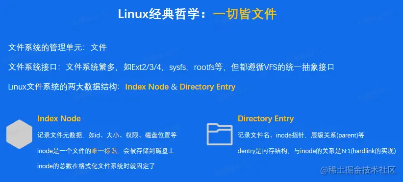

# 认识存储与数据库 ｜ 青训营笔记

## 01.经典案例


### 1.1 数据流动


### 1.2 数据持久化


### 1.3 潜在的问题


## 02.存储 & 数据库简介

### 2.1系统概览

Q: 什么是存储系统？
A: 一个提供了读写、控制类接口，能够安全有效的把数据持久化的软件，就可以称为`存储系统`


#### 2.1.1 系统特点


#### 2.1.2 存储器层级结构


#### 2.1.3 数据怎么从应用到存储介质


- `缓存`很重要，贯穿整个存储体系
- `拷贝`很昂贵，应该尽量减少
- 硬件设备五花八门，需要有抽象统一的接入层

#### 2.1.4 RAID技术

Q: 单机存储系统怎么做到`高性能`/`高性价比`/`高可靠性`？ A: `R`(edundant)`A`(rray)of`I`(nexpensive)`D`(isks)

冗余阵列廉价磁盘

> RAID 出现的背景：
>
> - 单块大容量磁盘的`价格` > 多块小容量磁盘
> - 单块磁盘的写入`性能` < 多块磁盘的并发写入性能
> - 单块磁盘的`容错能力`有限，不够安全
>
> ```
> RAID 0
> ```
>
> - 多块磁盘简单组合
> - 数据条带化存储，提高磁盘带宽
> - 没有额外的容错设计
>
> ```
> RAID 1
> ```
>
> - 一块磁盘对应一块额外镜像盘
> - 真是空间利用率仅50%
> - 容错能力强
>
> ```
> RAID 0 + 1
> ```
>
> - 结合了 RAID 0 和 RAID 1
> - 真实空间利用率仅50%
> - 容错能力强，写入带宽好

### 2.2 难道数据库和存储系统`不一样`吗？


#### 2.2.1 概览

`关系`（Relation）又是什么？

Edgar.F.Codd于1970年提出`关系模型`

关系 = `集合` = 任意元素组成的若干有序偶对。反映了事物间的关系

关系代数 = 对关系做`运算的抽象查询语言`

- 交、并、笛卡尔积......

SQL = 一种DSL = `方便人类阅读`的关系代数表达形式

#### 2.2.2 关系型数据库特点

```
关系型数据库是存储系统`，但是在存储之外，有发展出`其他能力
```


#### 2.2.3 非关系型数据库特点

非关系型数据库也是存储系统，但是`一般不要求严格的结构化` 

### 2.3 数据库 VS 经典存储

#### 2.3.1 结构化数据管理


#### 2.3.2 事务能力


凸显出数据库支持`事物`的优越性

事务具有：

- `A`(tomicity)，事务内的操作要么全做，要么不做
- `C`(onsistency)，事务执行前后，数据状态是一致的
- `I`(solation)，可以隔离多个并发事务，避免影响
- `D`(urability)，事务一旦提交成功，数据保证持久性

#### 2.3.3 复杂查询能力

Q: 写入数据之后，想做`很复杂的查询`怎么办？ Example：请查询出名字以xiao开头，且密码提示问题小于10个字的人，并按性别分组统计人数


### 2.4 数据库使用方式

Everything is `D`(omain)`S`(pecific)`L`(anguage) ------> maybe SQL

以SQL为例，要操作数据时，支持以下操作：

- Insert
- Update
- Delete
- Where子句
- GroupBy
- OrderBy 要对数据定义做修改时，支持以下操作：
- Create user
- Create database
- Create table
- Alter table
- ......

## 03. 主流产品剖析

小节大纲


### 3.1 单机存储

#### 3.1.1 概览


#### 3.1.2 本地文件系统



#### 3.1.3 key-value存储


### 3.2 分布式存储

#### 3.2.1 概览

分布式存储 = 在单机存储基础上实现了`分布式协议`，涉及大量网络交互


#### 3.2.2 HDFS


#### 3.2.3 Ceph

Ceph：开源分布式存储系统里的`万金油`


### 3.3 单机数据库

#### 3.3.1 概览


#### 3.3.2 关系型数据库


#### 3.3.3 非关系型数据库


#### 3.3.4 ElasticSearch使用案例


### 3.5 从单机到分布式数据库

单机数据库遇到了哪些问题 & 挑战，需要我们引入`分布式架构`来解决？


#### 3.5.1 分布式数据库-解决容量问题


#### 3.5.2 分布式数据库-解决弹性问题


#### 3.5.3 分布式数据库-解决性价比问题


#### 3.5.4 分布式数据库-More to Do


## 04.新技术演进

### 4.1 概览


### 4.2 SPDK


### 4.3 AI & Storage


### 4.4 高性能硬件


## 总结

> **存储系统**
>
> - 块存储：存储软件栈里的底层系统，接口过于朴素
> - 文件存储：日常使用最广泛的存储系统，接口十分友好，实现五花八门
> - 对象存储：公有云上的王牌产品，immutable语义加持
> - key-value存储：形式最灵活，存在大量的开源/黑河产品 **数据库系统**
> - 关系型数据库：基于关系和关系代数构建的，一般支持事务和SQL访问，使用体验友好的存储产品
> - 非关系型数据库：结构灵活，访问方式灵活，针对不同场景有不同的针对性产品 **分布式架构**
> - 数据分布策略：决定了数据怎么分不到集群里的多个物理节点，是否均匀，是否能做到高性能
> - 数据复制协议：营销观念IO路径的性能、机器故障场景的处理方式
> - 分布式事务算法：多个数据库节点协同保障一个事物的ACID特性的算法，通常基于2pc的思想设计

## `在存储 & 数据库领域，硬件反推软件变革十分常见`

## 小作业

