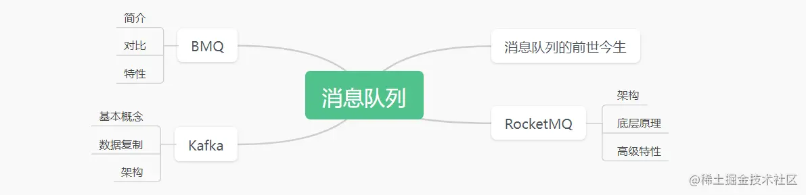
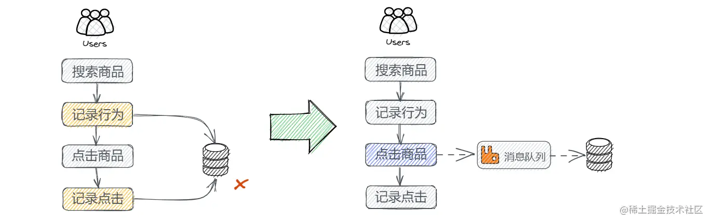
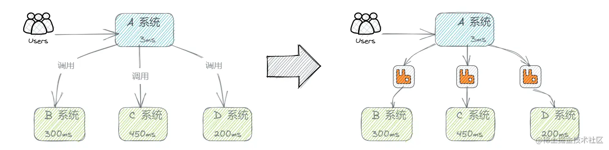
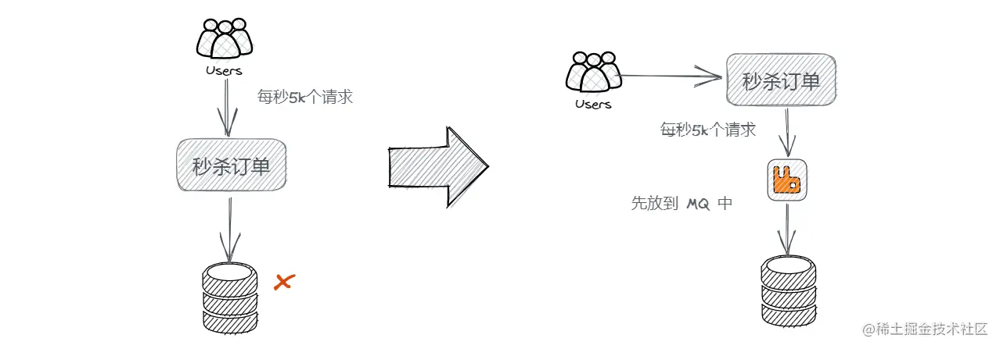
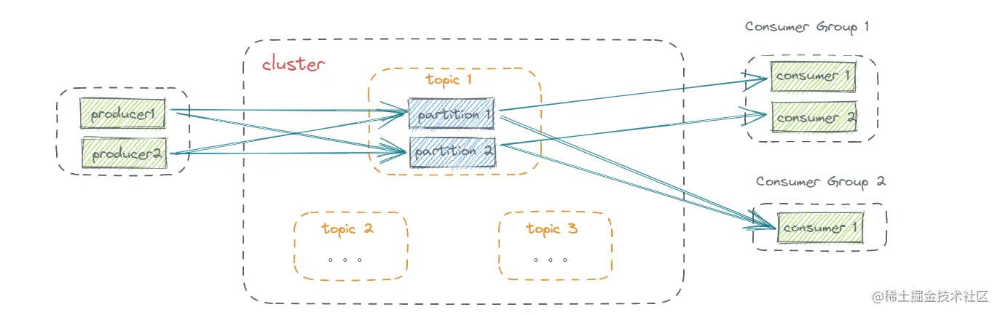
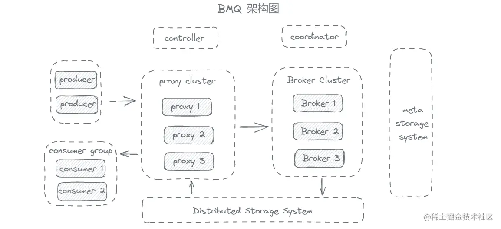
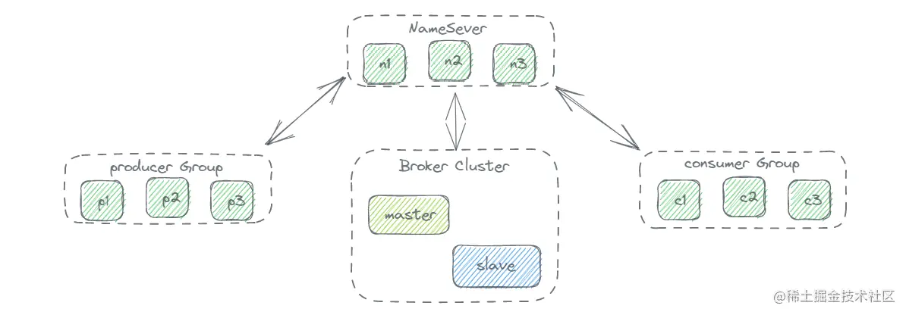

# 一次了解三种消息队列：Kafka、BMQ、RocketMQ | 青训营笔记

# 走进消息队列

**前言：**

本次课程从消息队列的应用场景、发展历史入手，引出了常见的消息队列类型，介绍了现在流行的三大消息队列：Kafka、BMQ、RocketMQ。

在 Kafka 部分，围绕使用场景，业务日志、用户行为数据、Metrics 数据展开，介绍一条消息从生产到消费的处理流程，最后基于 Kafka 在使用中遇到的问题引出了 BMQ 架构，讲解 BMQ 各模块在实际应用中如何工作以及 BMQ 多机房容灾相关知识点；最后对阿里的 RocketMQ 产品进行了对比介绍 ...

------

## 消息队列的前世今生

消息队列（MQ），指保存消息的一个容器，本质是个队列。要想称之为消息队列，这个队列要支持 **高吞吐**、**高并发** 并且 **高可用**。

### 应用场景

消息队列的使用场景有很多，常见的有：解耦、削峰、异步、日志处理。

##### 应用解耦

在传统架构中，各个模块之间需要相互调用，共享数据，每个模块都要关注其他模块是否更改了数据，是否正常运行等等，模块之间的耦合度很高。引入消息队列以后，将共享数据放入消息队列，各个模块对该数据感兴趣只需要订阅即可，模块的业务逻辑也相对独立，可以很大程度上避免模块间的调用，提高了系统的可扩展性。

##### 异步处理

在用户发起请求后，系统会调用下游接口，等待接口全部返回后才可以通知用户。如果下游接口返回的数据对于用户来说不是必要的，那么可以在用户发送请求后，把数据传给消息队列，然后直接告诉用户已经发送了信息，之后再把消息队列的数据发送到下游接口。

##### 流浪削峰

平常用户的请求会直接访问数据库，数据库的承压能力是有限的，如果访问量很大的时候，比如秒杀常见，很可能因为流量暴增导致整个业务挂掉，引入消息队列以后可以把请求存入消息队列，然后再慢慢处理。

 

##### 日志处理

在日志处理中引入消息队列，可以解决大量日志传输的问题。

### 发展历程

消息中间件最早可以追溯到 1983 年，印度孟买的小哥 Vivek 就设想了一种通用软件总线 - 世界上第一个现代消息队列软件The Information Bus（TIB），主要服务于金融机构；公司的业务发展引起了当时最牛气的 IT 公司 IBM 的注意， 于是他们开始研发了自己消息队列软件 wesphere mq，实际开发工作始于 1990 年，三年后，消息队列服务器软件 IBM MQ 产品系列面世。17 年后，MQ 系列进化成了 WebSphere MQ 并统治着商业消息队列平台市场。

接近 2000 年的时候，互联网时代已经初见曙光，全球的应用程序得到了极大地丰富，对于程序之间互联互通的需求越来越强烈，但是各大 IT 公司之间还是牢牢建立着各种技术壁垒。中小技术公司并不是唯一一个对高价格 MQ 供应商感到不满的，越是大型的金融公司越不可避免地使用来自众多供应商的 MQ 产品，来服务企业内部的不同应用。如果应用已经订阅了 TIBCO MQ 消息，若突然需要消费来自 IBM MQ 的消息，则实现起来会非常困难。这些产品使用不同的 API、不同的协议，因而毫无疑问无法联合起来组成单一的总线。为了解决这个问题，Java Message Service（JMS）在 2001 年诞生了，但 JMS 本质还是对 API 的封装。

时间到了 2004 年，随着互联网的蓬勃发展，AMQP（高级消息队列协议）诞生，促进了消息队列的繁荣。如今开源的消息中间件层出不穷，常见比较流行的有 ActiveMQ、RabbitMQ、Kafak、阿里的 RocketMQ，以及目前存算分离的 Pulsar，在目前互联网应用中消息队列中间件基本上成为标配。

------

## 消息队列 - Kafka

kafka 往往用于离线消息处理，类似服务器的日志信息反馈，分析，处理。同时也适用于处理程序运行的 Metrics 数据以及一些用户行为，如用户的搜索，点赞，评论，收藏。

#### Kafka 的使用

1. 首先需要创建一个 Kafka 集群；
2. 在这个集群中创建一个 Topic，并且设置好分片数量；
3. 编写生产者逻辑，引入对应语言的 SDK，配置好集群和 Topic 等参数，初始化一个生产者，调用 Send 方法发送消息；
4. 编写消费者逻辑，引入对应语言的 SDK，配置好集群和 Topic 等参数，初始化一个消费者，调用 Poll 方法接收消息。

#### 基本概念 & 架构

- **Topic**：逻辑队列，一个 Topic 中拥有多个分区（Partition），分区是可以并发处理的。
- **Cluster**：物理集群，每个集群中可以建立多个不同的 Topic。
- **Producer**：生产者，负责将业务消息发送到 Topic 中。
- **Consumer**：消费者，负责消费 Topic 中的消息。
- **ConsumerGroup**：消费者组，包含多个消费者，每个消费者的消费进度互不干涉。

这其中还涉及到 Topic 内的 offset(相对位置)，Replica（副本），以及副本分布相关概念：

- **Partition**：通常 Topic 会有多个分片，不同分片之间消息是可以并发来处理的，这样提高单个 Topic 的吞吐量。
- **Offset**：消息在 Partition 内的相对位置信息，可以理解为唯一 ID，在 Partition 内部严格递增。
- **Replica**：Partition 的副本，可用来容灾，这些副本有着不同的角色，分别是 Leader 和 Follower，Leader 对外服务，Follower 异步去拉取 Leader 的数据进行一个同步，如果 Leader 挂掉了，可以将 Follower 提升成 Leader 再对外进行服务。
- **ISR**：`同步中的副本`，对于 Follower 来说，始终和 Leader 是有一定差距的，但当这个差距比较小的时候，我们就可以将这个 Follower 副本加入到 ISR 中，不在 ISR 中的副本是不允许提升成 Leader 的。

在集群的基础上，还有一个模块是 **ZooKeeper**，这个模块其实是存储了集群的元数据信息，比如副本的分配信息等等，Controller 计算好的方案都会放到这个地方。

#### Kafka 运行流程

一条消息进入 kafka 处理的流程可简化为： `Producer -> Broker -> Consumer`，在这三个部分可以分别采取一些方案帮助 Kafka 提高吞吐或者稳定性。

##### Producer 端逻辑

*1. **批量发送**：*

- 为了应对大消息量的场景，采取批量发送机制，通过一次性发送多个消息从而减少 I/O 次数，加强发送能力。

*2. **消息压缩**：*

- 在消息容量太大，带宽较小，导致发送速度慢的场景下，kafka 提供了消息压缩，通过对消息进行压缩处理减小消息的大小。（一般使用Snappy算法）

##### Broker 端逻辑

*1. Broker 写入：*

在前面提到了一个 Topic 会有多个 Partition，而每个 partition 都可以通过数据复制产生对应的副本。所以在存储过程中，kafka 会通过副本生成日志，将日志写入磁盘，而这些日志显然是有时效的，因此根据存入的有效时间存入不同的日志段（LogSegment）。

此外根据磁盘的结构，采用顺序写的方式进行写入，可以提高写入效率。

*2. Broker 读取：*

Consumer 通过发送 FetchRequest 请求消息数据，Broker 通过索引取出消息，按照时间窗口和信息大小发送给 Consumer。Broker 有两种文件索引方式：

- 偏移量索引：通过二分法寻找小于目标 offset 的最大文件。
- 时间戳索引：通过二分法找到小于目标时间戳最大的索引位置。

*3. 数据拷贝：*

不同于传统拷贝方式，kafka 拷贝数据的流程不经过用户态空间，而是在读取磁盘后直接将 Read Buffer 中的数据传输到 NIC Buffer，通过 NIC Buffer 直接交付给消费者进程。这种拷贝方式减少了在不同进程与缓存中进行数据拷贝的次数，从而提高了读取效率。

##### Consumer 端逻辑

Consumer 端主要考虑分配的问题，也就是对于每一个 partition 来讲，该由哪一个 consumer 来消费。一般有两种解决办法：

- 手动分配（low level）：在启动的时候分配任务，哪个 Consumer 负责拉取哪几个 partition，但是万一其中一个 Consumer 宕机，就会导致无法拉取到完全的 partition。
- 自动分配（high level）：对于每一个消费者组，都会选择一个 Broker 作为一个协调者 Coordinator，这个协调者负责分配各个消费者获取 partition 的任务，这使得可以动态调整各个 Consumer 的任务。

#### Kafka 的缺点

kafka 的升级，替换，扩缩容流程很繁琐，由于 kafka 只能单台重启，同时重启后还要经历数据同步与 leader 回调的步骤，因此在执行升级和扩缩容时会产生很大的时间开销，同时由于 kafka 缺少负载均衡与缓存手段，因此 kafka 面临负载不均衡的问题以及依赖外部 Cache。

总结其缺点如下：

- 运维成本高；
- 负载不均衡，解决方案复杂；
- 没有自己的缓存，需要依赖外部Cache;
- 若 Controller 和 Coordinator 与 Broker 在同一个进程中，大量 I/O 会导致性能下降。

------

## 消息队列 - BMQ

BMQ 是字节跳动出品的消息队列产品，解决了 Kafka 在实际应用中的诸多问题。

#### BMQ 架构模型

BMQ 兼容 Kafka 协议，支持存算分离，支持云原生消息队列。

- 新增 Proxy 层作为代理；
- Coordinator 和 Controller 可以独立部署；
- 底层新增 HDFS 用于存算分离。

#### BMQ 读写流程

在 BMQ 中，客户端写入前会选择一定数量的 DataNode，这个数量一般是副本数，然后将一个文件写入到这几个节点上，切换到下一个 segment 之后，又会重新选择节点进行写入。这样对于单个副本的所有 segment，会随机写入到集群当中。

对于写入逻辑，BMQ 还有一个状态机的机制（Broker-Partition），用来保证不会出现同一个分片在两个 Broker 上同时启动的情况，另外也能保证一个分片的正常运行。

BMQ 的具体写入过程：

1. CRC 数据校验参数是否合法；
2. 校验完成后，会把数据放入 Buffer 中；
3. 通过一个异步的 Write 线程将数据最终写入到底层的存储系统。

------

## 消息队列 - RocketMQ

RocketMQ 是阿里出品的消息队列，针对电商业务线，其业务涉及广泛，如注册、订单、库存、物流等；同时，也会涉及许多业务峰值时刻，如秒杀活动、周年庆、定期特惠等。

🎈官方文档：[rocketmq.apache.org/docs/](https://link.juejin.cn/?target=https%3A%2F%2Frocketmq.apache.org%2Fdocs%2F)

#### RocketMQ 基本架构

和 Kafka 类似，有 Producer，Consumer, Broker 这三个部分，Kafka 中的 Partition 概念在 RocketMQ 叫做 ConsumerQueue。

- 数据流通过 Producer 发送给 Broker 集群，再由 Consumer 进行消费；
- Broker 节点有 Master 和 Slave 的概念；
- NameServer 为集群提供轻量级服务发现和路由。

#### 高级特性

RocketMQ 提供了一些高级特性，支持事务，支持延迟消息，支持消息重试和死信队列。

在实际地应用中，库存服务和消息队列需要在一个事务内来保证 ACID 特性，事务的支持使得 RocketMQ 可以很好地应对购物场景。
