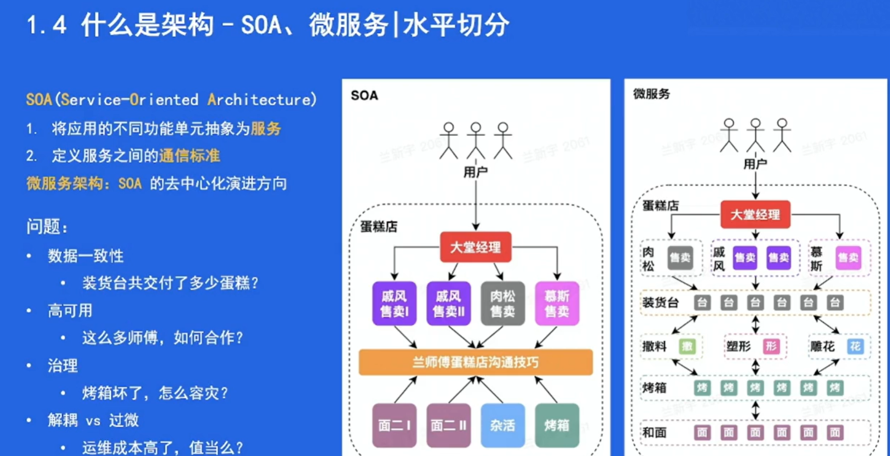
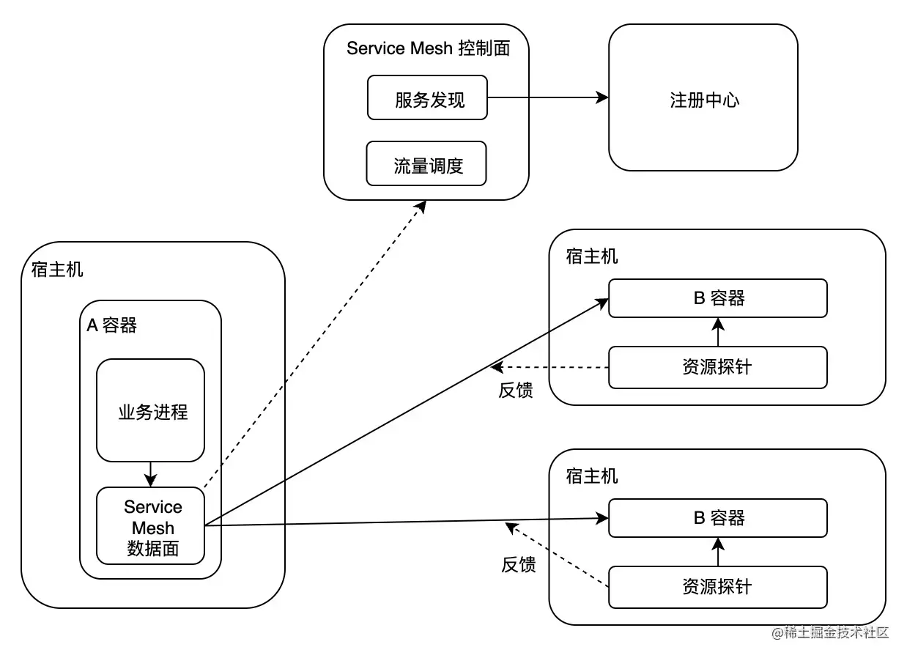

# 架构初探（2月1日） ｜ 青训营笔记

[tmoon](https://juejin.cn/user/3576032496715229/posts)

2023-02-01 22:5319

**这是我参与「第五届青训营 」伴学笔记创作活动的第 7 天**

## 一、本堂课重点内容：

##### 1. 什么是架构

##### 2. 企业级后端架构刨析

##### 3. 企业级后端架构的挑战

##### 4. 后端架构实战

## 二、详细知识点介绍：

##### 1. 什么是架构

- **架构定义**

  - 是有关软件整体结构与组件的抽象描述
  - 用于指导软件系统各个方面的设计
  - 良好的架构基础，也为软件的未来发展提供了更多的可能。为用户赋能，实现自身价值

- **单机架构**

  - All in one，所有的东西都在一个进程里，部署在一个机器上。

  优点：

  - 简单

  缺点：

  - 运维需要停服，用户体验较差
  - 承载能力有限。

- **单体架构**

  - 在单机架构的基础上，将进程部署到多个机器上。

  优点：

  - 具备水平扩容能力
  - 运维不需要停服

  缺点：

  - 后端进程职责太多，越来越臃肿
  - 爆炸半径较大，进程中一个很小的模块出现问题，都可能导致整个进程崩溃

- **垂直应用架构**

  在单机架构基础上，将进程按照某种依据切分开。比如，A 软件和 B 软件的后端原先采用单机架构部署，那就是一个进程部署在多个机器上；如果用垂直应用架构，可以将 A 和 B 的后端拆分为 A、B 两个进程，然后再按照单体模式的思路，部署在多个机器上。

  优点：

  - 一定程度上减少了后端进程职责
  - 一定程度上缩小爆炸半径

  缺点：

  - 没有根本解决单体架构的问题

- **SOA (面向服务架构)**

- 

  SOA 架构中，服务为一等公民，将进程按照不同的功能单元进行抽象，拆分为『服务』。有了服务之后，SOA 还为服务之间的通信定义了标准，保证各个服务之间通讯体验的一致性。

  优点：

  - 各服务的职责更清晰
  - 运维粒度减小到服务，爆炸半径可控

  缺点：

  - ESB (企业服务总线) 往往需要一整套解决方案

**微服务**

在 SOA 架构中，ESB 起到了至关重要的作用。但从架构拓扑来看，它更像是一个集中式的模块。有一个 SOA 分布式演进的分支，最终的形态便是微服务。

优点：

- 兼具 SOA 解决的问题
- 服务间的通信更敏捷、灵活

缺点：

- 运维成本

##### 2. 企业级后端架构刨析

- **云计算**

云计算基础：

- 虚拟化技术
  - 硬件层面（VM 虚拟机）- KVM/Xen/VMware
  - 操作系统层面（Container 容器）- LCX/Docker/Kata Container
  - 网络层面 - Linux Bridge/Open v Switch
- 编排方案
  - VM - OpenStack/VMWare Workstation
  - Container - Kubernetes/Docker Swarm

云计算架构：

- 云服务
  - IaaS - 云基础设施，对底层硬件资源池的抽象
  - PaaS - 基于资源池抽象，对上层提供的弹性资源平台
  - SaaS - 基于弹性资源平台构建的云服务
  - FaaS - 更轻量级的函数服务。好比 LeetCode 等 OJ，刷题时只需要实现函数，不需要关注输入输出流
- 云部署模式（拓展）
  - 私有云 - 企业自用
  - 公有云 - AWS/Azure/Google Cloud/Huawei
  - 混合云

- **云原生**

  云原生，实际是云原生（计算）的简称，它是云计算发展到现在的一种形态。

  云原生技术为组织（公司）在公有云、自由云、混合云等新型的动态环境中，构建和运行可弹性拓展的应用提供了可能。 它的代表技术：

  - 弹性资源
  - 微服务架构
  - DevOps
  - 服务网格

- **弹性资源**

基于虚拟化技术，提供的可以快速扩缩容的能力。可以分为弹性计算资源和弹性存储资源两个方面。

弹性计算资源：

- 计算资源调度
  - 在线计算 - 互联网后端服务
  - 离线计算 - 大数据分析。Map-Reduce/Spark/Flinnk
- 消息队列
  - 在线队列 - 削峰、解耦
  - 离线队列 - 结合数据分析的一整套方案，如 ELK

弹性存储资源：

- 经典存储
  - 对象存储 - 视频、图片等。结合 CDN 等技术，可以为应用提供丰富的多媒体能力
  - 大数据存储 - 应用日志、用户数据等。结合数据挖掘、机器学习等技术，提高应用的体验
- 关系型数据库
- 元数据
  - 服务发现
- NoSQL
  - KV 存储 - Redis
  - 文档存储 - Mongo

在云原生的大背景下，不论是计算资源还是存储资源，他们都像是服务一样供用户使用。

- **微服务架构**

  微服务架构下，服务之间的通讯标准是基于协议而不是 ESB 的。

  - HTTP - H1/H2
  - RPC - Apache Thrift/gRPC

  如何在 HTTP 和 RPC 之间选择？

  - 性能 - RPC 协议往往具备较好的压缩率，性能较高。如 Thrift, Protocol Buffers
  - 服务治理 - RPC 中间件往往集成了丰富的服务治理能力。如 熔断、降级、超时等
  - 可解释性 - HTTP 通信的协议往往首选 JSON，可解释性、可调试性更好

- **服务网络**

  什么是服务网格？

  - 微服务之间通讯的中间层
  - 一个高性能的 4 层网络代理
  - 将流量层面的逻辑与业务进程解耦

  没有什么是加一层代理解决不了的问题，服务网格相比较于 RPC/HTTP 框架：

  - 实现了异构系统治理体验的统一化
  - 服务网格的数据平面代理与业务进程采取进程间通信的模式，使得流量相关的逻辑（包含治理）与业务进程解耦，生命周期也更容易管理

##### 3. 企业级后端架构的挑战

**基础设施层面**：

Q：我们总说，云是弹性的，也就是说，在用户的角度，云提供的资源是无限的。然而，云背后的物理资源是有限的。在企业级后端架构里，云如何解决近乎无限的弹性资源和有限的物理资源之间的矛盾？

Q：闲事的资源就这么空着呢？如何提高资源利用率，提高物理资源的价值转换率？

**用户层面**：

Q：上了云原生微服务后，服务之间的通信开销较大，应该如何做成本优化？

Q：微服务看起来没有那么美好，抖动导致的运维成本较高，如何解决？

Q：异构的物理环境应该对用户是透明的，如何屏蔽这些细节？

##### 4. 后端架构实战

#### 问题

如何设计一个根据主机层面的资源信息，实时进行流量调度的系统，打平不同宿主机异构环境的算力差异。

关键点：

- 紧急回滚能力
- 大规模
- 极端场景

